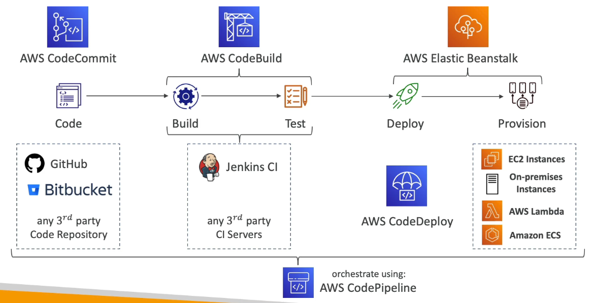

# Table of Contents

- [Table of Contents](#table-of-contents)
- [CICD - Introduction](#cicd---introduction)
- [AWS CodeCommit](#aws-codecommit)
  - [AWS CodeCommit: Overview](#aws-codecommit-overview)
  - [AWS CodeCommit: Why use CodeCommit?](#aws-codecommit-why-use-codecommit)
  - [Actions: Create a Repository](#actions-create-a-repository)
    - [Create a Repository: Using Console](#create-a-repository-using-console)
    - [Create a Repository: Using AWS CLI](#create-a-repository-using-aws-cli)
  - [Actions: List all Repositories (using CLI)](#actions-list-all-repositories-using-cli)
  - [Actions: Add a File to a Repository (Specific branch)](#actions-add-a-file-to-a-repository-specific-branch)
    - [Add a File to a Repository: Using CLI](#add-a-file-to-a-repository-using-cli)
  - [Actions: Delete a Repository](#actions-delete-a-repository)
    - [Delete a Repository: Using Console](#delete-a-repository-using-console)
    - [Delete a Repository: Using CLI](#delete-a-repository-using-cli)
- [CodeCommit and Git Workflow](#codecommit-and-git-workflow)

--

# CICD - Introduction

CICD stands for Continuous Integration, Continuous Delivery. The idea is that manual deployment could lead to errors because of the various processes that must be undertaken before an application is deployed. We must automate this process so as to make this entire pipeline from storing code systematically, making sure it is built and tested before deployment, with possibility to go into different stages (dev, test, staging, prod), with or without manual approval. That's where the CICD pipeline comes in.

- **Continuous Integration (CI)**: Developers frequently push code to a code repository (e.g. GitHub, AWS CodeCommit, Bitbucket, GitLab)

  - A testing / build server checks the code as soon as it is published (AWS CodeBuild, Jenkins CI, GitHub Actions)
  - The developer gets feedback about the tests and checks that have passed / failed. This helps find bugs early, then fix bugs early.
  - Improves code deliverability and deployment cycle as the code is tested when pushed to the repository. Developers can reliably commit code without worry.

- **Continuous Delivery (CD)**: The goal of continuous delivery is to ensure software can be released reliably whenever needed.

  - Wait for CI to complete
  - A deployment server deploys the application to our application servers
  - The mentality shift is to move away from "one release every 3 months" to upto "5 releases a day"
  - This usually means automated deployment (e.g. AWS CodeDeploy, Jenkins CD, Spinnaker, GitHub Releases)

- AWS Services used in the CICD pipeline:
  - **[AWS CodeCommit](codecommit)**: Storing our code
  - **[AWS CodePipeline](codepipeline)**: Automating our pipeline from code to Elastic Beanstalk
  - **[AWS CodeBuild](codebuild)**: Building and testing our code
  - **[AWS CodeDeploy](codedeploy)**: Deploying the code to EC2 instances (not Elastic Beanstalk but otherwise)
  - **[AWS CodeStar](codestar)**: Managing Software Development activities in one place
  - **[AWS CodeArtifact](codeartifact)**: Store, Publish and share software packages
  - **[AWS CodeGuru](codeguru)**: Automated Code reviews using Machine Learning

---
