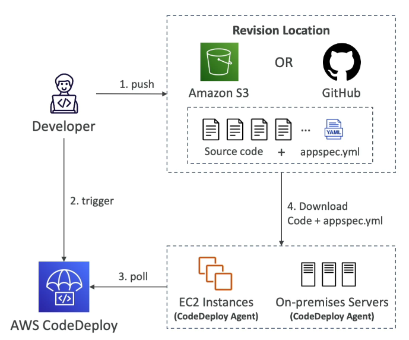
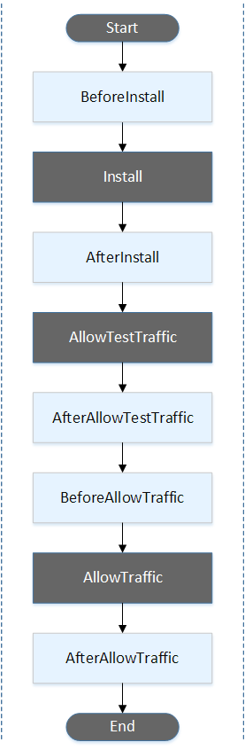
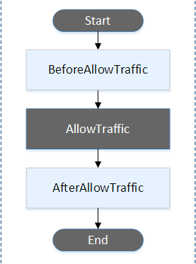
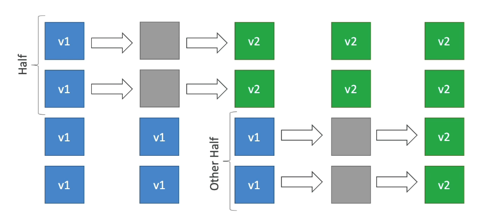
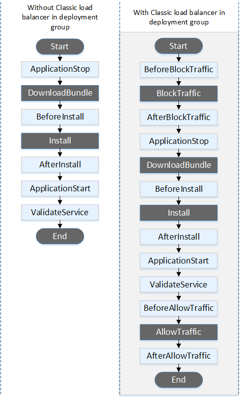
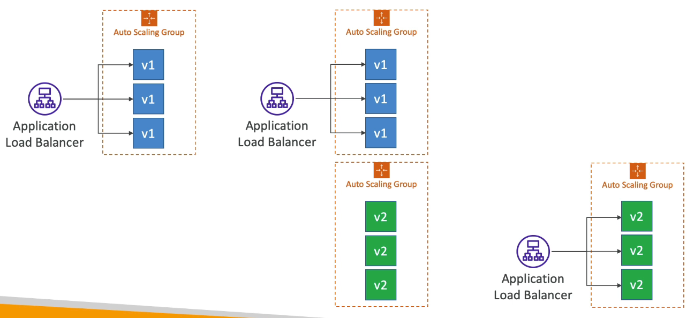
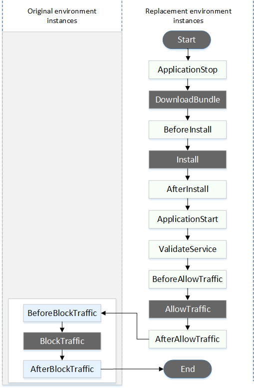

# Table of Contents

- [Table of Contents](#table-of-contents)
- [Overview](#overview)
- [Primary Components](#primary-components)
- [The `appspec.yml` file](#the-appspecyml-file)
- [Deployment Configurations for EC2 Instances](#deployment-configurations-for-ec2-instances)
- [Deploying to a Single EC2 Instance](#deploying-to-a-single-ec2-instance)
  - [Required Steps](#required-steps)
  - [Create IAM Roles](#create-iam-roles)
  - [Creating an Application](#creating-an-application)
  - [Install CodeDeploy Agent on the EC2 Instance (Deployment Server)](#install-codedeploy-agent-on-the-ec2-instance-deployment-server)
  - [Create Deployment Group](#create-deployment-group)
  - [Upload the Application to Amazon S3](#upload-the-application-to-amazon-s3)
  - [Create a Deployment](#create-a-deployment)
- [Deploying to an Auto-Scaling Group (ASG)](#deploying-to-an-auto-scaling-group-asg)
  - [Overview](#overview-1)
- [Redeploy \& Rollbacks](#redeploy--rollbacks)
- [References](#references)

---

# Overview

AWS CodeDeploy is a fully managed deployment service that automates software deployments to compute services such as Amazon EC2, AWS Lambda, and your on-premises servers. AWS CodeDeploy makes it easier for you to rapidly release new features, helps you avoid downtime during application deployment, and handles the complexity of updating your applications.

- There are several ways to handle deployments using open source tools such as Ansible, Terraform, Chef, Puppet etc.
- AWS CodeDeploy is a managed service by AWS to achieve the same as the above open source tools.

- **Making it work**:

  

  - Each EC2 instance / on-premise server MUST be running the **AWS CodeDeploy Agent**.
  - Developer pushes the code `AWS CodeCommit`, `Amazon S3`, `GitHub` or `Bitbucket`.
  - The root of the source code must contain an **`appspec.yml`** file to tell **`AWS CodeDeploy`** how to deploy the application.
  - The Developer triggers **`AWS CodeDeploy`** that a deployment is necessary. The **`AWS CodeDeploy Agent(s)`** continue to poll CodeDeploy for pending deployment work.
  - If a deployment is found to be necessary / the AWS CodeDeploy Agent finds pending deployment(s), the Application source code containing the **`appspec.yml`** is pulled from the repository location (Amazon S3, GitHub or Bitbucket) into the application deployment servers (EC2 instances).
  - These EC2 instances will run the deployment instructions specified in **`appspec.yml`**.
  - AWS CodeDeploy Agent will report the success/failure of the deployment into the CodeDeploy service.

- **Use Cases**:
  - Rapidly release new features.
  - Update AWS Lambda function versions.
  - Avoid downtime during application deployment.
  - Handle the complexity of updating your applications, without many of the risks associated with error-prone manual deployments.

---

# Primary Components

- **Application**: A unique name; Functions as a container (revision, deployment, configuration etc)

- **Compute Platform**: EC2 / On-premises, AWS Lambda or Amazon ECS

- **Deployment Configuration**: A set of deployment rules for success or failure

  - **EC2/On premises**: Specify the minimum number of healthy instances for the deployment
  - **AWS Lambda or ECS**: Specify how the traffic is routed to your updated versions

- **Deployment Group**: Group of tagged EC2 Instances (allows to deploy gradually, or to have a dev, test, prod group)

- **Deployment Type**: Method used to deploy the application to a Deployment Group

  - **In-place Deployment**: Supports EC2/On-premises
  - **Blue/Green Deployment**: Supports EC2 Instances only, AWS Lambda and Amazon ECS

- **IAM Instance Profile**: Gives EC2 Instances the permissions to access both S3 / GitHub

- **Application Revision**: Combination of Application code + **`appspec.yml`** file

- **Service Role**: An IAM Role for CodeDeploy to perform operations on EC2 Instances, ASGs, ELBs etc.

- **Target Revision**: The most recent revision that you want to deploy to a Deployment Group.

---

# The `appspec.yml` file

If your application uses the EC2/On-Premises compute platform, the AppSpec file must be a YAML-formatted file named `appspec.yml` and it must be placed in the root of the directory structure of an application's source code. Otherwise, deployments fail. It is used by CodeDeploy to determine:

- What it should install onto your instances from your application revision in Amazon S3 or GitHub.
- Which lifecycle event hooks to run in response to deployment lifecycle events.

After you have a completed AppSpec file, you bundle it, along with the content to deploy, into an archive file (zip, tar, or compressed tar).

**Syntax:**

```yml
version: 0.0
os: linux
files:
  - source: /
    destination: /var/www/html/WordPress
file_exists_behavior: DISALLOW | OVERWRITE | RETAIN
hooks:
  BeforeInstall:
    - location: scripts/install_dependencies.sh
      timeout: 300
      runas: root
  AfterInstall:
    - location: scripts/change_permissions.sh
      timeout: 300
      runas: root
  ApplicationStart:
    - location: scripts/start_server.sh
    - location: scripts/create_test_db.sh
      timeout: 300
      runas: root
  ApplicationStop:
    - location: scripts/stop_server.sh
      timeout: 300
      runas: root
```

Where,

- **`files`**: How to source and copy files from S3 / GitHub to filesystem - List of `source` and `destination` fields. Multiple source and destination key-pairs can be set. `source` and `destination` are each specified with a string. (**REQUIRED**)

  - **`source`**: Identifies a file or directory from your revision to copy to the instance:

    - If `source` refers to a file, only the specified files are copied to the instance.
    - If `source` refers to a directory, then all files in the directory are copied to the instance.
    - If `source` is a single slash ("/" for Amazon Linux, RHEL, and Ubuntu Server instances, or "\" for Windows Server instances), then all of the files from your revision are copied to the instance.

  - **`destination`**: Identifies the location on the instance where the files should be copied. This must be a fully qualified path such as `/root/destination/directory` (on Linux, RHEL, and Ubuntu) or `c:\destination\folder` (on Windows).

- **`file_exists_behaviour`**: Specifies how CodeDeploy handles files that already exist in a deployment target location but weren't part of the previous successful deployment. (**OPTIONAL**)

  This setting can take any of the following values:

  - **`DISALLOW`**: The deployment fails. This is also the default behavior if no option is specified.
  - **`OVERWRITE`**: The version of the file from the application revision currently being deployed replaces the version already on the instance.
  - **`RETAIN`**: The version of the file already on the instance is kept and used as part of the new deployment.

  When using the **`file_exists_behavior`** setting, understand that this setting:

  - Can only be specified once, and applies to all files and directories listed under **`files:`**.
  - Takes precedence over the **`--file-exists-behavior`** AWS CLI option and the **`fileExistsBehavior`** API option (both of which are also optional).

- **`hooks`**: Set of instructions to do to deploy the new version (hooks can have timeouts). The content in the `'hooks'` section of the AppSpec file varies, depending on the compute platform for your deployment. The `'hooks'` section for an EC2/On-Premises deployment contains mappings that link deployment lifecycle event hooks to one or more scripts. The `'hooks'` section for a Lambda or an Amazon ECS deployment specifies Lambda validation functions to run during a deployment lifecycle event. If an event hook is not present, no operation is executed for that event. This section is required only if you are running scripts or Lambda validation functions as part of the deployment.

  Can specify multiple hooks for a single lifecycle event as a list of dictionaries containing `location`, `timeout`, `runas` keys that look like:

  ```yml
  hooks:
  AfterInstall:
    - location: Scripts/RunResourceTests.sh
      timeout: 180
      runas: root
    - location: Scripts/PostDeploy.sh
      timeout: 180
      runas: root
  ```

  Check [Documentation](https://docs.aws.amazon.com/codedeploy/latest/userguide/reference-appspec-file-structure-hooks.html) for details

  The list of available Lifecycle hooks vary based on the type of deployment:

  1. **Amazon ECS Deployment**

     The order of the hooks:

     

     - **`BeforeInstall`**: Use to run tasks before the replacement task set is created. One target group is associated with the original task set. If an optional test listener is specified, it is associated with the original task set. A rollback is not possible at this point.
     - **`Install`**: This event is reserved for the CodeDeploy agent and cannot be used to run scripts.
     - **`AfterInstall`**: Use to run tasks after the replacement task set is created and one of the target groups is associated with it. If an optional test listener is specified, it is associated with the original task set. The results of a hook function at this lifecycle event can trigger a rollback.
     - **`AllowTestTraffic`**: This event is reserved for the CodeDeploy agent and cannot be used to run scripts.
     - **`AfterAllowTestTraffic`**: Use to run tasks after the test listener serves traffic to the replacement task set. The results of a hook function at this point can trigger a rollback.
     - **`BeforeAllowTraffic`**: Use to run tasks after the second target group is associated with the replacement task set, but before traffic is shifted to the replacement task set. The results of a hook function at this lifecycle event can trigger a rollback.
     - **`AllowTraffic`**: This event is reserved for the CodeDeploy agent and cannot be used to run scripts.
     - **`AfterAllowTraffic`**: Use to run tasks after the second target group serves traffic to the replacement task set. The results of a hook function at this lifecycle event can trigger a rollback.

  2. **AWS Lambda**

     The order of the hooks:

     

     - **`BeforeAllowTraffic`**: Use to run tasks before traffic is shifted to the deployed Lambda function version.
     - **`AllowTraffic`**
     - **`AfterAllowTraffic`**: Use to run tasks after all traffic is shifted to the deployed Lambda function version.

  3. **EC2/On-Premises Deployment**

     The order of the hooks:

     - **In-place deployments**

       

       > **Note**: For in-place deployments, the six hooks related to blocking and allowing traffic apply only if you specify a Classic Load Balancer, Application Load Balancer, or Network Load Balancer from Elastic Load Balancing in the deployment group.

       

     - **Blue/green deployments**

       

       

     - **`BeforeBlockTraffic`** (only for Classic Load Balancer): You can use this deployment lifecycle event to run tasks on instances before they are deregistered from a load balancer.
     - **`BlockTraffic`** (only for Classic Load Balancer): During this deployment lifecycle event, internet traffic is blocked from accessing instances that are currently serving traffic. This event is reserved for the CodeDeploy agent and cannot be used to run scripts.
     - **`AfterBlockTraffic`** (only for Classic Load Balancer): You can use this deployment lifecycle event to run tasks on instances after they are deregistered from a load balancer.

     - **`ApplicationStop`**: This deployment lifecycle event occurs even before the application revision is downloaded. You can specify scripts for this event to gracefully stop the application or remove currently installed packages in preparation for a deployment. The AppSpec file and scripts used for this deployment lifecycle event are from the previous successfully deployed application revision.

       **Note**: An AppSpec file does not exist on an instance before you deploy to it. For this reason, the ApplicationStop hook does not run the first time you deploy to the instance. You can use the ApplicationStop hook the second time you deploy to an instance.

     - **`DownloadBundle`**: During this deployment lifecycle event, the CodeDeploy agent copies the application revision files to a temporary location. This event is reserved for the CodeDeploy agent and cannot be used to run scripts.
     - **`BeforeInstall`**: You can use this deployment lifecycle event for preinstall tasks, such as decrypting files and creating a backup of the current version.
     - **`Install`**: During this deployment lifecycle event, the CodeDeploy agent copies the revision files from the temporary location to the final destination folder. This event is reserved for the CodeDeploy agent and cannot be used to run scripts.
     - **`AfterInstall`**: You can use this deployment lifecycle event for tasks such as configuring your application or changing file permissions.
     - **`ApplicationStart`**: You typically use this deployment lifecycle event to restart services that were stopped during **`ApplicationStop`**.
     - **`ValidateService`**: This is the last deployment lifecycle event. It is used to verify the deployment was completed successfully.

     - **`BeforeAllowTraffic`** (only for Classic Load Balancer): You can use this deployment lifecycle event to run tasks on instances before they are registered with a load balancer.
     - **`AllowTraffic`** (only for Classic Load Balancer): During this deployment lifecycle event, internet traffic is allowed to access instances after a deployment. This event is reserved for the CodeDeploy agent and cannot be used to run scripts.
     - **`AfterAllowTraffic`** (only for Classic Load Balancer): You can use this deployment lifecycle event to run tasks on instances after they are registered with a load balancer.

---

# Deployment Configurations for EC2 Instances

- **Configrations**:

  - **One at a Time**: One EC2 Instance at a time, if one instance fails then deployment stops
  - **Half at a Time**: Take 50% of the instances and upgrade them from old to new version and then follow with the other half
  - **All at Once**: Quick but if there's no healthy host, there's going to be downtime. Good for development.
  - **Custom**: E.g. minimum Healthy host = 75%

- **Failures**:

  - How many failures of EC2 Instances in "Failed" state, should we encounter before we call the whole deployment as a failure
  - New deployments will be first deployed to failed instances
  - To rollback, redeploy old deployment or enable automated rollback for failures

- **Deployment Groups**:
  - A set of tagged EC2 Instances
  - Directly to an ASG
  - Mix of ASG / Tags so you can build deployment segments
  - Customization in your scripts with **`DEPLOYMENT_GROUP_NAME`** environment variables to identify in which deployment group you are

---

# Deploying to a Single EC2 Instance

## Required Steps

1. **[Create IAM Roles](#create-iam-roles)**
2. **[Create Application from CodeDeploy Console](#creating-an-application)**
3. **[Install CodeDeploy Agent on the EC2 Instance (Deployment Server)](#install-codedeploy-agent-on-the-ec2-instance-deployment-server)**
4. **[Create Deployment Group](#create-deployment-group)**
5. **[Upload the Application to Amazon S3](#upload-the-application-to-amazon-s3)**
6. **[Create Deployment](#create-a-deployment)**

---

## Create IAM Roles

- Before we Create an Application, we need to create two IAM Roles.

  - **Create a CodeDeploy Service Role**: Give permissions for AWS CodeDeploy for EC2
  - **Create an EC2 Service Role**: We will create an EC2 Instance that will be running the CodeDeploy agent. For the EC2 Instance to be able to pull data from Amazon S3.

---

## Creating an Application

- Go to **[CodeDeploy Console](https://ap-south-1.console.aws.amazon.com/codesuite/codedeploy/start)** and click **`Create Application`**
- Enter the following configuration:

  1. **Application configuration**:

     - **Application name**: Enter an application name

     - **Compute platform**: Choose a compute platform. Options are:

       - **`EC2/On-premises`**
       - **`AWS Lambda`**
       - **`Amazon ECS`**

- Click **`Create application`** to create an Application that now is ready to have Deployment Groups.

- We need to create a Deployment Group. But before that, we need to first create an EC2 Instance that we can deploy to, with the EC2 Instance Role as the Service Role we set earlier.

---

## Install CodeDeploy Agent on the EC2 Instance (Deployment Server)

- By default the EC2 Instance doesn't come installed with the **CodeDeploy Agent**. We need to first **[SSH into the EC2 Instance](../../ec2/README.md#ssh-login-using-linux-or-mac)** to install the CodeDeploy Agent.

- **CodeDeploy Agent - Installation**

  1. [Install the CodeDeploy Agent for Amazon Linux or RHEL](https://docs.aws.amazon.com/codedeploy/latest/userguide/codedeploy-agent-operations-install-linux.html)
  2. [Install the CodeDeploy Agent for Ubuntu Server](https://docs.aws.amazon.com/codedeploy/latest/userguide/codedeploy-agent-operations-install-ubuntu.html)
  3. [Install the CodeDeploy Agent for Windows Server](https://docs.aws.amazon.com/codedeploy/latest/userguide/codedeploy-agent-operations-install-windows.html)

- Before we Create our Deployment Group, we need to **Tag** our EC2 Instances. Let's go to our EC2 Instances, Select the Instance, Select the **`Tags`** tab and create a Tag => `Environment: Dev`.

---

## Create Deployment Group

- Back in **`CodeDeploy`**, we select our Application, go to the **`Deployment groups`** tab and click **`Create deployment group`**.

- Enter the following configuration:

  1. **Deployment group name**:

     - **Enter a deployment group name**: 100 character limit

  2. **Service role**:

     - **Choose a service role**: The CodeDeploy service role we created in the IAM earlier that gives permissions to S3.

  3. **Deployment type**:

     - **Choose how to deploy your application**:

       - **`In-place`**: Updates the instances in the deployment group with the latest application revisions. During a deployment, each instance will be briefly taken offline for its update.
       - **`Blue-green`**: Replaces the instances in the deployment group with the new instances and deploys the latest application revision to them. After instances in the replacement environment are registered with a load balancer (mandatory), Instances from the original environment are deregistered and can be terminated.

  4. **Environment configuration**: Select any combination of Amazon EC2 Auto Scaling Groups, Amazon EC2 Instances and on-premises instances to add to this deployment.

     You can add up to three groups of tags for EC2 instances to this deployment group.
     **One tag group**: Any instance identified by the tag group will be deployed to. (We will select the Tag => `Environment: Dev`)
     **Multiple tag group**: Only instances identified by all tag groups will be deployed to.

     - Amazon EC2 Auto Scaling groups
     - Amazon EC2 Instances
     - On-premises instances

  5. **Deployment settings**:

     - **Deployment configuration**: Choose from a list of default and custom deployment configurations. A deployment configuration is a set of rules that determines how fast an application will be deployed and the success or failure conditions for deployment. Strategy options available:

       - **`One at a Time`**
       - **`Half at a Time`**
       - **`All at Once`**
       - **`Create deployment configuration`** (Custom)

  6. **Load balancer**: Select a load balancer to manage incoming traffic during the deployment process. The load balancer blocks traffic from each instance while it's being deployed to and allows to it again after the deployment succeeds.

     - **Enable load balancing**: `Enable` / `Disable`
       - **`Application Load Balancer or Network Load Balancer`**
       - **`Classic Load Balancer`**

- Click **`Create deployment group`** to finish configurations and create the Deployment Group

---

## Upload the Application to Amazon S3

- Go to S3 Console and click **[Create a bucket](https://us-east-1.console.aws.amazon.com/s3/bucket/create?region=ap-south-1)**
- Make sure the Application is Zipped and contains a **`appspec.yml`** containing the specifications as described [above](#the-appspecyml-file) and upload it to the S3 bucket.
- Copy the path to the uploaded Application Zip.

---

## Create a Deployment

- Select the Application from CodeDeploy Console and go to the **`Deployments`** tab.

- Click the **`Create Deployment`** button.

- Enter the following configuration:

  1. **Deployment settings**:

     - **Deployment group**: Select an already created deployment group (Mandatory)

     - **Revision type**:

       - **`My application is stored in Amazon S3`**
       - **`My application is stored in GitHub`**

     - **Revision location**: Paste the copied Application Zip path copied from the S3 bucket

     - **Revision file type**: `.zip`

  2. **Deployment description**: Add a brief description about the deployment (OPTIONAL)

- Click **`Create Deployment`** to create the deployment.

- We need to wait a bit, and the **`Deployment status`** will show as **`Succeeded`** indicating a success.

---

# Deploying to an Auto-Scaling Group (ASG)

## Overview

- **In-place Deployment**

  - Updates existing EC2 Instances
  - Newly created EC2 Instances by an ASG, will also get automated deployments

- **Blue/Green Deployment**

  - A new Auto-Scaling Group is created (settings are copied)
  - Choose how long to keep the old EC2 Instances (old ASG)
  - Must be using an Elastic Load Balancer (ELB)

---

# Redeploy & Rollbacks

- **Rollback**: Redeploy a previously deployed revision of your application
- Deployments can be rolled back in two ways:
  - **Automatically**: Rollback when a deployment fails or rollback when a CloudWatch Alarm thresholds are met.
  - **Manually**
- **Disable Rollbacks**: Do not perform rollbacks for this deployment.

> **Note**: If a rollback happens, CodeDeploy redeploys the last known good revision as **_a new deployment (not a restored version)_**

---

# References

- **[AppSpec 'hooks' section](https://docs.aws.amazon.com/codedeploy/latest/userguide/reference-appspec-file-structure-hooks.html)**
- **[Resource kit bucket names by Region](https://docs.aws.amazon.com/codedeploy/latest/userguide/resource-kit.html#resource-kit-bucket-names)**
