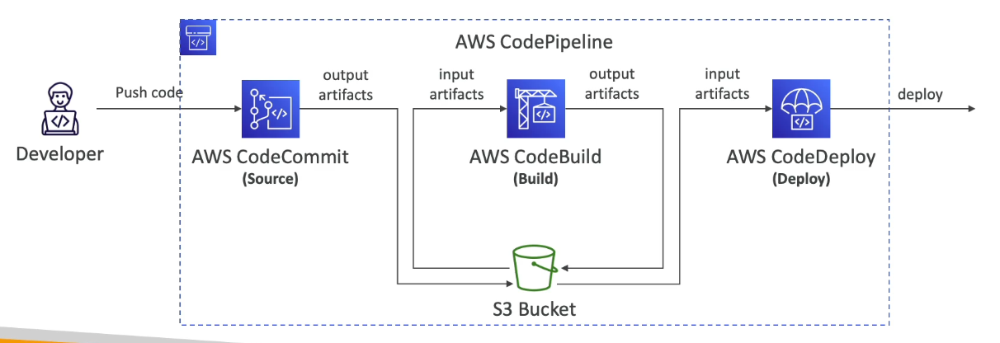

# Table of Contents

- [Table of Contents](#table-of-contents)
- [Overview](#overview)
- [AWS CodePipeline: Artifacts](#aws-codepipeline-artifacts)
- [Troubleshooting](#troubleshooting)
- [Create a Pipeline](#create-a-pipeline)
- [Actions](#actions)
- [Add a Stage](#add-a-stage)
- [References](#references)

---

# Overview

**AWS CodePipeline** is a fully managed continuous delivery service that helps you automate your release pipelines for fast and reliable application and infrastructure updates.

- Visual Workflow to orchestrate your CICD within AWS.
- We can handle:
  - **Source**: `CodeCommit`, ECR, S3, BitBucket, GitHub
  - **Build**: `CodeBuild`, Jenkins, CloudBees, TeamCity
  - **Test**: `CodeBuild`, AWS Device Farm, 3rd party tools
  - **Deploy**: `CodeDeploy`, Elastic Beanstalk, CloudFormation, ECS, S3
- Consist of stages:
  - Each stage can have sequential actions and/or parallel actions
  - Example: Build --> Test --> Deploy --> Load Testing --> Deploy to Production
  - Manual approval can be defined at any stage

**Use Cases**:

- Define your pipeline structure
- Receive notifications for events
- Control and grant access
- Integrate your own custom systems

**Free Tier**:

- 1 Free Pipeline every month

---

# AWS CodePipeline: Artifacts

Let's assume we have a source, a build and a deploy stage. We are using CodeCommit for source, `CodeBuild` for build and `CodeDeploy` for deploy.

- Each pipeline can create Artifacts. An artifact is whatever is created out of each stage of the Pipeline.
- Artifacts are stored in an S3 bucket and passed onto the next stage.
  - Developer pushes code to `CodeCommit`
  - `CodeCommit` is going to be orchestrated by `CodePipeline` which is going to extract all the code and create an artifact out of it, and place that artifact into a S3 bucket.
  - When `CodeBuild` is invoked, the same artifacts that were extracted are going to be input into `CodeBuild` and that's why `CodeBuild` doesn't need to have straight access into `CodeCommit`. It is `CodePipeline` that will be pushing the code to `CodeBuild` through Amazon S3.
  - When `CodeBuild` is building the code, it's going to create some deployment artifacts which are going to be stored yet again in the S3 bucket by `CodePipeline`.
  - `CodePipeline` will push these artifacts yet again to `CodeDeploy` and CodeDeploy will deploy those artifacts.

Thus, we can see how the different stages can interact with each other through Amazon S3 and this is why we have Artifacts in CodePipeline.

---

# Troubleshooting

- For CodePipeline Pipeline / Action / Stage / Execution state changes:
  - Use CloudWatch Events (Amazon EventBridge). You can create events for:
    - Failed pipelines
    - Cancelled stages
  - If CodePipeline fails a stage, your pipeline stops and you can get information in the console.
  - If CodePipeline cannot perform an action, For example: invoke some code in CodeBuild or pull the code from CodeCommit, make sure the **`IAM Service Role`** attached does have enough IAM Permissions (IAM Policy).
  - AWS CloudTrail can be used to audit AWS API calls, For e.g. if you have any denied API calls within your infrastructure.

---

# Create a Pipeline

We need to create a Pipeline that will do a lot of things:

- Go to **[AWS CodePipeline page](https://ap-south-1.console.aws.amazon.com/codesuite/codepipeline/start?region=ap-south-1)**

- Click on the **`Create Pipeline`** button

- Enter the following configuration:

  1. **Pipeline settings**:

     - **Pipeline name**: Enter the pipeline name. You cannot edit the pipeline name after it is created. No more than 100 characters.
     - **Service role**: (REQUIRED)
       - **`New service role`**: Create a service role (IAM Role) in your account (Default)
       - **`Existing service role`**: Choose an existing service role from your account
     - **Role name**: Enter a role name
     - **Allow AWS CodePipeline to create a service role so it can be used with this new pipeline**: `Enable` (default) / `Disable`

  2. **Advanced settings**:

     - **Artifact store**:

       - **`Default location`**: Create a default S3 bucket in your account. (Default)
       - **`Custom location`**: Choose an existing S3 location from your account in the same region and account as your pipeline.

     - **Bucket**: Select a S3 bucket (If **`Custom location`** is selected in `Artifact store`)

     - **Encryption key**:

       - **`Default AWS Managed Key`**: Use the AWS managed customer master key for CodePipeline in your account to encrypt the data in the artifact store.
       - **`Customer Managed Key`**: To encrypt the data in the artifact store under an AWS KMS customer managed key, specify the key ID, key ARN, or alias ARN.

     - **KMS customer master key**: To specify a KMS customer master key in a different AWS account, enter the full key ARN. (If **`Customer Managed Key`** is selected as `Encryption key`)

- Click **`Next`** to go to the configuration page for **`Add source stage`**

- Enter the following configuration:

  1. **Source**

     - **Source provider**: This is where you stored your input artifacts for your pipeline. Choose the provider and then provide the connection details. Options are:

       - **`AWS CodeCommit`**
       - **`Amazon ECR`**
       - **`Amazon S3`**
       - **`Bitbucket`**
       - **`GitHub (Version 1)`**
       - **`GitHub (Version 2)`**
       - **`GitHub Enterprise Server`**

       For the purpose of creating a CICD pipeline completely in AWS, we will select AWS CodeCommit.

     - **Repository name**: Choose a repository that you have already created where you have pushed your source code.

     - **Branch name**: Choose a branch of the repository

     - **Change detection options**: Choose a detection mode to automatically start your pipeline when a change occurs in the source code.

       - **`Amazon CloudWatch Events (recommended)`**: Use Amazon CloudWatch Events to automatically start my pipeline when a change occurs. (Fastest event response)
       - **`AWS CodePipeline`**: Use AWS CodePipeline to check periodically for changes (polling)

     - **Output artifact format**: Choose the output artifact format.

       - **`CodePipeline default`**: AWS CodePipeline uses the default zip format for artifacts in the pipeline. Does not include git metadata about the repository.
       - **`Full clone`**: AWS CodePipeline passes metadata about the repository that allows subsequent actions to do a full git clone. Only supported for AWS CodeBuild actions.

         The full clone option requires that your CodeBuild execution role has permissions to perform GitPull of CodeCommit repository chosen in your pipeline.

         In accordance with the principle of least privilege, these permissions are not included in your policy by default.

         For more information on adding the required permissions to your CodeBuild project. [Learn more](https://docs.aws.amazon.com/codecommit/latest/userguide/auth-and-access-control-permissions-reference.html)

- Click **`Next`** to go to the configuration page for **`Add build stage`**. The Build stage is optional.

- Optionally Enter the following configuration for the **Build Stage**:

  1. **Build** - _optional_

     - **Build provider**: This is the tool of your build project. Provide build artifact details like operating system, build spec file, and output file names. Options available are:

       - **`AWS CodeBuild`**
       - **`Add Jenkins`**

       For the purpose of creating a CICD pipeline completely in AWS, we will select `AWS CodeBuild`.

     - **Region**: (By default: The `Pipeline region` will be selected)

     - **Project name**: Choose a build project that you have already created in the AWS CodeBuild console. Or create a build project in the AWS CodeBuild console and then return to this task.

     - **Environment variables - _optional_**: Choose the key, value, and type for your CodeBuild environment variables. In the value field, you can reference variables generated by CodePipeline. [Learn more](https://docs.aws.amazon.com/codepipeline/latest/userguide/reference-variables.html)

     - **Build type**:

       - **`Single build`**: Triggers a single build.
       - **`Batch build`**: Triggers multiple builds as a single execution.

- Since this is an Optional stage, we can click **`Skip build stage`** to skip this and move to the configuration page for **`Add deploy stage`**.

- OR, if we want to have the Build stage and configured the options above, we can click **`Next`** and move to the configuration page for **`Add deploy stage`**.

- Enter the following configuration for the **Deploy Stage**:

  Pipelines must have at least two stages. Your second stage must be either a build or deployment stage. Choose a provider for either the build stage or deployment stage.

  1. Deploy:

     - **Deploy provider**: Choose how you deploy to instances. Choose the provider, and then provide the configuration details for that provider. Options available are:

       - **`AWS AppConfig`**
       - **`AWS CloudFormation`**
       - **`AWS CloudFormation Stack Set`**
       - **`AWS CodeDeploy`**
       - **`AWS Elastic Beanstalk`**
       - **`AWS OpsWorks Stacks`**
       - **`AWS Service Catalog`**
       - **`Amazon ECS`**
       - **`Amazon ECS (Blue/Green)`**
       - **`Amazon S3`**

       For the purpose of creating a CICD pipeline completely in AWS, we will select `AWS CodeDeploy`.

- Click **`Next`** to Review the CodePipeline configurations.

- Click **`Create Pipeline`** once you have reviewed and finalized the entire pipeline to create a Pipeline.

---

# [Actions](https://docs.aws.amazon.com/codepipeline/latest/userguide/actions.html)

In AWS CodePipeline, an action is part of the sequence in a stage of a pipeline. It is a task performed on the artifact in that stage. Pipeline actions occur in a specified order, in sequence or in parallel, as determined in the configuration of the stage.

CodePipeline provides support for six types of actions:

- Source
- Build
- Test
- Deploy
- Approval
- Invoke

---

# Add a Stage

- Select an existing Pipeline and Click the `Edit` button.
- Scroll down to where we want to add a Stage and click the corresponding **`Add Stage`** button and enter the **`Stage name`**.

- We need to add at least one **`Action Group`** now.

  - **`Action name`**: Choose a name for your action. No more than 100 characters.
  - ## **`Action provider`**:

    - **Approval**

      - **`Manual approval`**

    - **Build**

      - **`AWS CodeBuild`**
      - **`Add Jenkins`**

    - **Deploy**

      - **`AWS AppConfig`**
      - **`AWS CloudFormation`**
      - **`AWS CloudFormation Stack Set`**
      - **`AWS CodeDeploy`**
      - **`AWS Elastic Beanstalk`**
      - **`AWS OpsWorks Stacks`**
      - **`AWS Service Catalog`**
      - **`Amazon ECS`**
      - **`Amazon ECS (Blue/Green)`**
      - **`Amazon S3`**

    - **Invoke**
      - **`AWS Lambda`**
      - **`Synk`**
      - **`Step Functions`**

- A stage can have multiple Action Groups. We can add another Action Group either in parallel or in sequence (after) the first Action Group.

---

# References

- [Working with Actions in CodePipeline](https://docs.aws.amazon.com/codepipeline/latest/userguide/actions.html)
