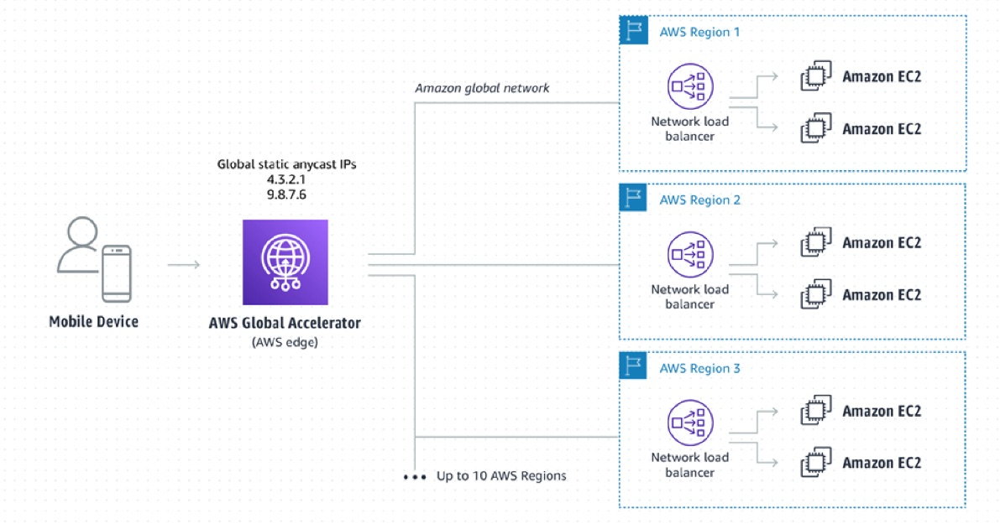

# Table of Contents

- [Table of Contents](#table-of-contents)
- [AWS Global Accelerator: Overview](#aws-global-accelerator-overview)
- [Global Accelerator vs CloudFront](#global-accelerator-vs-cloudfront)
- [Global Accelerator: Using with On-premise services](#global-accelerator-using-with-on-premise-services)
- [References](#references)

# AWS Global Accelerator: Overview

- AWS Global Accelerator is a networking service that helps you improve the availability, performance, and security of your public applications.

- Supports `UDP` and `TCP` protocols

- Global Accelerator provides `2` global static public anycast IPs that act as a fixed entry point to your application endpoints, such as:

  - Application Load Balancers
  - Network Load Balancers
  - Amazon Elastic Compute Cloud (EC2) instances and
  - Elastic IPs.

- Connects end users to load balancers in up to `10` Regions within the AWS global network.
- Use custom routing to deterministically route traffic to a fleet of EC2 instances.

- AWS Global Accelerator uses a global network of `104` Points of Presence in `88` cities across `48` countries.

- Global Accelerator supports IPv4 traffic towards all endpoints, and IPv6 traffic towards Application Load Balancer Endpoints.

- **Consistent Performance**:

  - **Global Static Anycast IP**:

    - The 2 Global Accelerator provided IP addresses are anycast from AWS edge locations, so they’re announced from multiple AWS edge locations at the same time.
    - This enables traffic to ingress onto the AWS global network as close to your users as possible accelerating API workloads by upto 60%.
    - Leverages TCP termination at the edge and sends traffic to AWS resources or endpoints across the Private AWS network which is faster and more stable.
    - No issue with client cache as IP doesn't change

  - **Fault Tolerance using Network Zones**:

    - When you create an accelerator, AWS Global Accelerator allocates two static IPv4 addresses for you that are serviced by independent **network zones**.
    - Similar to Availability Zones, these network zones are isolated units with their own set of physical infrastructure and service IP addresses from a unique IP subnet.
    - If one IP address from a network zone becomes unavailable, due to network disruptions or IP address blocking by certain client networks, your client applications can retry using the healthy static IP address from the other isolated network zone.

  - **Health Checks**:

    - Global Accelerator performs a health check of your applications if the endpoint is an EC2 Instance or an Elastic IP endpoint.
    - Global Accelerator uses the Health checks of Elastic Load Balancer when the endpoint is an ELB.
    - Helps your application be global (failover less than 1 minute for unhealthy)
    - Great for disaster recovery

  - **Global performance based routing**:

    - AWS Global Accelerator uses the vast, congestion-free AWS global network to route TCP and UDP traffic to a healthy application endpoint in the closest AWS Region to the user.
    - If there’s an application failure, AWS Global Accelerator provides instant failover to the next best endpoint.

- **Security**:

  - Only 2 external IP that need to be whitelisted
  - Automatic DDoS protection thanks to **AWS Shield**

- **Pricing**: You are charged a Fixed Fee + Data Transfer-Premier fee

  - **Fixed Fee**:

    - For each accelerator that is provisioned.
    - For every full or partial hour when an accelerator runs in your account, you are charged `$0.025` until it is deleted.
    - E.g. One Accelerator runs 24 hours a day for 30 days in a month. You are charged an `$18` monthly fixed rate for that accelerator.

  - **Data Transfer-Premium fee (DT-Premium)**:

    - Charged on per GB of traffic in the dominant direction that flows through the accelerator
    - **Example**:
      - **Situation**: `6,000 GB` of monthly is transferred in the month, distributed between regions in Europe (`5,000 GB`) and Asia Pacific (`1,000 GB`).
      - **Charges**: For monthly traffic to Europe (`5,000 GB`), you are charged `$75` at `$0.015/GB`. For monthly traffic to Asia Pacific (`1000 GB`), you are charged `$35` at `$0.035/GB`. Your monthly DT-Premium charge is `$110`

---

# Global Accelerator vs CloudFront

- Both use the AWS Global Network and its edge locations around the world
- Both services integrate with AWS Shield for DDoS protection

- **CloudFront**:

  - Improves performance for both cacheable content (such as images and videos)
  - Dynamic content (such as API acceleration and dynamic site delivery)
  - Content is served at the edge (only when there's a cache miss, is it served from the origin)

- **Global Accelerator**:

  - Improves performance for a wide range of applications over TCP or UDP
  - Proxying packets at the edge to applications running in one or more AWS Regions (no caching)
  - Good fit for non-HTTP use cases: Such as Gaming (UDP), IoT (MQTT, AMQP), or VoIP
  - Good for HTTP use cases that require static IP addresses globally
  - Good for HTTP use cases that require deterministic and fast regional failover

---

# Global Accelerator: Using with On-premise services

You can’t directly configure on-premises resources as endpoints for your static IP addresses.

**Solution:**

- You can configure a Network Load Balancer (NLB) in each AWS Region to address your on-premises endpoints.
- Then you can register the NLBs as endpoints in your AWS Global Accelerator configuration.

---

# References

- [AWS Global Accelerator - Documentation](https://docs.aws.amazon.com/global-accelerator/latest/dg/what-is-global-accelerator.html)
- [AWS Global Accelerator - API Reference](https://docs.aws.amazon.com/global-accelerator/latest/api/)
- [AWS Global Accelerator - CLI Reference](https://awscli.amazonaws.com/v2/documentation/api/latest/reference/globalaccelerator/index.html)
