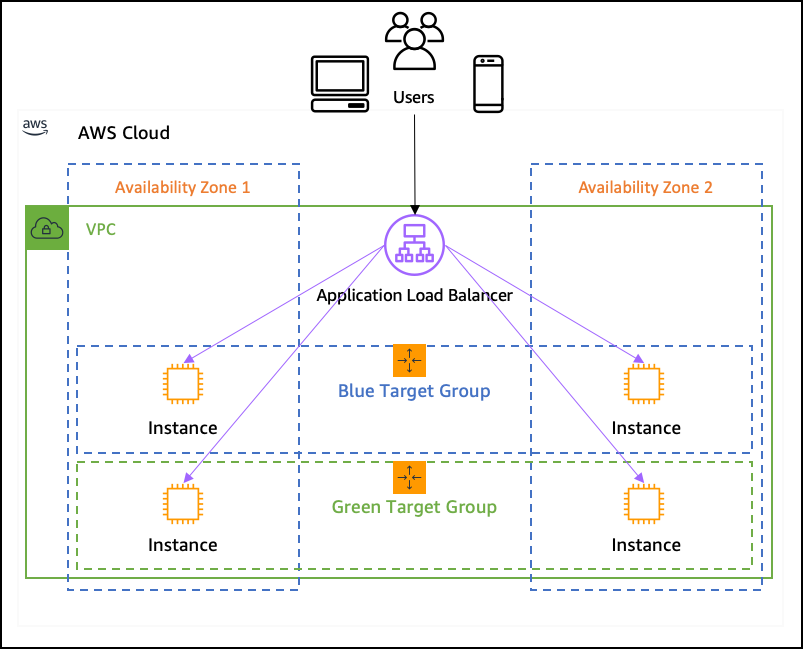

# Table of Contents

- [Table of Contents](#table-of-contents)
- [Infrastructure as Code](#infrastructure-as-code)
- [AWS CloudFormation: Overview](#aws-cloudformation-overview)
- [AWS CloudFormation: How does it work?](#aws-cloudformation-how-does-it-work)
- [AWS CloudFormation: Template](#aws-cloudformation-template)
  - [Template Anatomy](#template-anatomy)
  - [Template helpers](#template-helpers)
  - [Resources](#resources)
  - [Parameters](#parameters)
    - [Parameters: Overview](#parameters-overview)
    - [Parameters: Types](#parameters-types)
    - [Parameters: Properties](#parameters-properties)
    - [Psuedo Parameters](#psuedo-parameters)
  - [Mappings](#mappings)
  - [Outputs](#outputs)
    - [Outputs: Overview](#outputs-overview)
    - [Outputs: Cross-Stack Output](#outputs-cross-stack-output)
    - [Outputs: Cross-Stack Reference](#outputs-cross-stack-reference)
  - [Conditions](#conditions)
  - [Intrinsic Functions](#intrinsic-functions)
    - [Intrinsic Functions: Overview](#intrinsic-functions-overview)
- [Setting VS-Code to prevent Lint Errors](#setting-vs-code-to-prevent-lint-errors)
- [Using the AWS CLI](#using-the-aws-cli)
  - [`create-stack`](#create-stack)
  - [`list-stacks`](#list-stacks)
  - [`describe-stacks`](#describe-stacks)
  - [`delete-stack`](#delete-stack)
  - [`list-stack-resources`](#list-stack-resources)
- [Rollbacks](#rollbacks)
- [ChangeSets](#changesets)
- [Nested Stacks](#nested-stacks)
- [StackSets](#stacksets)
- [Drift](#drift)
- [References](#references)

---

# Infrastructure as Code

**Why**:

- The manual work of setting up EC2 Instances or even the more automated processes like **`CodePipeline`** still require manual work to setup
  - in another region
  - in another AWS account
  - within the same region if everything was deleted

Thus, it would be a lot simpler if the entire infrastructure could be in the form of reusable code which could then be deployed to create / update / delete our infrastructure.

---

# AWS CloudFormation: Overview

AWS CloudFormation provides a common declarative language to describe and provision all the infrastructure resources in your environment in a safe, repeatable way.

A CloudFormation template may consist of:

- A Security Group
- Two EC2 Instances using this Security Group
- Two Elastic IPs for these EC2 Machines
- I want an S3 Bucket
- I want a Load Balancer (ELB) in front of those machines

Then CloudFormation creates all these infrastructure for us, in the right order, with the exact configurations that you specify.

**Benefits**:

1. **Infrastructure as Code**:

   - No resources will be manually created, which is excellent for control
   - The code can be version controlled, for example using Git
   - Changes to the infrastructure are reviewed through CodeReview

2. **Cost**:

   - Each resources within the code is tagged with an identifier, so you can easily track the cost of a stack
   - You can estimate the cost of your resources using the CloudFormation template
   - **Saving Strategy**: In Development, you could automate deletion of templates at 5 PM and recreated at 8 AM safely.

3. **Productivity**:

   - Ability to destroy and re-create an infrastructure on the Cloud on the fly
   - Automated generation of Diagram for your templates
   - Declarative programming (no need to figure out ordering and orchestration)
   - **Separation of concern**: Create many stacks for many apps and may layers. For example:
     - VPC stacks
     - Network stacks
     - App stacks
   - **Reusability**: No need to re-invent the wheel.
     - Leverage existing templates on the web
     - Leverage the documentation

---

# AWS CloudFormation: How does it work?

- Templates have to uploaded in S3 and then referenced in CloudFormation.
- To update a template, we can't edit previous ones. We have to re-upload a new version of the template to AWS.
- Stacks are identified by a name
- Deleting a stack deletes every single artifact that was created by CloudFormation

- Deploying CloudFormation Templates:

  - **Manual way**:

    - Editing Templates in the **CloudFormation Designer**
    - Using the console to input parameters

  - **Automated way**:

    - Editing templates file. CloudFormation supports `JSON` and `YAML` (recommended).
    - Using the AWS CLI to deploy the templates
    - Recommended way when you want to have fully automated flow

---

# AWS CloudFormation: Template

## Template Anatomy

A template is a JSON or YAML formatted text file that describes your AWS infrastructure.
The following example shows a YAML-formatted template fragment.

```yml
AWSTemplateFormatVersion: 'version date' - The latest template format version is "2010-09-09" and is currently the only valid value

Description: String - Description of the AWS CloudFormation Template

Metadata: template metadata - arbitrary objects that provide details about the template.

Parameters: set of parameters - the dynamic variables for your template that can be overridden during each stack creation

Rules: set of rules - conditions that determine if AWS CloudFormation applies the assertions

Mappings: set of mappings - static list of hard-coded variables for the template

Conditions: set of conditions - list of conditions to perform resource creation

Transform: set of transforms - macros that AWS CloudFormation uses to process your template.

Resources: set of resources - Your AWS resources declared in the template (mandatory)

Outputs: set of outputs - references to what has been created that can be further reused
```

---

## Template helpers

1. **`References`**: Link your stuff within your template
2. **`Functions`**: Transform data within your template

---

## Resources

- Resources are the core of your CloudFormation Templates (Mandatory).
- They represent the different AWS Components that will be created and configured.
- Resources are declared and can reference each other.
- AWS figures out the creation and deletion of resources for us.
- There are 224+ types of resources.
- Resource types identifiers are of the form:
  - `AWS::aws-product-name::data-type-name`
- All the resources can be found here - https://docs.aws.amazon.com/AWSCloudFormation/latest/UserGuide/aws-template-resource-type-ref.html
- Each Resource has:
  - `Type`: e.g. `AWS::EC2::Instance`, `AWS::EC2::SecurityGroup` etc.
  - `Properties`: The properties related to the Type
- Almost but not all AWS Services are supported. You can work around that using AWS Lambda Custom Resources

> **Note**: We cannot create a dynamic amount of resources. Everything in the CloudFormation Template has to be defined.

---

## Parameters

### Parameters: Overview

- Parameters are a way to provide inputs to your AWS CloudFormation template
- They are important to know about if:

  - You want to reuse your templates across the company.
  - Some inputs cannot be determined ahead of time, for e.g. the key-pair you are going to link to EC2 Instances

- Parameters are extremely powerful, controlled and can prevent errors from happening in your templates thanks to types.

- By making a value a parameter, you won't have to repupload a template to change its content. It's a bit more stable and bit modulized.

- It is recommended to use a Parameter when the CloudFormation resource configuration is likely to change in the future.

- You can have a maximum of 200 parameters in an AWS CloudFormation template.

- Each parameter must be given a logical name (also called logical ID), which must be alphanumeric and unique among all logical names within the template.

- Each parameter must be assigned a parameter type that is supported by AWS CloudFormation. For more information, see [Types](#parameters-types).

- Each parameter must be assigned a value at runtime for AWS CloudFormation to successfully provision the stack. You can optionally specify a default value for AWS CloudFormation to use unless another value is provided.

- Parameters must be declared and referenced from within the same template. You can reference parameters from the Resources and Outputs sections of the template.

---

### Parameters: Types

AWS CloudFormation supports the following parameter types:

1. **`String`**: A literal string. E.g. `"MyUserName"`

2. **`Number`**: An integer or float. AWS CloudFormation validates the parameter value as a number; however, when you use the parameter elsewhere in your template (for example, by using the Ref intrinsic function), the parameter value becomes a string. E.g. `888`

3. **`List<Number>`**: An array of integers or floats that are separated by commas. AWS CloudFormation validates the parameter value as numbers; however, when you use the parameter elsewhere in your template (for example, by using the Ref intrinsic function), the parameter value becomes a list of strings. E.g. `"80, 20"`, when referenced by a Ref would result in `["80", "20"]`

4. **`CommaDelimitedList`**: An array of literal strings that are separated by commas. The total number of strings should be one more than the total number of commas. Also, each member string is space trimmed. E.g. `"test,dev,prod"`, when referenced by a Ref would result in ["test","dev","prod"].

5. **`AWS-Specific Parameter Types`**: AWS values such as Amazon EC2 key pair names and VPC IDs. For more information, see AWS-specific parameter types.

   - **`AWS::EC2::AvailabilityZone::Name`**: An Availability Zone, such as `us-west-2a`.
   - **`AWS::EC2::Image::Id`**: An Amazon EC2 image ID, such as `ami-0ff8a91507f77f867`. Note that the AWS CloudFormation console doesn't show a drop-down list of values for this parameter type.
   - **`AWS::EC2::Instance::Id`**: An Amazon EC2 instance ID, such as `i-1e731a32`.
   - **`AWS::EC2::KeyPair::KeyName`**: An Amazon EC2 key pair name.
   - **`AWS::EC2::SecurityGroup::GroupName`**: An EC2-Classic or default VPC security group name, such as my-sg-abc.
   - **`AWS::EC2::SecurityGroup::Id`**: A security group ID, such as `sg-a123fd85`.
   - **`AWS::EC2::Subnet::Id`**: A subnet ID, such as `subnet-123a351e`.
   - **`AWS::EC2::Volume::Id`**: An Amazon EBS volume ID, such as `vol-3cdd3f56`.
   - **`AWS::EC2::VPC::Id`**: A VPC ID, such as `vpc-a123baa3`.
   - **`AWS::Route53::HostedZone::Id`**: An Amazon Route 53 hosted zone ID, such as `Z23YXV4OVPL04A`.
   - **`List<AWS::EC2::AvailabilityZone::Name>`**: An array of Availability Zones for a region, such as `us-west-2a, us-west-2b`.
   - **`List<AWS::EC2::Image::Id>`**: An array of Amazon EC2 image IDs, such as `ami-0ff8a91507f77f867, ami-0a584ac55a7631c0c`. Note that the AWS CloudFormation console doesn't show a drop-down list of values for this parameter type.
   - **`List<AWS::EC2::Instance::Id>`**: An array of Amazon EC2 instance IDs, such as `i-1e731a32, i-1e731a34`.
   - **`List<AWS::EC2::SecurityGroup::GroupName>`**: An array of EC2-Classic or default VPC security group names, such as `my-sg-abc, my-sg-def`.
   - **`List<AWS::EC2::SecurityGroup::Id>`**: An array of security group IDs, such as `sg-a123fd85, sg-b456fd85`.
   - **`List<AWS::EC2::Subnet::Id>`**: An array of subnet IDs, such as `subnet-123a351e, subnet-456b351e`.
   - **`List<AWS::EC2::Volume::Id>`**: An array of Amazon EBS volume IDs, such as `vol-3cdd3f56, vol-4cdd3f56`.
   - **`List<AWS::EC2::VPC::Id>`**: An array of VPC IDs, such as `vpc-a123baa3, vpc-b456baa3`
   - **`List<AWS::Route53::HostedZone::Id>`**: An array of Amazon Route 53 hosted zone IDs, such as `Z23YXV4OVPL04A, Z23YXV4OVPL04B`.

6. **`SSM Parameter Types`**: Parameters that correspond to existing parameters in Systems Manager Parameter Store. You specify a Systems Manager parameter key as the value of the SSM parameter, and AWS CloudFormation fetches the latest value from Parameter Store to use for the stack. For more information, see [SSM parameter types](https://docs.aws.amazon.com/AWSCloudFormation/latest/UserGuide/parameters-section-structure.html#aws-ssm-parameter-types).

---

### Parameters: Properties

- Description
- Constraints
- Constraint Description (String)
- MinLength/MaxLength
- MinValue/MaxValue
- Default
- AllowedValues (array)
- AllowedPattern (regexp)
- NoEcho (Boolean): Helpful when you want to pass a secret

For greater details, check the **[Documentation](https://docs.aws.amazon.com/AWSCloudFormation/latest/UserGuide/parameters-section-structure.html#parameters-section-structure-properties)**.

---

### Psuedo Parameters

Pseudo parameters are parameters that are predefined by AWS CloudFormation. You don't declare them in your template. Use them the same way as you would a parameter, as the argument for the **`Ref`** function.

**Example:**

```yml
Outputs:
  MyStacksRegion:
    Value: !Ref 'AWS::Region'
```

---

## Mappings

- Mappings are fixed variables within your CloudFormation Template
- They're very handy to differentiate different environments (dev vs prod), regions (AWS Regions), AMI types etc.
- All the values are hardcoded within the template
- Mappings are great when we know in advance the values that can be taken and that they can be deduced from the variables.

**Example:**

```yml
Mappings:
  Region:
    ApSouth1:
      VPC: vpc-0accd6ee829f856ff
      Subnets:
        - subnet-09a2a6eec68d67bdb
        - subnet-0d4d144fef99b7917
        - subnet-0b0f3038e2c973ffd
```

To access Mappings somewhere in a code, we would use the **`Fn::FindInMap`** or **`!FindInMap`** (for YAML):

```yml
Resources:
  # Application Load Balancer
  ElasticLoadBalancer:
    Type: AWS::ElasticLoadBalancingV2::LoadBalancer
    Properties:
    Type: application
    Name: cloudformed-alb
    Scheme: internet-facing
    IpAddressType: ipv4
    SecurityGroups:
      - !Ref ALBSecurityGroup
    Subnets: !FindInMap [Region, ApSouth1, Subnets]
```

---

## Outputs

### Outputs: Overview

- The **[Outputs](https://docs.aws.amazon.com/AWSCloudFormation/latest/UserGuide/outputs-section-structure.html)** section declares optional output values that we can import into other stacks (if you export them first)! Thus, we can link Cloudformation Templates with the help of Outputs.
- You can also view outputs in the AWS Console or using the AWS CLI.
- They're very useful for example if you define a network CloudFormation and output the variables such as VPC ID and your Subnet IDs.
- Enables cross-stack collaboration, enabling experts handle their part of the stack.

> **IMPORTANT**: You cannot delete a CloudFormation Stack if its outputs are being referenced by another CloudFormation stack.

**Syntax:**

```yml
Outputs:
  Logical ID:
    Description: Information about the value (Optional)
    Value: Value to return (Required)
    Export: (Optional)
      Name: Name of resource to export
```

**Example:**

```yml
Outputs:
  StackSSHSecurityGroup:
    Description: The SSH Security Group
    Value: !Ref SSHSecurityGroup
    Export:
      Name: SSHSecurityGroup
```

### Outputs: Cross-Stack Output

- The benefits of a CloudFormation template shine when they can be deployed Cross-Zone.
- Thus we need a way to have Cross-Stack Output so that for every new stack created with the same template, we continue to have new exported Outputs, all of which can be re-used.
- Dynamic Export Names / Cross-Stack Output is made possible with the combination use of the [**`Fn:Sub`** Function](#intrinsic-functions-overview) with [Pseudo-Parameters](#psuedo-parameters).
- If the example below: Every `AWS::StackName` is different. Therefore the same template, generating new stacks will continue to create new Exports without any conflict.

```yml
Outputs:
  StackVPC:
    Description: The ID of the VPC
    Value: !Ref MyVPC
    Export:
      Name: !Sub '${AWS::StackName}-VPCID'
```

---

### Outputs: Cross-Stack Reference

We can import an Output exported from another stack using the **`Fn::ImportValue`** function. this allows for Cross-Stack reference.

```yml
Resources:
  MySecureInstance:
    Type: AWS::EC2::Instance
    Properties:
      AvailabilityZone: ap-south-1a
      ImageId: ami-062df10d14676e201
      InstanceType: t2.micro
      KeyName: ec2-playground
      SecurityGroups:
        - !ImportValue SSHSecurityGroup
```

---

## Conditions

- The optional **[`Conditions`](https://docs.aws.amazon.com/AWSCloudFormation/latest/UserGuide/conditions-section-structure.html)** section contains statements that define the circumstances under which entities are created or configured.
- Conditions can be whatever you want to be, but common ones are:
  - Environment (dev / test / prod)
  - AWS Region
  - Any parameter value
- Each condition can reference another condition, parameter value or mapping

**Syntax:**

```yml
Conditions:
  Logical ID: Intrinsic function
```

Where, the intrinsic function can either be (functions that evaluate to a boolean):

- `Fn::And`
- `Fn::Equals`
- `Fn::If`
- `Fn::Not`
- `Fn::Or`

**Example:**

```yml
Conditions:
  CreateProdResources: !Equals [!Ref EnvType, prod]
```

**Usage:** Can be used in Resources, Outputs, etc.

```yml
Resources:
  MountPoint:
    Type: 'AWS::EC2::VolumeAttachment'
    Condition: CreateProdResources
```

---

## Intrinsic Functions

### Intrinsic Functions: Overview

- **`Ref`**

  - For Parameters: Returns the value of the parameter
  - For Resources: Returns the Physical ID of the underlying resource (e.g. EC2 Instance ID)

- **`Fn::GetAtt`**

  - Get other information from resources apart from the Physical ID (read Documentation for specific resource)
  - Example: The AZ of an EC2 Instance:

    ```yml
    NewVolume:
      Type: EC2Instance
      Condition: CreateProdResources
      Properties:
        Size: 100
        AvailabilityZone: !GetAtt EC2Instance.AvailabilityZone
    ```

- **`Fn::FindInMap`**

  - Return the named value of a specific key under Mappings
  - `!FindInMap [MapName, TopLevelKey, SecondLevelKey]`

- **`Fn::ImportValue`**

  - Imports values that are exported by other templates

- **`Fn::Join`**

  - Join value with a delimiter
  - `!Join [ delimiter, [comma-separated list of values ] ]`

- **`Fn::Sub`**

  - Short for Substitute.
  - Used to separate variables from a text. It's a very handy function that will allow you to fully customize your templates.
  - For example: You can combine **`Fn::Sub`** with References or AWS Pseudo variables!
  - String must contain `${VariableName}` and will substitute them

    ```yml
    !Sub
    - String
    - Var1Name: Var1Value
      Var2Name: Var2Value
    ```

- [Condition Functions](https://docs.aws.amazon.com/AWSCloudFormation/latest/UserGuide/intrinsic-function-reference-conditions.html#w2ab1c33c28c21c29)
  - Fn::And
  - Fn::Equals
  - Fn::If
  - Fn::Not
  - Fn::Or

---

# Setting VS-Code to prevent Lint Errors

We need to whitelist CloudFormation intrinsic functions tags. Otherwise you will end up with _Unknown_ Tag showing up in your YAML document.

- Press `Ctrl` + `,` to open the settings panel.
- Search `yaml` in the search bar to find the yaml settings.
- Click the **`Edit in settings.json`** link from the options available.
- Add the following:

  ```json
  "yaml.customTags": [
    "!And",
    "!If",
    "!Not",
    "!Equals",
    "!Or",
    "!FindInMap sequence",
    "!Base64",
    "!Cidr",
    "!Ref",
    "!Sub",
    "!GetAtt",
    "!GetAZs",
    "!ImportValue",
    "!Select",
    "!Select sequence",
    "!Split",
    "!Join sequence"
  ]
  ```

- Save the `settings.json` file and we are good to go!

---

# Using the AWS CLI

## [`create-stack`](https://awscli.amazonaws.com/v2/documentation/api/latest/reference/cloudformation/create-stack.html)

Creates a stack as specified in the template. After the call completes successfully, the stack creation starts. You can check the status of the stack through the DescribeStacks operation.

**Syntax:**

```s
# Either specify `--template-body` or `--template-url`, not both
aws cloudformation create-stack \
 --stack-name [name] \
 --template-body [filePathToTemplateFile] \
 --template-url [S3BucketURL | SSM URL] \
 --parameters [Parameters] \
 --notification-arns [SNSTopicARN1, SNSTopicARN2, ...] \
 --disable-rollback \
 --on-failure ["DO_NOTHING" | "ROLLBACK" | "DELETE"] \
 --timeout-in-minutes [Minutes] \
 --capabilities ["CAPABILITY_IAM"| "CAPABILITY_NAMED_IAM" | "CAPABILITY_AUTO_EXPAND"] \
 --tags [Key=string,Value=string, ...]

```

**Example 1: Base Networking Stack (VPC, Subnets and Security Groups)**

```s
aws cloudformation create-stack \
 --stack-name ApSouth1Defaults \
 --template-body file:///home/jayantasamaddar/Work/quick-reference/aws/cloudformation/templates/base-networking-stack.yml
```

**Example 2: Networking Stack but with Custom Parameters entered for VPC and Subnets**

> **Note:**
>
> - Uses the **[`base-networking-stack.yml`](templates/base-networking-stack.yml)** template
> - Parameters need to be declared in the CloudFormation Template

```s
aws cloudformation create-stack \
 --stack-name SecondNetworkingStack \
 --template-body file:///home/jayantasamaddar/Work/quick-reference/aws/cloudformation/templates/base-networking-stack.yml \
 --parameters ParameterKey=VPC,ParameterValue="vpc-0accd6ee829f856ff" ParameterKey=Subnets,ParameterValue="subnet-09a2a6eec68d67bdb,subnet-0d4d144fef99b7917,subnet-0b0f3038e2c973ffd"
```

**Example 3: Basic Ubuntu EC2 Instance**

```s
aws cloudformation create-stack \
 --stack-name basic-ec2-stack \
 --template-body file:///home/jayantasamaddar/Work/quick-reference/aws/cloudformation/templates/basic-ec2-template.yml
```

**Example 4: EC2 Instance with UserData**

```s
aws cloudformation create-stack \
 --stack-name ec2-with-userData \
 --template-body file:///home/jayantasamaddar/Work/quick-reference/aws/cloudformation/templates/ec2-with-userData.yml
```

**Example 5: EC2 Instance accessible only through Application Load Balancer**



**Workflow:**

1. Create a Security group for the Application Load Balancer - `ALBSecurityGroup` that allows traffic from Port `80` and/or Port `443` and allows traffic through Port `80` and/or Port `443`.
2. Create a Security Group for the EC2 Instance - `EC2SecurityGroup` that only allows traffic from the `ALBSecurityGroup`.
3. Create an Application Load Balancer with the Security Group set to `ALBSecurityGroup`.
4. Create an EC2 Instance with the Security group set to `EC2SecurityGroup`.
5. Create a Target Group - `ELBTargetGroup` to route requests from Port `80` to registered targets and register the EC2 Instance.
6. Create a Listener for the Application Load Balancer, that checks for connection requests, using the `HTTP` protocol at port `80`, forwarding traffic to the `ELBTargetGroup`.

> We will be using the CloudFormation Template at **[`templates/ec2-with-ALB-SG-TG.yml`](templates/ec2-with-ALB-SG-TG.yml)**

```s
aws cloudformation create-stack \
 --stack-name EC2InstanceWithFrontFacingALB \
 --template-body file:///home/jayantasamaddar/Work/quick-reference/aws/cloudformation/templates/ec2-with-ALB-SG-TG.yml
```

**Response:**

```json
{
  "StackId": "arn:aws:cloudformation:ap-south-1:336463900088:stack/basic-ec2-stack/308d0ab0-6c95-11ed-9118-060480f3bf52"
}
```

---

## [`list-stacks`](https://awscli.amazonaws.com/v2/documentation/api/latest/reference/cloudformation/list-stacks.html)

Returns summary information about any of your running or deleted stacks (upto 90 days from deletion), including the name, stack identifier, template, and status.

**Syntax:**

```s
# List all Stacks (RUNNING or DELETED in the last 90 days)
aws cloudformation list-stacks

# List stacks with the StackStatus: DELETE_COMPLETE
aws cloudformation list-stacks --stack-status-filter DELETE_COMPLETE
```

**Response**:

```json
{
  "StackSummaries": [
    {
      "StackId": "arn:aws:cloudformation:ap-south-1:336463900088:stack/basic-ec2-stack/308d0ab0-6c95-11ed-9118-060480f3bf52",
      "StackName": "basic-ec2-stack",
      "CreationTime": "2022-11-25T07:45:53.930000+00:00",
      "DeletionTime": "2022-11-25T07:46:45.054000+00:00",
      "StackStatus": "DELETE_COMPLETE",
      "DriftInformation": {
        "StackDriftStatus": "NOT_CHECKED"
      }
    },
    {
      "StackId": "arn:aws:cloudformation:ap-south-1:336463900088:stack/basic-ec2-stack/cf408310-6c92-11ed-9e3e-06747ca30132",
      "StackName": "basic-ec2-stack",
      "CreationTime": "2022-11-25T07:28:51.676000+00:00",
      "DeletionTime": "2022-11-25T07:45:50.159000+00:00",
      "StackStatus": "DELETE_COMPLETE",
      "DriftInformation": {
        "StackDriftStatus": "NOT_CHECKED"
      }
    }
  ]
}
```

---

## [`describe-stacks`](https://awscli.amazonaws.com/v2/documentation/api/latest/reference/cloudformation/describe-stacks.html)

Provides information on your running stacks. You can use an option to filter results on a stack name. This command returns information about the stack, including the name, stack identifier, and status.

**Syntax:**

```s
# Return information related to all RUNNING stacks
aws cloudformation describe-stacks

# Return information related to the running `basic-ec2-stack`
aws cloudformation describe-stacks --stack-name myteststack
```

**Response:**

```json
{
  "Stacks": [
    {
      "StackId": "arn:aws:cloudformation:ap-south-1:336463900088:stack/ec2-stack-with-userdata/655abed0-6c9b-11ed-b004-023ecd5655ae",
      "StackName": "ec2-stack-with-userdata",
      "CreationTime": "2022-11-25T08:30:19.532000+00:00",
      "DeletionTime": "2022-11-25T09:02:44.666000+00:00",
      "RollbackConfiguration": {},
      "StackStatus": "DELETE_IN_PROGRESS",
      "DisableRollback": false,
      "NotificationARNs": [],
      "Tags": [],
      "DriftInformation": {
        "StackDriftStatus": "NOT_CHECKED"
      }
    }
  ]
}
```

---

## [`delete-stack`](https://awscli.amazonaws.com/v2/documentation/api/latest/reference/cloudformation/delete-stack.html)

**Syntax:**

```s
aws cloudformation delete-stack --stack-name [name]
```

**Example:**

```s
aws cloudformation delete-stack --stack-name basic-ec2-stack
```

---

## [`list-stack-resources`](https://awscli.amazonaws.com/v2/documentation/api/latest/reference/cloudformation/list-stack-resources.html)

**Syntax:**

```s
aws cloudformation list-stack-resources --stack-name [name]
```

**Example:**

```s
aws cloudformation list-stack-resources --stack-name "basic-ec2-stack"
```

**Response:**

```json
{
  "StackResourceSummaries": [
    {
      "ResourceStatus": "CREATE_COMPLETE",
      "ResourceType": "AWS::EC2::Instance",
      "ResourceStatusReason": null,
      "LastUpdatedTimestamp": "2013-08-23T01:02:28.025Z",
      "PhysicalResourceId": "myteststack-s3bucket-sample",
      "LogicalResourceId": "S3Bucket"
    }
  ]
}
```

---

# Rollbacks

- When Stack Creation fails:

  - **Default**: Everything rolls back (gets deleted). We can look at the log.
  - Option to disable the rollback and troubleshoot what happened.

- When Stack Update fails:

  - The stack automatically rolls back to the previous known working state.
  - Ability to see the log what happened and error messages.
  - We can disable from the AWS CLI while creating or updating the stack:

    ```s
    aws cloudformation create-stack | update-stack \
     --stack-name test-stack
     --template-body file:///home/jayantasamaddar/Work/quick-reference/aws/cloudformation/templates/basic-ec2-template.yml
     --disable-rollback
    ```

---

# ChangeSets

- When you update a stack, you need to know what changes before it happens for greater confidence.
- ChangeSets won't say if the update will be successful.

---

# Nested Stacks

- Nested Stacks are stacks as part of other stacks
- They allow you to update and to isolate repeated patterns / common components in separate stacks and call them from other stacks
- Example:
  - Load balancer configuration that is re-used
  - Security group that is re-used
- Nested stacks are considered best practice
- To update a nested stack, always update the parent stack (root stack)

| Cross Stacks                                       | Nested Stacks                            |
| -------------------------------------------------- | ---------------------------------------- |
| Helpful when stacks have different lifecycles      | Helpful when components must be re-used  |
| Use Outputs Export and `Fn::ImportValue`           | Properly configure an ALB                |
| When you need to pass export values to many stacks | Only important to the higher level stack |

---

# StackSets

- Create, update or delete stacks across multiple accounts and regions with a single operation
- Administrator accounts can create StackSets.
- Trusted accounts can create, update or delete stack instances from StackSets
- When you update a stack set, all associated stack instances are updated throughout all accounts and regions.

---

# Drift

- CloudFormation allows you to create infrastructure but it doesn't protect you against manual configuration changes. i.e. someone else with access to any of the resources created by CloudFormation may selectively modify some of these resources.
- A drift is when such a modification described above happens.
- How do we know if our resources have drifted: We can use the CloudFormation Drift

---

# References

- [Pseudo Parameters](https://docs.aws.amazon.com/AWSCloudFormation/latest/UserGuide/pseudo-parameter-reference.html)
