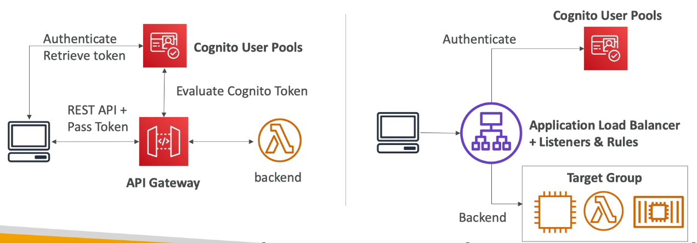

# Table of Contents

- [Table of Contents](#table-of-contents)
- [Amazon Cognito: Overview](#amazon-cognito-overview)
- [IAM vs Cognito](#iam-vs-cognito)
- [Cognito User Pools (CUP)](#cognito-user-pools-cup)
  - [Cognito User Pools: User Features](#cognito-user-pools-user-features)
  - [Cognito User Pools: Integrations](#cognito-user-pools-integrations)
  - [Cognito User Pools: Triggers](#cognito-user-pools-triggers)
  - [Cognito User Pools: Workflow](#cognito-user-pools-workflow)
- [Cognito Identity Pools (Federated Identities)](#cognito-identity-pools-federated-identities)
- [Cognito Sync](#cognito-sync)
- [Using the CLI](#using-the-cli)
  - [`cognito-idp`](#cognito-idp)
    - [`create-user-pool`](#create-user-pool)
- [References](#references)

---

# Amazon Cognito: Overview

With Amazon Cognito, you can add user sign-up and sign-in features and control access to your web and mobile applications. Amazon Cognito provides an identity store that scales to millions of users, supports social and enterprise identity federation, and offers advanced security features to protect your consumers and business. Built on open identity standards, Amazon Cognito supports various compliance regulations and integrates with frontend and backend development resources.

- **Cognito User Pools**:

  - Sign in functionality for app users
  - Integrate with API Gateway and Application Load Balancer

- **Cognito Identity Pools (Federated Identity)**:

  - Provide AWS Credentials to users so that they can access AWS resources directly
  - Integrate with Cognito User Pools as an identity provider

- **Cognito Sync**:
  - Synchronise data from devices to Cognito
  - Is deprecated and replaced by **AppSync**

---

# IAM vs Cognito

- **IAM**:

  - For users within your AWS environment

- **Cognito**:

  - For other users who register and login into your application

---

# Cognito User Pools (CUP)

## Cognito User Pools: User Features

- Create a serverless database of users for your web and mobile applications
- **Simple login**: Can use Username (or email) / password combination to login to your apps.
- Reset passwords
- Email and phone number verification
- Multi-factor authentication (MFA)
- Federated identities: Login with Third-party identity providers like Google, Facebook, SAML, OpenID Connect
- Feature to block users if their credentials are compromised elsewhere (AWS scans the web for compromised credentials)
- Login sends back a JSON Web Token (JWT)

---

## Cognito User Pools: Integrations

Cognito User Pools integrate with API Gateway and Application Load Balancer natively.



---

## [Cognito User Pools: Triggers](https://docs.aws.amazon.com/cognito/latest/developerguide/cognito-user-identity-pools-working-with-aws-lambda-triggers.html)

Triggers are events that can synchronously invoke Lambda. The available triggers are:

1. **Pre sign-up**: This trigger is invoked when a user submits their information to sign up, allowing you to perform custom validation to accept or deny the sign up request.

2. **Pre authentication**: This trigger is invoked when a user submits their information to be authenticated, allowing you to perform custom validations to accept or deny the sign in request.

3. **Custom message**: This trigger is invoked before a verification or MFA message is sent, allowing you to customize the message dynamically. Note that static custom messages can be edited on the Verifications panel.

4. **Post authentication**: This trigger is invoked after a user is authenticated, allowing you to add custom logic, for example for analytics.

5. **Post confirmation**: This trigger is invoked after a user is confirmed, allowing you to send custom messages or to add custom logic, for example for analytics.

6. **Define Auth challenge**: This trigger is invoked to initiate the custom authentication flow.

7. **Create Auth Challenge**: This trigger is invoked after 'Define Auth Challenge' if a custom challenge has been specified as part of the 'Define Auth Challenge' trigger.

8. **Verify Auth Challenge Response**: This trigger is invoked to verify if the response from the end user for a custom authentication challenge is valid or not.

9. **User Migration**: This trigger is invoked during sign in and forgot-password operations to migrate users from your existing directory into this user pool.

10. **Pre Token Generation**: This trigger is invoked before the token generation, allowing you to customize the claims in the identity token.

---

## Cognito User Pools: Workflow

1. Create User Pool
2. Create App Client
3. Set Domain Name
4. Setup Triggers

---

# Cognito Identity Pools (Federated Identities)

Web or mobile application users wanting access to an AWS Service, need temporary AWS credentials. We cannot create normal IAM users for these users as they are not part of the organization and there are too many of them. Thus we need to give them access through what is the Cognito Identity Pool.

**Cognito Identity Pools allow users to:**

- Get identities for users so they can obtain temporary AWS credentials
- Identity Pool includes

  - Login using a third-party identity provider - `Facebook`, `Google`, `Apple`, `Amazon`
  - `OpenID Connect` Providers and `SAML` 2.0 Providers
  - Developer Authenticated Identities (Custom Login Server)
  - Cognito Identity Pools allow for unauthenticated guest access

- Users can access AWS Services directly or through the API Gateway

---

# Cognito Sync

---

# Using the CLI

## `cognito-idp`

### `create-user-pool`

Creates a new Amazon Cognito user pool and sets the password policy for the pool.

**Syntax:**

```s
aws cognito-idp \
  --pool-name [PoolName] \
  --policies [PasswordPolicy={MinimumLength=integer,RequireUppercase=boolean,RequireLowercase=boolean,RequireNumbers=boolean,RequireSymbols=boolean,TemporaryPasswordValidityDays=integer}] \
  --deletion-protection ["ACTIVE" | "INACTIVE"] \
  --lambda-config [PreSignUp=string,CustomMessage=string,PostConfirmation=string,PreAuthentication=string,PostAuthentication=string,DefineAuthChallenge=string,CreateAuthChallenge=string,VerifyAuthChallengeResponse=string,PreTokenGeneration=string,UserMigration=string,CustomSMSSender={LambdaVersion=string,LambdaArn=string},CustomEmailSender={LambdaVersion=string,LambdaArn=string},KMSKeyID=string] \
  --auto-verified-attributes ["phone_number" | "email"] \
  --alias-attributes ["phone_number" | "email" | "preferred_username"] \
  --username-attributes ["phone_number" | "email"] \
  --mfa-configuration ["OFF" | "ON" | "OPTIONAL"] \
  --account-recovery-setting RecoveryMechanisms=[{Priority=integer,Name=["verified_email"|"verified_phone_number"|"admin_only"]}, ...] \

```

**Example:**

```s
aws cognito-idp \
  --pool-name Users \
  --policies PasswordPolicy={MinimumLength=8,RequireUppercase=true,RequireLowercase=true,RequireNumbers=true,RequireSymbols=true,TemporaryPasswordValidityDays=7} \
  --deletion-protection ["ACTIVE" | "INACTIVE"] \
  --lambda-config [PreSignUp=string,CustomMessage=string,PostConfirmation=string,PreAuthentication=string,PostAuthentication=string,DefineAuthChallenge=string,CreateAuthChallenge=string,VerifyAuthChallengeResponse=string,PreTokenGeneration=string,UserMigration=string,CustomSMSSender={LambdaVersion=string,LambdaArn=string},CustomEmailSender={LambdaVersion=string,LambdaArn=string},KMSKeyID=string] \
  --auto-verified-attributes ["phone_number" | "email"] \
  --alias-attributes ["phone_number" | "email" | "preferred_username"] \
  --username-attributes ["phone_number" | "email"] \
  --mfa-configuration "OPTIONAL" \
  --account-recovery-setting RecoveryMechanisms {Priority=5,Name="verified_email"}
```

**Response:**

```json

```

---

---

# References

- [Customizing User Pool Workflows with Lambda Triggers](https://docs.aws.amazon.com/cognito/latest/developerguide/cognito-user-identity-pools-working-with-aws-lambda-triggers.html)
