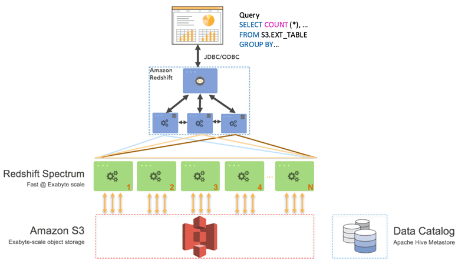

# Table of Contents

- [Table of Contents](#table-of-contents)
- [Redshift: Overview](#redshift-overview)
- [Redshift: Cluster](#redshift-cluster)
- [Redshift: Disaster Recovery](#redshift-disaster-recovery)
- [Redshifts: Loading Data into Redshift](#redshifts-loading-data-into-redshift)
- [Redshift Spectrum](#redshift-spectrum)

---

# Redshift: Overview

Amazon Redshift uses SQL to analyze structured and semi-structured data across data warehouses, operational databases, and data lakes, using AWS-designed hardware and machine learning to deliver the best price performance at any scale.


- Redshift is based on PostgreSQL, but it's NOT ideal for OLTP.
- Amazon Redshift is specifically designed for Online Analytic Processing (OLAP) for analytics and data warehousing.
- 10x better performance than other data warehouses, scale to PBs of data
- Columnar storage of data (instead of row based) & parallel query engine
- Pay as you go based on the instances provisioned
- Has a SQL interface for performing the queries
- BI tools such as Amazon Quicksight or Tableau integrate with it
- Redshift vs Athena: Faster queries / joins / aggregations thanks to indexes
- For Adhoc queries use Athena but for intense data warehousing with many complicated queries, Redshift is a better candidate

---

# Redshift: Cluster

- **Leader Node**: For query planning, results aggregation
- **Compute Node**: For performing the queries, send results to leader
- You provision the node size in advance
- You can use Reserved Instances for cost savings

---

# Redshift: Disaster Recovery

- Redshift has no Multi-AZ mode
- Snapshots come in handy. Point-in-time backups of a cluster stored internally in S3.
- Snapshots are incremental (only what has changed is saved)
- You can restore a snapshot into a new cluster
- Automated:
  - Scheduled: Every 8 hours or on a custom schedule
  - By Volume: Every 5 GB
  - Can set Retention
- Manual snapshot is retained until you delete it
- You can configure Amazon Redshift to automatically copy snapshots (automated or manual) of a cluster to another AWS Region, hence providing a Disaster Recovery strategy

---

# Redshifts: Loading Data into Redshift

> **Note**: Large inserts are **MUCH** better

- **Amazon Kinesis Data Firehose**: Writes to S3 bucket first and then issues an S3 copy command in Redshift to load the data into Redshift Cluster.

  ```s
  copy customer
  from 's3://mybucket/mydata'
  iam_role 'arn:aws:iam::123456789012:role/MyRedshiftRole'
  ```

- If you want the data to remain within your AWS VPC, then you can enable **Enhanced VPC Routing**

- **JDBC Driver**: Insert data from the JDBC driver. Recommended to write data in batches.

---

# [Redshift Spectrum](https://aws.amazon.com/blogs/big-data/amazon-redshift-spectrum-extends-data-warehousing-out-to-exabytes-no-loading-required/)



- Query data that is already in S3 and analyze it without loading it.
- Must have a Redshift cluster available to start the query.
- The query is then submitted to thousands of Redshift Spectrum Nodes that will perform the query onto the data in S3.
- Amazon Redshift Spectrum resides on dedicated Amazon Redshift servers that are independent of your cluster.
- Redshift Spectrum pushes many compute-intensive tasks, such as predicate filtering and aggregation, down to the Redshift Spectrum layer.
- Thus, Redshift Spectrum queries use much less of your cluster's processing capacity than other queries.

---
