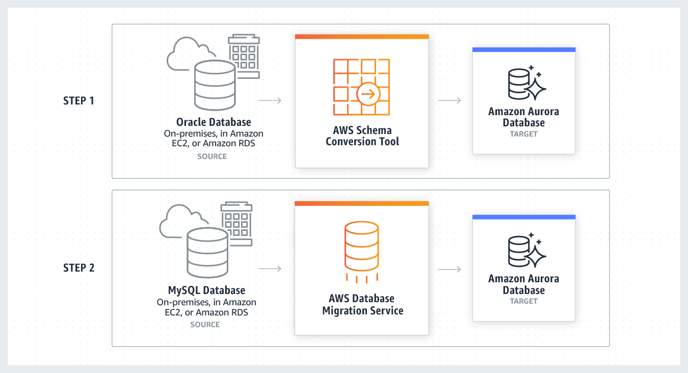

# Table of Contents

- [Table of Contents](#table-of-contents)
- [Database Migration Service (DMS): Overview](#database-migration-service-dms-overview)
- [AWS Schema Conversion Tool (SCT)](#aws-schema-conversion-tool-sct)
- [MySQL Migrations: RDS \& Aurora](#mysql-migrations-rds--aurora)
- [PostgreSQL Migrations: RDS \& Aurora](#postgresql-migrations-rds--aurora)
- [On-Premise Strategy with AWS](#on-premise-strategy-with-aws)

---

# Database Migration Service (DMS): Overview

- Quickly and securely migrate on-premise databases to AWS, resilient, self-healing
- The source database remains available during migration
- Supports:

  - Homogeneous migrations: e.g. Oracle to Oracle
  - Heterogeneous migrations: Microsoft SQL Server to Aurora

- Continuous Data Replication using CDC (Change data capture)
- You must create an EC2 Instance to perform the replication tasks

- **Database Sources**:

  1. **On-Premise and EC2 Instances Databases**:

  - Oracle
  - Microsoft SQL Server
  - MySQL
  - MariaDB
  - PostgreSQL
  - MongoDB
  - SAP
  - DB2

  2. **Azure**:

  - Azure SQL Database

  3. **Amazon RDS**: All including Aurora
  4. **Amazon S3**

- **Targets**:

  - **On-Premise and EC2 Instances Databases**:

    - Oracle
    - Microsoft SQL Server
    - MySQL
    - MariaDB
    - PostgreSQL
    - SAP

  - **Amazon RDS**: All including Aurora
  - **Amazon Redshift**
  - **Amazon DynamoDB**
  - **Amazon S3**
  - **Amazon Opensearch Service**
  - **Kinesis Data Streams**
  - **Amazon DocumentDB**

---

# AWS Schema Conversion Tool (SCT)

When the source database engine and the target database engine do not match we can use AWS Schema Conversion Tool (SCT).

- Convert your Database Schema from one engine to another
- Example:

  - OLTP: SQL Server or Oracle to MySQL, PostgreSQL or Aurora
  - OLAP: Teradata or Oracle to Amazon Redshift

- You do not need to use SCT if you are migrating to the same database engine

- Heterogenous migrations are thus, a two step process:

  

  1. First use the **AWS Schema Conversion Tool** to convert the source schema and code to match that of the target database. For example: Oracle Database to Amazon Aurora MySQL.
  2. Use the **AWS Database Migration Service** to migrate data from the source database to the target database.

---

# MySQL Migrations: RDS & Aurora

- **RDS MySQL to Aurora MySQL**

  - **Option 1**: DB Snapshots from RDS MySQL restored as Aurora MySQL (There will be downtime)
  - **Option 2**: Create an Aurora Read Replica from your RDS MySQL and when the replication lag is 0, promote it as its own DB Cluster (can take time and cost $)

- **External MySQL to Aurora MySQL**

  - **Option 1**:

    - Use Percona XtraBackup to create a file backup in Amazon S3
    - Create an Aurora MySQL DB from Amazon S3

  - **Option 2**:

    - Create an Aurora MySQL DB
    - Use the `mysqldump` utility to migrate MySQL to Aurora (slower than S3 method)

- **Use DMS if both databases are up and running**

---

# PostgreSQL Migrations: RDS & Aurora

- **RDS PostgreSQL to Aurora PostgreSQL**

  - **Option 1**: DB Snapshots from RDS PostgreSQL restored as Aurora PostgreSQL (There will be downtime)
  - **Option 2**: Create an Aurora Read Replica from your RDS PostgreSQL and when the replication lag is 0, promote it as its own DB Cluster (can take time and cost $)

- **External PostgreSQL to Aurora PostgreSQL**

  - **Option 1**:

    - Create a Backup and put it in Amazon S3
    - Import it using the aws_s3 Aurora extension

- **Use DMS if both databases are up and running**

---

# On-Premise Strategy with AWS

- **Ability to download Amazon Linux 2 AMI as a VM (.iso format)** and run it on the on-premise infrastructure using:

  - `VMWare`, `KVM`, `VirtualBox` (Oracle VM), `Microsoft Hyper-V`

- **VM Import / Export**

  - Migrate existing applications into EC2
  - Create a Disaster Recovery (DR) repository strategy for your on-premise VMs.
  - Can export back the VMs from EC2 to on-premise

- **AWS Application Discovery Service**

  - Gather information about your on-premise servers to plan a migration
  - Gets server utilization information and dependency mappings which are important for migrations
  - Track all of the information with **AWS Migration Hub**
  - Two types:
    - Agentless

- **[AWS Database Migration Service (AWS DMS)](../diasaster-recovery)**

  - Replicate On-premise => AWS, AWS => AWS, AWS => On-premise
  - Works with various database technologies: Oracle, MySQL, DynamoDB etc.

- **AWS Server Migration Service (AWS SMS)**

  - Incremental replication of on-premise live servers to AWS

---
