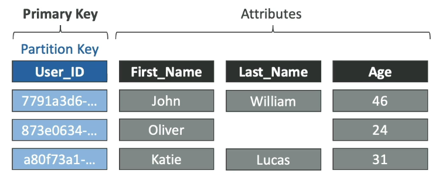
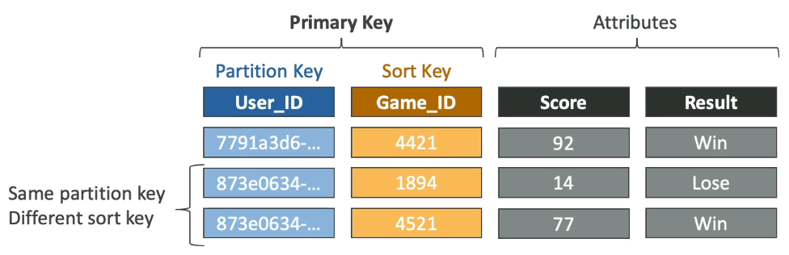
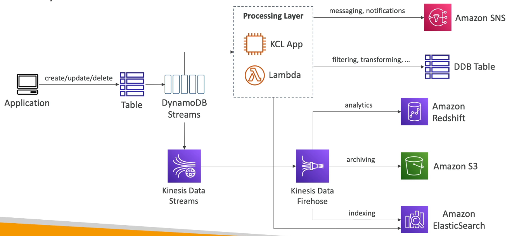

# Table of Contents

- [Table of Contents](#table-of-contents)
- [Why NoSQL Database?](#why-nosql-database)
- [DynamoDB: Overview](#dynamodb-overview)
- [DynamoDB: Basics](#dynamodb-basics)
  - [Components](#components)
  - [Primary Keys](#primary-keys)
- [DynamoDB: Read/Write Capacity Modes](#dynamodb-readwrite-capacity-modes)
  - [Read/Write Capacity Modes: Overview](#readwrite-capacity-modes-overview)
  - [Read/Write Capacity Modes: Provisioned](#readwrite-capacity-modes-provisioned)
  - [Write Capacity Units (WCU)](#write-capacity-units-wcu)
  - [Strongly Consistent Read vs Eventually Consistent Read](#strongly-consistent-read-vs-eventually-consistent-read)
  - [Read Capacity Units (RCU)](#read-capacity-units-rcu)
  - [DynamoDB: Partitions](#dynamodb-partitions)
  - [DynamoDB Partitions: Overview](#dynamodb-partitions-overview)
- [DynamoDB: Partitioning Strategies](#dynamodb-partitioning-strategies)
  - [Read/Write Capacity Modes: On-Demand](#readwrite-capacity-modes-on-demand)
- [DynamoDB: Basic APIs](#dynamodb-basic-apis)
  - [Writing Data](#writing-data)
  - [Reading Data](#reading-data)
  - [Deleting Data](#deleting-data)
  - [Batch Operations](#batch-operations)
- [DynamoDB: Indexes](#dynamodb-indexes)
  - [Local Secondary Index (LSI)](#local-secondary-index-lsi)
  - [Global Secondary Index (GSI)](#global-secondary-index-gsi)
  - [Indexes and Throttling](#indexes-and-throttling)
- [DynamoDB: PartiQL](#dynamodb-partiql)
- [DynamoDB: Optimistic Locking](#dynamodb-optimistic-locking)
- [DynamoDB Accelerator (DAX)](#dynamodb-accelerator-dax)
- [DynamoDB: Streams](#dynamodb-streams)
  - [DynamoDB Streams: Overview](#dynamodb-streams-overview)
  - [DynamoDB Streams and Amazon Lambda](#dynamodb-streams-and-amazon-lambda)
- [DynamoDB: Time-to-Live (TTL)](#dynamodb-time-to-live-ttl)
- [DynamoDB: Transactions](#dynamodb-transactions)
  - [DynamoDB Transactions: Overview](#dynamodb-transactions-overview)
  - [DynamoDB Transactions: Capacity Computations](#dynamodb-transactions-capacity-computations)
- [DynamoDB: Security and Other Features](#dynamodb-security-and-other-features)
- [DynamoDB: Fine-Grained Access Control](#dynamodb-fine-grained-access-control)
- [Using the JavaScript v3 SDK](#using-the-javascript-v3-sdk)
  - [Creating the Client](#creating-the-client)
  - [`CreateTableCommand`](#createtablecommand)
  - [`ListTablesCommand`](#listtablescommand)
  - [`DescribeTableCommand`](#describetablecommand)
  - [`UpdateTableCommand`](#updatetablecommand)
  - [`DeleteTableCommand`](#deletetablecommand)
  - [`PutItemCommand`](#putitemcommand)
  - [`GetItemCommand`](#getitemcommand)
  - [`UpdateItemCommand`](#updateitemcommand)
  - [`DeleteItemCommand`](#deleteitemcommand)
- [Using the CLI](#using-the-cli)
  - [`create-table`](#create-table)
  - [`list-tables`](#list-tables)
  - [`describe-table`](#describe-table)
  - [`update-table`](#update-table)
  - [`delete-table`](#delete-table)
  - [`put-item`](#put-item)
  - [`get-item`](#get-item)
  - [`update-item`](#update-item)
  - [`delete-item`](#delete-item)
- [References](#references)

---

# Why NoSQL Database?

**Traditional databases**

- Traditional applications leverage RDBMS
- These databases use the Structured Query Language (SQL)
- Strong requirements about how the data should be modelled
- Ability to do joins, aggregations, complex computations
- Vertical scaling (getting a more powerful CPU / RAM / IO)
- Limited Horizontal scaling (Increasing reading capabilities by adding EC2 / RDS Read Replicas)
  - Aurora: 15 Read Replicas
  - RDS / ElastiCache: 5 Read Replicas
- No Horizontal write scaling

**NoSQL**

- NoSQL databases are non-relational databases and are distributed
- NoSQL databases include MongoDB, DynamoDB, Cassandra, Redis etc.
- NoSQL databases have limited to no query joins (MongoDB has `populate`)
- All the data that is needed in a query is present in one row.
- NoSQL databases traditionally do not perform aggregations such as `SUM`, `AVERAGE`. (Mongo DB has aggregations but they are not as performant as RDBMS counterparts)
- NoSQL Databases scale horizontally for both Read and Write operations

---

# DynamoDB: Overview

Amazon DynamoDB is a fully managed, serverless, key-value NoSQL database designed to run high-performance applications at any scale. DynamoDB offers built-in security, continuous backups, automated multi-Region replication, in-memory caching, and data import and export tools.

- Fully managed, highly available with replication across multiple AZs
- NoSQL Database
- Distributed database that scales to massive workloads
- Millions of requests per second, trillions of rows, 100s of TBs of storage
- Fast and consistent in performance (low latency on retrieval)
- Integrated with IAM for security, authorization and administration
- Enables event driven architecture with DynamoDB Streams
- Low cost and auto-scaling capabilities
- Standard & Infrequent Access (IA) Table class
- Import data from Amazon S3 directly into a new DynamoDB table without writing any code or managing additional infrastructure
- Export data from DynamoDB to Amazon S3 and use other AWS services such as Amazon Athena to analyze your data and extract actionable insights.
- Use PartiQL, a SQL-compatible query language, to query, insert, update, and delete table data in DynamoDB

---

# DynamoDB: Basics

## Components

- DynamoDB is made of **Tables**
- Each Table has a **primary key** (must be decided at creation time)
- Each table can have an infinite number of **rows** / **items**
- Each row / item has **attributes** (can be added over time / can be null)
- Each row / item can have a maximum size of `400 KB`
- Data types supported are:
  - **Scalar types**: String, Number, Boolean, Binary, Null
  - **Document types**: List, Map
  - **Set types**: String sets, Number sets, Binary sets

---

## Primary Keys

- **Option 1**: Partition Key (HASH strategy)

  - Partition key must be unique for each item. Choose the item with the highest cardinality.
  - Partition key must be diverse so that data is distributed
  - **Example:** `User_ID` for a users table

    

- **Option 2**: Partition Key + Sort Key (HASH + RANGE)

  - The combination must be unique for each item
  - Data is grouped by partition key
  - **Example:** In a `users-games` table, `User_ID` for Partition Key and `Game_ID` for Sort Key

    

---

# DynamoDB: Read/Write Capacity Modes

## Read/Write Capacity Modes: Overview

- Control how you manage your table's capacity (read/write throughput)

- **Provisioned Mode (default)**

  - You specify the number of reads/writes per second
  - You need to plan capacity beforehand
  - Pay for provisioned read and write capacity units

- **On-Demand Mode**

  - Read/write automatically scale up/down with your workloads
  - No Capacity planning needed
  - Pay for exactly what you use; more expensive.

- You can switch between read/write capacity modes once every 24 hours. The only exception to this is if you switch a provisioned mode table to on-demand mode, you can switch back to provisioned mode in the same 24-hour period.

---

## Read/Write Capacity Modes: Provisioned

- Table must have provisioned Read and Write capacity units
- **Read Capacity Units (RCU)**: Throughput for Reads
- **Write Capacity Units (WCU)**: Throughput for Writes
- Option to setup auto-scaling of throughput to meet demand

  - If you're using the console, DynamoDB recommends enabling auto scaling with the following defaults:
    - **Minimum provisioned capacity**: `5 units`
    - **Maximum provisioned capacity**: The Region maximum
    - **Target utilization**: `70%`

- Throughput can be exceeded temporarily using **Burst capacity**

  DynamoDB provides some flexibility for your throughput provisioning with burst capacity. Whenever you're not fully using your available throughput, DynamoDB reserves a portion of that unused capacity for later bursts of throughput to handle usage spikes.

  DynamoDB currently retains up to `5 minutes (300 seconds)` of unused read and write capacity. During an occasional burst of read or write activity, these extra capacity units can be consumed quickly—even faster than the per-second provisioned throughput capacity that you've defined for your table.

  DynamoDB can also consume burst capacity for background maintenance and other tasks without prior notice.

- If Burst capacity has been consumed and provisioned RCUs and WCUs have been exceeded, you'll get an `ProvisionThroughputExceededException`

  - Reasons:

    - Hot Keys: One partition is being read too many times (e.g. popular item)
    - Hot Partitions
    - Very large items: RCU and WCU consumed depends on the size of the items

  - Solutions:
    - It's recommended to retry using an **Exponential Backoff** strategy. This is included and is the default for the SDKs.
    - **Distribute partition keys** as much as possible
    - If RCU issue, we can use **DynamoDB Accelerator (DAX)**

---

## Write Capacity Units (WCU)

- `1 x Write Capacity Unit (WCU)` represents `1 write / sec` for an item upto `1 KB` in size

- If the items are larger than `1 KB`, more WCUs are consumed

- **Example**:

  - **Example 1**: We write 10 items/sec, with item size 2 KB
    **WCU Consumed**: `20 WCUs` (10 x 2)

  - **Example 2**: We write 6 items/sec, with item size 4.5 KB
    **WCU Consumed**: `30 WCUs` (6 x 5, 4.5 KB gets rounded to the upper WCU of 5 KB)

  - **Example 3**: We write 120 items/min, with item size 2 KB
    **WCU Consumed**: `4 WCUs` (120 / 60 x 2)

---

## Strongly Consistent Read vs Eventually Consistent Read

1. **Eventually Consistent Read** (default):

   - If we read just after a write, it's possible we'll get some stale data because the latency between Read servers means the replication has not happened from the current Read server

2. **Strongly Consistent Read**:

   - If we read just after a write, we'll still get the correct data
   - Set `ConsistentRead` to `true` in our Read API calls (**GetItem**, **BatchGetItem**, **Query**, **Scan**)
   - Consumes twice the RCU and may have slightly higher latency

---

## Read Capacity Units (RCU)

- `1 x Read Capacity Unit (RCU)` represents:

  - `2 reads / sec` for an item, read at **Eventually Consistent Read**, upto `4 KB` in size
  - `1 read / sec` for an item, read at **Strongly Consistent Read**, upto `4 KB` in size

- If the items are larger than `4 KB`, more RCUs are consumed

- **Example**:

  - **Example 1**: We read 10 Strongly Consistent Reads/sec, with item size 4 KB
    **RCU Consumed**: `10 RCUs` (10 x 4/4)

  - **Example 2**: We read 16 Eventually Consistent Reads/sec, with item size 12 KB
    **RCU Consumed**: `24 RCUs` (16 / 2 x 12 / 4)

  - **Example 3**: We read 10 Strongly Consistent Reads/sec, with item size 6 KB
    **RCU Consumed**: `20 RCUs` (10 x 8 / 4, 6 KB gets rounded to upper RCU of 8 KB)

---

## DynamoDB: Partitions

## DynamoDB Partitions: Overview

- DynamoDB is made up of tables and each table is made up of partitions.
- Partitions are copies of your data that live on specific servers.
- During a write, the application sends a Partition key, a Sort key.
- The Partition Key goes through an internal hashing algorithm to know which partition to go to.

- **To compute the number of partitions:**

  - Number of partitions by capacity = `Total RCUs / 3000 + Total WCUs / 1000`
  - Number of partitions by size = `Total Size / 10 GB`
  - Number of partitions = `ceil(max(Number of partitions by capacity, number of partitions by size))`

- WCUs and RCUs are spread evenly across partitions. For example:
  - If you have 10 x partitions and 10 x RCUs and 10 x WCUs, they will be spread evenly across partitions with each partition receiving 1 x WCU and 1 x RCU

---

# DynamoDB: Partitioning Strategies

---

## Read/Write Capacity Modes: On-Demand

- Read/Write automatically scale up/down based on your workloads
- No planning needed (WCU / RCU)
- Unlimited WCU and RCU
- No throttling
- More expensive: 2.5x more expensive than Provisioned capacity
- You're charged for the reads/writes that you use in terms of **RRU** and **WRU**
- **Read Request Units (RRU)**: Request throughput for reads (same as RCU)
- **Write Request Units (WRU)**: Request throughput for writes (same as WCU)
- **Use cases**: unknown workloads, unpredictable application traffic

---

# DynamoDB: Basic APIs

## Writing Data

- **`PutItem`**

  - Create a new item or fully replace the old item (same Primary Key)
  - Consume WCUs

- **`UpdateItem`**

  - Edits an existing item's attributes or adds a new item if it doesn't exist
  - Can be used to implement **Atomic Counters** - a numeric attributethat's unconditionally incremented

- **Conditional Writes**
  - Accepta put/update/delete only if conditions are met, otherwise returns an error
  - Helps with concurrent access to items

---

## Reading Data

1. **GetItem**

- Read based on Primary Key
- Primary Key can be HASH or HASH + RANGE
- Eventually Consistent Read (default), optionally choose Strongly Consistent Read
- `ProjectionExpression` can be specified to retrieve only certain attributes

2. **Query**

- Query returns items based on:

  - `KeyConditionExpression`

    - Partition Key value (must be = operator) - REQUIRED
    - Sort Key value ( =, <, <=, >, >=, Between, BeginsWith) - OPTIONAL

  - `FilterExpression`

    - Additional Filtering after the Query operation (before data is returned to you)
    - Can only use with non-key attributes (does not allow HASH or RANGE attributes)

- **Returns:**

  - The number of items specified in `Limit`
  - Or upto `1 MB` of data
  - Ability to do pagination on the results
  - Can query table, a Local Secondary Index or a Global Secondary Index

3. **Scan**

   - **Scan** the entire table and then filter out data client-side (inefficient). Used to export the entire table.
   - Returns upto `1 MB` of data - use pagination to keep on reading
   - Consumes a lot of RCU
   - Limit impact using `Limit` or reduce the size of the result and pause
   - For faster performance use **Parallel Scan**
     - Multiple workers can scan multiple data segments at the same time
     - Increases the throughput and RCU consumed
     - You can `Limit` the impact of parallel scans just like you would for Scans
   - Can use **`ProjectionExpression`** & **`FilterExpression`** (no changes to RCU)

---

## Deleting Data

- **`DeleteItem`**

  - Deletes an individual item
  - Ability to conditionally delete

- **`DeleteTable`**

  - Delete a whole table and its items
  - Much quicker deletion than calling DeleteItem on all items

---

## Batch Operations

- Allows you to save in latency by reducing the number of API calls
- Operations are done in parallel for reduced latency and better efficiency
- Part of a batch can fail; in which you need to try again for the failed items

- **`BatchWriteItems`**

  - Up to `25` **`PutItem`** and/or **`DeleteItem`** in one call
  - Up to `16 MB` of data written, up to `400 KB` of data per item
  - Can't update items (use **`UpdateItem`**)

- **`BatchGetItems`**

  - Returns items from one or more Tables
  - Up to `100` items, up to `16 MB` of data

---

# DynamoDB: Indexes

## Local Secondary Index (LSI)

- **Alternative Sort Key** for your table (same **Partition Key** as that of base table)
- The Sort Key consists of one scalar attribute (String, Number or Binary)
- Upto 5 Local Secondary Indexes per Table
- LSIs must be be defined at table creation time
- **Attribute Projections**: Can contain some or all the attributes of the base table (`KEYS_ONLY`, `INCLUDE`, `ALL`)

---

## Global Secondary Index (GSI)

- **Alternative Primary Key** (`HASH` or `HASH + RANGE`) from the base table
- Speed up queries on non-key attributes
- The Index Key consists of scalar attributes (String, Number or Binary)
- Attribute Projections: Can contain some or all the attributes of the base table (`KEYS_ONLY`, `INCLUDE`, `ALL`)
- Must provision RCUs & WCUs for the index
- Can be added/modified after table creation

---

## Indexes and Throttling

- **Global Secondary Index (GSI)**:

  - If the writes are throttled on the GSI, then the main table will be throttled, even if the WCU on the main tables are fine
  - Choose your GSI partition key carefully
  - Assign your WCU capacity carefully

- **Local Secondary Index (LSI)**:

  - Uses the WCUs and RCUs on the main table
  - No special throttling considerations

---

# DynamoDB: PartiQL

- Use a SQL-like syntax to manipulate DynamoDB tables

  ```sql
  SELECT * FROM "Users" WHERE "user_id" = [partitionKeyValue] AND "timestamp" = [sortKeyValue]
  ```

- Supports some (but not all) statements:

  - **INSERT**
  - **UPDATE**
  - **SELECT**
  - **DELETE**

- It supports batch operations

---

# DynamoDB: Optimistic Locking

- DynamoDB has a feature called **Conditional Writes**
- A strategy to ensure an item hasn't changed before you update/delete it
- Each item has an attribute which acts as a version number

---

# DynamoDB Accelerator (DAX)

DynamoDB Accelerator (DAX) is a fully managed, highly available, in-memory cache for DynamoDB that delivers up to 10x performance improvement. It caches the most frequently used data, thus offloading the heavy reads on hot keys of your DynamoDB table, hence preventing the `ProvisionedThroughputExceededException` exception.

DAX is a fully managed, highly available, seamless in-memory cache for DynamoDB

- The idea is to cache the most popular data and get microsecond latency for reads and queries
- Doesn't require application logic modification (compatible with existing DynamoDB APIs)
- You just have to create a DAX cluster and you are good to go
- Solves the Hot Key problem - Too many reads on one single key.
- `5 minutes` TTL for cache (default)
- Up to `10 Nodes` in a DAX cluster
- Secure - Encryption at rest with KMS, VPC, IAM, CloudTrail

---

# DynamoDB: Streams

## DynamoDB Streams: Overview



- Ordered stream of item-level modifications (create/update/delete) in a Table

- Stream records can be:

  - Sent to **Kinesis Data Streams**
  - Read by **AWS Lambda**
  - Read by **Kinesis Client Library (KCL) applications**

- Data retention for 24 hours

- **Use cases:**

  - React to changes in real-time (welcome email flow to users)
  - Analytics
  - Insert into derivative tables
  - Insert into ElasticSearch
  - Implement cross-region replication

- We have the ability to choose the information that will be written to the stream:

  - `KEYS_ONLY`: Only the key attributes of the modified item
  - `NEW_IMAGE`: The entire item, as it appears, after it was modified
  - `OLD_IMAGE`: The entire item, as it appeared, before it was modified
  - `NEW_AND_OLD_IMAGES`: Both the new and old images of the item

- DynamoDB Streams are made of shards just like Kinesis Data Streams

- You don't have to provision shards, this is automated by AWS

- Records are not retroactively populated in a stream after enabling it. The stream updates start appearing only after enabling it.

---

## DynamoDB Streams and Amazon Lambda

- You need to define an **Event Source Mapping** to poll from DynamoDB Streams
- You need to ensure the Lambda function has the appropriate permissions to pull from the DynamoDB Stream
- The Lambda Function will be invoked synchronously

---

# DynamoDB: Time-to-Live (TTL)

- Automatically delete items after an expiry timestamp
- Doesn't consume any WCUs (i.e. no extra cost)
- The TTL attribute must be a **Number** data type with **Unix Epoch timestamp**
- Expired items deleted within 48 hours of expiration
- Expired items, that haven't been deleted, continue to appear in reads/queries/scans (if you don't want them filter them out client-side)
- Expired items once deleted are also deleted from LSIs and GSIs
- A delete operation for each expired item enters the DynamoDB Streams (can help recover expired items)
- Use cases: reduce stored data by keeping only current items, adhere to regulatory obligations etc.

---

# DynamoDB: Transactions

## DynamoDB Transactions: Overview

- Coordinated, all-or-nothing multi-operations (put/update/delete) across one or more tables
- Provides Atomicity, Consistency, Isolation and Durability (ACID)
- Transactions can be applied to:
  - **Read Modes**: Eventual Consistency, Strong Consistency, Transactional
  - **Write Modes**: Standard, Transactional
- Consumes 2x WCUs and RCUs
  - DynamoDB performs 2 operations for every item (prepare and commit)
  - TransactGetItems: One or more **`GetItem`** operations
  - TransactWriteItems: One or more **`PutItem`**, **`UpdateItem`** or **`DeleteItem`** operations
- Use Cases: Financial transactions, managing orders, multiplayer games etc.

---

## DynamoDB Transactions: Capacity Computations

- **Example 1**: 3 Transactional Writes per second, with item size 5 KB
  **WCUs Consumed**: `30 WCUs` (2 x 3 x 5)

- **Example 1**: 5 Transactional Reads per second, with item size 5 KB
  **RCUs Consumed**: `20 RCUs` (2 x 5 x 8 / 4)

---

# DynamoDB: Security and Other Features

- **Security**

  - VPC Endpoints available to access DynamoDB without using the Internet
  - Access fully controlled by IAM
  - Encryption at rest using AWS KMS or in-transit using SSL/TLS

- **Back and Restore**

  - Point-in-time Recovery like RDS
  - No performance impact
  - Alternatively can do normal backup and restore

- **Global Tables**

  - Multi-region, multi-active, fully replicated, high-performance table.
  - To enable it, you need to first enable DyanmoDB Streams

- **DynamoDB Local**

  - Develop and Test applications locally without accessing the DynamoDB web service (without Internet)

- **Migration**

  - AWS Database Migration Service (AWS DMS) can be used to migrate DynamoDB (from MongoDB, Oracle, MySQL, S3 etc)

---

# DynamoDB: Fine-Grained Access Control

**Direct User Interaction with DynamoDB**

If we have clients and applications - web or mobile and they need to directly access the DynamoDB Tables, we don't want to give them IAM permissions and IAM roles or users directly from AWS.
That would be truly inefficient and leave a security hole.

Instead, we would use an Identity Provider, e.g. Amazon Cognito User Pools, Google Login, Facebook Login, OpenID Connect, SAML etc. The users in a simplified flow, login with these identity providers and they will have the feature to exchange the received credentials for temporary AWS credentials (`sts:AssumeRole`).

- The idea is that, since they are temporary, they are more secure and can be associated with an IAM Role,
- But the data has to be restricted to the data the users own.
- Use **Web Identity Federation** or **Cognito Identity Pools**, each user gets AWS credentials
- You can assign an IAM Role to these users with a Condition to limit their API access to DynamoDB

  ```json
  {
    "Version": "2012-10-17",
    "Statement": [
      {
        "Effect": "Allow",
        "Action": [
          "dynamodb:GetItem",
          "dynamodb:BatchGetItem",
          "dynamodb:Query",
          "dynamodb:PutItem",
          "dynamodb:UpdateItem",
          "dynamodb:DeleteItem",
          "dynamodb:BatchWriteItem"
        ],
        "Resource": "arn:aws:dynamodb:ap-south-1:123456789012:table/MyTable",
        "Condition": {
          "ForAllValues:StringEquals": {
            "dynamodb:LeadingKeys": ["${congnito-identity.amazonaws.com:sub}"]
          }
        }
      }
    ]
  }
  ```

- **LeadingKeys**: Limit low-level access for users on the Primary Key

- **Attributes**: Limit specific attributes the user can see

---

# Using the JavaScript v3 SDK

## Creating the Client

```js
import dotenv from 'dotenv';
import { fileURLToPath } from 'url';
import { dirname, resolve } from 'path';
import { DynamoDBClient } from '@aws-sdk/client-dynamodb';

const __filename = fileURLToPath(import.meta.url);
const __dirname = dirname(__filename);

dotenv.config({ path: resolve(__dirname, '../.env') });

// A client can be shared by different commands.
const db = new DynamoDBClient({
  credentials: {
    accessKeyId: process.env.AWS_ACCESS_KEY_ID,
    secretAccessKey: process.env.AWS_SECRET_ACCESS_KEY,
  },
  region: 'ap-south-1',
});

export default db;
```

---

## [`CreateTableCommand`](https://docs.aws.amazon.com/AWSJavaScriptSDK/v3/latest/clients/client-dynamodb/classes/createtablecommand.html)

The `CreateTable` operation adds a new table to your account.

- In an AWS account, table names must be unique within each Region. You can have two tables with same name if you create the tables in different Regions.
- `CreateTable` is an asynchronous operation.
- Upon receiving a `CreateTable` request, DynamoDB immediately returns a response with a `TableStatus` of `CREATING`.
- After the table is created, DynamoDB sets the `TableStatus` to `ACTIVE`.
- You can perform read and write operations only on an `ACTIVE` table.
- You can optionally define secondary indexes on the new table, as part of the `CreateTable` operation.
- If you want to create multiple tables with secondary indexes on them, you must create the tables sequentially.
- Only one table with secondary indexes can be in the `CREATING` state at any given time.
- You can use the `DescribeTable` action to check the table status.

**Example:**

```js
import { CreateTableCommand } from '@aws-sdk/client-dynamodb';
import db from '../connection/dynamodb.js';

export const createTable = async (TableName, TableInput = {}) => {
  try {
    if (!TableName) return console.error('Please specify a table name');
    const rowName =
      typeof TableName === 'string' &&
      TableName.charAt(TableName.length - 1).toLowerCase() === 's'
        ? TableName.slice(0, TableName.length - 1).toLowerCase()
        : TableName.toLowerCase();

    const params = {
      TableName,
      AttributeDefinitions: [
        {
          AttributeName: `${rowName}_id`,
          AttributeType: 'S',
        },
      ],
      KeySchema: [
        {
          AttributeName: `${rowName}_id`,
          KeyType: 'HASH',
        },
      ],
      TableClass: 'STANDARD',
      BillingMode: 'PROVISIONED',
      ProvisionedThroughput: {
        ReadCapacityUnits: 2,
        WriteCapacityUnits: 2,
      },
      SSESpecification: 'AES256',
      ...TableInput,
    };

    const response = await db.send(new CreateTableCommand(params));
    console.log(`Table Created: ${params.TableName}`);
    console.log(response);
    return response;
  } catch (err) {
    console.log('Error', err);
  }
};

const tableCreated = await createTable('Users');
```

**Response:**

```json

```

---

## [`ListTablesCommand`](https://docs.aws.amazon.com/AWSJavaScriptSDK/v3/latest/clients/client-dynamodb/classes/listtablescommand.html)

Returns an array of table names associated with the current account and endpoint. The output from `ListTables` is paginated, with each page returning a maximum of 100 table names.

**Syntax:**

```js
import { ListTablesCommand } from '@aws-sdk/client-dynamodb';
import db from '../connection/dynamodb.js';

export const listTables = async (query = {}) => {
  try {
    const results = await db.send(new ListTablesCommand(query));
    if (response?.['$metadata'].httpStatusCode === 200) {
      console.log(response.TableNames.join('\n'));
      return response.TableNames.join('\n');
    }
  } catch (err) {
    console.error('Error', err);
  }
};

const items = await listTables();
```

**Response:**

```s
Users
Orders
```

---

## [`DescribeTableCommand`](https://docs.aws.amazon.com/AWSJavaScriptSDK/v3/latest/clients/client-dynamodb/classes/describetablecommand.html)

Returns information about the table, including the current status of the table, when it was created, the primary key schema, and any indexes on the table.

If you issue a `DescribeTable` request immediately after a `CreateTable` request, DynamoDB might return a `ResourceNotFoundException`. This is because `DescribeTable` uses an eventually consistent query, and the metadata for your table might not be available at that moment. Wait for a few seconds, and then try the `DescribeTable` request again.

**Example:**

```js
import { DescribeTableCommand } from '@aws-sdk/client-dynamodb';
import db from '../connection/dynamodb.js';

export const describeTable = async TableName => {
  try {
    const response = await db.send(new DescribeTableCommand({ TableName }));
    if (response?.['$metadata'].httpStatusCode === 200) {
      const result = JSON.parse(JSON.stringify(response.Table, null, 2));
      console.log(result);
      return result;
    }
  } catch (err) {
    console.log('Error', err);
  }
};

const itemsDescribed = await describeTable('Users');
```

**Response:**

```js
{
  AttributeDefinitions: [ { AttributeName: 'user_id', AttributeType: 'S' } ],
  CreationDateTime: '2022-12-04T00:31:35.213Z',
  ItemCount: 2,
  KeySchema: [ { AttributeName: 'user_id', KeyType: 'HASH' } ],
  ProvisionedThroughput: {
    NumberOfDecreasesToday: 0,
    ReadCapacityUnits: 2,
    WriteCapacityUnits: 2
  },
  TableArn: 'arn:aws:dynamodb:ap-south-1:336463900088:table/Users',
  TableClassSummary: { TableClass: 'STANDARD' },
  TableId: '44f7fe3b-a5a9-4c59-906f-3716ea287de9',
  TableName: 'Users',
  TableSizeBytes: 159,
  TableStatus: 'ACTIVE'
}
```

---

## [`UpdateTableCommand`](https://docs.aws.amazon.com/AWSJavaScriptSDK/v3/latest/clients/client-dynamodb/classes/updatetablecommand.html)

Modifies the provisioned throughput settings, global secondary indexes, or DynamoDB Streams settings for a given table.

- You can only perform one of the following operations at once:

  - Modify the provisioned throughput settings of the table.
  - Remove a global secondary index from the table.
  - Create a new global secondary index on the table. After the index begins backfilling, you can use `UpdateTable` to perform other operations.

`UpdateTable` is an asynchronous operation; while it is executing, the table status changes from `ACTIVE` to `UPDATING`. While it is `UPDATING`, you cannot issue another `UpdateTable` request. When the table returns to the `ACTIVE` state, the `UpdateTable` operation is complete.

**Syntax:**

```js

```

**Example:**

```js

```

**Response:**

```js

```

---

## [`DeleteTableCommand`](https://docs.aws.amazon.com/AWSJavaScriptSDK/v3/latest/clients/client-dynamodb/classes/deletetablecommand.html)

The `DeleteTable` operation deletes a table and all of its items.

- After a `DeleteTable` request, the specified table is in the `DELETING` state until DynamoDB completes the deletion.
- If the table is in the `ACTIVE` state, you can delete it.
- If a table is in `CREATING` or `UPDATING` states, then DynamoDB returns a `ResourceInUseException`.
- If the specified table does not exist, DynamoDB returns a `ResourceNotFoundException`.
- If table is already in the `DELETING` state, no error is returned.
- When you delete a table, any indexes on that table are also deleted.
- If you have DynamoDB Streams enabled on the table, then the corresponding stream on that table goes into the `DISABLED` state, and the stream is automatically deleted after 24 hours.
- Use the `DescribeTable` action to check the status of the table.

> **Note:** DynamoDB might continue to accept data read and write operations, such as `GetItem` and `PutItem`, on a table in the `DELETING` state until the table deletion is complete.

**Syntax:**

```js
import { ListTablesCommand } from '@aws-sdk/client-dynamodb';
import db from '../connection/dynamodb.js';

export const listTables = async (query = {}) => {
  try {
    const results = await db.send(new ListTablesCommand(query));
    console.log(results);
    return results;
  } catch (err) {
    console.error('Error', err);
  }
};

const items = await listTables();
```

**Response:**

```s
{
  '$metadata': {
    httpStatusCode: 200,
    requestId: 'K7OBQFHMDGGRB1NVAPH0940B8JVV4KQNSO5AEMVJF66Q9ASUAAJG',
    extendedRequestId: undefined,
    cfId: undefined,
    attempts: 1,
    totalRetryDelay: 0
  },
  LastEvaluatedTableName: undefined,
  TableNames: [ 'Users' ]
}
```

---

## `PutItemCommand`

Creates a new item, or replaces an old item with a new item. If an item that has the same primary key as the new item already exists in the specified table, the new item completely replaces the existing item. You can perform a conditional put operation (add a new item if one with the specified primary key doesn't exist), or replace an existing item if it has certain attribute values. You can return the item's attribute values in the same operation, using the `ReturnValues` parameter.

When you add an item, the primary key attributes are the only required attributes.

Empty String and Binary attribute values are allowed. Attribute values of type String and Binary must have a length greater than zero if the attribute is used as a key attribute for a table or index. Set type attributes cannot be empty.

Invalid Requests with empty values will be rejected with a `ValidationException` exception.

To prevent a new item from replacing an existing item, use a conditional expression that contains the `attribute_not_exists` function with the name of the attribute being used as the partition key for the table. Since every record must contain that attribute, the `attribute_not_exists` function will only succeed if no matching item exists.

**Example:**

```js
import { PutItemCommand } from '@aws-sdk/client-dynamodb';
import db from '../connection/dynamodb.js';

export const putItem = async (TableName, payload = {}) => {
  try {
    if (
      typeof payload !== 'object' ||
      !'TableName' in payload ||
      !'Item' in payload
    ) {
      return console.error('payload not provided');
    }
    const response = await db.send(
      new PutItemCommand({ TableName, Item: payload })
    );
    if (response?.['$metadata'].httpStatusCode === 200) {
      console.log('Row inserted');
      console.log(response);
      return response;
    }
  } catch (err) {
    console.log('Error', err);
  }
};

const itemInserted = await putItem('Users', {
  user_id: { S: 'user-3' },
  first_name: { S: 'Amarpreet' },
  last_name: { S: 'Singh' },
  age: { N: '32' },
  profession: { S: 'DevOps Engineer' },
});
```

---

## [`GetItemCommand`](https://docs.aws.amazon.com/AWSJavaScriptSDK/v3/latest/clients/client-dynamodb/classes/getitemcommand.html)

The `GetItem` operation returns a set of attributes for the item with the given primary key. If there is no matching item, `GetItem` does not return any data and there will be no Item element in the response.

`GetItem` provides an eventually consistent read by default. If your application requires a strongly consistent read, set `ConsistentRead` to true. Although a strongly consistent read might take more time than an eventually consistent read, it always returns the last updated value.

**Example:**

```js
import { GetItemCommand } from '@aws-sdk/client-dynamodb';
import db from '../connection/dynamodb.js';

export const getItem = async (TableName, query) => {
  try {
    if (!TableName || !'Key' in query) {
      return console.log('TableName and query containing Key not provided');
    }
    const response = await db.send(new GetItemCommand({ TableName, ...query }));
    if (response?.['$metadata'].httpStatusCode === 200) {
      console.log(response.Item);
      return response.Item;
    }
  } catch (err) {
    console.log('Error', err);
  }
};

const itemFetched = await getItem('Users', {
  Key: { user_id: { S: 'user-1' } },
});
```

**Response:**

```js
{
  user_id: { S: 'user-1' },
  profession: { S: 'Full-Stack Developer' },
  last_name: { S: 'Samaddar' },
  first_name: { S: 'Jayanta' },
  age: { N: '31' }
}
```

---

## [`UpdateItemCommand`](https://docs.aws.amazon.com/AWSJavaScriptSDK/v3/latest/clients/client-dynamodb/classes/updateitemcommand.html)

Performs an Upsert operation - Edits an existing item's attributes, or adds a new item to the table if it does not already exist. You can put, delete, or add attribute values. You can also perform a conditional update on an existing item (insert a new attribute name-value pair if it doesn't exist, or replace an existing name-value pair if it has certain expected attribute values).

You can also return the item's attribute values in the same `UpdateItem` operation using the `ReturnValues` parameter.

**Example:**

```js
import { UpdateItemCommand } from '@aws-sdk/client-dynamodb';
import db from '../connection/dynamodb.js';

export const updateItem = async (TableName, params = {}) => {
  try {
    if (
      !'TableName' in params ||
      !'Key' in params ||
      !'UpdateExpression' in params
    ) {
      return console.error('Params not provided');
    }
    const response = await db.send(
      new UpdateItemCommand({ TableName, ...params })
    );
    if (response?.['$metadata'].httpStatusCode === 200) {
      console.log(response.Attributes);
      return response;
    }
  } catch (err) {
    console.log('Error', err);
  }
};

const updatedItem = await updateItem('Users', {
  Key: {
    user_id: { S: 'user-2' },
  },
  ExpressionAttributeValues: {
    ':age': { N: '33' },
  },
  UpdateExpression: 'SET age=:age',
  ReturnValues: 'ALL_NEW',
});
```

**Response:**

```js
{
  user_id: { S: 'user-2' },
  last_name: { S: 'Sidagam' },
  profession: { S: 'Graphic Designer' },
  age: { N: '33' },
  first_name: { S: 'Bhargav' }
}
```

---

## [`DeleteItemCommand`](https://docs.aws.amazon.com/AWSJavaScriptSDK/v3/latest/clients/client-dynamodb/classes/deleteitemcommand.html)

Deletes a single item in a table by primary key.

- You can perform a conditional delete operation that deletes the item if it exists, or if it has an expected attribute value.

- In addition to deleting an item, you can also return the item's attribute values in the same operation, using the `ReturnValues` parameter.

- Unless you specify conditions, the `DeleteItem` is an idempotent operation; running it multiple times on the same item or attribute does not result in an error response.

- Conditional deletes are useful for deleting items only if specific conditions are met.
  - If those conditions are met, DynamoDB performs the delete.
  - Otherwise, the item is not deleted.

**Example:**

```js
import { DeleteItemCommand } from '@aws-sdk/client-dynamodb';
import db from '../connection/dynamodb.js';

export const deleteItem = async (TableName, query) => {
  try {
    const response = await db.send(
      new DeleteItemCommand({ TableName, ...query })
    );
    if (response?.['$metadata'].httpStatusCode === 200) {
      console.log(response.Attributes);
      return response;
    }
  } catch (err) {
    console.log('Error', err);
  }
};

const itemDeleted = await deleteItem('Users', {
  Key: { user_id: { S: 'user-3' } },
  ReturnValues: 'ALL_OLD',
});
```

**Response:**

```js
{
  user_id: { S: 'user-3' },
  profession: { S: 'DevOps Engineer' },
  last_name: { S: 'Singh' },
  first_name: { S: 'Amarpreet' },
  age: { N: '32' }
}
```

---

# Using the CLI

## [`create-table`](https://docs.aws.amazon.com/cli/latest/reference/dynamodb/create-table.html)

**Syntax:**

```s
aws dynamodb create-table \
 --table-name [TableName] \
 --attribute-definitions AttributeName=[KeyName],AttributeType=["S" |"N" | "B"] \
 --key-schema AttributeName=[KeyName],KeyType=["HASH" | "RANGE"] \
 --table-class ["STANDARD" | "STANDARD_INFREQUENT_ACCESS"] \
 --billing-mode ["PROVISIONED" | "PAY_PER_REQUEST"] \
 --provisioned-throughput ReadCapacityUnits=[Number],WriteCapacityUnits=[Number] \
```

**Example:**

```s
aws dynamodb create-table \
 --table-name Orders \
 --attribute-definitions AttributeName=order_id,AttributeType=S \
 --key-schema AttributeName=order_id,KeyType=HASH \
 --table-class STANDARD \
 --billing-mode PROVISIONED \
 --provisioned-throughput ReadCapacityUnits=2,WriteCapacityUnits=2 \
```

**Response:**

```json
{
  "TableDescription": {
    "AttributeDefinitions": [
      {
        "AttributeName": "order_id",
        "AttributeType": "S"
      }
    ],
    "TableName": "Orders",
    "KeySchema": [
      {
        "AttributeName": "order_id",
        "KeyType": "HASH"
      }
    ],
    "TableStatus": "CREATING",
    "CreationDateTime": "2022-12-04T04:33:34.916000+05:30",
    "ProvisionedThroughput": {
      "NumberOfDecreasesToday": 0,
      "ReadCapacityUnits": 2,
      "WriteCapacityUnits": 2
    },
    "TableSizeBytes": 0,
    "ItemCount": 0,
    "TableArn": "arn:aws:dynamodb:ap-south-1:336463900088:table/Orders",
    "TableId": "cfcaa08b-d3c5-4d86-92d6-d7637cced948",
    "TableClassSummary": {
      "TableClass": "STANDARD"
    }
  }
}
```

---

## [`list-tables`](https://docs.aws.amazon.com/cli/latest/reference/dynamodb/list-tables.html)

**Example:**

```s
aws dynamodb list-tables
```

**Response:**

```json
{
  "TableNames": ["Users"]
}
```

---

## [`describe-table`](https://docs.aws.amazon.com/cli/latest/reference/dynamodb/describe-tables.html)

**Syntax:**

```s
aws dynamodb describe-table --table-name [TableName]
```

**Example:**

```s
aws dynamodb describe-table --table-name "Users"
```

**Response:**

```json
{
  "Table": {
    "AttributeDefinitions": [
      {
        "AttributeName": "user_id",
        "AttributeType": "S"
      }
    ],
    "TableName": "Users",
    "KeySchema": [
      {
        "AttributeName": "user_id",
        "KeyType": "HASH"
      }
    ],
    "TableStatus": "ACTIVE",
    "CreationDateTime": "2022-12-04T06:01:35.213000+05:30",
    "ProvisionedThroughput": {
      "NumberOfDecreasesToday": 0,
      "ReadCapacityUnits": 2,
      "WriteCapacityUnits": 2
    },
    "TableSizeBytes": 82,
    "ItemCount": 1,
    "TableArn": "arn:aws:dynamodb:ap-south-1:336463900088:table/Users",
    "TableId": "44f7fe3b-a5a9-4c59-906f-3716ea287de9",
    "TableClassSummary": {
      "TableClass": "STANDARD"
    }
  }
}
```

---

## [`update-table`](https://docs.aws.amazon.com/cli/latest/reference/dynamodb/update-table.html)

**Syntax:**

```s
aws dynamodb update-table \
  --table-name [TableName] \
  --table-class ["STANDARD" | "STANDARD_INFREQUENT_ACCESS"] \
  --attribute-definitions [AttributeName=string,AttributeType=["S" | "N" | "B"] ...] \
  --billing-mode ["PROVISIONED" | "PAY_PER_REQUEST"] \
  --provisioned-throughput [ReadCapacityUnits=long,WriteCapacityUnits=long] \
  --stream-specification StreamEnabled=boolean,StreamViewType=["NEW_IMAGE" | "OLD_IMAGE" |"NEW_AND_OLD_IMAGES" | "KEYS_ONLY"] \
  --sse-specification [Enabled=boolean,SSEType=string,KMSMasterKeyId=string] \
  --global-secondary-index-updates [GlobalSecondaryIndexes] \
  --replica-updates [ReplicaUpdateActions]
```

**Example:**

```s

```

**Response:**

```s

```

---

## [`delete-table`](https://docs.aws.amazon.com/cli/latest/reference/dynamodb/delete-table.html)

**Syntax:**

```s
aws dynamodb delete-table --table-name [TableName]
```

**Example:**

```s
aws dynamodb delete-table --table-name Orders
```

**Response:**

```json
{
  "TableDescription": {
    "TableName": "Orders",
    "TableStatus": "DELETING",
    "ProvisionedThroughput": {
      "NumberOfDecreasesToday": 0,
      "ReadCapacityUnits": 2,
      "WriteCapacityUnits": 2
    },
    "TableSizeBytes": 0,
    "ItemCount": 0,
    "TableArn": "arn:aws:dynamodb:ap-south-1:336463900088:table/Orders",
    "TableId": "f77d43e3-72ea-4fb0-99b6-0a513d2136cb",
    "TableClassSummary": {
      "TableClass": "STANDARD"
    }
  }
}
```

---

## [`put-item`](https://docs.aws.amazon.com/cli/latest/reference/dynamodb/put-item.html)

**Syntax:**

```s
aws dynamodb put-table \
 --table-name [TableName] \
 --item [Items]
```

**Example:**

```s
aws dynamodb put-item \
 --table-name "Users" \
 --item '{"user_id":{"S": "user-2"}, "first_name":{"S":"Bhargav"}, "last_name":{"S":"Sidagam"}, "age":{"N":"32"}, "profession":{"S":"Graphic Designer"}}'
```

---

## [`get-item`](https://docs.aws.amazon.com/cli/latest/reference/dynamodb/get-item.html)

**Syntax:**

```s
aws dynamodb get-item \
  --table-name [TableName] \
  --key [PrimaryKey]
```

**Example:**

```s
aws dynamodb get-item \
  --table-name "Users" \
  --key '{ "user_id": { "S": "user-2" } }'
```

**Response:**

```json
{
  "Item": {
    "user_id": {
      "S": "user-2"
    },
    "last_name": {
      "S": "Sidagam"
    },
    "profession": {
      "S": "Graphic Designer"
    },
    "age": {
      "N": "33"
    },
    "first_name": {
      "S": "Bhargav"
    }
  }
}
```

---

## [`update-item`](https://docs.aws.amazon.com/cli/latest/reference/dynamodb/update-item.html)

**Syntax:**

```s
aws dynamodb update-item \
  --table-name [TableName] \
  --key [PrimaryKey] \
  --expression-attribute-values [ExpressionAttributeValues] \
  --update-expression [UpdateExpression] \
  --return-values ["NONE" | "ALL_OLD" | "UPDATED_OLD" | "ALL_NEW" | "UPDATED_NEW"] \
```

**Example:**

```s
aws dynamodb update-item \
  --table-name "Users" \
  --key '{ "user_id": { "S": "user-2" } }' \
  --expression-attribute-values '{ ":age": { "N": "35" } }' \
  --update-expression "SET age = :age" \
  --return-values "ALL_NEW" \
  --output "table"
```

**Response:**

```json
{
  "Attributes": {
    "user_id": {
      "S": "user-2"
    },
    "last_name": {
      "S": "Sidagam"
    },
    "profession": {
      "S": "Graphic Designer"
    },
    "age": {
      "N": "35"
    },
    "first_name": {
      "S": "Bhargav"
    }
  }
}
```

---

## [`delete-item`](https://docs.aws.amazon.com/cli/latest/reference/dynamodb/delete-item.html)

**Syntax:**

```s
aws dynamodb delete-item \
  --table-name [TableName] \
  --key [PrimaryKey] \
  --consistent-read \
  --return-values ["NONE" | "ALL_OLD"]
```

**Example:**

```s
aws dynamodb delete-item \
  --table-name "Users" \
  --key '{ "user_id": { "S": "user-2" } }' \
  --return-values "ALL_OLD"
```

**Response:**

```json
{
  "Attributes": {
    "user_id": {
      "S": "user-2"
    },
    "last_name": {
      "S": "Sidagam"
    },
    "profession": {
      "S": "Graphic Designer"
    },
    "age": {
      "N": "33"
    },
    "first_name": {
      "S": "Bhargav"
    }
  }
}
```

---

# References

- **JavaScript SDK v3 | [npm](https://www.npmjs.com/package/@aws-sdk/client-dynamodb) | [API Documentation](https://docs.aws.amazon.com/AWSJavaScriptSDK/v3/latest/clients/client-dynamodb/index.html)**
- [Fine-grained Access Control](https://docs.aws.amazon.com/amazondynamodb/latest/developerguide/specifying-conditions.html)
