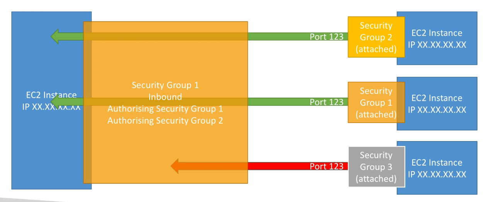

# Table of Contents

- [Table of Contents](#table-of-contents)
- [Elastic Compute Cloud / EC2](#elastic-compute-cloud--ec2)
- [EC2 Sizing and Configuration Options](#ec2-sizing-and-configuration-options)
- [EC2 User Data](#ec2-user-data)
- [EC2 Instance Types: Brief Overview](#ec2-instance-types-brief-overview)
- [Launching an EC2 Instance running Linux](#launching-an-ec2-instance-running-linux)
- [EC2 Instance Information](#ec2-instance-information)
- [EC2 Instance Types - Detailed Overview](#ec2-instance-types---detailed-overview)
  - [EC2 Instance Types: Naming Convention](#ec2-instance-types-naming-convention)
  - [EC2 Instance Types: General Purpose](#ec2-instance-types-general-purpose)
  - [EC2 Instance Types: Compute Optimized](#ec2-instance-types-compute-optimized)
  - [EC2 Instance Types: Memory Optimized](#ec2-instance-types-memory-optimized)
  - [EC2 Instance Types: Storage Optimized](#ec2-instance-types-storage-optimized)
- [EC2 Security Groups](#ec2-security-groups)
  - [Overview](#overview)
  - [Referencing other Security Groups](#referencing-other-security-groups)
  - [Overview of Classic Ports](#overview-of-classic-ports)
  - [Security Groups: Rules](#security-groups-rules)
- [SSH](#ssh)
  - [SSH: Overview](#ssh-overview)
  - [SSH: Login using Linux or Mac](#ssh-login-using-linux-or-mac)
  - [SSH: Troubleshooting](#ssh-troubleshooting)
  - [SSH: Login via EC2 Instance Connect](#ssh-login-via-ec2-instance-connect)
    - [EC2 Instance Connect: Overview](#ec2-instance-connect-overview)
    - [EC2 Instance Connect: Login](#ec2-instance-connect-login)
    - [EC2 Instance Connect: Troubleshooting](#ec2-instance-connect-troubleshooting)
- [EC2 Instance: Roles](#ec2-instance-roles)
- [EC2 Instance: Purchasing Options](#ec2-instance-purchasing-options)
  - [EC2 On-Demand](#ec2-on-demand)
  - [EC2 Reserved Instances](#ec2-reserved-instances)
  - [EC2 Savings Plan](#ec2-savings-plan)
  - [EC2 Spot Instances](#ec2-spot-instances)
  - [EC2 Dedicated Hosts](#ec2-dedicated-hosts)
  - [EC2 Dedicated Instances](#ec2-dedicated-instances)
  - [EC2 Capacity Reservations](#ec2-capacity-reservations)
  - [Price Comparisons](#price-comparisons)
- [EC2 Instance: Storage](#ec2-instance-storage)
  - [Elastic Block Store (EBS) Volumes](#elastic-block-store-ebs-volumes)
    - [EBS: Overview](#ebs-overview)
    - [EBS: Creating and Assigning a Volume](#ebs-creating-and-assigning-a-volume)
      - [Root Volume](#root-volume)
      - [New Unassigned Volume](#new-unassigned-volume)
    - [EBS: Volume Types](#ebs-volume-types)
      - [General Purpose SSD](#general-purpose-ssd)
      - [Provisioned IOPS (PIOPS) SSDs](#provisioned-iops-piops-ssds)
      - [Hard Disk Drives (HDD)](#hard-disk-drives-hdd)
    - [EBS: Snapshots](#ebs-snapshots)
      - [EBS Snapshots: Overview](#ebs-snapshots-overview)
      - [EBS Snapshots: Features](#ebs-snapshots-features)
      - [EBS Snapshots: Creating a Snapshot](#ebs-snapshots-creating-a-snapshot)
      - [EBS Snapshots: Copying Snapshots to Another Region](#ebs-snapshots-copying-snapshots-to-another-region)
      - [EBS Snapshots: Create Volume from Snapshot](#ebs-snapshots-create-volume-from-snapshot)
      - [EBS Snapshots: Recycle Bin](#ebs-snapshots-recycle-bin)
      - [EBS Snapshots: Archiving](#ebs-snapshots-archiving)
    - [EBS: Multi-Attach - io1 / io2 family](#ebs-multi-attach---io1--io2-family)
  - [AMI](#ami)
    - [AMI: Overview](#ami-overview)
    - [AMI: Creating an AMI](#ami-creating-an-ami)
  - [EC2 Instance Store](#ec2-instance-store)
  - [Amazon Elastic File System (EFS)](#amazon-elastic-file-system-efs)
    - [EFS: Overview](#efs-overview)
    - [EFS: Create a File System](#efs-create-a-file-system)
    - [EFS: Mounting the File System to an EC2 Instance](#efs-mounting-the-file-system-to-an-ec2-instance)
  - [EBS vs EFS](#ebs-vs-efs)
- [FAQs](#faqs)
- [References](#references)

---

# Elastic Compute Cloud / EC2

Elastic Compute Cloud or simply EC2 is one of the most popular AWS offerings. EC2 is an Infrastructure-as-a-Service where you can do the following:

- Rent virtual machines called EC2 Instances.
- Storing data on virtual drives called Elastic Block Stores (EBS)
- Distribute Load across machines using Elastic Load Balancers (ELB)
- Scale the services using an Auto-Scaling Group (ASG)

Knowing how EC2 works is fundamental to understand how the Cloud works.

---

# EC2 Sizing and Configuration Options

So what are the configuration options for the EC2 Instances that we can rent from AWS?

- **Operating System**: Linux, Windows or MacOS.
- **CPU**: Power and Cores
- **Memory**: RAM
- **Storage**: Disk Space that is Network-attached (**EBS** & **EFS**) or Hardware-attached (EC2 Instance Store)
- **Network Card**: Speed of the Card, Public IP Address
- **Firewall Rules**: Security group
- **Bootstrap Script** (Configure at first launch): EC2 User Data

There are more configuration options in EC2 Instances but at the core of it, all we need to know is we can choose how we want our Virtual Machine setup. That is the power of the Cloud.

---

# EC2 User Data

It is possible to boostrap our EC2 Instance using EC2 User Data script. Boostrapping means launching commands when a machine starts, i.e. the script is only run once, when the instance first starts and never be run again.

The EC2 User Data has a very specific purpose - It is to automate boot tasks, hence the name bootstrapping. The tasks we might want to automate are:

- Installing Updates
- Installing Software
- Download common files from the internet
- Anything you can think of that can be run on a virtual machine

> **Note:** The EC2 User Data script runs with the Root User. So any command you have, will have the `sudo` rights.

---

# EC2 Instance Types: Brief Overview

What type of instances do we get for EC2?

We have hundreds of types of instances for EC2, but here are some examples:

| Instance    | vCPU | Mem (GiB) | Storage          | Network Performance | EBS Bandwidth (Mbps) |
| ----------- | ---- | --------- | ---------------- | ------------------- | -------------------- |
| t2.micro    | 1    | 1         | EBS-Only         | Low to Moderate     |                      |
| t2-xlarge   | 4    | 16        | EBS-Only         | Moderate            |                      |
| c5d.4xlarge | 16   | 32        | 1 x 400 NVMe SSD | Upto 10 Gbps        | 4,750                |
| r5.16xlarge | 64   | 512       | EBS-Only         | 20 Gbps             | 13,600               |
| m5.8xlarge  | 32   | 128       | EBS-Only         | 10 Gbps             | 6,800                |

750 hours per month of t2.micro is available at the Free Tier.

---

# Launching an EC2 Instance running Linux

Amazon EC2 allows you to create virtual machines, or instances, that run on the AWS Cloud. Quickly get started by following the simple steps below.

- [Open the EC2 Console](https://ap-south-1.console.aws.amazon.com/ec2/home?region=ap-south-1#Home:)
- [Open the Instances page](https://ap-south-1.console.aws.amazon.com/ec2/home?region=ap-south-1#Instances:)
- Click on the [Launch Instances](https://ap-south-1.console.aws.amazon.com/ec2/home?region=ap-south-1#LaunchInstances:) Button
- Choose Configuration Options for the Virtual Machine

  - **Name**: Choose a Name for the EC2 Instance

  - **AMI (Amazon Machine Image)**: An AMI contains the software configuration (operating system, application server, and applications) required to launch your instance.

    - Options for Free Tier: `Amazon Linux`, `Ubuntu`, `Microsoft Windows Server`, `RHEL`, `SUSE Linux`, `Debian`
    - Others: `MacOS`
    - **Architecture**: An architecture for the AMI: `64-bit (x86)`, `64-bit (Arm)`

  - **Instance Type**: Choose `t2.micro` for Free tier or any other as required.

  - **Create a Key-pair (SSH public-private key)**. Choose the RSA algorithm for Key-pair encryption type and the `.pem` format for Mac, Linux or Windows 10 as the private key file format. For lower versions of Windows < 10, use the `.ppk`

  - **Network Settings**: Network settings allow an EC2 Instance to be connected to via SSH or RDP and add Security Group rules to allow HTTPS and HTTPS traffic from the internet.

    - Create a Security Group with the following Settings:
      - Allow SSH traffic from (Options: `Anywhere 0.0.0.0/0`, `Custom` and `My IP`)
      - Allow HTTPS traffic from the Internet
      - Allow HTTP traffic from the Internet

  - **Storage (Volumes)**: Specify the storage options for the instance.

    - **EBS Volumes**

      - **Size**: The size of the volume, in GiB. Default is `8` for `gp2` and `gp3`.
        - `io1` and `io2`: 4 GiB to 16,384 GiB
        - `gp2` and `gp3`: 1 GiB to 16,384 GiB
        - `st1` and `sc1`: 125 GiB to 16,384 GiB
        - Magnetic (`standard`): 1 GiB to 1024 GiB
      - **Volume type**:
        - General Purpose SSDs: `gp2` or `gp3`. Default is `gp2`.
        - Provisioned IOPS SSDs: `io1` or `io2`,
        - Cold HDD: `sc1`,
        - Throughput Optimized HDD: `st1`,
        - Magnetic: `standard`
      - **IOPS**: The requested number of I/O operations per second that the volume can support. Default is `3000`. Learn more at [I/O characteristics and monitoring](https://docs.aws.amazon.com/console/ec2/ebs/volumes/types).
      - **Delete on Termination**: Whether to delete EBS storage on termination of EC2 Instance. Default is `Yes`.
      - **Encrypted**: Whether Volume is encrypted or not. Default is: `Not encrypted`.
      - **KMS key**: KMS keys are only applicable when encryption is set on this volume. Amazon EBS encryption uses AWS KMS keys when creating encrypted volumes and snapshots. EBS encrypts your volume with a data key using the industry-standard AES-256 algorithm. Your data key is stored on disk with your encrypted data, but not before EBS encrypts it with your KMS key. Your data key never appears on disk in plaintext. The same data key is shared by snapshots of the volume and any subsequent volumes created from those snapshots.
      - **Throughput**: Throughput that the volume can support specified for Streaming Optimized volumes. Default is `100` for `gp2` and `125` for `gp3`.

    - **Advanced Details**:

      - **Purchasing option**: Request Spot Instances at the Spot price, capped at the On-Demand price. Spot Instances are unused EC2 instances that are available for less than the On-Demand price. Spot Instances can be interrupted, so use them for applications with flexible run times and for applications that can be interrupted.

        - **Maximum price** (Only for Spot Instances): The maximum price per instance hour that you’re willing to pay. If you do not specify a value, your maximum price is the value specified in the launch template. If the launch template does not specify a maximum price, you are charged the Spot price, capped at the On-Demand price.

        - **Request type** (Only for Spot Instances): Specify a persistent request so that interrupted Spot Instances are requested again. If you do not specify a request type, EC2 uses the type specified in the launch template. If the launch template does not specify a request type, EC2 defaults to a one-time request. Persistent requests are only supported when Interruption behavior is set to either hibernate or stop.

        - **Valid to** (Only for Spot Instances): The expiration date for a persistent Spot request. Valid only for persistent requests. If you do not specify a date, EC2 uses the date specified in the launch template. If the launch template does not specify an expiration date, a persistent request remains active until you cancel it.

        - **Interruption behaviour** (Only for Spot Instances): The behavior when a Spot Instance is interrupted. For persistent requests, valid values are `stop` and `hibernate`. For one-time requests, only `terminate` is valid. If you do not specify a value, EC2 terminates the instance on interruption. Charges for EBS volume storage apply when an instance is stopped. If no value is specified the value of the source template will still be used. If the template value is not specified then the default API value will be used.

        - **Block duration** (Only for Spot Instances): Specify a Spot block of up to 360 minutes (6 hours) to prevent Spot Instance interruptions. Valid only for one-time requests. The valid values are `60`, `120`, `180`, `240`, `300`, or `360` minutes. If you do not specify a value, EC2 uses the value in the launch template. If you do not specify a value in the launch template, your Spot Instance can be interrupted.

      - **Domain join directory**: Domain join enables you to join your instance to a directory you've defined in AWS Directory Service, giving you a single sign-on and centralized management experience across a network of Windows and Linux instances. To join a domain, you must have an IAM role with the required permissions. Only active or impaired directories appear in the list.

      - **IAM instance profile**: The IAM instance profile for the instance If no value is specified the value of the source template will still be used. If the template value is not specified then the default API value will be used.

      - **User data**: Specify user data to provide commands or a command script to run when you first launch your instance and only once in the whole lifecycle of the instance. Input is base64 encoded when you launch your instance unless you select the **`User data has already been base64 encoded`** check box.

      Example:

      ```s
      #!/bin/bash
      # Use this for your user data (script from top to bottom)
      # install httpd (Linux 2 version)
      yum update -y
      yum install -y httpd
      systemctl start httpd
      systemctl enable httpd
      echo "<h1>Hello World from $(hostname -f)</h1>" > /var/www/html/index.html
      ```

    - **Summary**:
      - **Number of Instances**: Select the number of instances to launch with the setting. Default: `1`

- Once we are happy with our configuration, we can click **Launch Instance**.
- Click [View All Instances](https://ap-south-1.console.aws.amazon.com/ec2/home?region=ap-south-1#Instances:)
- It may take a while and the Instance status may show as `Pending` initially, but the Instance status should eventually be `Running` to indicate the EC2 Instance is up and running.

---

# EC2 Instance Information

The following information is shown for every instance:

- **Instance ID**: Unique Identifier for the Instance
- **Public IPv4 Address**: What we can use to access our EC2 Instance. If we selected `Allow HTTP traffic from the Internet` and provided the **`User data`** as above to launch a web server, we can run a `curl http://13.233.28.191` to view the webpage.

  > **Note:** If an Instance is Stopped and Started again, AWS may change the **Public IPv4 Address**.

- **Private IPv4 Address**: What other AWS services can use to access the Instance internally, i.e. within the AWS network.

  > **Note:** Even if an Instance is Stopped and Started again, the **Private IPv4 Address** remains unchanged.

---

# [EC2 Instance Types - Detailed Overview](https://aws.amazon.com/ec2/instance-types/)

You can use different types of EC2 Instances that are optimized for different use cases.

## EC2 Instance Types: Naming Convention

For an Instance Type of `m5.2xlarge`

- **`m`** - Instance Class. In this case, a General Purpose type of an instance.
- **`5`** - Generation of the Instance Class. So as AWS improves the hardware over time, AWS will update this value.
- `2xlarge` - Size within the Instance Class. Values can be `nano`, `micro`, `small`, `medium`, `4xlarge` so on. This refers to the storage, CPU and RAM available to the Instance.

---

## EC2 Instance Types: General Purpose

- Great for a diversity of workloads such as web servers or code repositories.
- Balance between resources: **Compute**, **Memory**, **Networking**
- The Free tier instance type available, `t2.micro` is a General Purpose EC2 Instance.

## EC2 Instance Types: Compute Optimized

- Great for a compute intensive workloads that require high performance processors:
  - Batch processing workloads
  - Media transcoding
  - High performance web servers
  - High performance computing (HPC)
  - Scientific modelling and Machine learning
  - Dedicating gaming servers

## EC2 Instance Types: Memory Optimized

- Fast performance for workloads that process large data sets in memory.
- Use cases:
  - High performance relational/non-relational databases
  - Distributed web scale cache stores
  - In-memory databases optimized for BI (Business Intelligence)
  - Applications performing real time processing of big unstructured data

## EC2 Instance Types: Storage Optimized

- Great for storage-intensive tasks that require high sequential read and write access to large data sets on local storage.
- Use cases:
  - High frequency online transaction processing (OLTP) systems
  - Relational & NoSQL Databases
  - Cache for in-memory databases (E.g. Redis)
  - Data warehousing applications
  - Distributed file systems

---

# EC2 Security Groups

## Overview

Security Groups are fundamental to network security in AWS Cloud.

**Overview:**

- They control how traffic is allowed in and out of our EC2 Instances.
- Security Groups only contain **_allow_** rules.
- Security Group rules can reference by IP or by other Security Groups.
- Security Groups act as a Firewall on EC2 Instances.
- They regulate:
  - Access to Ports
  - Authorized IP Ranges - IPv4 and IPv6
  - Control the inbound network (ingress)
  - Control the outbound network (egress)
- A single Security Group can be attached to multiple EC2 Instances.
- Security Groups are locked down to a Region / VPC combination.
- Security Groups live "outside" the EC2. It is not installed on the EC2 Instance but is a Firewall that lives outside.
- If your application is not accessible (Time out), then it's a Security Group issue. However, if you receive a **"Connection Refused"** error, then it's an application error or it's not launched yet.
- All inbound traffic is blocked by default.
- All outbound traffic is authorized by default.

**Example:**

| Type            | Protocol | Port Range | Source            | Description    |
| --------------- | -------- | ---------- | ----------------- | -------------- |
| HTTP            | TCP      | 80         | 0.0.0.0/0         | test http page |
| SSH             | TCP      | 22         | 122.149.196.85/32 |                |
| Custom TCP Rule | TCP      | 4567       | 0.0.0.0           | java app       |

> **Note:** It is considered Best practice to maintain one separate security group for SSH access as it is a complex kind of connection and it will be easier to diagnose if something goes wrong.

---

## Referencing other Security Groups



---

## Overview of Classic Ports

| Port     | Protcol                                      | Purpose                              |
| -------- | -------------------------------------------- | ------------------------------------ |
| **22**   | SSH (Secure Shell)                           | Log into a Linux Instance            |
| **21**   | FTP (File Transfer Protocol)                 | Upload files into a file share       |
| **22**   | SFTP (Secure File Transfer Protocol)         | Upload files using SSH               |
| **80**   | HTTP (Hyper Text Transfer Protocol)          | Connect over an unsecured connection |
| **443**  | HTTPS (Hyper Text Transfer Protocol Secured) | Connect over a secured connection    |
| **3389** | RDP (Remote Desktop Protocol)                | Log into a Windows Instance          |

---

## Security Groups: Rules

We can visit the [Security Groups](https://ap-south-1.console.aws.amazon.com/ec2/home?region=ap-south-1#SecurityGroups:) from the EC2 Console's **Network & Security** section.

Here we can, Create new Security Groups, Edit or View existing Security Groups.

Each Security Group has an Inbound and an Outbound Rule

- **Inbound Rules**: These allow connectivity to the EC2 Instance
- **Outbound Rules**: These allow connectivity from the EC2 Instance

---

# SSH

## SSH: Overview

How would you connect inside of your servers to perform some maintenance or action? We can do so by using SSH. The Secure Shell Protocol (SSH) is a cryptographic network protocol for operating network services securely over an unsecured network.

Based on the operating system you have on your computer, you have different ways of achieving it.

- **For Linux, Mac and Windows 10+ users** - SSH is available via a Command Line Interface utility tool available with the same name (`ssh`). SSH is the network protocol, while `ssh` a CLI tool with the same name exists on Linux, Mac and Windows 10+.
- **For Windows users before Windows 10** - You can use a tool called **PuTTY** which is an SSH client. **PuTTY** is also available for all versions of Windows including Windows 10+.

---

## SSH: Login using Linux or Mac

**Requirements:**

- The `.pem` or `.ppk` containing the private key that we downloaded during the setup of the EC2 Instance is what we will use to login via SSH.
- A running EC2 Instance.
- The Public IPv4 Address of the EC2 Instance. This can be found in the EC2 Console's Instance page.
- The Security settings of the EC2 Instance should have PORT 22 allowing ingress from 0.0.0.0/0

**Steps to Connect:**

1. If your instance name contains a space, the `.pem` or `.ppk` file that is downloaded will have those spaces in the filename. Remove the spaces in the filename.

2. Move the key to a folder of choice. A best practice is keeping them in the `.ssh` folder in Linux based distros. So you may want to run:

   ```s
   mv ~/Downloads/[ privatekey-file ] ~/.ssh
   ```

3. We can move into the `.ssh` folder using `cd .ssh` and then run the following syntax:

   ```s
   ssh -i [ privatekey-file ] [ AMI User ]@[ EC2 Public IPv4 Address ]
   ```

   By default, the `Amazon Linux 2 AMI` has already set up an user for us, called `ec2-user`. We can create more users once we log in, but for the first time we login, we have to use the `ec2-user`.

   So the first login via SSH might look like:

   ```s
   ssh -i ec2-playground.pem ec2-user@13.233.28.191
   ```

4. You might get the following error:

   ```s
   @@@@@@@@@@@@@@@@@@@@@@@@@@@@@@@@@@@@@@@@@@@@@@@@@@@@@@@@@@@
   @         WARNING: UNPROTECTED PRIVATE KEY FILE!          @
   @@@@@@@@@@@@@@@@@@@@@@@@@@@@@@@@@@@@@@@@@@@@@@@@@@@@@@@@@@@
   Permissions 0666 for 'ec2-playground.pem' are too open.
   It is required that your private key files are NOT accessible by others.
   This private key will be ignored.
   Load key "ec2-playground.pem": bad permissions
   ec2-user@3.110.132.159: Permission denied (publickey,gssapi-keyex,gssapi-with-mic).
   ```

   This happens because the file mode has permissions that can make it accessible and may be changed by others because it may have write permissions.

   We can fix this by running:

   ```s
   chmod 400 ec2-playground.pem
   ```

   This makes it only readable by the current user.

   Now if we try to login using `ssh -i ec2-playground.pem ec2-user@13.233.28.191` we should be able to see the successful login message:

   ```s
   Last login: Wed Nov  9 06:36:09 2022 from 49.37.47.157

        __|  __|_  )
        _|  (     /   Amazon Linux 2 AMI
        ___|\___|___|

    https://aws.amazon.com/amazon-linux-2/
    [ec2-user@ip-13-233-28-191 ~]$
   ```

---

## SSH: Troubleshooting

1. **There's a connection timeout**

   This is a security group issue. Any timeout (not just for SSH) is related to security groups or a firewall. Ensure your security group looks like this and correctly assigned to your EC2 instance.

2. **There's still a connection timeout issue**

   If your security group is properly configured as above, and you still have connection timeout issues, then that means a corporate firewall or a personal firewall is blocking the connection. Please use [EC2 Instance Connect](#ssh-ec2-instance-connect) as described in the next section.

3. **SSH does not work on Windows**

   If it says: `ssh command not found`, that means you have to use **PuTTY**.

   Try using PuTTY. If things don't work, please use EC2 Instance Connect.

4. **There's a connection refused**

   This means the instance is reachable, but no SSH utility is running on the instance

   - Try to restart the instance

   - If it doesn't work, terminate the instance and create a new one. Make sure you're using **Amazon Linux 2**

5. **`Permission denied (publickey,gssapi-keyex,gssapi-with-mic)`**

   This means either two things:

   - You are using the wrong security key or not using a security key. Please look at your EC2 instance configuration to make sure you have assigned the correct key to it.

   - You are using the wrong user. Make sure you have started an **Amazon Linux 2 EC2 instance**, and make sure you're using the user **ec2-user**. This is something you specify when doing `ec2-user@<public-ip>` (ex: `ec2-user@35.180.242.162`) in your SSH command or your PuTTY configuration.

6. **Nothing is working - "aaaahhhhhh"**

   Don't panic. Use **[EC2 Instance Connect](#ssh-ec2-instance-connect)** from the next section.

7. **I was able to connect yesterday, but today I can't**

   This is probably because you have stopped your EC2 instance and then started it again today. When you do so, the public IP of your EC2 instance will change. Therefore, in your command, or PuTTY configuration, please make sure to edit and save the new public IP.

---

## SSH: Login via EC2 Instance Connect

### EC2 Instance Connect: Overview

**EC2 Instance Connect** is an OS agnostic way of connecting to EC2 Instances via SSH Protocol through the web browser instead of using the `ssh` CLI tool or `PuTTY`.

With EC2 Instance Connect, you can control SSH access to your instances using AWS Identity and Access Management (IAM) policies as well as audit connection requests with AWS CloudTrail events. In addition, you can leverage your existing SSH keys or further enhance your security posture by generating one-time use SSH keys each time an authorized user connects. Instance Connect works with any SSH client, or you can easily connect to your instances from a new browser-based SSH experience in the EC2 console.

With the EC2 Instance Connect, a temporary SSH key is created at every login and thus eliminates the necessity of managing SSH keys.

---

### EC2 Instance Connect: Login

- Go the [Instances Page in the EC2 Console](https://ap-south-1.console.aws.amazon.com/ec2/home?region=ap-south-1#Instances:).
- Select the EC2 Instance and click **Connect**.
- Click to Select the EC2 Instance Connect Tab (Default: Selected)
- By default the `ec2-user` is entered as the User name. So we can simply leave it as it is, at least during our initial login. We may also override this with an existing user.
- Click on **Connect** to connect to the EC2 Instance running the AMI. This opens a new tab.
- If the Login welcome message shows, that means you are now connected!

---

### EC2 Instance Connect: Troubleshooting

1. **There was a problem connecting to your instance**

   This happens because there was a problem establishing a connection because the Security Group Inbound Rule didn't include the PORT 22. If the problem persists, open both the PORT 22 for both IPv4 and IPv6 addresses.

---

# EC2 Instance: Roles

As a rule of thumb, never ever enter your Personal Access Credentials into an EC2 Instance. This is because any others logging into the EC2 Instance could retrieve those credentials. Instead, we have to use IAM Roles.

Considering we have a IAM Role created, named **EC2User** that provides the `IAMReadOnlyAccess` permissions to EC2, we need to attach this role to our EC2 Instance to provide it with Credentials.

By default we can check for the Security section of our Instance and see that there is no IAM Role attached.

To fix this, we can select the EC2 Instance and click on **Actions** ---> **Security** ---> **Modify IAM Role**. We can then select the Role: **EC2User** and click **Update IAM Role**.

Now if we run:

```s
aws iam list-users
```

We will get a response with the list of IAM Users as the **`IAMReadOnlyAccess`** permission allows this. If we remove the role, we will not be able to run the IAM read commands anymore.

---

# EC2 Instance: Purchasing Options

## EC2 On-Demand

- Pay for What you use
  - Linux or Windows - Billing per second, after the first minute
  - All other Operating Systems - Billing per hour
- Has the highest cost but no upfront payment
- No long-term commitment
- Recommended for short-term and un-interrupted workloads, where you cannot predict how the application will behave.

---

## EC2 Reserved Instances

- Upto 72% Discount compared to On-Demand (Subject to change)
- You reserve specific instance attributes (Instance Type, Region, Tenancy, OS)
- Reservation Period - 1 year (+ discount) or 3 years (+++ discount)
- Payment Options - No Upfront (+), Partially Upfront (++), All Upfront (+++)
- Reserved Instance's Scope - Regional or Zonal (reserve capacity in an Availability Zone)
- Recommended for stead-state usage applications (Databases)
- You can buy or sell in the Reserved Instances Marketplace if you don't need them anymore

There's a specific type of Reserved Instances, called Convertible Reserved Instances

- Can change the EC2 Instance Type, Instance family, OS, Scope and Tenancy
- Upto 66% Discount (Subject to change)

---

## EC2 Savings Plan

- Get a Discount based on Long-term usage (upto 72%, same as Reserved Instances)
- Commit to a certain type of usage ($10/hour for 1 or 3 years)
- Usage beyond the Savings Plan is going to be billed at the On-Demand price
- Locked to a specific Instance family and AWS Region (e.g. `m5` in `us-east-1`)
- Flexible across:
  - Instance Size (e.g. `m5.xlarge`, `m5.2xlarge`)
  - OS (e.g. Linux, Windows and so on)
  - Tenancy (Host, Dedicated, Default)

---

## EC2 Spot Instances

- Most aggressive discounts - Can get a Discount upto 90% compared to On-demand
- Instances that you can "lose" at any point of time if your max price is less than the current spot price.
- The MOST cost-efficient instances in AWS.
- Useful for workloads that are resilient to failure
- Use Cases maybe:
  - Batch jobs
  - Data analysis
  - Image processing
  - Any distributed workloads
  - Workloads with a flexible start and end time
- Not suited for critical jobs or databases

---

## EC2 Dedicated Hosts

- A physical server with EC2 Instance capacity, fully dedicated for your use. i.e. Access to the physical server itself and gives access to lower level hardware
- Allows you address compliance requirements and use your existing server-bound software licenses (per-socket, per-core, per-VM software licenses)
- Purchasing options:
  - On Demand: pay per second for active Dedicated Host
  - Reserved: 1 or 3 years (No Upfront, Partial Upfront, All Upfront)
- The most expensive option
- Useful for software that have a complicated licensing model (BYOL - Bring Your Own License)
- Useful for companies that have strong regulatory or compliance needs.

---

## EC2 Dedicated Instances

- Instances run on hardware that is dedicated to you (which is different from a physical server). i.e. Own instance on your own hardware
- May share hardware with other instances in same account
- No control over instance placement (can move Hardware after Stop / Start)

---

## EC2 Capacity Reservations

- Reserve On-Demand instance capacity in a specific AZ for any duration
- You always have access to that EC2 capacity when you need it
- No time commitment (create/cancel anytime), no billing discounts - the only purpose is to reserve capacity.
- To get discounts, combine with Regional Reserved Instances and Savings Plans to benefit from billing discounts.
- You're charged at On-Demand rate whether you run instances or not.
- Suitable for short-term, uninterrupted workloads that need to be in a specific AZ.

---

## Price Comparisons

Price comparisons at a certain point in time for `m4.large` instance for `us-east-1`:

| Price Type                             | Price (per hour)                           |
| -------------------------------------- | ------------------------------------------ |
| On-Demand                              | $0.10                                      |
| Spot Instance (Spot Price)             | $0.038 - $0.039 (upto 61% off)             |
| Reserved Instance (1 Year)             | $0.058 (All Upfront) - $0.062 (No Upfront) |
| Reserved Instance (3 Years)            | $0.037 (All Upfront) - $0.043 (No Upfront) |
| EC2 Savings Plan (1 Year)              | $0.058 (All Upfront) - $0.062 (No Upfront) |
| Reserved Convertible Instance (1 Year) | $0.066 (All Upfront) - $0.071 (No Upfront) |
| Dedicated Host                         | On-Demand price                            |
| Dedicated Host Reservation             | Upto 70% Off                               |
| Capacity Reservations                  | On-Demand price                            |

The AWS Certification exams will want you to know which type of instance is the right one based on your workload.

---

# EC2 Instance: Storage

Let's look at the different storage options for EC2 Instances.

## Elastic Block Store (EBS) Volumes

### EBS: Overview

An EBS (Elasic Block Store) Volume is a network drive that you can attach to your instances while they run. So far, if we've run an EC2 Instance, we have been using them without knowing.

EBS Volumes allow us to persist data even after the Instance has been terminated. The purpose it serves is that, we can re-create a new EC2 Instance and mount the same EBS Volume to the new Instance.

**Characteristics:**

- It's a Network drive (i.e. not a physical drive).
  - It uses the network to communicate the instance, which means there might be a bit of latency.
- One EBS Volume can only be mounted to one EC2 Instance at a time. They can also be unattached, and attached only when there is a necessity.
- Multiple EBS Volumes can be attached to the same EC2 Instance.
- EBS Volumes can be detached from an EC2 Instance and attached to another one quickly. Think of them as a "Network USB stick" which can unmount from one instance and mount to another instance.
- Bound to a specific Availability Zone: An EBS Volume in `ap-south-1a` cannot be attached to an Instance in `ap-south-1b`.
- To move a volume across, you first need to snapshot it.
- Has a one-time provisioned capacity (size in GiBs and IOPS).
- Delete on Termination is possible, i.e. when the EC2 Instance is terminated, the EBS volume would be deleted. This option is also available during the creation of an EC2 Instance.
  - By default: The root EBS Volume is deleted (attribute enabled).
  - By default: Any other EBS Volume is not deleted (attribute disabled).
- Can be controlled by the AWS CLI. For e.g. If you want to preserve the Root Volume after an Instance has been created with the Delete on Termination enabled, this can be done via the AWS CLI.
- Free Tier: 30GB of Free EBS storage of General Purpose (SSD) or Magnetic per month.

---

### EBS: Creating and Assigning a Volume

#### Root Volume

The first volume is created via the Launching of a new Instance. Through the Launch Instance wizard we can create the EBS root volume, assign it to the instance with the following Volume settings:

- **Size**: The size of the volume, in GiB. Default is `8` for `gp2` and `gp3`.
  - `io1` and `io2`: 4 GiB to 16,384 GiB
  - `gp2` and `gp3`: 1 GiB to 16,384 GiB
  - `st1` and `sc1`: 125 GiB to 16,384 GiB
  - Magnetic (`standard`): 1 GiB to 1024 GiB
- **Volume type**:
  - General Purpose SSDs: `gp2` or `gp3`. Default is `gp2`.
  - Provisioned IOPS SSDs: `io1` or `io2`,
  - Cold HDD: `sc1`,
  - Throughput Optimized HDD: `st1`,
  - Magnetic: `standard`
- **IOPS**: The requested number of I/O operations per second that the volume can support. Default is `3000`. Learn more at [I/O characteristics and monitoring](https://docs.aws.amazon.com/console/ec2/ebs/volumes/types).
- **Delete on Termination**: Whether to delete EBS storage on termination of EC2 Instance. Default is `Yes`.
- **Encrypted**: Whether Volume is encrypted or not. Default is: `Not encrypted`.
- **KMS key**: KMS keys are only applicable when encryption is set on this volume. Amazon EBS encryption uses AWS KMS keys when creating encrypted volumes and snapshots. EBS encrypts your volume with a data key using the industry-standard AES-256 algorithm. Your data key is stored on disk with your encrypted data, but not before EBS encrypts it with your KMS key. Your data key never appears on disk in plaintext. The same data key is shared by snapshots of the volume and any subsequent volumes created from those snapshots.
- **Throughput**: Throughput that the volume can support specified for Streaming Optimized volumes. Default is `100` for `gp2` and `125` for `gp3`.

By default, the Root Volume is created in the same Availability Zone as the Instance.

---

#### New Unassigned Volume

These Volume settings above also show up if we attempt to create the EBS Volume standalone.

To create the Volume,

1. Go to the [Volumes page in the EC2 Console](https://ap-south-1.console.aws.amazon.com/ec2/home?region=ap-south-1#Volumes:)
2. Click **Create Volume**
3. Assign the Volume Settings.
4. You may observe that two new setting shows up here which did not show up during the Launch Instance:
   - Availability Zone (must be in the same AZ as the EC2 Instance it will need to be assigned to)
   - Snapshot ID (to [create the Volume from a snapshot](#ebs-snapshots), which we will learn about in the next section)
5. Click **Create Volume**. The Volume will be created and can now be assigned to an already running Instance in the same Availability Zone as soon as the `Volume state` turns from `Creating` to `Available`.
6. To attach a Volume, select the Volume and then click `Actions` ---> `Attach Volume`. From the Attach Volume wizard, select a running Instance from the list and click `Attach Volume`. The Volume is now attached, indicated by its Volume state being `In use`. This is reflected back if we select the Instance in the [Instances page](https://ap-south-1.console.aws.amazon.com/ec2/home?region=ap-south-1#Instances:) and check the Storage panel. We will find this volume appear there.

> **Note:** Attaching an EBS Volume is not enough to make it ready for use with the EC2 Instance. Check out [Make an EBS Volume available for use on Linux](https://docs.aws.amazon.com/AWSEC2/latest/UserGuide/ebs-using-volumes.html) to make it available for use. (This article is written during the preparation for the [AWS Developer Associate Certification](./../aws-certifications/aws-developer-associate/README.md) and it is out of scope for this. I will try to add this section here, later.)

---

### [EBS: Volume Types](https://docs.aws.amazon.com/AWSEC2/latest/UserGuide/ebs-volume-types.html)

#### General Purpose SSD

- Cost-effective storage, low-latency
- Use Cases:
  - System boot volumes
  - Virtual desktops
  - Development and test environments
- 1 GiB - 16 GiB
- `gp3`
  - Newer generation of General Purpose SSDs
  - Baseline of 3,000 IOPS and throughput of 125 MiB/s
  - Can increase IOPS up to 16,000 and throughput upto 1000 MiB/s independently
- `gp2`
  - Small gp2 volumes can burst IOPS to 3,000
  - Size of the volume and IOPS are linked, max IOPS is 16,000
  - 3 IOPS per GiB, means at 5,334 GiB we are at the max IOPS

---

#### Provisioned IOPS (PIOPS) SSDs

- Use Cases:
  - Critical business applications with sustained IOPS performance
  - Applications that need more than 16,000 IOPS
  - Great for database workloads (sensitive to storage performance and consistency)
  - `io1` / `io2` (4 GiB - 16 TiB)
    - Max PIOPS: 64,000 for Nitro EC2 instances & 32,000 for others
    - Can increase PIOPS independently from storage size (just like `gp3`)
    - `io2` has more durability and more IOPS per GiB (at the same price as `io1`)
  - io2 Block Express (4 GiB - 16 TiB)
    - Sub-millisecond latency
    - Max PIOPS: 256,000 with an IOPS:GiB ratio of 1000:1
  - Supports EBS Multi-attach

---

#### Hard Disk Drives (HDD)

- Cannot be Boot volumes
- 125 MiB to 16 TiB
- Throughput Optimized HDD (`st1`)
  - Big Data, Data warehouses, Log processing
  - Max throughput 500 MiB/s - max IOPS 500
- Cold HDD (`sc1`)
  - For data that is infrequently accessed, i.e. archive data
  - Scenarios where lowest cost is important
  - Max throughput 250 MiB/s - max IOPS 250

---

### EBS: Snapshots

#### EBS Snapshots: Overview

You can back up the data on your Amazon EBS volumes to Amazon S3 by taking point-in-time snapshots. Snapshots are incremental backups, which means that only the blocks on the device that have changed after your most recent snapshot are saved. This minimizes the time required to create the snapshot and saves on storage costs by not duplicating data. Each snapshot contains all of the information that is needed to restore your data (from the moment when the snapshot was taken) to a new EBS volume. Snapshots across Availability Zones or Regions.

It is considered a Best Practice (although not mandatory) to detach volume before taking a snapshot.

---

#### EBS Snapshots: Features

- **EBS Snapshots Archive**
  - Move a Snapshot to an "archive tier" that is 75% cheaper.
  - Takes within 24 - 72 hours for restoring the archive.
- **Recycle Bin for EBS Snapshots**
  - Setup rules to retain deleted snapshots so you can recover them after an accidental deletion.
  - Specify retention period (1 day - 1 year)
- **Fast Snapshot Restore (FSR)**
  - Force full initialization of snapshot to have no latency on first use.
  - It is helpful when the snapshot is huge and there is a need to initialize an EBS volume or Instance out of it, very quickly.
  - This feature is expensive, so be careful with it.

---

#### EBS Snapshots: Creating a Snapshot

- Select the Volume and click `Actions` ---> `Create snapshot`
- Describe the Snapshot and create the snapshot by clicking `Create snapshot`

---

#### EBS Snapshots: Copying Snapshots to Another Region

- Go to the [Snapshots page](https://ap-south-1.console.aws.amazon.com/ec2/home?region=ap-south-1#Snapshots:) from the EC2 Console
- Select the Snapshot and right click and `Copy snapshot` or click `Actions` ---> `Copy snapshot`
- Select any Destination Region from the options. This is very handy if you want to have a Disaster Recovery Strategy to make sure your data is backed up in another region of AWS.

---

#### EBS Snapshots: Create Volume from Snapshot

- Go to the [Snapshots page](https://ap-south-1.console.aws.amazon.com/ec2/home?region=ap-south-1#Snapshots:) from the EC2 Console
- Select the Snapshot and right click and `Create volume from snapshot` or click `Actions` ---> `Create volume from snapshot`
- Select the volume settings. Note: The `Snapshot ID` setting doesn't show up because the snapshot ID is already assigned as we are creating a volume from a snapshot. We can select the rest of the settings just like how we did when we [created a new volume](#new-unassigned-volume)
- Click `Create volume` to create the volume

We can go back to [Volumes](https://ap-south-1.console.aws.amazon.com/ec2/home?region=ap-south-1#Volumes:) and we will find the new volume show up there. We can confirm this was created via the Snapshot by checking the `Snapshot` field. It should have the same `Snapshot ID` as the snapshot that was used to create it.

---

#### EBS Snapshots: Recycle Bin

The Recycle Bin is a feature to protect your Amazon EBS Snapshots and [Amazon Machine Images (AMIs)](#ami) from accidental deletion. We can set it up by creating a `Retention Rule`.

- Go to the [Snapshots page](https://ap-south-1.console.aws.amazon.com/ec2/home?region=ap-south-1#Snapshots:) and click the `Recycle Bin`.
- Click **Create retention rule**.
- We can now modify the following settings:
  - Retention rule name
  - Retention rule description
  - Resource type - `EBS Snapshots` or `Amazon Machine Image (AMI)`
  - Apply to all resources
  - Retention period
- Click `Create retention rule` to finalize these retention rules.

The **Retention rule** panel shows any created Retention rules.
The **Resources** panel is supposed to show any corresponding resources (EBS Snapshots or Amazon Machine Images) that have been deleted. The first time it is deleted it is placed in the Recycle Bin. The Recycle Bin keeps it until the Retention period is over. However deleted Snapshots or AMIs can be **Recovered** from here.

---

#### EBS Snapshots: Archiving

By default the Storage tier for EBS Volumes is `Standard`. We can move the Storage tier to `Archive` by archiving snapshots. Archiving a snapshot stores a full copy of the snapshot in the archive tier. After you archive the snapshot, you will not be able to use it. To use the snapshot then, you must first restore it.

- Go to the [Snapshots page](https://ap-south-1.console.aws.amazon.com/ec2/home?region=ap-south-1#Snapshots:) from the EC2 Console
- Select the Snapshot and right click and `Archive snapshot` or click `Actions` ---> `Archive snapshot`

---

### EBS: Multi-Attach - io1 / io2 family

- The Multi-Attach feature is available to only the `io1` and `io2` family (Provisioned IOPS SSDs) of EBS Volumes
- Attach the same EBS volume to multiple EC2 instances in the same Availability Zone
- Each instance will have full Read and Write permissions to the high-performance volume
- Use Cases:
  - Achieve higher availability in clustered Linux applications (ex: Teradata)
  - The application must manage concurrent write operations
- Upto **`16`** EC2 Instances at a time
- Must use a file system that is cluster-aware (not XFS, EX4 etc.)

---

## AMI

### AMI: Overview

What powers our EC2 Instances is an AMI.

- AMI stands for Amazon Machine Image and they represent a customization of an EC2 Instance
  - You can add your own Software, configuration, operating system, monitoring tool
  - Creating our own AMI may give us a faster boot, configuration time because all your software is pre-packaged through the AMI
  - AMIs are built for a specific region (and can be copied across regions if we want to leverage the AWS Global Infrastructure)
  - You can launch EC2 Instances from:
    - A Public AMI: AWS provided (e.g. Amazon Linux 2)
    - Your own AMI: You make and maintain them yourself
    - An AWS Marketplace AMI: An AMI someone else made (and potentially sells)

---

### AMI: Creating an AMI

**Process:**

- Start an EC2 Instance and then Customize it (by running scripts via EC2 User Data)
- Stop the instance (for data integrity)
- Build an AMI from it - this will also create EBS snapshots
- Launch instances from this newly built AMI

---

## EC2 Instance Store

EBS Volumes are Network drives with good but "limited" performance. But sometimes you want higher performance and that can happen through the **EC2 Instance Store**, which is a high-performance hardware disk attached onto your EC2 Instance.

The EC2 Instance is a virtual machine but it is obviously attached to a real hardware server. Some of these servers do have disk space attached directly with a physical connection onto the server. And so a special type of EC2 Instance can leverage the **EC2 Instance Store**.

The EC2 Instance Store has the following characteristics:

- Better I/O performance, high throughput
- EC2 Instance Store lose their storage if they're stopped (ephemeral) - cannot be used as a durable, long term place to store your data.
- Good for buffer / cache / scratch data / temporary content
- Risk of data loss if hardware fails
- Backups and Replication are your responsibility

---

## Amazon Elastic File System (EFS)

### EFS: Overview

Amazon Elastic File System (Amazon EFS) is a Network File System that can be mounted on many EC2 Instances in different availability zones. it automatically grows and shrinks as you add and remove files with no need for management or provisioning.

**Characteristics of Amazon EFS:**

- Managed NFS (Network File System) that can be mounted on many EC2 Instances
- EFS works with EC2 Instances in multi-AZ
- Highly available, scalable, expensive (3x `gp2`), pay-per-use
- Use cases:
  - Content management: Web serving, data sharing, Wordpress
- Uses NFSv4.1 Protocol
- Uses Security group to control access to NFS
- Compatible with Linux-based AMI (not Windows)
- Encryption at rest using KMS
- POSIX file system (~Linux) that has a standard file API
- File system scales automatically, pay-per-use, no capacity planning is required

**Performance Classes:**

- **EFS Scale**
  - 1000s of Concurrent NFS Clients, 10 GiB+ /s throughput
  - Grow to Petabyte-scale network file system, automatically without provisioning capacity in advance
- **Performance mode** (set at EFS creation time)
  - General purpose (default): Latency-sensitive use cases (web server, CMS, etc)
  - Max I/O: Higher latency, higher throughput, highly parallel (big data, media processing)
- **Throughput mode**
  - Bursting (1 TiB = 50 MiB/s + burst of upto 100 MiB/s)
  - Provisioned: Set your throughput regardless regardless of storage size (e.g. 1 GiB/s for 1 TiB Storage)

**Storage Classes**

- Storage Tiers (Lifecycle Mangement feature - move files after `n` days)
  - Standard: For frequently accessed files
  - Infrequent access (EFS-IA): Cost to retrieve files when we retrieve them, lower price to store. Enable EFS-IA with a Lifecycle Policy
- Availability & Durability
  - Standard: Multi-AZ, great for production
  - One Zone: One AZ, great for development, backup enabled by default, compatible with IA (EFS One Zone-IA, 90% in cost savings)

---

### EFS: Create a File System

- Go to the **[EFS File System Page](https://ap-south-1.console.aws.amazon.com/efs?region=ap-south-1#/file-systems)** and click **`Create file system`**.

- We have the following File System settings:

  **General Settings**

  - **Name**: Name your file system. (Optional)
  - **Storage class**:
    - **`Standard`**: Stores data redundantly across multiple AZs
    - **`One Zone`**: Stores data redundantly within a single AZ
  - **Automatic backups**:
    - **`Enable automatic backups`**: Automatically backup your file system data with AWS Backup using recommended settings. Additional pricing applies.
  - **Lifecycle management**: EFS Intelligent-Tiering uses Lifecycle Management to automatically achieve the right price and performance blend for your application by moving your files between the Standard and Standard-Infrequent Access storage classes.
    - **`Transition into IA`**: Transition files from Standard to Standard-Infrequent Access.
      - Options: 7, 14, 30, 60, 90 days since last access
    - **`Transition out of IA`**: Transition files from Standard-Infrequent Access to Standard.
      - Options: None and On first access
  - **Performance mode**: Set your file system's performance mode based on IOPS required.
    - **`General Purpose`**: Ideal for latency-sensitive use cases, like web serving environments and content management systems
    - **`Max I/O`**: Scale to higher levels of aggregate throughput and operations per second
  - **Throughput mode**: Set how your file system's throughput limits are determined.
    - **`Bursting`**: Throughput scales with file system size
    - **`Provisioned`**: Throughput fixed at specified amount
  - **Encryption**: Choose to enable encryption of your file system's data at rest. Uses the AWS KMS service key (aws/elasticfilesystem) by default.

- Select the General Settings and click **Next**

- We have the following Network Settings:

  - **Virtual Private Cloud (VPC)**: Choose the VPC where you want EC2 instances to connect to your file system.
  - **Mount targets**: A mount target provides an NFSv4 endpoint at which you can mount an Amazon EFS file system. We recommend creating one mount target per Availability Zone. We need to create a specific Security Group for the File system.

- Next, we have a File System policy which is optional. We will skip it for now. (This reference guide was created during the preparation for [AWS Developer Associate Certification](./../aws-certifications/aws-developer-associate) and the File System policy is out of scope, hence it is skipped for now. I will try to add this when possible)

- Review and click **Create**.

> **Note**: We do not have to select the volume capacity anywhere because EFS is on a Pay-as-you-go model as discussed earlier. The Free Tier offers 5 GB of EFS free for 12 months.

---

### EFS: Mounting the File System to an EC2 Instance

- **Launch** a new EC2 Instance
- In the **Configure storage** section, where it says **0 x File systems** click **Edit**. We will notice the following message: **You currently have no file systems on this instance. You must select a subnet before you can add an EFS file system.** This is because by default, we have no preference on subnet and we allow AWS to automatically assign a subnet from the AZs. Hence we need to do that first.
- Go to the **Network settings** section and click **Edit**
- Choose the `ap-south-1a` subnet.
- Now if we go back to the **Configure storage** section we will see the message: "**You currently have no file systems on this instance. To add a file system, choose Add shared file system."** Let's do that by clicking the **Add shared file system** button.
- We will notice the File system being added with a default mount point of `/mnt/efs/fs1`. This will **Automatically create and attach security groups** and **Automatically mount shared file system by attaching required user data script** which is great.
- Click **`Launch`** to launch the instance.
- To check if the EFS volume is correctly mounted, we can login to the EC2 Instance and write files to the mount point `/mnt/efs/fs1` by using:

  ```s
  echo "Hello world!" > /mnt/efs/fs1/helloworld.txt

  cat /mnt/efs/fs1/helloworld.txt
  # Prints: Hello world!
  ```

> **Note:** As we know, the same EFS file system can be mounted to multiple Instances, hence we can launch another instance and mount this same File system there as well. They will share files hence this `helloworld.txt` in the example above, will be available across Instances sharing this EFS File system across Availability Zones

---

## EBS vs EFS

**EBS Volumes:**

- Can be attached to only one instance at a time
- Are locked at the Availability Zone (AZ) level
- `gp2`: IO increases if the Disk space increases
- `gp3` and `io1`: can Increase IO independently
- Multi-Attach to upto 16 instances using `io1` and `io2` (Provisioned IOPS SSDs)
- To Migrate an EBS volume across AZ
  - Take a snapshot
  - Copy the snapshot to another AZ
  - EBS backups use IO and you shouldn't run them while your application is handling a lot of traffic.
- Root EBS volumes of instances get terminated by default if the EC2 instance gets terminated (can be disabled).

**EFS Volumes:**

- Mounting of 100s of instances across AZ
- EFS share website files (Wordpress)
- Only for Linux instances (POSIX)
- EFS has a higher price point than EBS
- Can leverage EFS-IA for cost savings

---

# FAQs

<details open>
    <summary style="font-weight: bold; color: orange">
        You have launched an EC2 instance with two EBS volumes, the Root volume type and the other EBS volume type to store the data. A month later you are planning to terminate the EC2 Instance. What's the default behaviour that will happen to each EBS volume?
    </summary>
    <br>
    <p style="margin-left: 15px; font-weight: bold">
        The root volume type will be deleted and the EBS volume type will not be deleted
    </p>
    <p style="padding-left: 15px">
        The Root volume type will be deleted as its Delete on Termination attribute is checked by default. Any other EBS volume types will not be deleted as its Delete on Termination attribute is disabled by default.
    </p>
</details>

<br>

<details>
    <summary style="font-weight: bold; color: orange">
        What is EBS Multi-Attach?
    </summary>
    <br>
    <span style="margin-left: 15px; font-weight: bold">
        Attach the same EBS volume to multiple EC2 Instances in the same AZ
    </span>
</details>

<br>

<details>
    <summary style="font-weight: bold; color: orange">
        You have launched an EC2 instance with two EBS volumes, the Root volume type and the other EBS volume type to store the data. A month later you are planning to terminate the EC2 Instance. What's the default behaviour that will happen to each EBS volume?
    </summary>
    <br>
    <p style="margin-left: 15px; font-weight: bold">
        Use an EC2 Instance Store
    </p>
    <p style="padding-left: 15px">
        You can run a database on an EC2 instance that uses an Instance store, but you'll have a problem that the data will be lost if the EC2 instance is stopped (it can be restarted without problems). One solution is that you can set up a replication mechanism on another EC2 instance with an Instance Store to have a standby copy. Another solution is to set up backup mechanisms for your data. It's all up to you to how you want to set up your architecture to validate your requirements. In this use case, it's around IOPS, so we have to choose an EC2 Instance Store as the closest match, EBS `io2` Block Express drive caps out at 256,000 IOPS.
    </p>
</details>

---

# References

- [Compare EC2 Instance Types](https://instances.vantage.sh/)
- [Make an EBS Volume available for use on Linux](https://docs.aws.amazon.com/AWSEC2/latest/UserGuide/ebs-using-volumes.html)
