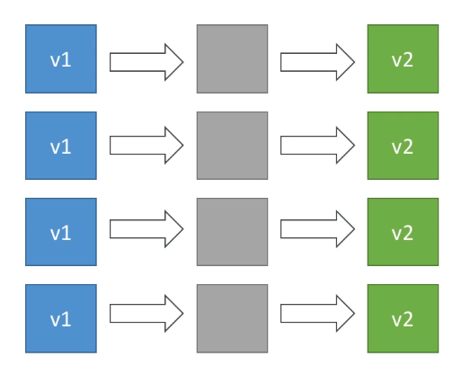
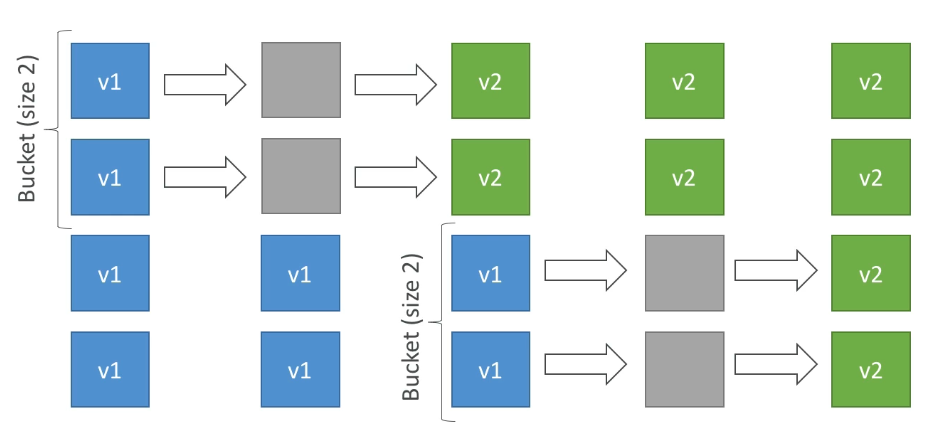
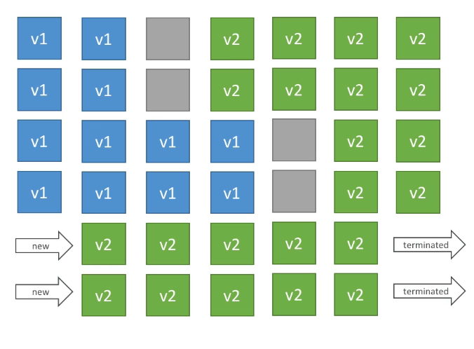
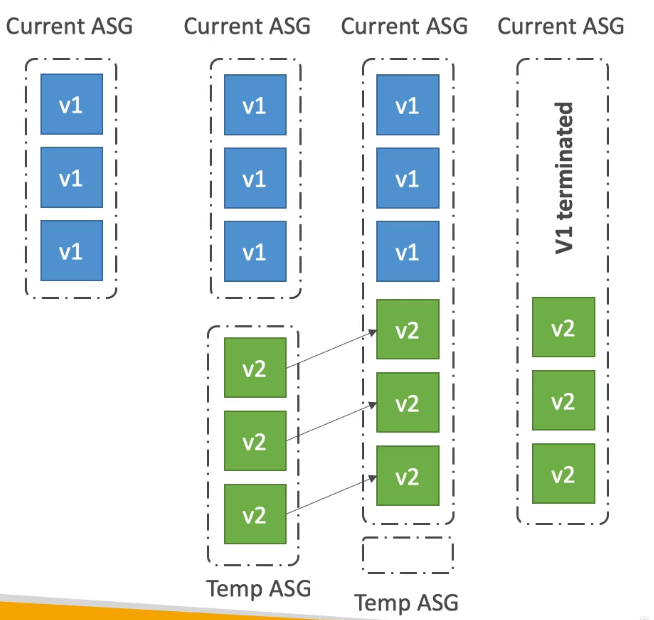
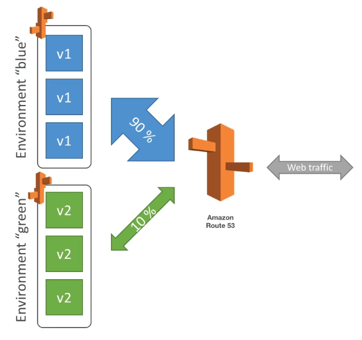
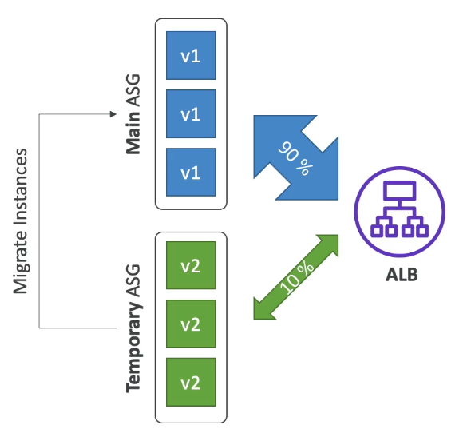
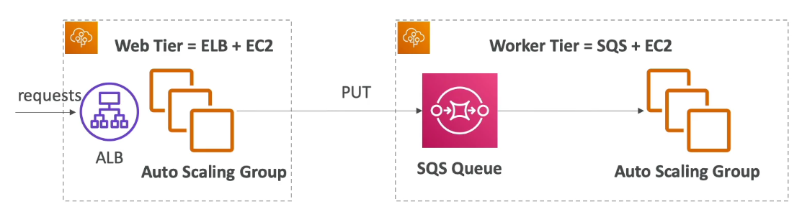

# Table of Contents

- [Table of Contents](#table-of-contents)
- [Typical 3-tier Application Setup](#typical-3-tier-application-setup)
- [Elastic Beanstalk](#elastic-beanstalk)
  - [Problem Statement](#problem-statement)
  - [Elastic Beanstalk: Overview](#elastic-beanstalk-overview)
  - [Elastic Beanstalk: Components](#elastic-beanstalk-components)
  - [Elastic Beanstalk: Supported Platforms](#elastic-beanstalk-supported-platforms)
  - [Web Server Tier vs Worker Tier](#web-server-tier-vs-worker-tier)
- [Create a Web App using Elastic Beanstalk](#create-a-web-app-using-elastic-beanstalk)
- [Elastic Beanstalk: Deployment](#elastic-beanstalk-deployment)
  - [Deployment: Modes](#deployment-modes)
  - [Deployment: Deployment Options for Updates](#deployment-deployment-options-for-updates)
  - [Deployment: Blue / Green](#deployment-blue--green)
  - [Deployment: Traffic Splitting](#deployment-traffic-splitting)
- [Elastic Beanstalk CLI](#elastic-beanstalk-cli)
- [Beanstalk Lifecycle Policy](#beanstalk-lifecycle-policy)
- [Elastic Beanstalk: Extensions](#elastic-beanstalk-extensions)
- [Elastic Beanstalk and CloudFormation](#elastic-beanstalk-and-cloudformation)
- [Elastic Beanstalk: Cloning Environment](#elastic-beanstalk-cloning-environment)
- [Elastic Beanstalk: Migration](#elastic-beanstalk-migration)
  - [Elastic Beanstalk Migration: Load Balancer](#elastic-beanstalk-migration-load-balancer)
  - [Elastic Beanstalk Migration: RDS](#elastic-beanstalk-migration-rds)
- [Elastic Beanstalk: Using with Docker](#elastic-beanstalk-using-with-docker)
- [Elastic Beanstalk: HTTPS](#elastic-beanstalk-https)
- [Elastic Beanstalk: Web Server vs Worker environment](#elastic-beanstalk-web-server-vs-worker-environment)
- [Elastic Beanstalk: Custom Platform](#elastic-beanstalk-custom-platform)
- [Elastic Beanstalk: Solutions Architecture](#elastic-beanstalk-solutions-architecture)
  - [Solving large installation times involving static and dynamic files generated during install](#solving-large-installation-times-involving-static-and-dynamic-files-generated-during-install)
- [References](#references)

---

# Typical 3-tier Application Setup

---

# Elastic Beanstalk

## Problem Statement

Developers have the following problems on AWS:-

- Managing infrastructure
- Deploying code
- Configuring all the databases, load balancers, etc
- Scaling concerns
- Most web apps have the same architecture (ALB + ASG)
- All developers want is for their code to run consistently across different applications and environments

This is where Elastic Beanstalk comes into play!

Elastic Beanstalk is a developer centric view of deploying an application on AWS.

---

## Elastic Beanstalk: Overview

- It uses all the components we have seen before: EC2, ASG, ELB, RDS etc.
- It is a managed service:
  - Automatically handles capacity provisioning, load balancing, scaling, application health monitoring, instance configuration
  - Just the application code is the responsibility of the developer
- We still have full control over the configuration
- Beanstalk is free but you pay for the underlying instances

---

## Elastic Beanstalk: Components

- **Application**: Collection of Beanstalk components (environments, versions, configurations etc.)
- **Application Version**: An iteration of your application code
- **Environment**:
  - Collection of AWS resources running an application version (only one application version at a time)
  - **Tiers**: Web Server Environment Tier & Worker Environment Tier
  - You can create multiple environments (dev, test, prod etc)

**Process**:

```s
Create an Application --> Upload Version --> Launch Environment --> Manage Environment Lifecycle
```

---

## Elastic Beanstalk: Supported Platforms

- Go
- Java SE
- Java with Tomcat
- .NET Core on Linux
- .NET on Windows Server
- Node.js
- PHP
- Python
- Ruby
- Packer Builder
- Single Container Docker
- Multi-container Docker
- Preconfigured Docker
- If not supported you can write your custom platform (advanced)

---

## Web Server Tier vs Worker Tier

---

# Create a Web App using Elastic Beanstalk

- Go to the [Elastic Beanstalk console](https://ap-south-1.console.aws.amazon.com/elasticbeanstalk/home?region=ap-south-1#/welcome) and click **`Create application`**
- Enter the following configurations:

  1. **Application Information**:

     - **Application name**: Up to 100 Unicode characters, not including forward slash (/).

  2. **Application tags**: Apply up to 50 tags. You can use tags to group and filter your resources. A tag is a key-value pair. The key must be unique within the resource and is case-sensitive.

  3. **Platform**:

     - **Platform**: `Node.js` (example)
     - **Platform branch**: `Node.js 16 running on 64bit Amazon Linux 2` (example)
     - **Platform version**: `5.6.1 (Recommended)` (example)

  4. **Application code**:

     - **Sample application**: Get started right away with sample code.
     - **Upload your code**: Upload a source bundle from your computer or copy one from Amazon S3.

- Click **`Create aApplication`** to create an Application with the above basic settings OR...
- Click **`Configure more options`** to add more configurations like Load Balancer, Software etc.

---

# Elastic Beanstalk: Deployment

## Deployment: Modes

1. **Single Instance**: Great for development
2. **High Availability with Load Balancer**: Great for production

---

## Deployment: Deployment Options for Updates

1. **All at once (deploy all in one go)**: Fastest, but instances aren't available to serve traffic for a bit (downtime). Great for quick iterations in development environment. No additonal cost.

   

2. **Rolling**: Update a few instances at a time (bucket), and then move onto the next bucket once the first bucket is healthy.

   - Application will be running BELOW max capacity
   - Can set the bucket size. For example: We have 4 x instances running version 1 with a bucket size of 2.
   - Application maybe running both instances simultaneously until all instances are rolled on to the next version.
   - No additional cost.
   - Long deployment.

   

3. **Rolling with additional batches**: Like rolling, but spins up new instances to move the batch (so that the old application is still available)

   - Application will be running AT max capacity
   - Can set the bucket size. or example: We have 4 x instances running version 1 with a bucket size of 2.
   - Application maybe running both instances simultaneously until all instances are rolled on to the next version.
   - Small additional cost due to additional batch as we are running over capacity at times (== bucket size)
   - Additional batch is removed at the end of the deployment
   - Longer deployment
   - Good for production

   

4. **Immutable**: Spins up new instances in a new ASG, deploys version to these instances, and then swaps all the instances when everything is healthy

   - Zero downtime
   - New code is deployed to new instances on a temporary ASG
   - Launch one instance and verify health and if successful, deploy the rest
   - High cost, double capacity
   - Longest deployment
   - Quick rollback in case of failures (just terminate new ASG)
   - Great for production

   

---

## Deployment: Blue / Green

- Not a direct feature of Elastic Beanstalk
- Zero downtime and release facility (allows for more testing, etc)
- The idea: Create a new "stage" environment (unlike the other deployment update strategies which were in the same environment) and deploy v2 there
- The new environment (green) can be validated independently and rolled back if there are issues
- We can use something like Route 53 using weighted policies to redirect a little bit of traffic to the stage environment to test it out.
- Using Beanstalk, **"swap URLs"** when done with the environment test



---

## Deployment: Traffic Splitting

- **Canary Testing** (Canary testing refers to testing a new software version or a new feature with real users in a live (production) environment. It is done by pushing some code changes live to a small group of end users who are usually unaware that they are receiving new code.)
- New Application version is deployed to a Temporary ASG with the same capacity
- A small percentage of the traffic is going to be sent to the Temporary ASG for a configurable amount of time
- Deployment health of the new deployed ASG is going to be monitored.
- If there's a deployment failure or a metric goes wrong, this triggers an automatic rollback (very quick)
- No application downtime
- New instances are migrated from the temporary ASG to the original ASG
- Instances running the old application versions are then terminated
- Considered a big improvement over the Blue / Green technique.



---

# Elastic Beanstalk CLI

We can install an additional CLI called the Elastic Beanstalk CLI which makes working with Beanstalk from the CLI much easier.

Basic Commands are:

- `eb create`
- `eb status`
- `eb health`
- `eb events`
- `eb logs`
- `eb open`
- `eb deploy`
- `eb config`
- `eb terminate`

It's helpful to know these commands for your automated development pipelines!

- Package code as zip and describe dependencies. Dependencies need to be described. (`requirements.txt` for Python, `package.json` for Node.js)
- Upload zip file (creates new app version), and then deploy. (The upload actually creates an S3 bucket and then refers the S3 bucket from the Beanstalk interface)
- Elastic Beanstalk will then deploy the App on each EC2 instance, resolve dependencies and start the application

---

# Beanstalk Lifecycle Policy

Elastic Beanstalk can store at most 1000 application versions. If you don't remove old versions, you won't be able to deploy anymore. Hence, you need to phase out old application versions.

This is where a **Lifecycle Policy** comes in.

- Can be based on:
  - **Time**: Old versions are removed
  - **Space**: When you have too many versions
- Versions currently used won't / can't be deleted
- Option not to delete the source bundle in S3 to prevent data loss. The Lifecycle Policy simply removes the app from the Elastic Beanstalk interface
- Process:

  - Go to the **`Application versions`** of the Elastic Beanstalk deployment
  - Click **`Settings`** to access the **`Application version lifecycle settings`**

    - **Lifecycle policy**: `Enable` / `Disable`
      - **Lifecycle rule**:
        - Set the application versions limit by total count. E.g. `200` Application Versions
        - Set the application versions limit by age: E.g. `180` days
      - **Retention**:
        - `Delete source bundle from S3`
        - `Retain source bundle in S3`
      - **Service role**: IAM role that allows Beanstalk to remove the Application versions and / or files from S3

---

# Elastic Beanstalk: Extensions

- A zip file containing our code must be deployed to Elastic Beanstalk
- All the parameters set in the UI can be configured in code using files and these are the Elastic Beanstalk extensions

- **Requirements**:

  - All these configuration files must be in the `.ebextensions/` directory in the root of the source code
  - Must be in the `YAML` / `JSON` format
  - `.config` extensions. E.g. `logging.config` (even though in YAML / JSON format)
  - Able to modify some default settings using: `options_settings`. [See Documentation](https://docs.aws.amazon.com/elasticbeanstalk/latest/dg/command-options-general.html#command-options-general-elasticbeanstalkapplicationenvironment)
  - Ability to add resources such as `RDS`, `ElastiCache`, `DynamoDB` etc.

- Resources managed by the `.ebextensions` get deleted if the environment goes away

---

# Elastic Beanstalk and CloudFormation

- Under the hood, Elastic Beanstalk relies on CloudFormation
- CloudFormation is used to provision other AWS services
- **Use Case**:
  - You can define CloudFormation resources in your `.ebextensions` to provision ElastiCache, an S3 bucket, anything you want!

Thus, with `.ebextensions` and CloudFormation you can configure anything you want in AWS!

---

# Elastic Beanstalk: Cloning Environment

- Clone an environment with the exact same configuration and resources. Includes:
  - Load balancer type and configuration
  - RDS Database type (the configuration will be preserved but the data won't be preserved)
  - Environment variables, etc.
- Useful when you have a production version of your application and want to deploy a `test` version
- After cloning an environment, you can change the settings

---

# Elastic Beanstalk: Migration

## Elastic Beanstalk Migration: Load Balancer

- After creating an Elastic Beanstalk environment, you cannot change the Load Balancer type (only its configuration can be changed)

- **Use Case**:

  - Suppose we need to change from an Application Load Balancer to a Network Load Balancer, i.e. change the Load Balancer type, we need to perform a migration.

- **To migrate**:
  1. Create a new environment with the same configuration except the Load Balancer (therefore we cannot use the Clone feature because it would copy the Load Balancer type as well). This has to be done manually.
  2. Deploy the Application to the new environment
  3. Perform either a:
     - CNAME swap
     - Route 53 update

---

## Elastic Beanstalk Migration: RDS

- RDS can be provisioned with Beanstalk, which is great for dev / test environments
- This is not great for production environemnts as the database lifecycle is tied to the Beanstalk environment lifecycle
- The best way to use RDS is to separately create a RDS database and provide our Elastic Beanstalk application with the connection string for example using an environment variable

So how do we decouple RDS, if it already exists in an Elastic Beanstalk stack?

1. Create a Snapshot of our RDS DB (as a safeguard)
2. Go to the RDS Console and protect the RDS database from deletion. This will prevent it from being deleted no matter what.
3. Create a new Elastic Beanstalk environment, without RDS, point your application to existing RDS database (for e.g. using an environment variable)
4. Perform a CNAME swap (blue/green) or Route 53 update and confirm if it's working
5. Terminate the old environment. Since we have enabled RDS Deletion Protection, the RDS database won't be deleted.
6. Delete CloudFormation stack manually (since the RDS database deletion will have failed, it will be in DELETE_FAILED state)

---

# Elastic Beanstalk: Using with Docker

- It is possible for us to run our application as a Single Docker Container
- For this we must either provide:
  - **`Dockerfile`**: Elastic Beanstalk will build and run the Docker container
  - **`Dockerrun.aws.json (v1)`**: Describe where **"already built"** Docker image is
    - Image
    - Port
    - Volumes
    - Logging
    - etc
- Elastic Beanstalk in Single Container Docker **DOES NOT** use ECS. It just uses Docker on EC2.

- Elastic Beanstalk in Multi-Container Docker
  - Run multiple containers per EC2 Instance in Elastic Beanstalk
  - This will create for you:
    - ECS Cluster
    - EC2 Instances, configured to use the ECS Cluster
    - Load Balancer (in High Availability mode)
    - Task definitions and execution
  - Requires a config `Dockerrun.aws.json (v2)` at the root of the source code
  - `Dockerrun.aws.json` is used to generate the ECS Task Definition
  - Your Docker images must be pre-built and stored in a repository like DockerHub or ECR for example.

---

# Elastic Beanstalk: HTTPS

- **Load the SSL certificate onto the Load Balancer**

  - Can be done from the Console (Elastic Beanstalk Console => Load Balancer configuration)
  - Can be done from the code: **`.ebextensions/securelistener-alb.config`**. [Read the Documentation](https://docs.aws.amazon.com/elasticbeanstalk/latest/dg/configuring-https-elb.html)
  - SSL certificate can be provisioned using ACM (AWS Certificate Manager) or CLI
  - Must configure a Security Group rule to allow incoming port 443 (HTTPS port)

- **Elastic Beanstalk redirect HTTP to HTTPS**

  - Configure your instances to redirect HTTP to HTTPS: [Example code](https://www.github.com/awsdocs/elastic-beanstalk-samples/tree/master/configuration-files/aws-provided/security-configuration/https-redirect)
  - OR configure the Application Load Balancer (ALB only) with a rule to do the redirection from HTTP to HTTPS
  - Make sure health checks are not redirected (so they keep on returning 200 OK)

---

# Elastic Beanstalk: Web Server vs Worker environment

- **The Idea**: Decouple your applications into two tiers. If your application performs tasks that are long to complete, offload these tasks to a dedicated worker environment.

- Use Case:
  - Processing a video
  - Generating a PDF from HTML
- You can define periodic tasks into a **`cron.yaml`**

- Architecture:

  

---

# Elastic Beanstalk: Custom Platform

- Custom platforms are an advanced feature: They allow you to define from scratch:

  - The Operating System (OS)
  - Additional Software
  - Scripts that Beanstalk runs on these platforms

- **Use Case**:

  - Application language is not compatible with Beanstalk and also doesn't use Docker

- To create your own custom platform:

  - Define an AMI using **`Platform.yaml`** file
  - Build the platform using the **`Packer`** software (open source tool to create AMIs)

- Custom Platform vs Custom Image (AMI)
  - Custom Image is to tweak an **`existing`** Beanstalk Platform (Python, Node.js, Java etc)
  - Custom Platform is to create **`an entirely new`** Beanstalk Platform

---

# Elastic Beanstalk: Solutions Architecture

## Solving large installation times involving static and dynamic files generated during install

**Problem**: Your company is deploying a website running on Elastic Beanstalk. The website takes over 45 minutes for the installation and contains both static as well as dynamic files that must be generated during the installation process.

As a Solutions Architect, you would like to bring the time to create a new instance in your Elastic Beanstalk deployment to be less than 2 minutes.

**Solution**:

1. **Create a Golden AMI with the static installation components**: A Golden AMI is an AMI that you standardize through configuration, consistent security patching, and hardening. It also contains agents you approve for logging, security, performance monitoring, etc. For the given use-case, you can have the static installation components already setup via the golden AMI.

2. **Use EC2 user data to customize the dynamic installation parts at boot time**: EC2 instance user data is the data that you specified in the form of a configuration script while launching your instance. You can use EC2 user data to customize the dynamic installation parts at boot time, rather than installing the application itself at boot time.

---

# References

- [Comparison between Elastic Beanstalk Deployment methods](https://docs.aws.amazon.com/elasticbeanstalk/latest/dg/using-features.deploy-existing-version.html)
- [Configuration options: General Options](https://docs.aws.amazon.com/elasticbeanstalk/latest/dg/command-options-general.html#command-options-general-elasticbeanstalkapplicationenvironment)
- [Elastic Beanstalk Worker Environments](https://docs.aws.amazon.com/elasticbeanstalk/latest/dg/using-features-managing-env-tiers.html)
