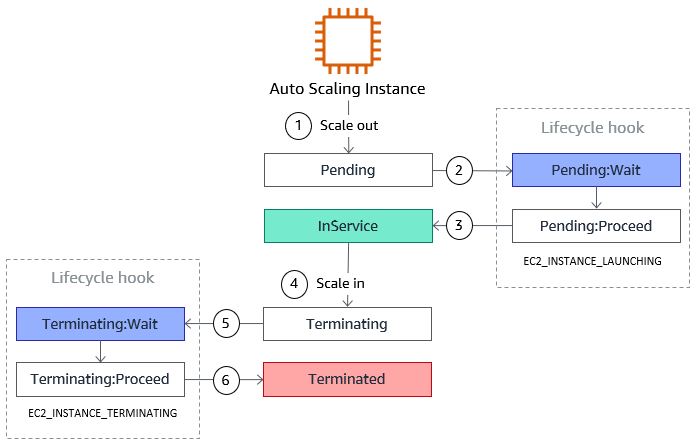

# Table of Contents

- [Table of Contents](#table-of-contents)
- [Fundamental Concepts:](#fundamental-concepts)
  - [Scalability](#scalability)
  - [High Availability](#high-availability)
  - [Load Balancing](#load-balancing)
- [ELB: Overview](#elb-overview)
- [ELB: Health Check](#elb-health-check)
- [ELB: Types of Load Balancers](#elb-types-of-load-balancers)
- [ELB: Security Groups](#elb-security-groups)
- [ELB Types: Deep Dive](#elb-types-deep-dive)
  - [Classic Load Balancers (CLB)](#classic-load-balancers-clb)
    - [CLB: Overview](#clb-overview)
    - [CLB: Create a CLB](#clb-create-a-clb)
    - [CLB: Troubleshooting](#clb-troubleshooting)
    - [CLB: Tightening Security](#clb-tightening-security)
    - [CLB: Adding Multiple EC2 Instances](#clb-adding-multiple-ec2-instances)
  - [Application Load Balancer (ALB)](#application-load-balancer-alb)
    - [ALB: Overview](#alb-overview)
    - [ALB: Target Groups](#alb-target-groups)
      - [Target Groups: Overview](#target-groups-overview)
      - [Target Groups: Create a Target Group](#target-groups-create-a-target-group)
    - [ALB: Create an Application Load Balancer](#alb-create-an-application-load-balancer)
    - [ALB: Adding Target Groups to an existing Listener](#alb-adding-target-groups-to-an-existing-listener)
    - [ALB: Adding a new Listener](#alb-adding-a-new-listener)
  - [Network Load Balancer (NLB)](#network-load-balancer-nlb)
    - [NLB: Overview](#nlb-overview)
    - [NLB: Target Groups](#nlb-target-groups)
      - [Target Groups: Overview](#target-groups-overview-1)
    - [NLB: Create a Network Load Balancer](#nlb-create-a-network-load-balancer)
    - [NLB: Troubleshooting](#nlb-troubleshooting)
  - [Gateway Load Balancer (GWLB)](#gateway-load-balancer-gwlb)
    - [GWLB: Overview](#gwlb-overview)
    - [GWLB: Target Groups](#gwlb-target-groups)
      - [GWLB Target Groups: Overview](#gwlb-target-groups-overview)
- [ELB: Sticky Sessions](#elb-sticky-sessions)
  - [Sticky Sessions: Overview](#sticky-sessions-overview)
  - [Sticky Sessions: Cookie Types](#sticky-sessions-cookie-types)
  - [Sticky Sessions: Applying Sticky Sessions to Existing Load Balancer](#sticky-sessions-applying-sticky-sessions-to-existing-load-balancer)
- [ELB: Cross Zone Load Balancing](#elb-cross-zone-load-balancing)
  - [Cross Zone Load Balancing: Overview](#cross-zone-load-balancing-overview)
  - [Cross Zone Load Balancing: Characteristics](#cross-zone-load-balancing-characteristics)
- [ELB: SSL Certificates](#elb-ssl-certificates)
  - [SSL/TLS Basics](#ssltls-basics)
  - [Load Balancer and SSL Certificates](#load-balancer-and-ssl-certificates)
  - [Server Name Indication](#server-name-indication)
  - [Support on ELB](#support-on-elb)
- [ELB: Connection Draining / Deregistration Delay](#elb-connection-draining--deregistration-delay)
- [Auto-Scaling Groups (ASGs)](#auto-scaling-groups-asgs)
  - [ASG: Overview](#asg-overview)
  - [ASG: Using Elastic Load Balancing across Instances in the ASG](#asg-using-elastic-load-balancing-across-instances-in-the-asg)
    - [Using ELB across Instances in the ASG: Overview](#using-elb-across-instances-in-the-asg-overview)
    - [Using ELB across Instances in the ASG: Workflow](#using-elb-across-instances-in-the-asg-workflow)
    - [Using ELB across Instances in the ASG: Deploy with CloudFormation](#using-elb-across-instances-in-the-asg-deploy-with-cloudformation)
  - [ASG: Automatic Scaling Policies](#asg-automatic-scaling-policies)
    - [Dynamic Scaling](#dynamic-scaling)
    - [Predictive Scaling](#predictive-scaling)
  - [ASG: Lifecycle Hooks](#asg-lifecycle-hooks)
  - [ASG: Notifications](#asg-notifications)
    - [ASG Notifications: Overview](#asg-notifications-overview)
    - [ASG Notifications: Send Notification to SQS Queue](#asg-notifications-send-notification-to-sqs-queue)
  - [ASG: Monitoring](#asg-monitoring)
    - [Notable Scaling Metrics](#notable-scaling-metrics)
    - [Custom Metrics using CloudWatch](#custom-metrics-using-cloudwatch)
  - [Auto-Scaling Group - Scaling Cooldowns](#auto-scaling-group---scaling-cooldowns)
- [Using the CLI](#using-the-cli)
  - [`create-load-balancer`](#create-load-balancer)
  - [`create-target-group`](#create-target-group)
  - [`register-targets`](#register-targets)
  - [`deregister-targets`](#deregister-targets)
  - [`create-listener`](#create-listener)
  - [`create-rule`](#create-rule)
  - [`modify-load-balancer-attributes`](#modify-load-balancer-attributes)
    - [`modify-load-balancer-attributes`: Overview and Syntax](#modify-load-balancer-attributes-overview-and-syntax)
    - [Example 1: Deletion Protection Enabled](#example-1-deletion-protection-enabled)
    - [Example 2: Enable Access Logs and provide permission to access them](#example-2-enable-access-logs-and-provide-permission-to-access-them)
  - [`modify-target-group-attributes`](#modify-target-group-attributes)
    - [`modify-target-group-attributes`: Overview and Syntax](#modify-target-group-attributes-overview-and-syntax)
    - [Example 1: Modify the deregistration delay timeout](#example-1-modify-the-deregistration-delay-timeout)
    - [Example 2: Apply sticky sessions and modify the stickiness settings of an ALB](#example-2-apply-sticky-sessions-and-modify-the-stickiness-settings-of-an-alb)
  - [`delete-rule`](#delete-rule)
  - [`delete-listener`](#delete-listener)
  - [`delete-load-balancer`](#delete-load-balancer)
  - [`delete-target-group`](#delete-target-group)
- [References](#references)

---

# Fundamental Concepts:

## Scalability

Scalability means that an application / system can handle greater loads by adapting.
There are two kinds of scalability:

- **Vertical Scalability**

  - Increase the size of your instance by improving hardware. For example: Your application runs on a `t2.micro`. Vertical scaling would mean, running the application on a `t2.large`.
  - Vertical scalability is very common for non-distributed systems, such as a database.
  - RDS, ElastiCache are services that can scale vertically by upgrading the underlying instance type.
  - There's usually a hardware limit till which you can vertically scale.

- **Horizontal Scalability / Elasticity**

  - Horizontal scalability means increasing the number of instances / systems for your application. It implies distributed systems. For example: Sharding a database, Auto Scaling Group, Load Balancers.
  - Common for modern, web applications.
  - Nowadays, it's easy to horizontally scale, thanks to cloud offerings like, Amazon EC2.

Scalability is linked but different from [High Availability](#high-availability).

---

## High Availability

High Availability means running your application in at least two data centers (or Availability Zones). It often goes hand-in-hand with Horizontal Scaling.

The goal of High Availability is to survive a data center loss. So if a data center goes down, we are still running.

High Availability can also be passive, e.g. RDS Multi AZ, or active, when we have horizontal scaling.

Examples of High Availability:

- Auto Scaling Group multi AZ
- Load Balancer multi AZ

---

## Load Balancing

**Overview**

A Load Balancer is a server or set of servers that forwards traffic that it receives to multiple servers (e.g. EC2 Instances) downstream.

The idea is that, the more users you have, the more your load is going to need to be balanced across the Instances (containers or VMs, or in this case EC2 Instances), but your users do not know, nor need to know which backend instances they are connected to, they just know they have to connect to the Load Balancer (in this case, Elastic Load Balancer), giving users only one endpoint of connectivity.

**Why use a Load Balancer?**

- Spread load across multiple downstream instances.
- Expose a single point of access (DNS) to your application.
- Seamlessly handle failures of downstream instances because the load balancer will have some health check mechanisms and can understand which instances it cannot send traffic to.
- Do regular health checks on your instances.
- Provide SSL Termination (HTTPS) for your websites.
- Enforce stickiness with cookies.
- High Availability across Zones.
- Separate external traffic from internal traffic.

---

# ELB: Overview

Elastic Load Balancing (ELB) automatically distributes incoming application traffic across multiple targets and virtual appliances in one or more Availability Zones (AZs). An Elastic Load Balancer (ELB) is a managed Load Balancer.

- AWS guarantees it will be working.
- AWS takes care of upgrades, maintenance, high availability.
- AWS provides only a few configuration knobs.
- Integrations with many AWS services (EC2, EC2 Auto Scaling Groups, Amazon ECS, AWS Certificate Manager (ACM), CloudWatch, Route 53, AWS WAF, AWS Global Accelerator)

It costs less to setup your own Load Balancer but it will be a lot more effort on your end.

---

# ELB: Health Check

We don't want to send any traffic to an EC2 Instance which is not working properly. Health checks are a way for your ELB to verify whether an EC2 Instance is properly working. This is done by sending a HTTP request on a Port to a Route. For e.g. http://IPAddress:4567/health. A 200 response means that the status is healthy. Anything else may suggest, something is wrong and is unhealthy and the Elastic Load Balancer will not send traffic to that instance.

---

# ELB: Types of Load Balancers

AWS has 4 kinds of Load Balancers:

1. **Classic Load Balancer (CLB)**: (v1 - Old Generation, 2009) - Compatible with HTTP, HTTPS, TCP, SSL or Security CP. This has fallen out of favour with AWS and will be shown as deprecated within the console but still available for use.
2. **Application Load Balancer (ALB)**: (v2 - New Generation - 2016) - Supports HTTP, HTTPS and WebSocket
3. **Network Load Balancer (NLB)**: (v2 - New Generation - 2017) - Supports TCP, TLS (secure TCP), UDP Protocols
4. **Gateway Load Balancer (GWLB)**: (2020) - Operates at the Layer 3 - Network Layer and the Internet Protocol

It is recommended to use the newer generation of Load Balancers as they provide more features. Some Load Balancers can be setup as internal (private) or external (public) ELBs.

---

# ELB: Security Groups

The users can access the Load Balancer from anywhere using HTTP/HTTPS. However, we need to configure the Security Group for the EC2 Instance need to only allow traffic from the Load Balancer.

Therefore the Security Groups' rules may look something like this:

**Load Balancer Security Group:**

| Type  | Protocol | Port Range | Source    | Description          |
| ----- | -------- | ---------- | --------- | -------------------- |
| HTTP  | TCP      | 80         | 0.0.0.0/0 | Allow HTTP from ...  |
| HTTPS | TCP      | 443        | 0.0.0.0/0 | Allow HTTPS from ... |

**Application Security Group: Allow Traffic only from Load Balancer**

| Type | Protocol | Port Range | Source               | Description                           |
| ---- | -------- | ---------- | -------------------- | ------------------------------------- |
| HTTP | TCP      | 80         | sg-0f5e3c453c06830a4 | Allow Traffic only from Load Balancer |

---

# ELB Types: Deep Dive

## Classic Load Balancers (CLB)

### CLB: Overview

- Classic Load Balancers support two things:
  - TCP (Layer 4 - Transport Layer Protocol),
  - HTTP and HTTPS (Layer 7 - Application Layer Protocol)
  - Health Checks are either TCP or HTTP based
  - Fixed hostname (xxx.region.elb.aws.amazon.com)
  - 1 x Classic Load Balancer per application

---

### CLB: Create a CLB

- Go to [Load Balancers from the EC2 Console](https://ap-south-1.console.aws.amazon.com/ec2/home?region=ap-south-1#LoadBalancers:) and click **`Create Load Balancer`**.
- Click **`Classic Load Balancer`** ---> **`Create`**
- Enter Load Balancer settings:

  - **Load Balancer name**: Enter a Load Balancer name (`classic-load-balancer-test`)
  - **Create LB Inside**: Select a VPC (`My Default VPC (172.31.0.0/16)`)
  - **Create an internal load balancer**: Checked or unchecked (Leave it unchecked)
  - **Enable advanced VPC configuration**: Checked or unchecked (Leave it unchecked)
  - **Listener configuration**: Map Load Balancer Ports to Instance Ports

    | Load Balancer Protocol | Load Balancer Port | Instance Protocol | Instance Port |
    | ---------------------- | ------------------ | ----------------- | ------------- |
    | HTTP                   | 80                 | HTTP              | 80            |

- Click **`Next: Assign Security Groups`** and **`Create a new Security Group`**

  - **Enter Security Group rule**:

    | Type | Protocol | Port | Source             |
    | ---- | -------- | ---- | ------------------ |
    | HTTP | TCP      | 80   | Anywhere 0.0.0.0/0 |

- Click **`Next: Configure Security Settings`**. We will get a warning message that looks like -

  ```s
  Improve your load balancer’s security. Your load balancer is not using any secure listener.
  If your traffic to the load balancer needs to be secure, use either the HTTPS or the SSL protocol for your front-end connection. You can go back to the first step to add/configure secure listeners under Basic Configuration section. You can also continue with current settings.
  ```

- We will continue with the current settings. Click **`Next: Configure Health Check`**.

- Select the Health Check Settings:

  - **Ping Protocol**: **`HTTP`**
  - **Ping Port**: **`80`**
  - **Ping Path**: **`/`** (Default: `/index.html`)
  - **Advanced Details**:
    - **Response Timeout**: Time to wait when receiving a response from the health check (2 sec - 60 sec). **`5`** (Default: `5`)
    - **Interval**: Amount of time between health checks (5 sec - 300 sec). Interval must be greater than Response Timeout. **`6`** (Default: `30`)
    - **Unhealthy threshold**: Number of consecutive health check failures before declaring an EC2 instance unhealthy. **`2`** (Default: `2`)
    - **Healthy threshold**: Number of consecutive health check successes before declaring an EC2 instance healthy. **`3`** (Default: `10`)

- Click **`Next: Add EC2 Instances`** and Select the EC2 Instance(s)
- Click **`Next: Add Tags`** and create Tags if any
- Click **`Review and Create`** and review the summary.
- Click **`Create`** to finally Create the CLB.

- A success message confirms the creation of the Classic Load Balancer.

  ```s
  Successfully created load balancer
  Load balancer classic-load-balancer-test was successfully created.

  Note: It may take a few minutes for your instances to become active in the new load balancer.
  ```

  We may have to wait a little before the Load Balancer is available. This will reflect in the Instances Panel of the Load Balancer with the **Status**: `OutOfService`. Wait for it to become `InService` that means the Load Balancer is now Live.

- To test whether the Load Balancer is working, we need to access the DNS name of the Classic Load Balancer instead. Select the Load Balancer and go to the `Description` Panel and find the DNS name. Copy-Paste it in the Browser Address Bar and Go. If it opens the same home page as expected from the EC2 Instance, that means this Load Balancer is now successfully working.

---

### CLB: Troubleshooting

What if the Load Balancer didn't work? What could be the reasons:

1. Security Group of the EC2 Instance doesn't have the Inbound rules for HTTP. This will fail the Health Check and show the Instance as `OutOfService`.
2. The Bootstrap script on the webserver didn't work properly.

---

### CLB: Tightening Security

The problem right now is the EC2 Instance can be accessed by external traffic, both via the Public IPv4 Address as well as the Load Balancer DNS Name. We would like to tighten that security by allowing external users to only access the instance via the Load Balancer and not directly through the IP.

To do that we need to:

- Go to the [Security Groups](https://ap-south-1.console.aws.amazon.com/ec2/home?region=ap-south-1#SecurityGroups:) and select the Security Group for the instance
- Delete the existing HTTP rule.
- Create a new rule with the `source` being the Classic Load Balancer's security group
- Click **`Save`** to confirm changes and save.

Now, we will have tightened the security as the EC2 Instance's Public IPv4 Address will no longer work, and only the Load Balancer's DNS name will work instead.

---

### CLB: Adding Multiple EC2 Instances

- Create two more EC2 Instances with the same User Data script as the current one, following the method described [HERE](./../ec2/README.md#launching-an-ec2-instance-running-linux)
- Go to [Load Balancers from the EC2 Console](https://ap-south-1.console.aws.amazon.com/ec2/home?region=ap-south-1#LoadBalancers:) and select the Load Balancer.
- Select the Load Balancer and click **`Edit Instances`** either from the `Actions` menu, the Instances panel or the right click menu. They will all do the same thing and allow us to select more instances.
- Select these two additional Instances we would like the Load Balancer to serve and click **`Save`**.
- Now the Classic Load Balancer will serve serve the three instances on a Round Robin basis showing that we have successfully setup the Load Balancer to work correctly.

---

## Application Load Balancer (ALB)

### ALB: Overview

**Working mechanism:**

1. Your client makes a request to your application.
2. The listeners in your load balancer receive requests matching the protocol and port that you configure.
3. The receiving listener evaluates the incoming request against the rules you specify, and if applicable, routes the request to the appropriate target group. You can use an HTTPS listener to offload the work of TLS encryption and decryption to your load balancer.
4. Healthy targets in one or more target groups receive traffic based on the load balancing algorithm, and the routing rules you specify in the listener.

**Characteristics:**

- The Application Load Balancer is a Layer 7 - Application Layer, Load Balancer (HTTP).
- Load Balancing to multiple HTTP applications across machines (target groups).
- Load Balancing to multiple applications on the same machines (ex: containers).
- Support for HTTP2 and WebSockets.
- Support redirects (from HTTP to HTTPs for example).
- Supports Routing using routing tables to different target groups:
  - Routing based on target path of the URL (`example.com/users` and `example.com/posts`)
  - Routing based on hostname in URL (`one.example.com` and `two.example.com`)
  - Routing based on Query strings and Headers (`example.com/users?id=123&active=false`)
- ALB are great when you have Microservices and Container-based applications (Docker containers and Amazon ECS)
- Has a port mapping feature to redirect to a dynamic port in ECS.
- In comparison, we'd need multiple Classic Load Balancers per application.
- Fixed hostname (`xxx.region.elb.aws.amazon.com`)
- The applications servers do not see the IP of the client directly.
  - The true IP of the client is inserted in the header **`X-Forwarded-For`**
  - We can also get the Port (**`X-Forwarded-Port`**) and protocol (**`X-Forwarded-Proto`**)
- Does SSL Termination before forwarding traffic internally to Target Groups

---

### ALB: Target Groups

#### Target Groups: Overview

Target Groups are groups of Instances, ECS Tasks, Lambda Functions, IP Addresses that a Load Balancer can route to. An Application Load Balancer can route to multiple Target Groups.

Target Groups can be the following:

- **EC2 Instances** (can be managed by Auto Scaling Group) - HTTP
- **ECS Tasks** (managed by ECS itself) - HTTP
- **Lambda Functions** - HTTP request is translated into a JSON event
- **IP Addresses** - must be private IPs

Health checks are done at the Target Group level.

---

#### Target Groups: Create a Target Group

- Go to the [Target Groups page from the EC2 Console](https://ap-south-1.console.aws.amazon.com/ec2/home?region=ap-south-1#TargetGroups:) and Click **[Create Target Group](https://ap-south-1.console.aws.amazon.com/ec2/home?region=ap-south-1#CreateTargetGroup:)**
- Enter the Basic Configuration:

  - **Choose a target type**:

    - **Instances**
      Supports load balancing to instances within a specific VPC.
      Facilitates the use of Amazon EC2 Auto Scaling to manage and scale your EC2 capacity.

    - **IP addresses**
      Supports load balancing to VPC and on-premises resources.
      Facilitates routing to multiple IP addresses and network interfaces on the same instance.
      Offers flexibility with microservice based architectures, simplifying inter-application communication.
      Supports IPv6 targets, enabling end-to-end IPv6 communication, and IPv4-to-IPv6 NAT.

    - **Lambda function**
      Facilitates routing to a single Lambda function.
      Accessible to Application Load Balancers only.

    - **Application Load Balancer**
      Offers the flexibility for a Network Load Balancer to accept and route TCP requests within a specific VPC.
      Facilitates using static IP addresses and PrivateLink with an Application Load Balancer.

  - **Target group name**: `ec2-test-instances`
  - `Protocol`: HTTP
  - `Port`: 80
  - `VPC`: Select the VPC with the instances that you want to include in the target group.
  - `Protocol version`: HTTP1

- **Health checks**: The associated load balancer periodically sends requests, per the settings below, to the registered targets to test their status.

  - **Health check protocol**: `HTTP`
  - **Health check path**: `/`
  - **Advanced health check settings**:
    - **Port**:
      - `Traffic Port`: Default port where each target receives traffic from the load balancer
      - `Override`: Override to a different port. (1-65535)
    - **Healthy threshold**: Number of consecutive health check successes before declaring an EC2 instance healthy. **`3`** (Default: `10`)
    - **Unhealthy threshold**: Number of consecutive health check failures before declaring an EC2 instance unhealthy. **`2`** (Default: `2`)
    - **Timeout**: Time to wait when receiving a response from the health check (2 sec - 60 sec). **`5`** (Default: `5`)
    - **Interval**: Amount of time between health checks (5 sec - 300 sec). Interval must be greater than Response Timeout. **`6`** (Default: `30`)
    - Success codes: HTTP status code on success - **`200`**

- Once the above settings are selected, click **`Next`**. We have to now **`Register targets`**
- Select the intended targets from Available Targets and click **`Include as pending below`**.
- Click **`Create target group`** to complete the creation of the Target Group.

---

### ALB: Create an Application Load Balancer

- Go to [Load Balancers from the EC2 Console](https://ap-south-1.console.aws.amazon.com/ec2/home?region=ap-south-1#LoadBalancers:) and click **`Create Load Balancer`**.
- Click **`Create`** on the Application Load Balancer section
- Enter Load Balancer settings:

  **Basic Configuration**:

  - **Load balancer name**: `alb-test`
  - **Scheme**: When you create a load balancer, you must choose whether to make it an internal load balancer or an internet-facing load balancer. The nodes of an internet-facing load balancer have public IP addresses. The nodes of an internal load balancer have only private IP addresses. Cannot be changed once it is created.
    - `Internet facing`: An internet-facing load balancer routes requests from clients over the internet to targets. Requires a public subnet.
    - `Internal`: An internal load balancer routes requests from clients to targets using private IP addresses.
  - **IP address type**: Select the type of IP addresses that your subnets use.

    - **IPv4**: Recommended for internal load balancers.
    - **Dualstack**: Includes IPv4 and IPv6 addresses.

  **Network Mapping**:

  - **VPC**: Select the virtual private cloud (VPC) for your targets. Only VPCs with an internet gateway are enabled for selection. The selected VPC cannot be changed after the load balancer is created. To confirm the VPC for your targets, view your target groups
  - **Mappings**: Select at least two Availability Zones and one subnet per zone. The load balancer routes traffic to targets in these Availability Zones only. Availability Zones that are not supported by the load balancer or the VPC are not available for selection.
  - **Security Groups**: Select a Security Group. (We can use the one from the Classic Load Balancer, but we will have to delete the inbound rule and reassign it to this Load Balancer, once created)
  - **Listeners and Routing**: A listener is a process that checks for connection requests using the port and protocol you configure. The rules that you define for a listener determine how the load balancer routes requests to its registered targets.
    - **Protocol**: HTTP
    - **Port**: 80
    - **Default action**: This action forwards requests to the target group that you select from the default actions dropdown list. Note that IPv6 target groups appear on this list only if you selected Dualstack as the IP address type for your load balancer. We will need to [Create a Target Group](#target-groups-create-a-target-group) based on Instances. Then refresh the Target Groups and select the target group.

- Click **`Create load balancer`**. The load balancer `State` will now show up as `Provisioning`. Wait for it to turn `Active`.

---

### ALB: Adding Target Groups to an existing Listener

- Go to [Load Balancers from the EC2 Console](https://ap-south-1.console.aws.amazon.com/ec2/home?region=ap-south-1#LoadBalancers:) and select the intended Application Load Balancer.
- Go to the Listeners Tab and select the Listener where a new Instance has to be added to. Click **`Edit`** on the Application Load Balancer section.
- Select the new Target Group or [Create a Target group](#target-groups-create-a-target-group) and **`Save changes`**.

---

### ALB: Adding a new Listener

- Go to [Load Balancers from the EC2 Console](https://ap-south-1.console.aws.amazon.com/ec2/home?region=ap-south-1#LoadBalancers:) and select the intended Application Load Balancer.
- Go to the Listeners Tab and select the Listener where a new Instance has to be added to. Click **`Add listener`** on the Application Load Balancer section.
- Select a Port that isn't currently being listened to.
- Add an Action:
  - **Forward**: A Forward action routes requests to one or more target groups. With forward actions, you can assign a weight that controls the prioritization and selection of each target group. Weights must be set as an integer between 0 and 999.
  - **Redirect**: Redirect actions are used to redirect client requests from one URL to another.
  - **Return fixed response**: You can use **fixed-response** actions to drop client requests and return a custom HTTP response. You can use this action to return a `2XX`, `4XX`, or `5XX` response code and add an optional message.
  - **Authenticate** (only for HTTPS): For HTTPS listeners, you can include Authenticate as a default action with Amazon Cognito or OpenID Connect (OIDC).

---

## Network Load Balancer (NLB)

### NLB: Overview

**Characteristics:**

- Network Load Balancer (Layer 4 - Transport Layer) allows to:

  - Forward UDP or TCP traffic to your instances
  - Handle millions of requests per second
  - Less latency: `~100 ms` (vs ~400 ms for ALB)

- Unlike ALB, which provides only static DNS name, **NLB provides both static DNS name and static IP**. NLB has **one static IP per AZ** and supports assigning Elastic IP (helpful for whitelisting specific IP). The reason being that AWS wants your Elastic Load Balancer to be accessible using a static endpoint, even if the underlying infrastructure that AWS manages changes.
- NLBs are used for extreme performance, TCP or UDP traffic.
- Not included in the AWS Free Tier

**Working mechanism:**

1. Your client makes a request to your application.
2. The load balancer receives the request either directly or through an endpoint for private connectivity (via AWS PrivateLink).
3. The listeners in your load balancer receive requests of matching protocol and port, and route these requests based on the default action that you specify. You can use a TLS listener to offload the work of encryption and decryption to your load balancer.
4. Healthy targets in one or more target groups receive traffic according to the flow hash algorithm.

---

### NLB: Target Groups

#### Target Groups: Overview

Target Groups can be the following:

- **EC2 Instances** (can be managed by Auto Scaling Group) - HTTP
- **IP Addresses** - must be private IPs. E.g. private IP of a on-premises server
- **Application Load Balancer** - Thanks to the Network Load Balancer, you would get Fixed IP Addresses and thanks to the Application Load Balancer, you can get all the rules around handling HTTP type of traffic. So it's a valid combination.

- Health checks are done at the Target Group level and support three different kinds of protocol: **`TCP`**, **`HTTP`** and **`HTTPS`**.

---

### NLB: Create a Network Load Balancer

The steps are similar to ALB. We just have to create a new Target Group specifically for the NLB.

---

### NLB: Troubleshooting

As we can see, the reason we could not connect is because the targets showed up as unhealthy.

And that's because, when we do a TCP based Target group and a Network Load Balancer, the Security Group that is taken into account is the Security Group of the EC2 Instances. There was no inbound rules we created when we created the NLB, or when we created a Target Group that was on TCP.

So we have to Edit the Inbound rules of the Security Group of our target EC2 Instances and add back traffic from anywhere.

| Type | Protocol | Port | Source             | Description (optional)    |
| ---- | -------- | ---- | ------------------ | ------------------------- |
| HTTP | TCP      | 80   | Anywhere 0.0.0.0/0 | Necessary for NLB to work |

The reason is: Unlike the ALB, the NLB forwards over the traffic from the clients to the EC2 Instance. So from an EC2 Instance perspective, the traffic doesn't look like it's coming from the NLB, it looks like it's coming from an external client. In case of the ALB, the traffic looks like it's coming from the ALB.

We wait for a bit (Target Group: `(Interval * Health check) seconds`) and we can see that the Target Group returns to Healthy status.

Let's go to the NLB, get the DNS name and run `curl http://NLB_DNS_Name` and we'll get the response.

---

## Gateway Load Balancer (GWLB)

### GWLB: Overview

**Working mechanism:**

1. Your client makes a request to your application.
2. The load balancer receives the request based on the route table configurations that are set within your VPC, Internet Gateway, or Transit Gateway.
3. The load balancer routes requests to a target group consisting of a scalable fleet of appliances (for example, firewalls, deep packet inspection systems, URL filtering systems etc.) to process traffic flows.
4. The virtual appliance processes the traffic, and forwards it back to the load balancer, or drops the traffic based on its configuration. This type of load balancer acts as a bump-in-the-wire between the source and destination.
5. The load balancer forwards the traffic to its destination.

**Characteristics:**

- Deploy, scale and manage a fleet of 3rd party network virtual appliances in AWS
- You want to have all traffic of your network to go through a firewall that you have, or an intrusion detection and prevention system (IDPS), or a deep packet inspection system, modify some payloads at the network level
- Operates at Level 3 - Network Layer - IP Packets
- Combines the following functions:
  - **Transparent Network Gateway**: single entry/exit for all traffic
  - **Load Balancer**: Distributes traffic to your virtual appliances
- Uses the **GENEVE Protocol** on Port 6081

---

### GWLB: Target Groups

#### GWLB Target Groups: Overview

Target Groups can be the following:

- **EC2 Instances** (can be managed by Auto Scaling Group) - HTTP
- **IP Addresses** - must be private IPs

---

# ELB: Sticky Sessions

## Sticky Sessions: Overview

Sticky Sessions or Session Affinity is the idea that the same client is always redirected to the same instance behind a load balancer.

**Characteristics:**

- Works for Classic Load Balancers (CLBs) and Application Load Balancers (ALBs)
- A **cookie** that has an expiry date is used for stickiness
- Use case: Make sure the user doesn't lose the session data
- Enabling stickiness may bring imbalance to the load over the backend EC2 Instances

---

## Sticky Sessions: Cookie Types

There are two types of cookies you can have:

1. **Application-based Cookies**

   - **Custom Cookie**

     - Custom cookie generated by the target (e.g. HTTP cookie)
     - Can include any custom attributes required by the application
     - Cookie name must be specified individually for each target group
     - The following reserved names shouldn't be used: `AWSALB`, `AWSALBAPP`, `AWSALBTG`

   - **Application Cookie**
     - Cookie is generated by the Load Balancer
     - Can include any custom attributes required by the application
     - Cookie name must be specified individually for each target group
     - The following reserved names shouldn't be used: `AWSALB`, `AWSALBAPP`, `AWSALBTG`

2. **Duration-based Cookie**

   - Cookie is generated by the Load Balancer
   - Cookie name is `AWSALB` for ALB and `AWSELB` for CLB
   - Duration set by the Load Balancer itself

---

## Sticky Sessions: Applying Sticky Sessions to Existing Load Balancer

- Go to Target Groups and select the Target Group of the Load Balancer
- Click **`Actions`** ---> **`Edit attributes`**
- Toggle the **`Stickiness`** option on
- Select **Stickiness type**:
  - Load balancer generated cookie - Cookie name generated by Load Balancer
  - Application-based cookie - Cookie name generated by application which must be entered below
- Select **Stickiness duration**: between 1 second to 7 days

---

# [ELB: Cross Zone Load Balancing](https://docs.aws.amazon.com/elasticloadbalancing/latest/application/disable-cross-zone.html)

## Cross Zone Load Balancing: Overview

We have two availability zones and the first AZ has a load balancer with 2 x EC2 instances and the second AZ also has a load balancer with 8 x EC2 Instances.

The client is accessing these load balancers.

With Cross-Zone Load Balancing, **each load balancer instance will distribute evenly across all registered instances in all availability zones.**

So even if the client itself is sending 50% of the traffic to the first ALB and 50% of traffic to the other ALB.

But each ALB is going to redirect that traffic across all 10 EC2 instances, regardless of which availability zones they're in.

This is why it's called **`Cross-Zone Load Balancing`**.

> **Note**: Without Cross-Zone Load Balancing, the traffic would be distributed **`25%`** each among the 2 x EC2 Instances in the first AZ and **`6.25%`** each among the 8 x EC2 Instances in the second AZ.

---

## Cross Zone Load Balancing: Characteristics

- **Application Load Balancer**

  - Always on (cannot be disabled)
  - No charges for inter-AZ data

- **Network Load Balancer**

  - Disabled by default
  - You pay charges for inter-AZ data if enabled

- **Classic Load Balancer**

  - Disabled by default
  - No charges for inter-AZ data if enabled

---

# ELB: SSL Certificates

## SSL/TLS Basics

- An SSL certificate allows traffic between your clients and your load balancer to be encrypted in transit (in-flight encryption).

- SSL refers to **Secure Sockets Layer**; used to encrypt connections.
- TLS refers to **Transport Layer Security**, which is a newer version.
- Nowadays, TLS certificates are mainly used, but people still refer to it as SSL.

- Public SSL certificates are issued by Certificate Authorities (CA). Examples are: Comodo, Symantec, GoDaddy, GlobalSign, Digicert, LetsEncrypt etc. Using this certificate attached to the Load Balancer, we are able to encrypt the data sent between the client and the Load Balancer.

- SSL/TLS certificates have an expiry date that you must set and they must be renewed to make sure they are authentic.

---

## Load Balancer and SSL Certificates

```s
       HTTPS (encrypted over www)                  HTTP (over private VPC)
      ---------------------------->               ------------------------->
USERS                               LOAD BALANCER                            EC2 INSTANCE
      <----------------------------               <-------------------------
```

- The Load Balancer uses an `X.509 Certificate` (SSL/TLS server certificate)
- You can manage certificates in AWS using AWS Certificate Manager (ACM)
- You can upload your own certificates to ACM alternatively
- When you set an HTTPS Listener:
  - You must specify a default certificate
  - You can add an optional list of certificates to support multiple domains
  - Clients can use SNI (Server Name Indication) to specify the hostname they reach
  - Ability to set a specific security policy to support older versions of SSL / TLS (legacy clients)

---

## Server Name Indication

- SNI solves the problem of loading multiple SSL certificates onto one web server (to serve multiple websites)
- It's a newer protocol that requires the client to indicate the hostname of the target server in the initial SSL handshake
- The server will then find the correct certificate, or return the default one if it can't find

> **Note:**
>
> - Works only for ALB & NLB (newer generation), CloudFront
> - Does not work for the CLB (older generation)

---

## Support on ELB

- **Classic Load Balancer (v1)**

  - Supports only one SSL certificate
  - Must use multiple CLB for multiple hostname with multiple SSL certificates

- **Application Load Balancer (v2)**

  - Supports multiple listeners with multiple SSL certificates
  - Users Server Name Indication (SNI) to make it work

- **Network Load Balancer (v2)**

  - Supports multiple listeners with multiple SSL certificates
  - Users Server Name Indication (SNI) to make it work

---

# ELB: Connection Draining / Deregistration Delay

This feature has two names:

- **Connection Draining**: For Classic Load Balancer
- **Deregistration Delay**: For Application Load Balancer & Network Load Balancer

The idea behind the concept is that, it will give some time for your Instances to complete the inflight request or the active request while the instance is being de-registered or marked unhealthy.

Once the connection is being drained, the ELB will stop sending the request to the EC2 Instance that is being drained while being de-registered.

The default is `300` seconds. We can set this between `1` - `3600` seconds

Can be disabled altogether by setting the value to 0.

---

# Auto-Scaling Groups (ASGs)

## ASG: Overview

So when we deploy an application, the load can change over time because we may have more users visiting our website or application. So far we have used the EC2 Instance creation API to quickly create EC2 Instances and learned how to terminate EC2 Instances.

**Goal of an Auto-Scaling Group:**

- Automate this manual process of creating EC2 Instances (scale-out) to match an increased load or terminating EC2 Instances (scale-in) to match a decreased load.
- Define parameters to ensure there is a minimum and maximum number of instances running at any time in our ASG.
- Automatically register new instances that are part of the ASG to the Load Balancer
- Re-create an EC2 Instance in case a previous one is terminated (ex: if unhealthy)
- Auto-Scaling Groups are free, we only pay for EC2 Instances

---

## ASG: Using Elastic Load Balancing across Instances in the ASG

### Using ELB across Instances in the ASG: Overview

Elastic Load Balancing automatically distributes your incoming application traffic across all the EC2 instances that you are running. Elastic Load Balancing helps to manage incoming requests by optimally routing traffic so that no one instance is overwhelmed.

- **Usage**:

  - To use Elastic Load Balancing with your Auto Scaling group, attach the load balancer to your Auto Scaling group. This registers the group with the load balancer, which acts as a single point of contact for all incoming web traffic to your Auto Scaling group.

- When you use Elastic Load Balancing with your Auto Scaling group, it's not necessary to register individual EC2 instances with the load balancer.
- Instances that are launched by your Auto Scaling group are automatically registered with the load balancer.
- Likewise, instances that are terminated by your Auto Scaling group are automatically deregistered from the load balancer.
- After attaching a load balancer to your Auto Scaling group, you can configure your Auto Scaling group to use Elastic Load Balancing metrics (such as the Application Load Balancer request count per target) to scale the number of instances in the group as demand fluctuates.

- **Health Checks**:

  - Optionally, you can add Elastic Load Balancing health checks to your Auto Scaling group so that Amazon EC2 Auto Scaling can identify and replace unhealthy instances based on these additional health checks.
  - Otherwise, you can create a CloudWatch alarm that notifies you if the healthy host count of the target group is lower than allowed.

---

### Using ELB across Instances in the ASG: Workflow

1. Create Security Groups: One for the ALB, one for the Instances created by the ASG

   - Create a Security Group, `SecurityGroupForALB` for the Application Load Balancer to accept Incoming Traffic via Port 80/443 and send Outgoing Traffic via Port 80/443.
   - Create a Security Group for EC2 Instances, `SecurityGroupForASGInstances` accepting Incoming Traffic at Port 80 and allowing Outgoing Traffic to the ALB.

2. Create an Application Load Balancer, `ElasticLoadBalancer` and attach the `SecurityGroupForALB` to it.

3. Create a Target Group, `ELBTargetGroup`, listening on Port 80 (with or without Health Checks). We will attach this to the Listener we will create for the ALB. Unlike normal EC2 instances, which we have to register (deregistration still happens on termination automatically) manually, when EC2 Instances are created or terminated via an Auto-Scaling Group, this Target Group will automatically register/deregister targets once we connect the target group to the Auto Scaling Group based on whether the ASG scales in (deregister) or scales out (register).

4. Create a Listener for the `ElasticLoadBalancer`, `ELBListener` that forwards HTTP requests via Port 80 to this target group.

5. Next, we need to create Launch Template to have a basis for our Auto-Scaling Group. Configure the Security Group: `SecurityGroupForASGInstances` to the Launch Template, this will ensure all instances created by the ASG will adhere to the security rules of this security group.

6. Create the Auto-Scaling Group. Add the `ELBTargetGroup` as the target group from the Load balancing settings. A Desired capacity of >= `1` and having a Minimum capacity of <= `1`, while a Maximum capacity of >= `1` will ensure that an EC2 instance immediately starts getting initialized based on the Launch Template. It will run any User Data scripts (so boot may need some time) and if it's a server that returns a webpage, we will soon be able to access it on the Load Balancer DNS Name (A Record) which may look like `http://cloudformed-elb-for-asg-239482635.ap-south-1.elb.amazonaws.com`.

---

### Using ELB across Instances in the ASG: Deploy with CloudFormation

The workflow described in the above section, is detailed in the CloudFormation Template - **[ASG with ELB](../cloudformation/templates/ASG-with-ELB.yml)**.

To create a stack from the above template, run:

```s
aws cloudformation create-stack \
 --stack-name ASGWithELBStack \
 --template-body file:///path/to/quick-reference/aws/cloudformation/templates/ASG-with-ELB.yml \
 --parameters ParameterKey=AMI,ParameterValue="ami-062df10d14676e201" ParameterKey=InstanceType,ParameterValue="t2.micro" ParameterKey=MinSize,ParameterValue=1 ParameterKey=DesiredCapacity,ParameterValue=1 ParameterKey=MaxSize,ParameterValue=5 ParameterKey=NotificationTargetARN,ParameterValue=[NotificationTargetARN] ParameterKey=RoleARN,ParameterValue=[RoleARN]
```

- `Parameters` (optional): Defaults to the above
- `NotificationTargetARN` (optional): Enter either a SQS queue ARN or a SNS topic ARN to receive notifications based on lifecycle hooks
- `RoleARN` (optional): Specify a RoleARN to allow access to SQS or SNS for Notifications based on Lifecycle hooks

---

## ASG: Automatic Scaling Policies

### Dynamic Scaling

1. **Target Tracking Scaling:**

   - Most simple and easy to set up
   - Example: I want the average ASG CPU to stay at around 40%

2. **Simple / Step Scaling**

   - When a CloudWatch alarm is triggered (Example: CPU > 70%), then add 2 units
   - When a CloudWatch alarm is triggered (Example: CPU < 30%), then remove 1 unit

3. **Scheduled Actions**

   - Anticipate a scaling based on known usage patterns
   - Example: Increase the minimum capacity to 10 at 5 pm on Fridays

---

### Predictive Scaling

- Continuously forecast load and schedule scaling ahead. The historical load will be analyzed over time and then a forecast is going to be created, and then based on that forecast we will be scaling actions ahead of time.
- This is the future as this is machine learning powered and is a hands-off approach

---

## [ASG: Lifecycle Hooks](https://docs.aws.amazon.com/autoscaling/ec2/userguide/lifecycle-hooks-overview.html)

An Amazon EC2 instance transitions through different states from the time it launches until it is terminated. We can configure Lifecycle Hooks for the Auto-Scaling Group to act when an instance transitions into a wait state.

These hooks let you create solutions that are aware of events in the Auto Scaling instance lifecycle, and then perform a custom action on instances when the corresponding lifecycle event occurs before the Instances start accepting traffic or before they get terminated.



We can modify the following configuration.

- **Lifecycle Hook Name**: Must be unique to this group. Max 255 chars. No spaces or special characters except `-`, `_`, and `/`

- **Lifecycle Transition**: You can perform custom actions as EC2 Auto Scaling launches instances or terminates instances. There are two major lifecycle transitions:

  - `autoscaling:EC2_INSTANCE_LAUNCHING`
  - `autoscaling:EC2_INSTANCE_TERMINATING`

- **Heartbeat Timeout**: The specified amount of time (in seconds) for the EC2 Instance to remain in the wait state for the action to complete before the instance transitions to the next state.

  - **Default**: `3600 secs`
  - **Minimum**: `30 secs`
  - **Maximum**: `7200 secs`

- **Default result**: The action the Auto Scaling group takes when the lifecycle hook timeout elapses or if an unexpected failure occurs. Valid values are:

  - `CONTINUE`:

    - **When Launching**: Assumes that the actions are successful and proceeds to put the Instance to InService state.
    - **When Terminating**: Proceeds with other lifecycle hooks before terminatsion.

  - `ABANDON`: Terminates the instance immediately

- **Notification metadata**: Additional information that you want to include any time Amazon EC2 Auto Scaling sends a message to the notification target.

- **NotificationTargetARN**: The Amazon Resource Name (ARN) of the notification target that Amazon EC2 Auto Scaling sends notifications to when an instance is in a wait state for the lifecycle hook. You can specify an Amazon SNS topic or an Amazon SQS queue.

- **RoleARN**: The ARN of the IAM role that allows the Auto Scaling group to publish to the specified notification target. Valid only if the notification target is an Amazon SNS topic or an Amazon SQS queue.

---

## [ASG: Notifications](https://docs.aws.amazon.com/autoscaling/ec2/userguide/prepare-for-lifecycle-notifications.html?icmpid=docs_ec2as_console#lifecycle-hook-notification-target)

### ASG Notifications: Overview

You can configure a notification target for lifecycle notifications. We have the following approaches available:

1. **Amazon SQS**: The first approach involves using Amazon Simple Queue Service (Amazon SQS), a messaging system used by distributed applications to exchange messages through a polling model.
2. **Amazon SNS**: The second approach involves creating an Amazon Simple Notification Service (Amazon SNS) topic to which notifications are published. Clients can subscribe to the SNS topic and receive published messages using a supported protocol.
3. **Amazon EventBridge to AWS Lambda Function (recommended)**: The last approach, EventBridge gives you more options for which services you can target and makes it easier to handle events using serverless architecture.

---

### ASG Notifications: Send Notification to SQS Queue

> **Note:** FIFO queues are not compatible with lifecycle hooks.

1. **Create a SQS Queue**

- Note the Queue ARN to use in Step 4.

```s
aws sqs create-queue --queue-name "ASGLifecycleEventsQueue"
```

2. **Create an IAM Execution Role**

   **Run:**

   ```s
   aws iam create-role \
   --role-name "AWSAutoScalingGroupNotificationRole" \
   --assume-role-policy-document '{"Version": "2012-10-17","Statement": [{ "Effect": "Allow", "Principal": {"Service": "autoscaling.amazonaws.com"}, "Action": "sts:AssumeRole"}]}'
   ```

3. **Attach a Policy to allow write access to SQS**

   ```s
   aws iam attach-role-policy \
     --role-name "AWSAutoScalingGroupNotificationRole" \
     --policy-arn "arn:aws:iam::aws:policy/service-role/AutoScalingNotificationAccessRole"
   ```

4. **Use the CloudFormation Template to launch the ASG with SQS Queue**

   ```s
   aws cloudformation create-stack \
    --stack-name ASGWithELBStack \
    --template-body file:///home/jayantasamaddar/Work/quick-reference/aws/cloudformation/templates/ASG-with-ELB.yml \
    --parameters ParameterKey=NotificationTargetARN,ParameterValue="arn:aws:sqs:ap-south-1:336463900088:ASGLifecycleEventsQueue" ParameterKey=RoleARN,ParameterValue="arn:aws:iam::336463900088:role/AWSAutoScalingGroupNotificationRole"
   ```

5. **If we poll for messages on the Queue, we will find an `EC2_INSTANCE_LAUNCHING` lifecycle event**

   ```json
   {
     "Origin": "EC2",
     "LifecycleHookName": "ASGLifecycleHookNotification-Launching",
     "Destination": "AutoScalingGroup",
     "AccountId": "336463900088",
     "RequestId": "f6e613f0-5d34-4aef-040d-19b78b000e23",
     "LifecycleTransition": "autoscaling:EC2_INSTANCE_LAUNCHING",
     "AutoScalingGroupName": "CloudFormed-ASG",
     "Service": "AWS Auto Scaling",
     "Time": "2022-12-10T12:52:08.814Z",
     "EC2InstanceId": "i-0faa113d8c63b3f60",
     "LifecycleActionToken": "c1069c83-a3d9-4a6a-9a08-89a361c171e2"
   }
   ```

---

## ASG: Monitoring

### Notable Scaling Metrics

- **CPU Utilization**: Average CPU utilization across instances
- **Request Count Per Target**: To make sure requests per EC2 Instance is stable and doesn't exceed IOPS
- **Average Network In / Out**: If your application is network bound we need to make sure it stays within a certain threshold.

---

### Custom Metrics using CloudWatch

You can enable the monitoring of group metrics of an Auto Scaling group. By default, these metrics are disabled. Enabling it sends metrics to CloudWatch every `60 seconds`.

- Using the Console, you can Enable or Disable CloudWatch Metrics
- Using the API in the SDK or CLI, you can enable or disable CloudWatch metrics. Additionally you can specify one or more of the following metrics:

  - `GroupMinSize`
  - `GroupMaxSize`
  - `GroupDesiredCapacity`
  - `GroupInServiceInstances`
  - `GroupPendingInstances`
  - `GroupStandbyInstances`
  - `GroupTerminatingInstances`
  - `GroupTotalInstances`
  - `GroupInServiceCapacity`
  - `GroupPendingCapacity`
  - `GroupStandbyCapacity`
  - `GroupTerminatingCapacity`
  - `GroupTotalCapacity`
  - `WarmPoolDesiredCapacity`
  - `WarmPoolWarmedCapacity`
  - `WarmPoolPendingCapacity`
  - `WarmPoolTerminatingCapacity`
  - `WarmPoolTotalCapacity`
  - `GroupAndWarmPoolDesiredCapacity`
  - `GroupAndWarmPoolTotalCapacity`

---

## Auto-Scaling Group - Scaling Cooldowns

After a scaling activity happens, you enter a cooldown period.

**Default:** `300 seconds`

During the cooldown period the ASG will not launch additional instances or terminate instances (to allow for metrics to stabilize)

> **Tip**: Use a ready-to-use AMI to reduce configuration time in order to be serving requests faster and reduce the cooldown period.

---

# [Using the CLI](https://awscli.amazonaws.com/v2/documentation/api/latest/reference/elbv2/index.html#cli-aws-elbv2)

## [`create-load-balancer`](https://awscli.amazonaws.com/v2/documentation/api/latest/reference/elbv2/create-load-balancer.html)

**Syntax:**

```s
aws elbv2 create-load-balancer \
 --name [LoadBalancerName] \
 --scheme ["internet-facing" | "internal"] \
 --type ["application" | "network" | "gateway"] \
 --ip-address-type ["ipv4" | "dualstack"] \
 --subnets ["subnet-id1" "subnet-id2" ...] \
 --security-groups ["sg-1" "sg-2" ...]
```

**Example:**

```s
aws elbv2 create-load-balancer \
 --name HelloWorld-Lambda-ALB \
 --scheme internet-facing \
 --type application \
 --ip-address-type ipv4 \
 --subnets "subnet-09a2a6eec68d67bdb" "subnet-0d4d144fef99b7917" "subnet-0b0f3038e2c973ffd" \
 --security-groups "sg-0f6d8f14fb92f34b2" "sg-08898963c33d367e6"
```

**Response:**

```json
{
  "LoadBalancers": [
    {
      "LoadBalancerArn": "arn:aws:elasticloadbalancing:ap-south-1:336463900088:loadbalancer/app/HelloWorld-Lambda-ALB/04cfb586fb76a5fe",
      "DNSName": "HelloWorld-Lambda-ALB-1843611492.ap-south-1.elb.amazonaws.com",
      "CanonicalHostedZoneId": "ZP97RAFLXTNZK",
      "CreatedTime": "2022-11-29T07:42:29.130000+00:00",
      "LoadBalancerName": "HelloWorld-Lambda-ALB",
      "Scheme": "internet-facing",
      "VpcId": "vpc-0accd6ee829f856ff",
      "State": {
        "Code": "provisioning"
      },
      "Type": "application",
      "AvailabilityZones": [
        {
          "ZoneName": "ap-south-1a",
          "SubnetId": "subnet-09a2a6eec68d67bdb",
          "LoadBalancerAddresses": []
        },
        {
          "ZoneName": "ap-south-1c",
          "SubnetId": "subnet-0b0f3038e2c973ffd",
          "LoadBalancerAddresses": []
        },
        {
          "ZoneName": "ap-south-1b",
          "SubnetId": "subnet-0d4d144fef99b7917",
          "LoadBalancerAddresses": []
        }
      ],
      "SecurityGroups": ["sg-0f6d8f14fb92f34b2", "sg-08898963c33d367e6"],
      "IpAddressType": "ipv4"
    }
  ]
}
```

---

## [`create-target-group`](https://awscli.amazonaws.com/v2/documentation/api/latest/reference/elbv2/create-target-group.html)

**Syntax:**

```s
   aws elbv2 create-target-group \
    --name [TargetGroupName] \
    --target-type ["instance" | "ip" | "lambda" | "alb"] \
    --health-check-protocol ["HTTP"|"HTTPS"|"TCP"]
```

**Example:**

```s
   aws elbv2 create-target-group \
    --name HelloWorld-LambdaFunction-TG \
    --target-type "lambda"
```

**Response:**

```json
{
  "TargetGroups": [
    {
      "TargetGroupArn": "arn:aws:elasticloadbalancing:ap-south-1:336463900088:targetgroup/HelloWorld-LambdaFunction-TG/701c7f3fcdbd4d9c",
      "TargetGroupName": "HelloWorld-LambdaFunction-TG",
      "HealthCheckEnabled": false,
      "HealthCheckIntervalSeconds": 35,
      "HealthCheckTimeoutSeconds": 30,
      "HealthyThresholdCount": 5,
      "UnhealthyThresholdCount": 2,
      "HealthCheckPath": "/",
      "Matcher": {
        "HttpCode": "200"
      },
      "TargetType": "lambda",
      "IpAddressType": "ipv4"
    }
  ]
}
```

---

## [`register-targets`](https://awscli.amazonaws.com/v2/documentation/api/latest/reference/elbv2/register-targets.html)

Registers the specified targets with the specified target group.

If the target is an EC2 instance, it must be in the **`running`** state when you register it.

By default, the load balancer routes requests to registered targets using the protocol and port for the target group. Alternatively, you can override the port for a target when you register it. You can register each EC2 instance or IP address with the same target group multiple times using different ports.

> **Note**: With a **Network Load Balancer**, you cannot register instances by Instance ID if they have the following instance types: C1, CC1, CC2, CG1, CG2, CR1, CS1, G1, G2, HI1, HS1, M1, M2, M3, and T1. You can register instances of these types by IP address.

**Syntax:**

```s
aws elbv2 register-targets \
 --target-group-arn [TargetGroupARN] \
 --targets [Id=id1 Id=id2 ...]
```

**Example:**

```s
aws elbv2 register-targets \
 --target-group-arn "arn:aws:elasticloadbalancing:ap-south-1:336463900088:targetgroup/HelloWorld-LambdaFunction-TG/701c7f3fcdbd4d9c" \
 --targets Id="arn:aws:lambda:ap-south-1:336463900088:function:HelloWorld"
```

**Response:**

None

---

## [`deregister-targets`](https://awscli.amazonaws.com/v2/documentation/api/latest/reference/elbv2/deregister-targets.html)

Deregisters the specified targets from the specified target group. After the targets are deregistered, they no longer receive traffic from the load balancer.

**Syntax:**

```s
aws elbv2 deregister-targets \
 --target-group-arn [TargetGroupARN] \
 --targets [Id=id1 Id=id2 ...]
```

**Example:**

```s
aws elbv2 deregister-targets \
 --target-group-arn "arn:aws:elasticloadbalancing:ap-south-1:336463900088:targetgroup/HelloWorld-LambdaFunction-TG/701c7f3fcdbd4d9c" \
 --targets Id="arn:aws:lambda:ap-south-1:336463900088:function:HelloWorld"
```

**Response:**

None

---

## [`create-listener`](https://awscli.amazonaws.com/v2/documentation/api/latest/reference/elbv2/create-listener.html)

Creates a listener for the specified Application Load Balancer, Network Load Balancer, or Gateway Load Balancer.

This operation is idempotent, which means that it completes at most one time. If you attempt to create multiple listeners with the same settings, each call succeeds.

**Syntax:**

```s
aws elbv2 create-listener \
 --load-balancer-arn [LoadBalancerARN] \
 --protocol ["HTTP"|"HTTPS"|"TCP"|"TLS"|"UDP"|"TCP_UDP"|"GENEVE"] \
 --port [PORT] \
 --ssl-policy [SSLPolicy] \
 --certificates [CertificateArn=[CertificateARN],IsDefault=[boolean] ... ]
 --default-actions [Type=["forward"|"fixed-response"|"redirect"],TargetGroupArn=[TargetGroupARN] ...]
```

**Example**

```s
aws elbv2 create-listener \
 --load-balancer-arn "arn:aws:elasticloadbalancing:ap-south-1:336463900088:loadbalancer/app/HelloWorld-Lambda-ALB/04cfb586fb76a5fe" \
 --protocol HTTP \
 --port 80 \
 --default-actions Type=forward,TargetGroupArn="arn:aws:elasticloadbalancing:ap-south-1:336463900088:targetgroup/HelloWorld-LambdaFunction-TG/701c7f3fcdbd4d9c"
```

**Response:**

```json
{
  "Listeners": [
    {
      "ListenerArn": "arn:aws:elasticloadbalancing:ap-south-1:336463900088:listener/app/HelloWorld-Lambda-ALB/04cfb586fb76a5fe/0763ea2fc1e77ecc",
      "LoadBalancerArn": "arn:aws:elasticloadbalancing:ap-south-1:336463900088:loadbalancer/app/HelloWorld-Lambda-ALB/04cfb586fb76a5fe",
      "Port": 80,
      "Protocol": "HTTP",
      "DefaultActions": [
        {
          "Type": "forward",
          "TargetGroupArn": "arn:aws:elasticloadbalancing:ap-south-1:336463900088:targetgroup/HelloWorld-LambdaFunction-TG/701c7f3fcdbd4d9c",
          "ForwardConfig": {
            "TargetGroups": [
              {
                "TargetGroupArn": "arn:aws:elasticloadbalancing:ap-south-1:336463900088:targetgroup/HelloWorld-LambdaFunction-TG/701c7f3fcdbd4d9c",
                "Weight": 1
              }
            ],
            "TargetGroupStickinessConfig": {
              "Enabled": false
            }
          }
        }
      ]
    }
  ]
}
```

## [`create-rule`](https://awscli.amazonaws.com/v2/documentation/api/latest/reference/elbv2/create-rule.html)

Creates a rule for the specified listener. The listener must be associated with an Application Load Balancer.

Each rule consists of a priority, one or more actions, and one or more conditions. Rules are evaluated in priority order, from the lowest value to the highest value. When the conditions for a rule are met, its actions are performed. If the conditions for no rules are met, the actions for the default rule are performed. For more information, see **[Listener Rules](https://docs.aws.amazon.com/elasticloadbalancing/latest/application/load-balancer-listeners.html#listener-rules)**.

**Syntax:**

```s
aws elbv2 create-rule \
 --listener-arn [ListenerARN] \
 --priority [PriorityNumber] \
 --conditions [JSONFilePathURL]
 --actions [Type=["forward"|"fixed-response"|"redirect"],TargetGroupArn=[TargetGroupARN] ...]
```

**Example 1: To create a rule using a path condition and a forward action**

The following `create-rule` example creates a rule that forwards requests to the specified target group if the URL contains the specified pattern.

In `conditions-pattern.json`,

```json
[
  {
    "Field": "path-pattern",
    "PathPatternConfig": {
      "Values": ["/images/*"]
    }
  }
]
```

**Run:**

```s
aws elbv2 create-rule \
  --listener-arn "arn:aws:elasticloadbalancing:ap-south-1:336463900088:listener/app/my-load-balancer/50dc6c495c0c9188/f2f7dc8efc522ab2" \
  --priority 5 \
  --conditions file://conditions-pattern.json
  --actions Type=forward,TargetGroupArn="arn:aws:elasticloadbalancing:ap-south-1:336463900088:targetgroup/my-targets/73e2d6bc24d8a067"
```

---

## [`modify-load-balancer-attributes`](https://awscli.amazonaws.com/v2/documentation/api/latest/reference/elbv2/modify-load-balancer-attributes.html)

### `modify-load-balancer-attributes`: Overview and Syntax

Modifies the specified attributes of the specified Application Load Balancer, Network Load Balancer, or Gateway Load Balancer.

If any of the specified attributes can’t be modified as requested, the call fails. Any existing attributes that you do not modify retain their current values.

**Common Use Cases:**

1. Enable / Disable Deletion Protection
2. Enable / Disable Cross-Zone Load Balancing
3. Enable / Disable Access Logs to be stored in S3
4. Enable / Disable setting to preserve the `Host` header
5. Change the Processing Mode for the `X-Forwarded-For` header: `append`, `preserve`, `remove`
6. Enable / Disable setting to make `X-Forwarded-For` header preserve the source port

**Syntax:**

```s
aws elbv2 modify-load-balancer-attributes \
 --load-balancer-arn "LoadBalancerARN" \
 --attributes [Key=[AttributeKey],Value=[AttributeValue] ...]
```

Where,

- **`load-balancer-arn`**: The Amazon Resource Name (ARN) of the load balancer.

- **`--attributes`**: List of attributes for the Load Balancer,

  - **Key** (string): The name of the attribute.

    The following attributes are supported by all load balancers:

    - **`deletion_protection.enabled`**: Indicates whether deletion protection is enabled. The value is `true` or `false` . The default is `false`.

    - **`load_balancing.cross_zone.enabled`**: Indicates whether cross-zone load balancing is enabled. The possible values are `true` and `false`. The default for Network Load Balancers and Gateway Load Balancers is `false`. The default for Application Load Balancers is `true`, and cannot be changed.

    **The following attributes are supported by both Application Load Balancers and Network Load Balancers:**

    - **`access_logs.s3.enabled`**: Indicates whether access logs are enabled. The value is `true` or `false`. The default is `false`.

    - **`access_logs.s3.bucket`**: The name of the S3 bucket for the access logs. This attribute is required if access logs are enabled. The bucket must exist in the same region as the load balancer and have a bucket policy that grants Elastic Load Balancing permissions to write to the bucket.

    - **`access_logs.s3.prefix`**: The prefix for the location in the S3 bucket for the access logs.

    - **`ipv6.deny_all_igw_traffic`** - Blocks internet gateway (IGW) access to the load balancer. It is set to false for internet-facing load balancers and true for internal load balancers, preventing unintended access to your internal load balancer through an internet gateway.

    **The following attributes are supported by only Application Load Balancers:**

    - **`idle_timeout.timeout_seconds`**: The idle timeout value, in seconds. The minimum is `1` second. The maximum is `4000` seconds. The default is `60` seconds.

    - **`routing.http.desync_mitigation_mode`**: Determines how the load balancer handles requests that might pose a security risk to your application. The possible values are `monitor`, `defensive`, and `strictest`. The default is `defensive`.

    - **`routing.http.drop_invalid_header_fields.enabled`**: Indicates whether HTTP headers with invalid header fields are removed by the load balancer (`true`) or routed to targets (`false`). The default is `false`.

    - **`routing.http.preserve_host_header.enabled`**: Indicates whether the Application Load Balancer should preserve the Host header in the HTTP request and send it to the target without any change. The possible values are `true` and `false`. The default is `false`.

    - **`routing.http.x_amzn_tls_version_and_cipher_suite.enabled`**: Indicates whether the two headers (`x-amzn-tls-version` and `x-amzn-tls-cipher-suite` ), which contain information about the negotiated TLS version and cipher suite, are added to the client request before sending it to the target. The `x-amzn-tls-version` header has information about the TLS protocol version negotiated with the client, and the `x-amzn-tls-cipher-suite` header has information about the cipher suite negotiated with the client. Both headers are in OpenSSL format. The possible values for the attribute are `true` and `false`. The default is `false`.

    - **`routing.http.xff_client_port.enabled`**: Indicates whether the `X-Forwarded-For` header should preserve the source port that the client used to connect to the load balancer. The possible values are true and `false` . The default is `false`.

    - **`routing.http.xff_header_processing.mode`**: Enables you to modify, preserve, or remove the `X-Forwarded-For` header in the HTTP request before the Application Load Balancer sends the request to the target. The possible values are `append`, `preserve`, and `remove`. The default is `append`.

      - If the value is `append`, the Application Load Balancer adds the client IP address (of the last hop) to the `X-Forwarded-For` header in the HTTP request before it sends it to targets.

      - If the value is `preserve`, the Application Load Balancer preserves the `X-Forwarded-For` header in the HTTP request, and sends it to targets without any change.

      - If the value is `remove`, the Application Load Balancer removes the `X-Forwarded-For` header in the HTTP request before it sends it to targets.

    - **`routing.http2.enabled`**: Indicates whether HTTP/2 is enabled. The possible values are `true` and `false`. The default is `true` . Elastic Load Balancing requires that message header names contain only alphanumeric characters and hyphens.

    - **`waf.fail_open.enabled`**: Indicates whether to allow a WAF-enabled load balancer to route requests to targets if it is unable to forward the request to Amazon Web Services WAF. The possible values are `true` and `false`. The default is `false`.

  - **Value** (string): Value of the attribute

---

### Example 1: Deletion Protection Enabled

```s
aws elbv2 modify-load-balancer-attributes \
 --load-balancer-arn "arn:aws:elasticloadbalancing:ap-south-1:336463900088:loadbalancer/app/my-load-balancer/50dc6c495c0c9188" \
 --attributes Key=deletion_protection.enabled,Value=true
```

---

### Example 2: Enable Access Logs and provide permission to access them

```s
aws elbv2 modify-load-balancer-attributes \
 --load-balancer-arn "arn:aws:elasticloadbalancing:ap-south-1:336463900088:loadbalancer/app/my-load-balancer/50dc6c495c0c9188" \
 --attributes Key=access_logs.s3.enabled,Value=true Key=access_logs.s3.bucket,Value=my-loadbalancer-logs Key=access_logs.s3.prefix,Value=myapp
```

---

## [`modify-target-group-attributes`](https://awscli.amazonaws.com/v2/documentation/api/latest/reference/elbv2/modify-target-group-attributes.html)

### `modify-target-group-attributes`: Overview and Syntax

Modifies the specified attributes of the specified target group.

**Syntax:**

```s
aws elbv2 modify-target-group-attributes
 --target-group-arn [TargetGroupARN]
 --attributes [ListOfAttributes]
```

Where,

- **`target-group-arn`**: The Amazon Resource Name (ARN) of the target group.

- **`--attributes`**: List of attributes for the Target Group,

  - **Key** (string): The name of the attribute

    - **`deregistration_delay.timeout_seconds`**: The amount of time, in seconds, for Elastic Load Balancing to wait before changing the state of a deregistering target from draining to unused . The range is `0` - `3600` seconds. The default value is `300` seconds.

      > **Note:** If the target is a Lambda function, this attribute is not supported.

    - **`stickiness.enabled`**: Indicates whether target stickiness is enabled. The value is `true` or `false`. The default is `false`.

    - **`stickiness.type`**: Indicates the type of stickiness. The possible values are:

      - For Application Load Balancers: `lb_cookie` and `app_cookie`
      - For Network Load Balancers: `source_ip`
      - For Gateway Load Balancers: `source_ip_dest_ip` and `source_ip_dest_ip_proto`

    **The following attributes are supported by Application Load Balancers and Network Load Balancers:**

    - **`load_balancing.cross_zone.enabled`**: Indicates whether cross zone load balancing is enabled. The value is `true`, `false` or `use_load_balancer_configuration`. The default is `use_load_balancer_configuration`.

    - **`target_group_health.dns_failover.minimum_healthy_targets.count`**: The minimum number of targets that must be healthy. If the number of healthy targets is below this value, mark the zone as unhealthy in DNS, so that traffic is routed only to healthy zones. The possible values are `off` or an integer from `1` to the `maximum number of targets`. The default is `off`.

    - **`target_group_health.dns_failover.minimum_healthy_targets.percentage`**: The minimum percentage of targets that must be healthy. If the percentage of healthy targets is below this value, mark the zone as unhealthy in DNS, so that traffic is routed only to healthy zones. The possible values are `off` or an integer from `1` to `100`. The default is `off`.

    - **`target_group_health.unhealthy_state_routing.minimum_healthy_targets.count`**: The minimum number of targets that must be healthy. If the number of healthy targets is below this value, send traffic to all targets, including unhealthy targets. The possible values are `1` to the `maximum number of targets`. The default is `1`.

    - **`target_group_health.unhealthy_state_routing.minimum_healthy_targets.percentage`**: The minimum percentage of targets that must be healthy. If the percentage of healthy targets is below this value, send traffic to all targets, including unhealthy targets. The possible values are `off` or an integer from `1` to `100`. The default is `off`.

    **The following attributes are supported only if the load balancer is an Application Load Balancer and the target is an instance or an IP address:**

    - **`load_balancing.algorithm.type`**: The load balancing algorithm determines how the load balancer selects targets when routing requests. The value is `round_robin` or `least_outstanding_requests`. The default is `round_robin`.

    - **`slow_start.duration_seconds`**: The time period, in seconds, during which a newly registered target receives an increasing share of the traffic to the target group. After this time period ends, the target receives its full share of traffic. The range is 30-900 seconds (15 minutes). The default is 0 seconds (disabled).

    - **`stickiness.app_cookie.cookie_name`**: Indicates the name of the application-based cookie. Names that start with the following prefixes are not allowed: `AWSALB`, `AWSALBAPP`, and `AWSALBTG`; they’re reserved for use by the load balancer.

    - **`stickiness.app_cookie.duration_seconds`**: The time period, in seconds, during which requests from a client should be routed to the same target. After this time period expires, the application-based cookie is considered stale. The range is 1 second to 1 week (604800 seconds). The default value is 1 day (86400 seconds).

    - **`stickiness.lb_cookie.duration_seconds`**: The time period, in seconds, during which requests from a client should be routed to the same target. After this time period expires, the load balancer-generated cookie is considered stale. The range is 1 second to 1 week (604800 seconds). The default value is 1 day (86400 seconds).

    **The following attribute is supported only if the load balancer is an Application Load Balancer and the target is a Lambda function:**

    - **`lambda.multi_value_headers.enabled`**: Indicates whether the request and response headers that are exchanged between the load balancer and the Lambda function include arrays of values or strings. The value is `true` or `false`. The default is `false`. If the value is `false` and the request contains a duplicate header field name or query parameter key, the load balancer uses the last value sent by the client.

    **The following attributes are supported only by Network Load Balancers:**

    - **`deregistration_delay.connection_termination.enabled`**: Indicates whether the load balancer terminates connections at the end of the deregistration timeout. The value is `true` or `false`. The default is `false`.

    - **`preserve_client_ip.enabled`**: Indicates whether client IP preservation is enabled. The value is `true` or `false` . The default is `false` if the target group type is IP address and the target group protocol is `TCP` or `TLS`. Otherwise, the default is `true`. Client IP preservation cannot be disabled for `UDP` and `TCP_UDP` target groups.

    - **`proxy_protocol_v2.enabled`** - Indicates whether Proxy Protocol version 2 is enabled. The value is `true` or `false`. The default is `false`.

    **The following attributes are supported only by Gateway Load Balancers:**

    - **`target_failover.on_deregistration`**: Indicates how the Gateway Load Balancer handles existing flows when a target is deregistered. The possible values are `rebalance` and `no_rebalance`. The default is `no_rebalance`. The two attributes (**`target_failover.on_deregistration`** and **`target_failover.on_unhealthy`**) can’t be set independently. The value you set for both attributes must be the same.

    - **`target_failover.on_unhealthy`**: Indicates how the Gateway Load Balancer handles existing flows when a target is unhealthy. The possible values are `rebalance` and `no_rebalance`. The default is `no_rebalance`. The two attributes (**`target_failover.on_deregistration`** and **`target_failover.on_unhealthy`**) cannot be set independently. The value you set for both attributes must be the same.

  - **Value** (string): Value of the attribute

---

### Example 1: Modify the deregistration delay timeout

This example sets the deregistration delay timeout to the specified value for the specified target group. [Read more about Deregistration delay](#elb-connection-draining--deregistration-delay)

```s
aws elbv2 modify-target-group-attributes \
 --target-group-arn "arn:aws:elasticloadbalancing:ap-south-1:336463900088:targetgroup/EC2TargetGroup" \
 --attributes Key=deregistration_delay.timeout_seconds,Value=600
```

**Response:**

```json
{
  "Attributes": [
    {
      "Value": "600",
      "Key": "deregistration_delay.timeout_seconds"
    }
  ]
}
```

---

### Example 2: Apply sticky sessions and modify the stickiness settings of an ALB

This example enables the sticky sessions and modifies the stickiness type and duration. [Read more about Applying Sticky Sessions](#sticky-sessions-applying-sticky-sessions-to-existing-load-balancer)

```s
aws elbv2 modify-target-group-attributes \
 --target-group-arn "arn:aws:elasticloadbalancing:ap-south-1:336463900088:targetgroup/EC2TargetGroup" \
 --attributes Key=stickiness.enabled,Value=true Key=stickiness.type,Value="lb.cookie" Key=stickiness.lb_cookie.duration_seconds,Value=86400
```

**Response:**

```json
{
  "Attributes": [
    {
      "Value": "false",
      "Key": "stickiness.enabled"
    },
    {
      "Value": "lb_cookie",
      "Key": "stickiness.type"
    },
    {
      "Value": "86400",
      "Key": "stickiness.lb_cookie.duration_seconds"
    }
  ]
}
```

**Example 3: Enable Multi-value headers (for Target Group, target type: Lambda Function)**

Allows request and response headers exchanged between the load balancer and the Lambda function to use arrays. Otherwise, the load balancer uses the last value it receives.

```s
aws elbv2 modify-target-group-attributes \
 --target-group-arn "arn:aws:elasticloadbalancing:ap-south-1:336463900088:targetgroup/HelloWorld-LambdaFunction-TG/701c7f3fcdbd4d9c" \
 --attributes Key=lambda.multi_value_headers.enabled,Value=true
```

Response:

```json
{
  "Attributes": [
    {
      "Key": "lambda.multi_value_headers.enabled",
      "Value": "true"
    }
  ]
}
```

---

## [`delete-rule`](https://awscli.amazonaws.com/v2/documentation/api/latest/reference/elbv2/delete-rule.html)

Deletes the specified rule.

You can’t delete the default rule.

**Syntax:**

```s
aws elbv2 delete-rule --rule-arn [RuleARN]
```

**Example:**

```s
aws elbv2 delete-rule --rule-arn "arn:aws:elasticloadbalancing:ap-south-1:336463900088:listener-rule/app/Demo-ALB/50dc6c495c0c9188/f2f7dc8efc522ab2/1291d13826f405c3"
```

**Response:**

None

---

## [`delete-listener`](https://awscli.amazonaws.com/v2/documentation/api/latest/reference/elbv2/delete-listener.html)

Deletes the specified listener.

Alternatively, your listener is deleted when you delete the load balancer to which it is attached.

**Syntax:**

```s
aws elbv2 delete-listener \
 --load-balancer-arn [LoadBalancerARN]
```

**Example:**

```s
aws elbv2 delete-listener \
 --load-balancer-arn "arn:aws:elasticloadbalancing:ap-south-1:336463900088:listener/app/HelloWorld-Lambda-ALB/04cfb586fb76a5fe/f2f7dc8efc522ab2"
```

---

## [`delete-load-balancer`](https://awscli.amazonaws.com/v2/documentation/api/latest/reference/elbv2/delete-load-balancer.html)

Deletes the specified Application Load Balancer, Network Load Balancer, or Gateway Load Balancer. Deleting a load balancer also deletes its listeners.

You can’t delete a load balancer if deletion protection is enabled. If the load balancer does not exist or has already been deleted, the call succeeds.

Deleting a load balancer does not affect its registered targets. For example, your EC2 instances continue to run and are still registered to their target groups. If you no longer need these EC2 instances, you can stop or terminate them.

**Syntax:**

```s
delete-load-balancer \
 --load-balancer-arn [LoadBalancerARN]
```

**Example:**

```s
delete-load-balancer \
 --load-balancer-arn "arn:aws:elasticloadbalancing:ap-south-1:336463900088:loadbalancer/app/HelloWorld-Lambda-ALB/04cfb586fb76a5fe"
```

**Response:**

None

---

## [`delete-target-group`](https://awscli.amazonaws.com/v2/documentation/api/latest/reference/elbv2/delete-target-group.html)

Deletes the specified target group.

You can delete a target group if it is not referenced by any actions. Deleting a target group also deletes any associated health checks. Deleting a target group does not affect its registered targets. For example, any EC2 instances continue to run until you stop or terminate them.

**Syntax:**

```s
aws elbv2 delete-target-group \
 --target-group-arn [TargetGroupARN]
```

**Example:**

```s
aws elbv2 delete-target-group \
 --target-group-arn "arn:aws:elasticloadbalancing:ap-south-1:336463900088:targetgroup/HelloWorld-LambdaFunction-TG/701c7f3fcdbd4d9c"
```

**Response:**

None

---

# References

- Listeners | **[For Application Load Balancer](https://docs.aws.amazon.com/elasticloadbalancing/latest/application/load-balancer-listeners.html)** | **[For Network Load Balancer](https://docs.aws.amazon.com/elasticloadbalancing/latest/network/load-balancer-listeners.html)** | **[For Gateway Load Balancer](https://docs.aws.amazon.com/elasticloadbalancing/latest/gateway/gateway-listeners.html)**
