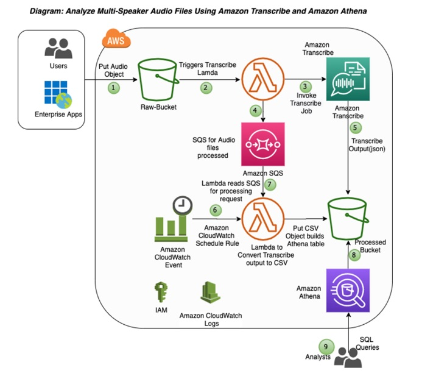

# Table of Contents

- [Table of Contents](#table-of-contents)
- [Amazon Transcribe: Overview](#amazon-transcribe-overview)
- [Solutions Architectures](#solutions-architectures)
  - [Analyze customer service calls for sentiment analysis](#analyze-customer-service-calls-for-sentiment-analysis)

---

# Amazon Transcribe: Overview

- Automatically convert speech to text

- Uses a deep learning process called Automatic Speech Recognition (ASR) to convert speech to text quickly and accurately

- **PII Identification and Redaction**: Automatically remove Personally Identifiable Information using Redaction

  - **Financial**:

    - `BANK_ACCOUNT_NUMBER`
    - `BANK_ROUTING`
    - `CREDIT_CARD_NUMBER`
    - `CREDIT_DEBIT_CVV`
    - `CREDIT_DEBIT_EXPIRY`
    - `PIN`

  - **Personal**

    - `NAME`
    - `ADDRESS`
    - `PHONE`
    - `EMAIL`
    - `SSN`

- Supports Automatic Language Identification for multilingual audio

- **Use Cases**:

  - Transcribe customer service calls
  - Automate closed captioning and subtitling
  - Generate metadata for media assets to create a fully searchable archive

---

# Solutions Architectures

## [Analyze customer service calls for sentiment analysis](https://aws.amazon.com/blogs/machine-learning/automating-the-analysis-of-multi-speaker-audio-files-using-amazon-transcribe-and-amazon-athena)

**Solution**:

1. Use Amazon Transcribe to convert audio files to text

   - One key feature of the Amazon Transcribe is called speaker identification, which you can use to label each individual speaker when transcribing multi-speaker audio files.
   - You can specify Amazon Transcribe to identify 2–10 speakers in the audio clip.

2. Use Amazon Athena to understand the underlying customer sentiments

   - Amazon Athena is an interactive query service that makes it easy to analyze data in Amazon S3 using standard SQL.

---
