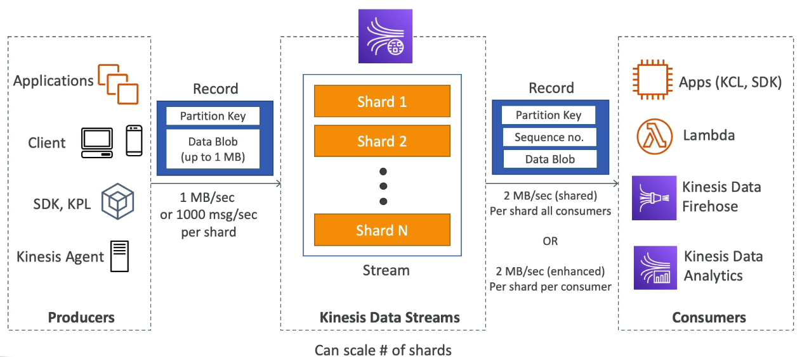
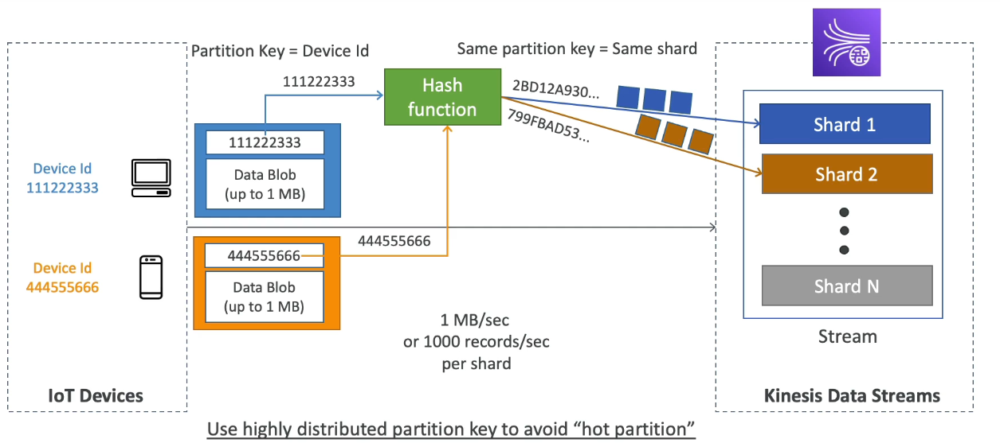
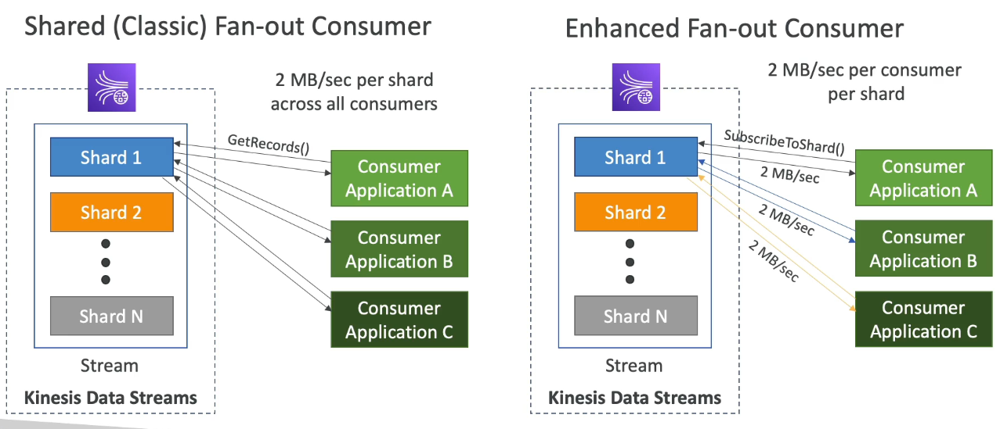
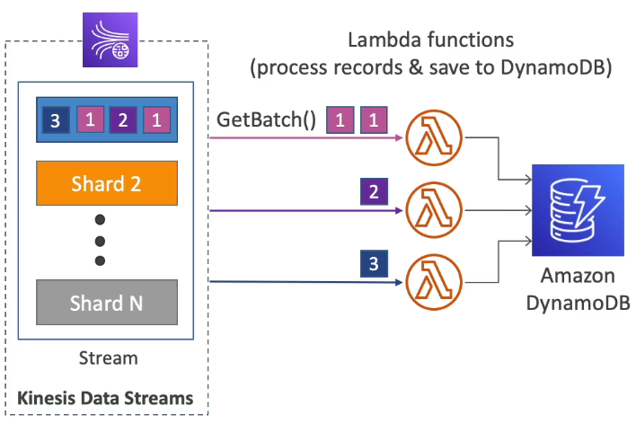
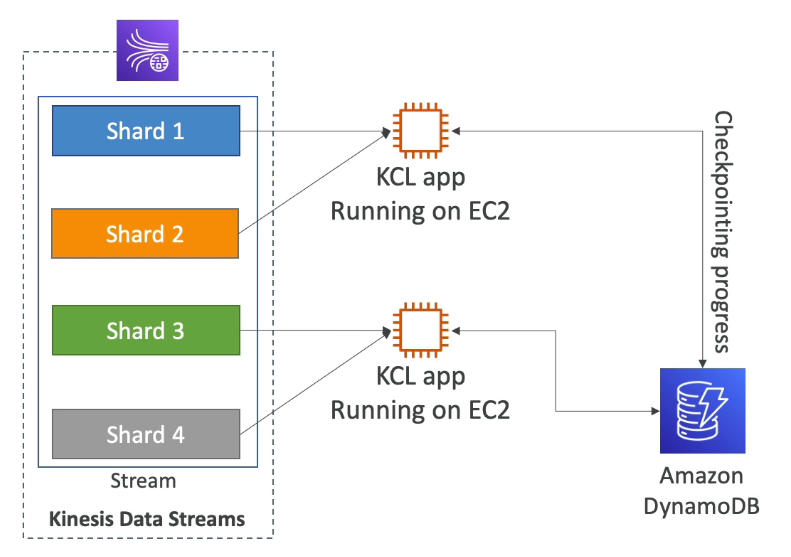
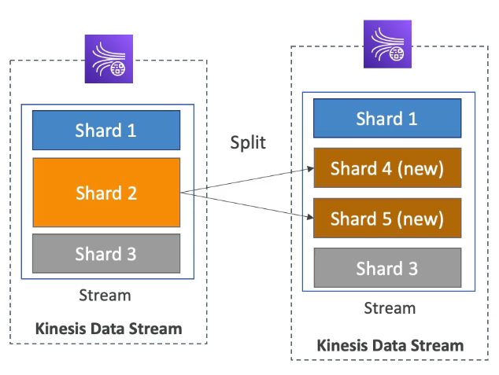
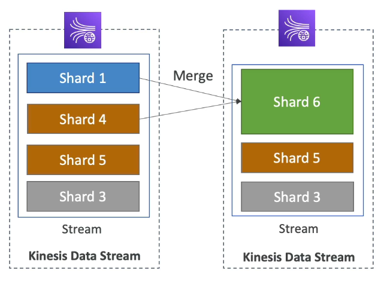
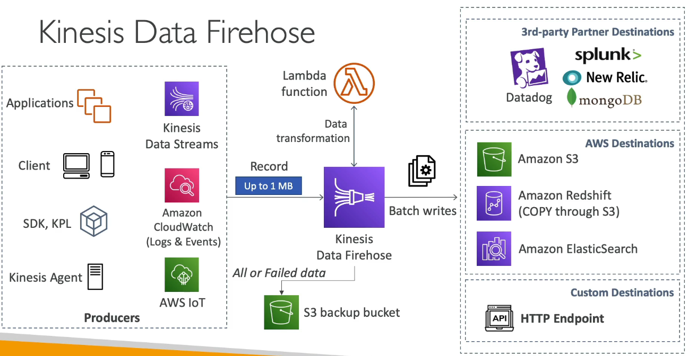
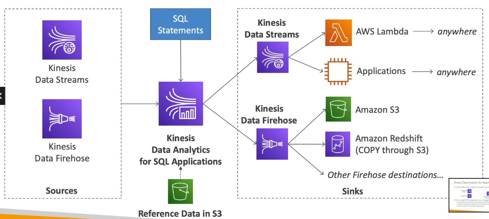

# Table of Contents

- [Table of Contents](#table-of-contents)
- [Kinesis Data Streams](#kinesis-data-streams)
  - [KDS: Overview](#kds-overview)
  - [KDS: Capacity Modes](#kds-capacity-modes)
    - [Provisioned Mode vs On-Demand Mode](#provisioned-mode-vs-on-demand-mode)
    - [Switching Modes](#switching-modes)
  - [KDS: Security and Monitoring](#kds-security-and-monitoring)
  - [KDS: Errors and Troubleshooting](#kds-errors-and-troubleshooting)
  - [KDS: Consuming with Lambda Functions](#kds-consuming-with-lambda-functions)
  - [KDS: Shared Consumption Model](#kds-shared-consumption-model)
  - [KDS: Kinesis Client Library (KCL)](#kds-kinesis-client-library-kcl)
- [Kinesis Operations](#kinesis-operations)
  - [Shard Splitting](#shard-splitting)
  - [Merging Shards](#merging-shards)
- [Kinesis Data Firehose](#kinesis-data-firehose)
  - [KDF: Overview](#kdf-overview)
  - [Kinesis Data Streams vs Kinesis Data Firehose](#kinesis-data-streams-vs-kinesis-data-firehose)
- [Kinesis Data Analytics](#kinesis-data-analytics)
  - [KDA: Overview](#kda-overview)
  - [Kinesis Data Analytics for SQL Applications](#kinesis-data-analytics-for-sql-applications)
  - [Kinesis Data Analytics for Apache Flink](#kinesis-data-analytics-for-apache-flink)
- [Data Ordering: Kinesis vs SQS FIFO](#data-ordering-kinesis-vs-sqs-fifo)
- [Using the CLI](#using-the-cli)
  - [`put-record`](#put-record)
  - [`describe-stream`](#describe-stream)
  - [`get-shard-iterator`](#get-shard-iterator)
  - [`get-records`](#get-records)

---

# Kinesis Data Streams

## KDS: Overview



**Key Concepts:**

1. **Data Producer**: A Data Producer is an application that typically emits Data Records as they are generated to a Kinesis data stream. Data producers assign **_partition keys_** to Records. Partition keys ultimately determine which shard ingests the data record for a data stream.

   A Data Producer can be:

   - Applications
   - Clients
   - AWS SDK
   - Kinesis Producer Library (KPL): Supports C++, Java and is built on top of the SDK but has some advanced capabilities available through API, such as batching, compression and retries.
   - Kinesis Agent: Built on top of the KPL, used to monitor log files and stream them into KDS.

   The **`PutRecord`** or **`PutRecords`** (bulk, reduce costs and increase throughput) API is used by the Data Producer to send Data into Kinesis.

   

2. **Data Consumer**: A Data Consumer is a distributed Kinesis application or AWS service retrieving data from all shards in a stream as it is generated. Most data consumers are retrieving the most recent data in a shard, enabling real-time analytics or handling of data.

   A Data Consumer can be:

   - Apps: Using AWS SDK or Kinesis Client Library (KCL)
   - Lambda Functions
   - Kinesis Data Firehose
   - Kinesis Data Analytics

   Data Consumers can consume data using two models:

   1. **Shared (Classic) Fan-Out Consumer (Pull)**:

      - Low number of consuming applications
      - Read throughput of `2MB/sec` per shard, shared across consumers.
      - Consumers poll data from Kinesis using **`GetRecords`** API call
      - Max: `5` **`GetRecords`** API calls/sec
      - Response payload size: Upto `10MB` (then throttle for 5 seconds) or upto `10000 records`
      - Latency: `~200ms`
      - Minimize cost: $

   2. **Enhanced Fan-Out Consumer (Push)**:

      - Multiple consuming applications for the same stream.
      - Read throughput of `2MB/sec` per consumer per shard.
      - Kinesis pushes data to consumers over HTTP/2 (**`SubscribeToShard`** API)
      - Soft limit of 5 consumer applications (KCL) per data stream (default) that can be extended by putting a ticket on AWS and [Requesting a Quota Increase](https://docs.aws.amazon.com/servicequotas/latest/userguide/request-quota-increase.html).
      - Latency: `~70ms`
      - Higher cost: $$$

   

3. **Data Stream**: A data stream is a logical grouping of shards. There are no bounds on the number of shards within a data stream (request a limit increase if you need more). A data stream will retain data for `24 hours` by default, or optionally up to `365 days`.

4. **Shard** : A shard is the base throughput unit of an Amazon Kinesis data stream.

   - A shard is an append-only log and a unit of streaming capability.
   - A shard contains an ordered sequence of records ordered by arrival time.
   - One shard can ingest up to `1000 data records per second`, or `1MB/sec`. Add more shards to increase your ingestion capability.
   - Add or remove shards from your stream dynamically as your data throughput changes using:
     - The AWS console,
     - **`UpdateShardCount`** API,
     - Trigger automatic scaling via AWS Lambda, or
     - Using an Auto Scaling utility.

   **When consumers use enhanced fan-out, one shard provides**:

   - `1MB/sec` data input and
   - `2MB/sec` data output for each data consumer registered to use enhanced fan-out.

   **When consumers do not use enhanced fan-out, a shard provides**:

   - `1MB/sec` of input and
   - `2MB/sec` of data output, and this output is shared with any consumer not using enhanced fan-out.

   You will specify the number of shards needed when you create a stream and can change the quantity at any time.

   For example: You can create a stream with two shards. If you have 5 data consumers using enhanced fan-out, this stream can provide up to 20 MB/sec of total data output (2 shards x 2MB/sec x 5 data consumers). When data consumer are not using enhanced fan-out this stream has a throughput of 2MB/sec data input and 4MB/sec data output. In all cases this stream allows up to 2000 PUT records per second, or 2MB/sec of ingress whichever limit is met first.
   You can monitor shard-level metrics in Amazon Kinesis Data Streams.

5. **Data Record**: A Data Record is the unit of data stored in an Amazon Kinesis stream. A record is composed of:

   - A Sequence Number,
   - A Partition Key, and
   - Data Blob. A data blob is the data of interest your data producer adds to a stream. The maximum size of a data blob (the data payload after Base64-decoding) is 1 megabyte (MB).

6. **Partition Key**: A partition key is typically a meaningful identifier, such as a user ID or timestamp. It is specified by your data producer while putting data into an Amazon Kinesis data stream, and useful for consumers as they can use the partition key to replay or build a history associated with the partition key. The partition key is also used to segregate and route data records to different shards of a stream. For example, assuming you have an Amazon Kinesis data stream with two shards (Shard 1 and Shard 2). You can configure your data producer to use two partition keys (Key A and Key B) so that all data records with Key A are added to Shard 1 and all data records with Key B are added to Shard 2.

7. **Sequence Number**: A sequence number is a **unique identifier for each data record**. Sequence number is assigned by Amazon Kinesis Data Streams when a Data Producer calls **`PutRecord`** or **`PutRecords`** API to add data to an Amazon Kinesis data stream. Sequence numbers for the same partition key generally increase over time; the longer the time period between **`PutRecord`** or **`PutRecords`** requests, the larger the sequence numbers become.

**Other characteristics:**

- Data Retention can be set between 1 to 365 days
- Ability to reprocess (replay) data
- Once data is inserted into Kinesis, it can't be deleted (immutability)
- Data that shares the same `partition key` goes into the same shard (key-based ordering)
- Producers: AWS SDK, Kinesis Producer Library (KPL), Kinesis Agent
- Consumers:
  - Write your own: Using Kinesis Client Library (KCL), AWS SDK
  - Managed: AWS Lambda, Kinesis Data Firehose, Kinesis Data Analytics

---

## KDS: Capacity Modes

### Provisioned Mode vs On-Demand Mode

1. **Provisioned Mode**:

   - Choose the number of shards provisioned, scale manually or using API
   - Write Capacity: `1MB/s` and `1000 records/sec` per shard
   - Read Capacity: `2MB/s` (classic or enhanced fan-out consumer) per shard
   - Provisioned Shards:

     - Minimum: `1`
     - Maximum available: `200` (can be extended by requesting shard quota increase)

   - You pay per shard provisioned per hour

2. **On-Demand Mode**:

   - No need to provision or manage the capacity
   - Write Capacity:

     - Default: `4MB/sec` and `4,000 records/sec`
     - Maximum: `200 MB/sec` and `200,000 records/sec`

   - Read Capcity:

     - Default: On-Demand
     - Maximum: `400 MB/sec`
       - Upto 2 default consumers.
       - Use Enhanced Fan-Out (EFO) for more consumers.
       - EFO supports adding upto 20 consumers, each having a dedicated throughput.

   - Scales automatically based on observed throughput peak during the last 30 days
   - Pay per stream per hour & data in/out per GiB
   - Exceeding quotas will cause throttling. Check **`ProvisionedThroughputExceeded`** error in the **[Troubleshooting](#kds-errors-and-troubleshooting)** section.

---

### Switching Modes

- You can switch between On-Demand and Provisioned mode twice a day.
- The shard count of your data stream remains the same when you switch from Provisioned Mode to On-Demand mode and vice versa.
- With the switch from Provisioned to On-Demand capacity mode, your data stream retains whatever shard count it had before the transition. But from that point on, Kinesis Data Streams monitors your data traffic and scales the shard count of this On-Demand data stream up or down depending on traffic increase or decrease.

---

## KDS: Security and Monitoring

- Control Access / Authorization using IAM Policies
- Encryption in-flight using HTTPS
- Encryption at rest using KMS
- You can implement Client-side encryption/decryption of data
- VPC endpoints available for Kinesis to access within VPC. This allow you to access Kinesis directly from an EC2 Instance in a private subnet without going through the internet.
- Monitor API calls using CloudTrail

---

## KDS: Errors and Troubleshooting

1. **`ProvisionedThroughputExceeded`**:

   - If we overproduce into a shard or overconsume from a shard (bypass the throughput limit), we will get this exception.

   - **Solution**:
     - Use a highly distributed partition key.
     - Retries with exponential backoff.
     - Increase shards (scaling) by **[splitting shards](#shard-splitting)**.

---

## KDS: Consuming with Lambda Functions



- Supports Classic & Enhanced Fan-Out Consumers
- Reads records in batches
- Can configure `batch size` and `batch window`
- If error occurs, Lambda retries until succeed or data expired
- Can process upto 10 batches per shard simultaneously

---

## KDS: Shared Consumption Model

**Workflow:**

1. Get the **`ShardIterator`** using the **`GetShardIterator`** API
2. Use the **`GetRecords`** API and use the **`ShardIterator`** received from the **`GetShardIterator`** API to get the records.

---

## KDS: Kinesis Client Library (KCL)

Kinesis Client Library (KCL) is a Java Library that helps read records from a Kinesis Data Stream with distributed applications sharing the read workload. KCL can run on Elastic Beanstalk, EC2 and on-premises.

- **How it works**:

  - Progress is checkpointed into DynamoDB. Thus application running KCL will need IAM access to DynamoDB.
  - Track other workers and share the work amongst the shards using DynamoDB.
  - Each shard is to be read by only one KCL instance. (4 shards = max. 4 KCL instances)
  - Records are read in order at the shard level



- **Versions**:

  - **`KCL 1.x`** (supports only shared consumer)
  - **`KCL 2.x`** (supports both shared and enhanced fan-out consumer)

---

# Kinesis Operations

## Shard Splitting



- Used to increase the Stream Write Capacity: `1MB/s` data per shard
- Used to split (divide) a "hot shard"
- Increases cost
- The old shard will be closed and will be deleted once the data is expired (expiry depends on the Retention Period)
- No native automatic scaling (manually increase / decrease capacity). Need to implement a solutions architecture to come up with auto-scaling.

- Cannot split a single shard more than once in a single operation.

  - E.g. You have 2 shards and you want to split them into 4 shard. You will need to do 3 operations.

    - **Operation 1**: `Shard A` into `Shard B` and `Shard C`
    - **Operation 2**: `Shard B` into `Shard D` and `Shard E`
    - **Operation 3**: `Shard C` into `Shard F` and `Shard G`

    We will end up with Shards: **`D`**, **`E`**, **`F`**, **`G`**

---

## Merging Shards



- Opposite operation of Shard Splitting
- Used to decrease capacity and save costs
- Can be used to group two shards with low traffic (cold shards)
- Old shards will be closed and will be deleted once the data is expired (expiry depends on the Retention Period)

- Cannot merge more than two shards in a single operation.

  - E.g. You have 4 shards and you want to merge them into 1 shard. You will need to do 3 operations.

    - **Operation 1**: `Shard A` and `Shard B` into `Shard E`
    - **Operation 2**: `Shard C` and `Shard D` into `Shard F`
    - **Operation 3**: `Shard E` and `Shard F` into **`Shard G`**

    We will end up with **`Shard G`**

---

# Kinesis Data Firehose

## KDF: Overview

Amazon Kinesis Data Firehose is an extract, transform, and load (ETL) service that reliably captures, transforms, and delivers streaming data to data lakes, data stores, and analytics services.

- Like Kinesis Data Streams, Kinesis Data Firehose accepts a maximum incoming message size of 1 MB
- Fully managed service: No administration, automated scaling, serverless
- Pay only for data going through Firehose
- Near real-time: Data is written in batches from Firehose to the destination
  - Minimum of 60 seconds latency for non-full batches
  - Or minimum 1MB of data at a time
- Supports many data formats conversions, transformations, compression
- Supports custom data transformations using AWS Lambda
- Can send failed or all data to a backup S3 bucket



**Key Concepts:**

1. **Extract**: Extract Data from Producers:

   - Applications running AWS SDK
   - Applications running Kinesis Producer Library (KPL)
   - Client
   - Kinesis Agent
   - Kinesis Data Streams
   - Amazon CloudWatch (Logs and Events)
   - Amazon EventBridge
   - AWS IoT

2. **Transform**: Transform Data using Data Transformers (_Optional_):

   - **`AWS Lambda`**: Transform source records using an AWS Lambda Function. You can compress, filter, un-compress, convert the record format into JSON (for further conversion into Apache Parquet or Apache ORC), provide dynamic partitioning keys for the incoming source databefore its delivery to the specified destination.

3. **Load**: Loads the transformed data into destinations:

   - **AWS Destinations**:

     - **`Amazon S3`**
     - **`Amazon Redshift`**: First writes the data to S3 and then Kinesis Data Firehose will issue a Copy command to copy the data into Redshift
     - **`Amazon OpenSearch`**
     - **`Kinesis Data Analytics`**

   - **Third-party Partner Destinations**:

     - **`Datadog`**
     - **`Dynatrace`**
     - **`LogicMonitor`**
     - **`MongoDB`**
     - **`New Relic`**
     - **`Splunk`**

   - **Custom Destinations**: Generic HTTP endpoints

---

## Kinesis Data Streams vs Kinesis Data Firehose

| Kinesis Data Streams                    | Kinesis Data Firehose                                  |
| --------------------------------------- | ------------------------------------------------------ |
| Streaming service for ingest at scale   | Load streaming data into S3, Redshift, 3rd party, etc. |
| Write custom code (producer / consumer) | Fully managed                                          |
| Real-time (~200ms)                      | Near real-time (buffer-time min. 60 sec)               |
| Manage scaling (shard-split / merge)    | Automatic scaling                                      |
| Data storage (1 to 365 days)            | No data storage                                        |
| Supports replay capability              | Doesn't support replay capability                      |

---

# Kinesis Data Analytics

## KDA: Overview

Kinesis Data Analytics comes in two flavours:

1. For SQL Applications
2. For Apache Flink

---

## Kinesis Data Analytics for SQL Applications



- Real-time Data Analytics using SQL
- **Data Sources**:

  1. Kinesis Data Streams
  2. Kinesis Data Firehose

- **Sinks**:

  1. Kinesis Data Streams: Create streams out of real-time data analysis
  2. Kinesis Data Firehose: Send analytics query results to destinations

- Fully managed: Automatic scaling, Serverless
- Pay for actual consumption rate

- **Use cases**:
  - Time-series analytics
  - Real-time dashboards
  - Real-time metrics

---

## Kinesis Data Analytics for Apache Flink

- Use Flink (Java, Scala or SQL) to process and analyze streaming data.
- Can run Flink applications on dedicated managed cluster on Kinesis Data Analytics

  - Provisioning compute resources, parallel computation, automatic scaling
  - Application backups (implemented as checkpoints and snapshots)
  - Use any Apache Flink programming features
  - Flink does not read from Firehose (use Kinesis Analytics for SQL instead)

- **Data Sources**:

  1. Kinesis Data Streams
  2. Amazon MSK

---

# Data Ordering: Kinesis vs SQS FIFO

Let's assume we have 100 trucks sending data and 5 Kinesis shards and 1 SQS FIFO.

| Kinesis Data Streams                       | SQS FIFO                                            |
| ------------------------------------------ | --------------------------------------------------- |
| On average: ~20 trucks/shard               | Can have 1 SQS FIFO Queue                           |
| Trucks have data ordered within each shard | You will have 100 Group ID                          |
| Maximum amount of parallel consumers: 5    | You will have 100 Consumers (due to Group ID)       |
| Can receive upto 5MB/s of data             | Can receive upto 300 messages/s (3000 when batched) |

---

# Using the CLI

## [`put-record`](https://awscli.amazonaws.com/v2/documentation/api/latest/reference/kinesis/put-record.html)

Writes a single data record into an Amazon Kinesis data stream. Call **`PutRecord`** to send data into the stream for real-time ingestion and subsequent processing, one record at a time. Each shard can support writes up to `1,000` records per second, up to a maximum data write total of `1 MiB` per second.

You must specify the name of the stream that captures, stores, and transports the data; a partition key; and the data blob itself.

The data blob can be any type of data; for example, a segment from a log file, geographic/location data, website clickstream data, and so on.

The partition key is used by Kinesis Data Streams to distribute data across shards. Kinesis Data Streams segregates the data records that belong to a stream into multiple shards, using the partition key associated with each data record to determine the shard to which a given data record belongs.

Partition keys are Unicode strings, with a maximum length limit of `256` characters for each key. An `MD5` hash function is used to map partition keys to `128-bit integer values` and to map associated data records to shards using the hash key ranges of the shards. You can override hashing the partition key to determine the shard by explicitly specifying a hash value using the **`ExplicitHashKey`** parameter.

**Syntax:**

```s
aws kinesis put-record \
 --stream-name [StreamName] \
 --partition-key [PartitionKey] \
 --data [DataBlob] \
 --cli-binary-format "raw-in-base64-out"
```

**Example:**

```s
aws kinesis put-record \
 --stream-name TestStream \
 --partition-key user1 \
 --data "user-signup" \
 --cli-binary-format "raw-in-base64-out"
```

**Response:**

```json
{
  "ShardId": "shardId-000000000000",
  "SequenceNumber": "49617390934629201455926329620716961756489569047916052482"
}
```

---

## [`describe-stream`](https://awscli.amazonaws.com/v2/documentation/api/latest/reference/kinesis/describe-stream.html)

Describes the specified Kinesis data stream.

**Syntax:**

```s
aws kinesis describe-stream \
 --stream-name [StreamName] \
 --max-items [ 1 - 10000 | 100] \
 --starting-token [NextTokenFromPreviousResponse] \

```

**Example:**

```s
aws kinesis describe-stream --stream-name TestStream
```

**Response:**

```json
{
  "StreamDescription": {
    "Shards": [
      {
        "ShardId": "shardId-000000000000",
        "HashKeyRange": {
          "StartingHashKey": "0",
          "EndingHashKey": "340282366920938463463374607431768211455"
        },
        "SequenceNumberRange": {
          "StartingSequenceNumber": "49617390934629201455926329620716961756489569047916052482"
        }
      }
    ],
    "StreamARN": "arn:aws:kinesis:ap-south-1:001736599714:stream/TestStream",
    "StreamName": "TestStream",
    "StreamStatus": "ACTIVE",
    "RetentionPeriodHours": 24,
    "EnhancedMonitoring": [
      {
        "ShardLevelMetrics": []
      }
    ],
    "HasMoreRecords": false,
    "StreamCreationTimestamp": 1.468346745e9
  }
}
```

---

## [`get-shard-iterator`](https://awscli.amazonaws.com/v2/documentation/api/latest/reference/kinesis/get-shard-iterator.html)

Gets an Amazon Kinesis shard iterator.

- A shard iterator specifies the shard position from which to start reading data records sequentially.
- A shard iterator **expires 5 minutes after it is returned to the requester**.
- The position is specified using the sequence number of a data record in a shard.
- A sequence number is the identifier associated with every record ingested in the stream, and is assigned when a record is put into the stream.
- Each stream has one or more shards.

**Syntax:**

```s
aws kinesis get-shard-iterator \
 --stream-name TestStream \
 --shard-id [shardId-[0-9]{12}] \
 --shard-iterator-type ["TRIM_HORIZON"|"AT_SEQUENCE_NUMBER"|"AFTER_SEQUENCE_NUMBER"|"AT_SEQUENCE_TIMESTAMP"|"LATEST"] \
 --starting-sequence-number [SequenceNumber] \
 --timestamp [Timestamp]
```

**Example:**

```s
aws kinesis get-shard-iterator \
 --stream-name TestStream \
 --shard-id "shardId-000000000000" \
 --shard-iterator-type TRIM_HORIZON
```

**Response:**

```json
{
  "ShardIterator": "AAAAAAAAAAGtYgUq0OwFKpIqqDHDoswgADDT3VzUW6qPzgR04TPuWEbCgUZPVjI2adlKwjAUsIIpjLYOaC82nhF+Ml2nlT5WxK3WLtulh34OZrsVw9Q0gT6QpaZlkqi6wSKfb2yrqxj6ShbHueiUuqQMH/5hW2NRaLhgdxm6thQtoZF+BS+ljcye7BJV1iwNKz29KH96EqGnn9ucxLyZoSLWXD/KV1uck88QV+u02S/HQ1+v/xKmw=="
}
```

---

## `get-records`

Gets data records from a Kinesis data stream’s shard.

Specify a shard iterator using the **`ShardIterator`** parameter. The shard iterator specifies the position in the shard from which you want to start reading data records sequentially. If there are no records available in the portion of the shard that the iterator points to, **`GetRecords`** returns an empty list. It might take multiple calls to get to a portion of the shard that contains records.

**Syntax:**

```s
aws kinesis get-records --shard-iterator [ShardIterator]
```

**Example:**

```s
aws kinesis get-records --shard-iterator "AAAAAAAAAAGtYgUq0OwFKpIqqDHDoswgADDT3VzUW6qPzgR04TPuWEbCgUZPVjI2adlKwjAUsIIpjLYOaC82nhF+Ml2nlT5WxK3WLtulh34OZrsVw9Q0gT6QpaZlkqi6wSKfb2yrqxj6ShbHueiUuqQMH/5hW2NRaLhgdxm6thQtoZF+BS+ljcye7BJV1iwNKz29KH96EqGnn9ucxLyZoSLWXD/KV1uck88QV+u02S/HQ1+v/xKmw=="
```

**Response:**

```json
{
  "Records": [
    {
      "SequenceNumber": "49617390934629201455926329624637508189499828916235272194",
      "ApproximateArrivalTimestamp": "2022-28-16T17:30:24.56500+00:00",
      "Data": "dXNlciBzaWdudXA=",
      "PartitionKey": "user1"
    },
    {
      "SequenceNumber": "49617390934629201455926329624638717115319444438763175938",
      "ApproximateArrivalTimestamp": "2022-28-16T17:30:37.35800+00:00",
      "Data": "dXNlciBzaWdudXA=",
      "PartitionKey": "user1"
    },
    {
      "SequenceNumber": "49617390934629201455926329624639926041139059686413172738",
      "ApproximateArrivalTimestamp": "2022-28-16T17:30:45.97800+00:00",
      "Data": "dXNlciBsb2dpbg=",
      "PartitionKey": "user1"
    }
  ],
  "NextShardIterator": "AAAAAAAAAAGuCXhMnje1cU5DkLquB9uVHKT39SiVD+6+tUwQ/OZpWHurUyYsdIo6gh8OFn09oM2ZwKz21t2pfJgxOaS2PmU3ytQqlZIWNShucxAslqNlFKG2I7KA4HHgZwDVjVzKlgQQ+ya1qPQnoLV0F/xWDh4tHqZqEIplSb0khjWW0gDjsRal8PL26LqKbEnu2+dg6CVQeu/KBijm+LT5Ubh38xSWwTrKva96RxcYTziww/wq6==",
  "MillisBehindLatest": 0
}
```

Where,

- **`SequenceNumber`**: Is the unique identifier for the data record.
- **`ApproximateArrivalTimestamp`**: Approximate time the data record was pushed to the stream.
- **`Data`**: Is the base64encoded data that must be decoded to be made human readable.
- **`PartitionKey`**: Usually an ID or some grouping that allows the consumer to identify data belonging to a particular person or group and build a history associated with the partition key.
- **`NextShardIterator`**: The `--shard-iterator` argument to use with the **`GetRecords`** API to consume from where we last stopped consuming from.

---
