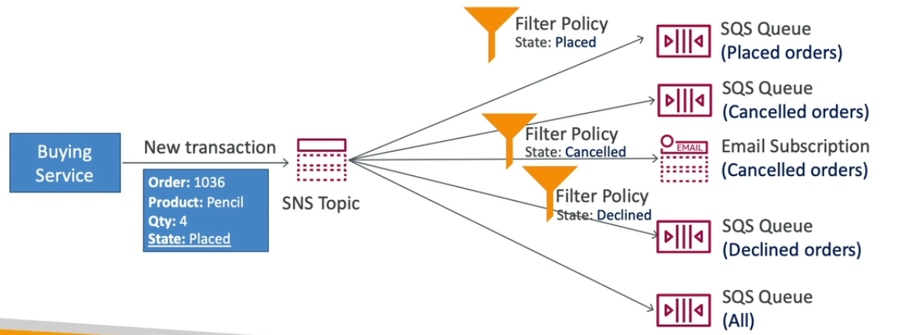
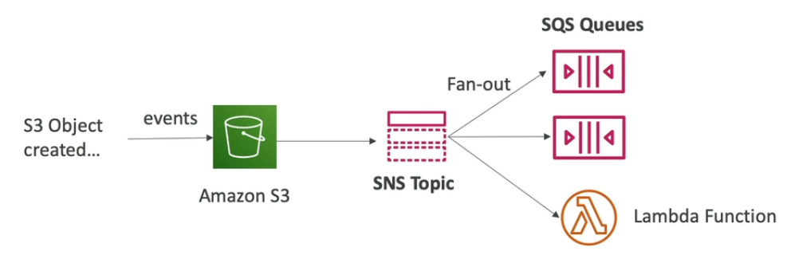
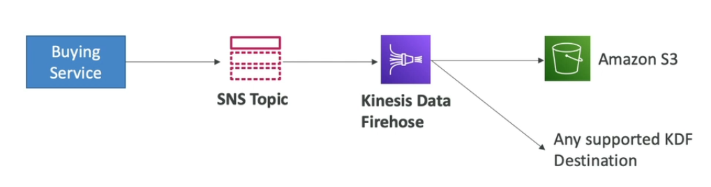
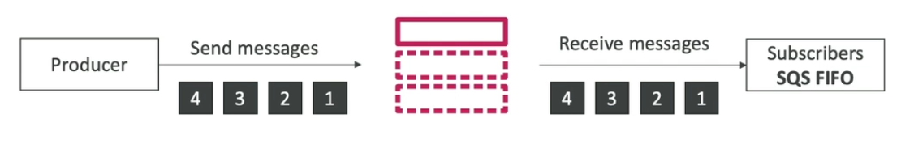
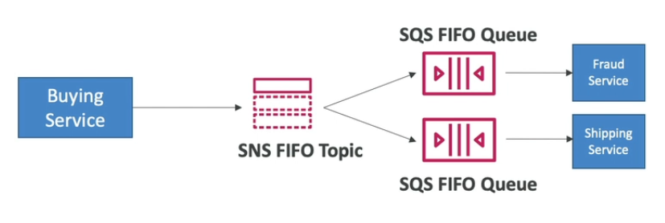

# Table of Contents

- [Table of Contents](#table-of-contents)
- [Overview](#overview)
- [Basic Workflow](#basic-workflow)
- [Security](#security)
- [Message Filtering](#message-filtering)
- [Patterns](#patterns)
  - [Fan-Out Pattern](#fan-out-pattern)
- [Using the CLI](#using-the-cli)
  - [`create-topic`](#create-topic)
  - [`add-permission`](#add-permission)
  - [`subscribe`](#subscribe)
- [References](#references)

--

# Overview

**Amazon Simple Notification Service (Amazon SNS)** is a web service that enables you to build distributed web-enabled applications. Applications can use Amazon SNS to easily push real-time notification messages to interested subscribers over multiple delivery protocols.

- Publish / Subscribe model instead of Polling
- Publisher sends only one message to one SNS Topic
- Multiple Subscribers can listen to the SNS Topic for notifications
- Each subscriber to the topic will get all the messages (Note: There's a new feature to filter messages)
- Upto 12.5 million subscriptions per topic.
- Upto 100,000 topics. Limit can be extended.
- SNS Integrations with AWS Services:
  - CloudWatch Alarms
  - AWS Budgets
  - Auto Scaling Group (Notifications)
  - S3 Bucket Event Notifications
  - CloudFormation (State Changes)
  - AWS DMS (New Replica)
  - Lambda
  - DynamoDB
  - RDS Events

---

# Basic Workflow

- Topic Publish

  1. Publisher / Subscriber can initiate the flow by creating a Topic.
  2. Subscriber(s) subscribe to the topic.
  3. Publisher publishes to the topic.

- Direct Publish (Mobile SDK)

  1. Create a platform application
  2. Create a platform endpoint
  3. Publish to the platform endpoint
  4. Works with Google GCM, Apple APNS, Amazon ADM etc.

---

# Security

1. Encryption:

   - In-flight encryption using HTTPS.
   - At-rest encryption using KMS keys.
   - Client-side encryption if the client wants to perform encryption/decryption itself.

2. Access Controls:

   - IAM policies to regulate access to the SNS API.

3. SNS Access Policies:

   - Useful for cross-account access to SNS Topics.
   - Useful for allowing other services (e.g. S3) to write to an SNS Topic.

---

# Message Filtering

By default, an Amazon SNS topic subscriber receives every message that's published to the topic. To receive only a subset of the messages, a subscriber must assign a filter policy to the topic subscription.



- JSON Policy used to filter messages sent to the SNS topic's Subscriber
- If a subscriber doesn't have a filter policy, it receives every message

---

# Patterns

## Fan-Out Pattern

- Push once in SNS, receive in all SQS queues that are subscribers.
- Fully decoupled, no data loss.
- SQS allows for: data persistence, delayed processing and retries of work.
- Ability to add more SQS subscribers over time.
- **Note**: Make sure the SQS access policy allows for SNS to write.
- **Cross-Region delivery**: Works with SQS queues in other regions.

- **Applications:**

  1. **S3 Events into Multiple Queues**

     

     - S3 has a limitation that for the combination of: event type (e.g. `s3:ObjectCreated:*`) and prefix (e.g. `images/`), you can have only one S3 event rule.
     - If you want to send the same S3 event to multiple SQS queues, use the Fan-Out pattern.

  2. **SNS to Amazon S3 through Kinesis Data Firehose**

     - SNS can send to Kinesis and therefore we can have the following solutions architecture:

       

  3. **SNS FIFO Topic**

     

     - Similar features as SQS FIFO:
       - Ordering by **`MessageGroupID`** (all messages in the same group are ordered)
       - Deduplication using a Deduplication ID or Content Based Deduplication
     - Can only have SQS FIFO Queues as subscribers.
     - Limited throughput (same as SQS FIFO)

     

- **Message Filering**: Works with Fan-Out

---

# Using the CLI

## [`create-topic`](https://awscli.amazonaws.com/v2/documentation/api/latest/reference/sns/create-topic.html)

**Example 1: Create a Standard Topic**

```s
aws sns create-topic --name S3EventsTopic
```

**Example 2: Create a FIFO Topic with Content based Deduplication enabled**

```s
aws sns create-topic \
 --name S3EventsTopic.fifo \
 --attributes DisplayName="S3Events",FifoTopic=true,ContentBasedDeduplication=true
```

**Response:**

```json
{
  "TopicArn": "arn:aws:sns:ap-south-1:336463900088:S3EventsTopic.fifo"
}
```

---

## [`add-permission`](https://awscli.amazonaws.com/v2/documentation/api/latest/reference/sns/add-permission.html)

**Example:**

```s
aws sns add-permission \
 --topic-arn "arn:aws:sns:ap-south-1:336463900088:S3EventsTopic.fifo" \
 --label "Publish-Permission" \
 --aws-account-id 336463900088 \
 --action-name "Publish"
```

**Response:**

None

---

## [`subscribe`](https://awscli.amazonaws.com/v2/documentation/api/latest/reference/sns/subscribe.html)

Subscribe to a topic.

**Syntax:**

```s
aws sns subscribe \
  --topic-arn arn:aws:sns:ap-south-1:336463900088:S3EventsTopic \
  --protocol ["http"|"https"|"email"|"email-json"|"sms"|"sqs"|"application"|"lambda"|"firehose"] \
  --notification-endpoint [Endpoint] \
  --return-subscription-arn \
  --attributes [MapOfAttributes] \
```

**Example:**

```s
aws sns subscribe \
  --topic-arn arn:aws:sns:ap-south-1:336463900088:S3EventsTopic \
  --protocol email \
  --notification-endpoint "jayanta@zenius.one" \
```

**Response:**

```json
{
  "SubscriptionArn": "pending confirmation"
}
```

# References
