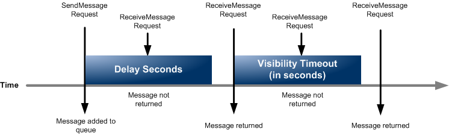

# Table of Contents

- [Table of Contents](#table-of-contents)
- [Messaging: Primer](#messaging-primer)
- [SQS](#sqs)
  - [SQS: Overview](#sqs-overview)
  - [SQS: Visibility Timeouts](#sqs-visibility-timeouts)
  - [SQS: Dead Letter Queue (DLQ)](#sqs-dead-letter-queue-dlq)
    - [DLQ: Overview](#dlq-overview)
    - [DLQ: Redrive to Source](#dlq-redrive-to-source)
  - [SQS: Delay Queues](#sqs-delay-queues)
  - [SQS: Long-Polling](#sqs-long-polling)
  - [SQS: SQS Extended Client](#sqs-sqs-extended-client)
  - [SQS: FIFO Queues](#sqs-fifo-queues)
    - [FIFO Queues: Overview](#fifo-queues-overview)
    - [FIFO Queues: De-duplication](#fifo-queues-de-duplication)
    - [FIFO Queues: Message Grouping](#fifo-queues-message-grouping)
- [Using the CLI](#using-the-cli)
  - [SQS](#sqs-1)
    - [`create-queue`](#create-queue)
    - [`get-queue-url`](#get-queue-url)
    - [`list-queues`](#list-queues)
    - [`set-queue-attributes`](#set-queue-attributes)
    - [`send-message`](#send-message)
    - [`send-message-batch`](#send-message-batch)
    - [`receive-message`](#receive-message)
    - [`change-message-visibility`](#change-message-visibility)
    - [`change-message-visibility-batch`](#change-message-visibility-batch)
    - [`delete-message`](#delete-message)
    - [`delete-message-batch`](#delete-message-batch)
- [References](#references)

---

# Messaging: Primer

---

# SQS

## SQS: Overview

Amazon SQS is a reliable, highly-scalable hosted queue for storing messages as they travel between applications or microservices. Amazon SQS moves data between distributed application components and helps you decouple these components.

**An Amazon SQS message has three basic states:**

1. Sent to a queue by a producer.
2. Received from the queue by a consumer.
3. Deleted from the queue.

**Basic Workflow:**

1. Create a Queue with an Access Policy allowing Producer to write to Queue
2. Create notification(s) from the Producer
3. Create a Consumer that polls the queue for messages

---

## SQS: Visibility Timeouts

---

## SQS: Dead Letter Queue (DLQ)

### DLQ: Overview

Amazon SQS supports dead-letter queues (DLQ), which other queues (source queues) can target for messages that can't be processed (consumed) successfully.

If a consumer fails to process a message within the visibility timeout the mesage becomes visible inside the Queue again for other consumers to access:

- We can set a threshold of how many times a message can go back into the queue by setting the **`MaximumReceives`**.
- Dead-letter queues are useful for debugging your application or messaging system because they let you isolate unconsumed messages to determine why their processing doesn't succeed.
- The dead-letter queue of a FIFO queue must also be a FIFO queue. Similarly, the dead-letter queue of a standard queue must also be a standard queue.
- Best Practice:
  - Make sure to process the messages in a DLQ before they expire.
  - Good to set a retention policy of 14 days (`1209600` seconds).
- Once Deleted from the DLQ, the message will be deleted in the primary queue as well.

---

### DLQ: Redrive to Source

- Feature to help consume messages in the DLQ to understand what is wrong with them.
- When our code is fixed, we can redrive the messages from the DLQ back to the source queue (or any other queue) in batches without writing custom code.
- The benefit is that, the consumer can re-process the message without knowing that the message went into the Dead Letter Queue.

---

## SQS: Delay Queues

Delay queues let you postpone the delivery of new messages to consumers for a number of seconds.

**For example:** Your consumer application needs additional time to process messages. If you create a delay queue, any messages that you send to the queue remain invisible to consumers for the duration of the delay period.

- The default (minimum) delay for a queue is `0 seconds`. The maximum is `15 minutes`.
- We can set a default at a queue level.
- Can override this queue level default at a per message level using the **`SendMessage`** API and the **`DelaySeconds`** parameter.

  > **Note**: FIFO queues don't support timers on individual messages.

Delay queues are similar to visibility timeouts because both features make messages unavailable to consumers for a specific period of time. The difference between the two is that, for delay queues, a message is hidden **when it is first added to queue**, whereas for visibility timeouts a message is hidden **only after it is consumed from the queue**. The following diagram illustrates the relationship between delay queues and visibility timeouts.



---

## SQS: Long-Polling

When the wait time for the **`ReceiveMessage`** API action is greater than `0`, long polling is in effect.

- The maximum long polling wait time is `20` seconds.
- Long polling helps reduce the cost of using Amazon SQS by eliminating the number of empty responses (when there are no messages available for a **`ReceiveMessage`** request) and false empty responses (when messages are available but aren't included in a response).
- Long polling is preferable to Short polling.
- Long polling can be enabled at the time of queue creation from the console or when using the **`CreateQueue`** API and setting the **`ReceiveMessageWaitTimeSeconds`** parameter to a value between `0` and `20`.

---

## SQS: SQS Extended Client

The default message size limit is `256 KB`, but we need to send large messages, say over 1 GB. We can do so using the SQS Extended Client which is a Java Library.


---

## SQS: FIFO Queues

### FIFO Queues: Overview

In FIFO (First-In-First-Out) Queues, the first message to enter the Queue, will be the first one to leave the queue (ordering of messages in the queue is preserved).

FIFO queues have all the capabilities of the standard queues, but are designed to enhance messaging between applications when the order of operations and events is critical, or where duplicates can't be tolerated.

**Examples of situations where you might use FIFO queues include the following:**

- **E-commerce order management system**: Where order is critical
- Integrating with a third-party systems: **Where events need to be processed in order**
- **Processing user-entered inputs in the order entered**
- **Communications and networking**: Sending and receiving data and information in the same \*\*order
- **Computer systems**: Making sure that user-entered commands are run in the right order
- **Educational institutes**: Preventing a student from enrolling in a course before registering for an account
- **Online ticketing system**: Where tickets are distributed on a first come first serve basis

> **Note**: FIFO queues also provide **exactly-once processing**, but have a limited number of transactions per second (TPS). By default this is: 300 messages/s without batching and 3000 messages/s with batching. You can use Amazon SQS high throughput mode with your FIFO queue to increase your transaction limit. For details on using high throughput mode, see High throughput for FIFO queues. For information on throughput quotas, see Quotas related to messages.

---

### FIFO Queues: De-duplication

- De-duplication interval is 5 minutes
- Two de-duplication methods:

  - **Content-based deduplication**: As soon as a message is sent into SQS, a SHA-256 hash of the message body is done. If the same hash is encountered again, the message is considered a duplicate and will be refused.
  - **Message De-duplication ID**: Explicity provide a Message De-Duplication ID which if matched again, will refuse the last message.

---

### FIFO Queues: Message Grouping

- If you specify the same **`MessageGroupID`** (mandatory parameter for FIFO Queues) in a SQS FIFO Queue, you can only have one consumer and all messages are in order.
- To get ordering at the level of the subset of messages, specify different values for **`MessageGroupID`**.
  - Messages that will share a common **`MessageGroupID`** will be in order within the group.
  - Each group ID can have a different consumer (parallel processing!)
  - **IMPORTANT**: Ordering across groups is not guaranteed

The idea is to have multiple consumers, consuming from a different **`MessageGroupID`**, on the same message queue.

---

# Using the CLI

## SQS

### `create-queue`

Creates a new standard or FIFO queue. You can pass one or more attributes in the request. Keep the following in mind:

- If you don’t specify the FifoQueue attribute, Amazon SQS creates a standard queue.
- You can’t change the queue type after you create it and you can’t convert an existing standard queue into a FIFO queue. You must either create a new FIFO queue for your application or delete your existing standard queue and recreate it as a FIFO queue.
- FIFO queue names must have the `.fifo` suffix.
- If you don’t provide a value for an attribute, the queue is created with the default value for the attribute.
- If you delete a queue, you must wait at least 60 seconds before creating a queue with the same name.
- To successfully create a new queue, you must provide a queue name that adheres to the limits related to queues and is unique within the scope of your queues.

**Syntax:**

```s
aws sqs create-queue \
 --queue-name [QueueName] \
 --attributes [AttributeMap] \
 --tags [key1=string,key2=string,...]
```

Where,

- **`--queue-name`**: Name of the queue
- **`--attributes`**: Refer to the Attributes from **[`set-queue-attributes`](#set-queue-attributes)**
- **`--tags`**: A list of tags: Custom key-value pair.

---

**Example 1: Create a Standard Queue that allows S3 bucket events to send notifications to the queue**

1. **Save the Access Policy in a file**.

   In `assets/sqs-s3-policy.json`,

   ```json
   {
     "Version": "2012-10-17",
     "Statement": [
       {
         "Sid": "SQSPolicyForS3Bucket-jayanta-s3-bucket",
         "Effect": "Allow",
         "Principal": {
           "Service": "s3.amazonaws.com"
         },
         "Action": ["SQS:SendMessage"],
         "Resource": "arn:aws:sqs:ap-south-1:336463900088:S3EventsQueue",
         "Condition": {
           "ArnLike": {
             "aws:SourceArn": "arn:aws:s3:*:*:jayanta-s3-bucket"
           },
           "StringEquals": {
             "aws:SourceAccount": "336463900088"
           }
         }
       }
     ]
   }
   ```

2. **Create the Queue with the Access Policy**

   > Note: This uses the Command-line JSON processor `jq`.
   >
   > Install using `sudo apt install jq`.

   ```s
   aws sqs create-queue \
   --queue-name S3EventsQueue \
   --attributes Policy=$(cat ~/Work/quick-reference/aws/messaging/sqs/assets/sqs-s3-policy.json | jq -c | jq -R)
   ```

   **Response:**

   ```json
   {
     "QueueUrl": "https://sqs.ap-south-1.amazonaws.com/336463900088/S3EventsQueue"
   }
   ```

3. **Add a notification configuration to your bucket**

   In `assets/s3-sqs-notification-config.json`,

   ```json
   {
     "QueueConfigurations": [
       {
         "QueueArn": "arn:aws:sqs:ap-south-1:336463900088:S3EventsQueue",
         "Events": [
           "s3:ObjectCreated:Put",
           "s3:ObjectCreated:Post",
           "s3:ObjectCreated:Copy",
           "s3:ObjectCreated:CompleteMultipartUpload",
           "s3:ObjectRemoved:Delete",
           "s3:ObjectRemoved:DeleteMarkerCreated",
           "s3:ObjectRestore:Post",
           "s3:ObjectRestore:Completed"
         ]
       }
     ]
   }
   ```

   ```s
   aws s3api put-bucket-notification-configuration \
   --bucket jayanta-s3-bucket \
   --notification-configuration file:///home/jayantasamaddar/Work/quick-reference/aws/messaging/sqs/assets/s3-sqs-notification-config.json
   ```

---

**Example 2: Create a Dead Letter Queue for the Queue**

> **Note:** For this example, we are assuming we already have one Queue named **`S3EventsQueue`**

1. **Create a new Queue that will be our Dead Letter Queue**

   We will set the **`MessageRetentionPeriod`** to be the maximum 14 days (`1209600` seconds) as this is a Dead Letter Queue and we want to catch all missed messages.

   ```s
   aws sqs create-queue \
   --queue-name S3EventsQueueDLQ \
   --attributes MessageRetentionPeriod=1209600
   ```

   **Response:**

   ```json
   {
     "QueueUrl": "https://sqs.ap-south-1.amazonaws.com/336463900088/S3EventsQueueDLQ"
   }
   ```

2. **Edit the `RedrivePolicy` Attributes of the `S3EventsQueue` Queue**

   Check the **[`set-queue-attributes`](#set-queue-attributes)** command for more details on how to edit the attributes of an existing Queue.

   **Method 1: Command-line JSON processor `jq`**

   ```s
   aws sqs set-queue-attributes \
    --queue-url "https://sqs.ap-south-1.amazonaws.com/336463900088/S3EventsQueue" \
    --attributes RedrivePolicy=$(echo '{"maxReceiveCount":10,"deadLetterTargetArn":"arn:aws:sqs:ap-south-1:336463900088:S3EventsQueueDLQ"}' | jq -R)
   ```

   OR if you have a [`sqs-redrive-policy.json`](assets/sqs-redrive-policy.json) file,

   ```s
   aws sqs set-queue-attributes \
   --queue-url "https://sqs.ap-south-1.amazonaws.com/336463900088/S3EventsQueue" \
   --attributes RedrivePolicy=$(cat ~/Work/quick-reference/aws/messaging/sqs/assets/sqs-redrive-policy.json | jq -c | jq -R)
   ```

   **Method 2: Using a stringified JSON**

   ```s
   aws sqs set-queue-attributes \
   --queue-url "https://sqs.ap-south-1.amazonaws.com/336463900088/S3EventsQueue" \
   --attributes '{
    "RedrivePolicy": "{\"deadLetterTargetArn\":\"arn:aws:sqs:ap-south-1:336463900088:S3EventsQueueDLQ\",\"maxReceiveCount\":\"10\"}",
   }'
   ```

   > **[Check my StackOverFlow answer for more details](https://stackoverflow.com/a/74591739/6574719)**

---

**Example 3: Create a Delay Queue**

```s
aws sqs create-queue \
   --queue-name ExampleDelayQueue \
   --attributes DelaySeconds=10
```

---

**Example 4: Create a FIFO Queue with Content-Based De-duplication Enabled**

```s
aws sqs create-queue \
   --queue-name ExampleFIFOQueue.fifo \
   --attributes FifoQueue=true,ContentBasedDeduplication=true
```

**Example 5: Create a FIFO Queue with High-Throughput Enabled**

To enable high throughput for FIFO queues, do the following:

- Set **`DeduplicationScope`** to `messageGroup`.
- Set **`FifoThroughputLimit`** to `perMessageGroupId`.

If you set these attributes to anything other than the values shown for enabling high throughput, normal throughput is in effect and deduplication occurs as specified.

```s
aws sqs create-queue \
   --queue-name ExampleHighThroughputFIFOQueue.fifo \
   --attributes FifoQueue=true,DeduplicationScope=messageGroup,FifoThroughputLimit=perMessageGroupId
```

---

### [`get-queue-url`](https://awscli.amazonaws.com/v2/documentation/api/latest/reference/sqs/get-queue-url.html)

Get the URL of a Queue.

**Syntax:**

```s
aws sqs get-queue-url --queue-name [QueueName]
```

**Example:**

```s
aws sqs get-queue-url --queue-name S3EventsQueue
```

**Response:**

```json
{
  "QueueUrl": "https://sqs.ap-south-1.amazonaws.com/336463900088/S3EventsQueue"
}
```

---

### [`list-queues`](https://awscli.amazonaws.com/v2/documentation/api/latest/reference/sqs/list-queues.html)

Returns a list of your queues in the current region. The response includes a maximum of `1000` results. If you specify a value for the optional **`QueueNamePrefix`** parameter, only queues with a name that begins with the specified value are returned.

The **`listQueues`** methods supports pagination. Set parameter **`MaxResults`** in the request to specify the maximum number of results to be returned in the response. If you do not set **`MaxResults`**, the response includes a maximum of `1000` results. If you set **`MaxResults`** and there are additional results to display, the response includes a value for **`NextToken`** . Use **`NextToken`** as a parameter in your next request to **`listQueues`** to receive the next page of results.

> **Note:** Cross-account permissions don’t apply to this action.

**`list-queues`** is a paginated operation. Multiple API calls may be issued in order to retrieve the entire data set of results. You can disable pagination by providing the `--no-paginate` argument. When using `--output` text and the `--query` argument on a paginated response, the `--query` argument must extract data from the results of the following query expressions: **`QueueUrls`**

**Syntax:**

```s
aws sqs list-queues \
 --queue-name-prefix [QueueNamePrefix] \
 --max-items [1 - 1000 | 1000] \
 --starting-token [NextToken] \
 --no-paginate \
 --output [json|text|table|yaml|yaml-stream] \
 --query [JMESPathQueryFilter]
```

**Example: List first 1000 queues**

```s
aws sqs list-queues
```

**Response:**

```json
{
  "QueueUrls": [
    "https://sqs.ap-south-1.amazonaws.com/336463900088/S3EventsQueue",
    "https://sqs.ap-south-1.amazonaws.com/336463900088/S3EventsQueueDLQ"
  ]
}
```

---

### [`set-queue-attributes`](https://awscli.amazonaws.com/v2/documentation/api/latest/reference/sqs/set-queue-attributes.html)

Sets the value of one or more queue attributes. When you change a queue’s attributes, the change can take up to 60 seconds for most of the attributes to propagate throughout the Amazon SQS system. Changes made to the **`MessageRetentionPeriod`** attribute can take up to 15 minutes.

**Syntax:**

```s
aws sqs set-queue-attributes \
 --queue-url [QueueURL] \
 --attributes [AttributesMap]
```

Where,

- **`--queue-url`**: The URL of the Amazon SQS queue whose attributes are set.
- **`-attributes`**: A map of queue's attributes with their corresponding values:

  - **`Policy`**: The queue’s policy. A valid AWS policy.

  - **`VisibilityTimeout`**: The visibility timeout for the queue, in seconds. Valid values: An integer from `0` to `43200` (12 hours). Default: `30`.

  - **`MaximumMessageSize`**: The limit of how many bytes a message can contain before Amazon SQS rejects it. Valid values: An integer from `1024` bytes (1 KiB) to `262144` bytes (256 KiB). Default: `262144` (256 KiB).

  - **`MessageRetentionPeriod`**: The length of time, in seconds, for which Amazon SQS retains a message. Valid values: An integer from `60` seconds (1 minute) to `1209600` seconds (14 days). Default: `345600` (4 days).

  - **`DelaySeconds`**: The length of time, in seconds, for which the delivery of all messages in the queue is delayed. Valid values: An integer from `0` to `900` seconds (15 minutes). Default: `0`.

  - **`**ReceiveMessageWaitTimeSeconds`**: The length of time, in seconds, for which a **`ReceiveMessage`** action waits for a message to arrive. Valid values: An integer from `0`to`20`(seconds). Default:`0`.

  - **`RedrivePolicy`**: The string that includes the parameters for the dead-letter queue functionality of the source queue as a JSON object.

    - **`deadLetterTargetArn`**: The Amazon Resource Name (ARN) of the dead-letter queue to which Amazon SQS moves messages after the value of **`maxReceiveCount`** is exceeded.
    - **`maxReceiveCount`**: The number of times a message is delivered to the source queue before being moved to the dead-letter queue. When the ReceiveCount for a message exceeds the **`maxReceiveCount`** for a queue, Amazon SQS moves the message to the dead-letter-queue. Valid values: An integer from `1` to `1000`.

  For FIFO Queues:

  - **`FifoQueue`**: `true` or `false`. Set true to mark queue as a FifoQueue.
  - **`ContentBasedDeduplication`**: Only applicable for FIFO queues) `true` or `false`.
  - **`DeduplicationScope`**: (Only applicable for High throughput FIFO) Specifies whether message deduplication occurs at the message group or queue level. Valid values are `messageGroup` and `queue`. To enable high throughput for FIFO queues set to `messageGroup`.
  - **`FifoThroughputLimit`**: Specifies whether the FIFO queue throughput quota applies to the entire queue or per message group. Valid values are `perQueue` and `perMessageGroupId`. The `perMessageGroupId` value is allowed only when the value for **`DeduplicationScope`** is `messageGroup`. To enable high throughput for FIFO queues set to `perMessageGroupId`.

  For server-side encryption:

  - **`KmsMasterKeyId`**: The ID of an Amazon Web Services managed customer master key (CMK) for Amazon SQS or a custom CMK.
  - **`KmsDataKeyReusePeriodSeconds`**: The length of time, in seconds, for which Amazon SQS can reuse a data key to encrypt or decrypt messages before calling KMS again. An integer representing seconds, between `60` seconds (1 minute) and `86,400` seconds (24 hours). Default: `300` (5 minutes). A shorter time period provides better security but results in more calls to KMS which might incur charges after Free Tier.
  - **`SqsManagedSseEnabled`**: Enables server-side queue encryption using SQS owned encryption keys. Only one server-side encryption option is supported per queue.

**Example:**

```s
aws sqs set-queue-attributes \
 --queue-url "https://sqs.ap-south-1.amazonaws.com/336463900088/S3EventsQueue" \
 --attributes Policy=$(cat ~/Work/quick-reference/aws/messaging/sqs/assets/sqs-s3-policy.json | jq -c | jq -R)
```

**Response:**

None

---

### [`send-message`](https://awscli.amazonaws.com/v2/documentation/api/latest/reference/sqs/send-message.html)

Delivers a message to the specified queue.

> **Note**: A message can include only XML, JSON, and unformatted text. The following Unicode characters are allowed:
>
> `#x9` | `#xA` | `#xD` | `#x20` to `#xD7FF` | `#xE000` to `#xFFFD` | `#x10000` to `#x10FFFF`
>
> Any characters not included in this list will be rejected.

**Syntax:**

```s
aws sqs send-message \
 --queue-url [QueueURL] \
 --message-body [MessageXML | MessageJSON | MessageText] \
 --delay-seconds [0 - 900 | 0] \

```

**Example:**

```s
aws sqs send-message \
 --queue-url "https://sqs.ap-south-1.amazonaws.com/336463900088/S3EventsQueue" \
 --message-body "Testing a Message" \
 --delay-seconds 30
```

---

### [`send-message-batch`](https://awscli.amazonaws.com/v2/documentation/api/latest/reference/sqs/send-message-batch.html)

Delivers up to ten messages to the specified queue. This is a batch version of **`SendMessage`**. For a FIFO queue, multiple messages within a single batch are enqueued in the order they are sent.

The result of sending each message is reported individually in the response. Because the batch request can result in a combination of successful and unsuccessful actions, you should check for batch errors even when the call returns an HTTP status code of `200`.

The maximum allowed individual message size and the maximum total payload size (the sum of the individual lengths of all of the batched messages) are both **`256 KB`** (262,144 bytes).

If you don’t specify the DelaySeconds parameter for an entry, Amazon SQS uses the default value for the queue.

Some actions take lists of parameters. These lists are specified using the `param.n` notation. Values of `n` are integers starting from `1`. For example, a parameter list with two elements looks like this:

> `&AttributeName.1=first`
>
> `&AttributeName.2=second`

**Syntax:**

```s
aws sqs send-message-batch \
 --queue-url [QueueURL] \
 --entries [ListOfEntries | JSONFilePathURL ]
```

**Example:**

```s
aws sqs send-message-batch \
 --queue-url "https://sqs.ap-south-1.amazonaws.com/336463900088/ExampleQueue" \
 --entries file:///home/jayantasamaddar/Work/quick-reference/aws/messaging/sqs/sqs-send-message-batch.jsontries
```

---

### [`receive-message`](https://awscli.amazonaws.com/v2/documentation/api/latest/reference/sqs/receive-message.html)

Retrieves one or more messages (up to 10), from the specified queue. Using the **`WaitTimeSeconds`** parameter enables long-poll support. For more information, see Amazon SQS Long Polling in the Amazon SQS Developer Guide.

Short poll is the default behavior where a weighted random set of machines is sampled on a **`ReceiveMessage`** call. Thus, only the messages on the sampled machines are returned. If the number of messages in the queue is small (fewer than 1,000), you most likely get fewer messages than you requested per **`ReceiveMessage`** call. If the number of messages in the queue is extremely small, you might not receive any messages in a particular **`ReceiveMessage`** response. If this happens, repeat the request.

For each message returned, the response includes the following:

- The message body.
- An MD5 digest of the message body. For information about MD5, see RFC1321 .
- The MessageId you received when you sent the message to the queue.
- The receipt handle.
- The message attributes.
- An MD5 digest of the message attributes.

**Syntax:**

```s
aws sqs receive-message \
 --queue-url [QueueURL] \
 --attribute-names "All"|"Policy"|"VisibilityTimeout"|"MaximumMessageSize"|"MessageRetentionPeriod"|"ApproximateNumberOfMessages"|"ApproximateNumberOfMessagesNotVisible"|"CreatedTimestamp"|"LastModifiedTimestamp"|"QueueArn"|"ApproximateNumberOfMessagesDelayed"|"DelaySeconds"|"ReceiveMessageWaitTimeSeconds"|"RedrivePolicy"|"FifoQueue"|"ContentBasedDeduplication"|"KmsMasterKeyId"|"KmsDataKeyReusePeriodSeconds"|"DeduplicationScope"|"FifoThroughputLimit"|"RedriveAllowPolicy"|"SqsManagedSseEnabled" \
 --message-attribute-names ["string" "string" ... | "All" | "string.*" ] \
 --max-number-of-messages [1 - 10 | 1] \
 --visibility-timeout [0 - 43200 | 30] \
 --wait-time-seconds [Seconds] \
 --receive-request-attempt-id [FIFOReceiveMessageDeduplicationToken]
```

**Example:**

```s
aws sqs receive-message \
 --queue-url "https://sqs.ap-south-1.amazonaws.com/336463900088/S3EventsQueue" \
 --attribute-names All \
```

**Response:**

```s
{
    "Messages": [
        {
            "MessageId": "856ae2ce-3468-463d-961f-d48d60ef0f96",
            "ReceiptHandle": "AQEBoMAWlNN9/l5atE0N0x33R4xNIJa2/Bg9d5N/+UUp2Xk8LEEykYxyS2tmqduruV/lDSGwuch/vmGJGcGK3WlrL3A13CnWzxwsAJ3DtJnaOjijHhES4C6W7MMvyRCASaiIQtfsAlX3KmKws5oHa6w6aCzEcPISAH5SXVmiq5gvrLQ2AqHgUojhfjQb+9pBS2XzbaGCPMUn0Rm2814Qstl897oh+5HBouMoSqmNRgaXSIH49kGAF0LtCw/7pQNPu9DuuIvjnAZsGiBevVnXMMxprubTUmt2ofJGXUQiv/4wrIia5ha0AyH81aJS9Jgh+SdxMWsT+/2/dtvwx9989LBnRkAwI+vHiq9MsNPHsRI+uOipAWp3TokCZcjtMKMnnCF5p6bDS8H3ZRz7tdNEOi23hg==",
            "MD5OfBody": "9d3c67341616d31a2f4927a4ae296128",
            "Body": "{\"Records\":[{\"eventVersion\":\"2.1\",\"eventSource\":\"aws:s3\",\"awsRegion\":\"ap-south-1\",\"eventTime\":\"2022-11-27T13:53:34.852Z\",\"eventName\":\"ObjectRemoved:DeleteMarkerCreated\",\"userIdentity\":{\"principalId\":\"AWS:AIDAU4VWPVW4LMV44R2CE\"},\"requestParameters\":{\"sourceIPAddress\":\"49.37.45.159\"},\"responseElements\":{\"x-amz-request-id\":\"3QTEYF3CNAJNVP2A\",\"x-amz-id-2\":\"PFJFUfT3popb9zXinfJWpnEpTPGLxqdQsYZpDtBBEYF/EQ6B8Stnk3d24tusP94/Ytnad+pxj2r3TMvberPAJMDY1VGPg4nTnkDOqi06yL8=\"},\"s3\":{\"s3SchemaVersion\":\"1.0\",\"configurationId\":\"MTgwNmU1ZTMtZWM4YS00ZjRmLWIxN2EtM2UyOTY5YTFlYjcz\",\"bucket\":{\"name\":\"jayanta-s3-bucket\",\"ownerIdentity\":{\"principalId\":\"A1XII8CWWG37R1\"},\"arn\":\"arn:aws:s3:::jayanta-s3-bucket\"},\"object\":{\"key\":\"hello.txt\",\"eTag\":\"d41d8cd98f00b204e9800998ecf8427e\",\"versionId\":\"vKYoCpCBU_hb4vsOMyC_UOKobVstiIoV\",\"sequencer\":\"0063836BDED404C9F2\"}}}]}",
            "Attributes": {
                "SenderId": "AIDAJNNKV2HIAN5AMAKHG",
                "ApproximateFirstReceiveTimestamp": "1669557227339",
                "ApproximateReceiveCount": "1",
                "SentTimestamp": "1669557216395"
            }
        }
    ]
}
```

---

### [`change-message-visibility`](https://awscli.amazonaws.com/v2/documentation/api/latest/reference/sqs/change-message-visibility.html)

Changes the visibility timeout of a specified message in a queue to a new value. The default visibility timeout for a message is 30 seconds. The minimum is 0 seconds. The maximum is 12 hours.

For example, you have a message with a visibility timeout of 5 minutes. After 3 minutes, you call **`ChangeMessageVisibility`** with a timeout of 10 minutes. You can continue to call **`ChangeMessageVisibility`** to extend the visibility timeout to the maximum allowed time. If you try to extend the visibility timeout beyond the maximum, your request is rejected.

An Amazon SQS message has three basic states:

1. Sent to a queue by a producer.
2. Received from the queue by a consumer.
3. Deleted from the queue.

A message is considered to be stored after it is sent to a queue by a producer, but not yet received from the queue by a consumer (that is, between states 1 and 2). There is no limit to the number of stored messages. A message is considered to be in flight after it is received from a queue by a consumer, but not yet deleted from the queue (that is, between states 2 and 3). There is a limit to the number of inflight messages.

Limits that apply to inflight messages are unrelated to the unlimited number of stored messages.

For most standard queues (depending on queue traffic and message backlog), there can be a maximum of approximately `120,000` inflight messages (received from a queue by a consumer, but not yet deleted from the queue). If you reach this limit, Amazon SQS returns the OverLimit error message. To avoid reaching the limit, you should delete messages from the queue after they’re processed. You can also increase the number of queues you use to process your messages. To request a limit increase, [file a support request](https://console.aws.amazon.com/support/home#/case/create?issueType=service-limit-increase&limitType=service-code-sqs).

For FIFO queues, there can be a maximum of `20,000` inflight messages (received from a queue by a consumer, but not yet deleted from the queue). If you reach this limit, Amazon SQS returns no error messages.

> **WARNING**: If you attempt to set the **`VisibilityTimeout`** to a value greater than the maximum time left, Amazon SQS returns an error. Amazon SQS doesn’t automatically recalculate and increase the timeout to the maximum remaining time.
>
> Unlike with a queue, when you change the visibility timeout for a specific message the timeout value is applied immediately but isn’t saved in memory for that message. If you don’t delete a message after it is received, the visibility timeout for the message reverts to the original timeout value (not to the value you set using the **`ChangeMessageVisibility`** action) the next time the message is received.

**Syntax:**

```s
aws sqs change-message-visibility \
 --queue-url [QueueURL] \
 --receipt-handle [ReceiptHandle] \
 --visibility-timeout [0 - 43200 | 30]
```

**Example:**

```s
aws sqs change-message-visibility \
 --queue-url "https://sqs.ap-south-1.amazonaws.com/336463900088/S3EventsQueue" \
 --receipt-handle "AQEBoMAWlNN9/l5atE0N0x33R4xNIJa2/Bg9d5N/+UUp2Xk8LEEykYxyS2tmqduruV/lDSGwuch/vmGJGcGK3WlrL3A13CnWzxwsAJ3DtJnaOjijHhES4C6W7MMvyRCASaiIQtfsAlX3KmKws5oHa6w6aCzEcPISAH5SXVmiq5gvrLQ2AqHgUojhfjQb+9pBS2XzbaGCPMUn0Rm2814Qstl897oh+5HBouMoSqmNRgaXSIH49kGAF0LtCw/7pQNPu9DuuIvjnAZsGiBevVnXMMxprubTUmt2ofJGXUQiv/4wrIia5ha0AyH81aJS9Jgh+SdxMWsT+/2/dtvwx9989LBnRkAwI+vHiq9MsNPHsRI+uOipAWp3TokCZcjtMKMnnCF5p6bDS8H3ZRz7tdNEOi23hg==" \
 --visibility-timeout 300
```

**Response:**

None

---

### [`change-message-visibility-batch`](https://awscli.amazonaws.com/v2/documentation/api/latest/reference/sqs/change-message-visibility-batch.html)

Changes the visibility timeout of multiple messages. This is a batch version of **`ChangeMessageVisibility`**. The result of the action on each message is reported individually in the response. You can send up to `10` **`ChangeMessageVisibility`** requests with each **`ChangeMessageVisibilityBatch`** action.

**Syntax:**

```s
aws sqs change-message-visibility-batch \
 --queue-url [QueueURL] \
 --entries [ListOfEntries | JSONFilePathURL]
```

**Example:**

```s
aws sqs delete-message-batch \
 --queue-url "https://sqs.ap-south-1.amazonaws.com/336463900088/ExampleQueue" \
 --entries file:///home/jayantasamaddar/Work/quick-reference/aws/messaging/sqs/assets/change-message-visibility-batch.json
```

---

### [`delete-message`](https://awscli.amazonaws.com/v2/documentation/api/latest/reference/sqs/delete-message.html)

Deletes the specified message from the specified queue. To select the message to delete, use the **`ReceiptHandle`** of the message (**_not_** the `MessageId` which you receive when you send the message). Amazon SQS can delete a message from a queue even if a visibility timeout setting causes the message to be locked by another consumer. Amazon SQS automatically deletes messages left in a queue longer than the retention period configured for the queue.

> **Note:** The **`ReceiptHandle`** is associated with a specific instance of receiving a message. If you receive a message more than once, the **`ReceiptHandle`** is different each time you receive a message. When you use the DeleteMessage action, you must provide the most recently received **`ReceiptHandle`** for the message (otherwise, the request succeeds, but the message might not be deleted).
>
> For standard queues, it is possible to receive a message even after you delete it. This might happen on rare occasions if one of the servers which stores a copy of the message is unavailable when you send the request to delete the message. The copy remains on the server and might be returned to you during a subsequent receive request. You should ensure that your application is idempotent, so that receiving a message more than once does not cause issues.
>
> **Glossary:** **Idempotence**, in programming and mathematics, is a property of some operations such that no matter how many times you execute them, you achieve the same result. In programming, idempotence can be a property of many different code elements, including functions, methods, requests and statements.

**Syntax:**

```s
aws sqs delete-message \
 --queue-url [QueueURL] \
 --receipt-handle [ReceiptHandle]
```

**Example:**

```s
aws sqs delete-message \
 --queue-url "https://sqs.ap-south-1.amazonaws.com/336463900088/S3EventsQueue" \
 --receipt-handle "AQEBoMAWlNN9/l5atE0N0x33R4xNIJa2/Bg9d5N/+UUp2Xk8LEEykYxyS2tmqduruV/lDSGwuch/vmGJGcGK3WlrL3A13CnWzxwsAJ3DtJnaOjijHhES4C6W7MMvyRCASaiIQtfsAlX3KmKws5oHa6w6aCzEcPISAH5SXVmiq5gvrLQ2AqHgUojhfjQb+9pBS2XzbaGCPMUn0Rm2814Qstl897oh+5HBouMoSqmNRgaXSIH49kGAF0LtCw/7pQNPu9DuuIvjnAZsGiBevVnXMMxprubTUmt2ofJGXUQiv/4wrIia5ha0AyH81aJS9Jgh+SdxMWsT+/2/dtvwx9989LBnRkAwI+vHiq9MsNPHsRI+uOipAWp3TokCZcjtMKMnnCF5p6bDS8H3ZRz7tdNEOi23hg=="
```

**Response:**

None

---

### [`delete-message-batch`](https://awscli.amazonaws.com/v2/documentation/api/latest/reference/sqs/delete-message-batch.html)

Deletes up to ten messages from the specified queue. This is a batch version of **`DeleteMessage`**. The result of the action on each message is reported individually in the response.

The batch request can result in a combination of successful and unsuccessful actions. You should check for batch errors even when the call returns an HTTP status code of `200`.

Some actions take lists of parameters. These lists are specified using the `param.n` notation. Values of `n` are integers starting from `1`. For example, a parameter list with two elements looks like this:

> `&AttributeName.1=first`
>
> `&AttributeName.2=second`

**Syntax:**

```s
aws sqs delete-message-batch \
 --queue-url [QueueURL] \
 --entries [ListOfEntries | JSONFilePathURL]
```

**Example:**

```s
aws sqs delete-message-batch \
 --queue-url "https://sqs.ap-south-1.amazonaws.com/336463900088/ExampleQueue" \
 --entries file:///home/jayantasamaddar/Work/quick-reference/aws/messaging/sqs/assets/delete-message-batch.json
```

---

# References

- **Amazon SQS** | **[API Docs](https://docs.aws.amazon.com/AWSSimpleQueueService/latest/APIReference/Welcome.html)** | **[CLI Commands](https://awscli.amazonaws.com/v2/documentation/api/latest/reference/sqs/index.html#cli-aws-sqs)** | **[JavaScript SDK](https://github.com/aws/aws-sdk-js-v3/tree/main/clients/client-sqs)**
