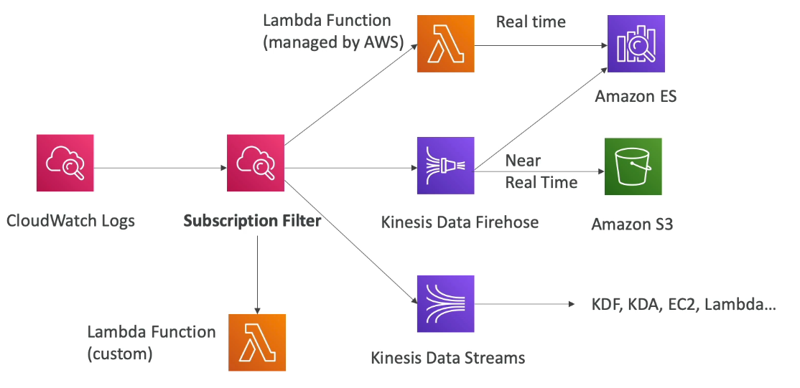
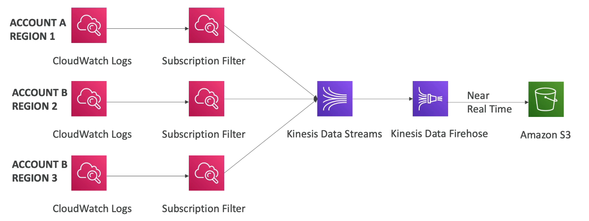
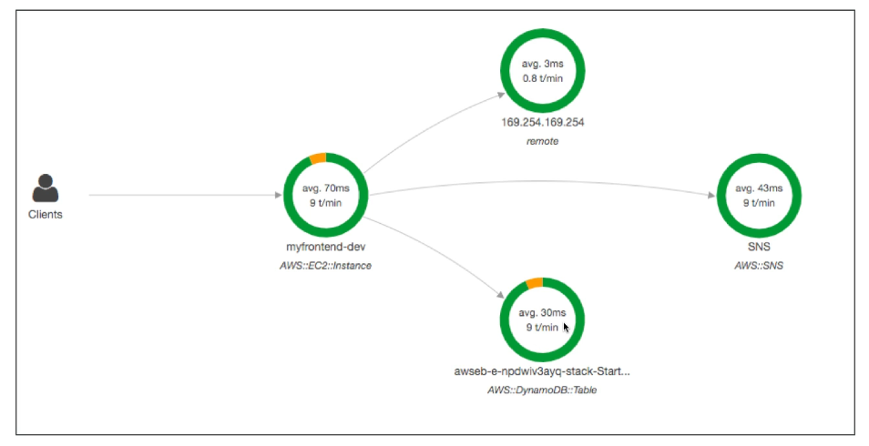
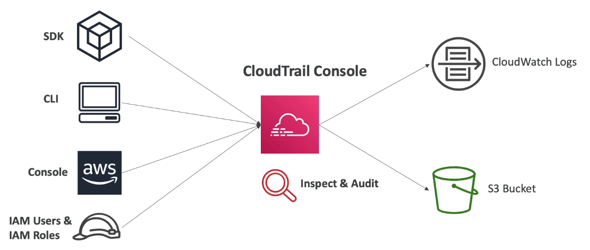
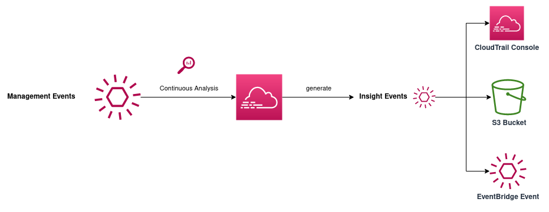
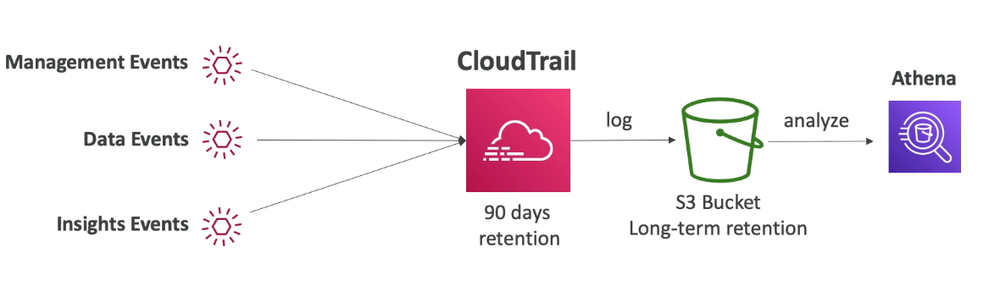

# Table of Contents

- [Table of Contents](#table-of-contents)
- [Why is Monitoring important?](#why-is-monitoring-important)
- [Monitoring in AWS](#monitoring-in-aws)
- [CloudWatch](#cloudwatch)
  - [CloudWatch Metrics](#cloudwatch-metrics)
  - [EC2 Detailed Monitoring](#ec2-detailed-monitoring)
  - [CloudWatch Custom Metrics](#cloudwatch-custom-metrics)
  - [CloudWatch Logs](#cloudwatch-logs)
    - [CloudWatch Logs: Overview](#cloudwatch-logs-overview)
    - [CloudWatch Logs: Log Stream](#cloudwatch-logs-log-stream)
    - [CloudWatch Logs: Log Groups](#cloudwatch-logs-log-groups)
    - [CloudWatch Logs: Sources](#cloudwatch-logs-sources)
    - [CloudWatch Logs: Metric Filter \& Insights](#cloudwatch-logs-metric-filter--insights)
    - [CloudWatch Logs: EC2 Instance Recovery](#cloudwatch-logs-ec2-instance-recovery)
    - [CloudWatch Logs: Exports](#cloudwatch-logs-exports)
    - [CloudWatch Logs: Aggregation](#cloudwatch-logs-aggregation)
  - [CloudWatch Logs Agent](#cloudwatch-logs-agent)
  - [CloudWatch Unified Agent](#cloudwatch-unified-agent)
  - [CloudWatch Alarms](#cloudwatch-alarms)
    - [CloudWatch Alarms: Overview](#cloudwatch-alarms-overview)
    - [CloudWatch Alarms: Composite Alarms](#cloudwatch-alarms-composite-alarms)
  - [CloudWatch Events](#cloudwatch-events)
    - [CloudWatch Events: Overview](#cloudwatch-events-overview)
    - [CloudWatch Events: Concepts](#cloudwatch-events-concepts)
- [Amazon EventBridge](#amazon-eventbridge)
  - [EventBridge: Overview](#eventbridge-overview)
  - [EventBridge: EventBus](#eventbridge-eventbus)
  - [EventBridge: Schema Registry](#eventbridge-schema-registry)
  - [EventBridge: Resource-Based Policy](#eventbridge-resource-based-policy)
  - [Amazon EventBridge vs CloudWatch Events](#amazon-eventbridge-vs-cloudwatch-events)
- [AWS X-Ray](#aws-x-ray)
  - [Debugging in Production: Old Way](#debugging-in-production-old-way)
  - [X-Ray: Overview](#x-ray-overview)
  - [X-Ray: Tracing](#x-ray-tracing)
  - [X-Ray: Concepts](#x-ray-concepts)
  - [X-Ray: Setup](#x-ray-setup)
  - [X-Ray: Get Started](#x-ray-get-started)
  - [X-Ray Troubleshooting](#x-ray-troubleshooting)
  - [X-Ray: Instrumentation in your code](#x-ray-instrumentation-in-your-code)
  - [X-Ray: Sampling Rules](#x-ray-sampling-rules)
    - [Sampling Rules: Overview](#sampling-rules-overview)
  - [Sampling Rules: Custom Sampling Rules](#sampling-rules-custom-sampling-rules)
  - [X-Ray: APIs](#x-ray-apis)
  - [X-Ray Integration with Elastic Beanstalk](#x-ray-integration-with-elastic-beanstalk)
  - [Xray Integration with ECS](#xray-integration-with-ecs)
    - [Method 1: Daemon as Container](#method-1-daemon-as-container)
    - [Method 2: Sidecar](#method-2-sidecar)
    - [Method 3: Fargate Clusters](#method-3-fargate-clusters)
- [AWS CloudTrail](#aws-cloudtrail)
  - [CloudTrail: Overview](#cloudtrail-overview)
  - [CloudTrail: Events](#cloudtrail-events)
    - [CloudTrail Events: Types of Events](#cloudtrail-events-types-of-events)
    - [CloudTrail Events: Event Retention](#cloudtrail-events-event-retention)
  - [CloudTrail: Create a Trail](#cloudtrail-create-a-trail)
- [Using the AWS CLI](#using-the-aws-cli)
  - [CloudWatch API](#cloudwatch-api)
    - [`put-metric-data`](#put-metric-data)
  - [Logs API](#logs-api)
    - [`create-log-group`](#create-log-group)
    - [`put-metric-filter`](#put-metric-filter)
    - [`put-subscription-filter`](#put-subscription-filter)
  - [Events API](#events-api)
    - [`create-event-bus`](#create-event-bus)
    - [`describe-event-bus`](#describe-event-bus)
    - [`create-archive`](#create-archive)
    - [`delete-archive`](#delete-archive)
    - [`put-permission`](#put-permission)
    - [`remove-permission`](#remove-permission)
    - [`put-rule`](#put-rule)
    - [`put-targets`](#put-targets)
    - [`remove-targets`](#remove-targets)
    - [`disable-rule`](#disable-rule)
    - [`delete-rule`](#delete-rule)
    - [`delete-event-bus`](#delete-event-bus)
  - [CloudTrail API](#cloudtrail-api)
    - [`create-trail`](#create-trail)
    - [`delete-trail`](#delete-trail)
- [References](#references)

---

# Why is Monitoring important?

We know how to deploy applications. What we may not know is

---

# Monitoring in AWS

- **[AWS CloudWatch](#cloudwatch)**

  - Metrics: Collect and track key metrics
  - Logs: Collect, monitor, analyze and store logs
  - Events: Send notifications when certain events happen in your AWS
  - Alarms: React in real-time to metrics/events

- **[AWS X-Ray](#aws-x-ray)**

  - Troubleshooting application performance (e.g. latency) and errors
  - Distributed tracing of microservices

- **[AWS CloudTrail](#aws-cloudtrail)**

  - Internal monitoring of API calls made
  - Audit changes to AWS Resources by your users

---

# CloudWatch

## CloudWatch Metrics

- CloudWatch provides metrics for every Service in AWS
- **Metric** is a variable to monitor (CPU Utilization, NetworkIn etc)
- Metrics belong to **namespaces**
- **Dimension** is an attribute of a metric (instance id, environment etc)
- Upto **`10`** dimensions per metric
- Metrics have **timestamps**
- Can create CloudWatch dashboards of metrics

---

## EC2 Detailed Monitoring

- EC2 Metrics by default have metrics `every 5 minutes`
- With detailed monitoring (for a cost), you get data "every 1 minute"
- Use detailed monitoring if you want to react and scale your ASG faster
- The AWS Free Tier allows us to have 10 detailed monitoring metrics
- **Note**: The EC2 Memory usage metric is by default not pushed (must be pushed from inside the instance as a custom metric)

---

## CloudWatch Custom Metrics

- Possible to define and send your own Custom Metric to CloudWatch
- Examples: memory (RAM) usage, disk space, number of logged in users, etc.
- This can be done using an API call: **`PutMetricData`** or via the AWS CLI (`aws cloudwatch put-metric-data`)
- The unified agent for CloudWatch uses the **`PutMetricData`** API call to push metrics into CloudWatch regularly
- Ability to add dimensions (attributes) to segment metrics
  - Instance.id
  - Environment.name
- Metric resolution (StorageResolution API parameter - two possible values):
  - Standard: **`1`** minute (60 seconds)
  - High Resolution: **`1`**/**`5`**/**`10`**/**`30`** second(s) - Higher cost

> **Important**: Accepts metric data points two weeks in the past and two hours in the future (make sure to configure your EC2 instance time correctly for accurate metric synchronization)

---

## CloudWatch Logs

### CloudWatch Logs: Overview

- You can use Amazon CloudWatch Logs to monitor, store, and access your log files from Amazon Elastic Compute Cloud (Amazon EC2) instances, AWS CloudTrail, Route 53, and other sources.
- **Log groups**: arbitrary name, usually representing an application
- **Log stream**: instances within application, log files, containers
- Can define log expiration policies (Default: `never expire`, `30 days`, etc)
- CloudWatch Logs cans end logs to:
  - Amazon S3 (exports)
  - Kinesis Data Streams
  - Kinesis Data Firehose
  - AWS Lambda
  - ElasticSearch

---

### CloudWatch Logs: Log Stream

A log stream is a sequence of log events that share the same source. Each separate source of logs in CloudWatch Logs makes up a separate log stream.

---

### CloudWatch Logs: Log Groups

A Log Group is a group of log streams that share the same retention, monitoring and access control settings.

- You can create up to `20,000` log groups per account.
- You must use the following guidelines when naming a log group:
  - Log group names must be unique within a region for an AWS account.
  - Log group names can be between `1` and `512` characters long.
  - Log group names consist of the following characters: `a-z`, `A-Z`, `0-9`, `_` (underscore), `-` (hyphen), `/` (forward slash), `.` (period), and `#` (number sign)
- When you create a log group, by default the log events in the log group never expire. To set a retention policy so that events expire and are deleted after a specified time, use **`PutRetentionPolicy`**.

---

### CloudWatch Logs: Sources

- **SDK**, **CloudWatch Logs Agent** (deprecated), **CloudWatch Unified Agent**
- **Elastic Beanstalk**: collection of logs from application
- **ECS**: collection from containers
- **AWS Lambda**: collection from function logs
- **VPC Flow Logs**: VPC specific logs
- **API Gateway**: All requests made to the API gateway
- **CloudTrail**: Send logs based on filter
- **Route53**: Log DNS queries

---

### CloudWatch Logs: Metric Filter & Insights

- The idea is that you have CloudWatch Logs and you can filter expressions, for e.g.
  - Find a specific IP within a log (log lines where the IP appears)
  - Count appearances of **`"ERROR"`** in your logs as a metric
- Metric filters can be used to trigger CloudWatch Alarms
- Filters do not retroactively filter data. Filters only publish the metric data points for events that happen after the filter was created.

- CloudWatch Logs Insights can be used to query logs and add queries to CloudWatch Dashboards.

- **To create a Metric Filter using the Console**:

  - Go to **[CloudWatch Log groups](https://ap-south-1.console.aws.amazon.com/cloudwatch/home?region=ap-south-1#logsV2:log-groups)** and Select a Log group.
  - Click on the **`Metric filters`** tab and click the **`Create metric filter`** button.
  - Enter the following configuration:

    1. **Create filter pattern**: You can use filters to monitor events in a log group as they are sent to CloudWatch logs. You can monitor and count specific terms or extract values from log events and associate the results with a metric. [Learn more about pattern syntax](https://docs.aws.amazon.com/AmazonCloudWatch/latest/logs/FilterAndPatternSyntax.html)

       - **Filter pattern**: Specify the terms or pattern to match in your log events to create metrics. Example: `Installing`, will look for the word Installing in each log as its sent in

    2. **Test pattern**:

       - **Select log data to test**: Custom log data

         Click the **`Test pattern`** button after selecting log data to test and find matches

  - Click **`Next`** to **Assign Metric**

  - Enter the following configuration for Assign Metric

    3. **Create filter name**: Log events that match the pattern you define are recorded to the metric you specify. You can graph the metric and set alarms to notify you.

       - **Filter name**: Enter filter name
       - **Filter pattern**: Auto-fetched from the filter pattern from previous page

    4. **Metric details**:

       - **Metric namespace**: Namespaces let you group similar metrics. (Create new or choose existing)
       - **Metric name**: Metric name identifies this metric, and must be unique within the namespace. Metric name can be upto 255 characters long; all characters are valid except for colon (`:`), asterix (`*`), dollar (`$`) and space (` `)
       - **Metric value**: Metric value is the value published to the metric name when a Filter Pattern match occurs. Valid metric values are: floating point number (1.99), numeric field identifiers (`$1`, `$2`, etc), or named field identifiers (e.g. `$requestSize` for delimited filter pattern or `$.status` for JSON-based filter pattern - dollar (`$`) or dollar dot (`$.`) followed by alphanumeric and/or underscore (`_`) characters )
       - **Default value (_optional_)**: The default value is published to the metric when the pattern does not match. If you leave this blank, no value is published when there is no match.
       - **Unit (_optional_)**: Select a Unit

  - Click **`Next`** to Review

  - Click **`Create metric filter`** to create the Metric Filter

---

### CloudWatch Logs: EC2 Instance Recovery

- Status Check:

  - Instance status: Check the EC2 VM
  - System status: Check the underlying hardware

- Recovery: If Alarm is breached we can trigger an EC2 Instance Recovery with the Same Private, Public, Elastic IP, metadata, Placement Group and after successful recovery send an alert to a SNS Topic was recovered.

---

### CloudWatch Logs: Exports

**S3**

- Log data can take **upto 12 hours** to become available for export
- The API call is **`CreateExportTask`**
- Not near-real time or real-time
- For real-time streams from CloudWatch Logs, use Logs Subscriptions instead

**Others**

- CloudWatch Logs Subscriptions are filters that you can apply on top of your CloudWatch Logs and then we can send it to a destination like AWS Lambda, Kinesis Data Firehose (near Real-Time), Kinesis Streams (send data to Kinesis Data Firehose, Kinesis Data Analytics, Amazon EC2 or AWS Lambda)

  

---

### CloudWatch Logs: Aggregation

We can do Log Aggregations across Multi-Accounts or Multi-Region



---

## CloudWatch Logs Agent

By default, no logs from your EC2 Instance will go to CloudWatch. To push logs from your EC2 Instance to CloudWatch:

- You need to run a CloudWatch agent on EC2 to push the log files you want.
- Make sure the IAM permissions allow it to send logs to CloudWatch.
- The CloudWatch Log agent can also be used on-premises servers.
- Older version, superceded by CloudWatch Unified Agent

---

## CloudWatch Unified Agent

The unified (both logs and metrics, hence unified) CloudWatch agent enables you to do the following:

- Collect internal system-level metrics from Amazon EC2 instances across operating systems. The metrics can include in-guest metrics, in addition to the metrics for EC2 instances. The additional metrics that can be collected are listed in Metrics collected by the CloudWatch agent.

  - **CPU** (active, guest, idle, system, steal)
  - **Disk metrics** (free, used, total), Disk IO (writes, reads, bytes, IOPS)
  - **Memory** (free, inactive, used, total, cached)
  - **Netstat** (number of TCP and UDP connections, net packets, bytes)
  - **Processes** (total, dead, blocked, idle, running, sleep)
  - **Swap Space** (free, used, used %)

  > Reminder: Out-of-the-box metrics from EC2 include `Disk`, CPU, `Network` (high level)

- Collect system-level metrics from on-premises servers. These can include servers in a hybrid environment as well as servers not managed by AWS.

- Retrieve custom metrics from your applications or services using the StatsD and collectd protocols. StatsD is supported on both Linux servers and servers running Windows Server. collectd is supported only on Linux servers.

- Collect logs from Amazon EC2 instances and on-premises servers, running either Linux or Windows Server.

- Centralized configuration using SSM Parameter Store

---

## CloudWatch Alarms

### CloudWatch Alarms: Overview

- Alarms are used to trigger notifications for any metric
- Various options (sampling, %, max, min, etc.)
- Alarms have three states:

  - **`OK`**: Alarm is not triggered
  - **`INSUFFICIENT_DATA`**: There's not enough data
  - **`ALARM`**: Alarm threshold has been breached

- **Period**: How long you want your alarm to be evaluated for

  - Length in time in seconds to evaluate the metric
  - High resolution custom metrics: `10` / `30` or multiples of `60` seconds

- **Alarm Targets**:

  - **Actions on EC2 Instances**: **`Stop`**, **`Terminate`**, **`Reboot`** or **`Recover`** an EC2 Instance
  - **Trigger Auto Scaling Action**: Scale-Out or Scale-In
  - **Send Notification to SNS**: Send message to Message Broker from where we can do anything
  - **Systems Manager Action**:

- Can be created based on **CloudWatch Log Metric Filters**
- To test alarms and notifications, set the alarm state to alarm using CLI

  ```s
  aws cloudwatch set-alarm-state --alarm-name MyAlarm --state-value ALARM --state-reason Testing
  ```

---

### CloudWatch Alarms: Composite Alarms

- CloudWatch Alarms are on a single metric
- Composite Alarms are monitoring the states of multiple other alarms thereby creating a combination of multiple alarms each monitoring one different metric
- **`AND`** / **`OR`** conditions
- Helpful to reduce "alarm noise" by creating complex composite alarms. For example:
  - If the CPU usage is above 80% and the Network usage is below 50%, then don't alert. We only want notifications when CPU is above 80% AND Network usage is above 80%.

---

## CloudWatch Events

### CloudWatch Events: Overview

Amazon EventBridge is the preferred way to manage your events. CloudWatch Events and EventBridge are the same underlying service and API, but EventBridge provides more features. Changes you make in either CloudWatch or EventBridge will appear in each console.

### CloudWatch Events: Concepts

Before you begin using CloudWatch Events, you should understand the following concepts:

1. **Events**: An event indicates a change in your AWS environment.

   - AWS resources can generate events when their state changes. For example, Amazon EC2 generates an event when the state of an EC2 instance changes from pending to running, and Amazon EC2 Auto Scaling generates events when it launches or terminates instances.
   - AWS CloudTrail publishes events when you make API calls. You can generate custom application-level events and publish them to CloudWatch Events. You can also set up scheduled events that are generated on a periodic basis.
   - For a list of services that generate events, and sample events from each service, see **[CloudWatch Events Event Examples From Supported Services](https://docs.aws.amazon.com/AmazonCloudWatch/latest/events/EventTypes.html)**.

2. **Rules**: A rule matches incoming events and routes them to targets for processing. A single rule can route to multiple targets, all of which are processed in parallel. Rules are not processed in a particular order. This enables different parts of an organization to look for and process the events that are of interest to them. A rule can customize the JSON sent to the target, by passing only certain parts or by overwriting it with a constant. See **[Schedule Expression for Rules](https://docs.aws.amazon.com/AmazonCloudWatch/latest/events/ScheduledEvents.html)**. Can create Scheduled events or Cron jobs.

3. **Targets**: A target processes events. Targets can include Amazon EC2 instances, AWS Lambda functions, Kinesis streams, Amazon ECS tasks, Step Functions state machines, Amazon SNS topics, Amazon SQS queues, and built-in targets. A target receives events in JSON format.

   A rule's targets must be in the same Region as the rule.

   You can configure the following AWS services as targets for CloudWatch Events:

   - Amazon EC2 instances
   - AWS Lambda functions
   - Streams in Amazon Kinesis Data Streams
   - Delivery streams in Amazon Kinesis Data Firehose
   - Log groups in Amazon CloudWatch Logs
   - Amazon ECS tasks
   - Systems Manager Run Command
   - Systems Manager Automation
   - AWS Batch jobs
   - Step Functions state machines
   - Pipelines in CodePipeline
   - CodeBuild projects
   - Amazon Inspector assessment templates
   - Amazon SNS topics
   - Amazon SQS queues
   - Built-in targets: EC2 CreateSnapshot API call, EC2 RebootInstances API call, EC2 StopInstances API call, and EC2 TerminateInstances API call.
   - The default event bus of another AWS account

---

# Amazon EventBridge

## EventBridge: Overview

- EventBridge is the next evolution of CloudWatch Events
- **Default Event Bus**: Generated by AWS services (CloudWatch Events)
- **Partner Event Bus**: Receive events from a SaaS service or applications (Zendesk, DataDog, Segment, Auth0, etc)
- **Custom Event Bus**: For your own applications
- Event buses can be accessed by other AWS accounts through Resource Policies
- You can archive events (all / filter) sent to an event bus indefinitely or for a set period.
- Ability to replay archived events
- **Rules**: How to process events (like CloudWatch Events)

---

## EventBridge: EventBus

An event bus receives events from a source, uses rules to evaluate them, applies any configured input transformation, and routes them to the appropriate target(s). Your account's default event bus receives events from AWS services. A custom event bus can receive events from your custom applications and services. A partner event bus receives events from an event source created by an SaaS partner. These events come from the partners services or applications.

---

## EventBridge: Schema Registry

- EventBridge can analyze the events in your bus and infer the schema
- The Schema Registry allows you to genrate code for your application, that will know in advance how data is structured in the event bus
- Add your own custom schemas and registries.
- Schema can be versioned
- Schemas are searchable and accessible by developers across your organization.
- Generate code-bindings, such as Java, Python or TypeScript in your IDE for any event schemas.

---

## EventBridge: Resource-Based Policy

Just like we have S3 Bucket Policy for S3 or SQS resource policy for SQSQs, we can get resource-based policy for Amazon EventBridge

- Manage permissions for a specific Event Bus
- `Allow` / `Deny` events from another AWS Account or AWS Region
- **Use Case**:
  - Aggregate all events from your AWS Organization into a single AWS account or AWS Region
- **Example**:

  ```json
  {
    "Version": "2012-10-17",
    "Statement": [
      {
        "Effect": "Allow",
        "Action": "events:PutEvents",
        "Principal": { "AWS": "11111122222233333" },
        "Resource": "arn:aws:events:ap-south-1:123456789012:event-bus/central-event-bus"
      }
    ]
  }
  ```

- If not defined, then only the event bus owner can send events to the event bus

---

## Amazon EventBridge vs CloudWatch Events

- Amazon EventBridge builds upon and extends CloudWatch Events.
- It uses the same service API and endpoint and the same underlying infrastructure.
- EventBridge allows extension to add event buses for your custom applications and your third-party SaaS apps.
- EventBridge has the Schema-Registry capability as well as Replaying, Archiving and Resource-Based Policy

---

# AWS X-Ray

## Debugging in Production: Old Way

- Test locally
- Add log statements everywhere
- Re-deploy in production
- Log formats differ across applications using CloudWatch and analytics is hard
- Debugging monolithic architecture "easy", distributed architecture "hard"
- No common views of your entire architecture

Enter AWS X-Ray

---

## X-Ray: Overview

**AWS X-Ray** provides a complete view of requests as they travel through your application and filters visual data across payloads, functions, traces, services, APIs, and more with no-code and low-code motions.



**Advantages**:

- Troubleshoot the performance of applications and identify bottlenecks
- Understand dependencies in a microservices architecture
- Pinpoint service issues
- Review request behaviour
- Find errors and exceptions
- Answer questions such as: Are we meeting time SLA in terms of latency or time to process a request?
- Understand which service is throttling us
- Identify users that are impacted
- X-Ray is graphical so even non-technical people can help troubleshoot

**Compatibility**:

- AWS Lambda
- Beanstalk
- ECS
- ELB
- API Gateway
- EC2 Instances or any application server (even On-Premise)

**Security:**

- IAM for authorization
- KMS for encryption at rest

**Perpetual Free Tier:**

- The first `100,000` traces recorded each month are free.
- The first `1,000,000` traces retrieved or scanned each month are free.

---

## X-Ray: Tracing

- Tracing is an end-to-end way of following a **request** made to an application server.
- Each component dealing with the request adds its own **trace**.
- Tracing is made of segments (+ sub-segments).
- Annotations can be added to traces to provide extra-information.
- What can we trace:
  - Every request
  - Sample request (as a % for example or a rate per minute)
- X-Ray service collects data from all the different services.
- Service map is computed from all the segments and traces.

---

## X-Ray: Concepts

- **Segments**: Each application / service will send them
- **Subsegments**: If you need more details in your Segments
- **Trace**: Segments collected together to form an end-to-end trace
- **Sampling**: Decrease the amount of requests sent to X-Ray, reduce cost
- **Annotations**: Key-value pairs used to **index** traces and use with **filters**
- **Metadata**: Key-value pairs, **NOT indexed**, can not use for searching

- The X-Ray Daemon / Agent has a config to send traces cross-account:
  - Make sure the IAM permissions are correct - the agent will automatically assume the correct role
  - This allows to have a central account for all your application tracing

---

## X-Ray: Setup

1. **Your code (Java, Python, Node.js, Go, .NET) must import the AWS SDK**

   - Very little code modification needed
   - The X-Ray SDK will then capture:
     - Calls to the AWS services
     - HTTP / HTTPS requests
     - Database Calls (MySQL, PostgreSQL, DynamoDB)
     - Queue Calls (SQS), etc.

2. **[Install the X-Ray daemon or enable the X-Ray AWS Integration](https://docs.aws.amazon.com/xray/latest/devguide/xray-daemon.html)**

   The AWS X-Ray SDK does not send trace data directly to AWS X-Ray. To avoid calling the service every time your application serves a request, the SDK sends the trace data to a daemon, which collects segments for multiple requests and uploads them in batches. Use a script to run the daemon alongside your application.

   - X-Ray daemon works as a low-level UDP packet interceptor (Linux / Windows / Mac)
   - AWS Lambda / other AWS services that have integrations with X-Ray, will already run the daemon for you
   - Each application must also have the IAM permissions to write data to X-Ray

---

## X-Ray: Get Started

1. Go to the [X-Ray Console](https://ap-south-1.console.aws.amazon.com/xray/home?region=ap-south-1#/welcome)
2. Click the **`Get started`** button
3. Select sample or your own application and click **`Next`**.
4. Select your programming language and click **`Next`**. Options are:
   - Node.js
   - Java
   - C# .NET
   - Python
   - Go
5. Follow the instructions on this page and click **`Done`** after completion.

---

## X-Ray Troubleshooting

1. **If X-Ray is not working on EC2**

   - Ensure the EC2 IAM Role has the proper write permissions to X-Ray.
   - Ensure the EC2 Instance is running the [X-Ray Daemon](#x-ray-setup).

2. **Enable X-Ray on AWS Lambda**

   - Ensure it has an IAM execution role with proper policy (**`AWSX-RayWriteOnlyAccess`**).
   - Ensure that X-Ray is imported in the code and X-Ray integration is enabled on AWS Lambda.

---

## X-Ray: Instrumentation in your code

- In the context of computer programming, **instrumentation** refers to the measure of a product's performance, in order to diagnose errors and to write trace information.
- To instrument your application code, use the X-Ray SDK
- Instrumenting our code to get trace information from our code into the X-Ray service:

  **Example for `Node.js` and `Express`**

  ```js
  const express = require('express');
  const AWSXRay = require('aws-xray-sdk');

  const app = express();

  app.use(AWSXRay.express.openSegment('MyApp'));

  app.get('/', (req, res) => {
    res.render('index');
  });

  app.use(AWSXRay.express.closeSegment());
  ```

- Many SDK require only configuration changes.
- You can modify your application code to customize and annotate the data that the SDK sends to X-Ray, using **interceptors**, **filters**, **handlers**, **middleware**

---

## X-Ray: Sampling Rules

### Sampling Rules: Overview

- With sampling rules, you control the amount of data that you record.
- You can modify sampling rules without changing your code or do anything with the X-Ray SDK.
- By default, the X-Ray SDK records the first request each second and 5% of any additional requests.
  - **One request per second** is the **`reservoir`**, which ensures that at least one trace is record each second, as long as the service is receiving requests.
  - **5%** is the **`rate`** at which additional requests beyond the reservoir size are sampled.

---

## Sampling Rules: Custom Sampling Rules

- You can create your own rules with the reservoir and rate.

---

## X-Ray: APIs

**Write APIs**

```json
{
  "Effect": "Allow",
  "Action": [
    "xray:PutTraceSegments",
    "xray:PutTelemetryRecords",
    "xray:GetSamplingRules",
    "xray:GetSamplingTargets",
    "xray:GetSamplingStatisticSummaries"
  ],
  "Resources": ["*"]
}
```

- **`PutTraceSegments`**: Uploads segment documents to AWS X-Ray
- **`PutTelemetryRecords`**: Used by the AWS X-Ray daemon to upload telemetry
  - SegmentsReceivedCount
  - SegmentsRejectedCount
  - BackendConnectionErrors
- **`GetSamplingRules`**: Retrieve all sampling rules (to know what / when to send)
- **`GetSamplingTargets`** & **`GetSamplingStatisticSummaries`**: Advanced APIs related to **`GetSamplingRules`**
- The X-Ray Daemon needs to have an IAM policy authorizing the correct API calls to function correctly.

**Read APIs**

```json
{
  "Effect": "Allow",
  "Action": [
    "xray:GetSamplingRules",
    "xray:GetSamplingTargets",
    "xray:GetSamplingStatisticSummaries",
    "xray:BatchGetTraces",
    "xray:GetServiceGraph",
    "xray:GetTraceGraph",
    "xray:GetTraceSummaries",
    "xray:GetGroups",
    "xray:GetGroup",
    "xray:GetTimeSeriesServiceStatistics"
  ],
  "Resources": ["*"]
}
```

- **`GetServiceGraph`**: Main graph
- **`BatchGetTraces`**: Retrieves a list of traces specified by ID. Each trace is a collection of segment documents that originate from a single request.
- **`GetTraceSummaries`**: Retrieves the ID and annotations for traces available for a specified time frame using an optional filter. To get the full traces, pass the trace IDs to **`BatchGetTraces`**.
- **`GetTraceGraph`**: Retrieves a service graph for one or more specific trace IDs.

---

## [X-Ray Integration with Elastic Beanstalk](https://docs.aws.amazon.com/xray/latest/devguide/xray-daemon-beanstalk.html)

- AWS Elastic Beanstalk platforms include the X-Ray Daemon.
- You can run the Daemon by:

  1. Go to the Elastic Beanstalk application Configuration --> **Software** --> **`Edit`** ---> **AWS X-Ray** --> **`Enable`**

  2. Setting an option in the Elastic Beanstalk console or with a configuration file in `.ebextensions/xray-daemon.config`.

  ```yml
  option_settings:
    aws:elasticbeanstalk:xray:
      XRayEnabled: true
  ```

- Make sure to give your EC2 Instance Profile the correct IAM Role (with permissions) so that the X-Ray Daemon can function correctly.
- Then make sure your application code is instrumented with the X-Ray SDK to send the traces.

> **Note**: The X-Ray Daemon is not provided for Multi-Docker container, you will have to manage the X-Ray Daemon yourself.

---

## [Xray Integration with ECS](https://docs.aws.amazon.com/xray/latest/devguide/xray-daemon-ecs.html)

### Method 1: Daemon as Container

- Run the X-Ray Daemon as a container in each of the EC2 Instances
- Map ports correctly

---

### Method 2: Sidecar

- Run the X-Ray Daemon side-by-side as a sidecar per application container

**Example Task Definition:**

```json
{
  "name": "xray-daemon",
  "image": "123456789012.dkr.ecr.us-east-2.amazonaws.com/xray-daemon",
  "cpu": 32,
  "memoryReservation": 256,
  "portMappings" : [
      {
          "hostPort": 0,
          "containerPort": 2000,
          "protocol": "udp"
      }
   ]
},
{
  "name": "scorekeep-api",
  "image": "123456789012.dkr.ecr.us-east-2.amazonaws.com/scorekeep-api",
  "cpu": 192,
  "memoryReservation": 512,
  "environment": [
      { "name" : "AWS_REGION", "value" : "us-east-2" },
      { "name" : "NOTIFICATION_TOPIC", "value" : "arn:aws:sns:us-east-2:123456789012:scorekeep-notifications" },
      { "name" : "AWS_XRAY_DAEMON_ADDRESS", "value" : "xray-daemon:2000" }
  ],
  "portMappings" : [
      {
          "hostPort": 5000,
          "containerPort": 5000
      }
  ],
  "links": [
    "xray-daemon"
  ]
}
```

---

### Method 3: Fargate Clusters

- We do not have control over the underlying instances, so we cannot use the X-Ray Daemon Container
- We have to use the X-Ray Container as a sidecar pattern
- Fargate Task will now consist of the Application Container and the X-Ray Container as a Sidecar to the App Container

---

# AWS CloudTrail

## CloudTrail: Overview

**AWS CloudTrail** is a web service that records Amazon Web Services API calls for your Amazon Web Services account and delivers log files to an Amazon S3 bucket. The recorded information includes the identity of the user, the start time of the Amazon Web Services API call, the source IP address, the request parameters, and the response elements returned by the service.



- Provides governance, compliance and audit for your AWS Account.
- CloudTrail is enabled by default.
- Get an history of events / API calls made within your AWS Account by:
  - Console
  - SDK
  - CLI
  - AWS Services
- Can put logs from CloudTrail into CloudWatch logs or Amazon S3.
- A trail can be applied to All Regions (default) or Single Region.
- **Use Case**:

  - If a resource is deleted in AWS, investigate CloudTrail first.

- **Free Tier**:

  - AWS CloudTrail logs management events across AWS services by default and is available for at no charge.
  - You can view, search, and download the most recent 90-day history of your account’s control plane activity at no additional cost using CloudTrail in the CloudTrail console or by using the CloudTrail lookup-events API.

---

## CloudTrail: Events

### CloudTrail Events: Types of Events

1. **Management Events**:

   - Operations that are performed on resources in your AWS account.
   - Examples:
     - Configuring Security (IAM **`AttachRolePolicy`**)
     - Configuring rules for routing data (Amazon EC2 **`CreateSubnet`**)
     - Setting up logging (AWS CloudTrail **`CreateTrail`**)
   - By default, trails are configured to log management events.
   - Can separate **Read Events** (that don't modify resources) from **Write Events** (that may modify resources)

2. **Data Events**:

   - By default, Data Events are not logged as they are high volume operations.
   - Amazon S3 object-level activity (e.g. **`GetObject`**, **`DeleteObject`**, **`PutObject`**). Can separate Read and Write Events.
   - AWS Lambda function execution activity (the **`Invoke API`**)

3. **CloudTrail Insights Events**:

   

   - Must be enabled. Paid service.
   - Enable **CloudTrail Insights to detect unusual activity** in your account.
     - Inaccurate resource provisioning
     - Hitting service limits
     - Bursts of AWS IAM actions
     - Gaps in periodic maintenance activity
   - CloudTrail Insights analyzes normal management events to create a baseline.
   - And then continuously analyze **write** events to detect unusual patterns.
     - Anamolies appear in the CloudTrail console.
     - Event is sent to Amazon S3.
     - An EventBridge event is generated (for automation needs)

---

### CloudTrail Events: Event Retention



- Events are stored by default for 90 days in CloudTrail.
- To keep events beyond this period, log them to S3 and use Athena to analyze them.

---

## CloudTrail: Create a Trail

- Go to the **[CloudTrail Dashboard](https://ap-south-1.console.aws.amazon.com/cloudtrail/home?region=ap-south-1#/dashboard)** and click **`Create trail`** to launch the wizard.

- Enter the following information:

  1. **General details**: A trail created in the console is a multi-region trail.

     - **Trail name**: Enter a display name for your trail. 3-128 characters. Only letters, numbers, periods, underscores, and dashes are allowed.

     - **Storage location**: Options are:

       - **`Create new S3 bucket`**
       - **`Use existing S3 bucket`**

     - **Trail log bucket and folder**: Enter a new S3 bucket name and folder (prefix) to store your logs. Bucket names must be globally unique. Logs will be stored in `aws-cloudtrail-logs-336463900088-9a601ada/AWSLogs/336463900088`

     - **Log file SSE-KMS encryption**: **`Enabled`** / **`Disabled`**

     - **Customer managed AWS KMS key**: **`New`** / **`Existing`**

     - **AWS KMS alias**: KMS key and S3 bucket must be in the same region.

     - **Addition settings**:
       - **Log file validation:** **`Enabled`** (default) / **`Disabled`**
       - **SNS notification delivery**: **`Enabled`** / **`Disabled`** (default) For SNS notification for every log file delivery, choose `Enabled` to be notified each time a log is delivered to your bucket. CloudTrail stores multiple events in a log file. **When you enable this option, Amazon SNS notifications are sent for every log file delivery to your S3 bucket, not for every event.**
         - **Create a new SNS topic**: (if **`SNS notification delivery`** is `Enabled`)
           - `New`
           - `Existing`

  2. **CloudWatch Logs** (optional): Configure CloudWatch Logs to monitor your trail logs and notify you when specific activity occurs. Standard CloudWatch and CloudWatch Logs charges apply.

     - **CloudWatch Logs**: **`Enabled`** / **`Disabled`**

  3. **Tags**: You can add one or more tags to help you manage and organize your resources, including trails.

- Click **`Next`** to **Choose Log Events**

- Enter the following information:

  4. **Events**: Record API activity for individual resources, or for all current and future resources in AWS account.

     - **Event type**: Choose the type of events that you want to log.
       - **`Management Events`**: Capture management operations performed on your AWS resources. (default)
       - **`Data Events`**: Log the resource operations performed on or within a resource.
       - **`Insights Events`**: Identify unusual activity, errors, or user behavior in your account.

  5. **Management events**: Management events show information about management operations performed on resources in your AWS account.

     > No additional charges apply to log management events on this trail because this is your first copy of management events.

     - **API Activity**: Choose the activities you want to log.

       - **Read**: **`Enable`** (default) / **`Disable`**
       - **Write**: **`Enable`** / **`Disable`** (default)
       - **Exclude AWS KMS events**: **`Enable`** / **`Disable`** (default)
       - **Exclude Amazon RDS Data API events**: **`Enable`** / **`Disable`** (default)

  6. **Data events**: **ADDITIONAL CHARGES APPLY!** Data events show information about the resource operations performed on or within a resource.

     - **Data event type**: Choose the source of data events to log. Options available are:

       - `S3`
       - `Lambda`
       - `DynamoDB`
       - `Managed Blockchain`
       - `S3 Object Lambda`
       - `Lake Formation`
       - `EBS direct APIs`
       - `S3 Access Point`
       - `DynamoDB Streams`

     - **Log selector template**:

       - `Log all events`
       - `Log readOnly events`
       - `Log writeOnly events`
       - `Custom`

     - **Selector name** (optional): 1,000 character limit

     - Click **`Add Data event type`** to add a new Data event

  7. **Insights events**: **ADDITIONAL CHARGES APPLY!** Identify unusual activity, errors, or user behavior in your account.

     - **Choose Insights types**: Insights measure unusual activity against a seven-day baseline.

       - **`API call rate`**: A measurement of write-only management API calls that occur per minute against a baseline API call volume. Options: **`Enable`** / **`Disable`**
       - **`API error rate`**: A measurement of management API calls that result in error codes. The error is shown if the API call is unsuccessful. Options: **`Enable`** / **`Disable`**

- Click **`Next`** to Review.

- Click **`Create Trail`** to create the Trail.

---

# Using the AWS CLI

## CloudWatch API

### [`put-metric-data`](https://awscli.amazonaws.com/v2/documentation/api/latest/reference/cloudwatch/put-metric-data.html)

Publishes metric data points to Amazon CloudWatch. CloudWatch associates the data points with the specified metric. If the specified metric does not exist, CloudWatch creates the metric. When CloudWatch creates a metric, it can take up to fifteen minutes for the metric to appear in calls to ListMetrics.

**Syntax:**

```s
aws cloudwatch put-metric-data \
 --namespace [Namespace] \
 --metric-name [MetricName] \
 --value [MetricValue] \
 --unit [MetricUnit] \
 --dimensions [KeyName1=val1,KeyName2=val2,...]
```

**Example:**

```s
aws cloudwatch put-metric-data \
 --namespace MyNameSpace \
 --metric-name Buffers \
 --value 231434333 \
 --unit Bytes \
 --dimensions InstanceID=1-23456789,InstanceType=m1.small
```

---

## Logs API

### [`create-log-group`](https://awscli.amazonaws.com/v2/documentation/api/latest/reference/logs/create-log-group.html)

Creates a log group with the specified name.

**Syntax:**

```s
aws logscreate-log-group \
 --log-group-name [LogGroupName] \
 --kms-key-id [KMSKey | KMSKeyARN] \
 --tags [key1=string,key2=string,...]

```

**Example:**

```s
aws logs create-log-group \
 --log-group-name DemoLogGroup
```

**Response:**

None

---

### [`put-metric-filter`](https://awscli.amazonaws.com/v2/documentation/api/latest/reference/logs/put-metric-filter.html)

**Syntax:**

```s
aws logs put-metric-filter
  --log-group-name [LogGroupName] \
  --filter-name [FilterName] \
  --filter-pattern [FilterPatternString] \
  --metric-transformations []
```

Where,

- **`--log-group-name`**: The name of the log group.
- **`--filter-name`**: A name for the metric filter.
- **`--filter-pattern`**: A filter pattern for extracting metric data out of ingested log events.
- **`--metric-transformations`**: A collection of information that defines how metric data gets emitted.

  ```s
  metricName=string,metricNamespace=string,metricValue=string,defaultValue=double,dimensions={KeyName1=string,KeyName2=string,Keyname3=string},unit=string
  ```

  Where,

  - **`metricName`**: The name of the CloudWatch metric.
  - **`metricNamespace`**: A custom namespace to contain your metric in CloudWatch. Use namespaces to group together metrics that are similar.
  - **`metricValue`**: The value to publish to the CloudWatch metric when a filter pattern matches a log event.
  - **`defaultValue`**: (Optional) The value to emit when a filter pattern does not match a log event. This value can be null.
  - **`dimensions`**: The fields to use as dimensions for the metric. One metric filter can include as many as **`3`** dimensions.
  - **`unit`:** The unit to assign to the metric. If you omit this, the unit is set as `None`
    ```s
    "Seconds"|"Microseconds"|"Milliseconds"|"Bytes"|"Kilobytes"|"Megabytes"|"Gigabytes"|"Terabytes"|"Bits"|"Kilobits"|"Megabits"|"Gigabits"|"Terabits"|"Percent"|"Count"|"Bytes/Second"|"Kilobytes/Second"|"Megabytes/Second"|"Gigabytes/Second"|"Terabytes/Second"|"Bits/Second"|"Kilobits/Second"|"Megabits/Second"|"Gigabits/Second"|"Terabits/Second"|"Count/Second"|"None"
    ```

**Example:**

```s
aws logs put-metric-filter \
  --log-group-name MyApp/message.log \
  --filter-name MyAppErrorCount \
  --filter-pattern "Error" \
  --metric-transformations \
      metricName=ErrorCount,metricNamespace=MyNamespace,metricValue=1,defaultValue=0
```

---

### [`put-subscription-filter`](https://awscli.amazonaws.com/v2/documentation/api/latest/reference/logs/put-subscription-filter.html)

**Syntax:**

```s
aws logs put-subscription-filter \
  --log-group-name [LogGroupName] \
  --filter-name [FilterName] \
  --filter-pattern [FilterPatternString] \
  --destination-arn [DestinationARN]
```

**Example:**

```s
aws logs put-subscription-filter \
  --log-group-name "DemoLogGroup" \
  --filter-name "Installs" \
  --filter-pattern "Installing" \
  --destination-arn "LAMBDA_FUNCTION_ARN"
```

---

## Events API

### [`create-event-bus`](https://awscli.amazonaws.com/v2/documentation/api/latest/reference/events/create-event-bus.html)

Creates a new event bus within your account. This can be a custom event bus which you can use to receive events from your custom applications and services, or it can be a partner event bus which can be matched to a partner event source.

**Syntax:**

```s
aws events create-event-bus \
 --name [EventBusName] \
 --event-source-name [PartnerEventSource]
```

**Example:**

```s
aws events create-event-bus \
 --name DemoEventBus \
 --event-source-name [PartnerEventSource]
```

**Response:**

```json
{
  "EventBusArn": "arn:aws:events:ap-south-1:336463900088:event-bus/DemoEventBus"
}
```

---

### `describe-event-bus`

Displays details about an event bus in your account. This can include the external Amazon Web Services accounts that are permitted to write events to your default event bus, and the associated policy. For custom event buses and partner event buses, it displays the name, ARN, policy, state, and creation time.

To enable your account to receive events from other accounts on its default event bus, use **[`PutPermission`](#put-permission)**.

**Syntax:**

```s
aws events describe-event-bus --name [EventBusName]
```

**Example:**

```s
aws events describe-event-bus --name DemoEventBus
```

**Response**

```json
{
  "Name": "DemoEventBus",
  "Arn": "arn:aws:events:ap-south-1:336463900088:event-bus/DemoEventBus"
}
```

---

### [`create-archive`](https://awscli.amazonaws.com/v2/documentation/api/latest/reference/events/create-archive.html)

Creates an archive of events with the specified settings. When you create an archive, incoming events might not immediately start being sent to the archive. Allow a short period of time for changes to take effect. If you do not specify a pattern to filter events sent to the archive, all events are sent to the archive except replayed events. Replayed events are not sent to an archive.

**Syntax:**

```s
aws events create-archive \
 --archive-name [ArchiveName] \
 --event-source-arn [EventBusARN]
 --event-pattern [EventPatternString]
 --retention-days [NumberOfDaysInteger | 0]
```

**Example: Create an archive with a retention of 7 days**

```s
aws events create-archive \
 --archive-name DemoEventArchive \
 --event-source-arn "arn:aws:events:ap-south-1:336463900088:event-bus/DemoEventBus"
 --retention-days 7
```

**Response:**

```json
{
  "ArchiveArn": "arn:aws:events:ap-south-1:336463900088:archive/DemoEventArchive",
  "State": "ENABLED",
  "CreationTime": "2022-11-26T14:58:42+05:30"
}
```

---

### [`delete-archive`](https://awscli.amazonaws.com/v2/documentation/api/latest/reference/events/delete-archive.html)

Deletes the specified archive.

**Syntax:**

```s
aws events delete-archive --archive-name [ArchiveName]
```

**Example:**

```s
aws events delete-archive --archive-name DemoEventArchive
```

**Response:**

None

---

### [`put-permission`](https://awscli.amazonaws.com/v2/documentation/api/latest/reference/events/put-permission.html)

- Running **`PutPermission`** permits the specified Amazon Web Services account or Amazon Web Services organization to put events to the specified _event bus_.
- Amazon EventBridge (CloudWatch Events) rules in your account are triggered by these events arriving to an event bus in your account.
- To enable multiple Amazon Web Services accounts to put events to your event bus, run **`PutPermission`** once for each of these accounts.
- Or, if all the accounts are members of the same Amazon Web Services organization, you can run **`PutPermission`** once specifying Principal as `"*"` and specifying the Amazon Web Services organization ID in **`Condition`**, to grant permissions to all accounts in that organization.
- If you grant permissions using an organization, then accounts in that organization must specify a RoleArn with proper permissions when they use **`PutTarget`** to add your account’s event bus as a target.
- For more information, see **[Sending and Receiving Events Between Amazon Web Services Accounts](https://docs.aws.amazon.com/eventbridge/latest/userguide/eventbridge-cross-account-event-delivery.html)** in the Amazon EventBridge User Guide.
- The permission policy on the event bus cannot exceed 10 KB in size.

**Syntax:**

```s
aws events put-permission \
 --event-bus-name [EventBusName | "default"] \
 --action [PolicyAction] \
 --principal [PolicyPrincipal] \
 --statement-id [UniqueStatementID] \
 --condition [Type=string,Key=string,Value=string] \
 --policy [PolicyJSONString | JSONFilePathURL] # Use instead of `StatementId` , `Action` , `Principal` , or `Condition` parameters.
```

1. **Example 1: Add a Permission to a custom event bus**

   ```s
   aws events put-permission \
   --event-bus-name "DemoEventBus" \
   --action "events:PutEvents" \
   --principal "336463900088" \
   --statement-id "EventBridgeReadAccess"
   ```

2. **Example 2: Add a Permission to a custom event bus with a Policy from a `policy.json` file**

   The `policy.json` file

   ```json
   {
     "Version": "2012-10-17",
     "Statement": [
       {
         "Sid": "EventBridgeReadAccess",
         "Effect": "Allow",
         "Principal": { "AWS": "arn:aws:iam::336463900088:root" },
         "Action": "events:PutEvents",
         "Resource": "arn:aws:events:ap-south-1:336463900088:event-bus/DemoEventBus"
       }
     ]
   }
   ```

   **Method 1: Get the JSON String, copy it and use it with the `put-permission` command**

   ```s
   echo $(cat policy.json | jq -c | jq -R)
   ```

   **Use it here:**

   ```s
   aws events put-permission \
   --event-bus-name "DemoEventBus" \
   --policy "{\"Version\":\"2012-10-17\",\"Statement\":[{\"Sid\":\"EventBridgeReadAccess\",\"Effect\":\"Allow\",\"Principal\":{\"AWS\":\"arn:aws:iam::336463900088:root\"},\"Action\":\"events:PutEvents\",\"Resource\":\"arn:aws:events:ap-south-1:336463900088:event-bus/DemoEventBus\"}]}"
   ```

   **Method 2: Specify the JSON `filePathURL`**

   ```s
   aws events put-permission \
    --event-bus-name DemoEventBus
    --policy file:///home/jayantasamaddar/policy.json
   ```

**Response:**

None

**Check with `describe-event-bus`**

```s
aws events describe-event-bus --name DemoEventBus
```

**Response:**

```json
{
  "Name": "DemoEventBus",
  "Arn": "arn:aws:events:ap-south-1:336463900088:event-bus/DemoEventBus",
  "Policy": "{\"Version\":\"2012-10-17\",\"Statement\":[{\"Sid\":\"EventBridgeReadAccess\",\"Effect\":\"Allow\",\"Principal\":{\"AWS\":\"arn:aws:iam::336463900088:root\"},\"Action\":\"events:PutEvents\",\"Resource\":\"arn:aws:events:ap-south-1:336463900088:event-bus/DemoEventBus\"}]}"
}
```

---

### [`remove-permission`](https://awscli.amazonaws.com/v2/documentation/api/latest/reference/events/remove-permission.html)

Revokes the permission of another Amazon Web Services account to be able to put events to the specified event bus. Specify the account to revoke by the `StatementId` value that you associated with the account when you granted it permission with PutPermission . You can find the `StatementId` by using **`DescribeEventBus`**.

```s
aws events remove-permission \
 --statement-id [PolicySid] \
 --event-bus-name [EventBusName] \
 --remove-all-permissions
```

**Example 1: Remove a permission from a custom Event Bus**

```s
aws events remove-permission --event-bus-name DemoEventBus --statement-id EventBridgeReadAccess
```

**Example 2: Remove all permissions from a custom Event Bus**

```s
aws events remove-permission --event-bus-name DemoEventBus --remove-all-permissions
```

---

### [`put-rule`](https://awscli.amazonaws.com/v2/documentation/api/latest/reference/events/put-rule.html)

Creates or updates the specified rule. Rules are enabled by default, or based on value of the state. You can disable a rule using DisableRule .

A single rule watches for events from a single event bus. Events generated by Amazon Web Services services go to your account's default event bus. Events generated by SaaS partner services or applications go to the matching partner event bus. If you have custom applications or services, you can specify whether their events go to your default event bus or a custom event bus that you have created. For more information, see **`CreateEventBus`**.

If you are updating an existing rule, the rule is replaced with what you specify in this **`PutRule`** command. If you omit arguments in **`PutRule`**, the old values for those arguments are not kept. Instead, they are replaced with null values.

**Syntax:**

```s
aws events put-rule \
 --name EC2InstanceStateChangeStopOrTerminate \
 --schedule-expression [rate(time ["minute" | "minutes" | "hour" | "hours" | "day" | "days"]) | "cron (minutes hours day month dayofweek year)"] \
 --event-pattern [EventPatternJSONString | JSONFilePathURL] \
 --event-bus-name [EventBusName | "default"] \
 --role-arn [IAMRoleARN]
```

**Example 1: Creates a rule that triggers when any EC2 instance in the region is stopped or terminated**

```s
aws events put-rule \
 --name EC2InstanceStateChangeStopOrTerminate \
 --event-pattern "{\"source\":[\"aws.ec2\"],\"detail-type\":[\"EC2 Instance State-change Notification\"],\"detail\":{\"state\":[\"stopped\",\"terminated\"]}}" \
 --event-bus-name DemoEventBus \
 --role-arn "arn:aws:iam::123456789012:role/MyRoleForThisRule"
```

OR

```s
aws events put-rule \
 --name EC2InstanceStateChangeStopOrTerminate \
 --event-pattern file:///home/jayantasamaddar/Work/quick-reference/aws/monitoring/assets/EC2InstanceStateChangeStopOrTerminate.json \
 --event-bus-name DemoEventBus \
 --role-arn "arn:aws:iam::123456789012:role/MyRoleForThisRule"
```

**Example 2: Schedule an event to run every hour**

```s
aws events put-rule \
 --name HourlyRule \
 --schedule-expression "rate(1 hour)" \
```

**Example 3: Run an event everyday at 9:30 AM**

```s
aws events put-rule \
 --name EveryDay9AMRule \
 --schedule-expression "cron (30 9 * * ? *)"
```

---

### [`put-targets`](https://awscli.amazonaws.com/v2/documentation/api/latest/reference/events/put-targets.html)

Adds the specified targets to the specified rule, or updates the targets if they are already associated with the rule.

Targets are the resources that are invoked when a rule is triggered.

> **Note**: Each rule can have up to five (`5`) targets associated with it at one time.

**Syntax:**

```s
aws events put targets \
 --event-bus-name [EventBusName | 'default'] \
 --rule [RuleName] \
 --targets [ListOfTargets]
```

**Example: Adds a Lambda function as the target of a rule**

```s
aws events put-targets \
 --event-bus-name DemoEventBus \
 --rule PerMinuteRule \
 --targets "Id"="1","Arn"="arn:aws:lambda:ap-south-1:336463900088:function:LogScheduledEvent"
```

**Example: Sets an Amazon Kinesis stream as the target, so that events caught by this rule are relayed to the stream:**

```s
aws events put-targets \
 --event-bus-name DemoEventBus \
 --rule EC2InstanceStateChanges \
 --targets "Id"="1","Arn"="arn:aws:kinesis:us-east-1:123456789012:stream/MyStream","RoleArn"="arn:aws:iam::123456789012:role/MyRoleForThisRule"
```

**Example: Sets two Amazon Kinesis streams as targets for one rule**

```s
aws events put-targets \
 --event-bus-name DemoEventBus \
 --rule DailyLambdaFunction \
 --targets "Id"="Target1","Arn"="arn:aws:kinesis:us-east-1:379642911888:stream/MyStream1","RoleArn"="arn:aws:iam::379642911888:role/ MyRoleToAccessLambda"  "Id"="Target2"," Arn"="arn:aws:kinesis:us-east-1:379642911888:stream/MyStream2","RoleArn"="arn:aws:iam::379642911888:role/MyRoleToAccessLambda"
```

---

### [`remove-targets`](https://awscli.amazonaws.com/v2/documentation/api/latest/reference/events/remove-targets.html)

Removes the specified targets from the specified rule. When the rule is triggered, those targets are no longer be invoked.

> **Note**: A successful execution of RemoveTargets doesn’t guarantee all targets are removed from the rule, it means that the target(s) listed in the request are removed.

When you remove a target, when the associated rule triggers, removed targets might continue to be invoked. Allow a short period of time for changes to take effect.

This action can partially fail if too many requests are made at the same time. If that happens, `FailedEntryCount` is non-zero in the response and each entry in `FailedEntries` provides the ID of the failed target and the error code.

**Syntax:**

```s
aws events remove-targets \
 --event-bus-name [EventBusName | "default"] \
 --rule [RuleName] \
 --ids [TargetID1 TargetID2 ...]
```

**Example:**

```s
aws events remove-targets \
 --event-bus-name DemoEventBus \
 --rule DailyLambdaFunction \
 --ids "Target1" "Target2"
```

---

### [`disable-rule`](https://awscli.amazonaws.com/v2/documentation/api/latest/reference/events/disable-rule.html)

Disables the specified rule. A disabled rule won’t match any events, and won’t self-trigger if it has a schedule expression.

When you disable a rule, incoming events might continue to match to the disabled rule. Allow a short period of time for changes to take effect.

**Syntax:**

```s
aws events disable-rule --name [RuleName]
```

**Example:**

```s
aws events disable-rule --name PerMinuteRule
```

**Response:**

None

---

### [`delete-rule`](https://awscli.amazonaws.com/v2/documentation/api/latest/reference/events/delete-rule.html)

Deletes the specified rule.

Before you can delete the rule, you must remove all targets, using **`RemoveTargets`** .

When you delete a rule, incoming events might continue to match to the deleted rule. Allow a short period of time for changes to take effect.

Managed rules are rules created and managed by another Amazon Web Services service on your behalf. These rules are created by those other Amazon Web Services services to support functionality in those services. You can delete these rules using the `Force` option, but you should do so only if you are sure the other service is not still using that rule.

> **Errors:**
>
> - If you call delete rule multiple times for the same rule, all calls will succeed. When you call delete rule for a non-existent custom eventbus, `ResourceNotFoundException` is returned.
>
> - When you call delete rule when there are existing targets, `ValidationException` is returned.

**Syntax:**

```s
aws events delete-rule \
 --event-bus-name [EventBusName | "default"] \
 --name [RuleName]
```

**Example:**

```s
aws events delete-rule --event-bus-name DemoEventBus --name EC2InstanceStateChangeStopOrTerminate
```

---

### [`delete-event-bus`](https://awscli.amazonaws.com/v2/documentation/api/latest/reference/events/delete-event-bus.html)

Deletes the specified custom event bus or partner event bus. All rules associated with this event bus need to be deleted. You can’t delete your account’s default event bus.

**Syntax:**

```s
aws events delete-event-bus --name [EventBusName]
```

**Example:**

```s
aws events delete-event-bus --event-bus-name DemoEventBus
```

**Response:**

None

---

## CloudTrail API

### [`create-trail`](https://awscli.amazonaws.com/v2/documentation/api/latest/reference/cloudtrail/create-trail.html)

Creates a trail that specifies the settings for delivery of log data to an Amazon S3 bucket.
When you create a trail, you enable ongoing delivery of events as log files to an Amazon S3 bucket that you specify. Creating a trail has many benefits, including:

- A record of events that extends past 90 days.
- The option to automatically monitor and alarm on specified events by sending log events to **Amazon CloudWatch Logs**.
- The option to query logs and analyze AWS service activity with **Amazon Athena**.

**Syntax:**

```s
aws cloudtrail create-trail \
 --name [TrailName] \
 --s3-bucket-name [S3BucketName] \
 --s3-key-prefix [S3KeyPrefix] \
 --sns-topic-name [TopicName] \
 --include-global-service-events \
 --is-multi-region-trail \
 --enable-log-file-validation \
 --cloud-watch-logs-role-arn [CloudWatchLogsARN] \
 --cloud-watch-logs-log-group-arn [CloudWatchLogsLogGroupARN] \
 --kms-key-id [KMSKey | KMSKeyARN] \
 --is-organization-trail \
 --tags-list [key1=string,key2=string,...]
```

Where,

- **`--name`**: Specifies the name of the trail. See the Documentation for criteria.
- **`--s3-bucket-name`**: Specifies the name of the Amazon S3 bucket designated for publishing log files. See Amazon S3 Bucket Naming Requirements.
- **`--s3-key-prefix`**: Specifies the Amazon S3 key prefix that comes after the name of the bucket you have designated for log file delivery. Maximum length is 200 characters.
- **`--sns-topic-name`**: Specifies the name of the Amazon SNS topic defined for notification of log file delivery. The maximum length is 256 characters.
- **`--include-global-service-events`**: Specifies whether the trail is publishing events from global services such as IAM to the log files.
- **`--is-multi-region-trail`**: Specifies whether the trail is created in the current region or in all regions. The default is `false`, which creates a trail only in the region you signed in. As a best practice, consider creating trails that log events in all regions.
- **`--enable-log-file-validation`**: Specifies whether log file integrity validation is enabled. The default is `false`.
- **`--cloud-watch-logs-log-group-arn`**: Specifies a log group name using an Amazon Resource Name (ARN), a unique identifier that represents the log group to which CloudTrail logs will be delivered. Not required unless you specify **`CloudWatchLogsRoleArn`**.
- **`--cloud-watch-logs-role-arn`**: Specifies the role for the CloudWatch Logs endpoint to assume to write to a user's log group.
- **`--kms-key-id`**: Specifies the KMS Key ID to use to encrypt the files delivered by CloudTrail. The value can be:
  - An alias name prefixed by `alias/`, or
  - A fully specified ARN to an alias, or
  - A fully specified ARN to a key, or
  - A globally unique identifier
- **`--is-organization-trail`**: Speifies whether the trail is created for all accounts in an organization in Organizations or only for the current AWS account. The default is `false` and cannot be made true unless the account has Administrator access.
- **`--tags-list`**: A list of tags: Custom key-value pair.

**How to make it work:**

1. **Create a S3 Bucket**

   ```s
   aws s3api create-bucket \
     --bucket "aws-cloudtrail-logs-336463900088-7a23c688" \
     --create-bucket-configuration LocationConstraint=ap-south-1 \
   ```

2. **Block S3 Bucket from Public Access**

   ```s
   aws s3api put-public-access-block \
    --bucket "aws-cloudtrail-logs-336463900088-7a23c688" \
    --public-access-block-configuration BlockPublicAcls=true,IgnorePublicAcls=true,BlockPublicPolicy=true,RestrictPublicBuckets=true
   ```

3. **[Attach S3 Bucket Policy with a Bucket Policy that allows CloudTrail to write to the S3 Bucket](https://github.com/awsdocs/aws-cloudtrail-user-guide/blob/master/doc_source/create-s3-bucket-policy-for-cloudtrail.md)**

   In **`s3policy.json`**,

   ```json
   {
     "Version": "2012-10-17",
     "Statement": [
       {
         "Sid": "AWSCloudTrailAclCheck20150319",
         "Effect": "Allow",
         "Principal": {
           "Service": "cloudtrail.amazonaws.com"
         },
         "Action": "s3:GetBucketAcl",
         "Resource": "arn:aws:s3:::aws-cloudtrail-logs-336463900088-7a23c688",
         "Condition": {
           "StringEquals": {
             "AWS:SourceArn": "arn:aws:cloudtrail:ap-south-1:336463900088:trail/DemoCloudTrail"
           }
         }
       },
       {
         "Sid": "AWSCloudTrailWrite20150319",
         "Effect": "Allow",
         "Principal": {
           "Service": "cloudtrail.amazonaws.com"
         },
         "Action": "s3:PutObject",
         "Resource": "arn:aws:s3:::aws-cloudtrail-logs-336463900088-7a23c688/AWSLogs/336463900088/*",
         "Condition": {
           "StringEquals": {
             "s3:x-amz-acl": "bucket-owner-full-control",
             "AWS:SourceArn": "arn:aws:cloudtrail:ap-south-1:336463900088:trail/DemoCloudTrail"
           }
         }
       }
     ]
   }
   ```

   ```s
   # Add Bucket Policy to Bucket
   aws s3api put-bucket-policy \
    --bucket "aws-cloudtrail-logs-336463900088-7a23c688" \
    --policy file:///home/jayantasamaddar/Work/quick-reference/aws/monitoring/assets/s3policy.json
   ```

4. **Create the Trail**

   ```s
   aws cloudtrail create-trail \
   --name DemoCloudTrail \
   --s3-bucket-name "aws-cloudtrail-logs-336463900088-7a23c688" \
   --include-global-service-events \
   --is-multi-region-trail \
   --enable-log-file-validation
   ```

   **Response:**

   ```json
   {
     "Name": "DemoCloudTrail",
     "S3BucketName": "aws-cloudtrail-logs-336463900088-7a23c688",
     "IncludeGlobalServiceEvents": true,
     "IsMultiRegionTrail": true,
     "TrailARN": "arn:aws:cloudtrail:ap-south-1:336463900088:trail/DemoCloudTrail",
     "LogFileValidationEnabled": true,
     "IsOrganizationTrail": false
   }
   ```

5. **Start Logging**

   Starts the recording of Amazon Web Services API calls and log file delivery for a trail. For a trail that is enabled in all regions, this operation must be called from the region in which the trail was created. This operation cannot be called on the shadow trails (replicated trails in other regions) of a trail that is enabled in all regions.

   ```s
   aws cloudtrail start-logging --name DemoCloudTrail
   ```

---

### `delete-trail`

Deletes a trail. This operation must be called from the region in which the trail was created. DeleteTrail cannot be called on the shadow trails (replicated trails in other regions) of a trail that is enabled in all regions.

**Syntax:**

```s
aws cloudtrail delete-trail --name [TrailName]
```

**Example:**

```s
aws cloudtrail delete-trail --name DemoCloudTrail
```

**Response:**

None

---

# References

- **[Loading AWS CLI parameters from a file - AWS CLI](https://docs.aws.amazon.com/cli/latest/userguide/cli-usage-parameters-file.html)**
