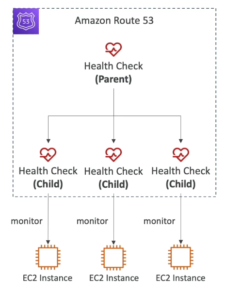
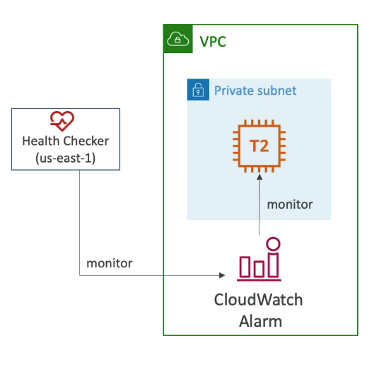
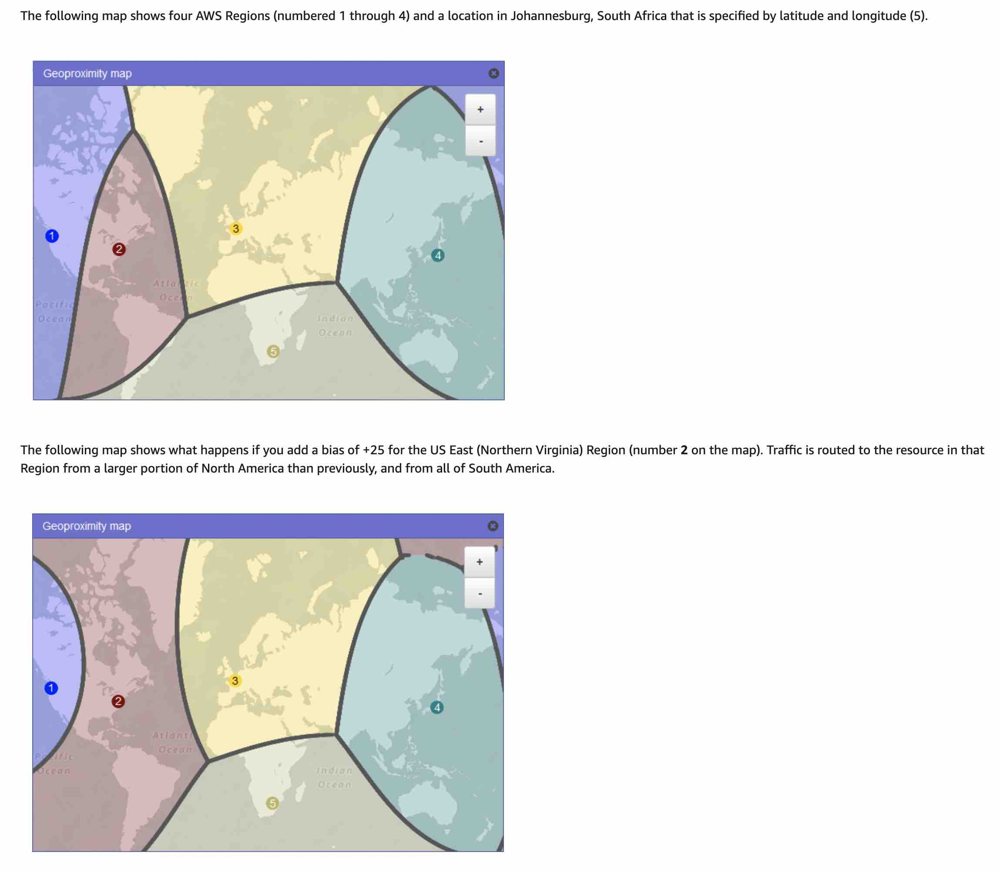

# Table of Contents

- [Table of Contents](#table-of-contents)
- [DNS](#dns)
  - [What is a DNS?](#what-is-a-dns)
  - [Domain Registrar vs DNS Service](#domain-registrar-vs-dns-service)
  - [DNS Terminologies](#dns-terminologies)
  - [How Does DNS Route Traffic To Your Web Application?](#how-does-dns-route-traffic-to-your-web-application)
- [Route 53: Overview](#route-53-overview)
- [Route 53: Records](#route-53-records)
  - [Route 53 Records: Overview](#route-53-records-overview)
  - [Route 53 Records: Record Types](#route-53-records-record-types)
- [Route 53: Hosted Zones](#route-53-hosted-zones)
  - [Hosted Zones: Overview](#hosted-zones-overview)
  - [Hosted Zones: Private Hosted Zones](#hosted-zones-private-hosted-zones)
- [Route 53: CNAME vs Alias](#route-53-cname-vs-alias)
- [Route 53: Health Checks](#route-53-health-checks)
  - [Health Checks: Overview](#health-checks-overview)
  - [Health Checks: Endpoint](#health-checks-endpoint)
  - [Health Checks: Calculated Health Checks](#health-checks-calculated-health-checks)
  - [Health Checks: CloudWatch Alarms (for Private Hosted Zones)](#health-checks-cloudwatch-alarms-for-private-hosted-zones)
- [Route 53: Routing Policy](#route-53-routing-policy)
  - [Types of Routing Policies](#types-of-routing-policies)
  - [Routing Policy: Simple Routing](#routing-policy-simple-routing)
  - [Routing Policy: Weighted](#routing-policy-weighted)
  - [Routing Policy: Latency based](#routing-policy-latency-based)
  - [Routing Policy: Failover (Active-Passive)](#routing-policy-failover-active-passive)
  - [Routing Policies: Geolocation](#routing-policies-geolocation)
  - [Routing Policies: Geoproximity](#routing-policies-geoproximity)
  - [Routing Policies: Multi-Value](#routing-policies-multi-value)
- [Route 53: Traffic Flow](#route-53-traffic-flow)
  - [Traffic Flow: Overview](#traffic-flow-overview)
  - [Traffic Flow: Create a Traffic Policy](#traffic-flow-create-a-traffic-policy)
- [Route 53: Amazon Route 53 Resolver](#route-53-amazon-route-53-resolver)
- [References](#references)

---

# DNS

## [What is a DNS?](https://aws.amazon.com/route53/what-is-dns/)

- DNS is a Domain Name System which translates the human readable domain names into the machine readable IP addresses. E.g. www.google.com => 172.217.18.36
- DNS is the backbone of the internet
- DNS uses hierarchal naming structure
  - .com
  - example.com
  - www.example.com
  - api.example.com

---

## Domain Registrar vs DNS Service

- You buy or register your domain name with a Domain Registrar typically by paying annual charges. (e.g. GoDaddy, Google Domains, Namecheap, Amazon Regisrar Inc...)
- The Domain Registrar usually provides you with a DNS service to manage your DNS records but you can use another DNS service to manage your DNS records.
- E.g. you can buy your domains from GoDaddy Domain Registrar and use Amazon Route 53 to manage the DNS records
- We can do so by:
  - Creating a Public Hosted Zone in Amazon Route 53
  - **Replacing the GoDaddy (or similar Domain Registrar) nameservers with the Route 53 Public Hosted Zone's nameservers.**

---

## DNS Terminologies

- **Domain Registrar**: Where you are going to register your domain names. Amazon Route 53, GoDaddy
- **DNS Records**: `A`, `AAAA`, `CNAME`, `NS`, `MX`, `SPF`, `TXT`, etc
- **Zone File**: Contains all DNS Records - matching hostnames to IPs or addresses
- **Nameserver**: A server that resolves the DNS queries (Authoritative or Non-Authoritative)
- **Top Level Domain (TLD)**: `.com`, `.org`, `.gov`, etc.
- **Second Level Domain (SLD)**: `amazon.com`, `google.com` etc.

All together we have the FQDN (Fully Qualified Domain Name)

---

## How Does DNS Route Traffic To Your Web Application?

[!How DNS Routes traffic to the Web Application](https://d1.awsstatic.com/Route53/how-route-53-routes-traffic.8d313c7da075c3c7303aaef32e89b5d0b7885e7c.png)

1. A user opens a web browser, enters **www.example.com** in the address bar, and presses Enter.

2. The request for **www.example.com** is routed to a DNS resolver, which is typically managed by the user's Internet service provider (ISP), such as a cable Internet provider, a DSL broadband provider, or a corporate network.

3. The DNS resolver for the ISP forwards the request for **www.example.com** to a DNS root name server.

4. The DNS resolver for the ISP forwards the request for **www.example.com** again, this time to one of the TLD name servers for .com domains. The name server for .com domains responds to the request with the names of the four Amazon Route 53 name servers that are associated with the example.com domain.

5. The DNS resolver for the ISP chooses an Amazon Route 53 name server and forwards the request for **www.example.com** to that name server.

6. The Amazon Route 53 name server looks in the example.com hosted zone for the **www.example.com** record, gets the associated value, such as the IP address for a web server, 192.0.2.44, and returns the IP address to the DNS resolver.

7. The DNS resolver for the ISP finally has the IP address that the user needs. The resolver returns that value to the web browser. The DNS resolver also caches (stores) the IP address for example.com for an amount of time that you specify so that it can respond more quickly the next time someone browses to **example.com**. For more information, see time to live (TTL).

8. The web browser sends a request for **www.example.com** to the IP address that it got from the DNS resolver. This is where your content is, for example, a web server running on an Amazon EC2 instance or an Amazon S3 bucket that's configured as a website endpoint.

9. The web server or other resource at 192.0.2.44 returns the web page for **www.example.com** to the web browser, and the web browser displays the page.

---

# Route 53: Overview

**Amazon Route 53** is a highly available and scalable Domain Name System (DNS) web service. Route 53 connects user requests to internet applications running on AWS or on-premises.

- Highly available, scalable, fully-managed, Authoritative DNS
- Route 53 is also a Domain Registrar
- Ability to check the health of your resources
- The only AWS service which will provide 100% availability SLA
- Why is it named Route 53? 53 is a reference to the traditional DNS port used by DNS services

---

# Route 53: Records

## Route 53 Records: Overview

- How you want to route traffic for a domain
- Each record contains:
  - **Domain/subdomain name**: e.g. `example.com`
  - **Record type**: e.g. `A`, `AAAA` or `CNAME`
  - **Value**: e.g. 12.16.1.1
  - **Routing policy**: How Route 53 will respond to queries
  - **TTL** - Amount of time the record is cached at DNS Resolvers

**Records supported by Route 53**: `A`, `AAAA`, `CNAME`, `NS`, `CAA`, `DS`, `MX`, `NAPTR`, `PTR`, `SOA`, `TXT`, `SPF`, `SRV`

---

## Route 53 Records: Record Types

- **`A`**: Maps a domain name to an IPv4 address.

- **`AAAA`**: Maps a domain name to an IPv6 address.

- **`CNAME`**: Stands for Canonical Name. Maps a domain name to another domain name.

  - The target domain name must have an **`A`** or **`AAAA`** record.
  - Can't create a **`CNAME`** record for the top node of a DNS namespace (**Zone Apex**). E.g. You cannot create a **`CNAME`** record for `example.com` but you can create for `www.example.com`

- **`NS`**: Name server (NS) records determine which servers in the hosted zone will communicate DNS information for a domain.

- **`MX`**: A Mail Exchanger (MX) record specifies the mail server responsible for accepting email messages on behalf of a domain name. It is possible to configure several MX records, typically pointing to an array of mail servers for load balancing and redundancy.

- **`SOA`**: A Start of Authority record contains administrative information about the zone, especially regarding zone transfers.

- **`SRV`**: A Service record is a specification of data in the Domain Name System defining the location, i.e., the hostname and port number, of servers for specified services. Generalized service location record, used for newer protocols instead of creating protocol-specific records such as **`MX`**

- **`TXT`**: A Text record is a type of resource record in the Domain name system used to provide the ability to associate arbitrary text with a host or other name, such as human readable information about a server, network, data center, or other accounting information.

- **`SPF`**: A sender policy framework (SPF) record is a type of DNS TXT record that lists all the servers authorized to send emails from a particular domain.

- **`PTR`**: A Pointer (PTR) record resolves an IP address to a fully-qualified domain name (FQDN) as an opposite to what A record does. PTR records are also called Reverse DNS records.

---

# Route 53: Hosted Zones

## Hosted Zones: Overview

A Hosted Zone is a container for records that define how to route traffic to a domain and its subdomains.

- **Public Hosted Zones**: Contains records that specify how to route traffic on the Internet (public domain names) - `application1.mypublicdomainname.com`
- **Private Hosted Zones**: Contains records that specify how you route traffic within one or more VPCs (private domain names) - `application1.company.internal`

**Cost**: $0.50 per month per Hosted Zone

---

## [Hosted Zones: Private Hosted Zones](https://docs.aws.amazon.com/Route53/latest/DeveloperGuide/hosted-zones-private.html)

A private hosted zone is a container that holds information about how you want Amazon Route 53 to respond to DNS queries for a domain and its subdomains within one or more VPCs that you create with the Amazon VPC service.

- **Workflow**:

  1. For each VPC that you want to associate with the Route 53 hosted zone, change the following VPC settings to true:

     - `enableDnsHostnames`
     - `enableDnsSupport`

  2. You create a private hosted zone, such as `example.com`, and specify each of the VPCs that you want to associate with the hosted zone. After you create the hosted zone you can associate more VPCs with it.

- When you create a private hosted zone, the following name servers are used:

  - `ns-0.awsdns-00.com`
  - `ns-512.awsdns-00.net`
  - `ns-1024.awsdns-00.org`
  - `ns-1536.awsdns-00.co.uk`

- **To associate an Amazon VPC and a private hosted zone that you created with different AWS accounts**:

  1. Using the account that created the hosted zone, authorize the association of the VPC with the private hosted zone by using one of the following methods::

     - **Using AWS CLI**: Use `create-vpc-association-authorization` command.
     - **Using AWS Route 53 API**: Use the `CreateVPCAssociationAuthorization` API.

     - If you want to associate multiple VPCs that you created with one account with a hosted zone that you created with a different account, you must submit one authorization request for each VPC.

     - When you authorize the association, you must specify the hosted zone ID, so the private hosted zone must already exist.

     - You can't use the Route 53 console either to authorize the association of a VPC with a private hosted zone or to make the association.

  2. **Using the account that created the VPC, associate the VPC with the hosted zone**:

     - As with authorizing the association, you can use the AWS SDK, Tools for Windows PowerShell, the AWS CLI, or the Route 53 API.
       - If you're using the API, use the `AssociateVPCWithHostedZone` action.

  3. **_Recommendedation_**: Delete the authorization to associate the VPC with the hosted zone. Deleting the authorization does not affect the association, it just prevents you from reassociating the VPC with the hosted zone in the future. If you want to reassociate the VPC with the hosted zone, you'll need to repeat steps 1 and 2 of this procedure.

---

# Route 53: CNAME vs Alias

AWS Resources (Load Balancer, CloudFront) often expose a DNS name. We may want to map that DNS hostname to a domain we own. For e.g. We may want to map `lb-1-1234.ap-south-1.elb.amazonaws.com` to `app.mydomain.com`.

We have two options to do this:

1. **Use a CNAME record**:

   - Point a domain name to another domain name (`app.mydomain.com` => `blabla.anything.com`).
   - Only works when you have a **non-root domain** (`something.mydomain.com` or `www.mydomain.com` but not `domain.com`)

2. **Alias record**:

   - Extension to DNS functionality, specific to Amazon Route 53.
   - Alias record CANNOT be used to map one domain name to another.
   - Points a domain name to an AWS resource (`app.mydomain.com` => `blabla.amazonaws.com`).
   - Works for both Root domains (Zone Apex) and Non-root domains (`mydomain.com`).
   - Automatically recognizes changes in the resource's (e.g. `ALB`) IP addresses
   - Native health check
   - Alias record is always of type `A` or `AAAA`
   - You can't set the TTL, it is automatically set by Route 53
   - Free of charge

   - **Targets**:

     - **`Elastic Load Balancers`**
     - **`CloudFront Distributors`**
     - **`Amazon API Gateway`**
     - **`Elastic Beanstalk Environments`**
     - **`S3 Websites`** (not buckets)
     - **`VPC Interface Endpoints`**
     - **`Global Accelerator Accelerator`**
     - **`Route 53 record in the same hosted zone`**

- **NOT Targets**:

  - **`EC2 DNS Name`**
  - **`S3 Buckets`**

---

# Route 53: Health Checks

## Health Checks: Overview

- HTTP Health Checks are mainly for **public resources** (although there is a way for us to use for private resources)

- Health Check => Automated DNS Failover:

  1. **Health Checks that monitor endpoints (application, server, other AWS resource)**:

  - Health Checks that monitor other Health checks (Calculated Health Checks)
  - Health Checks that monitor CloudWatch Alarms (full control) - e.g. throttles of DynamoDB, alarms on RDS, custom metrics. Helpful for **private resources**

- Route 53 Health Checks have their own metrics and are integrated with CloudWatch metrics

---

## [Health Checks: Endpoint](https://docs.aws.amazon.com/Route53/latest/DeveloperGuide/dns-failover-determining-health-of-endpoints.html#dns-failover-determining-health-of-endpoints-monitor-endpoint)

- About 15 global Health Checkers will check the endpoint health
- Each health checker evaluates the health of the endpoint based on two values:

  - **Response time**: A resource can be slow to respond or can fail to respond to a health check request for a variety of reasons. For example, the resource is shut down for maintenance, it's under a distributed denial of service (DDoS) attack, or the network is down.

  - **Failure Threshold**: Whether the endpoint responds to a number of consecutive health checks that you specify.

  - Healthy/Unhealthy: `3` (default)
  - Interval: `30` secs (can set to `10` sec - higher cost)
  - Supported Protocol: `HTTP`, `HTTPS`, `TCP`
  - If `> 18%` of health checkers report that the endpoint is healthy, Route 53 considers it `Healthy`, otherwise it is `Unhealthy`
  - Ability to choose which locations you want Route 53 to use for Health Checks

- Health Checks pass only when the endpoint responds with the `2xx` or `3xx` status codes.
- Health Checks can be setup to pass / fail based on some specific text in the first **5120 bytes** of the response
- Configure your router/firewall to allow incoming requests from [Route 53 Health Checkers IP Address Range](https://ip-ranges.amazonaws.com/ip-ranges.json)

---

## Health Checks: Calculated Health Checks

- Combine the results of multiple Health Checks into a single Health Check
- You can use **OR**, **AND** or **NOT** conditions
- Can monitor upto 255 Child Health Checks
- Can specify how many health checks need to pass to make the parent pass as healthy
- Use Case:
  - Perform maintenance to your website without causing all health checks to fail

---

## Health Checks: CloudWatch Alarms (for Private Hosted Zones)

- Route 53 Health checkers are outside the VPC and cannot access the private endpoints (private VPC or on-premise resource)
- To make Health Checks work for Private Hosted Zones, we need to create a **CloudWatch Metric** and associate a **CloudWatch Alarm**, then create a Health Check that checks the alarm itself.

---

# Route 53: Routing Policy

A Routing Policy defines how Route 53 responds to DNS queries. The DNS does not route the traffic like a Load Balancer does, it only responds to the DNS queries to let the clients know which way they should be doing these queries. The DNS just helps translate domain names into actual endpoints for the end user.

## Types of Routing Policies

- Simple
- Weighted
- Failover
- Latency based
- Geolocation
- Multi-Value Answer
- Geoproximity (using Route 53 Traffic Flow feature)

---

## Routing Policy: Simple Routing

Simple routing lets you configure standard DNS records, with no special Route 53 routing such as weighted or latency. With simple routing, you typically route traffic to a single resource, for example, to a web server for your website.

- Typically route traffic to a single resource
- Can specify multiple values in the same record
- If multiple values are returned, a random one will be chosen by the client
- When Alias is enabled, specify only one AWS resource
- Cannot associate with Health Checks

---

## Routing Policy: Weighted

- Control % of the requests that go to each specific resource
- Assign each record a relative weight
  - **`Traffic (%) = Weight of a specific record / Sum of the all the weights of all the records`**
  - Weights don't need to sum up to 100
- DNS records **MUST** have the same name and type to use the weighted routing policy (i.e. 3 x `A` record for `weighted.example.com`)
- Can be associated with Health Checks
- Use Cases:
  - Load balancing between regions
  - Testing new application versions
- Assign a weight of 0 to stop sending traffic to a resource
- If all the records have a weight of 0, then all records will be returned with equal traffic distribution

---

## Routing Policy: Latency based

- Redirect to the resource that has the least latency to the client
- Super helpful when latency for users is a priority
- Latency is measured based on how quick it is for users to connect to the closest, identified AWS Region for that record
- Can be combined with Health Checks (has a failover capability)

---

## Routing Policy: Failover (Active-Passive)

- There is a primary record and at least one secondary. In case the `Primary` record fails health check, a random record among the `Secondary` records is returned
- Health check is mandatory for Primary record and optional for secondary records
- The domain name has to be the same.

---

## Routing Policies: Geolocation

- Different from Latency-based
- The routing is based on user location
- Specify location by Continent, Country or by US State (if there's an overlapping, the most precise location is selected)
- Should create a **`Default`** record (in case there is no match on location)
- Use Cases:
  - Website Localization
  - Restrict content distribution
  - Load balancing
- Can be associated with Health Checks (optional)

---

## Routing Policies: Geoproximity

- Route traffic to your resources based on the geographic location of users and resources
- Ability to shift more traffic to resources based on the defined **`bias`**
- To change the size of a geographic region, specify bias values:

  - To expand (1 to 99) - more traffic to the resource
  - To shrink (-1 to -99) - less traffic to the resource

- Resources can be:

  - **AWS Resources** (specify AWS region)
  - **Non-AWS Resources, e.g. on Premise Data Center** (specify Latitude and Longitude)

- You must use the advanced **Route 53 Traffic Flow** to be able to leverage the bias
- Use Case:
  - Say we have resources all around the world and need to shift more traffic to a specific region. We would then use a Geoproximity Routing Policy to increase the bias in the specific region and have more users have traffic attracted to that region

---

## Routing Policies: Multi-Value

- Use when routing traffic to multiple resources
- Route 53 return multiple values/resources
- Can be associated with Health Checks (return only values for healthy resources)
- Upto 8 healthy records are going to be returned for each Multi-Value query
- Multi-Value is not a substitute for having an ELB because this is client-side load balancing, the DNS only sends the information, it is loaded from the client side. On the other hand ELB is serverside load balancing, the client only hits one endpoint, the load balancing is done on the serverside.

---

# Route 53: Traffic Flow

## Traffic Flow: Overview

- Simplify the process of creating and maintaining records in large and complex configurations.
- Visual editor to manage complex routing decision trees

- Configurations can be saved as **Traffic Flow Policy**

  - Can be applied to different Route 53 Hosted Zones (different domain names)
  - Supports versioning
  - Costs a fixed amount per month. ($50 per month)

---

## Traffic Flow: Create a Traffic Policy

- Go to **[Traffic Policies on Route 53 Console](https://us-east-1.console.aws.amazon.com/route53/trafficflow/home#/)** and click **`Create traffic policy`**
- Enter the following:
  - **Policy name**: `geopolicy-test`
  - **Version**: `1`
  - **Version description** (optional):

---

# Route 53: Amazon Route 53 Resolver

- Amazon Route 53 Resolver responds recursively to DNS queries from AWS resources for:

  - **Public records** (Route 53 Resolver performs recursive lookups against public name servers on the internet),
  - **Amazon VPC-specific DNS names** (for example, `ec2-192-0-2-44.compute-1.amazonaws.com`), and
  - **Amazon Route 53 private hosted zones** (for example, `acme.example.com`), and is available by default in all VPCs.

- **Amazon Route 53 Resolver** were previously called Amazon DNS servers, but were renamed when Resolver rules, and inbound and outbound endpoints were introduced.

- **Resolver Endpoints and Resolver Rules**: If you have workloads that leverage both VPCs and on-premises resources, you also need to resolve DNS records hosted on-premises. Similarly, these on-premises resources may need to resolve names hosted on AWS. Through **Resolver endpoints** and **conditional forwarding rules**, you can resolve DNS queries between your on-premises resources and VPCs to create a hybrid cloud setup over VPN or Direct Connect (DX). Specifically:

  - **Inbound Resolver endpoints** allow DNS queries to your VPC from your on-premises network or another VPC.
  - **Outbound Resolver endpoints** allow DNS queries from your VPC to your on-premises network or another VPC.
  - **Resolver rules** enable you to create one forwarding rule for each domain name and specify the name of the domain for which you want to forward DNS queries from your VPC to an on-premises DNS resolver and from your on-premises to your VPC. Rules are applied directly to your VPC and can be shared across multiple accounts.

---

# References

- [What is a DNS?](https://aws.amazon.com/route53/what-is-dns/)
- [Route 53 Health Checkers IP Address Range](https://ip-ranges.amazonaws.com/ip-ranges.json)

---
