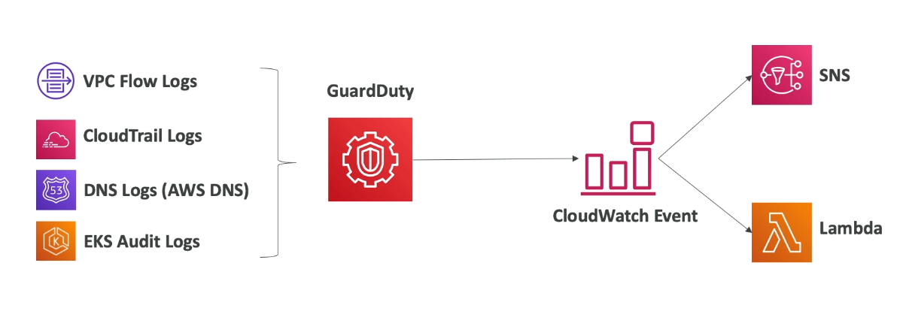

# Table of Contents

- [Table of Contents](#table-of-contents)
- [Encryption 101](#encryption-101)
  - [Encryption-in-Flight (SSL)](#encryption-in-flight-ssl)
  - [Server-side Encryption at Rest (SSE-R)](#server-side-encryption-at-rest-sse-r)
  - [Client-side Encryption](#client-side-encryption)
- [AWS Key Management Service (KMS)](#aws-key-management-service-kms)
  - [KMS: Overview](#kms-overview)
  - [KMS: Key Types](#kms-key-types)
  - [AWS KMS: Multi-Region Keys](#aws-kms-multi-region-keys)
- [Copying EBS Snapshots across Regions](#copying-ebs-snapshots-across-regions)
- [KMS Key Policies](#kms-key-policies)
- [How does KMS work?](#how-does-kms-work)
  - [Encrypt and Decrypt API](#encrypt-and-decrypt-api)
  - [Envelope API](#envelope-api)
- [Encryption SDK](#encryption-sdk)
- [KMS: Request Quotas](#kms-request-quotas)
- [S3 Security: Advanced](#s3-security-advanced)
  - [S3 Security: Overview](#s3-security-overview)
  - [SSE-KMS: Deep Dive](#sse-kms-deep-dive)
- [S3 Bucket Policies](#s3-bucket-policies)
  - [Force SSL](#force-ssl)
  - [Force Encryption using SSE-KMS](#force-encryption-using-sse-kms)
  - [S3 Bucket Key for SSE-KMS Encryption](#s3-bucket-key-for-sse-kms-encryption)
- [SSM Parameter Store](#ssm-parameter-store)
  - [SSM Parameter Store: Overview](#ssm-parameter-store-overview)
  - [SSM Parameter Store Hierarchy](#ssm-parameter-store-hierarchy)
  - [Standard and Advanced Parameter Tiers](#standard-and-advanced-parameter-tiers)
  - [SSM Parameter Store: Parameter Policies](#ssm-parameter-store-parameter-policies)
- [AWS Secrets Manager](#aws-secrets-manager)
- [SSM Parameter Store vs AWS Secrets Manager](#ssm-parameter-store-vs-aws-secrets-manager)
- [CloudWatch Logs: Encryption](#cloudwatch-logs-encryption)
- [CodeBuild Security](#codebuild-security)
- [AWS WAF: Web Application Firewall](#aws-waf-web-application-firewall)
  - [AWS WAF: Overview](#aws-waf-overview)
  - [WAF with Application Load Balancer to Block Access from Countries / Allow Access from Countries](#waf-with-application-load-balancer-to-block-access-from-countries--allow-access-from-countries)
  - [AWS WAF: Fixed IP while using WAF with a Load Balancer](#aws-waf-fixed-ip-while-using-waf-with-a-load-balancer)
- [AWS Shield](#aws-shield)
- [AWS Firewall Manager](#aws-firewall-manager)
- [WAF vs Firewall Manager vs Shield](#waf-vs-firewall-manager-vs-shield)
- [Amazon GuardDuty](#amazon-guardduty)
  - [Amazon GuardDuty: Overview](#amazon-guardduty-overview)
  - [Amazon GuardDuty: S3 Protection](#amazon-guardduty-s3-protection)
  - [Amazon GuardDuty: Suspending and Disabling](#amazon-guardduty-suspending-and-disabling)
- [Amazon Inspector](#amazon-inspector)
- [Amazon Macie](#amazon-macie)
- [Using the CLI](#using-the-cli)
  - [`kms`](#kms)
    - [`encrypt`](#encrypt)
  - [`ssm`](#ssm)
  - [`put-paramter`](#put-paramter)
    - [`get-parameters`](#get-parameters)
    - [`get-parameters-by-path`](#get-parameters-by-path)
  - [`guardduty`](#guardduty)
    - [`update-detector`](#update-detector)
- [References](#references)

---

# Encryption 101

## Encryption-in-Flight (SSL)

- Data is encrypted before sending by the client and decrypted after receiving by the server
- SSL certificates help with encryption (HTTPS)
- A SSL handshake happens between the client and server, therefore only the server can decrypt the encryption done by the client.
- Encryption in flight ensures there is no "Man-in-the-middle" (MITM) attack

---

## Server-side Encryption at Rest (SSE-R)


- Data is encrypted after being received by the server
- Server is going to store the data on its disk in an encrypted form.
- The encryption is done by a key (usually a data key).
- The encryption / decryption keys must be managed somewhere (Key Management Service) and the server must have access to it.
- SSE-R protects against server hijacks, so the data cannot be decrypted even if the server is hijacked.
- When a client makes a GET request, Data will be decrypted by server before being sent.

---

## Client-side Encryption


- Data is encrypted by the client and never decrypted by the server.
- Thus data will be stored by the server without the server ever seeing the original data.
- The server also does not have the capability to decrypt the data and should never have the ability.
- Data will be decrypted by a receiving client
- Could leverage Envelope Encryption

---

# AWS Key Management Service (KMS)

## KMS: Overview

- Anytime you hear encryption for an AWS Service, it's most likely KMS encryption.
- AWS manages the encryption keys for us.
- Fully integrated with IAM for authorization.
- Easy way to control access to your data.
- Able to audit KMS key usage using CloudTrail.
- Seamlessly integrated into most AWS services (EBS, S3, RDS, SSM etc.)
- KMS Key Encryption is also available through API calls (SDK, CLI)

> **Important:** Never ever store your secrets in plaintext, especially in your code!

---

## KMS: Key Types

> **Note:** **KMS Keys** is the new name of KMS Customer Master Key

- We have two types of keys in general:

  1. **Symmetric (AES-256 Keys)**

     - Single encryption key used to Encrypt and Decrypt data
     - AWS services that are integrated with KMS use Symmetric CMKs
     - We never get access to the KMS Key in unencrypted form itself. You can make KMS API calls to leverage and use the key.

  2. **Asymmetric (RSA & ECC key pairs)**

     - Public key (Used to encrypt) and Private key (Used to decrypt) pair
     - Used for Encrypt/Decrypt, or Sign/Verify operations
     - The public key is downloadable but you cannot access the Private Key unencrypted. You can make KMS API calls to leverage and use the private key.
     - Use case: When you want encryption to be done outside of AWS by users who cannot call the KMS API.

- Three types of KMS Keys:

  1. AWS Managed Key: **Free** (Alias: `aws/service-name`, e.g. `aws/rds`, `aws/sns`)
  2. Customer Managed Keys (CMK) created in KMS: **$1 / month**
  3. Customer Managed Keys Imported (must be 256-bit symmetric key): **$1 / month**

- Pay for API call to KMS (**$0.03 / 10000 calls**)

- **Automatic key rotation**:

  - AWS-managed KMS Key: Automatic every 1 year
  - Customer-Managed KMS Key: Must be enabled; Automatic every 1 year after enabling
  - Customer-Managed Key (Imported): Only manual rotation possible using alias

---

## [AWS KMS: Multi-Region Keys](https://docs.aws.amazon.com/kms/latest/developerguide/multi-region-keys-overview.html)

- AWS KMS supports **Multi-Region** keys, which are AWS KMS keys in different AWS Regions that can be used interchangeably, as though you had the same key in multiple Regions.
- Each set of related multi-Region keys has the same key material and key ID, so you can encrypt data in one AWS Region and decrypt it in a different AWS Region without re-encrypting or making a cross-Region call to AWS KMS.

---

# Copying EBS Snapshots across Regions

KMS Keys are scoped per region.


- If the EBS volume in `ap-south-1` is Encrypted with KMS Key A then the snapshot is also encrypted with KMS Key A.
- To copy the Snapshot to `ap-southeast-1`, we need to re-encrypt the snapshot with a different KMS Key B as the same KMS Key cannot live in two Regions.
- Using the copied Snapshot, we create a new EBS volume in `ap-southeast-1` with encryption by KMS Key B.

---

# KMS Key Policies

- Control Access to KMS Keys.
- Similar to S3 Buckets with a difference that you cannot control access without them.

- There are two types of KMS Key Policies:

  - **Default KMS Key Policy**:

    - Created if you don't provide a custom KMS Key Policy
    - Complete access to the key to the root user = entire AWS account

  - **Custom KMS Key Policy**:

    - Define users, roles that can access the KMS Key
    - Define who can administer the key
    - Useful for Cross-Account access of your KMS Key

- **Use Case:**

  - Copying encrypted EBS snapshots across accounts:

    1. Create snapshot encrypted with your own KMS Key (Customer-managed KMS Key).
    2. Attach a KMS Key Policy to authorize cross-account access.

       ```json
       {
         "Sid": "CrossAccountKeyPolicy",
         "Effect": "Allow",
         "Principal": {
           "AWS": "arn:aws:iam::TARGET_ACCOUNT_ID:role/RoleName"
         },
         "Action": ["kms:Decrypt", "kms:CreateGrant"],
         "Condition": {
           "StringEquals": {
             "kms:ViaService": "ec2.REGION.amazonaws.com",
             "kms:CalledAccount": "TARGET_ACCOUNT_ID"
           }
         }
       }
       ```

    3. Share the encrypted snapshot.
    4. In the Target Account, create a copy of the snapshot, encrypt it with a CMK in your account.
    5. Create a volume from the snapshot.

---

# How does KMS work?

## Encrypt and Decrypt API


- We are restricted to the size of the file at `4KB` for encryption and decryption using the **`Encrypt`** and **`Decrypt`** API

---

## Envelope API

- **`GenerateDataKey`** API

---

# Encryption SDK

---

# KMS: Request Quotas

Quotas:

- The shared quotas vary with the AWS Region and the type of CMK used in the request. Each quota is calculated separately.

- [Check details on Request Quotas](https://docs.aws.amazon.com/kms/latest/developerguide/requests-per-second.html)

- When you exceed a request quota you will get a **`ThrottlingException`**:

  ```s
  You have exceeded the rate at which you may call KMS. Reduce the frequency of your calls.
  (Service AWS KMS; Status Code: 400; Error Code: ThrottlingException; Request IDL <ID>)
  ```

- For cryptographic operations, they share a common quota.
- This includes requests made by AWS on your behalf (ex: SSE-KMS)

- **Solutions:**

  - To respond, use exponential backoff (backoff and retry at expontial intervals)
  - When using the **`GenerateDataKey`** API, consider using the DEK caching from the Encryption SDK
  - You can request a Request Quota Increase through API or AWS support

---

# S3 Security: Advanced

## S3 Security: Overview

Check the Security section for more details on KMS Encryption

There are 4 methods of encrypting objects in S3

1. SSE-S3: Encrypts S3 Objects using keys handled and managed by AWS S3
2. SSE-KMS: Leverage AWS Key Management Service to manage encryption keys
3. SSE-C: When you want to manage your own encryption keys
4. Client-side encryption

---

## SSE-KMS: Deep Dive

- SSE-KMS Leverages the **`GenerateDataKey`** and **`Decrypt`** KMS API calls
- These KMS API calls will show up in CloudTrail, helpful for logging

- Pre-requisites to perform SSE-KMS:

  - A KMS Key policy that authorizes the user / role to use that key
  - An IAM Policy that authorizes access to KMS otherwise we will get an Access denied error

- S3 calls to KMS for SSE-KMS count against your KMS limits
  - If throttling try exponential backoff
  - If throttling is increasing, you can increase in an increase in API limits with AWS support

---

# S3 Bucket Policies

## Force SSL

- To force SSL, create a S3 bucket policy with a DENY on the condition `"aws:SecureTransport":"false"`
- **Note**: Using an Allow on `"aws:SecureTransport": "true"` would allow anonymous GetObject if using SSL.
- [Read more on the Documentation page](https://aws.amazon.com/premiumsupport/knowledge-center/s3-bucket-policy-for-config-rule)

```json
{
  "Id": "ForceSSLPolicy",
  "Version": "2010-10-17",
  "Statement": [
    {
      "Sid": "AllowS3RequestsOnlyOverSSL",
      "Effect": "Deny",
      "Principal": "*",
      "Action": "s3:*",
      "Resource": [
        "arn:aws:s3:::awsexamplebucket",
        "arn:aws:s3:::awsexamplebucket/*"
      ],
      "Condition": {
        "Bool": {
          "aws:SecureTransport": "false"
        }
      }
    }
  ]
}
```

---

## Force Encryption using SSE-KMS

1. Deny Incorrect encryption header: Make sure if the `s3:x-amz-server-side-encryption` header is equal to `aws:kms`.
2. Deny if the `s3:x-amz-server-side-encryption` header is not present so that no unencrypted files are uploaded.

> Note: We could swap **`2`** for S3 bucket Default encryption of SSE-KMS.

```json
{
  "Id": "EncryptS3ObjectsAtRest",
  "Version": "2010-10-17",
  "Statement": [
    {
      "Sid": "DenyIncorrectEncryptionHeader",
      "Effect": "Deny",
      "Principal": "*",
      "Action": "s3:PutObject",
      "Resource": "arn:aws:s3:::<bucket-name>/*",
      "Condition": {
        "StringNotEquals": {
          "s3:x-amz-server-side-encryption": "aws:kms"
        }
      }
    },
    {
      "Sid": "DenyIncorrectEncryptionUpload",
      "Effect": "Deny",
      "Principal": "*",
      "Action": "s3:PutObject",
      "Resource": "arn:aws:s3:::<bucket-name>/*",
      "Condition": {
        "Null": {
          "s3:x-amz-server-side-encryption": true
        }
      }
    }
  ]
}
```

---

## S3 Bucket Key for SSE-KMS Encryption

- S3 Bucket key is a new setting to decrease:

  - Number of API calls made to KMS from S3 by 99%
  - Costs of overall KMS encryption with Amazon S3 by 99%

- Leverages Data Keys:

  - A S3 Bucket key is generated
  - A Customer Master Key (CMK) in KMS is going to be used to generate a data key for the Amazon S3 bucket called a S3 bucket key.
  - Once in a while, this key will rotate
  - This key is what that will be used to encrypt objects in S3 buckets with KMS encryption by generating new data keys
  - By using the S3 bucket key and not using KMS, we are reducing the number of API calls made to KMS.
  - Cost reduction without compromising security
  - Less KMS CloudTrail events in CloudTrail

---

# SSM Parameter Store

## SSM Parameter Store: Overview

**AWS Systems Manager (SSM) Parameter Store** is a centralized storage where you can store and manage your secrets and configuration data such as passwords, database strings, and license codes. You can encrypt values, or store as plain text, and secure access at every level.

- Secure Storage for configurations and secrets
- Optional Seamless encryption using KMS
- Serverless, scalable, durable, easy SDK
- **Version tracking** of configurations / secrets: Each time you edit the value of a parameter, SSM Parameter Store creates a new version of the parameter and retains the previous versions. You can view the details, including the values, of all versions in a parameter's history.
- Security through IAM
- Notifications with Amazon Eventbridge (in certain cases)
- Integration with CloudFormation (CloudFormation can leverage input parameters from SSM Parameter Store)

---

## SSM Parameter Store Hierarchy

-
- `/aws/reference/secretsmanager/secret_ID_in_Secrets_Manager`
- `/aws/service/ami-amazon-linux-latest/amzn2-ami-hvm-x86_64-gp2` (public)

---

## Standard and Advanced Parameter Tiers

|                                                         | Standard   | Advanced                   |
| ------------------------------------------------------- | ---------- | -------------------------- |
| Total number of parameters (per AWS account and region) | `10,000`   | `100,000`                  |
| Maximum size of a Parameter value                       | `4 KB`     | `8 KB`                     |
| Parameter policies available                            | No         | Yes                        |
| Cost                                                    | No charges | Charges apply              |
| Storage Pricing                                         | Free       | $0.05/adv. parameter/month |

---

## SSM Parameter Store: Parameter Policies

- Available only for advanced parameters
- Allow to sign a TTL to a parameter (expiration date) to force updating or deleting sensitive datasuch as passwords
- Can assign multiple policies at a time

---

# AWS Secrets Manager

- Newer service, meant for storing secrets
- Capability to force the rotation of secrets every X days
- Automate generation of secrets on rotation (uses AWS Lambda) - every `30` / `60` / `90` / `Custom` days. Maximum being `365` days.
- Integration with RDS (MySQL, PostgreSQL, Aurora)
- Secrets are encrypted using KMS
- Pricing:
  - `$0.40` / secret / month
  - `$0.05` per 10,000 API calls
- Deleting a secret has a waiting period between `7` - `30` days

---

# SSM Parameter Store vs AWS Secrets Manager

<!-- prettier-ignore -->
| AWS Secrets Manager | SSM Parameter Store |
| ------------------- | ------------------- |
| Automatic rotation of secrets with Lambda | No native secret rotation (can enable rotation using Lambda function triggered by CloudWatch Events) |
| Lambda function is provided for RDS, Redshift, DocumentDB | Simple API |
| KMS encryption is mandatory | KMS encryption is optional |
| Can integrate with CloudFormation | Can integrate with CloudFormation | 
| More expensive (`$$$`) | Less expensive (`$`) |
| | Can pull a Secrets Manager secret using the SSM Parameter Store API |

---

# CloudWatch Logs: Encryption

- You can encrypt CloudWatch logs with KMS keys
- Encryption is enabled at the Log Group level by associating a CMK with a log group, either when you create the log group or after it exists
- You cannot associate a CMK with a log group using the CloudWatch Console. You must use the Logs API
  - `associate-kms-key`: If the log group already exists
  - `create-log-group`: If the log group doesn't exist

---

# CodeBuild Security

- To access resources in your VPC, make sure to specify a VPC configuration for your CodeBuild
- Secrets in Codebuild:
  - Do not store them in plaintext in environment variables
  - Environment variables can reference SSM Parameter Store parameters or Secrets Manager secrets

---

# AWS WAF: Web Application Firewall

## AWS WAF: Overview

- Define Web ACL (Web Access Control List) Rules:

  - **IP Set**: Up to 10,000 IP Addresses - Uses multiple rules for more IPs
  - HTTP headers, HTTP body, or URI strings Protects from common attack - SQL injection and Cross-Site Scripting (XSS)
  - Size constraints (e.g. upto 2 MB), geo-match (block countries)
  - Rate based rules (to count occurences of events) - for DDoS protection

- Web ACL are Regional except for CloudFront

- A **Rule Group** is a reusable set of rules that you can add to a Web ACL

- **Resource types that can be protected by AWS WAF**:

  - **`Amazon CloudFront Distribution`**
  - **`Amazon API Gateway REST API`**
  - **`Application Load Balancer`**
  - **`AWS AppSync GraphQL API`**
  - **`Amazon Cognito User Pools`**

---

## WAF with Application Load Balancer to Block Access from Countries / Allow Access from Countries

- You can use AWS WAF with your Application Load Balancer to allow or block requests based on the rules in a web access control list (web ACL).

- Geographic (Geo) Match Conditions in AWS WAF allows you to use AWS WAF to restrict application access based on the geographic location of your viewers.

  - With geo match conditions you can choose the countries from which AWS WAF should allow access.
  - Geo match conditions are important for many customers. For example, legal and licensing requirements restrict some customers from delivering their applications outside certain countries. These customers can configure a whitelist that allows only viewers in those countries. Other customers need to prevent the downloading of their encrypted software by users in certain countries. These customers can configure a blacklist so that end-users from those countries are blocked from downloading their software.

---

## AWS WAF: Fixed IP while using WAF with a Load Balancer

- WAF is a Level 7 Firewall and does not support Level 4 Network Load Balancer
- We can use Global Accelerator for Fixed IP and WAF on the ALB
- WebACL must be in the same AWS Region as ALB

---

# AWS Shield

- Protect from DDoS (Distributed Denial of Service) attacks

- **AWS Shield Standard**:

  - Free service that is activated for every AWS customer
  - Provides protection from attacks such as SYN/UDP Floods, Reflection attacks and other Layer 3/Layer 4 attacks

- **AWS Shield Advanced**:

  - Optional DDoS mitigation service ($3,000 per month per organization)
  - Protect against more sophisticated attack on Amazon EC2, Elastic Load Balancing (ELB), Amazon CloudFront, AWS Global Accelerator and Route 53
  - 24/7 access to AWS DDoS Response Team (DRP)
  - Protects against higher fees during usage spikes due to DDoS
  - Shield Advanced automatic application layer DDoS mitigation automatically creates, evaluates and deploys AWS WAF rules to mitigate Layer 7 attacks

---

# AWS Firewall Manager

- Manage rules in all accounts of an AWS Organization

- Security Policy: Common set of Security rules

  - **WAF rules** (Application Load Balancer, API Gateway, CloudFront)
  - **AWS Shield Advanced** (ALB, CLB, NLB, Elastic IP, CloudFront)
  - **Security Groups** (EC2, ALB and ENI resources in VPC)
  - **AWS Network Firewall** (VPC Level)
  - **Amazon Route 53 Resolver DNS Firewall**

- Rules are applied to new resources as they are created (good for compliance) across all and future accounts in your organization

---

# WAF vs Firewall Manager vs Shield

WAF, Shield and Firewall Manager are used together for comprehensive protection

- Define your Web ACL rules in WAF
- For granular protection of your resources, WAF alone is the correct choice
- If you want to use AWS WAF across accounts, accelerate WAF configuration, automate the protection of new resources, use Firewall Manager with AWS WAF
- Shield Advanced adds additional features on top of AWS WAF, such as dedicated support from the Shield Response Team (SRT) and advanced reporting
- If you're prone to frequent DDoS attacks, consider purchasing Shield Advanced

---

# Amazon GuardDuty

## Amazon GuardDuty: Overview



- Intelligent Threat discovery to Protect AWS Account
- Uses Machine Learning algorithms, anamoly detection, 3rd party data to detect if your account is under attack
- One click install (30 day trial), no need to install software

- Input data includes:

  - **CloudTrail Event Logs**: unusual API calls, unauthorized deployments and so on.

    - **CloudTrail Management Events**:

      - Configuring security (IAM `AttachRolePolicyAPI` operations)
      - Configuring rules for routing data (Amazon EC2 `CreateSubnet` API operations)
      - Setting up logging (AWS CloudTrail `CreateTrail` API operations).

    - **CloudTrail S3 Data Events**:

      - `GetObject`
      - `PutObject`
      - `ListObjects`
      - `DeleteObject`

  - **VPC Flow Logs**: Unusual internal traffic, unusual IP Address.
  - **DNS Logs**: Compromised EC2 Instances sending encoded data within DNS queries.
  - **Kubernetes Audit Logs**: Suspicious activities and potential EKS cluster compromises.

- Can setup CloudWatch Event rules / EventBridge to be notified in case of findings

  - CloudWatch Events rules / EventBridge can target AWS Lambda or SNS

- Can protect against **Cryptocurrency attacks** (has a dedicated "finding" for it)

  - The cryptocurrency finding expands the service’s ability to detect Amazon EC2 instances querying IP addresses associated with the cryptocurrency-related activity.
  - The finding type is: `CryptoCurrency:EC2/BitcoinTool.B`, `CryptoCurrency:EC2/BitcoinTool.B!DNS`.
  - This finding informs you that the listed EC2 instance in your AWS environment is querying a domain name that is associated with Bitcoin or other cryptocurrency-related activity.

---

## Amazon GuardDuty: S3 Protection

- S3 protection enables Amazon GuardDuty to monitor object-level API operations to identify potential security risks for data within your S3 buckets.

- GuardDuty monitors threats against your Amazon S3 resources by analyzing AWS CloudTrail management events and CloudTrail S3 data events:

  - CloudTrail S3 Management Events: `ListBuckets`, `DeleteBuckets`, `PutBucketReplication`
  - CloudTrail S3 Data Events: `GetObject`, `ListObjects`, `DeleteObject`, and `PutObject`

- AWS strongly recommends that you enable S3 protection in GuardDuty.

- Use the **[`UpdateDetector`](#update-detector)** API to enable or disable S3 protection

---

## Amazon GuardDuty: Suspending and Disabling

- All optional data sources must be disassociated from all detectors in all regions before you can suspend or disable GuardDuty.
- All member accounts must be disassociated or deleted before you can suspend or disable GuardDuty.

- **Suspend**:

  - You don't get charged for using GuardDuty when the service is suspended.
  - If you suspend GuardDuty, it no longer monitors the security of your AWS environment or generates new findings. Your existing findings remain intact and are not affected by the GuardDuty suspension. You can choose to re-enable GuardDuty later.

- **Disable**:
  - If you disable GuardDuty, your existing findings and the GuardDuty configuration are lost and can't be recovered. If you want to save your existing findings, you must export them before you stop GuardDuty.

---

# Amazon Inspector

- Automated Security Assessments

- **For EC2 Instances**:

  - Leverages the AWS Systems Manager (SSM) agent
  - Analyze against unintended network accessibility
  - Evaluates Network Reachability
  - Analyze the running OS against known vulnerabilities
  - Evaluates Package vulnerabilities

- **For Container Images**:

  - Assessment of Container Images as they are pushed
  - Evaluates Package vulnerabilities

- **For Lambda Functions**:

  - Identifies software vulnerabilities in function code and package dependencies
  - Assessment of Functions as they are being deployed
  - Evaluates Package vulnerabilities

- Reporting and Integration with AWS Security Hub
- Send findings to Amazon EventBridge
- Everytime it runs, a **risk score** is going to be associated with all the vulnerabilities for prioritization

---

# Amazon Macie


- Fully managed Data Security and Data Privacy service that uses machine learning and pattern matching to discover and protect your sensitive data in AWS.
- Macie helps identify and alert you to sensitive data, such as personally identifiable information (PII)

---

# Using the CLI

## `kms`

### `encrypt`

```s
aws kms encrypt \
  --key-id "7e545a2e-1aa6-4488-87fe-d7c54f566aaa" \
  --plaintext "fileb:///home/jayantasamaddar/policy.json" \
  --output text \
  --query CiphertextBlob | base64 \
  --decode > ExampleEncryptedFile
```

---

## `ssm`

## `put-paramter`

Add a parameter to the system.

**Syntax:**

```s
aws ssm put-parameter \
  --name [PathToParameter] \
  --description [Description] \
  --value [ParameterValue] \
  --type ["String" | "StringList" | "SecureString"] \
  --key-id [KMSKeyID] \
  --overwrite [true | false] \
  --allowed-pattern [RegExp] \
  --tier ["Standard" | "Advanced" | "Intelligent-Tiering"] \
  --policies [PoliciesJSONArray]
  --tags [Key1=Val1,Key2=Val2 ...]

```

**Example:**

```s
aws ssm put-parameter \
 --name "/test_application/dev/TEST_PARAM" \
 --description "This is a Test parameter" \
 --type "SecureString" \
 --value "TestParameterValue"
```

**Response:**

```json
{
  "Version": 1,
  "Tier": "Standard"
}
```

---

### `get-parameters`

**Syntax:**

```s
aws ssm get-parameters \
  --names [Path1, Path2, ...] \
  --with-decryption \
```

---

### `get-parameters-by-path`

**Syntax:**

```s
aws ssm get-parameters-by-path \
  --path [Path] \
  --recursive \
  --with-decryption \
```

---

## `guardduty`

### `update-detector`

**Example: Enable S3 Protection**

```s
aws guardduty update-detector
  --detector-id "12abc34d567e8fa901bc2d34e56789f0" \
  --data-sources '{"S3Logs":{"Enable":true}}'
```

---

# References

- [KMS: Request Quotas](https://docs.aws.amazon.com/kms/latest/developerguide/requests-per-second.html)
- [Using SSM Parameter SecureString with CloudFormation Templates](https://aws.amazon.com/blogs/mt/using-aws-systems-manager-parameter-store-secure-string-parameters-in-aws-cloudformation-templates/)
