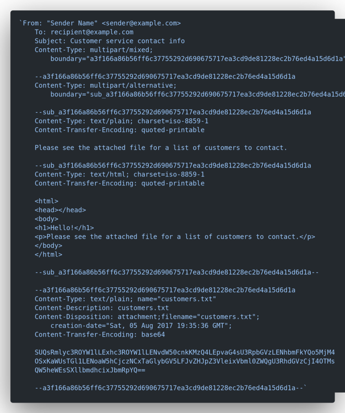

# Introduction to SES

Amazon Simple Email Service (SES) is a cost-effective, flexible, and scalable email service that enables developers to send mail from within any application. You can configure Amazon SES quickly to support several email use cases, including transactional, marketing, or mass email communications.

---

# Basic Setup

**In NodeJS**,
The basic SES setup involves two aspects:-

1. [Generate AWS IAM Credentials and configure environment variables](https://console.aws.amazon.com/iam/home?region=us-east-1#security_credential). |
2. Implementing the email client via either of the packages provided by amazon, either the all-encompassing `aws-sdk` or the modular **`@aws-sdk/client-ses`**.

---

## Using the `aws-sdk`

The **`aws-sdk`** is a complete package that provides API requests to all aws applications. As a result the package size is large (Unpacked size: 72 MB+). This is okay when the organization uses multiple AWS applications and a single package installation solves the problem.

**Install:**

```
yarn add aws-sdk
```

**Syntax:**

```
// Load the AWS SDK for Node.js
import { SES } from 'aws-sdk';

const config = {
  accessKeyId: process.env.NEXT_AWS_ACCESSKEY_ID,
  secretAccessKey: process.env.NEXT_AWS_ACCESSKEY_SECRET,
  region: process.env.NEXT_AWS_REGION,
  apiVersion: '2010-12-01',
};

export default async (req, res) => {
  const { name, email, message } = req.body;

  // Create sendEmail params
  const params = {
    Destination: {
      ToAddresses: ['RecepientName <hello@receiveremail.com>'],
    },
    Message: {
      Body: {
        Html: {
          Charset: 'UTF-8',
          Data: `
         <style>
           p { white-space: pre-wrap }
         </style>
               <div>
                   <h3>New message from contact form</h3><br />
                   <p><strong>Name:</strong> ${name} </p>
                   <p><strong>Email:</strong> ${email} </p><br/>
                   <p><strong>Message:</strong></p>
                   <p>${message.replaceAll(/\\n/g, '</p><p>')}</p><br/>
               </div>`,
        },
      },
      Subject: {
        Charset: 'UTF-8',
        Data: 'New message from contact form',
      },
    },
    Source: `${name} via Contact Form <hello@receiveremail.com>`,
    ReplyToAddresses: [`${name} <${email}>`],
  };

  try {
    const emailResponse = await new SES(config).sendEmail(params).promise();
    console.log('Message sent: %s', emailResponse.MessageId);
  } catch (error) {
    throw new Error(error.message);
  }
  res.status(200).json(req.body);
};
```

---

## Using the [`@aws-sdk/client-ses`](https://aws.amazon.com/blogs/developer/modular-packages-in-aws-sdk-for-javascript/)

AWS SDK for JavaScript SES Client for Node.js, Browser and React Native.
This is a smaller, modular, 2.24 MB package that is specific to SES Client vs the complete AWS SDK which is a whooping 72 MB.

#### Optional: `@aws-sdk/credential-provider-node`

If we want the same feature as being able to read environment variables automatically as available in the larger `aws-sdk` package, we have to install **[`@aws-sdk/credential-provider-node`](https://www.npmjs.com/package/@aws-sdk/credential-provider-node)**.

It will attempt to find credentials from the following sources (listed in order of precedence):

- Environment variables exposed via process.env
- SSO credentials from token cache
- Web identity token credentials
- Shared credentials and config ini files
- The EC2/ECS Instance Metadata Service

**Install:**

```
yarn add @aws-sdk/client-ses
```

We can send emails using the Global Classes :-

1. **[SendEmailCommand](https://docs.aws.amazon.com/AWSJavaScriptSDK/v3/latest/clients/client-ses/classes/sendemailcommand.html)** - No attachments are allowed. The maximum message size is 10 MB.
   1. **[SendRawEmailCommand](https://docs.aws.amazon.com/AWSJavaScriptSDK/v3/latest/clients/client-ses/classes/sendrawemailcommand.html)** - Allows attachments. The maximum message size, including attachments, is 10 MB.

The use case differs. For instance, for a simple contact form, `SendEmailCommand` is enough. For a more complex email with attachments, we will have to use the `SendRawEmailCommand`.

### Using `SendEmailCommand`,

```
import { SESClient, SendEmailCommand } from '@aws-sdk/client-ses';

/**
 * Create config -
 * Notice the difference in structure between aws-sdk vs @aws-sdk/client-ses
*/
const config = {
  credentials: {
    accessKeyId: process.env.NEXT_AWS_ACCESSKEY_ID,
    secretAccessKey: process.env.NEXT_AWS_ACCESSKEY_SECRET,
  },
  region: process.env.NEXT_AWS_REGION,
  apiVersion: '2010-12-01',
};

// a client can be shared by different commands.
const client = new SESClient(config);

export default async (req, res) => {
  const { name, email, message } = req.body;

  // Create sendEmail params
  const params = {
    Destination: {
      ToAddresses: ['RecepientName <hello@receiveremail.com>'],
    },
    Message: {
      Body: {
        Html: {
          Charset: 'UTF-8',
          Data: `
          <style>
          p { white-space: pre-wrap }
          </style>
              <div>
                  <h3>New message from contact form</h3><br />
                  <p><strong>Name:</strong> ${name} </p>
                  <p><strong>Email:</strong> ${email} </p><br/>
                  <p><strong>Message:</strong></p>
                  <p>${message.replaceAll(/\\n/g, '</p><p>')}</p><br/>
              </div>`,
        },
      },
      Subject: {
        Charset: 'UTF-8',
        Data: 'New message from contact form',
      },
    },
    Source: `${name} via Contact Form <hello@receiveremail.com>`,
    ReplyToAddresses: [`${name} <${email}>`],
  };

  const command = new SendEmailCommand(params);

  try {
    const emailResponse = await client.send(command);
    console.log('Message sent: %s', emailResponse.MessageId);
  } catch (error) {
    throw new Error(error.message);
  }
  res.status(200).json(req.body);
};
```

### Sending emails with attachments via SES

**Method 1:** Using `SendRawEmailCommand`,

**`SendRawEmailCommand`** is the only way to send attachments via SES.

The problem is that the email is sent in MIME type email body as data.
This is how a MIME type email body looks like:



It is a multipart email with the content in both HTML format and text format and it contains a text file as an attachment.

We can create a string like the above example and send as data to `SendRawEmailCommand`.
However, as we can notice, it will be very confusing to format this long string. To simplify the MIME body creation we can use npm module like **[`mimemessage`](https://www.npmjs.com/package/mimemessage)** | [Reference](https://javascript.plainenglish.io/aws-ses-how-to-send-a-mail-with-an-attachment-nodejs-43a12cf98714)

(I haven't tried Method 1. I've used the simpler nodemailer which abstracts this MIME email body creation.)

---

**Method 2: [Using Nodemailer](https://nodemailer.com/transports/ses/)** (Recommended)

Nodemailer acts as a wrapper over SES.
`SendRawEmailCommand` requires you build your own MIME formatted email message which is far from being easy. And this is where Nodemailer steps in – it gives you a simple to use API while supporting even really complex scenarios like embedded images or calendar events.

As of `nodemailer` (v6.7.5) and `@aws-sdk/client-ses` (v3.121.0) -

**Syntax:**

```
import nodemailer from 'nodemailer';
import * as aws from '@aws-sdk/client-ses';

// Create config
const config = {
  credentials: {
    accessKeyId: process.env.NEXT_AWS_ACCESSKEY_ID,
    secretAccessKey: process.env.NEXT_AWS_ACCESSKEY_SECRET,
  },
  region: process.env.NEXT_AWS_REGION,
  apiVersion: '2010-12-01',
};

const ses = new aws.SES(config);

export default async (req, res) => {
  const { name, email, message } = req.body;

  const transporter = nodemailer.createTransport({
    SES: { ses, aws },
  });

  try {
    /**
      * send mail with defined transport object
      * The various message configuration options are detailed here - https://nodemailer.com/message/
    */
    const emailResponse = await transporter.sendMail({
      from: `${name} via Contact Form <hello@receiveremail.com>`,
      to: 'Jayanta Samaddar <hello@receiveremail.com>',
      replyTo: `${name} <${email}>`,
      subject: 'New message from contact form', // Subject line
      text: message, // plaintext version
      html: `
    <style>
    p { white-space: pre-wrap }
    </style>
        <div>
            <h3>New message from contact form</h3><br />
            <p><strong>Name:</strong> ${name} </p>
            <p><strong>Email:</strong> ${email} </p><br/>
            <p><strong>Message:</strong></p>
            <p>${message.replaceAll(/\\n/g, '</p><p>')}</p><br/>
        </div>`,
      attachments: [
        {
          filename: 'quickbrownfox.txt',
          /** String, Buffer, ArrayBuffer or a Stream contents for the attachment
            * This is just a simulation to illustrate the Buffer received from a FileUpload
            * There are other ways of adding attachments - https://nodemailer.com/message/attachments/
          */
          content: Buffer.from('The quick brown fox jumps over the lazy dog.'),
        },
      ],
    });

    console.log('Message sent: %s', emailResponse.messageId);
  } catch (error) {
    console.log(error);
  }
  res.status(200).json(req.body);
};
```

---

# References

- **[Get AWS Access Keys](https://docs.aws.amazon.com/ses/latest/dg/setting-up.html#get-aws-keys)**
- **[Tools to Build on AWS](https://aws.amazon.com/tools/)**
- **[Amazon SDK Full - SES Examples](https://docs.aws.amazon.com/sdk-for-javascript/v3/developer-guide/ses-examples-sending-email.html)**
- **[Nodemailer SES Transport](https://nodemailer.com/transports/ses/) | [Example](https://github.com/nodemailer/nodemailer/blob/master/examples/ses.js)**
- **[Amazon JavaScript SDK S3 Client](https://docs.aws.amazon.com/AWSJavaScriptSDK/v3/latest/clients/client-ses/index.html) | [Globals](https://docs.aws.amazon.com/AWSJavaScriptSDK/v3/latest/clients/client-ses/globals.html)**
