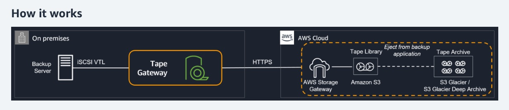

# Table of Contents

- [Table of Contents](#table-of-contents)
- [Hybrid Cloud for Storage](#hybrid-cloud-for-storage)
- [AWS Storage Cloud: Recap of Native Options](#aws-storage-cloud-recap-of-native-options)
- [AWS Storage Gateway](#aws-storage-gateway)

---

# Hybrid Cloud for Storage

- AWS is pushing for **"hybrid cloud"**

  - Part of your infrastructure is on the Cloud
  - Part of your infrastructure is on-premises

- This can be due to:

  - Long cloud migrations
  - Security requirements
  - Compliance requirements
  - IT strategy

- Use Case:
  - We want to access our S3 data, which is AWS proprietary technology, on-premises

The answer to this is **AWS Storage Gateway**

---

# AWS Storage Cloud: Recap of Native Options

1. Block Storage

   - Amazon EBS
   - EC2 Instance Store

2. File Storage

   - Amazon EFS
   - Amazon FSx

3. Object Storage

   - Amazon S3
   - Amazon Glacier

---

# AWS Storage Gateway

- AWS Storage Gateway is a hybrid cloud storage service that gives you on-premises access to virtually unlimited cloud storage by linking it to **Amazon S3**.

- Bridge between on-premises data and cloud data.

- Uses a **Storage Gateway Appliance**: a VM from Amazon which is installed and hosted on your data center. You can also purchase the hardware appliance to facilitate the transfer instead of installing the VM.

- Storage Gateway provides a standard set of storage protocols such as **`iSCSI`**, **`SMB`**, and **`NFS`**.

- **Four kinds of Storage Gateway**:

  - **Amazon S3 File Gateway**: Store files in Amazon S3 with a local cache for low-latency access to your most recently used data using file protocols such as NFS and SMB.

  - **Amazon FSx File Gateway**

  - **Amazon Volume Gateway**: Block storage in Amazon S3 with Point-in-time backups as EBS Snapshots which you can restore and mount to your appliance as iSCSI device.

    - Volume Types:
      - **Cached Volumes**: Low-latency access to your most recently used data
      - **Stored Volumes**: On-premises data with scheduled offsite backups

  - **Amazon Tape Gateway**:

    

    - Tape Gateway enables you to replace using physical tapes on-premises with virtual tapes in AWS without changing existing backup workflows.
    - Tape Gateway supports all leading backup applications and caches virtual tapes on-premises for low-latency data access.
    - Tape Gateway encrypts data between the gateway and AWS for secure data transfer and compresses data while transitioning virtual tapes between Amazon S3 and Amazon S3 Glacier, or Amazon S3 Glacier Deep Archive, to minimize storage costs.

- **Host platforms**:

  - VMWare ESXi
  - Microsoft Hyper-V 2012R2/2016
  - Linux KVM
  - Amazon EC2
  - Hardware appliance (physical device that can be ordered)

- You can use a combination of **AWS DataSync** and **File Gateway** to minimize your on-premises’ operational costs while seamlessly connecting on-premises applications to your cloud storage.

  - **AWS DataSync** enables you to automate and accelerate online data transfers to AWS storage services.
  - **File Gateway** then provides your on-premises applications with low latency access to the migrated data.
  - **AWS recommendation**: You should use **AWS DataSync** to migrate existing data to **Amazon S3**, and subsequently use the **File Gateway** configuration of **AWS Storage Gateway** to retain access to the migrated data and for ongoing updates from your on-premises file-based applications.
