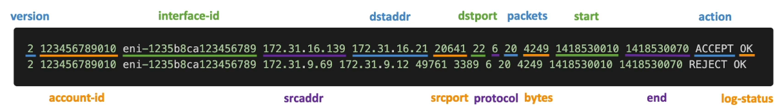
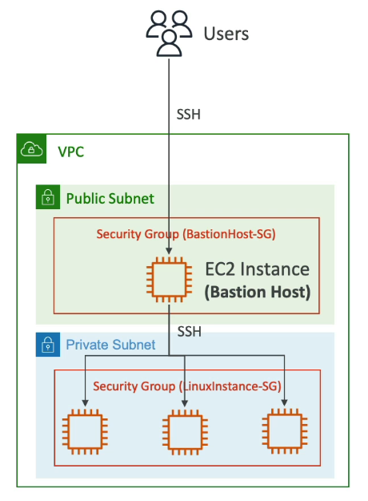
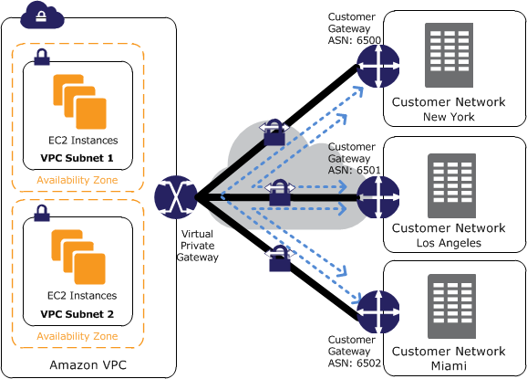
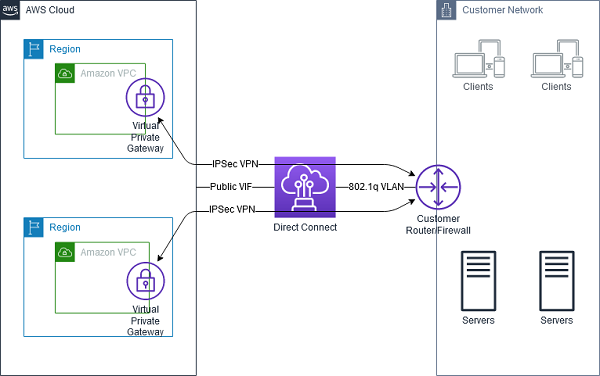
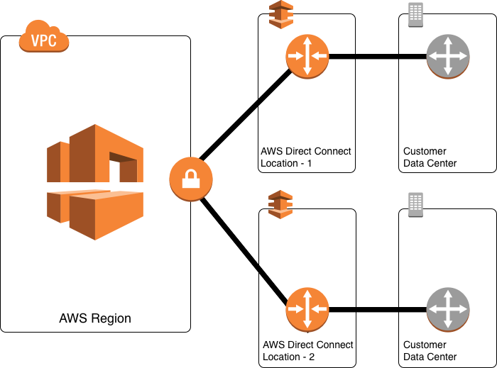
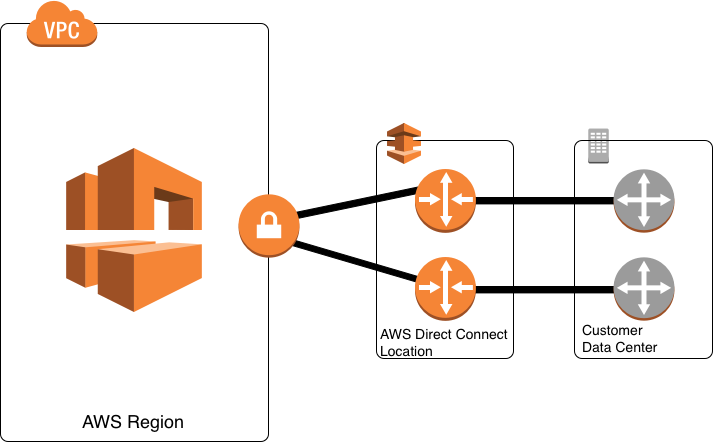

# Table of Contents

- [Table of Contents](#table-of-contents)
- [VPC and Subnets](#vpc-and-subnets)
- [Internet Gateways](#internet-gateways)
- [NAT Devices: NAT Instance and NAT Gateway](#nat-devices-nat-instance-and-nat-gateway)
  - [NAT Devices: Overview](#nat-devices-overview)
  - [NAT Devices: NAT Instance](#nat-devices-nat-instance)
  - [NAT Devices: NAT Gateway](#nat-devices-nat-gateway)
  - [NAT Devices: NAT Gateway vs NAT Instance](#nat-devices-nat-gateway-vs-nat-instance)
- [NACL (Network Acess Control List) and Security Groups](#nacl-network-acess-control-list-and-security-groups)
  - [NACL and Security Groups: Overview](#nacl-and-security-groups-overview)
  - [NACL and Security Groups: Differences](#nacl-and-security-groups-differences)
- [Reachability Analyzer](#reachability-analyzer)
- [VPC Flow Logs](#vpc-flow-logs)
- [Bastion Host](#bastion-host)
- [VPC Sharing](#vpc-sharing)
- [VPC Peering](#vpc-peering)
- [AWS PrivateLink](#aws-privatelink)
- [VPC Endpoints](#vpc-endpoints)
- [Site-to-Site VPN, VPN CloudHub and Direct Connect (DX)](#site-to-site-vpn-vpn-cloudhub-and-direct-connect-dx)
  - [Site-to-Site VPN](#site-to-site-vpn)
  - [**AWS VPN CloudHub**:](#aws-vpn-cloudhub)
  - [Direct Connect (DX)](#direct-connect-dx)
    - [Direct Connect: Overview](#direct-connect-overview)
    - [Direct Connect: Virtual Interfaces](#direct-connect-virtual-interfaces)
- [AWS Transit Gateway](#aws-transit-gateway)
- [Traffic Mirroring](#traffic-mirroring)
- [IPv6 for VPC](#ipv6-for-vpc)
- [Egress-only Internet Gateway](#egress-only-internet-gateway)
- [VPC Networking Costs in AWS](#vpc-networking-costs-in-aws)
- [AWS Network Firewall](#aws-network-firewall)
- [References](#references)

---

# VPC and Subnets

VPC stands for Virtual Private Cloud, which is a private network that is within the AWS Cloud, that allows you to deploy your resources within it. At the low level, VPC is only a logical construct.

- **VPC** is a regional resource, i.e. two different AWS regions will have two different VPCs
- A VPC has **Subnets**. Subnets allow you to partition your network inside your VPC. Subnets are defined at the Availability Zone level.
  - A **public subnet** is a subnet that is accessible from the internet
  - A **private subnet** that is NOT accessible from the internet
- To define access to the internet and between subnets, we use **Route Tables**
- By default, AWS creates one default VPC in every Region. Each VPC has a default Public Subnet per AZ. So in Region: `ap-south-1`, there is one default VPC having three default public subnets, one per AZ at `ap-south-1a`, `ap-south-1b` and `ap-south-1c`.

---

# Internet Gateways

- Internet Gateways help our VPC instances connect with the internet.
- **Public Subnets** have a route to the Internet Gateway.

---

# NAT Devices: NAT Instance and NAT Gateway

## NAT Devices: Overview

You can use a NAT device to allow resources in private subnets to connect to the internet, other VPCs, or on-premises networks. These instances can communicate with services outside the VPC, but they cannot receive unsolicited connection requests.

The NAT device replaces the source IPv4 address of the instances with the address of the NAT device. When sending response traffic to the instances, the NAT device translates the addresses back to the original source IPv4 addresses.

You can use a managed NAT device offered by AWS, called a NAT gateway, or you can create your own NAT device on an EC2 instance, called a NAT instance. We recommend that you use NAT gateways because they provide better availability and bandwidth and require less effort on your part to administer.

**Considerations**

- NAT devices are not supported for IPv6 traffic - use an egress-only internet gateway instead. For more information, see Enable outbound IPv6 traffic using an egress-only internet gateway.

- We use the term NAT in this documentation to follow common IT practice, though the actual role of a NAT device is both address translation and port address translation (PAT).

---

## NAT Devices: NAT Instance

- **NAT Instances** (self-managed) allow your instances in your Private Subnets to access the internet while remaining private (for e.g. to get software updates).
- How does it work:
  - Must deploy in a public subnet.
  - Must disable EC2 setting: **Source / Destination Check** because the network packets get re-written by the NAT instances and the source IPs may change, i.e. the NAT Instance requires to send and receive traffic when the source or destination is not itself.
  - Then, we create a route from the private subnet to the NAT instance or gateway.
  - The NAT Gateway or Instance has a route to the Internet Gateway.
  - Route Tables must be configured to configure the traffic from the private subnets to the NAT Instance. A NAT Gateway is AWS-managed, therefore this is not necessary.
  - The NAT Instance must have a fixed Elastic IP attached to it
  - Pre-configured Linux AMIs available for NAT Instances.
    - Reached end of support on Dec 31, 2020, therefor NAT Gateways are recommended
  - NAT Instances are not highly available / resilient setup out of the box
    - You need to create an ASG in Multi-AZ + resilient user-data script
  - Internet traffic bandwidth depends on EC2 Instance Type
  - You must manage Security Groups and rules
  - If you need to ping your EC2 Instances from on-premises, make sure you add the ICMP Protocol for the CIDR on the Inbound rules of your security group(s) for the NAT Instance(s).

---

## NAT Devices: NAT Gateway

- AWS managed NAT, higher bandwidth, high availability, no server administration, no security groups to manage.
- Pay per hour of usage + bandwidth.
- Must deploy in a public subnet.
- NAT Gateway is created in a specific Availability Zone. It inherits an Elastic IP.
- Can't be used by EC2 Instance in the same subnet (only from other subnets).
- Requires an Internet Gateway to work. (Private Subnet ==> NAT Gateway ==> Internet Gateway)
- **Bandwidth**: 5 Gbps that auto-scales upto 45 Gbps
- **High Availability**:
  - NAT Gateway is resilient within a single Availability Zone
  - Must create multiple NAT Gateways in multiple Availability Zones for fault tolerance
  - There is no need to connect the AZs through route tables because if an AZ goes down, all subnets and EC2 instances in that AZ are also inaccessible, therefore it doesn't need NAT

---

## [NAT Devices: NAT Gateway vs NAT Instance](https://docs.aws.amazon.com/vpc/latest/userguide/vpc-nat-comparison.html)

<!-- prettier-ignore -->
|                            | NAT Gateway | NAT Instance |
| -------------------------- | ----------- | ------------ |
| **Availability**           | Highly available within AZ (create in another AZ) | Use a script to manage failover between instances |
| **Bandwidth**              | 5 - 45 Gbps | Depends on EC2 Instance Type |
| **Maintenance**            | Managed by AWS | Managed by you (e.g. software, OS patches etc) |
| **Pricing**                | Per hour & amount of data transferred | Per hour, EC2 Instance type and size + network |
| **Public IPv4**            | Yes         | Yes          |
| **Private IPv4**           | Yes         | Yes          |
| **Security Groups**        | No          | Yes          |
| **Port Forwarding**            | Not supported | Manually customize the configuration to support port forwarding. |
| **Use as a Bastion Host?** | No          | Yes          |

---

# NACL (Network Acess Control List) and Security Groups

## NACL and Security Groups: Overview

- **Network ACL (NACL)**

  - NACL is a firewall, the first mechanism of defense of a Subnet, that controls traffic to and from the subnet with ALLOW or DENY rules.
  - Can have ALLOW or DENY rules
  - Rules only include IP Addresses

- **Security Groups**

  - A firewall that controls traffic to and from an ENI (Elastic Network Interface) or an EC2 Instance.
  - Can only have ALLOW rules
  - Rules include either IP Addresses or other Security Groups
  - Second mechanism of defense
  - Security groups are stateful: If traffic is allowed out, it is automatically allowed in

---

## NACL and Security Groups: Differences

<!-- prettier-ignore -->
| Security Group                                    | Network ACL                                |
| ------------------------------------------------- | ------------------------------------------ |
| Operates at the instance level                    | Operates at the subnet level               |
| Supports allow rules only                         | Supports ALLOW and DENY rules              |
| Stateful: Return traffic is automatically allowed, regardless of any rules | Stateless: Return Traffic must be explicitly allowed by rules |
| We evaluate all rules before deciding whether to allow traffic | We process rules in number order when deciding whether to allow traffic |
| Applies to an instance only if someone specifies the Security Group when launching the instance, or associates the Security Group with the instance later on | Automatically applies to all instances in the Subnets it's associated with (therefore, you don't have to rely on users to specify the security group) |

---

# [Reachability Analyzer](https://docs.aws.amazon.com/vpc/latest/reachability/what-is-reachability-analyzer.html)

- Reachability Analyzer is a configuration analysis tool that enables you to perform connectivity testing between a source resource and a destination resource in your virtual private clouds (VPCs).
- When the destination is reachable, Reachability Analyzer produces hop-by-hop details of the virtual network path between the source and the destination.
- When the destination is not reachable, Reachability Analyzer identifies the blocking component. For example, paths can be blocked by configuration issues in a security group, network ACL, route table, or load balancer.

- **Source and Destination resources**: Reachability Analyzer supports the following resource types as sources and destinations:

  - Instance
  - Internet gateway
  - Network interface
  - Transit gateway
  - Transit gateway attachment
  - VPC endpoint
  - VPC peering connection
  - VPN gateways

- Intermediate components: Reachability Analyzer supports the following resource types as intermediate components:

  - Load balancers (except for Gateway Load Balancers)
  - NAT gateways
  - Transit gateways
  - Transit gateway attachments
  - VPC peering connections

- Reachability Analyzer supports only resources with an IPv4 address. If a resource has both IPv4 and IPv6 addresses, Reachability Analyzer includes only the IPv4 addresses in its analysis.

---

# VPC Flow Logs

- Captures information about all the IP Traffic going into your interfaces
  - **VPC** Flow Logs
  - **Subnet** Flow Logs
  - **Elastic Network Interface (ENI)** Flow Logs
- Helps troubleshoot connectivity issues
  - Subnets to internet
  - Subnets to subnets
  - Internet to subnets
- Captures network information from AWS managed interfaces too: Elastic Load Balancers (ELBs), ElastiCache, RDS, Aurora, etc.
- VPC Flow Logs data can be sent to either: **S3 Bucket** / **CloudWatch Logs**

- **VPC Flow Logs Syntax**:

  

  - `version`
  - `account-id`
  - `interface-id`
  - `srcaddr` and `dstaddr`: Help identify problematic IP. (e.g. IP is being repeatedly denied)
  - `srcport` and `dstport`: Help identify problematic Ports.
  - `protocol`
  - `packets`
  - `bytes`
  - `start`
  - `end`
  - `action`: Either `ACCEPT` or `REJECT`. Success or failure due to Security Group / NACL
  - `log-status`

- Can be used for analytics on usage patterns, or malicious behaviour
- We can query the Flow Logs in two ways:

  - **Amazon Athena on S3**
  - **CloudWatch Logs Insights**

- **Troubleshooting Security Group and NACL Issues**: Remember NACLs are Stateless while Security Groups are Stateful

  - If Inbound Requests from the outside to our EC2 Instance are REJECTED => Either the NACL or the Security Group is rejecting the request.
  - If Inbound `ACCEPT`, Outbound `REJECT` => NACL issue (Security Groups are Stateful, so if Inbound is allowed, then outbound is allowed as well; Security Groups can only Allow. NACLs on the other hand are stateless - can Allow OR Deny and therefore Inbound Allow but Outbound Deny is a NACL issue)
  - Outbound `REJECT` => NACL or Security Group issue
  - Outbound `ACCEPT`, Inbound `REJECT` => NACL issue

---

# Bastion Host

**Situation**: We have a EC2 Instance running in a Private Subnet. We want to access it from the internet. But since we have it running in a Private Subnet, it doesn't have direct internet access in or out. One way we can solve this is by using a Bastion Host in a public subnet, in the same VPC.

- The **Bastion Host** is an EC2 Instance in a Public Subnet, having it's own Security Group.
- The Security Group Inbound Rules must allow traffic on Port 22 from restricted CIDR (company's CIDR).
- Since it's in the same VPC, it has access to all the other Private Subnets in the same VPC.
- The Security Group of the EC2 Instance running on the Private Subnet must allow Incoming Traffic from the Security Group or private IP of the Bastion Host.

So from the outside, to access the EC2 Instance in the Private Subnet, we connect via SSH to the Bastion Host and then from the Bastion Host, SSH into the EC2 Instance in the Private Subnet.

---

# [VPC Sharing](https://docs.aws.amazon.com/vpc/latest/userguide/vpc-sharing.html)

- VPC sharing allows multiple AWS accounts to create their application resources into shared, centrally-managed virtual private clouds (VPCs).

- You must enable resource sharing from the management account for your AWS Organization. Use AWS Resource Access Manager (RAM).

- Application resources can include:

  - Amazon EC2 instances
  - Amazon Relational Database Service (RDS) databases
  - Amazon Redshift clusters
  - AWS Lambda functions

- The account that owns the VPC (owner) shares one or more subnets with other accounts (participants) that belong to the same organization from AWS Organizations.

- After a subnet is shared, the participants can view, create, modify, and delete their application resources in the subnets shared with them.

- Participants cannot view, modify, or delete resources that belong to other participants or the VPC owner.

- You can share your VPCs to leverage the implicit routing within a VPC for applications that require a high degree of interconnectivity and are within the same trust boundaries.

- This reduces the number of VPCs that you create and manage, while using separate accounts for billing and access control.

---

# VPC Peering

- Privately connect two VPCs across different Accounts, Regions or Availability Zones using AWS' Network.
- Make them behave as if they were the same network

- **To make it work**:

  - Make sure they do not have overlapping CIDR (IP Address Range)
  - VPC Peering Connection is **NOT transitive** (must be established for each VPC to connect with one another)
    - For example: There are three VPCs, `A`, `B`, `C`. To ensure interconnectivity we have to establish three peering connections: One each between `A <==> B`, `B <==> C`, `C <==> A`. Just establishing two connections between `A <==> B` and `B <==> C` will not automatically connect `C` and `A`.
  - You must update route tables in each VPC's subnets to ensure EC2 Instances can communicate with each other.
  - You can reference a security group in a peered VPC (works cross accounts - same region).

- **Use Case**:
  - VPC Peering is commonly used when interconnecting a small number of VPCs in a region to achieve full mesh connectivity.
  - [AWS Transit Gateway](#aws-transit-gateway) and [AWS PrivateLink](#aws-privatelink) are the recommended mechanisms to inter-connect hundreds or thousands of VPCs at scale.

---

# AWS PrivateLink

- AWS PrivateLink provides private connectivity between **virtual private clouds (VPCs)**, **supported AWS services**, and **on-premises networks** without exposing your traffic to the public internet.
- **Interface VPC Endpoints**, powered by PrivateLink, connect you to services hosted by AWS Partners and supported solutions available in AWS Marketplace.
- Data being exchanged over an AWS PrivateLink is also encrypted. The service consumer always initiates the service (it is a one-way service), and that the service provider only provides service to whitelisted customers.

---

# VPC Endpoints

- Endpoints allow you to connect to AWS Services using a private network instead of the public www network
- All AWS services by default are Public and talk to AWS publicly
- Provides enhanced security and lower latency to access AWS services
- **VPC Endpoint Interface (ENI)**: Allows us to access the rest of AWS services
- Only used within your VPC
- They are redundant and scale horizontally
- Removes the need of Internet Gateway or NAT Gateway to access AWS Services.
- When you are using VPC endpoints with AWS services, you can also create **endpoint policies**, which restrict access to requests that come from the VPC or the VPC endpoint.
- You cannot associate security groups with VPC endpoints. However, you can use security groups on your instances to control the access. You can also use VPC endpoint policies and NACLs to control the traffic of VPC endpoints.

- **Types of Endpoints**:

  1. **Interface Endpoints** (powered by **AWS PrivateLink**)

  - Provisions an ENI (private IP address) as an entry point (must attach a Security Group to the ENI)
  - Provide private connectivity to services powered by AWS PrivateLink.
  - Secure. The path between a Interface VPC Endpoint and an AWS or AWS-based service stays within AWS and does not traverse the Internet. It therefore remains out of reach of Internet breaches.
  - Supports most AWS services, your own services or SaaS solutions.
  - Currently, no Amazon CloudWatch metric is available for the interface-based VPC Endpoint.
  - Cost per hour + per GB of data processed

  2. **Gateway Endpoints**

  - Provisions a Gateway Load Balancer Endpoint and must be used as a target in a Route Table (does not use Security Groups)
  - There are only two targets for a Gateway Endpoint - **`Amazon S3`** and **`Amazon DynamoDB`**
  - Free and scales automatically.
  - Cannot enable AWS PrivateLink. (Goes over the public internet)

- To make an EC2 Instance on a Private subnet talk to S3 and Dynamo DB (which are publicly accessible) :

  - Create a **VPC Endpoint Gateway**: These two services (S3 & DynamoDB) have a VPC Gateway Endpoint, all the other ones have an Interface endpoint (powered by Private Link - means a private IP).
  - Your EC2 Instance talks to the VPC Endpoint and has access to S3 & DynamoDB.

- Gateway Endpoint is preferrable because it is free and has managed scaling.
- Interface Endpoint is preferred when access is required from On-Premises (Site-to-Site VPN or Direct Connect), a different VPC or a different region.

---

# Site-to-Site VPN, VPN CloudHub and Direct Connect (DX)

How do we connect your On-premise Data Center and your Cloud VPC?

## Site-to-Site VPN

- Connect an On-premises VPN to AWS
- The connection is automatically encrypted
- Goes over the public internet
- Site-to-Site VPN requires the following:

  - **Virtual Private Gateway (VGW)**

    - VPN Concentrator on the AWS side of the VPN Connection
    - VGW is created and attached to the VPC from which you want to create the Site-to-Site VPN connection
    - Possible to customize the ASN (Autonomous System Number)

  - **Customer Gateway (CGW)**

    - Software or physical device on customer side of the VPN connection
    - What IP Address to use?
      - Public Internet-routable IP for your Customer Gateway device
      - If it's behind a NAT Device that's enabled for NAT Traversal (NAT-T), use the Public IP Address of the NAT device

- Enable route propagation for the Virtual Private Gateway in the Route Table that is associated with your subnets.
- If you need to ping your EC2 Instances from on-premises, make sure you add the ICMP Protocol on the Inbound rules of your security group(s) for the EC2 Instance(s).

---

## **[AWS VPN CloudHub](https://docs.aws.amazon.com/vpn/latest/s2svpn/VPN_CloudHub.html)**:

- Provide secure communication between multiple on-premise sites, if you have multiple AWS Site-to-Site VPN connections. This enables your remote sites to communicate with each other, and not just with the VPC.
- Low-cost hub-and-spoke model for primary or secondary network connectivity between different locations (VPN only) that you can use with or without a VPC.
- It's a VPN Connection hence it goes over the public Internet (encrypted)

- **Setup**:

  - Create a single Virtual Private Gateway (VGW).
  - Create multiple customer gateways, each with the public IP address of the gateway. You must use a unique Border Gateway Protocol (BGP) Autonomous System Number (ASN) for each customer gateway.
  - Create a dynamically routed Site-to-Site VPN connection from each customer gateway to the common virtual private gateway.
  - Configure the customer gateway devices to advertise a site-specific prefix (such as 10.0.0.0/24, 10.0.1.0/24) to the Virtual Private Gateway. These routing advertisements are received and re-advertised to each BGP peer, enabling each site to send data to and receive data from the other sites. This is done using the network statements in the VPN configuration files for the Site-to-Site VPN connection. The network statements differ slightly depending on the type of router you use.
  - Configure Route Tables: Configure the routes in your subnet route tables to enable instances in your VPC to communicate with your sites:
    - You can configure an aggregate route in your route table (for example, 10.0.0.0/16).
    - Use more specific prefixes between customer gateways devices and the virtual private gateway.

- The sites must not have overlapping IP ranges.
- Sites that use AWS Direct Connect connections to the Virtual Private Gateway can also be part of the AWS VPN CloudHub.

---

## Direct Connect (DX)

### Direct Connect: Overview

- Establish a physical connection between on-premises and AWS.
- The connection is private, secure and fast.
- Dedicated connection must be setup between your Data Center and AWS Direct Connect Locations.
- Takes at least a month or more to establish.
- Must setup Virtual Private Gateway on your VPC.
- Access Public resources (S3) and Private Resources (EC2) on the same connection using the Public VIF and the Private VIF.
- Direct Connect require the following:

  - At the AWS Direct Connect Location:

    - AWS Direct Connect Endpoint
    - Customer / Partner Router

  - At the Customer Network

    - Customer Router / Firewall

- **Use Cases**:

  - Increase bandwidth throughput: Working with large datasets - lower cost
  - More consistent working experience: Applications using real-time data feeds
  - Hybrid Environments (On Premises + Cloud)

- **Direct Connect Gateway**

  - If you want to setup a Direct Connect to one or more VPC in many different regions (same account), you must use a Direct Connect Gateway

- **Direct Connect - Connection Types**:

  - **Dedicated Connections**: 1 Gbps, 10 Gbps, 100 Gbps capacity

    - Physical ethernet port dedicated to a customer
    - Request made to AWS first, then completed using AWS Direct Connect Partners

  - **Hosted Connections**: 50 Mbps, 500 Mbps, upto 10 Gbps

    - Connection requests made via AWS Direct Connect Partners
    - Capacity can be added or removed on demand
    - 1, 2, 5, 10 Gbps available at select AWS Direct Connect Partners

- **Encryption**:

  - Data in transit is not encrypted but is private.
  - AWS Data Connect + VPN provides an IPsec-encrypted private connection.

    

  - Good for an extra layer of security but slightly more complex to setup.

- **Resiliency**:

  - **High Resiliency** for Critical Workloads: One connection at multiple

    

  - **Maximum Resiliency** for Critical Workloads: Separate connections terminating on separate devices in more than one location

    

> **Note:** **Site-to-Site VPN** and **Direct Connect**, both cannot access VPC Endpoints as discussed before. VPC Endpoints are strictly to access AWS services privately within your VPC, not connecting your on-premises Data Center.

---

### Direct Connect: Virtual Interfaces

AWS Direct Connect provides three types of virtual interfaces: public, private, and transit. How do you determine which type you should use to connect different AWS resources?

1. **Public Virtual Interface (Public VIF)**

   To connect to AWS resources that are reachable by a public IP address such as an Amazon S3 bucket or AWS public endpoints, use a public virtual interface. With a public virtual interface, you can:

   - Connect to all AWS public IP addresses globally.
   - Create public virtual interfaces in any Direct Connect location to receive Amazon’s global IP routes.
   - Access publicly routable Amazon services in any AWS Region (except the AWS China Region).

2. **Private Virtual Interface (Private VIF)**

   To connect to your resources hosted in an Amazon Virtual Private Cloud (Amazon VPC) using their private IP addresses, use a private virtual interface. With a private virtual interface, you can:

   - Connect VPC resources such as Amazon Elastic Compute Cloud (Amazon EC2) instances or load balancers on your private IP address or endpoint.
   - Connect a private virtual interface to a Direct Connect gateway. Then, associate the Direct Connect gateway with one or more virtual private gateways in any AWS Region (except the AWS China Region).
   - Connect to multiple Amazon VPCs in any AWS Region (except the AWS China Region), because a virtual private gateway is associated with a single VPC.

   > **Note**: For a private virtual interface, AWS advertises the VPC CIDR only over the **Border Gateway Protocol (BGP)** neighbor. AWS can't advertise or suppress specific subnet blocks in the Amazon VPC for a private virtual interface.

3. **Transit Virtual Interface (Transit VIF)**

   To connect to your resources hosted in an Amazon VPC (using their private IP addresses) through a transit gateway, use a transit virtual interface. With a transit virtual interface, you can:

   - Connect multiple Amazon VPCs in the same or different AWS account using Direct Connect.
   - Associate up to `3` transit gateways in any AWS Region when you use a Transit Virtual Interface to connect to a Direct Connect gateway.
   - Attach Amazon VPCs in the same AWS Region to the transit gateway. Then, access multiple VPCs in different AWS accounts in the same AWS Region using a transit virtual interface.

   > **Note**: For transit virtual interface, AWS advertises only routes that you specify in the allowed prefixes list on the Direct Connect gateway. For a list of all AWS Regions that offer Direct Connect support for AWS Transit Gateway, see AWS Transit Gateway support.

---

# AWS Transit Gateway

- For having transitive peering between thousands of VPC and On-Premises, Hub-and-spoke (star) connection
- Regional resource, can work cross-region
- Share cross-account using the **Resource Access Manager (RAM)**
- You can peer Transit Gateways across regions
- **Route Tables**: Limit which VPC can talk with other VPC(s)
- Works with Direct Connect Gateway, VPN Connections
- Only service in AWS that supports **IP Multicast**

- **Use Case**:

  - **[Increase the bandwidth of your Site-to-Site VPN Connections using ECMP](https://aws.amazon.com/premiumsupport/knowledge-center/transit-gateway-ecmp-multiple-tunnels/)**:
    - **ECMP**: Equal-cost Multi-path routing
    - Routing strategy to allow to forward a packet over multiple best path
    - Create multiple Site-to-Site VPN connections to increase the bandwidth of your connection to AWS, something that cannot be done without the Transit Gateway
    - ECMP allows greater bandwidth (2.5 Gbps for a single connection using 2 tunnels) that can be scaled to increase throughputs

- **Pricing**: Costs per GB of data going through the Transit Gateway

---

# Traffic Mirroring

- Security feature that allows you to capture and inspect network traffic in your VPC, in a non-intrusive manner.
- Route the traffic to security appliances that you manage

- Capture the traffic:

  - From Source: Source ENIs
  - To Target: Where we want to send the traffic to - An ENI or Network Load Balancer

- Capture all packets or capture the packets of your interest (optionally, truncate packets)
- Source and Target can be in the same VPC or different VPCs (with VPC Peering)

- Use Cases:

  - Content inspection
  - Threat monitoring
  - Troubleshooting

---

# IPv6 for VPC

- IPv6 Basics:
  - IPv4 was designed to provide 4.3 Billion addresses (they will be exhausted soon)
  - IPv6 is the successor to IPv4 and is designed to provide 3.4 x 10^8 unique IPv6 addresses
  - Every IPv6 address is public and internet-routable (no private range)
  - Format: `x.x.x.x.x.x.x.x`, where `x` is a hexadecimal number (from `0000` to `ffff`)
- **IPv4 can never be disabled for your VPC and Subnets**
- You can enable IPv6 (they're public IP addresses) to operate in Dual-Stack mode

- **IPv6 Troubleshooting**:
  - Case: You cannot launch an EC2 Instance in your Subnet
    - It is not because it cannot acquire an IPv6 address (the space is very large)
    - It's because there are no available IPv4 addresses left in the subnet
    - Solution: Create a new IPv4 CIDR in your Subnet

---

# Egress-only Internet Gateway

- Used only for IPv6 traffic
- Similar to a NAT Gateway but for IPv6
- Allows instances in your VPC make outbound connections over IPv6 while preventing the internet to initiate an IPv6 connection to your instances
- You must update your Route Tables

---

# VPC Networking Costs in AWS

- **VPC Peering**:

  - All data transfer over a VPC Peering connection that stays within an Availability Zone (AZ) is free.
  - All data transfer over a VPC Peering connection that crosses Availability Zones will continue to be charged at the standard in-region data transfer rates.

- **AWS PrivateLink**:

  - **Interface Endpoint**:

    - Pricing per VPC endpoint per AZ ($/hour) in an AWS Region: `$0.013` in Asia-Mumbai
    - Pricing per GB of Data Processed per month: `$0.01` per GB for the first 1 PB, `$0.006` for the next 4 PB and `$0.004` above 5 PB.

  - **Gateway Load Balancer Endpoint**:

    - Pricing per VPC endpoint per AZ ($/hour): `$0.013` in Asia-Mumbai
    - Pricing per GB of Data Processed per month: `$0.0035` per GB

---

# AWS Network Firewall

- Protect across entire VPC
- From Layer 3 to Layer 7 Protection

- Can inspect in all directions:
  - VPC to VPC traffic
  - Outbound to internet
  - Inbound from internet
  - To / from Direct Connect and/or Site-to-Site VPN
  - Peered VPC
- Internally the AWS Network Firewall uses the AWS Gateway Load Balancer. AWS manages it instead of us setting it up.
- Rules can be centrally managed cross-account by AWS Firewall Manager to apply to many VPCs.

- **Fine Grained Controls**:

  - **Supports 1000s of rules**:

    - IP & Port: Example:- Filtering 1000s of IPs
    - Protocol: Example:- Block the SMB Protocol for Outbound Communications
    - Stateful Domain List rule groups: Only allow outbound traffic to `*.mycorp.`com` or third-party software repo
    - General pattern matching using RegEx

  - **Traffic filtering**: Allow, drop or alert for the traffic that matches the rule
  - **Active flow inspection** to protect against network threats with intrusive-prevention capabilities (like Gateway Load Balancer, but all managed by AWS)

  - Send logs of rule matches to Amazon S3, CloudWatch Logs, Kinesis Data Firehose for analysis.

---

# References

- [Wordpress Architecture](https://aws.amazon.com/blogs/architecture/wordpress-best-practices-on-aws/)
- [VPC Flow Log Records: Examples](https://docs.aws.amazon.com/vpc/latest/userguide/flow-logs-records-examples.html)
- [AWS Direct Connect: Resiliency Recommendations](https://aws.amazon.com/directconnect/resiliency-recommendation/)
- [Influencing Traffic over Hybrid Networks using Longest Prefix Match](https://aws.amazon.com/blogs/networking-and-content-delivery/influencing-traffic-over-hybrid-networks-using-longest-prefix-match/)
