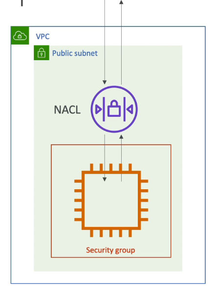

# Table of Contents

- [Table of Contents](#table-of-contents)
- [VPC and Subnets](#vpc-and-subnets)
- [Internet Gateways](#internet-gateways)
- [NAT Gateways & NAT Instances](#nat-gateways--nat-instances)
- [NACL (Network Acess Control List) and Security Groups](#nacl-network-acess-control-list-and-security-groups)
  - [NACL & Security Groups: Overview](#nacl--security-groups-overview)
  - [NACL & Security Groups: Difference](#nacl--security-groups-difference)
- [VPC Flow Logs](#vpc-flow-logs)
- [VPC Peering](#vpc-peering)
- [VPC Endpoints](#vpc-endpoints)
- [Site to Site VPN & Direct Connect](#site-to-site-vpn--direct-connect)
- [References](#references)

---

# VPC and Subnets

VPC stands for Virtual Private Cloud, which is a private network that is within the AWS Cloud, that allows you to deploy your resources within it. At the low level, VPC is only a logical construct.

- **VPC** is a regional resource, i.e. two different AWS regions will have two different VPCs
- A VPC has **Subnets**. Subnets allow you to partition your network inside your VPC. Subnets are defined at the Availability Zone level.
  - A **public subnet** is a subnet that is accessible from the internet
  - A **private subnet** that is NOT accessible from the internet
- To define access to the internet and between subnets, we use **Route Tables**
- By default, AWS creates one default VPC in every Region. Each VPC has a default Public Subnet per AZ. So in Region: `ap-south-1`, there is one default VPC having three default public subnets, one per AZ at `ap-south-1a`, `ap-south-1b` and `ap-south-1c`.

---

# Internet Gateways

- Internet Gateways help our VPC instances connect with the internet.
- **Public Subnets** have a route to the Internet Gateway.

---

# NAT Gateways & NAT Instances

- **NAT Gateways** (AWS-managed) & **NAT Instances** (self-managed) allow your instances in your Private Subnets to access the internet while remaining private (for e.g. to get software updates).
- How does it work:
  - We deploy a NAT Gateway or a NAT Instance in our public subnets.
  - Then, we create a route from the private subnet to the NAT instance or gateway.
  - The NAT Gateway or Instance has a route to the Internet Gateway.

---

# NACL (Network Acess Control List) and Security Groups

## NACL & Security Groups: Overview

- **Network ACL (NACL)**

  - NACL is a firewall, the first mechanism of defense of a Subnet, that controls traffic to and from the subnet with ALLOW or DENY rules.
  - Can have ALLOW or DENY rules
  - Rules only include IP Addresses

- **Security Groups**

  - A firewall that controls traffic to and from an ENI (Elastic Network Interface) or an EC2 Instance.
  - Can only have ALLOW rules
  - Rules include either IP Addresses or other Security Groups
  - Second mechanism of defense
  - Security groups are stateful: If traffic is allowed out, it is automatically allowed in

---

## NACL & Security Groups: Difference

<!-- prettier-ignore -->
| Security Group                                    | Network ACL                                |
| ------------------------------------------------- | ------------------------------------------ |
| Operates at the instance level                    | Operates at the subnet level               |
| Supports allow rules only                         | Supports ALLOW and DENY rules              |
| Stateful: Return traffic is automatically allowed, regardless of any rules | Stateless: Return Traffic must be explicitly allowed by rules |
| We evaluate all rules before deciding whether to allow traffic | We process rules in number order when deciding whether to allow traffic |
| Applies to an instance only if someone specifies the Security Group when launching the instance, or associates the Security Group with the instance later on | Automatically applies to all instances in the Subnets it's associated with (therefore, you don't have to rely on users to specify the security group) |

---

# VPC Flow Logs

- Captures information about all the IP Traffic going into your interfaces
  - **VPC** Flow Logs
  - **Subnet** Flow Logs
  - **Elastic Network Interface (ENI)** Flow Logs
- Helps troubleshoot connectivity issues
  - Subnets to internet
  - Subnets to subnets
  - Internet to subnets
- Captures network information from AWS managed interfaces too: Elastic Load Balancers (ELBs), ElastiCache, RDS, Aurora, etc.
- VPC Flow Logs data can be sent to S3 / CloudWatch logs

---

# VPC Peering

- Connect two VPC, privately using AWS' Network
- Make them behave as if they were the same network
- To make it work:
  - Make sure they do not have overlapping CIDR (IP Address Range)
  - VPC Peering Connection is **not transitive** (must be established for each VPC to connect with one another)

---

# VPC Endpoints

- Endpoints allow you to connect to AWS Services using a private network instead of the public www network
- All AWS services by default are Public and talk to AWS publicly
- Provides enhanced security and lower latency to access AWS services
- To make an EC2 Instance on a Private subnet talk to S3 and Dynamo DB (which are publicly accessible) :
  - Create a **VPC Endpoint Gateway**: These two services (S3 & DynamoDB) have a VPC Gateway Endpoint, all the other ones have an Interface endpoint (powered by Private Link - means a private IP).
  - Your EC2 Instance talks to the VPC Endpoint and has access to S3 & DynamoDB
- **VPC Endpoint Interface (ENI)**: Allows us to access the rest of AWS services
- Only used within your VPC

---

# Site to Site VPN & Direct Connect

How do we connect your On-premise Data Center and your Cloud VPC?

1. **Site-to-Site VPN (Virtual Private Network)**

   - Connect an On-premises VPN to AWS
   - The connection is automatically encrypted
   - Goes over the public internet

2. **Direct Connect (DX)**
   - Establish a physical connection between on-premises and AWS
   - The connection is private, secure and fast
   - Takes at least a month to establish

> **Note:** **Site-to-Site VPN** and **Direct Connect**, both cannot access VPC Endpoints as discussed before. VPC Endpoints are strictly to access AWS services privately within your VPC, not connecting your on-premises Data Center.

---

# References

- [Wordpress Architecture](https://aws.amazon.com/blogs/architecture/wordpress-best-practices-on-aws/)
