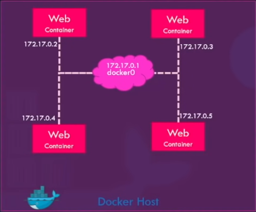
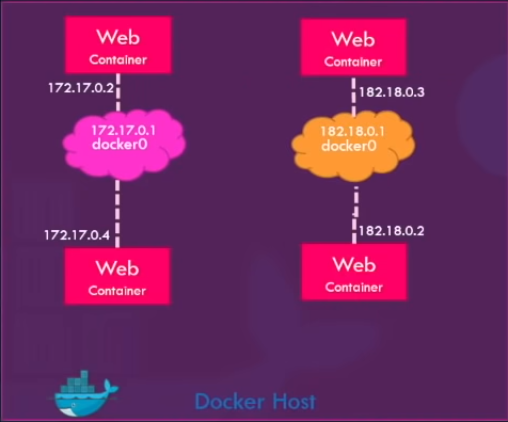
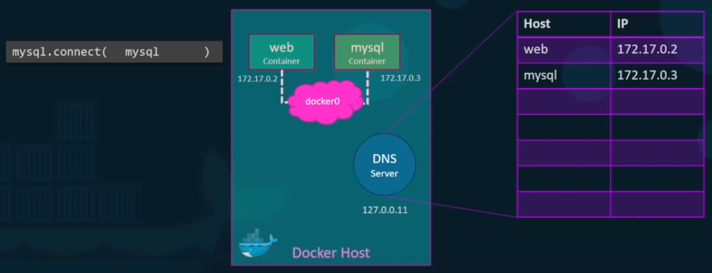

# Table of Contents

- [Table of Contents](#table-of-contents)
- [What is Docker?](#what-is-docker)
- [Why Docker?](#why-docker)
  - [Solving the "But it runs on my machine" problem](#solving-the-but-it-runs-on-my-machine-problem)
  - [Plug and play for a new Team Member](#plug-and-play-for-a-new-team-member)
  - [Removing applications and their dependencies from local machines without breaking other applications](#removing-applications-and-their-dependencies-from-local-machines-without-breaking-other-applications)
- [Virtual Machines vs Containers](#virtual-machines-vs-containers)
- [Architecture of Docker](#architecture-of-docker)
- [Installing Docker](#installing-docker)
- [Development Workflow](#development-workflow)
- [Docker in Action](#docker-in-action)
- [CMD vs ENTRYPOINT](#cmd-vs-entrypoint)
  - [Edge Case: What if we want to modify the ENTRYPOINT during runtime](#edge-case-what-if-we-want-to-modify-the-entrypoint-during-runtime)
- [The Linux Command Line](#the-linux-command-line)
  - [Linux Distributions or Linux Distros](#linux-distributions-or-linux-distros)
  - [Running Linux](#running-linux)
- [Images vs Containers](#images-vs-containers)
- [Networking](#networking)
  - [Bridge](#bridge)
    - [Accessing the Containers](#accessing-the-containers)
  - [None](#none)
  - [User-Defined Networks](#user-defined-networks)
  - [Embedded DNS](#embedded-dns)
- [PORT Mapping](#port-mapping)
- [Restart Policies: Start Containers Automatically](#restart-policies-start-containers-automatically)
  - [Restart Policies: Overview](#restart-policies-overview)
  - [Using a Restart Policy using the `--restart` flag](#using-a-restart-policy-using-the---restart-flag)
- [Storage and Persisting Data](#storage-and-persisting-data)
  - [How exactly does Docker store the files of an image and a container?](#how-exactly-does-docker-store-the-files-of-an-image-and-a-container)
    - [Advantages of Docker's Layered Architecture](#advantages-of-dockers-layered-architecture)
    - [Copy-On-Write Mechanism](#copy-on-write-mechanism)
  - [Persisting Data](#persisting-data)
    - [Volume Mounting - Mounting from the `/var/lib/docker/volumes` directory](#volume-mounting---mounting-from-the-varlibdockervolumes-directory)
    - [Bind Mounting - Mounting Data from any Location on the Docker host](#bind-mounting---mounting-data-from-any-location-on-the-docker-host)
  - [Docker and Storage Drivers](#docker-and-storage-drivers)
- [Docker Compose](#docker-compose)

---

# What is Docker?

**Docker** is a platform for building, running and shipping applications in a consistent manner the same way it does in development.

---

# Why Docker?

### Solving the "But it runs on my machine" problem

Sometimes a situation may arise where the application runs on the local development machine but doesn't run on another machine or the production machine. There are three reasons why this may happen:

- One or more files are not included as part of deployment, i.e. the app is not completely/correctly deployed.
- Software version mismatch on current and target machine. Let's say your application requires Node v16, but target machine is running Node v9.
- Different configuration settings, for e.g. different environment variables.

This is where Docker comes to the rescue. With Docker, we can easily package our application with everything it needs to run it anywhere, on any machine with Docker. So if it runs on the development machine, it will also run on the test and production machines.

### Plug and play for a new Team Member

If someone joins your team, they don't have to spend half-a-day setting up a new machine to run the application. With Docker they don't have to run and configure all the dependencies.

They simply tell Docker to compose up the application using **`docker-compose up`**, and Docker automatically downloads and run these depedencies inside an isolated environment called a **`container`**. This is the beauty of Docker that it allows isolated containers containing Docker applications, running different versions of the software side-by-side on the same machine without messing with each other.

### Removing applications and their dependencies from local machines without breaking other applications

When we don't want to work with an application anymore and want to remove it and all it's dependencies in one go.

**Without Docker**, as we work on different projects, our development machine gets cluttered with many libraries and tools, used by different applications. After a while, we don't know if we can remove one or more of these tools because we are afraid it would break some other application. This is also true for updating, for e.g. updating Nodejs, might break older versions running a lower version of Nodejs which would lose support in the new update. Since Nodejs is installed globally, this might cause some apps to not run anymore.

**With Docker**, we won't have to worry about this because each application runs with its dependencies in its own isolated container. We can simply remove an application and all its dependencies with a simple command - **`docker-compose down --rmi all`**

---

# Virtual Machines vs Containers

A **Virtual Machine** is an abstraction of a machine (physical hardware). We can run several virtual machines on a real, physical machine. For e.g. we can have one Mac machine and run two virtual machines - one running Windows, one running Linux. We do this by using a tool called Hypervisor.

A **Hypervisor** is a software we used to create and manage virtual machines. There are many Hypervisor's out there like VirtualBox or VMWare (cross-platform) and Hyper-v (Windows only).

A **Container** is an isolated environment for running an application.

The difference between Virtual Machines and Containers are as follows:

<!-- prettier-ignore -->
| Virtual Machine | Container |
| --------------- | --------- |
| Allow running multiple applications in isolation. | Allow running multiple applications in isolation. |
| Each Virtual Machine needs a full-blown OS that needs to be licensed, patched and monitored. | Containers share the OS of the host, thus only one OS needs to be licensed, patched and monitored. Technically it shares the kernel of the host |
| Virtual Machines run only on a physical machine. | Container can run on a machine or a virtual machine. |
| Virtual Machines are slow to start as the entire OS has to be loaded just like any computer. | Containers are faster to start as they only load the application, usually in second(s) |
| Virtual Machines are resource intensive because each Virtual Machine takes up actual CPU resources like CPU, memory and disk space. Since each virtual machine requires CPU resources allocated specifically to it, we can only run a finite number of Virtual Machine on a single machine. | Containers are lightweight and less resource intensive as they do not require a full-blown OS. A single host can run tens or hundreds of containers. |

---

# Architecture of Docker

Docker uses a Client-Server architecture, where the client component takes to the server component using a RESTful API. The server also called the **Docker Engine** sits on the background and takes care of building and running Docker containers.


Technically a Container is just a process that runs on your computer just like other processes but it's a special type of a process, that will be discussed below.


As discussed earlier,
Containers share the OS of the host, more technically it shares the kernel of the host.

A **Kernel** is the core of an OS. A kernel is the code that runs on the CPU responsible for managing applications and hardware resources. These kernels have different APIs, that's why a Windows application on a Linux or a Mac because under the hood, the application is to talk to the kernel of the OS.

> On a Linux machine we can only run Linux containers.
> On a Windows machine, Windows 10 and above, we can run both Windows and Linux containers, because Windows 10 ships with a custom built Linux kernel in addition to the Windows kernel.
> MacOS has it's own kernel which is different from Windows and Linux kernels. This kernel doesn't have native support for containerized applications. So Docker on Mac, uses a lightweight Virtual Machine to run Linux containers.

---

# Installing Docker

Docker has two products. The main core product - **[Docker Engine](https://docs.docker.com/engine/)** and **[Docker Desktop](https://docs.docker.com/desktop/)**. The Docker Desktop is a Graphical User Interface for Docker Engine and requires setting up a virtual machine to run it which is a bit of a pain. The only thing we need to do is to install the Docker Engine and have access to all the features via the terminal.

Once we have installed Docker, we can check the version of the Docker Engine by running the following command:

```
sudo docker version
```

---

# Development Workflow

The main idea is to take an application and "Dockerize" it, i.e. allow it to be run by Docker. We do this by adding a Docker file.

A **Docker File** is a plaintext file that tells Docker how to package the application into an image. This image contains everything needed to run the application.


A Docker image typically contains:-

- A stripped down version of the OS.
- A runtime environment (e.g. Node).
- Application files
- Third-party libraries
- Environment variables, and so on.

Once we have an image, we ask Docker to start a container using that image. A container as discussed earlier, is a process, but it is a special kind of process because it has its own File System that is provided by the image. So, our application gets loaded inside a container or process.

This is how we run our application locally on our development machine: Instead of running the application directly and running it inside a typical process, we tell Docker to run it inside a container - an isolated environment.

```
docker run <imageName>
```

The beauty of Docker is that once we have the image we can push it to a Docker registry like Docker Hub.

**Docker Hub** to Docker is like Github to Git - it's a storage for Docker images that anyone can use.

Once our application is on Docker Hub, we can run it on any machine that has Docker installed. This way, the same version at development can also be used at production.

Thus, with Docker, we no longer need to maintain long, complex release documents, that need to be precisely followed.

To **summarize** the development workflow, we have the following steps:

- All the instructions for building an image of an application is written in a Docker File.
- With the Docker file we can package our application into an Image.
- This Image is pushed to a Docker registry like Docker Hunb and can be downloaded and ran virtually anywhere.

---

# Docker in Action

The standard deployment instructions are as follows:

- Start with an OS, e.g. Ubuntu 20.04.
- Install a runtime like Nodejs.
- Copy app files.
- Install dependencies.
- Run exectuable files, e.g. `node app.js`

If we are working with a really complex application, we will end up with a complex release document that has to precisely followed.

To pack, deploy and ship with Docker we need to follow the following steps instead:

- Add a file called `Dockerfile` (with a capital D) to our project. This file provides Docker instructions how to package the application into an image.
- Inside the `Dockerfile` add the `FROM` instruction to tell Docker which Base Image to use. Docker images can be found in the [Docker Hub](https://hub.docker.com/search?q=node), which is a registry for Docker images.

  - E.g. `FROM ubuntu:20.04`, and install Node on top of it.

  OR we can start from a Node base image, which is already built on top of Linux,

  - e.g. `FROM node:lts-slim` and install Node on top of it.

- Add the `COPY` instruction to tell Docker where to copy the application files in the Image File System.
- Optionally, the `WORKDIR` instruction can be used to tell Docker where to run the application from.

  e.g. `WORKDIR /app`

- Finally, the `CMD` instruction tells Docker how to run the application.

  e.g. `CMD node app.js` or `CMD [ "node", "app.js" ]`

- Go to the Terminal and run the following command to package the application and build the image:

  **Syntax:**

  ```
  docker build -t hello-docker .
  ```

  Where,

  - `t` is the tag name,
  - `hello-docker` is the name of the image, and
  - `.` is the current directory.

- On running the command, the Docker Image is created, but nothing appears in the directory. That's because Docker doesn't store the image here. In fact, the Image is not a single file. Instead, it stores it in the local Docker Registry. To see all the images on the local machine, run the command:

  ```
  docker images
  ```

  OR

  ```
  docker image ls
  ```

- Run `docker run hello-docker` to run the application.

- Once Published to Docker Hub, the image can be pulled on any machine that has Docker using, `docker pull <imageAddress>` and ran using `docker run hello-docker`.

---

# CMD vs ENTRYPOINT

Let's say we want to run a Docker container from an Ubuntu image. When we run the `docker run ubuntu` command, it runs an instance of the Ubuntu image and exits immediately.

Now if we run, `docker ps` to view all running containers, we will not find this container.
But if we run, `docker ps -a` to view all containers (including those stopped), we will find the container in an exited state.

**Now, why is that?**
Unlike, virtual machines, containers are not meant to host an operating system. Containers are meant to run a specific task or process, such as to host an instance of a web server or application server or a database or to simply carry out some computation or analysis. Once the task is complete, the container exits, i.e. a container only lives as long as the process inside it is alive. If the web service inside the container is stopped or crashes, the container exits. So who defines what process is run within the container. If you look at the Dockerfile for popular docker images like **`Nginx`**, you will see an instruction called CMD.

CMD stands for command that defines the program that will be run within the container when it starts.
For the `nginx` image, it is the `nginx` command.
For the `mysql` image, it is the `mysqld` command.

What we tried to do earlier is run a container with a plain Ubuntu Operating System. Let's look at the Dockerfile for this image.

You will see that it uses, `bash` as the default CMD. Now `bash` is not really a process like a web server or a database server. It is a shell that listens for inputs from a terminal. If it cannot find a terminal, it exits. When we ran the Ubuntu container earlier, Docker created a container from the Ubuntu image and launched the bash program. By default, Docker doesn't attach a terminal to a container when it is run. Thus, the `bash` program does not find the terminal and it exits. Since, the process that was created by the container finished, the container exits as well.

So how do we specify a different command to start the container?

**Option 1:** Append the default CMD to `docker run ubuntu`. That way it overrides the default command specified within the image. In this case we can can run `docker run ubuntu sleep 5`. This way when the container starts, it runs the sleep program, waits for 5 seconds and then exits.

How do we make this change permanent? Say, we want the image to always run the sleep command when it starts.

**Option 2:**
We will then need to create our own image from the base Ubuntu image and specify a new command.

```s
FROM Ubuntu

CMD sleep 5
# or CMD ["sleep", "5]
```

Right now, it is hardcoded to sleep after 5 seconds. What if, we wanted to change the number of seconds after which it sleeps.

As we saw in **Option 1**, one option is to run the docker run command with the new command appended to it, `docker run ubuntu-sleeper sleep 10`. So the command that will be run at startup of the container would be `sleep 10`. But it doesn't look very good. The name itself `ubuntu-sleeper` implies that the container will sleep, so we shouldn't have to specify the `sleep` command again. Instead, we would like to pass the number of seconds after which it sleeps as, `docker run ubuntu-sleeper 10`. The sleep command should be invoked automatically.

This is where the **`ENTRYPOINT`** instructions come into play. The `ENTRYPOINT` instruction is like the `CMD` instruction, only whatever is specified in the command line will get appended to the `ENTRYPOINT`.

**CASE 1**

Hence if the Dockerfile has,

```s
FROM Ubuntu
ENTRYPOINT ["sleep"]
```

Command run: `docker run ubuntu-sleeper 10`.
Result: Command at startup, `sleep 10`

The `docker run ubuntu-sleeper 10` will append 10 to the sleep and the command that will be run when the container starts is `sleep 10`.
If the number of seconds is not specified at the command line, e.g. `docker run ubuntu-sleeper` is run without the number of seconds, we will get an error that the operand is missing.

**CASE 2:**

Whereas, if the Dockerfile has,

```s
FROM Ubuntu
CMD ["sleep", "5]
```

Command run: `docker run ubuntu-sleeper sleep 10`.
Result: Command at startup, `sleep 10`

In this case of the CMD instruction, the command line parameters will get replaced entirely.

ENTRYPOINT appends to the command line. CMD is replaced by the command line.

**CASE 3:**

As we saw in **Case 1**, we will get an error if default operand is not provided. To provide a default operand, we can use `ENTRYPOINT` and `CMD` to specify a default value as the operand. In this case, the `CMD` instructions are appended to the `ENTRYPOINT` instructions.

> **Note:** The ENTRYPOINT and the CMD to be used together in this manner to provide a default, must be provided in a JSON format.

```s
FROM Ubuntu

ENTRYPOINT ["sleep"]

CMD ["5"]
```

Command run: `docker run ubuntu-sleeper`
Result: Command at startup, `sleep 5`

Command run: `docker run ubuntu-sleeper 10`
Result: Command at startup, `sleep 10`.

### Edge Case: What if we want to modify the ENTRYPOINT during runtime

What if we want to modify the ENTRYPOINT during runtime, i.e. during the time we run the docker container, without modifying the Dockerfile directly? Say, we want to run an imaginary `sleep2.0` instead of `sleep` as the ENTRYPOINT.

We can do so by specifying the `--entrypoint` option in the `docker run` command:

```s
docker run --entrypoint sleep2.0 ubuntu-sleeper 10
```

---

# The Linux Command Line

Docker is based on basic Linux concepts. If you want to be productive and troubleshoot Docker issues easily, we need to know some basic Linux commands.

A list of linux commands can be found [here](/linux-shell-commands/)

### Linux Distributions or Linux Distros

Linux is an Open-Source software. Many individuals and communities have created their own version of Linux called Linux Distributions. Each distribution is made to fit specialized needs like running servers, desktop computers, mobile phones and so on.

Examples of Linux Distros are:

- Ubuntu
- Debian
- Alpine
- Fedora
- CentOS

> Most of these distributions, support the same set of commands but some may have differences.

### Running Linux

As we learned earlier, we can use `docker pull` to pull an image from Docker Hub.
However we can run, `docker run ubuntu` to start a container with this image if the image is available locally. However, if the image does not exist it is pulled first behind the hood before a container is started.

We can use, `docker run -d ubuntu` to run the image in the background. This will start the container in the background and return immediately.

- **To see current running processes, we can run the command:**

  ```s
  docker ps
  ```

- **To see all processes including ones' stopped, we can run the command:**

  ```s
  docker ps -a
  ```

- **To start a container and interact with it, we need to run the following command:**

  ```s
  docker run -it ubuntu
  ```

  Where,

  - `-it` is the combination of the interactive mode and terminal flag, which tells Docker to start an interactive shell or bash inside the container and wait for inputs.

  The bash or "Bourne Again Shell" is a program that takes commands and passes it to the kernel (here: the Linux kernel) for execution.

  The shell is started as, `root@38b186120e02:/#`, where,

  - `root` is the current logged in user. `root` is the root user with highest privileges.
  - `@38b186120e02` is the container ID
  - `/` represents where the current working directory is, in this case it is the root directory of the container's file system.
  - `#` represents the prompt that the current user has the highest privileges as it is the root user. If a normal user instead of a root user was logged in, you'd see a `$` prompt instead.

  > - Linux is a case-sensitive operating system.
  > - In Linux the forward slash `/` is used as the directory separator unlike Windows where the backslash `\` is used.

---

# Images vs Containers

We have been talking about Images and Containers. Let us try to understand the difference between the two:-

<!-- prettier-ignore -->
| Image | Container |
| ----- | --------- |
| An image is a package or a template, just like a VM Template, that you may have worked with in the virtualization world. | Containers are running instances of images that are isolated and have their own environments and set of processes.

---

# Networking

When we install Docker, it creates three networks automatically:

1. Bridge
2. None
3. Host

Bridge is the default network. For specifying any other network information, we can use the `--network` option in the `docker run` command like this,

```s
docker run ubuntu --network=none
```

or

```s
docker run ubuntu --network=host
```

### Bridge

This is a private internal network created by Docker on the host. All containers are attached to this network by default (i.e. `docker run ubuntu` will attach to this network) and they get an internal IP Address, usually in the range `172.17.x.x` series. The containers can access each other if necessary using this internal IP if required.



#### Accessing the Containers

To access any of these containers from the outside world, map the ports of these containers to ports on the Docker host, as we have seen before.

Another way to access the containers externally is to associate the container to the host network. This takes out any isolation between the Docker host and the Docker container, meaning, if we were to run a web server on PORT 5000 in a container, it is automatically accessible on the same port externally without requiring any PORT mapping, as the container uses the HOST's network.
This also means that unlike before, you will now not be able to run multiple web containers on the same HOST, on the same PORT, as the ports are now common to all containers in the HOST network.

### None

With the None network, the containers are not attached to any network and doesn't have any access to the external network, or other containers. They run in an isolated network.

### User-Defined Networks

We just saw the default Bridge network where the network IDs are in the range `172.17.x.x`. So all containers associated with this default network will be able to communicate to each other. But what if we wish to isolate the containers within the Docker HOST. For example, the first two web containers on internal network, `172.17.x.x` and the last two web containers on a different internal network, `182.18.x.x`.



By default, Docker only creates one internal Bridge network. We can create our own internal network using the command: `docker network create` and specify the `--driver` which is `bridge` in this case, and the `--subnet` for this network, followed by the custom isolated network name.

**Syntax:**

```s
docker network create --driver bridge --subnet 182.18.0.0/16 custom-isolated-network
```

We can list all networks using the `docker network ls` command.

**How do we see the network settings and IP addresses assigned to an existing container?**

Run the `docker inspect CONTAINER_ID/CONTAINER_NAME` command. We will find a section on network settings where we can find the type of network the container is attached to, it's internal IP Address, MAC address and other settings.

### Embedded DNS

Containers can reach other using their names.
**For example:** We have a web server and a MySQL database running on the same node. How can I get my web server to access the database on the database container?

One thing one could do is, use the Internal IP Address, assigned to the MySQL container, which in this case is `172.17.0.3` in `mysql.connect(172.17.0.3)`, but that is not very ideal because it is not guaranteed that the container will get the same IP, when the system reboots. The right way to do it is to use the container name. All containers in a Docker host can resolve each other with the name of the container. Docker has a built-in DNS server that helps the containers to resolve each other, using the container name.

> **Note:** The Built-in DNS Server always runs at `172.0.0.11`.



**So how does Docker implement networking? What is the technology behind it? How are the containers isolated within the host?**

- Docker uses network namespaces that creates a separate namespace for each container.
- It then uses virtual ethernet pairs to connect containers together.

---

# PORT Mapping

When we run a containerized web application, it runs and we are able to see that the server is running. But how does an user access the application?

Let's say the application is listening on PORT 5000. So technically, one should be able to access the application on PORT 5000. But what IP does one use to access it from the web browser?

There are two options:-

- To use the IP of the Docker container. Every Docker container gets an IP address assigned by default (172.17.0.1). But this is an internal IP and is only accessible within the Docker host. So if we open a browser from the Docker host and try to access the application, using `http://172.17.0.1:5000`, we will be able to access it. But since this is an internal IP, users outside of the Docker host will not be able to access the application.

- We could use the IP of the Docker host, e.g. 192.168.1.5. But for this to work, we must have mapped the port inside the Docker container to a free port on the Docker host.
  **For example:** If you want the users to access the application through Port 80 on the Docker host, we could map Port 80 of the localhost to Port 5000 of the Docker container using the `-p` flag.

  **Syntax**:

  ```s
  docker run -p [HostPort] [ContainerPort] [ContainerName]
  ```

  ```s
  # Maps Port 5000 on the container to Port 80 on the Host machine
  docker run -p 80:5000 hello-docker

  # Maps Port 5000 on the container to TCP Port 80 on 127.0.0.1 on the Host machine
  docker run -p 127.0.0.1:80:5000/tcp hello-docker
  ```

  - The user can access the application by going to the URL, `http://192.168.1.5:80`. All traffic on Port 80 on the Docker Host will be routed to Port 5000 on the Docker Container.
    This way multiple instances of the Docker application can be run on the same Docker host on multiple ports.

  ```s
  # Maps Port 8000 on the container to Port 5000 and Port 5100 on the Host machine
  docker run -p 5000:8000 -p 5100:8000 hello-docker

  # Makes 2 x one-to-one mappings:
  # ------------------------------
  # Binds Port 80 on the container to Port 5000 on the Host Machine
  # Binds Port 443 on the container to Port 5100 on the Host machine
  docker run -p 5000:80 -p 5100:443 hello-docker
  ```

---

# Restart Policies: Start Containers Automatically

## Restart Policies: Overview

Docker provides restart policies to control whether your containers start automatically when they exit, or when Docker restarts. Restart policies ensure that linked containers are started in the correct order. Docker recommends that you use restart policies and avoid using process managers to start containers.

Restart policies are different from the `--live-restore` flag of the dockerd command. Using `--live-restore` allows you to keep your containers running during a Docker upgrade, though networking and user input are interrupted.

This is helpful for running cron jobs or jobs that need to monitor system time, schedulers that should keep running even after a system reboot due to some system update on the host system.

---

## Using a Restart Policy using the `--restart` flag

```s
# Start a container and configure it to always restart if it stops. If it is manually stopped, it is only restarted when the Docker daemon restarts or the container itself is manually restarted.
docker run -d --restart always redis
```

```s
# Start a container and restarts it, if it exits due to an error, which manifests as a non-zero exit code. Optionally, limit the number of times the Docker daemon attempts to restart the container using the `:max-retries` option. Here it's 10 times.
docker run -d --restart on-failure[:max-retries 10]
```

```s
# Start a container and configure it to always restart unless it is explicitly stopped or Docker is restarted
docker run -d --restart unless-stopped redis
```

```s
# Changes the restart policy of an already running container named `redis`
docker update --restart unless-stopped redis
```

```s
# Changes the restart policies of all running containers to `unless-stopped`
docker update --restart unless-stopped $(docker ps -q)
```

```s
# Changes the restart policy to default `no`, i.e. Do not automatically start the container
docker update --restart no redis
```

> **Note**:
>
> - A restart policy only takes effect after a container starts successfully. In this case, starting successfully means that the container is up for at least 10 seconds and Docker has started monitoring it. This prevents a container which does not start at all from going into an infinite restart loop.
>
> - If you manually stop a container, its restart policy is ignored until the Docker daemon restarts or the container is manually restarted. This is another attempt to prevent an infinite restart loop.
>
> - Restart policies only apply to containers. Restart policies for swarm devices are configured differently.

---

# Storage and Persisting Data

Let us see how Docker stores data stores in the local file system. When you install Docker on a system, it creates this folder structure `/var/lib/docker`. You have multiple folders under it, like:

- aufs
- containers
- image
- volumes

etc.

This is where Docker stores all its data by default. When we say data, we mean files related to images and containers running on the Docker host. All files related to containers are stored in the `containers` folder. All files related to images are stored in the `image` folder. Any volumes created by the Docker containers are created in the `volumes` folder.

### How exactly does Docker store the files of an image and a container?

To understand how Docker stores the files of an image and a container, we need to understand Docker's layered architecture. When Docker builds images, it builds this in a layered architecture. It line of instruction in a Dockerfile, creates a new layer in the Docker image with just the changes from the previous layer.

For example in the `Dockerfile` below:

```
FROM Ubuntu

RUN apt-get update && apt-get -y install python

RUN pip install flask flask-mysql

COPY . /opt/source-code

ENTRYPOINT FLASK_APP=/opt/source-code/app.py flask run
```

Command line: `docker build Dockerfile -t jayantasamaddar/my-custom-app`

In this scenario,

Layer 1: Base Ubuntu Operating System -> 120 MB
Layer 2: Changes in `apt` packages -> 306 MB
Layer 3: Changes in `pip` packages -> 6.3 MB
Layer 4: Copy the Source code over -> 229 B
Layer 5: Update ENTRYPOINT of the image -> 0 B

Since each layer, only stores the changes from the previous layer, it is reflected in the size as well.
If you look at the base Ubuntu Image, it is around 120 MB in size, the apt packages are around 300 MB and the remaining layers are small.

#### Advantages of Docker's Layered Architecture

To understand the advantages of this layered architecture, let's consider a second application. This application has a separate Dockerfile, **`Dockerfile2`**:

```
FROM Ubuntu

RUN apt-get update && apt-get -y install python

RUN pip install flask flask-mysql

COPY app2.py /opt/source-code

ENTRYPOINT FLASK_APP=/opt/source-code/app2.py flask run
```

Command line: `docker build Dockerfile2 -t jayantasamaddar/my-custom-app-2`

This Dockerfile is similar to the first application, it uses the same base image as Ubuntu, uses the same Python and Flask dependencies, i.e. the first three layers are the same. However, the Source Code is different since this is a different application, thus the ENTRYPOINT is different as well.

When the `docker build` command is run to build a new image for this application, since the first three layers of both the applications are the same, Docker is not going to build the first three layers. Instead it reuses the same three layers it built for the first application from the cache, and only creates the last two layers with the sources and the new entry point. This way, Docker builds images faster and efficiently saves Disk Space.

In this scenario,

Layer 1: Base Ubuntu Operating System -> 0 B
Layer 2: Changes in `apt` packages -> 0 B
Layer 3: Changes in `pip` packages -> 0 B
Layer 4: Copy the Source code over -> 229 B
Layer 5: Update ENTRYPOINT of the image -> 0 B

This is also applicable if you were to update your application code. Whenever you update your application code, such as the `app.py` in this case, Docker simply reuses all the previous layers from the cache and quickly rebuilds the application image by updating the latest source code, thus saving us a lot of time during rebuilds and updates.

#### Copy-On-Write Mechanism

Let's rearrange the layers bottom up to understand this better.

Layer 5: Update ENTRYPOINT of the image with the `flask` command
Layer 4: Copy the Source code over
Layer 3: Changes in `pip` packages
Layer 2: Changes in `apt` packages
Layer 1: Base Ubuntu Operating System

All these layers are created when we run the `docker build` command to form the final Docker image. So all of these are the Docker image layers. Once this build is complete, you cannot modify the contents of these layers, so they are Read-Only and you can only modify them by initiating a new build.

When you run a container based on this image, `docker run jayantasamaddar/my-custom-app`, Docker creates a container based off of these layers and creates a new writable layer on top of the image layer.

**READ-WRITE**
Layer 6: Container Layer

**READ-ONLY**
Layer 5: Update ENTRYPOINT of the image with the `flask` command
Layer 4: Copy the Source code over
Layer 3: Changes in `pip` packages
Layer 2: Changes in `apt` packages
Layer 1: Base Ubuntu Operating System

The writable layer is used to store data created by the container, such as, log files written by the applications, any temporary files generated by the container, or just any file modified by the user on that container. The life of this layer, however, is only until the container is alive. When the container is destroyed, this layer and all of the changes in it are also destroyed. Remember that, the same image layer is shared by all containers using this image.

If one were to log into the newly created container and create a file `temp.txt`, it will create it in the Container Layer, which is Read-Write. We just discussed that the files in the Image layer are Read-Only, meaning we cannot edit anything in these layers. So does it mean that we cannot modify the file inside the container?

No. We can still modify the file inside the container, but before the file is saved, Docker automatically creates a copy of the file in the Read-Write file layer and you will be modifying a different version of the file in the Read-Write layer. All future modifications will be done in this version of the file in the Read-Write Layer. This is called **Copy-on-Write** Mechanism.
The Image Layer being Read-Only just means that the files in these layers will not be modified in the Image itself, so the image will remain the same all the time, until you rebuild the image using `docker build`.

### Persisting Data

What happens when we get rid of the container? All of the data that was stored in the container layer, also gets deleted. What if we wish to persist this data?

For example: Let's say we are working with a database, and we would like to preserve the data created by the container, we could add a persistent volume to the container. To do this, we need to do the following:

- Create a volume using the `docker volume create VOLUME_NAME` command. This creates a new volume in `/var/lib/docker/volumes/VOLUME_NAME`
- Run the Docker container using the `docker run` command and mount this volume inside the Docker container's Read-Write layer using the `-v` option, then specify the newly created volume name followed by a colon and the location inside the container, which is the default location where the database stores data (e.g. `/var/lib/mysql`) and then the image name (`mysql`) like this:

  ```
  docker run -v VOLUME_NAME:/var/lib/mysql mysql
  ```

This will create a new container and mount the new volume into the `/var/lib/mysql` folder, inside the container. So all data written by the database is in fact stored on the volume created on the Docker host. Even if the container is destroyed, the data is still active.

#### Volume Mounting - Mounting from the `/var/lib/docker/volumes` directory

Now what if we didn't run the `docker volume create VOLUME_NAME` command to create the volume before the `docker run -v VOLUME_NAME:/var/lib/mysql mysql` command?

Docker will automatically create a volume with the `VOLUME_NAME` and mount it to the container. You should be able to see all these volumes if we list the contents of the `/var/lib/docker/volumes` folder. This is called **Volume Mounting** as we are mounting a volume created by Docker under the `/var/lib/docker/volumes` folder.

#### Bind Mounting - Mounting Data from any Location on the Docker host

But what if we had our data already at another location?
For example: Let's say we have some external storage on the Docker host at `/data`, and we would like to store data from the database on that volume and not in the default, `/var/lib/docker/volumes` folder.

In that case, we will run a container using the command, `docker run -v` but in this case we will provide the complete path to the folder we would like to mount, i.e. `/data/mysql`.

```
docker run -v /data/mysql:/var/lib/mysql mysql
```

This will create a container and mount the folder to the container. This is called **Bind Mounting**.

**Note:**

The `-v` option is an old style. The new style is to use the `--mount` option because it is a much more verbose option. With the `--mount` option we have to specify each parameter in a key equals value format.

For example:

Old Style: `docker run -v VOLUME_NAME:/var/lib/mysql mysql`

New Style: `docker run --mount type=bind, source=/data/mysql, target=/var/lib/mysql mysql`

### Docker and Storage Drivers

So who is responsible for doing all of these operations:- Maintaining the Layered Architecture, Creating a Writable Layer, Moving Files across layers, Copy and Write etc. ?

It is the Storage Drivers. So Docker uses Storage Drivers to enable layered architecture. Some of the common storage drivers are:-

- AUFS
- ZFS
- BTRFS
- DFS
- Device Mappper
- Overlay
- Overlay2

The selection of the storage driver, depends on the underlying OS being used, for example, with Ubuntu, the default storage driver is AUFS, whereas this storage driver is not available on other operating systems such as Fedora or CentOS. In that case, Device Mapper maybe a better option. Docker will choose the best storage driver available automatically based on the operating system. The different storage drivers also provide different performance and stability characteristics. So you may want to choose one that fits the needs of your application and your organization.

---

# Docker Compose

Going forward we will be working on configurations in YAML (.yml) file. So it is important that you are comfortable with YAML. If we need to setup a complex application running multiple services, a better way to do it is to use Docker Compose. With Docker Compose we could create a configuration file in YAML format, called `docker-compose.yml` and put together different services and the options specific to running them in this file. Then we could simply run a `docker compose up` command to bring up the entire application stack. This is easier to implement, run and maintain as all changes are stored in the Docker compose configuration file. However, this is all only applicable to running containers on a Single Docker host.

`--link` is a command line option that can be used to link two containers together.

```
docker run -d --name="vote" -p 5000:80 --link redis:redis voting-app
```

What the `--name` does is it creates an etc host file on the `voting-app` container, adding an entry with the hostname `redis` with the Internal IP of the redis container.

```
version: '1.0.0'
services:
  elasticsearch:
    image: elasticsearch:8.3.3
    container_name: elasticsearch
    restart: always
    ports:
      - 9200:9200
    environment:
      discovery.type: single-node
      xpack.security.enabled: false
      ES_JAVA_OPTS: -Xmx512m -Xms512m
      node.name: es01
      cluster.name: elasticsearch
      volumes:
        - ./elastic/data:/usr/share/elasticsearch/data
      networks:
        - elasticnet

  kibana:
    image: kibana:8.3.3
    container_name: kibana
    restart: always
    ports:
      - 5601:5601
    environment:
      SERVERNAME: kibana
      ELASTICSEARCH_HOSTS: http://elasticsearch:9200
      ES_JAVA_OPTS: -Xmx512m -Xms512m
      networks:
        - elasticnet
      depends_on:
        - elasticsearch

  volumes:
    logvolume01: {}

  networks:
    elasticnet: {}

```
