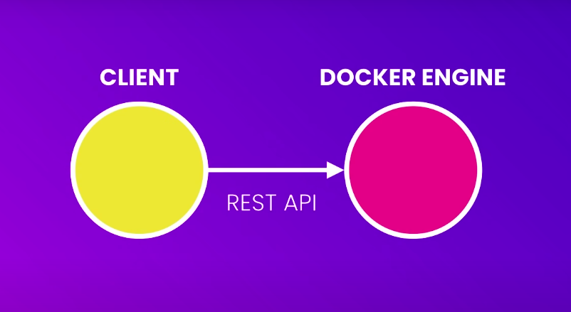
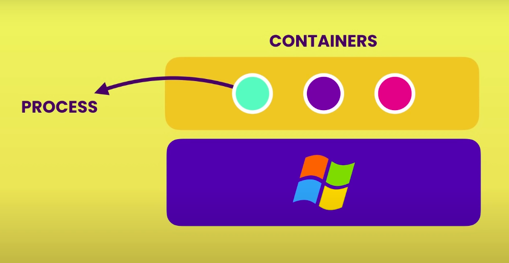
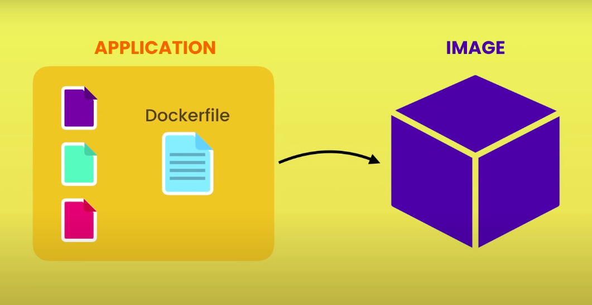

# What is Docker?

**Docker** is a platform for building, running and shipping applications in a consistent manner the same way it does in development.

---

# Why Docker?

### Solving the "But it runs on my machine" problem

Sometimes a situation may arise where the application runs on the local development machine but doesn't run on another machine or the production machine. There are three reasons why this may happen:

- One or more files are not included as part of deployment, i.e. the app is not completely/correctly deployed.
- Software version mismatch on current and target machine. Let's say your application requires Node v16, but target machine is running Node v9.
- Different configuration settings, for e.g. different environment variables.

This is where Docker comes to the rescue. With Docker, we can easily package our application with everything it needs to run it anywhere, on any machine with Docker. So if it runs on the development machine, it will also run on the test and production machines.

### Plug and play for a new Team Member

If someone joins your team, they don't have to spend half-a-day setting up a new machine to run the application. With Docker they don't have to run and configure all the dependencies.

They simply tell Docker to compose up the application using **`docker-compose up`**, and Docker automatically downloads and run these depedencies inside an isolated environment called a **`container`**. This is the beauty of Docker that it allows isolated containers containing Docker applications, running different versions of the software side-by-side on the same machine without messing with each other.

### Removing applications and their dependencies from local machines without breaking other applications

When we don't want to work with an application anymore and want to remove it and all it's dependencies in one go. 

**Without Docker**, as we work on different projects, our development machine gets cluttered with many libraries and tools, used by different applications. After a while, we don't know if we can remove one or more of these tools because we are afraid it would break some other application. This is also true for updating, for e.g. updating Nodejs, might break older versions running a lower version of Nodejs which would lose support in the new update. Since Nodejs is installed globally, this might cause some apps to not run anymore.

**With Docker**, we won't have to worry about this because each application runs with its dependencies in its own isolated container. We can simply remove an application and all its dependencies with a simple command - **`docker-compose down --rmi all`**

---

# Virtual Machines vs Containers

A **Virtual Machine** is an abstraction of a machine (physical hardware). We can run several virtual machines on a real, physical machine. For e.g. we can have one Mac machine and run two virtual machines - one running Windows, one running Linux. We do this by using a tool called Hypervisor. 

A **Hypervisor** is a software we used to create and manage virtual machines. There are many Hypervisor's out there like VirtualBox or VMWare (cross-platform) and Hyper-v (Windows only).

A **Container** is an isolated environment for running an application.

The difference between Virtual Machines and Containers are as follows: 

| Virtual Machine | Container |
| --------------- | --------- |
| Allow running multiple applications in isolation. | Allow running multiple applications in isolation. |
| Each Virtual Machine needs a full-blown OS that needs to be licensed, patched and monitored. | Containers share the OS of the host, thus only one OS needs to be licensed, patched and monitored. Technically it shares the kernel of the host |
| Virtual Machines run only on a physical machine. | Container can run on a machine or a virtual machine. |
| Virtual Machines are slow to start as the entire OS has to be loaded just like any computer. | Containers are faster to start as they only load the application, usually in second(s) |
| Virtual Machines are resource intensive because each Virtual Machine takes up actual CPU resources like CPU, memory and disk space. Since each virtual machine requires CPU resources allocated specifically to it, we can only run a finite number of Virtual Machine on a single machine. | Containers are lightweight and less resource intensive as they do not require a full-blown OS. A single host can run tens or hundreds of containers. |

---

# Architecture of Docker

Docker uses a Client-Server architecture, where the client component takes to the server component using a RESTful API. The server also called the **Docker Engine** sits on the background and takes care of building and running Docker containers.



Technically a Container is just a process that runs on your computer just like other processes but it's a special type of a process, that will be discussed below.



As discussed earlier, 
Containers share the OS of the host, more technically it shares the kernel of the host.

A **Kernel** is the core of an OS. A kernel is the code that runs on the CPU responsible for managing applications and hardware resources. These kernels have different APIs, that's why a Windows application on a Linux or a Mac because under the hood, the application is to talk to the kernel of the OS.
> On a Linux machine we can only run Linux containers.
> On a Windows machine, Windows 10 and above, we can run both Windows and Linux containers, because Windows 10 ships with a custom built Linux kernel in addition to the Windows kernel.
> MacOS has it's own kernel which is different from Windows and Linux kernels. This kernel doesn't have native support for containerized applications. So Docker on Mac, uses a lightweight Virtual Machine to run Linux containers.

---

# Installing Docker

Docker has two products. The main core product - **[Docker Engine](https://docs.docker.com/engine/)** and **[Docker Desktop](https://docs.docker.com/desktop/)**. The Docker Desktop is a Graphical User Interface for Docker Engine and requires setting up a virtual machine to run it which is a bit of a pain. The only  thing we need to do is to install the Docker Engine and have access to all the features via the terminal.

Once we have installed Docker, we can check the version of the Docker Engine by running the following command:

```
sudo docker version
```

---

# Development Workflow

The main idea is to take an application and "Dockerize" it, i.e. allow it to be run by Docker. We do this by adding a Docker file.

A **Docker File** is a plaintext file that tells Docker how to package the application into an image. This image contains everything needed to run the application.



A Docker image typically contains:- 

- A stripped down version of the OS.
- A runtime environment (e.g. Node).
- Application files
- Third-party libraries
- Environment variables, and so on.

Once we have an image, we ask Docker to start a container using that image. A container as discussed earlier, is a process, but it is a special kind of process because it has its own File System that is provided by the image. So, our application gets loaded inside a container or process.

This is how we run our application locally on our development machine: Instead of running the application directly and running it inside a typical process, we tell Docker to run it inside a container - an isolated environment.

```
docker run <imageName>
```

The beauty of Docker is that once we have the image we can push it to a Docker registry like Docker Hub. 

**Docker Hub** to Docker is like Github to Git - it's a storage for Docker images that anyone can use.

Once our application is on Docker Hub, we can run it on any machine that has Docker installed. This way, the same version at development can also be used at production.

Thus, with Docker, we no longer need to maintain long, complex release documents, that need to be precisely followed. 

To **summarize** the development workflow, we have the following steps:

- All the instructions for building an image of an application is written in a Docker File.
- With the Docker file we can package our application into an Image.
- This Image is pushed to a Docker registry like Docker Hunb and can be downloaded and ran virtually anywhere.

---

# Docker in Action

The standard deployment instructions are as follows: 

- Start with an OS, e.g. Ubuntu 20.04.
- Install a runtime like Nodejs.
- Copy app files.
- Install dependencies.
- Run exectuable files, e.g. `node app.js`

If we are working with a really complex application, we will end up with a complex release document that has to precisely followed.

To pack, deploy and ship with Docker we need to follow the following steps instead:

- Add a file called `Dockerfile` (with a capital D) to our project. This file provides Docker instructions how to package the application into an image.
- Inside the `Dockerfile` add the `FROM` instruction to tell Docker which Base Image to use. Docker images can be found in the [Docker Hub](https://hub.docker.com/search?q=node), which is a registry for Docker images.
    
    - E.g. `FROM ubuntu:20.04`, and install Node on top of it.
    
    OR we can start from a Node base image, which is already built on top of Linux, 
    
    - e.g. `FROM node:lts-slim` and install Node on top of it.

- Add the `COPY` instruction to tell Docker where to copy the application files in the Image File System.
- Optionally, the `WORKDIR` instruction can be used to tell Docker where to run the application from. 
    
    e.g. `WORKDIR /app`

- Finally, the `CMD` instruction tells Docker how to run the application.

    e.g. `CMD node app.js` or `CMD [ "node", "app.js" ]`

- Go to the Terminal and run the following command to package the application and build the image:

    **Syntax:**
    ```
    docker build -t hello-docker .
    ```

    Where, 
    - `t` is the tag name,
    - `hello-docker` is the name of the image, and
    - `.` is the current directory.

- On running the command, the Docker Image is created, but nothing appears in the directory. That's because Docker doesn't store the image here. In fact, the Image is not a single file. Instead, it stores it in the local Docker Registry. To see all the images on the local machine, run the command: 

    ```
    docker images
    ```

    OR

    ```
    docker image ls
    ```

- Run `docker run hello-docker` to run the application.

- Once Published to Docker Hub, the image can be pulled on any machine that has Docker using, `docker pull <imageAddress>` and ran using `docker run hello-docker`.

---

# The Linux Command Line

Docker is based on basic Linux concepts. If you want to be productive and troubleshoot Docker issues easily, we need to know some basic Linux commands.

A list of linux commands can be found [here](/linux-shell-commands/)


### Linux Distributions or Linux Distros

Linux is an Open-Source software. Many individuals and communities have created their own version of Linux called Linux Distributions. Each distribution is made to fit specialized needs like running servers, desktop computers, mobile phones and so on.

Examples of Linux Distros are:

- Ubuntu
- Debian
- Alpine
- Fedora
- CentOS

> Most of these distributions, support the same set of commands but some may have differences.


### Running Linux

As we learned earlier, we can use `docker pull` to pull an image from Docker Hub. 
However we can run, `docker run ubuntu` to start a container with this image if the image is available locally. However, if the image does not exist it is pulled first behind the hood before a container is started.

We can use, `docker run -d ubuntu` to run the image in the background. This will start the container in the background and return immediately.

- **To see current running processes, we can run the command:**
    
    ```
    docker ps
    ```
    
- **To see all processes including ones' stopped, we can run the command:**   
    
    ```
    docker ps -a
    ```

- **To start a container and interact with it, we need to run the following command:**
    
    ```
    docker run -it ubuntu
    ```

    Where,
    - `-it` is the combination of the interactive mode and terminal flag, which tells Docker to start an interactive shell or bash inside the container and wait for inputs.

    The bash or "Bourne Again Shell" is a program that takes commands and passes it to the kernel (here: the Linux kernel) for execution.

    The shell is started as, `root@38b186120e02:/#`, where,

    - `root` is the current logged in user. `root` is the root user with highest privileges.
    - `@38b186120e02` is the container ID
    - `/` represents where the current working directory is, in this case it is the root directory of the container's file system.
    - `#` represents the prompt that the current user has the highest privileges as it is the root user. If a normal user instead of a root user was logged in, you'd see a `$` prompt instead.

    > - Linux is a case-sensitive operating system.
    > - In Linux the forward slash `/` is used as the directory separator unlike Windows where the backslash `\` is used.

---

# Images vs Containers

We have been talking about Images and Containers. Let us try to understand the difference between the two:- 

| Image | Container |
| ----- | --------- |
| An image is a package or a template, just like a VM Template, that you may have worked with in the virtualization world. | Containers are running instances of images that are isolated and have their own environments and set of processes.

---

# PORT Mapping

When we run a containerized web application, it runs and we are able to see that the server is running. But how does an user access the application?

Let's say the application is listening on PORT 5000. So technically, one should be able to access the application on PORT 5000. But what IP does one use to access it from the web browser?

There are two options:-

- To use the IP of the Docker container. Every Docker container gets an IP address assigned by default (172.17.0.1). But this is an internal IP and is only accessible within the Docker host. So if we open a browser from the Docker host and try to access the application, using `http://172.17.0.1:5000`, we will be able to access it. But since this is an internal IP, users outside of the Docker host will not be able to access the application.

- We could use the IP of the Docker host, e.g. 192.168.1.5. But for this to work, we must have mapped the port inside the Docker container to a free port on the Docker host.
**For example:** If you want the users to access the application through Port 80 on the Docker host, we could map Port 80 of the localhost to Port 5000 of the Docker container using the `-p` flag.

  ```
  docker run -p 80:5000 hello-docker
  ```
    
  - The user can access the application by going to the URL, `http://192.168.1.5:80`. All traffic on Port 80 on the Docker Host will be routed to Port 5000 on the Docker Container.
  This way multiple instances of the Docker application can be run on the same Docker host on multiple ports.

  ```
  docker run -p 5000:8000
  ```

---

# Persisting Data


