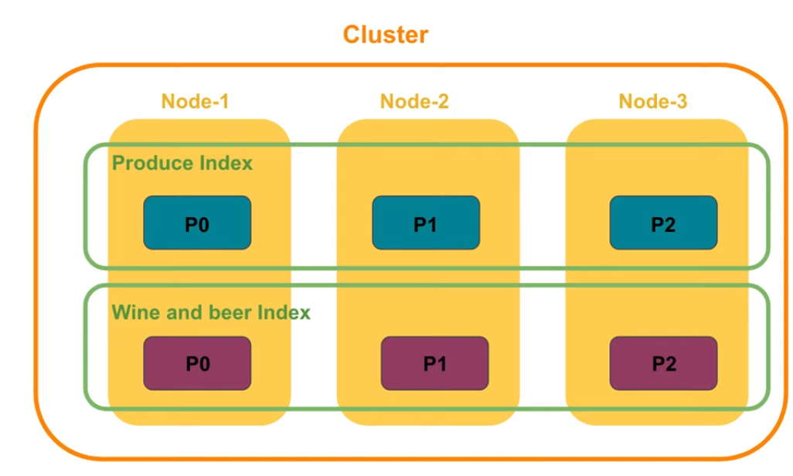

# Table of Contents

- [Table of Contents](#table-of-contents)
- [What is the Elastic Stack?](#what-is-the-elastic-stack)
- [Use Cases](#use-cases)
- [Understand an Use Case of Elasticsearch and Kibana](#understand-an-use-case-of-elasticsearch-and-kibana)
- [Installation](#installation)
- [Configuration](#configuration)
- [Architecture of Elasticsearch](#architecture-of-elasticsearch)
  - [Nodes and Clusters](#nodes-and-clusters)
  - [Documents](#documents)
  - [Index](#index)
  - [Shard](#shard)
    - [Benefits of Sharding](#benefits-of-sharding)
      - [Horizontal Scaling](#horizontal-scaling)
      - [Search Optimization](#search-optimization)
    - [Replica Shards - Handling Node Failures](#replica-shards---handling-node-failures)
- [Architecture of Kibana](#architecture-of-kibana)
  - [Data View (formerly Index Pattern)](#data-view-formerly-index-pattern)
- [C.R.U.D. Operations with Elasticsearch and Kibana](#crud-operations-with-elasticsearch-and-kibana)
  - [CREATE Index](#create-index)
  - [CREATE, UPSERT a Document (create Index if Index doesn't exist)](#create-upsert-a-document-create-index-if-index-doesnt-exist)
    - [CREATE a new Document with unknown ID](#create-a-new-document-with-unknown-id)
    - [UPSERT or CREATE a Document with known ID](#upsert-or-create-a-document-with-known-id)
    - [CREATE without Overwriting](#create-without-overwriting)
  - [GET a single Document](#get-a-single-document)
  - [GET all Documents in an Index or multiple Indices](#get-all-documents-in-an-index-or-multiple-indices)
  - [UPDATE a Document](#update-a-document)
  - [DELETE a Document](#delete-a-document)
  - [GET an Index](#get-an-index)
  - [DELETE an Index](#delete-an-index)
- [Relevance of a Search](#relevance-of-a-search)
  - [Terminology](#terminology)
  - [Measuring Relevance](#measuring-relevance)
    - [Precision](#precision)
    - [Recall](#recall)
    - [Relationship between Precision and Recall](#relationship-between-precision-and-recall)
    - [Ranking](#ranking)
      - [Term Frequency (TF)](#term-frequency-tf)
      - [Inverse Document Frequency (IDF)](#inverse-document-frequency-idf)
- [Fine-tuning Precision or Recall using Elasticsearch and Kibana](#fine-tuning-precision-or-recall-using-elasticsearch-and-kibana)
  - [GET all Documents from an Index](#get-all-documents-from-an-index)
  - [GET exact number of hits](#get-exact-number-of-hits)
  - [GET data within a time range](#get-data-within-a-time-range)
  - [GET the summary of a field in the dataset](#get-the-summary-of-a-field-in-the-dataset)
  - [SEARCH the dataset combining QUERY and AGGREGATION to narrow a search](#search-the-dataset-combining-query-and-aggregation-to-narrow-a-search)
  - [SEARCH using the `match` QUERY](#search-using-the-match-query)
    - [`operator: or`](#operator-or)
    - [`operator: and`](#operator-and)
    - [Using `minimum_should_match` parameter](#using-minimum_should_match-parameter)
  - [FULL TEXT SEARCH](#full-text-search)
    - [What is a Full Text Search?](#what-is-a-full-text-search)
    - [The Problem with using `match` query to make PRECISE Full Text Searches](#the-problem-with-using-match-query-to-make-precise-full-text-searches)
    - [The `match_phrase` query](#the-match_phrase-query)
    - [FULL TEXT SEARCH without knowing User's Search Context](#full-text-search-without-knowing-users-search-context)
      - [The `multi_match` query](#the-multi_match-query)
      - [Per-field Boosting](#per-field-boosting)
      - [Using the `multi_match` query to Search a Phrase](#using-the-multi_match-query-to-search-a-phrase)
      - [Using the `multi_match` query with `"type": "phrase"` to improve PRECISION](#using-the-multi_match-query-with-type-phrase-to-improve-precision)
  - [SEARCH using `bool` Query - Combination of Multiple Queries](#search-using-bool-query---combination-of-multiple-queries)
- [Aggregations](#aggregations)
  - [Setup: Importing Data into Elasticsearch and Optimizing It to run Aggregations](#setup-importing-data-into-elasticsearch-and-optimizing-it-to-run-aggregations)
  - [Running an Aggregation](#running-an-aggregation)
  - [Limiting the scope of an Aggregation](#limiting-the-scope-of-an-aggregation)
  - [Types of Aggregations](#types-of-aggregations)
    - [Metric Aggregations](#metric-aggregations)
      - [Calculating the `sum` of a field in a Dataset](#calculating-the-sum-of-a-field-in-a-dataset)
      - [Finding the `min` of a field in a Dataset](#finding-the-min-of-a-field-in-a-dataset)
      - [Finding the `max` of a field in a Dataset](#finding-the-max-of-a-field-in-a-dataset)
      - [Calculating the `avg` of a field in a Dataset](#calculating-the-avg-of-a-field-in-a-dataset)
      - [Stats Aggregation - Calculating the `count`, `sum`, `min`, `max`, `avg` of a field in a Dataset in a single go](#stats-aggregation---calculating-the-count-sum-min-max-avg-of-a-field-in-a-dataset-in-a-single-go)
      - [Calculating the `cardinality` (unique values) of a field in a Dataset](#calculating-the-cardinality-unique-values-of-a-field-in-a-dataset)
      - [Metric Aggregations within a Subset of the Dataset](#metric-aggregations-within-a-subset-of-the-dataset)
    - [Bucket Aggregations](#bucket-aggregations)
      - [Date Histogram Aggregation](#date-histogram-aggregation)
        - [`fixed_interval`](#fixed_interval)
        - [`calendar_interval`](#calendar_interval)
        - [Bucket Sorting for Date Histogram Aggregation](#bucket-sorting-for-date-histogram-aggregation)
      - [Histogram Aggregation](#histogram-aggregation)
        - [Bucket Aggregation for Histogram Aggregation](#bucket-aggregation-for-histogram-aggregation)
      - [Range Aggregation](#range-aggregation)
      - [Terms Aggregation](#terms-aggregation)
        - [Bucket Sorting for Terms Aggregation](#bucket-sorting-for-terms-aggregation)
    - [Pipeline Aggregations](#pipeline-aggregations)
      - [Combining Aggregations](#combining-aggregations)
      - [Calculating Multiple Metrics per Bucket](#calculating-multiple-metrics-per-bucket)
      - [Sorting by Metric Value of a Sub-Aggregation](#sorting-by-metric-value-of-a-sub-aggregation)
- [Mapping](#mapping)
  - [How does Indexing work?](#how-does-indexing-work)
  - [Dynamic Mapping](#dynamic-mapping)
  - [View the Mapping](#view-the-mapping)
  - [Indexing Strings](#indexing-strings)
    - [Text Field Type](#text-field-type)
      - [Text Analysis](#text-analysis)
      - [Inverted Index](#inverted-index)
    - [Keyword Field Type](#keyword-field-type)
      - [Doc Values](#doc-values)
  - [Optimizing Mapping](#optimizing-mapping)
  - [Explicit Mapping](#explicit-mapping)
  - [Dealing with a Change in the Field Type](#dealing-with-a-change-in-the-field-type)
  - [Runtime Fields](#runtime-fields)
    - [Creating a Runtime Field](#creating-a-runtime-field)
  - [Runtime Field in Action](#runtime-field-in-action)
- [Create API key](#create-api-key)
- [Invalidate API Key](#invalidate-api-key)
- [Running Elasticsearch Requests from the Client](#running-elasticsearch-requests-from-the-client)
  - [Connecting and Sending Requests using `@elastic/elasticsearch` JavaScript Client](#connecting-and-sending-requests-using-elasticelasticsearch-javascript-client)
      - [Using TLS as Authentication method](#using-tls-as-authentication-method)
      - [Using API Key as Authentication method - To run in multiple clusters instead of passing certificate](#using-api-key-as-authentication-method---to-run-in-multiple-clusters-instead-of-passing-certificate)
      - [Making Requests](#making-requests)
  - [Connecting and Sending Requests using `axios`](#connecting-and-sending-requests-using-axios)
      - [Using TLS as Authentication method](#using-tls-as-authentication-method-1)
      - [Using API key as Authentication method](#using-api-key-as-authentication-method)
      - [Making Requests](#making-requests-1)
- [Cheatsheets](#cheatsheets)
  - [Elasticsearch - Basic C.R.U.D. Operations](#elasticsearch---basic-crud-operations)
  - [Elasticsearch - Queries](#elasticsearch---queries)
  - [Elasticsearch - Aggregations](#elasticsearch---aggregations)
  - [Elasticsearch - Mappings](#elasticsearch---mappings)
- [FAQs](#faqs)
    - [How does Elasticsearch compare to RDBMS like SQL Server?](#how-does-elasticsearch-compare-to-rdbms-like-sql-server)
    - [Are Elasticsearch `nodes` similar to Tables and `clusters` similar to Servers like in SQL Server?](#are-elasticsearch-nodes-similar-to-tables-and-clusters-similar-to-servers-like-in-sql-server)
    - [Do the `nodes` use cache to find the data that is being searched?](#do-the-nodes-use-cache-to-find-the-data-that-is-being-searched)
    - [Are Linux commands same as the MAC Terminal?](#are-linux-commands-same-as-the-mac-terminal)
    - [What is the best way to perform `sharding` on one `node`?](#what-is-the-best-way-to-perform-sharding-on-one-node)
    - [What are some disadvantages to using Elastic Stack?](#what-are-some-disadvantages-to-using-elastic-stack)
    - [Does Elasticsearch have support to secure ports? Authentication/tokens etc. ?](#does-elasticsearch-have-support-to-secure-ports-authenticationtokens-etc-)
    - [If you have several different queries to sort the search results, can you combine them into one request?](#if-you-have-several-different-queries-to-sort-the-search-results-can-you-combine-them-into-one-request)
    - [Is Aggregated Result based on shard level?](#is-aggregated-result-based-on-shard-level)
    - [Does the `range` aggregation include bookends? Are there duplicates at the 50.0 and 200 range limits if we have ranges from 0-50, 50-200, 200+?](#does-the-range-aggregation-include-bookends-are-there-duplicates-at-the-500-and-200-range-limits-if-we-have-ranges-from-0-50-50-200-200)
    - [What about Time Weighted Average, is it possible?](#what-about-time-weighted-average-is-it-possible)
- [References](#references)

# What is the Elastic Stack?

The Elastic Stack is free and open and is a stack consisting of four products:-

1. **ElasticSearch** - A powerful search and analytics engine and the heart of the Elastic Stack.
2. **Logstash** - Server-side data processing pipeline that allows data collection from various sources, transform it and send it to the destination.
3. **Kibana** - A web interface to visualize and analyze the data stored in Elasticsearch.
4. **Beats** - Single-purpose data shippers that send data from systems to Logstash or Elasticsearch.

These products can be mixed and matched to serve a specific use case.

If you are a developer working with data, the Elastic Stack is a great tool to have on your belt.
With the Stack, you can take data from any source and any format, then search, analyze and visualize the data in real-time.

Elastic Stack is used by many companies like: Tinder, Twilio, GitHub, Samsung, Docker, Adobe, InstaCart, Grubhub, Shopify.

In **Uber**, Elastic is the engine that powers the marketplace that connects you to the driver.
In **Yelp** it is the search engine that helps you find open restaurants!

---

# Use Cases

The popular use cases of using the Elastic Stack are:-

- **Logging** - The Elastic Stack is used to store and analyze log gamer and server events by Activision Blizzard. So if the players experience a slowdown or error, their monitoring team would use the Elastic Stack to figure out what is causing it.
- **Metrics** - The Mars Curiousity Rover sends telemetry, sensor and photo data into the Elastic Stack for analysis. So if someone wanted to know the temperature on Mars on an hourly basis, one can go and follow the data.
- **Security Analytics** - Elastic Stack can be used to analyze security issues and threats. Slack uses Elastic Stack in their Security Operations Center to secure communications through their channels.
- **Business Analytics** - Tinder uses Elastic Stack to facilitate matchmaking using geolocations to match two people together. Tinder also uses it to make predictions on which people one would likely swipe right on or be swiped right on by other users.

---

# Understand an Use Case of Elasticsearch and Kibana

**Situation:**
Imagine you are the lead developer responsible for building and maintaining an online grocery store. Using the search bar, millions of customers would be searching for products they want to buy.

**Current Architecture:**
The current architecture is a Fullstack app, connected to a database that contains all product data along with other data that we are connecting from the app.
When the customer searches for a product on the online store, the request is sent to the server, which in turn looks up the product from the database. The database, sends the response back to the server which is then served back to the customer on the customer's browser.

**Analysis:**
Having a great search experience is key to having customers buy and keep coming back to the platform and we want customers to get fast and relevant results, no matter the scale. With the current architecture setup, the chances are we are working with a huge product dataset stored in a relational database and the data is scattered among multiple tables and fetching data from these tables, could cause a lag in getting search results to your customers, and that could be a huge turnoff.

Another important factor in search results is relevancy. The whole point of search is finding relevant data fast and we want to set criteria to have the most relevant results up at the top and least relevant at the bottom.
For example:

- Let's say a customer is searching for peanut butter and there are ton of different brands. But what if the customer wanted to see peanut butter from the highest-to-lowest rated brands.
- The customer is searching for "Sriracha" but may not be sure of the spelling and spells it as "Srirracha" or "Srirarrachah". We would still like to pull up relevant search results even though the customer's spelling doesn't exactly match the product data. Traditional databases are not equipped to handle all of that.

We are in a situation where speed and relevance of our search is an important aspect of the work, **Elasticsearch** could come in very handy.

Kibana is a web interface to the data stored in Elasticsearch.

---

# Installation

1. [Install with Docker](https://www.elastic.co/guide/en/elasticsearch/reference/current/docker.html)
2. [Install on Linux or MacOS](https://www.elastic.co/guide/en/elasticsearch/reference/current/targz.html)
3. [Install on Windows](https://www.elastic.co/guide/en/elasticsearch/reference/current/zip-windows.html)
4. [Install with Debian Package](https://www.elastic.co/guide/en/elasticsearch/reference/current/deb.html)
5. [Install with RPM](https://www.elastic.co/guide/en/elasticsearch/reference/current/rpm.html)

---

# [Configuration](https://www.elastic.co/guide/en/elasticsearch/reference/current/important-settings.html)

When Elasticsearch is run, it creates a default node and a cluster. To modify the cluster name and the node name, we need to edit the `elasticsearch.yml` file.

---

# Architecture of Elasticsearch

## Nodes and Clusters

Elasticsearch is a powerful search and analytics engine and is known for its distributed nature, speed and scalability and this is due to its unique architecture.

When Elasticsearch is running we have an instance of Elasticsearch also known as a node. Each node has an unique-ID and name and it belongs to a single cluster. When we start a node, a cluster is formed automatically and one could have one or many nodes in a cluster. These nodes are distributed over several machines but they all belong to the same cluster.


Just like all team members with different roles are still part of a single team that works towards it's own collective goal, the same analogy applies for nodes (team members) and their cluster (team).

One of the roles a node could be assigned to is to hold data.

## Documents

Data is stored as documents. A document is a JSON object that is stored in Elasticsearch under an unique-ID.

A document for a grocery item may look like this:

```json
{
  "name": "Bananas (1 doz)",
  "category": "Fruits",
  "brand": "Reliance Fresh",
  "price": 30
}
```

## Index

An index is a group of related documents.

Things are much easier to find when we group them in a logical manner.
Documents that share similar traits and are related to each other, are grouped into an index.
For example documents of Celementines and Baby Carrots would be grouped under the Produce Index.


## Shard

The index itself doesn't store documents. It's just a virtual entity that keeps of where documents are stored. We cannot find an index on disk. What actually exists on disk is a shard.

A shard is where the data is stored and where the actual search is run.

In the image below **P0**, **P1**, **P2** refer to a shard each on the respective Indices.



When an Index is created, one Shard is created by default and the Shard is assigned to a Node. The number of documents a shard can hold depends on the capacity of the Node.

### Benefits of Sharding

#### Horizontal Scaling

Suppose you want to index 600K documents on your Produce Index but the Node where the Shard is assigned to can hold only 200K documents. That's not going to be possible on the same shard on the same node for the same index. What we can do is, create two additional shards in the Produce Index and distribute them across two additional nodes (one for each Shard). Now each shard can hold 200K documents each and together they hold 600K documents.

But that maybe fine for the time-being but our Produce data is only going to grow. How can we adapt to increasing data?

That is the beauty of sharding, where we can add more shards and nodes as the need arises, and thus horizontally scale to ever increasing data.

#### Search Optimization

Let's take a scenario where we have a client sending a search for Pink Lady Apples.

**Setup 1**
we have 1 x Shard that is assigned to 1 x Node that can hold the entire Produce Index of 500,000 documents.

We are going to run the search on the single Shard, meaning we will go through 500,000 documents, sequentially. Let's assume the search takes 10 seconds to go through 500,000 documents.

**Total Time Taken for Search:** <= 10 seconds

**Setup 2**
We have 10 x Shard that is distributed among 10 Nodes, and we have distributed the 500,000 documents across 10 Shards, so that each shard now holds 50,000 documents each.

In the previous scenario, it took us 10 seconds to search 500,000 documents, sequentially on 1 x Shard. Thus, here, each Shard takes 1 second (500,000 / 50,000) to process a search query. What's cool about this setup is that we could a run a search on all 10 of these shards at the same time in parallel.

Having 10 Shards up and running on 10 Nodes, mean that the search time for 500,000 queries is just 1 second.

**Total Time Taken for Search:** <= 1 second

The benefits of the second setup is that, not only do we have the capacity to store more data, we can now Search at scale.

### Replica Shards - Handling Node Failures

Suppose one of our nodes go down and we lose all the data! That is a nightmarish scenario to be avoided at all costs!

What we could do to handle this situation, is create copies of our original shards and store the copies across different Nodes. These copies are called **Replica Shards**.

Replica Shards have one more additional benefit - They can improve Search performance!
Since Replica Shards are exact copies of the original it can share the load of the search queries on the original shard and cut search times exponentially by the number of replicas.

---

# Architecture of Kibana

## [Data View (formerly Index Pattern)](https://www.elastic.co/guide/en/kibana/current/data-views.html)

Kibana requires a data view to access the Elasticsearch data that you want to explore. A data view selects the data to use and allows you to define properties of the fields.

A data view can point to one or more indices, [data streams](https://www.elastic.co/guide/en/elasticsearch/reference/8.3/data-streams.html), or [index aliases](https://www.elastic.co/guide/en/elasticsearch/reference/8.3/alias.html). For example, a data view can point to your log data from yesterday, or all indices that contain your data.

Suppose we have an index named `orders` containing Order data. Now we want to create a bunch of Kibana visualizations for the order data. This could be line, pie or bar charts showing orders over time, most popular products. For each of the visualizations, we need to tell Kibana, which indices to take the data from. Instead of entering the name of an index, we create a **`data view`**. That's because storing data in multiple indices is a common approach in Elasticsearch and so we want a more flexible approach.

A data view matches one or more Elasticsearch indices with a pattern that optionally includes wildcards. Since in this example we use only one index, we can simply use the name of the index as the pattern, i.e. `orders`. We might have to split the order data in the future into multiple indices, so keeping that in mind we can add .a wildcard at the end to make the pattern look like, `orders*`. This way, any additions of new indices with the prefix `orders` will be automatically added to the Data View.

Another example is Time Series Data which is a common use case with Elasticsearch and Kibana as the data is divided into multiple indices having a common prefix.
The solution is to use a `Data View` with a pattern that may look like, `access-logs*` for indices that are named `access-logs-2022-01`, `access-logs-2022-02`, `access-logs-2022-03` etc.

Data Views are also a requisite before we can interact with our data in Kibana.

---

# C.R.U.D. Operations with Elasticsearch and Kibana

To send GET requests, the syntax is:

```
GET _API/parameter
```

E.g.

```
GET _cluster/health
```

Get the health information from the cluster API.

## CREATE Index

**Syntax:**

```
PUT Name-of-the-Index
```

**Example:**

```
PUT fruits
```

**Response:**

```
{
  "acknowledged": true,
  "shards_acknowledged": true,
  "index": "fruits"
}
```

## CREATE, UPSERT a Document (create Index if Index doesn't exist)

Here, indexing a document refers to storing a document with a set index. When indexing a document both `POST` and `PUT` can be used along with the `_doc` endpoint

1. Use `POST` when you want Elasticsearch to autogenerate an `id` for the document.
2. Use `PUT` when you want to assign a specific id to your document(i.e. if your document has a natural identifier - purchase order number, patient id, & etc).

- Using the `_doc` endpoint. If the document with the `id` is present, it is overwritten.
- Using the `_create` endpoint instead of `_doc`. This ensures that if the document with the `id` is present, nothing is done.

### CREATE a new Document with unknown ID

**Syntax:**

```
# Using POST
POST Name-of-the-Index/_doc
{
  "field": "value"
}

# Using PUT with _doc
PUT Name-of-the-Index/_doc/id-you-want-to-assign-to-this-document
{
  "field": "value"
}

# Using PUT with _create
PUT Name-of-the-Index/_create/id-you-want-to-assign-to-this-document
{
  "field": "value"
}
```

**Example Request:**

```
/** Using POST */
POST fruits/_doc
{
  "name": "Apple",
  "color": "red",
  "climate": "cold",
  "price": "50.00"
}
```

**Success:**

```
{
  "_index": "fruits",
  "_id": "UHk2mYIBdN2v9X-7c8we",
  "_version": 1,
  "result": "created",
  "_shards": {
    "total": 2,
    "successful": 1,
    "failed": 0
  },
  "_seq_no": 2,
  "_primary_term": 1
}
```

### UPSERT or CREATE a Document with known ID

Create new Document if ID doesn't exist, overwrite if ID exists

**Example Request:**

```
# Using PUT with _doc
PUT fruits/_doc/UHk2mYIBdN2v9X-7c8we
{
  "name": "Orange",
  "color": "orange",
  "climate": "cold",
  "price": "40.00"
}
```

**Create Success:**

```
{
  "_index": "fruits",
  "_id": "UHk2mYIBdN2v9X-7c8we",
  "_version": 1,
  "result": "created",
  "_shards": {
    "total": 2,
    "successful": 1,
    "failed": 0
  },
  "_seq_no": 2,
  "_primary_term": 1
}
```

**Overwrite Sucess:**

```
{
  "_index": "fruits",
  "_id": "UHk2mYIBdN2v9X-7c8we",
  "_version": 4,
  "result": "updated",
  "_shards": {
    "total": 2,
    "successful": 1,
    "failed": 0
  },
  "_seq_no": 3,
  "_primary_term": 1
}
```

### CREATE without Overwriting

Returns an error JSON response if Document ID already exists. Only creates if Document ID provided is unique.

**Example Request:**

```
# Using PUT with _create
PUT fruits/_create/UHk2mYIBdN2v9X-7c8we
{
  "name": "Apple",
  "color": "red",
  "climate": "cold",
  "price": "50.00"
}
```

**Success:**

```
{
  "_index": "fruits",
  "_id": "UHk2mYIBdN2v9X-7c8we",
  "_version": 1,
  "result": "created",
  "_shards": {
    "total": 2,
    "successful": 1,
    "failed": 0
  },
  "_seq_no": 2,
  "_primary_term": 1
}
```

**Error:**

```
{
  "error": {
    "root_cause": [
      {
        "type": "version_conflict_engine_exception",
        "reason": "[UHk2mYIBdN2v9X-7c8we]: version conflict, document already exists (current version [1])",
        "index_uuid": "kf6EkE8pS8ytaujCAd1Itg",
        "shard": "0",
        "index": "fruits"
      }
    ],
    "type": "version_conflict_engine_exception",
    "reason": "[UHk2mYIBdN2v9X-7c8we]: version conflict, document already exists (current version [1])",
    "index_uuid": "kf6EkE8pS8ytaujCAd1Itg",
    "shard": "0",
    "index": "fruits"
  },
  "status": 409
}
```

---

## [GET a single Document](https://www.elastic.co/guide/en/elasticsearch/reference/current/docs-get.html)

Removes a JSON document from the specified index. You must specify the index name and document ID.

**Syntax:**

```
GET /<index>/_doc/<_id>
```

**Example:**

```
GET fruits/_doc/TXnjmIIBdN2v9X-728w8
```

**Success:**

```
{
  "_index": "fruits",
  "_id": "TXnjmIIBdN2v9X-728w8",
  "_version": 1,
  "_seq_no": 0,
  "_primary_term": 1,
  "found": true,
  "_source": {
    "name": "Apple",
    "color": "red",
    "climate": "cold",
    "price": "50.00"
  }
}
```

**Error:**

```
{
  "_index": "fruits",
  "_id": "TXnjmIIBdN2v9X-728w8",
  "found": false
}
```

---

## GET all Documents in an Index or multiple Indices

We can use the [Match All Query](https://www.elastic.co/guide/en/elasticsearch/reference/current/query-dsl-match-all-query.html) to get all documents that match a query. By using the index as part of the query, we can get all documents in the index.

**Syntax:**

```
# Get all Documents in an Index
GET /<index>/_search
{
  "query": {
    "match_all": {}
  }
}

# Get all Documents in multiple Indices
GET /<index1>,<index2>/_search
{
  "query": {
    "match_all": {}
  }
}
```

**Example:**

```
GET fruits/_search
{
  "query": {
    "match_all": {}
  }
}
```

**Success:**

```
{
  "took": 1,
  "timed_out": false,
  "_shards": {
    "total": 1,
    "successful": 1,
    "skipped": 0,
    "failed": 0
  },
  "hits": {
    "total": {
      "value": 1,
      "relation": "eq"
    },
    "max_score": 1,
    "hits": [
      {
        "_index": "fruits",
        "_id": "T3nxmIIBdN2v9X-7k8wh",
        "_score": 1,
        "_source": {
          "name": "Apple",
          "color": "red",
          "climate": "cold",
          "price": "50.00"
        }
      }
    ]
  }
}
```

**Error:**

```
{
  "took": 0,
  "timed_out": false,
  "_shards": {
    "total": 1,
    "successful": 1,
    "skipped": 0,
    "failed": 0
  },
  "hits": {
    "total": {
      "value": 0,
      "relation": "eq"
    },
    "max_score": null,
    "hits": []
  }
}
```

---

## [UPDATE a Document](https://www.elastic.co/guide/en/elasticsearch/reference/current/docs-update.html)

Enables you to script document updates. The script can update, delete, or skip modifying the document. The update API also supports passing a partial document, which is merged into the existing document. To fully replace an existing document, use the [index API](https://www.elastic.co/guide/en/elasticsearch/reference/current/docs-index_.html).

> **Note:** For a JSON object passed, the `doc` object has to be provided with the fields, and only the fields provided will be updated. The fields from the original document that are not provided, will be retained.

If it is a success, the version gets incremented by 1.

**Syntax:**

```
POST <index>/_update/<_id>
{
  "doc": {
    "field1": "value1",
    "field2": "value2"
  }
}
```

**Example Request:**

```
# Update a Document
POST fruits/_update/UXk7mYIBdN2v9X-7tMy5
{
  "doc": {
    "name": "Orange",
    "color": "orange",
    "climate": "cold",
    "price": "40.00"
  }
}
```

**Success:**

```
{
  "_index": "fruits",
  "_id": "UXk7mYIBdN2v9X-7tMy5",
  "_version": 6,
  "result": "updated",
  "_shards": {
    "total": 2,
    "successful": 1,
    "failed": 0
  },
  "_seq_no": 5,
  "_primary_term": 1
}
```

**Error:**

```
{
  "error": {
    "root_cause": [
      {
        "type": "document_missing_exception",
        "reason": "[UXk7mYIBdN2v9X-7tMy5]: document missing",
        "index_uuid": "hukan4UhTGiKF9JIySxuxA",
        "shard": "0",
        "index": "fruits"
      }
    ],
    "type": "document_missing_exception",
    "reason": "[UXk7mYIBdN2v9X-7tMy5]: document missing",
    "index_uuid": "hukan4UhTGiKF9JIySxuxA",
    "shard": "0",
    "index": "fruits"
  },
  "status": 404
}
```

## [DELETE a Document](https://www.elastic.co/guide/en/elasticsearch/reference/current/docs-delete.html)

Removes a JSON document from the specified index. You must specify the index name and document ID.

**Syntax:**

```
DELETE /<index>/_doc/<_id>
```

**Example:**

```
DELETE fruits/_doc/S3nVmIIBdN2v9X-7Fcz6
```

**Response:**

```
{
  "_index": "fruits",
  "_id": "S3nVmIIBdN2v9X-7Fcz6",
  "_version": 2,
  "result": "deleted",
  "_shards": {
    "total": 2,
    "successful": 1,
    "failed": 0
  },
  "_seq_no": 2,
  "_primary_term": 1
}
```

---

## GET an Index

**Syntax:**

```
GET Name-of-the-Index
```

**Example Request:**

```
GET fruits
```

**Success Response:**

```
{
  "fruits": {
    "aliases": {},
    "mappings": {},
    "settings": {
      "index": {
        "routing": {
          "allocation": {
            "include": {
              "_tier_preference": "data_content"
            }
          }
        },
        "number_of_shards": "1",
        "provided_name": "fruits",
        "creation_date": "1660421164194",
        "number_of_replicas": "1",
        "uuid": "uA2aHfg3SC-DSFPsAUAKzA",
        "version": {
          "created": "8030399"
        }
      }
    }
  }
}
```

**Error Response:**

```
{
  "error": {
    "root_cause": [
      {
        "type": "index_not_found_exception",
        "reason": "no such index [fruits]",
        "resource.type": "index_or_alias",
        "resource.id": "fruits",
        "index_uuid": "_na_",
        "index": "fruits"
      }
    ],
    "type": "index_not_found_exception",
    "reason": "no such index [fruits]",
    "resource.type": "index_or_alias",
    "resource.id": "fruits",
    "index_uuid": "_na_",
    "index": "fruits"
  },
  "status": 404
}
```

---

## DELETE an Index

**Deleting an index deletes its documents, shards, and metadata.** It does not delete related Kibana components, such as data views, visualizations, or dashboards.

You cannot delete the current write index of a data stream. To delete the index, you must [roll over](https://www.elastic.co/guide/en/elasticsearch/reference/current/data-streams.html#data-streams-rollover) the data stream so a new write index is created. You can then use the delete index API to delete the previous write index.

**Syntax:**

```
DELETE Name-of-the-Index
```

**Example Request:**

```
DELETE fruits
```

**Response:**

```
{
  "acknowledged": true
}
```

---

# Relevance of a Search

We search for things on a daily basis and as developers, search is our lifeline. We go straight to the search bar and hope someone has figured it out and shared it online. It's frustrating when we are searching for something and not getting what we are looking for and that is what relevance is all about.

As we know Elasticsearch stores data as documents and documents that share similar traits are grouped in an Index. When a search query is sent, Elasticsearch retrieves relevant search results and then presents the documents as search results.

We would ideally want what we search for to result in search results that are directly related to what we are looking for. This begs the question: **"How do we measure the relevance of a search?"**

Before we explore that question, there is some terminology we must know:

## Terminology

When a search query is sent, Elasticsearch retrieves documents that it considers relevant. In the diagrams below, the dots inside the white circle are returned by the search engine and the dots in the yellow region are not returned by the search engine.

1. **True Positives** - Relevant results that are returned to the user and are correctly returned by the search engine.
2. **False Positives** - Irrelevant results that are returned to the user and are incorrectly returned by the search engine.


3. **True Negatives** - Irrelevant results that are not returned to the user and are correctly rejected by the search engine.
4. **False Negatives** - Relevant results that are not returned to the user and are incorrectly rejected by the search engine.


---

## Measuring Relevance

Two factors that we can use to measure relevance are:

1. **Precision** - What portion of the retrieved data is actually relevant to the search query.
2. **Recall** - What portion of relevant data is being returned as search results.

### Precision

**Precision** calculates the percentage of relevant search results returned by the search engine against the total search results returned.

**Precision = True Positives / (True Positives + False Positives)**


### Recall

Recall calculates the percentage of relevant search results returned against the total relevant search results that exist.

**Recall = True Positives / True Positives + False Negatives**


### Relationship between Precision and Recall

Precision and Recall are inversely related.

<!--prettier-ignore-->
| Precision | Recall |
| --------- | ------ |
| Wants all retrieved results to be a perfect match to the query | Wants to retrieve more results even if documents may not be a perfect match to the query |
| Focuses on quality of the search results | Focuses on quantity of the search results |

On one hand, we would like to return precise search results but we also want to retrieve as many results as possible. As we can see, these two factors are at odds with each other.

Precision and Recall determine which results are included in the search results.
But, Precision and Recall do not determine which of these included documents are more relevant compared to the other. This is determined by **Ranking**.

### Ranking

Ranking refers to the ordering of the results (from the most relevant search results at the top, to the least relevant search results at the bottom).

This ranking is usually determined by a scoring algorithm.
The score is a value that represents how relevant a document is to that specific query and is computed for each document that is a hit. The ones with the highest score are displayed at the top and the ones with the lowest score are displayed at the bottom.

So the higher the score a hit has, the more relevant the document is to the query and is going to end up higher in the returned search results.

There are multiple factors that are used to compute a Document's score.

Let's focus on two of these factors:

1. **Term Frequency (TF)** - The more times that a search term appears in the field we are searching in a document, the more relevant that document is.
2. **Inverse Document Frequency (IDF)** - The more documents that contain a search term in the field that we are searching, the less important that term is.

#### Term Frequency (TF)

**Term Frequency (TF)** determines how many times each search term appears in a document.
If search terms are found in high frequency in a document, the document is considered more relevant to the search query.

In the following example, suppose our search query is **"How to form good habits"**:

```json
[
  {
    "title": "Atomic Habits",
    "author": "James Clear",
    "category": "self-help",
    "description": "No matter your goals, Atomic Habits offers a proven framework for improving every day. James Clear, ....habits...habits...habits."
  },
  {
    "title": "The Mental Toughness Handbook",
    "author": "Damon Zahariades",
    "category": "self-help",
    "description": "Imagine boldly facing any challenge that come your way... 5 daily habits you must embrace to strengthen your mind and harden your resolve. Why willpower and motivation are unreliable..."
  }
]
```

The query is made up of multiple search terms: **`How`**, **`to`**, **`form`**, **`good`**, **`habits`**. Elasticsearch will go through the returned documents and calculate how many times the search terms appear in each document. This is known as Term Frequency.

If a document mentions search terms more frequently, Elasticsearch assumes that this document is more relevant to the search query and will assign a higher score to that document.

Let's say we are looking for the frequency of the term **`habits`**,

- In the `description` field of the first document returned, the word `habits` occurs `4` times.
- In the `description` field of the second document returned, the word `habits` occurs only `1` time.

Hence the first document is ranked higher in the order because of a higher Term Frequency and thus a higher score.

#### Inverse Document Frequency (IDF)

If we use **Term Frequency (TF)** alone to rank results, this will not accurately rank search results. This is because Term Frequency considers all search terms in a query to have equal weight when assessing relevance of a document.

Let's consider our search query is **"How to form good habits"**:

Now consider the following documents:

- How to form a meetup group
- How to form a band
- Good Habits 101
- Good chicken recipe
- Good times rolling
- Good habits are easy to master

Among these documents, some of the documents like **`How to form a meetup group`** or **`Good chicken recipe`** contain some of the search terms but these documents are completely irrelevant to what we are looking for. But because of Term Frequency, if these commonly found search terms were found in high frequency in any of these documents, these documents are going to end up with higher scores, EVEN THOUGH they are irrelevant to the query.

Elasticsearch offsets this with **Inverse Document Frequency (IDF)**. So with Elasticsearch, if certain search terms are found in many documents in the result set, it knows that these terms are not useful at determining relevance. So when Elasticsearch goes through all the hits, it will reduce the score for documents with unimportant search terms and it will increase the score for documents with important search terms, like, in this case: **`habits`**.

---

# Fine-tuning Precision or Recall using Elasticsearch and Kibana

**Setup:**
Let's put some data into Elasticsearch.

- **Download** the [News Headlines Dataset from Kraggle](https://www.kaggle.com/rmisra/news-category-dataset).
- **Upload** it into Elasticsearch using the File Uploader in Kibana.
- When we push data into Elasticsearch, it groups the data into an index. **Name the index**. E.g. - **`news_headlines`**
- Check the **Create a Data View** checkbox (required to visualize data in Kibana).
- Click **Import** to complete the Import.

Kibana's role here is to visualize and explore data we uploaded to Elasticsearch by using the created Data View.

We have two goals right now:

- Search for Information
- Fine-tune Precision and Recall of our search results

There are two main ways of searching for data within Elasticsearch and these are with,

1. **Queries** - Instructs Elasticsearch to retrieve documents that match the criteria.
2. **Aggregations** - Summarizes data as metrics, statistics and other analytics.

Let's start by sending the search requests and exploring the data returned.

---

## GET all Documents from an Index

**Syntax:**

```yml
# Search Index for the First 10 search results in an index
GET <index>/_search
```

**Example Request:**

```yml
# Search Index for the First 10 search results in an index
GET news_headlines/_search
```

**Response:**

```json
{
  "took": 1,
  "timed_out": false,
  "_shards": {
    "total": 1,
    "successful": 1,
    "skipped": 0,
    "failed": 0
  },
  "hits": {
    "total": {
      "value": 10000,
      "relation": "gte"
    },
    "max_score": 1,
    "hits": [
      {
        "_index": "news_headlines",
        "_id": "PXr9nYIBdN2v9X-7DyZA",
        "_score": 1,
        "_source": {
          "date": "2017-06-26",
          "short_description": "This new crisis in the Persian Gulf is complex and requires a thoughtful and nuanced approach.",
          "@timestamp": "2017-06-26T00:00:00.000+05:30",
          "link": "https://www.huffingtonpost.com/entry/trumps-support-for-punishing-qatar-is-misguided_us_59514871e4b0f078efd983b6",
          "category": "POLITICS",
          "headline": "Trump’s Support For Punishing Qatar Is Misguided",
          "authors": "Stephen Zunes, ContributorProfessor of Politics and Coordinator of Middle Eastern Studie..."
        }
      }
      // +9 more hits
    ]
  }
}
```

**Where,**

- The `hits` field contains all data related to the search results returned.
- The `total` field has two properties, `value` and `relation`.
  - `value` is the estimated total number of hits (search results). By default Elasticsearch limits the total count to 10000. This is done to improve the response speed on large data sets. To see if this `value` is the exact total number of hits you have, we have to check the `relation` field.
  - `relation` can either be one of the following:
    - `gte`: Greater than or equal to the value.
    - `eq`: Equal to the value.
    - `lte`: Lesser than or equal to the value.
- The `hits` array inside the `hits` field contains documents that are returned as search results.

---

## GET exact number of hits

**Syntax:**

```yml
# Get the exact number of hits
GET <index>/_search
{
  "track_total_hits": true
}
```

**Example Request:**

```yml
GET news_headlines/_search
{
  "track_total_hits": true
}
```

**Response:**

```json
{
  "took": 1,
  "timed_out": false,
  "_shards": {
    "total": 1,
    "successful": 1,
    "skipped": 0,
    "failed": 0
  },
  "hits": {
    "total": {
      "value": 200853,
      "relation": "eq"
    },
    "max_score": 1,
    "hits": [
      {
        "_index": "news_headlines",
        "_id": "PXr9nYIBdN2v9X-7DyZA",
        "_score": 1,
        "_source": {
          "date": "2017-06-26",
          "short_description": "This new crisis in the Persian Gulf is complex and requires a thoughtful and nuanced approach.",
          "@timestamp": "2017-06-26T00:00:00.000+05:30",
          "link": "https://www.huffingtonpost.com/entry/trumps-support-for-punishing-qatar-is-misguided_us_59514871e4b0f078efd983b6",
          "category": "POLITICS",
          "headline": "Trump’s Support For Punishing Qatar Is Misguided",
          "authors": "Stephen Zunes, ContributorProfessor of Politics and Coordinator of Middle Eastern Studie..."
        }
      }
      // +9 more hits
    ]
  }
}
```

> **Note:**
>
> - The `hits.total.value` data now is now returned with the exact number of `hits`. We can verify this by checking that the `hits.total.relation` is `eq` or exactly equal to the `hits.total.value`.
> - This query may have a slower response time.

---

## GET data within a time range

It's difficult to search for relevant data when we don't know where to start. One way to narrow down data, is to search for data within a specific time range that we are interested in.

Hence, we need to use a **`query`** that matches our time range criteria.

**Syntax:**

```yml
# Search for data within a date range
GET <index>/_search
{
  "query": {
    "range": {
      "date": {
        "gte": <start_date>,
        "lte": <end_date>
      }
    }
  }
}
```

**Example Request:**

```yml
GET news_headlines/_search
{
  "query": {
    "range": {
      "date": {
        "gte": "2015-06-20",
        "lte": "2015-09-22"
      }
    }
  }
}
```

**Response:**

```json
{
  "took": 2,
  "timed_out": false,
  "_shards": {
    "total": 1,
    "successful": 1,
    "skipped": 0,
    "failed": 0
  },
  "hits": {
    "total": {
      "value": 8388,
      "relation": "eq"
    },
    "max_score": 1,
    "hits": [
      {
        "_index": "news_headlines",
        "_id": "63v9nYIBdN2v9X-7QhSm",
        "_score": 1,
        "_source": {
          "date": "2015-08-01",
          "short_description": "Even though it didn't live up to my very high expectations for all things yoga and 98 Degrees, at the end of the day I still get to say I did hot yoga with 98 Degrees. Hey, that's pretty cool.",
          "@timestamp": "2015-08-01T00:00:00.000+05:30",
          "link": "https://www.huffingtonpost.com/entry/hot-yoga-98-degrees_b_7902846.html",
          "category": "HEALTHY LIVING",
          "headline": "I Did Hot Yoga With 98 Degrees And It Crushed My Teenage Dreams",
          "authors": "Leigh Weingus, ContributorHealthy Living Writer, HuffPost TV"
        }
      }
      // +9 more hits
    ]
  }
}
```

> **Note:**
>
> - All the documents are within the time-range specified.

---

## GET the summary of a field in the dataset

Suppose, in our `news_headlines` dataset, we want to get a summary of all news categories present. Every document has a `category` field and we want to know how many categories are there.

This kind of search is done with the help of `Aggregations`.

**Syntax:**

```yml
# Analyze the data and get the summary of a field
GET <index>/_search
{
  "aggs": {
    "custom_aggregation_name": {
      "<aggregation_type>": {
        "field": "<field_name>",
        "size": "<number> optional: number of buckets to be returned. default: 10"
      }
    }
  }
}
```

**Example Request:**
Return a summary of upto 100 categories.

```yml
GET news_headlines/_search
{
  "aggs": {
    "categories": {
      "terms": {
        "field": "category",
        "size": 100
      }
    }
  }
}
```

**Response:**

```json
{
  "took": 5,
  "timed_out": false,
  "_shards": {
    "total": 1,
    "successful": 1,
    "skipped": 0,
    "failed": 0
  },
  "hits": {
    "total": {
      "value": 10000,
      "relation": "gte"
    },
    "max_score": 1,
    "hits": [
      /* Hits */
    ]
  },
  "aggregations": {
    "categories": {
      "doc_count_error_upper_bound": 0,
      "sum_other_doc_count": 0,
      "buckets": [
        {
          "key": "POLITICS",
          "doc_count": 32739
        },
        {
          "key": "WELLNESS",
          "doc_count": 17827
        },
        {
          "key": "ENTERTAINMENT",
          "doc_count": 16058
        },
        {
          "key": "TRAVEL",
          "doc_count": 9887
        },
        {
          "key": "STYLE & BEAUTY",
          "doc_count": 9649
        },
        {
          "key": "PARENTING",
          "doc_count": 8677
        },
        {
          "key": "HEALTHY LIVING",
          "doc_count": 6694
        },
        {
          "key": "QUEER VOICES",
          "doc_count": 6314
        },
        {
          "key": "FOOD & DRINK",
          "doc_count": 6226
        },
        {
          "key": "BUSINESS",
          "doc_count": 5937
        },
        {
          "key": "COMEDY",
          "doc_count": 5175
        },
        {
          "key": "SPORTS",
          "doc_count": 4884
        },
        {
          "key": "BLACK VOICES",
          "doc_count": 4528
        },
        {
          "key": "HOME & LIVING",
          "doc_count": 4195
        },
        {
          "key": "PARENTS",
          "doc_count": 3955
        },
        {
          "key": "THE WORLDPOST",
          "doc_count": 3664
        },
        {
          "key": "WEDDINGS",
          "doc_count": 3651
        },
        {
          "key": "WOMEN",
          "doc_count": 3490
        },
        {
          "key": "IMPACT",
          "doc_count": 3459
        },
        {
          "key": "DIVORCE",
          "doc_count": 3426
        },
        {
          "key": "CRIME",
          "doc_count": 3405
        },
        {
          "key": "MEDIA",
          "doc_count": 2815
        },
        {
          "key": "WEIRD NEWS",
          "doc_count": 2670
        },
        {
          "key": "GREEN",
          "doc_count": 2622
        },
        {
          "key": "WORLDPOST",
          "doc_count": 2579
        },
        {
          "key": "RELIGION",
          "doc_count": 2556
        },
        {
          "key": "STYLE",
          "doc_count": 2254
        },
        {
          "key": "SCIENCE",
          "doc_count": 2178
        },
        {
          "key": "WORLD NEWS",
          "doc_count": 2177
        },
        {
          "key": "TASTE",
          "doc_count": 2096
        },
        {
          "key": "TECH",
          "doc_count": 2082
        },
        {
          "key": "MONEY",
          "doc_count": 1707
        },
        {
          "key": "ARTS",
          "doc_count": 1509
        },
        {
          "key": "FIFTY",
          "doc_count": 1401
        },
        {
          "key": "GOOD NEWS",
          "doc_count": 1398
        },
        {
          "key": "ARTS & CULTURE",
          "doc_count": 1339
        },
        {
          "key": "ENVIRONMENT",
          "doc_count": 1323
        },
        {
          "key": "COLLEGE",
          "doc_count": 1144
        },
        {
          "key": "LATINO VOICES",
          "doc_count": 1129
        },
        {
          "key": "CULTURE & ARTS",
          "doc_count": 1030
        },
        {
          "key": "EDUCATION",
          "doc_count": 1004
        }
      ]
    }
  }
}
```

> **Note:**
>
> - Returns `buckets` containing the category value as `key` and number of occurences of the category in documents returned as search result as `doc_count`.

---

## SEARCH the dataset combining QUERY and AGGREGATION to narrow a search

**Use Case:**

Based on our `news_headlines` dataset, what if we want to get the most popular headlines in the `ENTERTAINMENT` category.

This is a case, where we want to use both Query and Aggregation requests as a combination:

- At first we want to pull all the documents from the `ENTERTAINMENT` category using a **query**.
- Then, we have to analyze the query data and give a summary of the most significant topics in the `ENTERTAINMENT` category. We do this with an **aggregation**.

**Syntax:**

```yml
# Combine Query and Aggregation to narrow a search
GET <index>/_search
{
  "query": {
    "match": {
      "<field_name>": "<field_value>"
    }
  },
  "aggregations": {
    "custom_aggregation_name": {
      "significant_text": {
        "field": "<field_name>"
        "size": "<number> optional: number of buckets to be returned. default: 10"
      }
    }
  }
}
```

**Example Request:**

```yml
GET news_headlines/_search
{
  "query": {
    "match": {
      "category": "ENTERTAINMENT"
    }
  },
  "aggregations": {
    "popular_in_entertainment": {
      "significant_text": {
        "field": "headline"
      }
    }
  }
}
```

**Response:**

```json
{
  "took": 1051,
  "timed_out": false,
  "_shards": {
    "total": 1,
    "successful": 1,
    "skipped": 0,
    "failed": 0
  },
  "hits": {
    "total": {
      "value": 10000,
      "relation": "gte"
    },
    "max_score": 2.52634,
    "hits": [
      {
        "_index": "news_headlines",
        "_id": "WHr9nYIBdN2v9X-7DyZA",
        "_score": 2.52634,
        "_source": {
          "date": "2017-06-25",
          "short_description": "Sophia Amoruso, whose story inspired the show, says she's ready to \"own her narrative.\"",
          "@timestamp": "2017-06-25T00:00:00.000+05:30",
          "link": "https://www.huffingtonpost.com/entry/netflix-cancels-girlboss-after-one-season_us_594fde24e4b02734df2b128d",
          "category": "ENTERTAINMENT",
          "headline": "Netflix Cancels 'Girlboss' After One Season",
          "authors": "Leigh Blickley"
        }
      }
      // +9 more hits
    ]
  },
  "aggregations": {
    "popular_in_entertainment": {
      "doc_count": 16058,
      "bg_count": 200853,
      "buckets": [
        {
          "key": "trailer",
          "doc_count": 387,
          "score": 0.21944632913239076,
          "bg_count": 479
        },
        {
          "key": "movie",
          "doc_count": 419,
          "score": 0.16123418320234606,
          "bg_count": 730
        },
        {
          "key": "taylor",
          "doc_count": 322,
          "score": 0.14578345438550294,
          "bg_count": 487
        },
        {
          "key": "kardashian",
          "doc_count": 332,
          "score": 0.1351437932966506,
          "bg_count": 551
        },
        {
          "key": "swift",
          "doc_count": 248,
          "score": 0.12842078374792557,
          "bg_count": 333
        },
        {
          "key": "star",
          "doc_count": 547,
          "score": 0.12203862665118481,
          "bg_count": 1493
        },
        {
          "key": "thrones",
          "doc_count": 224,
          "score": 0.1163283011897912,
          "bg_count": 300
        },
        {
          "key": "box",
          "doc_count": 257,
          "score": 0.11134004695499272,
          "bg_count": 404
        },
        {
          "key": "her",
          "doc_count": 856,
          "score": 0.1069251545161467,
          "bg_count": 3562
        },
        {
          "key": "netflix",
          "doc_count": 185,
          "score": 0.08832455920786865,
          "bg_count": 267
        }
      ]
    }
  }
}
```

**Where**,

- All of the documents that match the criteria, `"category": "ENTERTAINMENT"` are pulled by the query.
- Aggregations are run on the documents queried, the report is named, `popular_in_entertainment` and an analysis is run on the **`significant_text`** that is found in the field, `headline`.

---

## SEARCH using the `match` QUERY

The `match` query returns documents that match a provided `text`, `number`, `date` or `boolean` value. The provided text is analyzed before matching.
It is the standard query for performing a full-text search, including options for fuzzy matching. However, the order and the proximity in which the search terms are found (i.e. phrases) are not taken into account.

### `operator: or`

By default, the match query uses an **"OR"** logic. If a document contains one of the search terms, Elasticsearch will consider that document as a hit.

**"OR"** logic results in higher number of hits, thereby increasing recall. However, the hits are loosely related to the query and lowering precision as a result.

**Syntax:**

```yml
# Searching using the match query. Default operator: or
GET <index>/_search
{
  "query": {
    "match": {
      "<field_name>": {
        "query": "search_term1 search_term2 search_term3..."
      }
    }
  }
}
```

**Example Request:**

```yml
GET news_headlines/_search
{
  "query": {
    "match": {
      "headline": {
        "query": "Khloe Kardashian Kendall Jenner"
      }
    }
  }
}
```

**Response:**

```json
{
  "took": 12,
  "timed_out": false,
  "_shards": {
    "total": 1,
    "successful": 1,
    "skipped": 0,
    "failed": 0
  },
  "hits": {
    "total": {
      "value": 926,
      "relation": "eq"
    },
    "max_score": 22.087166,
    "hits": [
      {
        "_index": "news_headlines",
        "_id": "xXn9nYIBdN2v9X-7BfQk",
        "_score": 22.087166,
        "_source": {
          "date": "2017-12-04",
          "short_description": "The two of course asked Kim Kardashian what she thought.",
          "@timestamp": "2017-12-04T00:00:00.000+05:30",
          "link": "https://www.huffingtonpost.com/entry/kendall-jenner-khloe-kardashian-decide-whether-to-buy-guns-on-keeping-up-with-the-kardashians_us_5a251d22e4b0a02abe922e5c",
          "category": "ENTERTAINMENT",
          "headline": "Kendall Jenner, Khloe Kardashian Decide Whether To Buy Guns On 'Keeping Up With The Kardashians'",
          "authors": "Ron Dicker"
        }
      }
      // +9 more hits
    ]
  }
}
```

> **Note:**
>
> - As we can see the default match operator uses the **OR** operator and documents containing any of the search terms in the `headline` are returned.
> - Number of hits: **`926`**

---

### `operator: and`

We can increase precision by adding an `and` operator to the query. **AND** operator will result in getting more precise matches, thereby increasing precision. However, it will reduce the number of hits returned, resulting in lower recall.

**Syntax:**

```yml
# Searching using the match query. operator: and
GET <index>/_search
{
  "query": {
    "match": {
      "<field_name>": {
        "query": "search_term1 search_term2 search_term3...",
        "operator": "and"
      }
    }
  }
}
```

**Example Request:**

```yml
GET news_headlines/_search
{
  "query": {
    "match": {
      "headline": {
        "query": "Khloe Kardashian Kendall Jenner",
        "operator": "and"
      }
    }
  }
}
```

**Response:**

```json
{
  "took": 3,
  "timed_out": false,
  "_shards": {
    "total": 1,
    "successful": 1,
    "skipped": 0,
    "failed": 0
  },
  "hits": {
    "total": {
      "value": 1,
      "relation": "eq"
    },
    "max_score": 22.087166,
    "hits": [
      {
        "_index": "news_headlines",
        "_id": "xXn9nYIBdN2v9X-7BfQk",
        "_score": 22.087166,
        "_source": {
          "date": "2017-12-04",
          "short_description": "The two of course asked Kim Kardashian what she thought.",
          "@timestamp": "2017-12-04T00:00:00.000+05:30",
          "link": "https://www.huffingtonpost.com/entry/kendall-jenner-khloe-kardashian-decide-whether-to-buy-guns-on-keeping-up-with-the-kardashians_us_5a251d22e4b0a02abe922e5c",
          "category": "ENTERTAINMENT",
          "headline": "Kendall Jenner, Khloe Kardashian Decide Whether To Buy Guns On 'Keeping Up With The Kardashians'",
          "authors": "Ron Dicker"
        }
      }
    ]
  }
}
```

> **Note:**
>
> - As we can notice, the `and` operator returned just **`1`** search result that contains all of the search terms, thereby increasing precision of our search query.

---

### Using `minimum_should_match` parameter

As we noticed, by using the default **"OR"** operator, we were widening our net over the search results too wide getting **`926`** results and by using the **"AND"** operator, we were being too precise, resulting in only **`1`** search result.

Is there a way to get the best of both the worlds?
The answer is, the `minimum_should_match` parameter.

This parameter allows you to specify the minimum number of terms a document should have to be included in the search results.

This parameter gives you more control over fine tuning precision and recall of your search.

**Syntax:**

```yml
# Searching using the match query. parameter: minimum_should_match
GET <index>/_search
{
  "query": {
    "match": {
      "<field_name>": {
        "query": "search_term1 search_term2 search_term3...",
        "minimum_should_match": Enter the minimum number of search terms that have to be included
      }
    }
  }
}
```

**Example Request:**

```yml
GET news_headlines/_search
{
  "query": {
    "match": {
      "headline": {
        "query": "Khloe Kardashian Kendall Jenner",
        "minimum_should_match": 3
      }
    }
  }
}
```

**Response:**

```json
{
  "took": 3,
  "timed_out": false,
  "_shards": {
    "total": 1,
    "successful": 1,
    "skipped": 0,
    "failed": 0
  },
  "hits": {
    "total": {
      "value": 6,
      "relation": "eq"
    },
    "max_score": 22.087166,
    "hits": [
      {
        "_index": "news_headlines",
        "_id": "xXn9nYIBdN2v9X-7BfQk",
        "_score": 22.087166,
        "_source": {
          "date": "2017-12-04",
          "short_description": "The two of course asked Kim Kardashian what she thought.",
          "@timestamp": "2017-12-04T00:00:00.000+05:30",
          "link": "https://www.huffingtonpost.com/entry/kendall-jenner-khloe-kardashian-decide-whether-to-buy-guns-on-keeping-up-with-the-kardashians_us_5a251d22e4b0a02abe922e5c",
          "category": "ENTERTAINMENT",
          "headline": "Kendall Jenner, Khloe Kardashian Decide Whether To Buy Guns On 'Keeping Up With The Kardashians'",
          "authors": "Ron Dicker"
        }
      }
      // +5 more hits
    ]
  }
}
```

> **Note:**
>
> - As we can notice, the `minimum_should_match` operator returned just `6` search result that contains **`3`** of the search terms, thereby getting the best of both worlds, precision and recall.

---

## FULL TEXT SEARCH

### What is a Full Text Search?

Sometimes when we use the search terms, we want the search terms to have the same order, proximity and exactness. **For example:** When searching the lyrics of a song.

This is referred to as a **Full Text Search**.

---

### The Problem with using `match` query to make PRECISE Full Text Searches

The **`match`** query is a standard query for performing a full text search. This **`query`** retrieves documents that contain the search terms. It uses **"OR"** logic by default, meaning that it will retrieve documents that contain any one of the search terms.

Even with the **"AND"** operator, the precision of the results are compromised.

The `match` query has the following shortcomings when attempting full text search,

1. The order and the proximity in which the search terms are found (i.e. phrases) are not taken into account.
2. Furthermore, the exact match of the search terms are also not taken into account, i.e. `you` being in the search term will also consider `your` or `yours` as a relevant search result.

**For example:**

If we search for Ed Sheeran's song, **"Shape of You"** in our `news_headlines` dataset, we have three search terms, `Shape`, `of`, `you`.

- **Using the `match` query with "OR" operator returns >= 10000 hits.** These hits contain one or all of the search terms.
- **Using the `match` query with "AND" operator returns 5 hits.** These hits contain all of the search terms. However these hits also contain words that are extensions of the search terms. For example, documents with the headline **"Shape of your face"** are considered as well, as `your` is an extension of `you` and the headline is considered to contain all the search terms.

Thus, we can see, when the `match` query is used to search for a `phrase`, i.e. when the context is a `full text search`, it has high recall but low precision.

Hence, we need a different solution and that is where the `match_phrase` query comes in.

---

### [The `match_phrase` query](https://www.elastic.co/guide/en/elasticsearch/reference/current/query-dsl-match-query-phrase.html)

The **`match_phrase`** query which analyzes the text and creates a `phrase` query out of the analyzed text.

If the order and the proximity in which the search terms are found (i.e. phrases) are important in determining the relevance of your search, you use the `match_phrase` query.

When the `match_phrase` query is used, all hits must meet the following criteria:

1. the search terms "Shape", "of", and "you" must appear in the field headline .
2. the terms must appear in that order.
3. the terms must appear next to each other.

**Syntax:**

```yml
# Full Text Search using the match_phrase query for PRECISION
GET <index>/_search
{
  "query": {
    "match_phrase": {
      "headline": {
        "query": "<search_term01> <search_term02> <search_term03> ..."
      }
    }
  }
}
```

**Example Request:**

```yml
GET news_headlines/_search
{
  "query": {
    "match_phrase": {
      "headline": {
        "query": "Shape of you"
      }
    }
  }
}
```

**Response:**

```json
{
  "took": 8,
  "timed_out": false,
  "_shards": {
    "total": 1,
    "successful": 1,
    "skipped": 0,
    "failed": 0
  },
  "hits": {
    "total": {
      "value": 3,
      "relation": "eq"
    },
    "max_score": 12.074881,
    "hits": [
      {
        "_index": "news_headlines",
        "_id": "FHr9nYIBdN2v9X-7FUf6",
        "_score": 12.074881,
        "_source": {
          "date": "2017-03-20",
          "short_description": "Puerto Rico's Zion & Lennox are behind the new version.",
          "@timestamp": "2017-03-20T00:00:00.000+05:30",
          "link": "https://www.huffingtonpost.com/entry/ed-sheerans-zion-lennox-shape-of-you-latin-remix_us_58d03b09e4b0be71dcf72c6f",
          "category": "LATINO VOICES",
          "headline": "Ed Sheeran's 'Shape Of You' Gets An Unexpected Latin Remix",
          "authors": "Carolina Moreno"
        }
      },
      {
        "_index": "news_headlines",
        "_id": "4Hr9nYIBdN2v9X-7F034",
        "_score": 10.729443,
        "_source": {
          "date": "2017-02-28",
          "short_description": "🎤 And now I'm singing like... 🎤",
          "@timestamp": "2017-02-28T00:00:00.000+05:30",
          "link": "https://www.huffingtonpost.com/entry/ed-sheeran-jimmy-fallon-classroom-instruments_us_58b54f43e4b060480e0b8fcd",
          "category": "ENTERTAINMENT",
          "headline": "Ed Sheeran Joins Jimmy Fallon To Play ‘Shape Of You’ On Classroom Instruments",
          "authors": "Lee Moran"
        }
      },
      {
        "_index": "news_headlines",
        "_id": "xnr9nYIBdN2v9X-7GlUz",
        "_score": 10.729443,
        "_source": {
          "date": "2017-02-06",
          "short_description": "Can they please collaborate more?!",
          "@timestamp": "2017-02-06T00:00:00.000+05:30",
          "link": "https://www.huffingtonpost.com/entry/the-vamps-conor-maynard_us_5898ecfde4b0c1284f27ae63",
          "category": "ENTERTAINMENT",
          "headline": "The Vamps And Conor Maynard Absolutely Slay This 'Shape Of You' Sing-Off",
          "authors": "Minou Clark"
        }
      }
    ]
  }
}
```

> **Note:**
>
> - The `match_phrase` query yields higher precision but lower recall as it takes the order and the proximity in which the search terms are found into account along with the exactness of the search terms in the phrase.

---

### FULL TEXT SEARCH without knowing User's Search Context

When designing a `query`, you don't always know the context of a user's search. When a user searches for **"Michelle Obama"**, the user could be searching for statements written by Michelle Obama or articles written about her.

To accommodate these contexts, you can write a `multi_match` query, which searches for terms in multiple fields.

#### [The `multi_match` query](https://www.elastic.co/guide/en/elasticsearch/reference/current/query-dsl-multi-match-query.html)

The `multi_match` query runs a `match` query on multiple fields and calculates a `score` for each field. Then, it assigns the highest score among the fields to the document.

This score will determine the ranking of the document within the search results.

**Syntax:**

```yml
# Using multi_match query to accomodate user's search context
GET Enter_the_name_of_the_index_here/_search
{
  "query": {
    "multi_match": {
      "query": "<search_term01> <search_term02> <search_term03> ...",
      "fields": ["<field_1>", "<field_2>"]
    }
  }
}
```

**Example Request:**

The following `multi_match` query asks Elasticsearch to query documents that contain the search terms **"Michelle"** or **"Obama"** in the fields `headline`, or `short_description`, or `authors`.

```yml
GET news_headlines/_search
{
  "query": {
    "multi_match": {
      "query": "Michelle Obama",
      "fields": [
        "headline",
        "short_description",
        "authors"
      ]
    }
  }
}
```

**Response:**

```json
{
  "took": 13,
  "timed_out": false,
  "_shards": {
    "total": 1,
    "successful": 1,
    "skipped": 0,
    "failed": 0
  },
  "hits": {
    "total": {
      "value": 5128,
      "relation": "eq"
    },
    "max_score": 16.937054,
    "hits": [
      {
        "_index": "news_headlines",
        "_id": "u3r9nYIBdN2v9X-7J5g2",
        "_score": 16.937054,
        "_source": {
          "date": "2016-07-26",
          "short_description": "But Michelle Obama stole the show.",
          "@timestamp": "2016-07-26T00:00:00.000+05:30",
          "link": "https://www.huffingtonpost.com/entry/tuesdays-morning-email-sanders-supporters-make-dnc-feel-the-bern_us_579749ace4b02d5d5ed2bd1d",
          "category": "POLITICS",
          "headline": "Tuesday's Morning Email: Sanders Supporters Make DNC Feel The Bern",
          "authors": "Lauren Weber"
        }
      }
      // +9 more hits
    ]
  }
}
```

> **Note:**
>
> - We see **`5128`** hits that contain **"Michelle Obama"** in the `headline` or `short_description` or `authors` field. While the **`multi_match`** query increased the recall, it decreased the precision of the hits.
> - In our search for **"Michelle Obama"** related headlines, the top hit is a news headline featuring Bernie Sanders as the main topic. In this headline, `Michelle Obama` is mentioned once in the field `short_description`.

---

#### Per-field Boosting

Headlines mentioning "Michelle Obama" in the field `headline` are more likely to be related to our search than the headlines that mention "Michelle Obama" once or twice in the field `short_description`.

To improve the precision of your search, you can designate one field to carry more weight than the others. This is called **Per-field boosting**.

This can be done by boosting the score of the field headline (per-field boosting). This is notated by adding a carat(^) symbol and number 2 to the desired field as shown below:

**Syntax:**

```yml
# Using multi_match query with per-field boosting to accomodate user's search context
GET Enter_the_name_of_the_index_here/_search
{
  "query": {
    "multi_match": {
      "query": "<search_term01> <search_term02> <search_term03> ...",
      "fields": ["<field_1>^2", "<field_2>"]
    }
  }
}
```

**Example Request:**

```yml
GET news_headlines/_search
{
  "query": {
    "multi_match": {
      "query": "Michelle Obama",
      "fields": [
        "headline^2",
        "short_description",
        "authors"
      ]
    }
  }
}
```

**Response:**

```json
{
  "took": 4,
  "timed_out": false,
  "_shards": {
    "total": 1,
    "successful": 1,
    "skipped": 0,
    "failed": 0
  },
  "hits": {
    "total": {
      "value": 5128,
      "relation": "eq"
    },
    "max_score": 16.937054,
    "hits": [
      {
        "_index": "news_headlines",
        "_id": "unv9nYIBdN2v9X-7TUB8",
        "_score": 26.837097,
        "_source": {
          "date": "2015-03-25",
          "short_description": "",
          "@timestamp": "2015-03-25T00:00:00.000+05:30",
          "link": "https://www.huffingtonpost.com/entry/michelle-obama-jeopardy_n_6939122.html",
          "category": "POLITICS",
          "headline": "Michelle Obama Appears On 'Jeopardy!'",
          "authors": "Amber Ferguson"
        }
      }
      // +9 more hits
    ]
  }
}
```

> **Note:**
>
> - Per-field boosting yields same number of hits (**`5128`**) that contain **"Michelle Obama"** in the `headline` or `short_description` or `authors` field. However, the ranking has now changed.
> - The hits ranked higher on the list contains the search terms **"Michelle Obama"** in the boosted field, headline.
>   By using the per-field boosting, we have improved the precision of our search!

---

#### Using the `multi_match` query to Search a Phrase

Suppose, while searching for "Michelle Obama", the user remembers that she is throwing a party for all of her friends this weekend. She searches for news headlines regarding "party planning" to get some ideas for it.

She uses the `multi_match` query to search for the phrase party planning.

**Example Request:**

```yml
GET news_headlines/_search
{
  "query": {
    "multi_match": {
      "query": "party planning",
      "fields": [
        "headline^2",
        "short_description"
      ]
    }
  }
}
```

**Response:**

```json
{
  "took": 3,
  "timed_out": false,
  "_shards": {
    "total": 1,
    "successful": 1,
    "skipped": 0,
    "failed": 0
  },
  "hits": {
    "total": {
      "value": 2846,
      "relation": "eq"
    },
    "max_score": 28.425034,
    "hits": [
      {
        "_index": "news_headlines",
        "_id": "knv9nYIBdN2v9X-7bdvC",
        "_score": 28.425034,
        "_source": {
          "date": "2013-12-31",
          "short_description": "If you are opting out of the over-the-top party this year and entertaining friends and family at home, I've rounded up a few New Years Eve party-planning musts.",
          "@timestamp": "2013-12-31T00:00:00.000+05:30",
          "link": "https://www.huffingtonpost.com/entry/new-years-eve-party-planning_us_5b9dbe4fe4b03a1dcc8c53a2",
          "category": "HOME & LIVING",
          "headline": "New Years Eve Party Planning Ideas",
          "authors": """Lauren Nelson, Contributor
Founder, Lauren-Nelson.com"""
        }
      },
      {
        "_index": "news_headlines",
        "_id": "pHv9nYIBdN2v9X-7T0xV",
        "_score": 27.066547,
        "_source": {
          "date": "2015-02-18",
          "short_description": "\"Oh, so this for you, then?\" That's what my neighbor said when I told him a) I was thinking about a Lorax themed birthday party for my almost-3-year-old, and b) she'd probably be happy if the only decor were the three big, white balloons she'd chosen herself that morning.",
          "@timestamp": "2015-02-18T00:00:00.000+05:30",
          "link": "https://www.huffingtonpost.com/entry/birthday-party-planning-for-the-recovering-perfectionist_b_6667906.html",
          "category": "PARENTS",
          "headline": "Birthday Party Planning for the Recovering Perfectionist",
          "authors": """Tracy Cutchlow, ContributorAuthor of \"the coolest--and easiest--book for new parents,\" sa..."""
        }
      },
      {
        "_index": "news_headlines",
        "_id": "o3z9nYIBdN2v9X-7nqWL",
        "_score": 25.831985,
        "_source": {
          "date": "2012-06-28",
          "short_description": "Enjoy this big milestone in your child's life. Time goes by fast -- before you know it, they'll be planning their own birthday parties!",
          "@timestamp": "2012-06-28T00:00:00.000+05:30",
          "link": "https://www.huffingtonpost.com/entry/party-planning_us_5b9bed40e4b03a1dcc7b2cf5",
          "category": "PARENTING",
          "headline": "Tips for Planning Your Child's Next Birthday Party",
          "authors": """Anjali Varma, Contributor
The Modern Mompreneur | l Owner, Kidville Bethesda I YouTube H..."""
        }
      },
      {
        "_index": "news_headlines",
        "_id": "93v9nYIBdN2v9X-7YqgA",
        "_score": 21.846195,
        "_source": {
          "date": "2014-05-23",
          "short_description": "I recently stood in the middle of a madhouse. Kids in electric-orange socks, like a too-bright dystopian fantasy, sprinted past me in every direction. Adults in coordinating electric-orange T-shirts stood guard. All that was missing was the heavy arm of an unseen totalitarian regime. Only, it wasn't exactly missing.",
          "@timestamp": "2014-05-23T00:00:00.000+05:30",
          "link": "https://www.huffingtonpost.com/entry/the-kids-birthday-party-planning-existential-crisis-looks-like_b_5176064.html",
          "category": "PARENTS",
          "headline": "This Is What a Kid's Birthday-Party-Planning Existential Crisis Looks Like",
          "authors": "Jeff Bogle, ContributorAuthor of OutWithTheKids.com"
        }
      },
      {
        "_index": "news_headlines",
        "_id": "M3r9nYIBdN2v9X-7FEGj",
        "_score": 20.281507,
        "_source": {
          "date": "2017-04-07",
          "short_description": "Democratic officials are expected to join Sanders on the road.",
          "@timestamp": "2017-04-07T00:00:00.000+05:30",
          "link": "https://www.huffingtonpost.com/entry/bernie-sanders-national-tour_us_58e6f28be4b0cdad578e7a52",
          "category": "POLITICS",
          "headline": "Bernie Sanders And Tom Perez Planning National Tour To Boost Candidates, Grassroots Party Activism",
          "authors": "Ryan Grim"
        }
      },
      // +5 more hits
    ]
  }
}
```

**Analysis:**

The 5th Hit has "Bernie Sanders And Tom Perez Planning National Tour To Boost Candidates, Grassroots Party Activism" as the Headlines, which is really a False Positive search result.

But why does one of our top 10 hits feature Bernie Sanders `planning` a national tour for grassroots `party` activism?

The terms "party" and "planning" are popular terms found in many documents.

With the `multi_match` query, a document is considered as a hit if any one of these search terms were found in any one of the specified fields. It does not take into account the order or the proximity in which these search terms are found because it uses the `match` query underneath which has those attributes.

Because of that, you will see loosely related search results included among the top hits.

The solution is to use `"type": "phrase"` to the query to make the `multi_match` query use the `match_phrase` query instead of the default `match` query to do the matches.

---

#### Using the `multi_match` query with `"type": "phrase"` to improve PRECISION

**Syntax:**

```yml
# Using multi_match query with per-field boosting AND "type": "phrase" to accomodate user's search context
GET Enter_the_name_of_the_index_here/_search
{
  "query": {
    "multi_match": {
      "query": "<search_term01> <search_term02> <search_term03> ...",
      "fields": ["<field_1>^2", "<field_2>"],
      "type": "phrase"
    }
  }
}
```

**Example Request:**

```yml
GET news_headlines/_search
{
  "query": {
    "multi_match": {
      "query": "party planning",
      "fields": [
        "headline^2",
        "short_description"
      ],
      "type": "phrase"
    }
  }
}
```

**Response:**

```json
{
  "took": 4,
  "timed_out": false,
  "_shards": {
    "total": 1,
    "successful": 1,
    "skipped": 0,
    "failed": 0
  },
  "hits": {
    "total": {
      "value": 6,
      "relation": "eq"
    },
    "max_score": 28.425034,
    "hits": [
      {
        "_index": "news_headlines",
        "_id": "knv9nYIBdN2v9X-7bdvC",
        "_score": 28.425034,
        "_source": {
          "date": "2013-12-31",
          "short_description": "If you are opting out of the over-the-top party this year and entertaining friends and family at home, I've rounded up a few New Years Eve party-planning musts.",
          "@timestamp": "2013-12-31T00:00:00.000+05:30",
          "link": "https://www.huffingtonpost.com/entry/new-years-eve-party-planning_us_5b9dbe4fe4b03a1dcc8c53a2",
          "category": "HOME & LIVING",
          "headline": "New Years Eve Party Planning Ideas",
          "authors": """Lauren Nelson, Contributor
Founder, Lauren-Nelson.com"""
        }
      },
      {
        "_index": "news_headlines",
        "_id": "pHv9nYIBdN2v9X-7T0xV",
        "_score": 27.066547,
        "_source": {
          "date": "2015-02-18",
          "short_description": "\"Oh, so this for you, then?\" That's what my neighbor said when I told him a) I was thinking about a Lorax themed birthday party for my almost-3-year-old, and b) she'd probably be happy if the only decor were the three big, white balloons she'd chosen herself that morning.",
          "@timestamp": "2015-02-18T00:00:00.000+05:30",
          "link": "https://www.huffingtonpost.com/entry/birthday-party-planning-for-the-recovering-perfectionist_b_6667906.html",
          "category": "PARENTS",
          "headline": "Birthday Party Planning for the Recovering Perfectionist",
          "authors": """Tracy Cutchlow, ContributorAuthor of \"the coolest--and easiest--book for new parents,\" sa..."""
        }
      },
      {
        "_index": "news_headlines",
        "_id": "93v9nYIBdN2v9X-7YqgA",
        "_score": 21.846195,
        "_source": {
          "date": "2014-05-23",
          "short_description": "I recently stood in the middle of a madhouse. Kids in electric-orange socks, like a too-bright dystopian fantasy, sprinted past me in every direction. Adults in coordinating electric-orange T-shirts stood guard. All that was missing was the heavy arm of an unseen totalitarian regime. Only, it wasn't exactly missing.",
          "@timestamp": "2014-05-23T00:00:00.000+05:30",
          "link": "https://www.huffingtonpost.com/entry/the-kids-birthday-party-planning-existential-crisis-looks-like_b_5176064.html",
          "category": "PARENTS",
          "headline": "This Is What a Kid's Birthday-Party-Planning Existential Crisis Looks Like",
          "authors": "Jeff Bogle, ContributorAuthor of OutWithTheKids.com"
        }
      },
      // +3 hits more
    ]
  }
}
```

> **Note:**
>
> - The recall is much lower(6 vs 2846 hits) but every one of the hits have the phrase "party planning" in either the field `headline` or `short_description` or both.
> - Among these, the hits that have the phrase "party planning" in the boosted field headline are ranked higher in the search results and presented towards the top of the search results.

---

## SEARCH using `bool` Query - Combination of Multiple Queries

There will be times when a user asks a multi-faceted question that requires multiple queries to answer.

For example, a user may want to find political headlines about Michelle Obama published before the year 2016.

This search is actually a combination of three queries:

1. Query headlines that contain the search terms "Michelle Obama" in the field headline.
2. Query "Michelle Obama" headlines from the "POLITICS" category.
3. Query "Michelle Obama" headlines published before the year 2016.

One of the ways you can combine these queries is through a `bool query`.

The **`bool query`** retrieves documents matching boolean combinations of other queries that allows us to sort the data deeper.

With the bool query, you can combine multiple queries into one request and further specify boolean clauses to narrow down your search results.

There are four clauses to choose from:

1. **`must`** - What a hit must contain
2. **`must_not`** - What a hit must not contain
3. **`should`** - What a hit should optionally contain. Terms included in `should` are not mandatory, but will increase the score and rank the hits higher if it contains terms included here.
4. **`filter`** - Filter out documents that do not match the criteria

You can build combinations of one or more of these clauses. Each clause can contain one or multiple queries that specify the criteria of each clause.

These clauses are optional and can be mixed and matched to cater to your use case. The order in which they appear does not matter either!

**Syntax:**

```yml
# Combined search using a bool query
GET name_of_index/_search
{
  "query": {
    "bool": {
      "must": [
        {One or more queries can be specified here. A document MUST match all of these queries to be considered as a hit.}
      ],
      "must_not": [
        {A document must NOT match any of the queries specified here. It it does, it is excluded from the search results.}
      ],
      "should": [
        {A document does not have to match any queries specified here. However, it if it does match, this document is given a higher score.}
      ],
      "filter": [
        {These filters(queries) place documents in either yes or no category. Ones that fall into the yes category are included in the hits. }
      ]
    }
  }
}
```

**Example Request:**

This request returns all documents that match the following criteria:

- The headline contains the phrase **"Michelle Obama"**.
- The documents do not have the category: **`WEDDINGS`**.
- The documents are ranked with a preference given to the documents that have a category: **`BLACK_VOICES`**.
- The documents returned are filtered to a range between the time period **`2014-03-25`** to **`2016-03-25`**.

```yml
GET news_headlines/_search
{
  "query": {
    "bool": {
      "must": {
        "match_phrase": {
          "headline": "Michelle Obama"
        }
      },
      "must_not": {
        "match": {
          "category": "WEDDINGS"
        }
      },
      "should": {
        "match": {
          "category": "BLACK VOICES"
        }
      },
      "filter":{
        "range":{
          "date": {
            "gte": "2014-03-25",
            "lte": "2016-03-25"
          }
        }
      }
    }
  }
}
```

**Response:**

```json
{
  "took": 4,
  "timed_out": false,
  "_shards": {
    "total": 1,
    "successful": 1,
    "skipped": 0,
    "failed": 0
  },
  "hits": {
    "total": {
      "value": 33,
      "relation": "eq"
    },
    "max_score": 15.928139,
    "hits": [
      {
        "_index": "news_headlines",
        "_id": "43r9nYIBdN2v9X-7NtZb",
        "_score": 15.928139,
        "_source": {
          "date": "2016-01-27",
          "short_description": "The talk show host really loved interviewing FLOTUS.",
          "@timestamp": "2016-01-27T00:00:00.000+05:30",
          "link": "https://www.huffingtonpost.com/entry/tamar-braxton-says-michelle-obama-inspired-her_us_56a8ffaee4b0f6b7d5447f06",
          "category": "BLACK VOICES",
          "headline": "Tamar Braxton Says Michelle Obama Inspired Her",
          "authors": "Brennan Williams"
        }
      }
      // +9 more hits
    ]
  }
}
```

> **Note:**
>
> - As we can see a total of 33 hits are returned that match our search intent.

---

# Aggregations

## Setup: Importing Data into Elasticsearch and Optimizing It to run Aggregations

To run aggregations, we need to have some data in Elasticsearch.

**Setup:** Let's put some data into Elasticsearch.

- Download the [E-Commerce Dataset from Kraggle](https://www.kaggle.com/carrie1/ecommerce-data).
- Upload it into Elasticsearch using the File Uploader in Kibana.
- When we push data into Elasticsearch, it groups the data into an index. Name the index `ecomm_data_raw`.
- Check the Create a Data View checkbox (required to visualize data in Kibana).
- Click Import to complete the Import.

Sometimes the dataset is not optimal for running requests in its original state. In this case, some further modifications are necessary.

Here are the instructions to setting it up - [INSTRUCTIONS](https://github.com/LisaHJung/Part-4-Running-Aggregations-with-Elasticsearch-and-Kibana#set-up-data-within-elasticsearch)

**Requests to be run as part of the setup:**

```yml
# Create an Index with mappings
PUT ecommerce_data
{
  "mappings": {
    "properties": {
      "Country": {
        "type": "keyword"
      },
      "CustomerID": {
        "type": "long"
      },
      "Description": {
        "type": "text"
      },
      "InvoiceDate": {
        "type": "date",
        "format": "M/d/yyyy H:m"
      },
      "InvoiceNo": {
        "type": "keyword"
      },
      "Quantity": {
        "type": "long"
      },
      "StockCode": {
        "type": "keyword"
      },
      "UnitPrice": {
        "type": "double"
      }
    }
  }
}

# Get the mapping of the index
GET ecommerce_data/_mapping

# Reindex an existing index to a new index
POST _reindex
{
  "source": {
    "index": "ecomm_data_raw"
  },
  "dest": {
    "index": "ecommerce_data"
  }
}

DELETE ecomm_data_raw

# Removes documents with "UnitPrice" <= 0
POST ecommerce_data/_delete_by_query
{
  "query": {
    "range": {
      "UnitPrice": {
        "lte": 0
      }
    }
  }
}

# Remove documents with "UnitPrice" >= 500
POST ecommerce_data/_delete_by_query
{
  "query": {
    "range": {
      "UnitPrice": {
        "gte": 500
      }
    }
  }
}
```

We will end up with an index named `ecommerce_data` and this will be our index of reference for the rest of this section.

Once the dataset is setup let's run a basic search request for a single document in the index to look at what fields are there for us to run aggregations request for:

**Request:**

```yml
# Get a single document from the Index
GET ecommerce_data/_search
{
  "size": 1
}
```

**Response:**

```json
{
  "took": 0,
  "timed_out": false,
  "_shards": {
    "total": 1,
    "successful": 1,
    "skipped": 0,
    "failed": 0
  },
  "hits": {
    "total": {
      "value": 10000,
      "relation": "gte"
    },
    "max_score": 1,
    "hits": [
      {
        "_index": "ecommerce_data",
        "_id": "GX26oYIBdN2v9X-7fVJk",
        "_score": 1,
        "_source": {
          "Description": "RED RETROSPOT BUTTER DISH",
          "Quantity": 1,
          "InvoiceNo": "538839",
          "CustomerID": 14606,
          "UnitPrice": 4.95,
          "Country": "United Kingdom",
          "InvoiceDate": "12/14/2010 13:10",
          "StockCode": "21539"
        }
      }
    ]
  }
}
```

As we can see, this is transaction data by a company that operates in multiple countries.

---

## Running an Aggregation

You can run aggregations as part of a search by specifying the search API's `aggs` parameter.

**Syntax:**

```yml
GET <index>/_search
{
  "aggs": {
    "custom_aggregation_name": {
      "<aggregation_type>": {
        "field": "<field_name>"
        "size": "<number> optional: number of buckets to be returned. default: 10"
      }
    }
  }
}
```

---

## Limiting the scope of an Aggregation

Aggregations are performed on all documents in an index. What if you want to run an aggregation on a subset of the documents?

To limit the scope of the aggregation, you can add a query clause to the aggregations request. The query clause defines the subset of documents that aggregations should be performed on.

**Syntax:**

```yml
GET <index>/_search
{
  "query": {
    "<query_type: match || match_phrase>": {
      "<field_name>": "<search_term>"
    }
  },
  "aggregations": {
    "custom_aggregation_name": {
      "<aggregation_type>": {
        "field": "<field_name>"
      }
    }
  },
  "size": 0
}
```

We will explore this later after we learn **Metric Aggregations**.

---

## Types of Aggregations

Elasticsearch organizes aggregations into three categories:

1. **Metric aggregations** that calculate metrics, such as a sum or average, from field values.
2. **Bucket aggregations** that group documents into buckets, also called bins, based on field values, ranges, or other criteria.
3. **Pipeline aggregations** that take input from other aggregations instead of documents or fields.

---

### [Metric Aggregations](https://www.elastic.co/guide/en/elasticsearch/reference/current/search-aggregations-metrics.html)

**Metric Aggregations** are used to compute numeric values based on your dataset. It can be used to calculate the values of `sum`, `min`, `max`, `avg`, unique count (`cardinality`) etc.

Thus to run, metric aggregations, we need to have fields that have numeric values.

#### Calculating the `sum` of a field in a Dataset

**Use Case:** Let's say we want to calculate the total number of units in the store across all items.
This is a case to use the `sum` aggregation type on the `quantity` field.

**Syntax:**

```yml
# Calculating the sum of a field in a Dataset
GET <index>/_search
{
  "aggs": {
    "custom_aggregation_name": {
      "sum": {
        "field": "<field_name>"
      }
    }
  }
}
```

**Example Request:**

```yml
GET ecommerce_data/_search
{
  "aggs": {
    "total_units": {
      "sum": {
        "field": "Quantity"
      }
    }
  },
  "size": 0
}
```

> **Note:** We are using `size: 0` to not return any search results here as we are not looking for documents at all. If not specified, i.e. by default, the request will return <= 10 search results.

**Response:**

```json
{
  "took": 31,
  "timed_out": false,
  "_shards": {
    "total": 1,
    "successful": 1,
    "skipped": 0,
    "failed": 0
  },
  "hits": {
    "total": {
      "value": 10000,
      "relation": "gte"
    },
    "max_score": null,
    "hits": []
  },
  "aggregations": {
    "total_units": {
      "value": 5310697
    }
  }
}
```

---

#### Finding the `min` of a field in a Dataset

Sometimes, we may want to find the lowest value of a field in a Dataset.
**Use Case:** Let's say, we want to find the value of the lowest priced item.

**Syntax:**

```yml
# Finding the minimum value of a field in a Dataset
GET <index>/_search
{
  "aggs": {
    "custom_aggregation_name": {
      "min": {
        "field": "<field_name>"
      }
    }
  }
}
```

**Example Request:**

```yml
GET ecommerce_data/_search
{
  "aggs": {
    "lowest_price": {
      "min": {
        "field": "UnitPrice"
      }
    }
  },
  "size": 0
}
```

**Response:**

```json
{
  "took": 13,
  "timed_out": false,
  "_shards": {
    "total": 1,
    "successful": 1,
    "skipped": 0,
    "failed": 0
  },
  "hits": {
    "total": {
      "value": 10000,
      "relation": "gte"
    },
    "max_score": null,
    "hits": []
  },
  "aggregations": {
    "lowest_price": {
      "value": 0.001
    }
  }
}
```

---

#### Finding the `max` of a field in a Dataset

Sometimes, we may want to find the highest value of a field in a Dataset.
**Use Case:** Let's say, we want to find the value of the highest priced item.

**Syntax:**

```yml
# Finding the maximum value of a field in a Dataset
GET <index>/_search
{
  "aggs": {
    "custom_aggregation_name": {
      "max": {
        "field": "<field_name>"
      }
    }
  }
}
```

**Example Request:**

```yml
GET ecommerce_data/_search
{
  "aggs": {
    "highest_price": {
      "max": {
        "field": "UnitPrice"
      }
    }
  },
  "size": 0
}
```

**Response:**

```json
{
  "took": 15,
  "timed_out": false,
  "_shards": {
    "total": 1,
    "successful": 1,
    "skipped": 0,
    "failed": 0
  },
  "hits": {
    "total": {
      "value": 10000,
      "relation": "gte"
    },
    "max_score": null,
    "hits": []
  },
  "aggregations": {
    "highest_price": {
      "value": 498.79
    }
  }
}
```

---

#### Calculating the `avg` of a field in a Dataset

Sometimes, we may want to find the average value of a field in a Dataset.
**Use Case:** Let's say, we want to find the value of the highest priced item.

**Syntax:**

```yml
# Calculating the average value of a field in a Dataset
GET <index>/_search
{
  "aggs": {
    "custom_aggregation_name": {
      "avg": {
        "field": "<field_name>"
      }
    }
  }
}
```

**Example Request:**

```yml
GET ecommerce_data/_search
{
  "aggs": {
    "average_price": {
      "avg": {
        "field": "UnitPrice"
      }
    }
  },
  "size": 0
}
```

**Response:**

```json
{
  "took": 22,
  "timed_out": false,
  "_shards": {
    "total": 1,
    "successful": 1,
    "skipped": 0,
    "failed": 0
  },
  "hits": {
    "total": {
      "value": 10000,
      "relation": "gte"
    },
    "max_score": null,
    "hits": []
  },
  "aggregations": {
    "average_price": {
      "value": 3.6103066456206867
    }
  }
}
```

---

#### [Stats Aggregation - Calculating the `count`, `sum`, `min`, `max`, `avg` of a field in a Dataset in a single go](https://www.elastic.co/guide/en/elasticsearch/reference/current/search-aggregations-metrics-stats-aggregation.html)

The `stats` aggregation type allows us to make multiple metric aggregations in a single go.

The `stats` that are returned consist of:

- **`min`** - Minimum of the values of the field in the dataset
- **`max`** - Maximum of the values of the field in the dataset
- **`sum`** - Sum of the values of the field in the dataset
- **`count`** - Number of documents in the dataset
- **`avg`** - Average of the values of the field in the dataset

**Syntax:**

```yml
# Calculating the average value of a field in a Dataset
GET <index>/_search
{
  "aggs": {
    "custom_aggregation_name": {
      "stats": {
        "field": "<field_name>"
      }
    }
  }
}
```

**Example Request:**

```yml
GET ecommerce_data/_search
{
  "aggs": {
    "all_stats_unit_price": {
      "stats": {
        "field": "UnitPrice"
      }
    }
  },
  "size": 0
}
```

**Response:**

```json
{
  "took": 22,
  "timed_out": false,
  "_shards": {
    "total": 1,
    "successful": 1,
    "skipped": 0,
    "failed": 0
  },
  "hits": {
    "total": {
      "value": 10000,
      "relation": "gte"
    },
    "max_score": null,
    "hits": []
  },
  "aggregations": {
    "all_stats_unit_price": {
      "count": 539137,
      "min": 0.001,
      "max": 498.79,
      "avg": 3.6103066456206867,
      "sum": 1946449.894
    }
  }
}
```

---

#### Calculating the `cardinality` (unique values) of a field in a Dataset

The `cardinality` aggregation computes the count of unique values for a given field.

Use Case: Let's say, we want to find the number of unique customers

**Syntax:**

```yml
# Calculating the cardinality of a field in a Dataset
GET <index>/_search
{
  "aggs": {
    "custom_aggregation_name": {
      "cardinality": {
        "field": "<field_name>"
      }
    }
  }
}
```

**Example Request:**

```yml
GET ecommerce_data/_search
{
  "aggs": {
    "unique_customers": {
      "cardinality": {
        "field": "CustomerID"
      }
    }
  },
  "size": 0
}
```

**Response:**

```json
{
  "took": 67,
  "timed_out": false,
  "_shards": {
    "total": 1,
    "successful": 1,
    "skipped": 0,
    "failed": 0
  },
  "hits": {
    "total": {
      "value": 10000,
      "relation": "gte"
    },
    "max_score": null,
    "hits": []
  },
  "aggregations": {
    "unique_customers": {
      "value": 4359
    }
  }
}
```

---

#### Metric Aggregations within a Subset of the Dataset

**Use Case:** Our index contains e-commerce data from multiple countries. Let's say you want to calculate the average unit price of items sold in Germany.

To limit the scope of the aggregation, you can add a query clause to the aggregations request. The query clause defines the subset of documents that aggregations should be performed on.

The combined query and aggregations look like the following.

**Example Request:**

```yml
GET ecommerce_data/_search
{
  "size": 0,
  "query": {
    "match": {
      "Country": "Germany"
    }
  },
  "aggs": {
    "germany_average_unit_price": {
      "avg": {
        "field": "UnitPrice"
      }
    }
  }
}
```

**Response:**

```json
{
  "took": 1,
  "timed_out": false,
  "_shards": {
    "total": 1,
    "successful": 1,
    "skipped": 0,
    "failed": 0
  },
  "hits": {
    "total": {
      "value": 9488,
      "relation": "eq"
    },
    "max_score": null,
    "hits": []
  },
  "aggregations": {
    "germany_average_unit_price": {
      "value": 3.6725674536256325
    }
  }
}
```

The combination of query and aggregations request allowed us to perform aggregations on a subset of documents. What if we wanted to perform aggregations on several subsets of documents?

This is where **Bucket Aggregations** come into play!

---

### [Bucket Aggregations](https://www.elastic.co/guide/en/elasticsearch/reference/current/search-aggregations-bucket.html)

Bucket aggregations don’t calculate metrics over fields like the metrics aggregations do, but instead, they create buckets of documents. Each bucket is associated with a criterion (depending on the aggregation type) which determines whether or not a document in the current context "falls" into it. In other words, the buckets effectively define document sets. In addition to the buckets themselves, the bucket aggregations also compute and return the number of documents that "fell into" each bucket.

When you want to aggregate on several subsets of documents, bucket aggregations come in handy.

[!Buckets](https://user-images.githubusercontent.com/60980933/115422110-d2a54400-a1b9-11eb-919c-15a88f9d148b.png)

**Types of Bucket Aggregations:**

1. Date Histogram Aggregation
2. Histogram Aggregation
3. Range Aggregation
4. Terms Aggregation

etc.

---

#### [Date Histogram Aggregation](https://www.elastic.co/guide/en/elasticsearch/reference/current/search-aggregations-bucket-datehistogram-aggregation.html)

When you are looking to group data by time interval, the date_histogram aggregation will prove very useful!

Our `ecommerce_data` index contains transaction data that has been collected over time (from the year 2010 to 2011).

If we are looking to get insights about transactions over time, our first instinct should be to run the `date_histogram` aggregation.

There are two ways to define a time interval with `date_histogram` aggregation:

1. Fixed Interval
2. Calendar Interval.

> **Note:** The default sorting is by Earliest Date.

---

##### `fixed_interval`

With the **`fixed_interval`** parameter the interval is always constant.
**Use Case:** Let's say, we want to view the number of transactions every 8 hours.

In this case, we will use the `date_histogram` aggregation on the `InvoiceDate` field and use the `fixed_interval` parameter with a `8h` value.

The accepted units for fixed intervals are:

- milliseconds (**`ms`**): A single millisecond. This is a very, very small interval.
- seconds (**`s`**): Defined as 1000 milliseconds each.
- minutes (**`m`**): Defined as 60 seconds each (60,000 milliseconds). All minutes begin at 00 seconds.
- hours (**`h`**): Defined as 60 minutes each (3,600,000 milliseconds). All hours begin at 00 minutes and 00 seconds.
- days (**`d`**): Defined as 24 hours (86,400,000 milliseconds). All days begin at the earliest possible time, which is usually 00:00:00 (midnight).

> **Note:** Fractional time values are not supported, but you can address this by shifting to another time unit (e.g., 1.5h could instead be specified as 90m).

**Syntax:**

```yml
# Run a Fixed Interval Bucket Aggregation on a Date Field
GET <index>/_search
{
  "aggs": {
    "custom_aggregation_name": {
      "date_histogram": {
        "field":"<field_name>",
        "fixed_interval": "<interval>"
      }
    }
  },
  "size": 0
}
```

**Example Request:**

```yml
GET ecommerce_data/_search
{
  "aggs": {
    "transactions_by_8_hrs": {
      "date_histogram": {
        "field": "InvoiceDate",
        "fixed_interval": "8h"
      }
    }
  },
  "size": 0
}
```

**Response:**

```json
{
  "took": 4,
  "timed_out": false,
  "_shards": {
    "total": 1,
    "successful": 1,
    "skipped": 0,
    "failed": 0
  },
  "hits": {
    "total": {
      "value": 10000,
      "relation": "gte"
    },
    "max_score": null,
    "hits": []
  },
  "aggregations": {
    "transactions_by_8_hrs": {
      "buckets": [
        {
          "key_as_string": "12/1/2010 8:0",
          "key": 1291190400000,
          "doc_count": 2291
        },
        {
          "key_as_string": "12/1/2010 16:0",
          "key": 1291219200000,
          "doc_count": 805
        },
        {
          "key_as_string": "12/2/2010 0:0",
          "key": 1291248000000,
          "doc_count": 10
        }
        // + more
      ]
    }
  }
}
```

> **Note:**
>
> - Elasticsearch creates 8 hourly buckets. Within each bucket, the date (8 hourly interval) is included in the field **`key_as_string`**.
> - The field **`key`** shows the same date represented as a timestamp.
> - The field **`doc_count`** shows the number of documents that fall within the time interval.

---

##### `calendar_interval`

We could choose a time interval of day, month or year. But daylight savings can change the length of specific days, months can have different number of days, and leap seconds can be tacked onto a particular year.

So the time interval of day, month, or leap seconds could vary!

**Use Case:** Let's say, we want to calculate the monthly revenue.

In this case, we will use the `date_histogram` aggregation on the `InvoiceDate` field and use the `caelndar_interval` parameter with a `1M` value to split data into monthly buckets.

**Syntax:**

```yml
# Run a Calendar Interval Bucket Aggregation on a Date field
GET <index>/_search
{
  "aggs": {
    "custom_aggregation_name": {
      "date_histogram": {
        "field":"<field_name>",
        "calendar_interval": "<interval>"
      }
    }
  },
  "size": 0
}
```

**Example Request:**

```yml
GET ecommerce_data/_search
{
  "aggs": {
    "transactions_by_month": {
      "date_histogram": {
        "field": "InvoiceDate",
        "calendar_interval": "1M"
      }
    }
  },
  "size": 0
}
```

**Response:**

```json
{
  "took": 22,
  "timed_out": false,
  "_shards": {
    "total": 1,
    "successful": 1,
    "skipped": 0,
    "failed": 0
  },
  "hits": {
    "total": {
      "value": 10000,
      "relation": "gte"
    },
    "max_score": null,
    "hits": []
  },
  "aggregations": {
    "transactions_by_month": {
      "buckets": [
        {
          "key_as_string": "12/1/2010 0:0",
          "key": 1291161600000,
          "doc_count": 42170
        },
        {
          "key_as_string": "1/1/2011 0:0",
          "key": 1293840000000,
          "doc_count": 34999
        },
        {
          "key_as_string": "2/1/2011 0:0",
          "key": 1296518400000,
          "doc_count": 27573
        },
        {
          "key_as_string": "3/1/2011 0:0",
          "key": 1298937600000,
          "doc_count": 36491
        },
        {
          "key_as_string": "4/1/2011 0:0",
          "key": 1301616000000,
          "doc_count": 29644
        },
        {
          "key_as_string": "5/1/2011 0:0",
          "key": 1304208000000,
          "doc_count": 36768
        },
        {
          "key_as_string": "6/1/2011 0:0",
          "key": 1306886400000,
          "doc_count": 36670
        },
        {
          "key_as_string": "7/1/2011 0:0",
          "key": 1309478400000,
          "doc_count": 39309
        },
        {
          "key_as_string": "8/1/2011 0:0",
          "key": 1312156800000,
          "doc_count": 35137
        },
        {
          "key_as_string": "9/1/2011 0:0",
          "key": 1314835200000,
          "doc_count": 50048
        },
        {
          "key_as_string": "10/1/2011 0:0",
          "key": 1317427200000,
          "doc_count": 60474
        },
        {
          "key_as_string": "11/1/2011 0:0",
          "key": 1320105600000,
          "doc_count": 84401
        },
        {
          "key_as_string": "12/1/2011 0:0",
          "key": 1322697600000,
          "doc_count": 25453
        }
      ]
    }
  }
}
```

> **Note:**
>
> - Elasticsearch creates monthly buckets. Within each bucket, the date (monthly interval) is included in the field **`key_as_string`**.
> - The field **`key`** shows the same date represented as a timestamp.
> - The field **`doc_count`** shows the number of documents that fall within the time interval.

---

##### Bucket Sorting for Date Histogram Aggregation

By default, the `date_histogram` aggregation sorts buckets based on the **`key`** (which is the timestamp representation of the `key_as_string`) values in ascending order.
In other words, By earliest date-time.

To reverse this order, you can add an `order` parameter to the aggregations as shown below. Then, specify that you want to sort buckets based on the `_key` values in descending (desc) order.

**Syntax:**

```yml
# Run a Calendar Interval Bucket Aggregation on a Date field and Sort by Latest Date-Time
GET <index>/_search
{
  "aggs": {
    "custom_aggregation_name": {
      "date_histogram": {
        "field":"<field_name>",
        "calendar_interval": "<interval>",
        "order": {
          "_key": "desc"
        }
      }
    }
  },
  "size": 0
}
```

**Example Request:**

```yml
GET ecommerce_data/_search
{
  "aggs": {
    "transactions_by_month": {
      "date_histogram": {
        "field": "InvoiceDate",
        "calendar_interval": "1M",
        "order": {
          "_key": "desc"
        }
      }
    }
  },
  "size": 0
}
```

**Response:**

```json
{
  "took": 8,
  "timed_out": false,
  "_shards": {
    "total": 1,
    "successful": 1,
    "skipped": 0,
    "failed": 0
  },
  "hits": {
    "total": {
      "value": 10000,
      "relation": "gte"
    },
    "max_score": null,
    "hits": []
  },
  "aggregations": {
    "transactions_by_month": {
      "buckets": [
        {
          "key_as_string": "12/1/2011 0:0",
          "key": 1322697600000,
          "doc_count": 25453
        },
        {
          "key_as_string": "11/1/2011 0:0",
          "key": 1320105600000,
          "doc_count": 84401
        },
        {
          "key_as_string": "10/1/2011 0:0",
          "key": 1317427200000,
          "doc_count": 60474
        },
        {
          "key_as_string": "9/1/2011 0:0",
          "key": 1314835200000,
          "doc_count": 50048
        },
        {
          "key_as_string": "8/1/2011 0:0",
          "key": 1312156800000,
          "doc_count": 35137
        },
        {
          "key_as_string": "7/1/2011 0:0",
          "key": 1309478400000,
          "doc_count": 39309
        },
        {
          "key_as_string": "6/1/2011 0:0",
          "key": 1306886400000,
          "doc_count": 36670
        },
        {
          "key_as_string": "5/1/2011 0:0",
          "key": 1304208000000,
          "doc_count": 36768
        },
        {
          "key_as_string": "4/1/2011 0:0",
          "key": 1301616000000,
          "doc_count": 29644
        },
        {
          "key_as_string": "3/1/2011 0:0",
          "key": 1298937600000,
          "doc_count": 36491
        },
        {
          "key_as_string": "2/1/2011 0:0",
          "key": 1296518400000,
          "doc_count": 27573
        },
        {
          "key_as_string": "1/1/2011 0:0",
          "key": 1293840000000,
          "doc_count": 34999
        },
        {
          "key_as_string": "12/1/2010 0:0",
          "key": 1291161600000,
          "doc_count": 42170
        }
      ]
    }
  }
}
```

> **Note:** You will see that buckets are now sorted to return the most recent interval first.

---

#### [Histogram Aggregation](https://www.elastic.co/guide/en/elasticsearch/reference/current/search-aggregations-bucket-histogram-aggregation.html)

With the `date_histogram` aggregation, we were able to create buckets based on time intervals.

The histogram aggregation creates buckets based on **any fixed numerical interval**.

**Use Case:** Create a buckets based on price interval that increases in increments of 10.

**Syntax:**

```yml
# Run a Histogram Bucket Aggregation on a Number field with a Fixed Interval
GET <index>/_search
{
  "aggs": {
    "custom_aggregation_name": {
      "histogram": {
        "field":"<field_name>",
        "interval": "<interval>",
      }
    }
  },
  "size": 0
}
```

**Example Request:**

```yml
GET ecommerce_data/_search
{
  "aggs": {
    "transactions_per_price_interval": {
      "histogram": {
        "field": "UnitPrice",
        "interval": 50
      }
    }
  },
  "size": 0
}
```

**Response:**

```json
{
  "took": 1,
  "timed_out": false,
  "_shards": {
    "total": 1,
    "successful": 1,
    "skipped": 0,
    "failed": 0
  },
  "hits": {
    "total": {
      "value": 10000,
      "relation": "gte"
    },
    "max_score": null,
    "hits": []
  },
  "aggregations": {
    "transactions_per_price_interval": {
      "buckets": [
        {
          "key": 0,
          "doc_count": 537975
        },
        {
          "key": 50,
          "doc_count": 380
        },
        {
          "key": 100,
          "doc_count": 243
        },
        {
          "key": 150,
          "doc_count": 232
        },
        {
          "key": 200,
          "doc_count": 132
        },
        {
          "key": 250,
          "doc_count": 76
        },
        {
          "key": 300,
          "doc_count": 35
        },
        {
          "key": 350,
          "doc_count": 20
        },
        {
          "key": 400,
          "doc_count": 17
        },
        {
          "key": 450,
          "doc_count": 27
        }
      ]
    }
  }
}
```

> **Note:**
>
> - Elasticsearch returns a buckets array where each bucket represents a price interval (**key**).
> - Each interval increases in increments of 50 in **`UnitPrice`**.
> - It also includes the number of documents placed in each bucket (**`doc_count`**).

---

##### Bucket Aggregation for Histogram Aggregation

By default, the `histogram` aggregation sorts buckets based on the `_key` values in ascending order. To reverse this order, you can add an order parameter to the aggregation. Then, specify that you want to sort buckets based on the `_key` values in descending (desc) order!

**Syntax:**

```yml
GET <index>/_search
{
  "aggs": {
    "custom_aggregation_name": {
      "histogram": {
        "field":"<field_name>",
        "interval": "<interval>",
        "order": {
          "_key": "desc"
        }
      }
    }
  },
  "size": 0
}
```

**Example Request:**

```yml
GET ecommerce_data/_search
{
  "aggs": {
    "transactions_per_price_interval": {
      "histogram": {
        "field": "UnitPrice",
        "interval": 50,
        "order": {
          "_key": "desc"
        }
      }
    }
  },
  "size": 0
}
```

**Response:**

```json
{
  "took": 24,
  "timed_out": false,
  "_shards": {
    "total": 1,
    "successful": 1,
    "skipped": 0,
    "failed": 0
  },
  "hits": {
    "total": {
      "value": 10000,
      "relation": "gte"
    },
    "max_score": null,
    "hits": []
  },
  "aggregations": {
    "transactions_per_price_interval": {
      "buckets": [
        {
          "key": 450,
          "doc_count": 27
        },
        {
          "key": 400,
          "doc_count": 17
        },
        {
          "key": 350,
          "doc_count": 20
        },
        {
          "key": 300,
          "doc_count": 35
        },
        {
          "key": 250,
          "doc_count": 76
        },
        {
          "key": 200,
          "doc_count": 132
        },
        {
          "key": 150,
          "doc_count": 232
        },
        {
          "key": 100,
          "doc_count": 243
        },
        {
          "key": 50,
          "doc_count": 380
        },
        {
          "key": 0,
          "doc_count": 537975
        }
      ]
    }
  }
}
```

---

#### [Range Aggregation](https://www.elastic.co/guide/en/elasticsearch/reference/current/search-aggregations-bucket-range-aggregation.html)

The range aggregation is similar to the histogram aggregation in that it can create buckets based on any numerical interval. The difference is that the range aggregation allows you to define intervals of varying sizes so you can customize it to your use case.

**Use Case:** Lets say, we wanted to know the number of transactions for items from varying price ranges(between 0 and $50, between $50-$200, and between $200 and up)?

**Syntax:**

```yml
# Run a Range Bucket Aggregation on a Number field
GET <index>/_search
{
  "aggs": {
   "custom_aggregation_name": {
      "range": {
        "field": "<field_name>",
        "ranges": [
          {
            "to": "<number>x"
          },
          {
            "from": "<number>x",
            "to": "<number>y"
          },
          {
            "from": "<number>z"
          }
        ]
      }
    }
  },
  "size": 0
}
```

**Example Request:**

```yml
GET ecommerce_data/_search
{
  "aggs": {
    "transactions_per_custom_price_ranges": {
      "range": {
        "field": "UnitPrice",
        "ranges": [
          {
            "to": 50
          },
          {
            "from": 50,
            "to": 200
          },
          {
            "from": 200
          }
        ]
      }
    }
  },
  "size": 0
}
```

**Response:**

```json
{
  "took": 5,
  "timed_out": false,
  "_shards": {
    "total": 1,
    "successful": 1,
    "skipped": 0,
    "failed": 0
  },
  "hits": {
    "total": {
      "value": 10000,
      "relation": "gte"
    },
    "max_score": null,
    "hits": []
  },
  "aggregations": {
    "transactions_per_custom_price_ranges": {
      "buckets": [
        {
          "key": "*-50.0",
          "to": 50,
          "doc_count": 537975
        },
        {
          "key": "50.0-200.0",
          "from": 50,
          "to": 200,
          "doc_count": 855
        },
        {
          "key": "200.0-*",
          "from": 200,
          "doc_count": 307
        }
      ]
    }
  }
}
```

**Where,**

- Elasticsearch returns a buckets array where each bucket represents a customized price interval (**key**).
- It also includes the number of documents (**doc_count**) placed in each bucket.

> **Note:** The range aggregation is sorted based on the input ranges you specify and it cannot be sorted any other way!

---

#### [Terms Aggregation](https://www.elastic.co/guide/en/elasticsearch/reference/current/search-aggregations-bucket-terms-aggregation.html)

The **`terms`** aggregation creates a new bucket for every unique term it encounters for the specified field. It is often used to find the most frequently found terms in a document.

> **Note:** By default, the `terms` aggregation returns buckets returned in the descending order based on the `doc_count` value.

**Use Case:** Let's say you want to identify 5 customers with the highest number of transactions(documents).

**Syntax:**

```yml
# Run a Terms Aggregation on a field
GET Enter_name_of_the_index_here/_search
{
  "aggs": {
    "custom_aggregation_name": {
      "terms": {
        "field": "<field_name",
        "size": "<number>limit"
      }
    }
  }
}
```

**Example Request:**

```yml
GET ecommerce_data/_search
{
  "size": 0,
  "aggs": {
    "top_5_customers": {
      "terms": {
        "field": "CustomerID",
        "size": 5
      }
    }
  }
}
```

**Response:**

```json
{
  "took": 2,
  "timed_out": false,
  "_shards": {
    "total": 1,
    "successful": 1,
    "skipped": 0,
    "failed": 0
  },
  "hits": {
    "total": {
      "value": 10000,
      "relation": "gte"
    },
    "max_score": null,
    "hits": []
  },
  "aggregations": {
    "top_5_customers": {
      "doc_count_error_upper_bound": 0,
      "sum_other_doc_count": 380293,
      "buckets": [
        {
          "key": 17841,
          "doc_count": 7983
        },
        {
          "key": 14911,
          "doc_count": 5897
        },
        {
          "key": 14096,
          "doc_count": 5110
        },
        {
          "key": 12748,
          "doc_count": 4638
        },
        {
          "key": 14606,
          "doc_count": 2782
        }
      ]
    }
  }
}
```

> **Note:** Elasticsearch will return 5 customer IDs (**`key`**) with the highest number of transactions (**`doc_count`**).

---

##### Bucket Sorting for Terms Aggregation

By default, the terms aggregation sorts buckets based on the **`doc_count`** values in descending order. To reverse this order, you can add an `order` parameter to the aggregation. Then, specify that you want to sort buckets based on the `_count` values in ascending (`asc`) order!

**Syntax:**

```yml
# Run a Terms Aggregation on a field and sort it in ascending order
GET Enter_name_of_the_index_here/_search
{
  "aggs": {
    "custom_aggregation_name": {
      "terms": {
        "field": "<field_name",
        "size": "<number>limit",
        "order": {
          "_count": "asc"
        }
      }
    }
  }
  "size": 0
}
```

**Example Request:**

```yml
GET ecommerce_data/_search
{
  "size": 0,
  "aggs": {
    "5_customers_with_lowest_number_of_transactions": {
      "terms": {
        "field": "CustomerID",
        "size": 5,
        "order": {
          "_count": "asc"
        }
      }
    }
  }
}
```

**Response:**

```json
{
  "took": 31,
  "timed_out": false,
  "_shards": {
    "total": 1,
    "successful": 1,
    "skipped": 0,
    "failed": 0
  },
  "hits": {
    "total": {
      "value": 10000,
      "relation": "gte"
    },
    "max_score": null,
    "hits": []
  },
  "aggregations": {
    "5_customers_with_lowest_number_of_transactions": {
      "doc_count_error_upper_bound": -1,
      "sum_other_doc_count": 406698,
      "buckets": [
        {
          "key": 12505,
          "doc_count": 1
        },
        {
          "key": 12943,
          "doc_count": 1
        },
        {
          "key": 13017,
          "doc_count": 1
        },
        {
          "key": 13099,
          "doc_count": 1
        },
        {
          "key": 13120,
          "doc_count": 1
        }
      ]
    }
  }
}
```

---

### [Pipeline Aggregations](https://www.elastic.co/guide/en/elasticsearch/reference/current/search-aggregations-pipeline.html)

So far, we have ran metric aggregations or bucket aggregations to answer simple questions.

There will be times when we will ask more complex questions that require running combinations of these aggregations. These aggregations that involve aggregations produced from other aggregations are called **`Pipeline`** aggregations.

Pipeline aggregations work on the outputs produced from other aggregations rather than from document sets, adding information to the output tree. There are many different types of pipeline aggregation, each computing different information from other aggregations, but these types can be broken down into two families:

#### Combining Aggregations

**Use Case:** Let's say, we wanted to know the sum of revenue per day.

In this case, we need to do the following steps:

1. **Split our data into daily buckets (`date_histogram aggregation`).**


2. **Calculate the daily revenue for each bucket by doing `metric aggregations`.**


The combined aggregations request looks like this:

**Example Request:**

```yml
# Run Pipeline Aggregations combining two aggregations - Calculate Daily Revenue
GET ecommerce_data/_search
{
  "aggs": {
    "transactions_per_day": {
      "date_histogram": {
        "field": "InvoiceDate",
        "calendar_interval": "day"
      },
      "aggs": {
        "daily_revenue": {
          "sum": {
            "script": {
              "source": "doc['UnitPrice'].value * doc['Quantity'].value"
            }
          }
        }
      }
    }
  },
  "size": 0
}
```

**Response:**

```json
{
  "took": 268,
  "timed_out": false,
  "_shards": {
    "total": 1,
    "successful": 1,
    "skipped": 0,
    "failed": 0
  },
  "hits": {
    "total": {
      "value": 10000,
      "relation": "gte"
    },
    "max_score": null,
    "hits": []
  },
  "aggregations": {
    "transactions_per_day": {
      "buckets": [
        {
          "key_as_string": "12/1/2010 0:0",
          "key": 1291161600000,
          "doc_count": 3096,
          "daily_revenue": {
            "value": 57458.3
          }
        },
        {
          "key_as_string": "12/2/2010 0:0",
          "key": 1291248000000,
          "doc_count": 2107,
          "daily_revenue": {
            "value": 46207.28
          }
        }
        // + many more
      ]
    }
  }
}
```

> **Note:** Elasticsearch returns an array of daily buckets.
> Within each bucket,
>
> - The number of documents is returned as **`doc_count`**
> - The revenue generated from each day is returned as **`daily_revenue`**.

---

#### Calculating Multiple Metrics per Bucket

You can also calculate multiple metrics per bucket.

**Use Case:** Let's say, you wanted to calculate the daily revenue and the number of unique customers per day in one go. To do this, you can add multiple metric aggregations per bucket as shown below!

**Example Request:**

```yml
# Calculate Multiple Metrics per Bucket - Calculate Daily Revenue AND Number of Unique Customers
GET ecommerce_data/_search
{
  "size": 0,
  "aggs": {
    "transactions_per_day": {
      "date_histogram": {
        "field": "InvoiceDate",
        "calendar_interval": "day"
      },
      "aggs": {
        "daily_revenue": {
          "sum": {
            "script": {
              "source": "doc['UnitPrice'].value * doc['Quantity'].value"
            }
          }
        },
        "daily_unique_customers": {
          "cardinality": {
            "field": "CustomerID"
          }
        }
      }
    }
  }
}
```

**Response:**

```json
{
  "took": 212,
  "timed_out": false,
  "_shards": {
    "total": 1,
    "successful": 1,
    "skipped": 0,
    "failed": 0
  },
  "hits": {
    "total": {
      "value": 10000,
      "relation": "gte"
    },
    "max_score": null,
    "hits": []
  },
  "aggregations": {
    "transactions_per_day": {
      "buckets": [
        {
          "key_as_string": "12/1/2010 0:0",
          "key": 1291161600000,
          "doc_count": 3096,
          "daily_unique_customers": {
            "value": 98
          },
          "daily_revenue": {
            "value": 57458.3
          }
        },
        {
          "key_as_string": "12/2/2010 0:0",
          "key": 1291248000000,
          "doc_count": 2107,
          "daily_unique_customers": {
            "value": 117
          },
          "daily_revenue": {
            "value": 46207.28
          }
        }
        // + many more
      ]
    }
  }
}
```

> **Note:** Elasticsearch returns an array of daily buckets.
> Within each bucket,
>
> - The number of documents is returned as **`doc_count`**
> - The revenue generated from each day is returned as **`daily_revenue`**.
> - The number of unique customers is returned as **`daily_unique_customers`**
> - The sorting by default is done in ascending order on the `InvoiceDate` field.

---

#### Sorting by Metric Value of a Sub-Aggregation

Sorting is not limited to sorting by `time interval`, `numerical interval`, or by `doc_count`! You can also sort by metric value of `sub-aggregations`.

**Use Case:** Let's say, we wanted to find which day had the **highest daily revenue** to date!

As seen in the earlier example, within the sub-aggregation of our **Pipeline Aggregation**, metric values **`daily_revenue`** and **`daily_unique_customers`** are calculated.
All we need to do is to add the `order` parameter (and sort buckets based on the metric value of `daily_revenue` in descending (`desc`) order!

**Example Request:**

```yml
# (1) Calculate Multiple Metrics per Bucket - Calculate Daily Revenue AND Number of Unique Customers
# (2) Sort them based on Highest Daily Revenue
GET ecommerce_data/_search
{
  "aggs": {
    "transactions_per_day": {
      "date_histogram": {
        "field": "InvoiceDate",
        "calendar_interval": "day",
        "order": {
          "daily_revenue": "desc"
        }
      },
      "aggs": {
        "daily_revenue": {
          "sum": {
            "script": {
              "source": "doc['UnitPrice'].value * doc['Quantity'].value"
            }
          }
        },
        "daily_unique_customers": {
          "cardinality": {
            "field": "CustomerID"
          }
        }
      }
    }
  },
  "size": 0
}
```

**Response:**

```json
{
  "took": 170,
  "timed_out": false,
  "_shards": {
    "total": 1,
    "successful": 1,
    "skipped": 0,
    "failed": 0
  },
  "hits": {
    "total": {
      "value": 10000,
      "relation": "gte"
    },
    "max_score": null,
    "hits": []
  },
  "aggregations": {
    "transactions_per_day": {
      "buckets": [
        {
          "key_as_string": "11/14/2011 0:0",
          "key": 1321228800000,
          "doc_count": 3580,
          "daily_unique_customers": {
            "value": 109
          },
          "daily_revenue": {
            "value": 111160.52
          }
        },
        {
          "key_as_string": "9/20/2011 0:0",
          "key": 1316476800000,
          "doc_count": 1716,
          "daily_unique_customers": {
            "value": 56
          },
          "daily_revenue": {
            "value": 108194
          }
        },
        {
          "key_as_string": "11/7/2011 0:0",
          "key": 1320624000000,
          "doc_count": 2087,
          "daily_unique_customers": {
            "value": 90
          },
          "daily_revenue": {
            "value": 83038.19
          }
        },
        {
          "key_as_string": "12/7/2010 0:0",
          "key": 1291680000000,
          "doc_count": 2884,
          "daily_unique_customers": {
            "value": 70
          },
          "daily_revenue": {
            "value": 81268.65
          }
        }
        // + many more
      ]
    }
  }
}
```

> **Note:** You will see that the response is no longer sorted by date. The buckets are now sorted to return the **highest daily revenue** first!

---

# [Mapping](https://www.elastic.co/guide/en/elasticsearch/reference/current/mapping.html)

Imagine that you are building an App that requires you to store and search data. Naturally, you want to store data using the smallest disk space while maximizing your search performance. That is where mapping comes into place.

**Mapping** is the process of defining how a document and its fields are indexed and stored. It defines the type and format of the fields in the documents. As a result, mapping can significantly affect how Elasticsearch searches and stores data.

Mapping can help:

- Optimize the performance of Elasticsearch
- Save disk space

Understanding how mapping works will help you define mapping that best serves your use case.

## How does Indexing work?

When we create a new document with an index, we can create it like:

**Example Request:**

```yml
POST temp_index/_doc
{
  "name": "Pineapple",
  "botanical_name": "Ananas comosus",
  "produce_type": "Fruit",
  "country_of_origin": "New Zealand",
  "date_purchased": "2020-06-02T12:15:35",
  "quantity": 200,
  "unit_price": 3.11,
  "description": "a large juicy tropical fruit consisting of aromatic edible yellow flesh surrounded by a tough segmented skin and topped with a tuft of stiff leaves.These pineapples are sourced from New Zealand.",
  "vendor_details": {
    "vendor": "Tropical Fruit Growers of New Zealand",
    "main_contact": "Hugh Rose",
    "vendor_location": "Whangarei, New Zealand",
    "preferred_vendor": true
  }
}
```

But what happens behind the scenes when you index a document? This is where mapping comes into play.
Remember, that mapping defines how a document and its fields are indexed and stored and it does so by defining the type and format of each field.

But how did this mapping happen, when we did not explicitly define it? This happens because of Dynamic Mapping.

## Dynamic Mapping

When a user does not define mapping in advance, Elasticsearch creates or updates the mapping as needed by default. This is known as **Dynamic Mapping**.

With dynamic mapping, Elasticsearch looks at each field and tries to infer the data type from the field content. Then, it assigns a type to each field and creates a list of field names and types known as mapping.

Depending on the assigned field type, each field is indexed and primed for different types of requests(full text search, aggregations, sorting). This is why mapping plays an important role in how Elasticsearch stores and searches for data.

---

## View the Mapping

**Syntax:**

```yml
# View the Mapping
GET <index>/_mapping
```

**Example Request:**

```yml
GET temp_index/_mapping
```

**Response:**

```json
{
  "temp_index": {
    "mappings": {
      "properties": {
        "botanical_name": {
          "type": "text",
          "fields": {
            "keyword": {
              "type": "keyword",
              "ignore_above": 256
            }
          }
        },
        "country_of_origin": {
          "type": "text",
          "fields": {
            "keyword": {
              "type": "keyword",
              "ignore_above": 256
            }
          }
        },
        "date_purchased": {
          "type": "date"
        },
        "description": {
          "type": "text",
          "fields": {
            "keyword": {
              "type": "keyword",
              "ignore_above": 256
            }
          }
        },
        "name": {
          "type": "text",
          "fields": {
            "keyword": {
              "type": "keyword",
              "ignore_above": 256
            }
          }
        },
        "produce_type": {
          "type": "text",
          "fields": {
            "keyword": {
              "type": "keyword",
              "ignore_above": 256
            }
          }
        },
        "quantity": {
          "type": "long"
        },
        "unit_price": {
          "type": "float"
        },
        "vendor_details": {
          "properties": {
            "main_contact": {
              "type": "text",
              "fields": {
                "keyword": {
                  "type": "keyword",
                  "ignore_above": 256
                }
              }
            },
            "preferred_vendor": {
              "type": "boolean"
            },
            "vendor": {
              "type": "text",
              "fields": {
                "keyword": {
                  "type": "keyword",
                  "ignore_above": 256
                }
              }
            },
            "vendor_location": {
              "type": "text",
              "fields": {
                "keyword": {
                  "type": "keyword",
                  "ignore_above": 256
                }
              }
            }
          }
        }
      }
    }
  }
}
```

---

## Indexing Strings

There are two kinds of string fields,

1. Text
2. Keyword

By default, every string gets mapped twice as a text field and as a keyword multi-field. Each field type is primed for different types of requests.

`Text` field type is designed for full-text searches. One of the benefits of Full Text Search is that you could search for individual search terms in a non-case-sensitive manner.

`Keyword` field type is designed for exact searches, aggregations, and sorting.

Depending on what request you want to run on each field, you can customize your mapping by assigning the field type as either text or keyword or both!

### Text Field Type

#### Text Analysis

Ever notice that when you search in Elasticsearch, it is not case sensitive or punctuation does not seem to matter? This is because text analysis occurs when your fields are indexed.

By default, strings are analyzed when it is indexed.

- The string is broken up into individual words also known as **`tokens`**.
- The analyzer further **lowercases each token** and **removes punctuations**.


---

#### Inverted Index

Once the string is analyzed the individual tokens are stored in a sorted Hash Map like data-structure called inverted index. Each unique token is stored in the inverted index with its associated ID.


The same process occurs every time you index a new document.

If the tokens already exist in the Index, only document IDs are updated.


New tokens are added to the index with its associated document ID.


This makes the Text field type optimal for Full Text Search.

**Example:** The client is asking to fetch the terms "new" or "zealand". When this request is sent, Elasticsearch doesn't read through every document for the search terms. It just goes straight to the Inverted Index looks up the search terms, then finds the matching document IDs and sends them back to the user.

Inverted Index is the reason why Elasticsearch is able to search really fast and since all the terms in an inverted index are lowercase, we can search for terms in a non-case-sensitive manner and still get the same results.


By default, strings get mapped twice, once as text and once as keyword.

**Example:** Let's say we are indexing three documents. Each document has a field: `country` with a string value. By default Elasticsearch maps the string fields twice, once as `text` and once as `keyword`. The text fields are analyzed and tokens are stored in an inverted index. This is great for Full Text Search but not optimized for performing aggregation, sorting or exact searches. For these non-Full Text Search type of requests, Elasticsearch depends on the `keyword` field.

When a keyword field is created, the content of the keyword field is not analyzed and is not stored in an Inverted Index. Instead it uses a data structure called **doc values** to store data.


---

### Keyword Field Type

`Keyword` field type is used for aggregations, sorting, and exact searches. These actions look up the document ID to find the values it has in its fields.

`Keyword` field is suited to perform these actions because it uses a data structure called **`doc values`** to store data.

#### Doc Values

Sorting, aggregations and access to field values in scripts requires a different data structure than the inverted index. Instead of looking up the term and finding documents, we need to be able to look up the document and find the terms that it has in a field.

For each document, the document id along with the field value (original string) are added to the table.


When Elasticsearch dynamically creates a mapping for you, it does not know what you want to use a string for so it maps all strings to both field types.

In cases where you do not need both field types, the default setting is wasteful. Since both field types require creating either an inverted index or doc values, creating both field types for unnecessary fields will slow down indexing and take up more disk space.

This is why we define our own mapping as it helps us store and search data more efficiently.

---

## Optimizing Mapping

Defining our own Mapping takes more planning because we need to decide, what type of request we want to run on these fields. We will want to designate which fields will be only Full Text Searchable or only be used in Aggregation or be able to support both options.

Let's do a Mapping Exercise to understand how we can optimize mapping to save disk space and make indexing faster.

**Project:** Build an app for a client who manages a produce warehouse

This app must enable users to:

1. Search for produce name, country of origin and description
2. Identify top countries of origin with the most frequent purchase history
3. Sort produce by produce type (Fruit or Vegetable)
4. Get the summary of monthly expense

**Sample data:**

```json
{
  "name": "Pineapple",
  "botanical_name": "Ananas comosus",
  "produce_type": "Fruit",
  "country_of_origin": "New Zealand",
  "date_purchased": "2020-06-02T12:15:35",
  "quantity": 200,
  "unit_price": 3.11,
  "description": "a large juicy tropical fruit consisting of aromatic edible yellow flesh surrounded by a tough segmented skin and topped with a tuft of stiff leaves.These pineapples are sourced from New Zealand.",
  "vendor_details": {
    "vendor": "Tropical Fruit Growers of New Zealand",
    "main_contact": "Hugh Rose",
    "vendor_location": "Whangarei, New Zealand",
    "preferred_vendor": true
  }
}
```

**Plan of Action:**

**Feature 1: Search for produce name, country of origin and description**

- fields: `name`, `country_of_origin`, `description`
- Full Text Search
- No aggegation, sorting, exact search needed for fields `name` and `description`. Therefore, field type for these two fields: `text`
- `country_of_origin` field type: TBD

**Feature 2: Identify top countries of origin with the most frequent purchase history**

- field: `country_of_origin`
- Terms Aggregation
- Full Text Search and Aggregation.
- `country_of_origin` field type: `text` and `keyword`

**Feature 3: Sort produce by produce type (Fruit or Vegetable)**

- fields: `produce_type`
- Sorting
- No Full Text Search required.
- `produce_type` field type: `keyword`

**Feature 4: Get the summary of monthly expense**

- fields: `date_purchased`, `quantity`, `unit_price`
- Date Histogram Aggregation
  - Create Monthly Buckets (`date_purchased`)
- Metric Aggregation
  - Calculate Total for Each Produce (total = `quantity` \* `unit_price`)
  - Monthly Expense = Sum up total for all produce in monthly buckets
- No Full Text Search required.
- `produce_type` field type: `keyword`


**Summary of the Optimal Mapping Solution:**

<!--prettier-ignore -->
| String Field(s)   | Desired Field Type |
| ----------------- | ------------------ |
| country_of_origin | Text and Keyword   |
| description, name | Text only          |
| produce_type      | Keyword only       |

- Calculate the total for each produce using monthly `sum` aggregation
- The field `botanical_name` and `vendor_details` are not used. These fields should be disabled to save disk space and to minimize the number of fields in the mapping.

---

## Explicit Mapping

We can use the create index API to create a new index with our own mapping defined. This is known as **explicit mapping**.

But some rules must be remembered before we do that:

**Rules**

1. If you do not define a mapping ahead of time, Elasticsearch dynamically creates the mapping for you.
2. If you do decide to define your own mapping, you can do so at index creation.
3. ONE mapping is defined per index. Once the index has been created, we can only add new fields to a mapping. We CANNOT change the mapping of an existing field.
4. If you must change the type of an existing field, you must create a new index with the desired mapping, then reindex all documents into the new index.
5. Use runtime fields to make schema changes without reindexing. You can use runtime fields in conjunction with indexed fields to balance resource usage and performance. Your index will be smaller, but with slower search performance.

**Steps we will follow to Complete the Optimize Mapping Goal:**

1. Create a new index - produce_index with the explicit mapping optimized for our goals.
2. Index the sample data into this produce_index

**Mapping Request Example:**

```yml
# Create a new index - produce_index with the optimal mapping
PUT produce_index
{
  "mappings": {
    "properties": {
      "botanical_name": {
        "enabled": false
      },
      "country_of_origin": {
        "type": "text",
        "fields": {
          "keyword": {
            "type": "keyword",
            "ignore_above": 256
          }
        }
      },
      "date_purchased": {
        "type": "date"
      },
      "description": {
        "type": "text"
      },
      "name": {
        "type": "text"
      },
      "produce_type": {
        "type": "keyword"
      },
      "quantity": {
        "type": "long"
      },
      "unit_price": {
        "type": "float"
      },
      "vendor_details": {
        "enabled": false
      }
    }
  }
}

# View the mapping of the produce_index
GET produce_index/_mapping
```

**Response:**

```json
{
  "produce_index": {
    "mappings": {
      "properties": {
        "botanical_name": {
          "type": "object",
          "enabled": false
        },
        "country_of_origin": {
          "type": "text",
          "fields": {
            "keyword": {
              "type": "keyword",
              "ignore_above": 256
            }
          }
        },
        "date_purchased": {
          "type": "date"
        },
        "description": {
          "type": "text"
        },
        "name": {
          "type": "text"
        },
        "produce_type": {
          "type": "keyword"
        },
        "quantity": {
          "type": "long"
        },
        "unit_price": {
          "type": "float"
        },
        "vendor_details": {
          "type": "object",
          "enabled": false
        }
      }
    }
  }
}
```

So far we have reached this point:


---

## Dealing with a Change in the Field Type

**Use Case:** Let's say, the client has changed his mind and now wants to do Full Text Searches on the `botanical_name` field.

We have already disabled the botanical_name field for this index and as we know, we once the index has been created, we can only add new fields to a mapping. We CANNOT change the mapping of an existing field.

The solution is to do the following things:

1. CREATE a new index, `produce_v2` with the updated mappings.
2. REINDEX the old index into the new index.
3. VIEW the new index to check everything was correctly indexed.
4. DELETE the old index.

**Request Example:**

```yml
# Create a new Index with the updated mappings
PUT produce_v2
{
  "mappings": {
    "properties": {
      "botanical_name": {
        "type": "text"
      },
      "country_of_origin": {
        "type": "text",
        "fields": {
          "keyword": {
            "type": "keyword",
            "ignore_above": 256
          }
        }
      },
      "date_purchased": {
        "type": "date"
      },
      "description": {
        "type": "text"
      },
      "name": {
        "type": "text"
      },
      "produce_type": {
        "type": "keyword"
      },
      "quantity": {
        "type": "long"
      },
      "unit_price": {
        "type": "float"
      },
      "vendor_details": {
        "enabled": false
      }
    }
  }
}

# Reindex old index into new index
POST _reindex
{
  "source": {
    "index": "produce_index"
  },
  "dest": {
    "index": "produce_v2"
  }
}
```

**Response:**

```json
{
  "took": 30,
  "timed_out": false,
  "total": 2,
  "updated": 0,
  "created": 2,
  "deleted": 0,
  "batches": 1,
  "version_conflicts": 0,
  "noops": 0,
  "retries": {
    "bulk": 0,
    "search": 0
  },
  "throttled_millis": 0,
  "requests_per_second": -1,
  "throttled_until_millis": 0,
  "failures": []
}
```

**Check if the new index is correctly indexed:**

```yml
GET produce_v2/_search
```

**Delete the old index:**

```yml
# Delete old index
DELETE produce_index
```

---

## Runtime Fields

Runtime is the moment in time when Elasticsearch is executing your request. During runtime, we can create a temporary field called a Runtime Field and calculate a value within it. This field could be used to run whatever request that was sent during runtime.

**Use Case:** Our use case is to create a `total` field that doesn't exist but will hold the value of `unit_price` \* `quantity`

So if an user runs an aggregation or a query request towards `total`, Elasticsearch will know to create this `runtime` field.

---

### Creating a Runtime Field

**Syntax:**

```yml
# Create a Runtime Field for an Index
PUT <index>/_mapping
{
  "runtime": {
    "<runtime_field_name>": {
      "type": "<field_type>",
      "script": {
        "source": "<formula_to_be_executed>"
      }
    }
  }
}
```

**Example Request:**

```yml
PUT produce_v2/_mapping
{
  "runtime": {
    "total": {
      "type": "double",
      "script": {
        "source": "emit(doc['unit_price'].value * doc['quantity'].value)"
      }
    }
  }
}
```

**Response:**

```json
{
  "acknowledged": true
}
```

**Let's recheck the mapping of the index:**

```yml
# Check the mapping of an index
GET produce_v2/_mapping
```

**Response:**

```json
{
  "produce_v2": {
    "mappings": {
      "runtime": {
        "total": {
          "type": "double",
          "script": {
            "source": "emit(doc['unit_price'].value * doc['quantity'].value)",
            "lang": "painless"
          }
        }
      },
      "properties": {
        "botanical_name": {
          "type": "text"
        },
        "country_of_origin": {
          "type": "text",
          "fields": {
            "keyword": {
              "type": "keyword",
              "ignore_above": 256
            }
          }
        },
        "date_purchased": {
          "type": "date"
        },
        "description": {
          "type": "text"
        },
        "name": {
          "type": "text"
        },
        "organic": {
          "type": "boolean"
        },
        "produce_type": {
          "type": "keyword"
        },
        "quantity": {
          "type": "long"
        },
        "unit_price": {
          "type": "float"
        },
        "vendor_details": {
          "type": "object",
          "enabled": false
        }
      }
    }
  }
}
```

We can see that the total `runtime` field has been added to the index.

---

## Runtime Field in Action

**Use Case:** Our last feature we wanted to build was to get the summary of monthly expenses.

Let's create an aggregation query that:

1. Splits the result into monthly buckets. We will use the `date_histogram` aggregation here.
2. Run the sum aggregation on the `total` runtime field for every of these monthly buckets.

**Example Request:**

```yml
# Get the sum of a runtime field in an index
GET produce_v2/_search
{
  "size": 0,
  "aggs": {
    "monthly_transactions": {
      "date_histogram": {
        "field": "date_purchased",
        "calendar_interval": "month"
      },
      "aggs": {
        "monthly_expenses": {
          "sum": {
            "field": "total"
          }
        }
      }
    }
  }
}
```

**Response:**

```json
{
  "took": 0,
  "timed_out": false,
  "_shards": {
    "total": 1,
    "successful": 1,
    "skipped": 0,
    "failed": 0
  },
  "hits": {
    "total": {
      "value": 2,
      "relation": "eq"
    },
    "max_score": null,
    "hits": []
  },
  "aggregations": {
    "monthly_transactions": {
      "buckets": [
        {
          "key_as_string": "2020-05-01T00:00:00.000Z",
          "key": 1588291200000,
          "doc_count": 1,
          "monthly_expenses": {
            "value": 750
          }
        },
        {
          "key_as_string": "2020-06-01T00:00:00.000Z",
          "key": 1590969600000,
          "doc_count": 1,
          "monthly_expenses": {
            "value": 621.999979019165
          }
        }
      ]
    }
  }
}
```

---

# [Create API key](https://www.elastic.co/guide/en/elasticsearch/reference/8.3/security-api-create-api-key.html)

**Syntax:**

```

POST /\_security/api_key

PUT /\_security/api_key

```

**Example Request:**

```yml
POST /_security/api_key
{
  "name": "my-api-key",
  "expiration": "1d",
  "role_descriptors": {
    "role-a": {
      "cluster": ["all"],
      "index": [
        {
          "names": ["index-a*"],
          "privileges": ["read"]
        }
      ]
    },
    "role-b": {
      "cluster": ["all"],
      "index": [
        {
          "names": ["index-b*"],
          "privileges": ["all"]
        }
      ]
    }
  },
  "metadata": {
    "application": "my-application",
    "environment": {
       "level": 1,
       "trusted": true,
       "tags": ["dev", "staging"]
    }
  }
}
```

> **Note:**
>
> - Optional `expiration` for the API key being generated. If expiration is not provided then the API keys do not expire.
> - Optional `role_descriptors` for this API key. If not provided, permissions of the authenticated user are applied.

**Response:**

```json
{
  "id": "3kgLl4IBptZ_VOkG8ZgO",
  "name": "elastic_key",
  "expiration": 1660477918481,
  "api_key": "LQ46l8HTT820GsksewmdCg",
  "encoded": "M2tnTGw0SUJwdFpfVk9rRzhaZ086TFE0Nmw4SFRUODIwR3Nrc2V3bWRDZw=="
}
```

**Where**,

- `id` - Unique id for this API key
- `name` - Custom name for the API key
- `expiration` - Optional expiration in milliseconds for this API key
- `api_key` - Generated API key
- `encoded` - API key credentials which is the Base64-encoding of the UTF-8 representation of the id and api_key joined by a colon (:).

To use the generated API key, send a request with an Authorization header that contains an ApiKey prefix followed by the API key credentials (the encoded value from the response).

```
curl -H "Authorization: ApiKey VnVhQ2ZHY0JDZGJrUW0tZTVhT3g6dWkybHAyYXhUTm1zeWFrdzl0dk5udw==" \
http://localhost:9200/_cluster/health\?pretty
```

> **Note:** If your node has `xpack.security.http.ssl.enabled` set to true, then you must specify `https` when creating your API key.

---

# [Invalidate API Key](https://www.elastic.co/guide/en/elasticsearch/reference/current/security-api-invalidate-api-key.html)

**Syntax:**

```
DELETE /_security/api_key
```

**Example Request:**

- The following example invalidates the API key identified by specified `ids` immediately:
  ```
  DELETE /_security/api_key
  {
    "ids" : [ "3kgLl4IBptZ_VOkG8ZgO" ]
  }
  ```

Where, each `id` in `ids` refer to the `id` of the API Key generated using the [Create API Key](https://www.elastic.co/guide/en/elasticsearch/reference/current/security-api-create-api-key.html)

- The following example invalidates the API key identified by specified `name` immediately:

  ```
  DELETE /_security/api_key
  {
    "name" : "elastic_key"
  }
  ```

- The following example invalidates all API keys for the `native1` realm immediately:

  ```
  DELETE /_security/api_key
  {
    "realm_name" : "native1"
  }
  ```

- The following example invalidates all API keys for the user myuser in all realms immediately:

  ```
  DELETE /_security/api_key
  {
    "username" : "myuser"
  }
  ```

- The following example invalidates the API key identified by the specified ids if it is owned by the currently authenticated user immediately:

  ```
  DELETE /_security/api_key
  {
    "ids" : ["3kgLl4IBptZ_VOkG8ZgO"],
    "owner" : "true"
  }
  ```

- The following example invalidates all API keys owned by the currently authenticated user immediately:

  ```
  DELETE /_security/api_key
  {
    "owner" : "true"
  }
  ```

- Finally, the following example invalidates all API keys for the user myuser in the native1 realm immediately:
  ```
  DELETE /_security/api_key
  {
    "username" : "myuser",
    "realm_name" : "native1"
  }
  ```

**Response:**

```json
{
  "invalidated_api_keys": ["api-key-id-1"],
  "previously_invalidated_api_keys": ["api-key-id-2", "api-key-id-3"],
  "error_count": 2,
  "error_details": [
    {
      "type": "exception",
      "reason": "error occurred while invalidating api keys",
      "caused_by": {
        "type": "illegal_argument_exception",
        "reason": "invalid api key id"
      }
    },
    {
      "type": "exception",
      "reason": "error occurred while invalidating api keys",
      "caused_by": {
        "type": "illegal_argument_exception",
        "reason": "invalid api key id"
      }
    }
  ]
}
```

---

---

# Running Elasticsearch Requests from the Client

## Connecting and Sending Requests using `@elastic/elasticsearch` [JavaScript Client](https://www.elastic.co/guide/en/elasticsearch/client/javascript-api/current/client-connecting.html)

We can send requests to Elasticsearch from the client by the following steps:-

1. yarn add `@elastic/elasticsearch`
2. Create a new Client instance.

#### Using TLS as Authentication method

```

'use strict';
import { config } from 'dotenv';
import { readFileSync } from 'fs';
import { Client } from '@elastic/elasticsearch';
config({ path: '../../.env' });

const { ELASTIC_USER, ELASTIC_PORT, ELASTIC_ADDRESS } = process.env;

const client = new Client({
node: `${ELASTIC_ADDRESS}:${ELASTIC_PORT}`,
auth: {
username: 'elastic',
password: ELASTIC_USER,
},
tls: {
ca: readFileSync('../../http_ca.crt'),
rejectUnauthorized: false,
},
});

```

#### Using API Key as Authentication method - To run in multiple clusters instead of passing certificate

```

const client = new Client({
node: `${ELASTIC_ADDRESS}:${ELASTIC_PORT}`,
auth: {
apiKey: ELASTIC_API_KEY, // base64encodedkey
},
tls: {
rejectUnauthorized: false,
},
});

```

#### Making Requests

**Example:** Get the health information from the cluster API

```

const cluster_health = await client.cluster.health({
wait_for_status: 'yellow',
timeout: '50s',
});
console.log(cluster_health);

```

---

## Connecting and Sending Requests using `axios`

#### Using TLS as Authentication method

```

import axios from 'axios';
import { config } from 'dotenv';
import { readFileSync } from 'fs';
import https from 'https';
config({ path: '../../.env' });

const { ELASTIC_USER, ELASTIC_PORT, ELASTIC_ADDRESS } = process.env;

const client = axios.create({
baseURL: `${ELASTIC_ADDRESS}:${ELASTIC_PORT}`,
auth: {
username: 'elastic',
password: ELASTIC_USER,
},
httpsAgent: new https.Agent({
cert: readFileSync('../../http_ca.crt'),
rejectUnauthorized: false,
}),
});

```

#### Using API key as Authentication method

```

import axios from 'axios';
import { config } from 'dotenv';
import { readFileSync } from 'fs';
import https from 'https';
config({ path: '../../.env' });

const { ELASTIC_API_KEY, ELASTIC_PORT, ELASTIC_ADDRESS } = process.env;

const client = axios.create({
baseURL: `${ELASTIC_ADDRESS}:${ELASTIC_PORT}`,
headers: {
Authorization:
`Apikey ${ELASTIC_API_KEY}`,
},
httpsAgent: new https.Agent({
cert: readFileSync('../../http_ca.crt'),
rejectUnauthorized: false,
}),
});

```

#### Making Requests

**Example:** Get the health information from the cluster API

```

const { data: cluster_health } = await client.get('/\_cluster/health');
console.log(cluster_health);

```

---

# Cheatsheets

## Elasticsearch - Basic C.R.U.D. Operations

```yml
# Get Health Information from Cluster API
GET _cluster/health

# Get Stats Information from Nodes API
GET _nodes/stats

# CRUD Operations
# ---------------------------------------------------------------------
# Create an Index
PUT fruits

# Get an Index
GET fruits

# Update an Index

# Delete an Index (also deletes its documents, shards and metadata)
DELETE fruits

# Create a Document
POST fruits/_doc
{
  "name": "Apple",
  "color": "red",
  "climate": "cold",
  "price": "50.00"
}

# Upsert a Document with an ID
PUT fruits/_doc/UXk7mYIBdN2v9X-7tMy5
{
  "name": "Orange",
  "color": "orange",
  "climate": "cold",
  "price": "40.00"
}

# Create a Document only if ID doesn't exist
PUT fruits/_create/UXk7mYIBdN2v9X-7tMy5
{
  "name": "Apple",
  "color": "red",
  "climate": "summer",
  "price": "50.00"
}

# Get a Document
GET fruits/_doc/UXk7mYIBdN2v9X-7tMy5

# Get all Documents in an Index
GET fruits/_search
{
  "query": {
    "match_all": {}
  }
}

# Get all Documents in multiple Indices
GET /fruits,vegetables/_search
{
  "query": {
    "match_all": {}
  }
}

# Update a Document
POST fruits/_update/UXk7mYIBdN2v9X-7tMy5
{
  "doc": {
    "climate": "winter"
  }
}

# Delete a Document
DELETE fruits/_doc/UXk7mYIBdN2v9X-7tMy5
```

---

## Elasticsearch - Queries

```yml
# Search Index for the First 10 search results in an index
GET news_headlines/_search

# Get the exact number of hits
GET news_headlines/_search
{
  "track_total_hits": true
}

# Search for data within a date range
GET news_headlines/_search
{
  "query": {
    "range": {
      "date": {
        "gte": "2015-06-20",
        "lte": "2015-09-22"
      }
    }
  }
}

# Analyze the data and get the summary of a field
GET news_headlines/_search
{
  "aggs": {
    "categories": {
      "terms": {
        "field": "category",
        "size": 100
      }
    }
  }
}

# Combine Query and Aggregation to narrow a search
GET news_headlines/_search
{
  "query": {
    "match": {
      "category": "ENTERTAINMENT"
    }
  },
  "aggregations": {
    "popular_in_entertainment": {
      "significant_text": {
        "field": "headline"
      }
    }
  }
}

# Searching using the match query. Default operator: or
GET news_headlines/_search
{
  "query": {
    "match": {
      "headline": {
        "query": "Khloe Kardashian Kendall Jenner"
      }
    }
  }
}

# Searching using the match query. operator: and
GET news_headlines/_search
{
  "query": {
    "match": {
      "headline": {
        "query": "Khloe Kardashian Kendall Jenner",
        "operator": "and"
      }
    }
  }
}

# Searching using the match query. parameter: minimum_should_match
GET news_headlines/_search
{
  "query": {
    "match": {
      "headline": {
        "query": "Khloe Kardashian Kendall Jenner",
        "minimum_should_match": 3
      }
    }
  }
}

# Full Text Search using the match_phrase query for PRECISION
GET news_headlines/_search
{
  "query": {
    "match_phrase": {
      "headline": {
        "query": "Shape of you"
      }
    }
  }
}

# Using multi_match query to accomodate user's search context
GET news_headlines/_search
{
  "query": {
    "multi_match": {
      "query": "Michelle Obama",
      "fields": [
        "headline",
        "short_description",
        "authors"
      ]
    }
  }
}

# Using multi_match query with per-field boosting to accomodate user's search context
GET news_headlines/_search
{
  "query": {
    "multi_match": {
      "query": "Michelle Obama",
      "fields": [
        "headline^2",
        "short_description",
        "authors"
      ]
    }
  }
}

# Using multi_match query to Search a Phrase without PRECISION
GET news_headlines/_search
{
  "query": {
    "multi_match": {
      "query": "party planning",
      "fields": [
        "headline^2",
        "short_description"
      ]
    }
  }
}

# Using multi_match query with per-field boosting AND "type": "phrase"
GET news_headlines/_search
{
  "query": {
    "multi_match": {
      "query": "party planning",
      "fields": ["headline^2", "short_description"],
      "type": "phrase"
    }
  }
}

# Using bool query to make complex multi-faceted queries
GET news_headlines/_search
{
  "query": {
    "bool": {
      "must": {
        "match_phrase": {
          "headline": "Michelle Obama"
        }
      },
      "must_not": {
        "match": {
          "category": "WEDDINGS"
        }
      },
      "should": {
        "match": {
          "category": "BLACK VOICES"
        }
      },
      "filter":{
        "range":{
          "date": {
            "gte": "2014-03-25",
            "lte": "2016-03-25"
          }
        }
      }
    }
  }
}
```

---

## Elasticsearch - Aggregations

```yml
# Calculating the sum of a field in a Dataset
GET ecommerce_data/_search
{
  "aggs": {
    "total_units": {
      "sum": {
        "field": "Quantity"
      }
    }
  },
  "size": 0
}

# Finding the minimum value of a field in a Dataset
GET ecommerce_data/_search
{
  "aggs": {
    "lowest_price": {
      "min": {
        "field": "UnitPrice"
      }
    }
  },
  "size": 0
}

# Finding the maximum value of a field in a Dataset
GET ecommerce_data/_search
{
  "aggs": {
    "highest_price": {
      "max": {
        "field": "UnitPrice"
      }
    }
  },
  "size": 0
}

# Calculating the average value of a field in a Dataset
GET ecommerce_data/_search
{
  "aggs": {
    "average_price": {
      "avg": {
        "field": "UnitPrice"
      }
    }
  },
  "size": 0
}

# Stats Aggregation
GET ecommerce_data/_search
{
  "aggs": {
    "all_stats_unit_price": {
      "stats": {
        "field": "UnitPrice"
      }
    }
  },
  "size": 0
}

# Calculating the cardinality of a field in a Dataset
GET ecommerce_data/_search
{
  "aggs": {
    "unique_customers": {
      "cardinality": {
        "field": "CustomerID"
      }
    }
  },
  "size": 0
}

# Run Aggregations within a Subset of the Dataset
GET ecommerce_data/_search
{
  "size": 0,
  "query": {
    "match": {
      "Country": "Germany"
    }
  },
  "aggs": {
    "germany_average_unit_price": {
      "avg": {
        "field": "UnitPrice"
      }
    }
  }
}

# Run a Fixed Interval Bucket Aggregation on a Date field
GET ecommerce_data/_search
{
  "aggs": {
    "transactions_by_8_hrs": {
      "date_histogram": {
        "field": "InvoiceDate",
        "fixed_interval": "8h"
      }
    }
  },
  "size": 0
}

# Run a Fixed Interval Bucket Aggregation on a Date field and Sort by Latest Date
GET ecommerce_data/_search
{
  "aggs": {
    "transactions_by_8_hrs": {
      "date_histogram": {
        "field": "InvoiceDate",
        "fixed_interval": "8h",
        "order": {
          "_key": "desc"
        }
      }
    }
  },
  "size": 0
}

# Run a Calendar Interval Bucket Aggregation on a Date field
GET ecommerce_data/_search
{
  "aggs": {
    "transactions_by_month": {
      "date_histogram": {
        "field": "InvoiceDate",
        "calendar_interval": "1M"
      }
    }
  },
  "size": 0
}

# Run a Calendar Interval Bucket Aggregation on a Date field and Sort by Latest Date-Time
GET ecommerce_data/_search
{
  "aggs": {
    "transactions_by_month": {
      "date_histogram": {
        "field": "InvoiceDate",
        "calendar_interval": "1M",
        "order": {
          "_key": "desc"
        }
      }
    }
  },
  "size": 0
}

# Run a Histogram Bucket Aggregation on a Number field with a Fixed Interval
GET ecommerce_data/_search
{
  "aggs": {
    "transactions_per_price_interval": {
      "histogram": {
        "field": "UnitPrice",
        "interval": 50
      }
    }
  },
  "size": 0
}

# Run a Histogram Bucket Aggregation on a Number field with a Fixed Interval and Sort by Latest Date-Time
GET ecommerce_data/_search
{
  "aggs": {
    "transactions_per_price_interval": {
      "histogram": {
        "field": "UnitPrice",
        "interval": 50,
        "order": {
          "_key": "desc"
        }
      }
    }
  },
  "size": 0
}

# Run a Range Bucket Aggregation on a Number field
GET ecommerce_data/_search
{
  "aggs": {
    "transactions_per_custom_price_ranges": {
      "range": {
        "field": "UnitPrice",
        "ranges": [
          {
            "to": 50
          },
          {
            "from": 50,
            "to": 200
          },
          {
            "from": 200
          }
        ]
      }
    }
  },
  "size": 0
}

# Run a Terms aggregation on a field
GET ecommerce_data/_search
{
  "aggs": {
    "top_5_customers": {
      "terms": {
        "field": "CustomerID",
        "size": 5
      }
    }
  },
  "size": 0
}

# Run a Terms Aggregation on a field and sort it in ascending order
GET ecommerce_data/_search
{
  "aggs": {
    "5_customers_with_lowest_number_of_transactions": {
      "terms": {
        "field": "CustomerID",
        "size": 5,
        "order": {
          "_count": "asc"
        }
      }
    }
  },
  "size": 0
}

# Run Pipeline Aggregations combining two aggregations - Calculate Daily Revenue
GET ecommerce_data/_search
{
  "aggs": {
    "transactions_per_day": {
      "date_histogram": {
        "field": "InvoiceDate",
        "calendar_interval": "day"
      },
      "aggs": {
        "daily_revenue": {
          "sum": {
            "script": {
              "source": "doc['UnitPrice'].value * doc['Quantity'].value"
            }
          }
        }
      }
    }
  },
  "size": 0
}

# Calculate Multiple Metrics per Bucket - Calculate Daily Revenue AND Number of Unique Customers
GET ecommerce_data/_search
{
  "size": 0,
  "aggs": {
    "transactions_per_day": {
      "date_histogram": {
        "field": "InvoiceDate",
        "calendar_interval": "day"
      },
      "aggs": {
        "daily_revenue": {
          "sum": {
            "script": {
              "source": "doc['UnitPrice'].value * doc['Quantity'].value"
            }
          }
        },
        "daily_unique_customers": {
          "cardinality": {
            "field": "CustomerID"
          }
        }
      }
    }
  }
}

# (1) Calculate Multiple Metrics per Bucket - Calculate Daily Revenue AND Number of Unique Customers
# (2) Sort them based on Highest Daily Revenue
GET ecommerce_data/_search
{
  "aggs": {
    "transactions_per_day": {
      "date_histogram": {
        "field": "InvoiceDate",
        "calendar_interval": "day",
        "order": {
          "daily_revenue": "desc"
        }
      },
      "aggs": {
        "daily_revenue": {
          "sum": {
            "script": {
              "source": "doc['UnitPrice'].value * doc['Quantity'].value"
            }
          }
        },
        "daily_unique_customers": {
          "cardinality": {
            "field": "CustomerID"
          }
        }
      }
    }
  },
  "size": 0
}
```

## Elasticsearch - Mappings

```yml
# Create a Document on a new temp_index
POST test_index/_doc
{
  "name": "Pineapple",
  "botanical_name": "Ananas comosus",
  "produce_type": "Fruit",
  "country_of_origin": "New Zealand",
  "date_purchased": "2020-06-02T12:15:35",
  "quantity": 200,
  "unit_price": 3.11,
  "description": "a large juicy tropical fruit consisting of aromatic edible yellow flesh surrounded by a tough segmented skin and topped with a tuft of stiff leaves.These pineapples are sourced from New Zealand.",
  "vendor_details": {
    "vendor": "Tropical Fruit Growers of New Zealand",
    "main_contact": "Hugh Rose",
    "vendor_location": "Whangarei, New Zealand",
    "preferred_vendor": true
  }
}

# View the dynamic mapping of the created index
GET test_index/_mapping

# Create a new index - produce_index with the optimal mapping
PUT produce_index
{
  "mappings": {
    "properties": {
      "botanical_name": {
        "enabled": false
      },
      "country_of_origin": {
        "type": "text",
        "fields": {
          "keyword": {
            "type": "keyword",
            "ignore_above": 256
          }
        }
      },
      "date_purchased": {
        "type": "date"
      },
      "description": {
        "type": "text"
      },
      "name": {
        "type": "text"
      },
      "produce_type": {
        "type": "keyword"
      },
      "quantity": {
        "type": "long"
      },
      "unit_price": {
        "type": "float"
      },
      "vendor_details": {
        "enabled": false
      }
    }
  }
}

# View the mapping of the new index
GET produce_index/_mapping

# Index a Document into the new index
POST produce_index/_doc
{
  "name": "Pineapple",
  "botanical_name": "Ananas comosus",
  "produce_type": "Fruit",
  "country_of_origin": "New Zealand",
  "date_purchased": "2020-06-02T12:15:35",
  "quantity": 200,
  "unit_price": 3.11,
  "description": "a large juicy tropical fruit consisting of aromatic edible yellow flesh surrounded by a tough segmented skin and topped with a tuft of stiff leaves.These pineapples are sourced from New Zealand.",
  "vendor_details": {
    "vendor": "Tropical Fruit Growers of New Zealand",
    "main_contact": "Hugh Rose",
    "vendor_location": "Whangarei, New Zealand",
    "preferred_vendor": true
  }
}

# View the document we just created
GET produce_index/_doc/v4Xco4IBdN2v9X-7ViGd

# Index a Second Document into the new index that contains fields not mapped earlier. These will be dynamically mapped by Elasticsearch
POST produce_index/_doc
{
  "name": "Mango",
  "botanical_name": "Harum Manis",
  "produce_type": "Fruit",
  "country_of_origin": "Indonesia",
  "organic": true,
  "date_purchased": "2020-05-02T07:15:35",
  "quantity": 500,
  "unit_price": 1.5,
  "description": "Mango Arumanis or Harum Manis is originated from East Java. Arumanis means harum dan manis or fragrant and sweet just like its taste. The ripe Mango Arumanis has dark green skin coated with thin grayish natural wax. The flesh is deep yellow, thick, and soft with little to no fiber. Mango Arumanis is best eaten when ripe.",
  "vendor_details": {
    "vendor": "Ayra Shezan Trading",
    "main_contact": "Suharto",
    "vendor_location": "Binjai, Indonesia",
    "preferred_vendor": true
  }
}

# View all documents in the produce_index
GET produce_index/_search

# Task: Update the mapping of a field in the index.
# -------------------------------------------------
# Step 1: Create a new Index with the updated mapping
PUT produce_v2
{
  "mappings": {
    "properties": {
      "botanical_name": {
        "type": "text"
      },
      "country_of_origin": {
        "type": "text",
        "fields": {
          "keyword": {
            "type": "keyword",
            "ignore_above": 256
          }
        }
      },
      "date_purchased": {
        "type": "date"
      },
      "description": {
        "type": "text"
      },
      "name": {
        "type": "text"
      },
      "produce_type": {
        "type": "keyword"
      },
      "quantity": {
        "type": "long"
      },
      "unit_price": {
        "type": "float"
      },
      "vendor_details": {
        "enabled": false
      }
    }
  }
}

# Step 2: Reindex the data from old index to new index
POST _reindex
{
  "source": {
    "index": "produce_index"
  },
  "dest": {
    "index": "produce_v2"
  }
}

# Step 3: Confirm if the reindexing is successful
GET produce_v2/_search

# Step 4: Delete the old index
DELETE produce_index

# Create a Runtime Field for an Index
PUT produce_v2/_mapping
{
  "runtime": {
    "total": {
      "type": "double",
      "script": {
        "source": "emit(doc['unit_price'].value * doc['quantity'].value)"
      }
    }
  }
}

# Check the mapping of an index
GET produce_v2/_mapping

# Get the sum of a runtime field in an index
GET produce_v2/_search
{
  "size": 0,
  "aggs": {
    "monthly_transactions": {
      "date_histogram": {
        "field": "date_purchased",
        "calendar_interval": "month"
      },
      "aggs": {
        "monthly_expenses": {
          "sum": {
            "field": "total"
          }
        }
      }
    },
    "total_transactions": {
      "sum": {
        "field": "total"
      }
    }
  }
}
```

# FAQs

### How does Elasticsearch compare to RDBMS like SQL Server?

Elasticsearch is not a Database. Although it does store data in the form of documents like a document database, say MongoDB, but it's a Search and Analytics Engine. Elasticsearch is Schema Free unlike RDBMS and built on top of Lucine, which is a Search Engine, so it is designed to excel at full-text searches.
Another differentiator is, you could really fine-tune the results of your search results when it comes to precision, ranking and recall. If these factors are important to you, then you might want to consider using Elasticsearch.

### Are Elasticsearch `nodes` similar to Tables and `clusters` similar to Servers like in SQL Server?

While it is a common practice to try to relate to a familiar technology when learning a new technology, these are apples vs oranges and don't really compare.

### Do the `nodes` use cache to find the data that is being searched?

Yes. The `nodes` use cache at the level of Elasticsearch and Operating System so you could retrieve information faster.

### Are Linux commands same as the MAC Terminal?

Yes. They are identical.

### What is the best way to perform `sharding` on one `node`?

It is not a recommended practice to have multiple shards on a single node. The problem with this is that, if the node goes down, your data is lost forever. Also, having shards in different nodes allows you to perform searches in parallel.

### What are some disadvantages to using Elastic Stack?

It really depends on what you are working with. It's better to analyze metrics that are really important in the particular use case and pick products that are best fit for that.
If you are coming from the SQL world, Elasticsearch doesn't support Joins or Transactions but then again it's about choosing products based on the particular use case and weighing the pros and cons.

### Does Elasticsearch have support to secure ports? Authentication/tokens etc. ?

Yes. Here are some resources:

- [Secure the Elastic Stack](https://www.elastic.co/guide/en/elasticsearch/reference/current/secure-cluster.html)
- [Encrypting Communications](https://www.elastic.co/guide/en/elasticsearch/reference/current/configuring-stack-security.html)
- [Setting up Authentication](https://www.elastic.co/guide/en/elasticsearch/reference/current/setting-up-authentication.html)

### If you have several different queries to sort the search results, can you combine them into one request?

Yes. We can do this with **`bool queries`**.

### Is Aggregated Result based on shard level?

Yes!

Aggregation is performed on every shard and the results from every shard are sent to the coordinator node. The coordinator node merges the shard results together into one final response which is sent to the user.

### Does the `range` aggregation include bookends? Are there duplicates at the 50.0 and 200 range limits if we have ranges from 0-50, 50-200, 200+?

When it comes to setting ranges, the lower limit is included but the upper limit is excluded.

For example: Let's take 0-50 range. This range has a lower limit(0) and a upper limit(50). When it comes to range in Elasticsearch, the lower limit is included but the upper limit is excluded. So the range 0-50 grabs everything from 0 upto but not including 50.

### What about Time Weighted Average, is it possible?

At present, Elasticsearch does not have a built in feature that automatically calculates the time weighted average. However, you can always write a script that represents the formula for calculating the time weighted average and include it in the aggregation. Here is a documentation on [how to write scripts](https://www.elastic.co/guide/en/elasticsearch/reference/current/modules-scripting-using.html)!

---

# References

- [Elasticsearch Data Replication Model](https://www.elastic.co/guide/en/elasticsearch/reference/current/docs-replication.html)
- API References
  - [Index APIs](https://www.elastic.co/guide/en/elasticsearch/reference/current/indices.html)
  - [Document APIs](https://www.elastic.co/guide/en/elasticsearch/reference/current/docs.html)
- NodeJS Client - [npm](https://www.npmjs.com/package/@elastic/elasticsearch) | [GitHub](https://github.com/elastic/elasticsearch-js)
- [Improve Relevance with Boolean Queries](https://www.elastic.co/blog/how-to-improve-elasticsearch-search-relevance-with-boolean-queries)
- [Query DSL](https://www.elastic.co/guide/en/elasticsearch/reference/current/query-dsl.html)
- [Aggregations](https://www.elastic.co/guide/en/elasticsearch/reference/current/search-aggregations.html)
- [Scripting](https://www.elastic.co/guide/en/elasticsearch/reference/current/modules-scripting-using.html)
- [Elastic's Guide to Data Visualization in Kibana](https://www.youtube.com/watch?v=e1299MWyr98)
