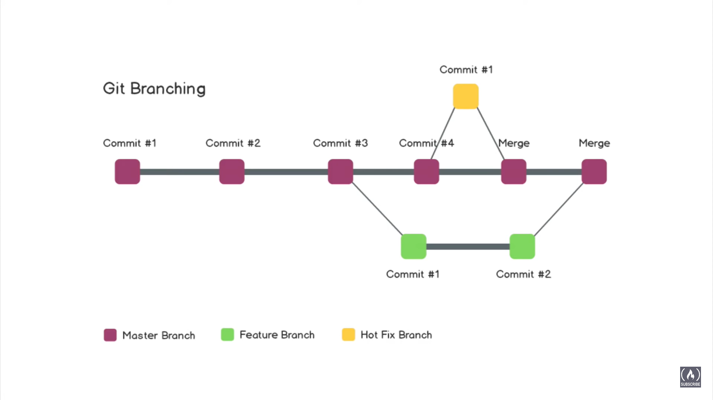

# Table of Contents

- [Table of Contents](#table-of-contents)
- [What is Git?](#what-is-git)
- [What is Version Control?](#what-is-version-control)
- [Git vs Github](#git-vs-github)
- [Installing Git](#installing-git)
- [Branching in Git](#branching-in-git)
  - [What happens when we create a new branch?](#what-happens-when-we-create-a-new-branch)
  - [Why is branching useful?](#why-is-branching-useful)
- [Git Commands](#git-commands)
  - [Basic Commands](#basic-commands)
  - [Other Useful Commands](#other-useful-commands)
- [Git Conflicts in a Professional Environment](#git-conflicts-in-a-professional-environment)
      - [Situation:](#situation)
      - [Problem:](#problem)
    - [The question here is: How do they make their changes to the repo without breaking the project](#the-question-here-is-how-do-they-make-their-changes-to-the-repo-without-breaking-the-project)
      - [Use Case 1 - Persons B and C are also making changes to `Filename1` :](#use-case-1---persons-b-and-c-are-also-making-changes-to-filename1-)

---

# What is Git?

Git is a free open source version control system.

---

# What is Version Control?

The management of changes to documents, computer programs, large web sites, and other collections of information is known as version control. Programmers use version control to track code changes by saving an initial version of the code to Git and then updating the code by saving into Git again and again. As the code continues to change, the programmer can look back at all the changes made over time. This helps us to see what we did, when, track down bugs as well as revert to a previous version if necessary.

---

# Git vs Github

Git is the tool that tracks the code changes over time. Github is a website where you host all your Git repositories. Being online, it makes it easy to work in groups with other people and organize projects under a single portfolio.

---

# Installing Git

Follow the tutorial by Atlassian to **[Install Git](https://www.atlassian.com/git/tutorials/install-git)**

---

# Branching in Git

## What happens when we create a new branch?

Initially, the code on master and this new feature branch will be exactly the same. But as you make updates to the feature branch, those changes are only seen in the feature branch.

So if we make changes to a feature branch and commit to save those changes onto that branch and then if you switch back to the master branch, you won't be able to see any of those changes that you made on that feature branch. Each branch maintains its own independent set of commits and has no way of knowing what commits happen in another branch.

## Why is branching useful?

It is extremely useful because you will be building new features to applications that may break your code or they are a work-in-progress that you do not want to save on your main/master branch. You want to work on them in kind of a sandbox area. So you can write and experiment with code on the feature branch and get it to the state you want for production, before merging it back into the main/branch of the codebase.

This is really helpful when there are multiple people working on the same repository or a lot of different branches going on at once.

One very common thing that you'll see in development is that you'll be working on this feature branch for a week or more and you have all of these changes that you've made. Suddenly you encounter this major bug, that you have to fix really quickly. For this, we make this other branch, called a **Hot Fix Branch** represented by yellow. After the code is fixed on the Hot Fix Branch and you make sure it is working correctly, this branch is then merged back into the master branch.

---

# Git Commands

## Basic Commands

We initialize Git by using `git init` inside the directory after which the following commands can be used:

<!--prettier-ignore-->
| Command | Function | Syntax | Example |
| ------- | -------- | ------ | ------- |
| clone | - Bring a repository that is hosted somewhere like Github into a folder on your local machine. - Clones a particular branch of a repo Cloning adds an `origin` remote by default which can then be used to push: `git push -u origin <branch>` | `git clone <address>`  `git clone -b <branch> <address>` | `git clone https://github.com/jayantasamaddar/quick-reference`  `git clone -b test https://github.com/jayantasamaddar/quick-reference`
| remote | If a repo is not cloned we need to add a remote from the local directory to the repo. | `git remote add <name> https://github.com/user/repo` | `git remote add origin https://github.com/jayantasamaddar/quick-reference`
| add | - Stage a single file in folder. - Stage all files in folder. | `git add <filename>` `git add --all` | `git add README.md` `git add --all` or `git add .` |
| commit | Save your file changes in Git | `git commit -m <description>` | `git commit -m "first commit"` |
| push | - Upload Git commits to a remote repo, like Github, Gitlab, Bitbucket - Deletes a remote branch on the repo | `git push <remote> <branch>` `git push <remote> -d <branch>` | `git push origin main` `git push origin -d test` |
| pull | Download changes from a remote repo to your local machine. Opposite of push. Useful when working with multiple teams who are constantly updating the repo | `git pull <remote> <branch>` | `git pull origin main` |
| checkout | - Create a new branch - Switch to an existing branch | `git checkout -b <name>` `git checkout <name>` | `git checkout -b new-feature` `git checkout main` |
| branch | - List local branches - List all branches (remote and local) - Rename current local branch - Delete local branch | `git branch` `git branch -a` `git branch <rename>` `git branch -d <branch>` | `git branch` `git branch -a` `git branch -m new-name` `git branch -d test` |
| merge | Merge an existing branch into the current branch. After merge, the `<from-branch>` can be deleted using `git push -d <from-branch>` | `git checkout <to-Branch>` `git merge <from-Branch>` | `git checkout main` `git merge new-feature` |
| revert | Revert to a previous commit version. | `git revert <commit_ID>` | `git revert 077151a` |
| reset | - Unstage the staged local changes of a single file in a Git repo to the most recent commit. - Unstage the staged local changes of a Git repo to most recent commit. - Unstage to most recent commit AND obliterates all uncommitted changes in working directory. Use only when you want to throw away all local developments. | `git reset <filepath>` `git reset` `git reset --hard` | `git reset ./filename.txt` `git reset` `git reset --hard` |
| diff | Show the differences in local and remote versions | `git diff` | `git diff` |

> **Git commands are case sensitive and must be in _lowercase_**

## Other Useful Commands

<!--prettier-ignore-->
| Command | Function | Example |
| ------- | -------- | ------- |
| `git --version` | Check the current Git version. | N/A |
| `git --help` | View a list of all Git commands and their functionality and other helpers. | N/A |
| `git <command> --help` | View a list of all Git subcommands of a git command and their functionality. | `git checkout --help` |
| `git log --oneline` | View a list of commits. Read Only. Press `Q` to Quit. | N/A |
| `git status` | Shows a status overview of current branch, staged/untracked files, uncommitted changes etc. | N/A |
| `git rm --cached <path>` | Untrack it and remove it from the remote repository without deleting the file locally. Usually used when a file has been mistakenly committed that needed to be added to `.gitignore` but wasn't. So we first untrack and remove it from the remote repo and then commit and push again after adding it to the `.gitignore` file. This way the file stays locally but is not added to the repo. | `git rm --cached .env` |

---

# Git Conflicts in a Professional Environment

When multiple people are working on the same branch there might be some conflicts in the version due to changing of the version history.

#### Situation:

- Let's say three people, **Person A**, **Person B**, **Person C** clone the same repo and start working.
- There are three files in the repo: `Filename1`, `Filename2`, `Filename3`

#### Problem:

**Person A** modifies `Filename1` and commits changes and publishes the repo. Now **Person B** and **Person C** do not have the same versions, as they continue to make their own changes to their cloned versions locally. So when they make a commit and push changes, they get an error saying that they do not have the latest version of the repo.

### The question here is: How do they make their changes to the repo without breaking the project

#### Use Case 1 - Persons B and C are also making changes to `Filename1` :

If three people are working on the same file, Git can still handle the changes. The first person to push, manages to do it without a problem. The next pushes by the other two people will face a problem because now the repo version has changed. They first have to pull the repo now to sync it to the current version. The pulled repo will identify the conflicted file and suggest how you should proceed.

There are three options if the same file has been unsynced changes to the file after completion of a pull request:

- Use the modified version - Use the pulled version
- Use the current version - Use the local version
- Use both versions - Appends the changes to the local version

Once the Person is happy with the changes, he/she may commit the changes and push the changes back to the repo. This is how version control ensures that there is no conflict.

---
