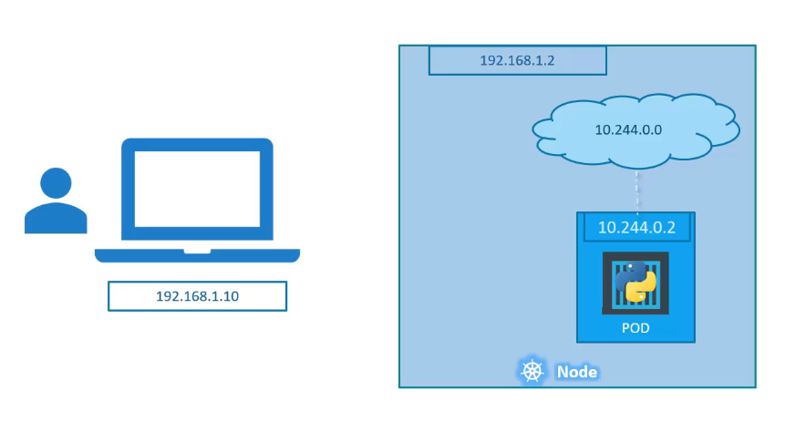

# Table of Contents

- [Table of Contents](#table-of-contents)
- [Introduction](#introduction)
- [Overview](#overview)
  - [Containers Overview](#containers-overview)
  - [Container Orchestration](#container-orchestration)
  - [Kubernetes Architecture](#kubernetes-architecture)
    - [Node](#node)
    - [Cluster](#cluster)
    - [Master](#master)
    - [Components](#components)
    - [Master vs Worker Nodes](#master-vs-worker-nodes)
    - [kubectl - Command Line Utility](#kubectl---command-line-utility)
- [Setup Kubernetes](#setup-kubernetes)
  - [Kubeadm](#kubeadm)
- [Kubernetes Concepts](#kubernetes-concepts)
  - [Pods](#pods)
  - [Multi-Container Pods](#multi-container-pods)
  - [Deploying Pods using `kubectl run`](#deploying-pods-using-kubectl-run)
- [Introduction to YAML](#introduction-to-yaml)
  - [Map](#map)
  - [List](#list)
  - [Scalars](#scalars)
- [Kubernetes Definition Files - YAML](#kubernetes-definition-files---yaml)
- [Replication Controllers and ReplicaSets](#replication-controllers-and-replicasets)
  - [Replication Controllers](#replication-controllers)
    - [What is a Replica and why do you need a Replication Controller ?](#what-is-a-replica-and-why-do-you-need-a-replication-controller-)
    - [Creating a Replication Controller](#creating-a-replication-controller)
  - [Replica Sets](#replica-sets)
    - [Creating a Replica Set](#creating-a-replica-set)
  - [Labels and Selectors](#labels-and-selectors)
  - [Scaling Replica Sets](#scaling-replica-sets)
    - [Method 1 - Updating the Original Definition File](#method-1---updating-the-original-definition-file)
    - [Method 2 - Updating the running configuration file](#method-2---updating-the-running-configuration-file)
    - [Method 3 - Using the `kubectl scale` command](#method-3---using-the-kubectl-scale-command)
  - [Deployments](#deployments)
    - [Overview](#overview-1)
    - [Creating a Deployment](#creating-a-deployment)
    - [Rollout and Versioning](#rollout-and-versioning)
    - [Deployment Strategy](#deployment-strategy)
    - [Updating](#updating)
    - [Rollback](#rollback)
- [Networking in Kubernetes](#networking-in-kubernetes)
  - [Networking on a Single Node](#networking-on-a-single-node)
  - [Cluster Networking](#cluster-networking)
- [Services](#services)
  - [External Communication](#external-communication)
  - [Service Types](#service-types)
  - [NodePort](#nodeport)
    - [NodePort - Creating a Service](#nodeport---creating-a-service)
      - [Connecting externally to a Single Pod on a Node](#connecting-externally-to-a-single-pod-on-a-node)
      - [Connecting externally to Multiple Pods on a Single Node](#connecting-externally-to-multiple-pods-on-a-single-node)
      - [Connecting externally to Pods distributed across Multiple Nodes](#connecting-externally-to-pods-distributed-across-multiple-nodes)
  - [ClusterIP](#clusterip)
    - [ClusterIP - Creating a Service](#clusterip---creating-a-service)
  - [Load Balancer](#load-balancer)
    - [Load Balancer - Creating a Service](#load-balancer---creating-a-service)
- [Kubernetes on Cloud - AWS/GCP](#kubernetes-on-cloud---awsgcp)

---

# Introduction

**Kubernetes** also known as **K8s** was built by Google based on their experience running containers in production. It is now an open source project and is arguably one of the best and most popular container orchestration technologies out there. It is supported on almost all Cloud platforms, it supports hosting enhanced and complex applications on various kinds of architectures that make it a vast and complex technology.

There are a set of pre-requisite knowledge required such as:

- Containers
- Applications
- YAML files, etc.

---

# Overview

## Containers Overview

To understand Kuberentes we need to familiarize ourselves with two concepts:

- Containers and
- Orchestration.

Once we familiarize ourselves with both of these terms, we would be in a position to understand what Kubernetes is capable of.

Containers are completely isolated environments that can have their own processes and networks and their own mounts just like virtual machines, except they share the same operating system kernel. Containers are not new with Docker. Containers have existed for over 10 years now, and some of the different types of containers are LXC, LXD, LXCFS etc. Docker utilizes LXC containers. Setting up these container environments is hard as they are very low level and that is where Docker offers a high level tool with several powerful functions, making it really easy for end users.

To understand how Docker works, let's revisit some operating system concepts first. All Operating systems consist of two things - An OS Kernel and a set of software.
The OS Kernel is responsible for interacting with the underlying hardware. While the OS Kernel may remain the same for Operating systems like Ubuntu, CentOS, Fedora, which is Linux in this case, it is the software above it that makes these Operating Systems different. This software may consist of a different user interface, drivers, compilers, file managers, developer tools, etc. So you have a common Linux kernel shared across various operating systems and some custom software that differentiates Operating Systems from each other.

We said earlier that Docker containers share the underlying kernel. What does that mean?

Let's say we have an Ubuntu OS with Docker installed on it. Docker can run any flavour of OS on top of it as long as they are all based on the same kernel, in this case Linux. If the underlying operating system is Ubuntu, Docker can run a container based on another distribution like Debian, Alpine, Fedora or CentOS. Each Docker container only has the additional software that we talked about earlier, that makes these operating systems different and Docker utilizes the underlying kernel of Docker host which works with all the operating systems that are based off the kernel.

This means that we won't be able to run a Windows based container on a Docker host with Linux based OS on it. For that, we would require Docker on a Windows server.

Unlike Hypervisors, Docker is not meant to virtualize and run different operating systems and kernel with the same hardware. The main purpose of Docker is to containerize applications and to ship them and run them.

Read about the **[Differences between Virtual Machines and Containers](https://github.com/jayantasamaddar/quick-reference/tree/main/docker#virtual-machines-vs-containers)**.

---

## Container Orchestration

Let's say, we now have our application packaged into a Docker container. But what's next? How do we run it in production? What if your application relies on other services such as databases or messaging services or other backend services? What if the number of users increase and you need to scale your application? How do you scale down when the load decreases?

To enable these functionalities, you need an underlying platform with a set of resources and capabilities. The platform needs to orchestrate the connectivity between the containers and automatically scale up or down based on the load. This whole process of automatically deploying and managing containers is called Container Orchestration.

**Kubernetes** is just a Container Orchestration technology. There are multiple such technologies available today. Docker has it's own tool called **Docker Swarm**, **Kubernetes** from Google and **MESOS** from Apache. While Docker Swarm is really easy to setup and get started, it lacks some of the advanced features require for complex applications. MESOS on the other hand is quite difficult to setup and get started, but supports many advanced features. Kubernetes, arguably the most popular of them all, is a bit difficult to setup and get started with, but provides a lot of options to customize deployments and supports deployments of complex architectures.

Kubernetes is now supported on all public cloud service providers like GCP, Azure and AWS and the Kubernetes project is one of the top ranked projects on GitHub.

There are various **Advantages of Container Orchestration**:

- **High Availability** - Hardware failures do not bring the application down because we have multiple instances of the application running on different nodes.
- **Load Balanced Traffic** - The user traffic is load balanced across the various containers. When demand increases, deploy more instances of the services seamlessly in a matter of seconds.
- **Vertical Scaling** - When we run out of hardware resources, scale the number of underlying nodes up or down, without having to take down the application.
- **Ease of Use** - Do all of these easily with a set of declarative object configuration files.

To summarize, **Kubernetes** is a container orchestration technology used to orchestrate the deployment and management of hundreds and thousands of containers in a clustered environment.

---

## Kubernetes Architecture

Before we delve into setting up a Kubernetes cluster, it is important to understand some of the basic concepts. This will familiarize us with the terms we will come across while working with Kubernetes.

### Node

A **`Node`** is a machine - physical or virtual, on which Kubernetes in installed. A Node is a worker machine and that is where containers will be launched by Kubernetes. It was also known as **`minions`** in the past.


---

### Cluster

But what if the Node on which your application was running fails? Our application would go down.
So we need to have more than one node. A **`Cluster`**, is a set of nodes grouped together. This way, even if one Node fails, you still have your application still accessible from the other nodes. Moreover having multiple nodes helps in sharing load as well.


---

### Master

Now we have a Cluster - but who is responsible for managing the cluster? Where is the information about the members of the cluster stored? How are the nodes monitored? When a Node fails, how do you move the workload of the failed node to another worker node? That's where the **`Master`** comes in. The Master is another Node with Kubernetes installed on it and is configured as the Master.


The Master watches over the nodes in the Cluster and is responsible for the actual orchestration of containers on the worker nodes.

---

### Components


When you install Kubernetes, you are actually installing the following Components:

1. **API Server** - The API Server acts as a frontend for Kubernetes. The users, management devices, command line interfaces, all talk to the API server to interact with the Kubernetes cluster.

2. **etcd service** - etcd is a distributed, reliable key-value store used by Kubernetes to store all data used to manage the Cluster. When you have multiple Nodes and multiple Masters in your cluster, etcd stores all that information on all the Nodes in the Cluster in a distributed manner. etcd is responsible for implementing locks within the cluster to ensure that there are no conflicts between the Masters.

3. **Schedulers** - The Scheduler is responsible for distributing work or containers across multiple Nodes. It looks for newly created containers and assigns them to Nodes.

4. **Controllers** - The Controllers are the brain behind the orchestration. They are responsible for noticing and responding when nodes, containers or end points go down. The controllers make decisions to bring up new containers in such cases.

5. **Container Runtime** - The Container Runtime is the underlying software that is used to run containers. In our case, it happens to be Docker. But there are other options as well.

6. **kubelet service** - Kubelet is the agent that runs on each Node in the Cluster. The agent is responsible for making sure that they containers are running on the Nodes as expected.

---

### Master vs Worker Nodes

So far, we saw two types of servers - Master and Worker, and a set of components that make up Kubernetes. But how are these components distributed across different types of servers? In other words, how does one server become a Master and others Slaves?


The worker node or minion as it is known, is where the containers are hosted. For e.g. Docker containers. To run Docker containers on a system, we need Container Runtime installed, and that's where the Container Runtime comes in - in our case it happens to be Docker. This however doesn't have to be Docker, there are other Container Runtimes alternatives available such as Rocket or Cryo.

The Master server has the Kube API Server, that makes it the Master. Similarly, the worker nodes have the Kubelet agent that is responsible for interacting with a Master to provide health information of the Worker node and carry out actions requested by the Master on the Worker nodes. All the information gathered, are stored on a key-value store on the Master. The key-value store is based on the popular etcd framework as discussed above. The Master also has the Controller and the Scheduler. There are other components as well, but we will stop here for now.

---

### kubectl - Command Line Utility

Lastly, we need to learn about one of the Command Line Utilities known as the **`Kube Command Line Tool`** or **`kubectl`** or **`Kube Control`** as it is also called.

The kubectl is used to deploy and manage applications on a Kubernetes cluster. To get cluster information, to get status of other Nodes in the cluster and to manage many other things.

- The **`kubectl run [ApplicationImage]`** command is used to deploy an application on the Cluster.

- The **`kubectl cluster-info`** command is used to view information about the Cluster.

- The **`kubectl get nodes`** command is used to list all the nodes part of the Cluster. Shows:

  - Name
  - Status
  - Roles
  - Age
  - Version

- The **`kubectl get nodes -o wide`** to view additional information. Shows:
  - Name
  - Status
  - Roles
  - Age
  - Version
  - Internal-IP
  - External-IP
  - OS-Image
  - Kernel-Version
  - Container-Runtime

---

# Setup Kubernetes

Kubernetes is complex—because it is a tool designed by Google to cater for complex microservices and distributed environments. Especially when you are in the development or testing phase of your application, running k8s might be cumbersome, and using a managed Kubernetes service might be costly. To make it easier to run Kubernetes, especially in dev and test environments, we need a tool that simplifies this complexity.

These days, many tools parade themselves, claiming to serve the purpose of Kubernetes in simpler form for smaller environments. Using such tools allows Kubernetes developers to easily test out their applications and ensure things will work as fine as they work in the dev/test environment in production. Of such tools, **`minikube`**, **`microk8s`**, **`kind`**, and **`k3s`** are some of the most trusted to deliver as expected.

## Kubeadm

The Kube Admin tool is used to bootstrap and manage production-grade Kubernetes clusters. There are also hosted and managed solutions available for setting up Kubernetes in a Cloud environment such as GCP, AWS or IBM Cloud and many others. These are some of the many options available to a deploy a Kubernetes cluster.

---

# [Kubernetes Concepts](https://kubernetes.io/docs/concepts/)

## [Pods](https://kubernetes.io/docs/concepts/workloads/pods/pod-overview/)

As discussed before, with Kubernetes, our ultimate aim is to deploy our application in the form of containers on a set of machines that are configured as Worker Nodes in a cluster. However, Kubernetes does not deploy containers directly on the Worker Nodes. The containers are encapsulated into a Kubernetes object known as a Pod.

A Pod is a single instance of an application. A Pod is the smallest object that you can create in Kubernetes.

Here's a simple case:
A Single Node Kubernetes Cluster with a single instance of a Python Application, running in a Single Docker container encapsulated in a Pod. Now, what if the number of users increase and there is a need to add additional instances to share the load? Where would we spin up additional instances? Do we bring up a new container instance within the same Pod? No, we create a new Pod altogether with a new instance of the same application.


What if the users further increase and the current Node doesn't have sufficient capacity. Well then, you can always deploy additional Pods in a new Node in the cluster. A new Node to the cluster is added to expand the Cluster's physical capacity.

To summarize,

- Pods usually have a one-to-one relationship with containers running our application.
- To scale up we create new Pods and to scale down, you delete existing Pods. You do not add additional containers to an existing Pod to scale your application.

In a later section, we shall see how we orchestrate the Pods, achieve load balancing between the containers, etc.

---

## Multi-Container Pods

We just discussed how Pods usually have a one-to-one relationship with containers. But are we restricted to having a single container in a single Pod? No.

A single Pod can have multiple containers, except that they are usually not multiple containers of the same kind. As we discussed earlier, if our intention was to scale our application, then we would need to create additional Pods. But sometimes, we may have a scenario where you have a Helper container that might be some kind of supporting task for our application, such as processing a user-entered data, processing a file uploaded by the user, etc. and you want these Helper containers to live alongside your application container.

In that case, you can have both of these containers as part of the same Pod, so that when a new application container is created, the Helper is also created, and when it does, the Helper also dies, as they are part of the same Pod. The two containers can also communicate with each other directly by referring to each other as localhost, since they share the same network space. Plus, they can share the same storage space as well.


Even if our application didn't happen to be so complex, and it could live in a single container, Kubernetes still requires us to create Pods. This is beneficial in the long run as our application is now equipped for architectural changes and scale in the future. Note that, Multi-container Pods are a rare use case and for the most, we will be sticking to Single-container Pods.

---

## Deploying Pods using `kubectl run`

Earlier we learned about the `kubectl run [ApplicationImage]` command.
`kubectl run nginx` would create a Pod automatically and deploys an instance of the Nginx Docker Image. But where does it get the Application Image from? For that, we need to specify the image name using the `--image` flag.

```s
# Syntax
kubectl run [POD NAME] --image=[IMAGE]:[TAG]

# Run Nginx
kubectl run nginx --image=nginx
```

The Application Image, i.e. Nginx image, is downloaded from the Docker Hub repository. Docker Hub is a public repository where latest Docker images of various applications are stored. You could configure Kubernetes to pull the image from the public Docker Hub or a private repository within the organization.

Now that we have a Pod created, how do we see the list of Pods available?

```s
# Get Pods
kubectl get pods

# Get Pods with more information
kubectl get pods -o wide
```

Right now, in the current state, the Nginx web server is not accessible to external users. We can access it internally from the Node. In a later section, once we encounter Networking and services we will get to know how to make the service accessible to end-users.

To get more information about a specific pod, we can use,

```s
kubectl describe pod [POD NAME]
```

---

# Introduction to YAML

YAML is a data serialization language that is often used for writing configuration files. A YAML file is used to represent data, in this case, configuration data.

Here is a quick comparison of a sample data in three formats.


YAML is also a superset of JSON, so JSON files are valid in YAML.

YAML uses Python-style indentation to indicate nesting. Tab characters are not allowed, so whitespaces are used instead. There are no usual format symbols such as braces, square brackets, closing tags or quotation marks. YAML files use a .yml or .yaml extension.

The structure of a YAML file is a Map or a List.

## Map

Maps allow you to associate key-value pairs. Each key must be unique, and the order doesn't matter. Think of a Python Dictionary or a variable assignment in a Bash script or a JavaScript Object or Map.
A map in YAML needs to be resolved before it can be closed, and a new Map is created. A new map can be created by either increasing the indentation level or by resolving the previous map and starting an adjacent map.

```yml
Banana:
  calories: 105
  fat: 0.4g
  carbs: 27g

Grapes:
  calories: 62
  fat: 0.3g
  carbs: 16g
```

## List

A List includes values listed in a specific order and may contain any number of items needed. A list sequence starts with a dash (-) and a space, while indentation separates it from the parent. Think of a Python list or an Array in JavaScript or Bash. A list can be embedded into a Map.

```yml
Fruits:
  - Orange
  - Apple
  - Banana

Vegetables:
  - Carrot
  - Cauliflower
  - Potato
```

## Scalars

YAML also contains scalars, which are arbitrary data (encoded in Unicode) that can be used as values such as strings, integers, dates, numbers of booleans.

```yml
Fruit: Apple
Quantity: 1
Price: 50.00
Date: 25-09-2022
keepsDoctorAway: true
```

When creating a YAML file, you'll need to ensure that you follow these syntax rules and that your file is valid. A linter is an application that verifies the syntax of a file. The `yamllint` command can help ensure that you've created a valid YAML file before you hand it over to an application.

---

# Kubernetes Definition Files - YAML

Kubernetes uses YAML files as input configurations for the creation of objects such as Pods, Replicas, Deployment services, etc. All of these follow a similar structure.

A Kubernetes definition file always contain 4 top level or root level fields (required):

In **`pod-definition.yml`**,

```yml
apiVersion: v1
kind: Pod
metadata:
  name: myapp-prod
  labels:
    app: myapp
    type: front-end
spec:
  containers:
    - name: nginx-container
      image: nginx
```

1. **apiVersion** - The version of the Kubernetes API you're using to create the objects. Depending on what we are trying to create we must use the right apiVersion. For e.g. if we are working on pods, we can set the `apiVersion: v1`.

2. **kind** - The type of object we are trying to create. Possible values: `Pod`, `ReplicaSet`, `Service`, `Deployment`.

3. **metadata** - The metadata is data about the object like its `name`, `labels` etc. This is the form of a dictionary. The `name` is a string value while the `labels` is a dictionary value. For example, if there are hundreds of pods running a frontend application and hundreds of pods running a backend application, it would be difficult to group these parts once deployed. If you label them as frontend or backend or database, you will be able to filter these Pods based on the label at a later point in time. It's important to note that under metadata you can only specify `name` or `label` or anything else that Kubernetes expects under metadata. You cannot add any other property as you wish under this. However, under labels, you can have any key-value pair as you see fit.

4. **spec** - We have specified the name of the Pod as `myapp-prod` but he haven't really specified the container or image we need in the Pod. The last section in the configuration file is the specification section or **`spec`**. Depending on the object we are going to create, this is where we would provide additional information to Kubernetes pertaining to that object. This is going to be different for different objects so it's important to understand or refer to the documentation section to get the right format for each since.

   Since we are creating a Pod with a single container in it, it is easy. **`spec`** is a dictionary, so we can add a property under it called `containers`. `containers` is a list or an array as the pods can have multiple containers within them. In this case, we will add a single item to the list, since we plan to have a single container for the Pod.

Once the file is created, from the command line run the following to Create the Pod,

```s
# Syntax
kubectl create -f [FILE NAME]

# Command
kubectl create -f pod-definition.yml

# Using kubectl apply (when creating a new object)
kubectl apply -f pod-definition.yml
```

---

# Replication Controllers and ReplicaSets

Controllers are the brain behind Kubernetes. They are the processes that monitor Kubernetes objects and respond accordingly.

We will talk about one particular controller in this section: The Replication Controller

## Replication Controllers

### What is a Replica and why do you need a Replication Controller ?

1. **High Availability** - The Replication Controller helps us run multiple instances of a single Pod in the Kubernetes Cluster, thus providing high availability.
   So does that mean you cannot have a Replication Controller if you plan to use a single Pod? No.
   Even if you have a single Pod, the Replication Controller can help by automatically bringing up a new Pod when the existing one fails. Thus, the Replication Controller ensures that the specified number of pods are running at all times.

2. **Load Balancing and Scaling** - Another reason why we need the Replication Controller is to create multiple pods to share the load across them. We may have a single Pod serving a set of users and as the load increases we deploy additional pods to balance the load across the two pods. If the demand further increases, and we were to run out of resources on the first Node, we could deploy additional pods across the other nodes in the Cluster. As you can see the Replication Controller spans across multiple Nodes in the Cluster. It helps us balance the load across multiple pods on different Nodes as we scale our application.

   

### Creating a Replication Controller

We start off by creating a Replication Controller definition file. We will name it `rc-definition.yaml`. As with every Kubernetes definition file, we have four sections -

- **`apiVersion`** - The Replication Controller is available in Kubernetes since apiVersion `v1`.
- **`kind`** - The `kind` will be `ReplicationController`.
- **`metadata`** - As usual.
- **`spec`** - For any Kubernetes definition file, the `spec` section defines what is inside the object we are creating. In this case, we know that the `ReplicationController` creates multiple instances of a Pod. But what Pod?

  - **`template`** - We create a `template` section to provide a Pod template to be used by the `ReplicationController` to create replicas. Now, how do we define the Pod template?

  Remember the pod definition file from the previous sections. We could reuse the contents of the file to populate the template section.

  

  We can move all the contents of the Pod Definition file into the template section (except the first two lines, `apiVersion` and `kind`).

  

  - **`replicas`** - Something is still missing! We haven't added the number of replicas we need in the Replication Controller. For that, we need to add another property called `replicas` with the number of replicas we need.

  Remember that `template` and `replicas` are direct children of the `spec` section, so they are siblings and must be indented along the same vertical line, which means equal number of spaces before them.

```yaml
apiVersion: v1
kind: ReplicationController
metadata:
  name: myapp-rc
  labels:
    app: myapp
    type: frontend
spec:
  template:
    metadata:
      name: nginx
      labels:
        app: nginx
        type: frontend
    spec:
      containers:
        - name: nginx
          image: nginx
  replicas: 3
```

Once the file is ready, we can run:

```s
kubectl create -f [FILENAME]
```

The Replication Controller is created. When the Replication Controller is created it first creates the Pods using the Pod definition template as many as required, which is 3 in this case. To view the list of created Replication Controllers, run the following command to see the Replication Controller listed with the **Desired** number of replicas or pods, **Current** number of replicas and how many of them are **Ready**:

```s
kubectl get replicationcontroller
```

> **Note:** There are two similar terms - Replication Controller and Replica Sets. Both have the same purpose but they are not the same. Replication Controller is the older technology that is being replaced by Replica Set.

---

## Replica Sets

Replica Set is the new recommended way to set up replication. The same concepts that apply to Replication Controller applies to Replica Set as well. There are minor differences in the way they work, and we'll explore that in a bit.

### Creating a Replica Set

```s
apiVersion: apps/v1
kind: ReplicaSet
metadata:
  name: myapp-replicaSet
  label:
    app: myapp
    type: frontend
spec:
  template:
    metadata:
      name: nginx
      labels:
        app: nginx
        type: frontend
    spec:
      containers:
        - name: nginx
          image: nginx
  replicas: 3
  selector:
    matchLabels:
      type: frontend
```

The **`selector`** section helps the Replica Set identify which Pods fall under it. But why would you have to specify what pods fall under it if you have provided the contents of the Pod definition file itself in the template? It's because Replica Sets can also manage Pods that were not created as part of the Replica Set creation.

For example, They were Pods created before the creation of the Replica Set that match labels specified in the **`selector`**, the Replica Set will also take those pods into consideration when creating replicas.

The **`selector`** is the major difference between the ReplicationController and the ReplicaSet. The **`selector`** is not a required field in the case of a ReplicationController but it is still available. When you skip it, it assumes it to be the same as the labels provided in the pod definition file. In case of Replica Set, a user input is required for the **`selector`** property and it has to be written in the form of `matchLabels` as shown above.
The `matchLabels` selector simply matches the labels specified under it to the labels on the Pods. The Replica Set provider also provides many other options for matching labels that were not available in a Replication Controller.

To create a Replica Set from a definition file, run the command:

```s
kubectl create -f [FILENAME]
```

To view the list of created Replica Sets, run the following command to see the Replica Sets listed with the **Desired** number of replicas or pods, **Current** number of replicas and how many of them are **Ready**:

```s
kubectl get replicaset
```

---

## Labels and Selectors

Why do label our pods and objects in Kubernetes?

Let's look at a scenario. Say, we deployed three instances of our front-end application as three pods. We would like to create a Replication Controller or Replica Set to ensure that we have three active pods at all times. This is one of the use case, of Replica Sets - you can use it to monitor existing pods if you have them already created. In case, they were not created, the ReplicaSet would create them for you. The role of the Replica Set is to monitor the pods and if any of them were to fail, deploy new ones. The Replica Set is in fact a process that monitors the pods.

Now, how does the Replica Set know which pods to monitor? There could be hundreds of other pods in the cluster running different applications. This is where labelling our Pods during creation, comes in handy. We can now provide these labels as a filter for the Replica Set. Under the **`selector`** section we use the **`matchLabels`** filter and provide the same label that we used while creating the Pods. This way the Replica Set knows which Pods to monitor.


The same concept of labels and selectors are used in many other places in Kubernetes.

---

## Scaling Replica Sets

Let's say, we started with 3 Replicas, and in the future we decided to scale to 6. How do we update our ReplicaSet to scale to 6? There are multiple ways to do it:

### Method 1 - Updating the Original Definition File

- Update the number of **`replicas`** in the definition file to 6.
- Run the `kubectl replace` or `kubectl apply` command with the newly updated file. This will update the Replica Set to have 6 Replicas.

  ```s
  # Using `replace`
  kubectl replace -f [FILENAME]

  # using `apply`
  kubectl apply -f [FILENAME]
  ```

> **Note:** This is the recommended way of scaling replicas as this allows for changes to the definition file to be tracked by version control and reflected on Kubernetes through a CI/CD pipeline.

---

### Method 2 - Updating the running configuration file

- Using the **`kubectl edit [TYPE] [NAME]`** command open the running configuration file

  ```s
  kubectl edit replicaset [NAME]
  ```

- Change the replicas to the desired count and save an exit the editor to let Kubernetes update the running configuration.

> **Note:** The **`kubectl edit [TYPE] [NAME]`** does not edit the original definition file. It opens the running configration saved by Kubernetes in memory. Changes made to this file are directly applied on the running configuration of the cluster as soon as the file is saved. Thus caution must be exercised when making changes here.

---

### Method 3 - Using the `kubectl scale` command

1. Run the **`kubectl scale`** command as below specifying the replicas and specifying the same file as input.

```s
# Syntax
kubectl scale --replicas=[COUNT] -f [FILENAME]

# Example
kubectl scale --replicas=6 -f replicaset-definition.yaml
```

OR

2. Run the `kubectl scale` command as below specifying the replicas, with the [TYPE] [NAME] format.

```s
# Syntax
kubectl scale --replicas=[COUNT] [TYPE] [NAME]

# Example
kubectl scale --replicas=6 replicaset myapp-replicaSet
```

> **Note:** Using the `kubectl scale` command doesn't update the definition file.

There are also options available to scale Replica Sets based on load, but that is an advanced topic to be discussed in a later section.

---

## Deployments

### Overview

Let's focus on how we want to deploy our application in a production environment.
Let's say, we have a web server that needs to be deployed in a production environment. We need not just one, but many such instances of the web server running for obvious reasons. Secondly, when newer version of the application build is available on the container Registry (e.g. Docker Hub), we would like to upgrade our Docker instances seamlessly. However, when we upgrade our instances, we don't want to upgrade all of them at once as we just did, this may impact our users accessing our applications, so we may want to upgrade them one after another. This kind of update is called a rolling update.

Suppose one of the upgrades you performed resulted in an unexpected error and you're asked to undo the recent change, you would like to be able to roll back the changes that were recently carried out.

Finally, say for example, you would like to make multiple changes to your environment such as upgrading the underlying web server versions, as well as scaling your environment, and also modifying the resource allocations etc., you do not want to apply each change immediately after the command is run. Instead you would like to apply a pass to your environment, make the changes, and then resume, so that all the changes are rolled out together.

All of these capabilities are available with the Kubernetes Deployments.


We learned about Pods which deploy single instances of our application, such as the web application in this case. Each container is encapsulated in a Pod. Multiple such Pods are deployed using Replication Controllers or Replica Sets. Then comes, Deployment, which is a Kubernetes object that comes higher in the hierarchy.

The Deployment provides us with the capability to upgrade the underlying instances seamlessly using rolling updates, undo changes, and pause and resume changes as required.

---

### Creating a Deployment

So how do we create a deployment?

- We first create a Deployment Definition file. The contents of the Deployment definition file are exactly similar to the Replica Set definition file, except for the kind which is going to be **`Deployment`**.

```yaml
apiVersion: apps/v1
kind: Deployment
metadata:
  name: myapp-deployment
  labels:
    app: nginx
    tier: frontend
spec:
  template:
    metadata:
      name: nginx
      labels:
        app: nginx
        tier: frontend
    spec:
      containers:
        - name: nginx
          image: nginx
  replicas: 3
  selector:
    matchLabels:
      app: nginx
```

---

### Rollout and Versioning

Before we look at how we can upgrade our application, let's try to understand rollouts and versioning in a deployment. When you first create a deployment, it triggers a **`rollout`**. A new rollout creates a new deployment revision. Let's call it Revision 1. In the future, when the container version is updated to a new one, a new rollout is triggered and a new Deployment revision is created, named Revision 2. This helps us keep track of changes made to our deployment, and enables us to rollback to a previous version of deployment, if necessary.


**Commands:**

- We can see the status of your rollout by running the command:

  ```s
  kubectl rollout status deployment/[NAME]
  ```

- To see revisions and history of rollout, run the following command:

  ```s
  kubectl rollout history deployment/[NAME]
  ```

---

### Deployment Strategy

There are two types of Deployment strategies:

1. **Recreate Strategy**: In this strategy if a newer version of an application is to be deployed, the existing replicas are first destroyed and create newer versions of the application instances. The problem with this is that there will be a downtime during which the application cannot be accessed by anybody, when all the running replicas are taken down and the newer versions are not yet up and running.

   

2. **Rolling Update**: The second strategy is where we do not destroy all the replicas at once. Instead we take down the older version and bring back a newer version, one by one. This way, the application never goes down, and the upgrade is seamless. Remember, if we do not specify a strategy during deployment, it will assume Rolling Update as the default strategy.

   

---

### Updating

When we say Update, it could be various things:

- Updating the application version
- Updating the version of Docker containers used
- Updating the labels
- Updating the number of replicas, etc.

Since we already have a deployment definition file, it is easy for us to modify this file. Once we make the necessary changes, we can run the `kubectl apply -f [FILENAME]` to apply the changes.
A new **`Rollout`** is triggered, and a new Revision of the Deployment is created.

There is another way to do the same thing where only the image of the application needs to be updated. We could use the following command:

```s
kubectl set image deployment/[NAME] [CONTAINER NAME]=[IMAGE:TAG]
```

> **Note:** Using the `kubectl set image` command, does not change the original deployment definition file.

We can run the `kubectl describe deployment [NAME]` command to view the detailed information related to the deployment strategies in action.

---

### Rollback

Let's say, you upgrade your application and realize, something isn't very right - something's wrong with the new version of the build you used to upgrade. So you would like to rollback your update.

Kubernetes deployments allow you to rollback to a previous revision. To rollout a change:

```s
kubectl undo rollout deployment/[NAME]
```

The deployment will then destroy the Pods in the current Replica Set and bring back up the older Pods from the old Replica Set, and the application is back to its older version.

---

# Networking in Kubernetes

## Networking on a Single Node

Let's start with a single-node Kubernetes Cluster. The Node has an IP Address, say it is **`192.168.1.2`**. This is the IP Address we use to access the Kubernetes node, SSH into it, etc.

On the single-node Kubernetes cluster, we have created a single Pod that hosts a container. Unlike in the Docker world where an IP Address is always assigned to a Docker container, in the Kubernetes world, the IP Address is assigned to a Pod. Each Pod in the Kubernetes gets its own internal IP Address.

In this case, it's in the range, **`10.244`** series and the IP Address assigned to the Pod is **`10.244.0.2`**. So how is it getting this IP Address?


When Kubernetes is initially configured, we create an internal private network with the address, **`10.244.0.0`**, and all the Pods are attached to it. When you deploy new Pods, they get a separate IP assigned from this network. The Pods can communicate to each other through this IP Address, but accessing the other Pods using this internal IP Address may not be a good idea, as it's subject to change when Pods are recreated.

---

## Cluster Networking

It's all simple and easy to understand Networking in Kubernetes on a single Node, but how does it work, when you have multiple Nodes in your Cluster?


In this case, let's say we have two Nodes running Kubernetes and they have IP Addresses **`192.168.1.2`** and **`192.168.1.3`** assigned to them. Note that, they are not part of the Cluster yet, each of them has a single Pod deployed. These Pods are attached to an internal network, and they have their own IP Addresses assigned. However, if you look at the internal network addresses, you can see that they are the same. The two networks have an IP Address of **`10.244.0.0`**, and the Pods deployed have the same IP Addresses as well.

This is not going to work well when Nodes are part of the same Cluster, the pods having the same IP Addresses assigned to them as that would lead to IP conflicts in the Network. This is the first problem.

The second problem is that, when Kubernetes Cluster is setup, Kubernetes does not automatically setup any kind of networking to handle these issues. As a matter of fact, Kubernetes expects us to setup networking to meet certain fundamental requirements. Some of these are:

- All containers/Pods in a Kubernetes Cluster must be able to communicate with one another without having to configure NAT.
- All nodes must be able to communicate with containers and vice-versa in the Cluster, without NAT.

Kubernetes expects us to setup a networking solution that meets these criteria. Fortunately we don't have to set it up on our own, as there are multiple pre-built solutions available. Some of them are the CISCO ACI Networks, Cilium, Big Cloud Fabric, Flannel, VMware NSX-T and Calico.
Depending on the platform you are deploying, your Kubernetes cluster on, you may use one of these solutions.

For example, if you were setting up a Kubernetes cluster from scratch on any of your systems, you may use any of these solutions like Calico or Flannel.

If you were deploying on a VMware environment NSX-T might be a good option.
If you look at the play with K8 Slabs, they use Weave Net as their networking solution.


Back to our Cluster with a custom networking, either Flannel or Calico setup, it now manages the networks and IPs in my nodes and assigns a different network address for each network in the Node. This creates a virtual network of all Pods and Nodes, where they are all assigned a unique IP Address and by using simple routing techniques, the Cluster Networking enables communication between the different Pods or Nodes to meet the networking requirements of Kubernetes. Thus all the Pods can now communicate with each other using the assigned IP Address.

---

# Services

Kubernetes services enable communication between various components within and outside of the application. Kubernetes services help us connect applications together with other applications or users.


Let's say, for example, our application has groups of pods running in various sections, such as a group for serving front-end loads to users and another group for running back-end processes and a third group connecting to an external data source. It is Services that enable connectivity between these groups of pods. Services make the front-end application available to end users, it helps communication between back-end and front-end pods and helps establish connectivity to an external data source. Thus, services enable loose coupling between microservices in our application.

Let's take a look at a Use Case of Services.

So far we talked of how Pods talk to each other through internal networking. Let's look at some other aspects of Networking.

## External Communication

Let's say we deployed our Pod with our web application running on it. How do we as an external user, access the webpage? First of all, let's look at the existing setup.

- The Kubernetes node has an IP Address and that is `192.168.1.2`.
- Let's say your laptop is on the same network and has an IP Address of `192.168.1.10`.
- The internal Pod network is in the range `10.244.0.0` and the Pod has an IP of `10.244.0.2`.



We cannot ping or access the pod at `10.244.0.2` as it's in a separate network. So what are the options to see the webpage?

First, if we were to SSH into the Kubernetes Node at `192.168.1.2`, from the Node, we would be able to access the Pod's web page by doing a `curl` or if the Node has a DIY that would fire-up a browser and see the webpage in a browser following the address: `http://10.244.0.2`. But this is from inside the Kubernetes Node, and that's not what we actually want.

We want to be able to access the Web Server from an external laptop without having to SSH into the Node and simply by accessing the IP of the Kubernetes Node. So we need something in the middle to help us map requests from our laptop to the Node and through the Node to the Pod running the Web Server in a container. This is where Kubernetes Service comes into play.

The Kubernetes service is an object just like Pods, Replica Sets or Deployments. One of it's use case, is to listen to a Port on the Node and forward requests on that Port to a Port on the Pod running the Web Application. This type of service is known as a **NodePort** Service because the service listens to a port on the Node and forwards the request to the Pods.

## Service Types

There are other types of Services available as well.


1. **NodePort** - A service that listens to a port on the Node and forwards the request to the Pods. This makes an internal Pod accessible on a port on the Node.

2. **Cluster IP** - In this case, the service creates a Virtual IP inside the Cluster to enable communication between different services such as a set of front-end servers to a set of backend servers.

3. **Load Balancer** - The third type is a Load Balancer which provisions a load balancer for our application in supported cloud providers. A good example of that would be distribute the load across the different web servers in your front-end tier.

## NodePort


Earlier, we discussed external access to the application. We discussed how a Service can help us by mapping a Port on the Node to a Port on the Pod. Let's take a closer look at the Service.

If you look at it, there are three Ports involved.


1. The Port on which the actual Web Server application is running is Port 80 and it is referred to as the **Target Port** because that is where the Service forwards the request to.

2. The second Port is the Port on the Service itself. It is simple referred to as the **Port**. Remember, these terms are from the viewpoint of the Service. The Service is, in fact, like a virtual server inside the Node. Inside the Cluster, it has its own IP Address, and that IP Address is called the **Cluster IP of the Service**.

3. Finally, we have the Port on the Node itself, which we use to access the Web Server application externally, and that is known as the **NodePort** (here, set to 30008). The Port 30008 is because, NodePorts can only be in a valid range, which by default is from 30000 to 32767.

---

### NodePort - Creating a Service

Just like how we created a Pod, ReplicaSet or Deployment in the past, we will use a defintion file to create a Service.

The structure is very similar to the other Kubernetes object definition files we created earlier:

- **`apiVersion`**: In case of Services it is **`v1`**.
- **`kind`**: **`Service`**
- **`metadata`**: **`name`** and **`labels`** as in previous Kubernetes objects.
- **`spec`**: The `spec` section of the service is where we will be defining the actual Services and this is the part of the definition file that differs between different objects. In the `spec` section of the Service, we have two properties -

  - **`type`**: (`String`) Either of **`NodePort`**, **`ClusterIP`** or **`LoadBalancer`**. Default is **`ClusterIP`**.
  - **`ports`**: (`Array` of `Maps`) This is where we input information regarding what we discussed are the three ports:

    - **`targetPort`**: 80
    - **`port`**: 80 (mandatory)
    - **`nodePort`**: An available port in the range from 30000 - 32767

    If you don't provide a **`targetPort`** it is assumed to be the same as **`port`** and if you don't provide a **`nodePort`**, a free port in the range between 30000 - 32767 is automatically allocated.
    Also note that **`ports`** is an array. You can multiple port mappings within a single service.

    So we have all the information in here but something is still missing. There is still nothing in the definition file the connects the service to the Pod. We have simply specified the **`targetPort`** but we haven't mentioned the targetPort on which Pod. There could be hundreds of Pods with web services running on Port 80. So how do we do that?

    As we did with the ReplicaSets previously, and a technique you will see repeatedly in use in Kubernetes, we will use Labels and Selectors to link these together. We know that the Pod was created with a label that uniquely identified it, we need to bring that label into the Service Definition File.

  - **`selector`** - So we have another property in the spec section called **`selector`** just like in ReplicaSet and Deployment definition files. Under the selector, provide a list of labels to identify the Pod. For this, refer to the Pod definition file used to create the Pod. Pull the labels from the Pod definition file and place them under the `selector` section. This links the Service to the Pod.

#### Connecting externally to a Single Pod on a Node

To connect to Pod **[`nginx`](config/pods/nginx-kubeconfig.yaml)**:

In **`service-definition.yaml`**,

```yaml
apiVersion: v1
kind: Service
metadata:
  name: myapp-service
  labels:
    name: port-connector
spec:
  type: NodePort
  ports:
    - targetPort: 80
      port: 80
      nodePort: 30008
  selector:
    app: nginx
    tier: frontend
```

Once done, create the service using the `kubectl create-f [FILENAME]` command to create the Service.

| Command                                     | Function                                           |
| ------------------------------------------- | -------------------------------------------------- |
| `kubectl create -f [FILE NAME]`             | Create the Service from a service definition file. |
| `kubectl create -f [FILE NAME] --record`    | Create a Service and record the Change-Cause.      |
| `kubectl get services` or `kubectl get svc` | Get list of Services.                              |

The web server can now be accessed with `curl [IP Address of Node]:[NodePort]`

---

#### Connecting externally to Multiple Pods on a Single Node

In a Production Environment you have multiple instances of your application running on different Pods for high availability and Load Balancing purposes. In this case, we have multiple similar Pods running our web application. They all have the same labels. This same common label is used as a Selector during the creation of a Service. So when the Service is created, it looks for a matching Pod with the label(s) and finds three of them. The Service then automatically selects all the three pods as endpoints to forward the external request coming from the user. We don't have to do any additional configuration to make this happen.


If you are wondering what algorithm it uses to balance the load across the different Pods, it uses a random algorithm. Thus the service acts as a built-in Load Balancer to distribute load across different Pods.

---

#### Connecting externally to Pods distributed across Multiple Nodes

In this case we have the web application on Pods on separate Nodes on the Cluster.
When we create a Service, without us having to do any additional configuration, Kubernetes automatically creates a Service that spans across all the Nodes in the Cluster and maps the `targetPort` to the same `nodePort` on all the Nodes in the Cluster.


This way you can access your application using the IP of any Node in the Cluster and using the same Port number, which in this case is 30008.

> **Summary**: To summarize, in any case, whether it is a single Pod on a single Node, multiple Pods on a single Node, or multiple Pods on multiple Nodes, the Service is created exactly the same, without you having to do any additional steps during Service creation. When Pods are removed or added, service is automatically updated, making it highly flexible and adaptive. Once created, typically you won't have to make any other configuration changes.

---

## ClusterIP

A Full Stack web application typically has different kinds of pods hosting different parts of an application. You may have a number of Pods running a front-end web server, another set of pods running a back-end web server, a set of Pods running a key-value store like Redis, and another set of pods running a persistent database like MySQL. The Web Front-end server needs to communicate to the back-end servers and the back-end servers need to communicate to the database as well as the Redis service, etc. So what is the right way to establish connectivity, between these services or tiers of the application?


The Pods all have an IP Address assigned to them as we can see above. But these IPs as we know are not static. These Pods can go down anytime, and new Pods are created all the time. Thus, you cannot rely on these IP Addresses for internal communication between the application. Also, what if the first front-end Pod at `10.244.0.3` need to connect to a backend service? Which of the three would it go to and who makes that decision?

A Kubernetes Service can help us group the Pods together and provide a single interface to access the Pods in a group. For example, a service created for the backend Pods will help group all the backend Pods, together and provide a single interface for other pods to access this service. The requests are forwarded to one of the Pods under the service randomly. Similarly, create additional Services for Redis and allow the backend Pods to access the Redis systems through the service. This enables us to easily and effectively deploy a microservices-based application on a Kubernetes cluster. Each layer can now scale or move as required without impacting communications between the various services. Each Service gets an IP and name assigned to it inside the Cluster and that is the name that should be used by other Pods to access the service. This type of Service is known as ClusterIP.

---

### ClusterIP - Creating a Service

To create a ClusterIP service, as always, use a definition file. In the Service definition file, first use the default template, which has: `apiVersion`, `kind`, `metadata` and `spec`.

- **`apiVersion`**: `v1`
- **`kind`**: `Service`
- **`metadata`**: **`name`** and **`labels`** as in previous Kubernetes objects.
- **`spec`**:

```yaml
apiVersion: v1
kind: Service
metadata:
  name: backend
spec:
  type: ClusterIP
  ports:
    - targetPort: 80
      port: 80
  selector:
    app: nginx
    tier: frontend
```

Once done, create the service using the `kubectl create-f [FILENAME]` command to create the Service.

| Command                                     | Function                                           |
| ------------------------------------------- | -------------------------------------------------- |
| `kubectl create -f [FILE NAME]`             | Create the Service from a service definition file. |
| `kubectl create -f [FILE NAME] --record`    | Create a Service and record the Change-Cause.      |
| `kubectl get services` or `kubectl get svc` | Get list of Services and check status.             |

The service can be accessed by other Pods, by using the `Cluster IP` or the `Service Name`.

---

## Load Balancer

We've seen how the NodePort Service makes an external facing application available on a Port on the worker Nodes. Let's turn our focus to the front-end applications which are the Voting App and the Result App. Now we know these Pods are hosting on the working Nodes in a Cluster.


Let's say we have a Four-Node Cluster and to make the applications accessible to external users, we create the Services of `type: NodePort`. Now the services with `type: NodePort`, help in receiving traffic on the Ports on the Nodes and routing the traffic to the respective Pods, but what URL would you give your users to access the applications? You can access any of these two applications using IP of any of the **Nodes:Port** they are exposed on. So that would be four **IP:PORT** combinations for the Voting App and four **IP:PORT** configurations for the Result App.

> Note that, even if your Pods are hosted on only two of the Nodes, they would still be accessible on all the Nodes in the Cluster. Say the Pods for the Voting App are only deployed on the Nodes with IPs 70 and 71, they would still be accessible on the Ports of all the Nodes in the Cluster.

So you can now, share these URLs with your users to access the application. But that's not what the end users want. They need a single URL, like example: `votingapp.com`, `resultapp.com` to access the application. So how do we achieve that?

One way to achieve that is:

1. Create a new VM for Load Balancer purpose and install and configure a suitable Load Balancer for it, like HAProxy or Nginx etc.
2. Configure the Load Balancer to route traffic to the underlying Nodes.

Now, setting all the external load balancing and maintaining and managing that can be a tedious task. However, if we were on a supported Cloud platform like Google Cloud or AWS or Azure, we could leverage the native Load Balancer of that Cloud Platform. Kubernetes has support for integrating with native Load Balancers of certain Cloud providers in coniguring that for us.

### Load Balancer - Creating a Service

All you need to do is, set the service **`type: LoadBalancer`**.

> **Note**: Remember that this only works with supported Cloud Platforms. So GCP, Azure, AWS are definitely supported. If you set the **`type: LoadBalancer`**, in an unsupported environment like VirtualBox or any other environments, then it would have the same effect as setting it to NodePort, where the services are exposed on a high Port on the Nodes. There it won't do any kind of external load balancer configuration.

```yaml
apiVersion: v1
kind: Service
metadata:
  name: backend
spec:
  type: LoadBalancer
  ports:
    - targetPort: 80
      port: 80
  selector:
    app: nginx
    tier: frontend
```

---

# Kubernetes on Cloud - AWS/GCP

---
