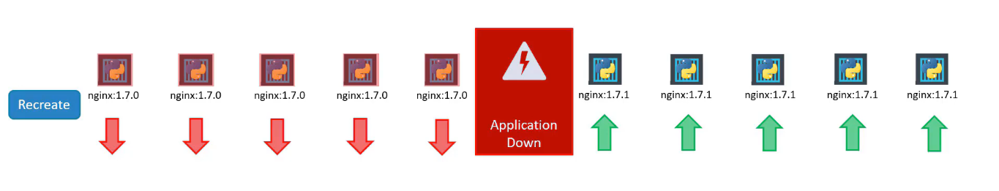

# Table of Contents

- [Table of Contents](#table-of-contents)
- [Introduction](#introduction)
- [Overview](#overview)
  - [Containers Overview](#containers-overview)
  - [Container Orchestration](#container-orchestration)
  - [Kubernetes Architecture](#kubernetes-architecture)
    - [Node](#node)
    - [Cluster](#cluster)
    - [Master](#master)
    - [Components](#components)
    - [Master vs Worker Nodes](#master-vs-worker-nodes)
    - [kubectl - Command Line Utility](#kubectl---command-line-utility)
- [Setup Kubernetes](#setup-kubernetes)
  - [Kubeadm](#kubeadm)
- [Kubernetes Concepts](#kubernetes-concepts)
  - [Pods](#pods)
  - [Multi-Container Pods](#multi-container-pods)
  - [Init Containers](#init-containers)
  - [Deploying Pods using `kubectl run`](#deploying-pods-using-kubectl-run)
- [Introduction to YAML](#introduction-to-yaml)
  - [Map](#map)
  - [List](#list)
  - [Scalars](#scalars)
- [Kubernetes Definition Files - YAML](#kubernetes-definition-files---yaml)
- [Replication Controllers and ReplicaSets](#replication-controllers-and-replicasets)
  - [Replication Controllers](#replication-controllers)
    - [What is a Replica and why do you need a Replication Controller ?](#what-is-a-replica-and-why-do-you-need-a-replication-controller-)
    - [Creating a Replication Controller](#creating-a-replication-controller)
  - [Replica Sets](#replica-sets)
    - [Creating a Replica Set](#creating-a-replica-set)
  - [Labels, Selectors and Annotations](#labels-selectors-and-annotations)
    - [Labels and Selectors](#labels-and-selectors)
    - [Annotations](#annotations)
  - [Scaling Replica Sets](#scaling-replica-sets)
    - [Method 1 - Updating the Original Definition File](#method-1---updating-the-original-definition-file)
    - [Method 2 - Updating the running configuration file](#method-2---updating-the-running-configuration-file)
    - [Method 3 - Using the `kubectl scale` command](#method-3---using-the-kubectl-scale-command)
  - [Deployments](#deployments)
    - [Deploments: Overview](#deploments-overview)
    - [Deployments: Creating a Deployment](#deployments-creating-a-deployment)
    - [Deployments: Rollout and Versioning](#deployments-rollout-and-versioning)
    - [Deployments: Deployment Strategy](#deployments-deployment-strategy)
    - [Deployments: Blue-Green Deployment Strategy](#deployments-blue-green-deployment-strategy)
    - [Deployments: Canary Deployment](#deployments-canary-deployment)
    - [Deployments: Updating a Deployment](#deployments-updating-a-deployment)
    - [Deployments: Rollback](#deployments-rollback)
- [StatefulSets](#statefulsets)
  - [StatefulSets: Definition](#statefulsets-definition)
  - [StatefulSets: Scaling `StatefulSets`](#statefulsets-scaling-statefulsets)
  - [StatefulSets: Headless Services](#statefulsets-headless-services)
  - [StatefulSets: Storage in StatefulSets](#statefulsets-storage-in-statefulsets)
- [Jobs and CronJobs](#jobs-and-cronjobs)
  - [Jobs](#jobs)
    - [Jobs: Creating and Deleting Jobs](#jobs-creating-and-deleting-jobs)
  - [CronJobs](#cronjobs)
- [Networking in Kubernetes](#networking-in-kubernetes)
  - [Networking on a Single Node](#networking-on-a-single-node)
  - [Cluster Networking](#cluster-networking)
- [Services](#services)
  - [Service: External Communication](#service-external-communication)
  - [Service Types](#service-types)
    - [NodePort](#nodeport)
    - [NodePort - Creating a Service](#nodeport---creating-a-service)
      - [Connecting externally to a Single Pod on a Node](#connecting-externally-to-a-single-pod-on-a-node)
      - [Connecting externally to Multiple Pods on a Single Node](#connecting-externally-to-multiple-pods-on-a-single-node)
      - [Connecting externally to Pods distributed across Multiple Nodes](#connecting-externally-to-pods-distributed-across-multiple-nodes)
    - [ClusterIP](#clusterip)
      - [ClusterIP: Creating a Service](#clusterip-creating-a-service)
    - [Load Balancer](#load-balancer)
      - [Load Balancer: Creating a Service](#load-balancer-creating-a-service)
- [Namespaces](#namespaces)
- [Imperative Commands](#imperative-commands)
  - [Examples](#examples)
- [Environment Variables in Kubernetes](#environment-variables-in-kubernetes)
  - [ConfigMaps](#configmaps)
    - [ConfigMaps: Create the `ConfigMap` as a Kubernetes Resource](#configmaps-create-the-configmap-as-a-kubernetes-resource)
    - [ConfigMaps: Inject the `ConfigMap` into a Pod](#configmaps-inject-the-configmap-into-a-pod)
    - [ConfigMaps: Injecting a `ConfigMap` as a file in a volume](#configmaps-injecting-a-configmap-as-a-file-in-a-volume)
  - [Secrets](#secrets)
    - [Secrets: Create the `Secret` as a Kubernetes Resource](#secrets-create-the-secret-as-a-kubernetes-resource)
    - [Secrets: Inject the `Secret` into a Pod](#secrets-inject-the-secret-into-a-pod)
    - [Secrets: Injecting a `Secret` as a file in a volume](#secrets-injecting-a-secret-as-a-file-in-a-volume)
    - [Secrets: Reminders and Security Best Practices](#secrets-reminders-and-security-best-practices)
  - [SecretList](#secretlist)
- [Kubernetes Security](#kubernetes-security)
  - [Kubernetes Security: Encryption at Rest](#kubernetes-security-encryption-at-rest)
    - [Encryption at Rest: Workflow](#encryption-at-rest-workflow)
    - [Encryption at Rest: Determine whether Encryption at Rest is already enabled](#encryption-at-rest-determine-whether-encryption-at-rest-is-already-enabled)
      - [Kind: Determine whether Encryption at Rest is already enabled](#kind-determine-whether-encryption-at-rest-is-already-enabled)
      - [Kubeadm: Determine whether Encryption at Rest is already enabled](#kubeadm-determine-whether-encryption-at-rest-is-already-enabled)
    - [Encryption at Rest: Enable Encryption Provider](#encryption-at-rest-enable-encryption-provider)
      - [EncryptionConfiguration](#encryptionconfiguration)
      - [Providers](#providers)
      - [Envelope Encrption using KMS](#envelope-encrption-using-kms)
    - [Encryption at Rest: Generate Encryption Key](#encryption-at-rest-generate-encryption-key)
    - [Encryption at Rest: Apply Configuration](#encryption-at-rest-apply-configuration)
    - [Encryption at Rest: Create or Update Secrets](#encryption-at-rest-create-or-update-secrets)
    - [Encryption at Rest: Verify Encryption](#encryption-at-rest-verify-encryption)
  - [Kubernetes Security: Docker Security](#kubernetes-security-docker-security)
  - [Kubernetes Security: Security Contexts](#kubernetes-security-security-contexts)
  - [Kubernetes Security: Service Account](#kubernetes-security-service-account)
  - [Kubernetes Security: Authentication, Authorization and Admission Control](#kubernetes-security-authentication-authorization-and-admission-control)
    - [Security Primitives in Kubernetes](#security-primitives-in-kubernetes)
  - [Kubernetes Security: Authentication](#kubernetes-security-authentication)
    - [Authentication: Basic Authentication](#authentication-basic-authentication)
      - [Step 1: Create a Static Password File / Static Token File](#step-1-create-a-static-password-file--static-token-file)
      - [Step 2: Pass the file path as an option to the `kube-apiserver`](#step-2-pass-the-file-path-as-an-option-to-the-kube-apiserver)
      - [Step 3: Create necessary `Role` and `RoleBinding` for the users](#step-3-create-necessary-role-and-rolebinding-for-the-users)
      - [Step 4: Authenticate while making a `curl` request to access the API Server](#step-4-authenticate-while-making-a-curl-request-to-access-the-api-server)
    - [Authentication: Certificates](#authentication-certificates)
      - [TLS: Basics](#tls-basics)
      - [SSH: Securing Access](#ssh-securing-access)
      - [TLS: Generating a Public and Private Key](#tls-generating-a-public-and-private-key)
      - [TLS: A Primer to Public Key Infrastructure (PKI)](#tls-a-primer-to-public-key-infrastructure-pki)
      - [TLS in Kubernetes: Certificates](#tls-in-kubernetes-certificates)
      - [TLS in Kubernetes: Certificate Creation](#tls-in-kubernetes-certificate-creation)
        - [Generate CA Certificate](#generate-ca-certificate)
        - [Generate Client Certificates](#generate-client-certificates)
  - [Kubernetes Security: KubeConfig](#kubernetes-security-kubeconfig)
- [Resource Management](#resource-management)
  - [Requests and Limits](#requests-and-limits)
  - [LimitRanges](#limitranges)
  - [ResourceQuotas](#resourcequotas)
- [Taints and Tolerations](#taints-and-tolerations)
  - [Taints and Tolerations: Overview](#taints-and-tolerations-overview)
  - [Taints and Tolerations: Applying and Removing a Taint](#taints-and-tolerations-applying-and-removing-a-taint)
  - [Taints and Tolerations: Applying a Toleration](#taints-and-tolerations-applying-a-toleration)
  - [Taints and Tolerations: Default Taint on Master Node](#taints-and-tolerations-default-taint-on-master-node)
- [Node Selectors](#node-selectors)
- [Node Affinity](#node-affinity)
  - [Node Affinity: Overview](#node-affinity-overview)
  - [Node Affinity: Multiple Expressions](#node-affinity-multiple-expressions)
  - [Taints and Tolerations vs Node Affinity](#taints-and-tolerations-vs-node-affinity)
- [Observability](#observability)
  - [Observability: Probes](#observability-probes)
    - [Readiness Probes](#readiness-probes)
      - [Pod Conditions](#pod-conditions)
      - [Readiness Probes in a Multi-Pod setup](#readiness-probes-in-a-multi-pod-setup)
  - [Logging](#logging)
  - [Monitoring](#monitoring)
    - [Monitoring: Metric Server](#monitoring-metric-server)
- [Volumes](#volumes)
  - [Volumes: Overview](#volumes-overview)
  - [Volumes: Persistent Volumes](#volumes-persistent-volumes)
  - [Volumes: Persistent Volume Claims](#volumes-persistent-volume-claims)
  - [Volumes: Using PersistentVolumeClaim in Pods](#volumes-using-persistentvolumeclaim-in-pods)
  - [Volumes: Storage Classes](#volumes-storage-classes)
- [API Groups](#api-groups)
- [Authorization](#authorization)
  - [Authorization: Overview](#authorization-overview)
  - [Authorization: Node Authorization](#authorization-node-authorization)
  - [Authorization: Attribute-based Authorization](#authorization-attribute-based-authorization)
  - [Authorization: Role-Based Access Control (RBAC)](#authorization-role-based-access-control-rbac)
    - [RBAC: `Role` and `RoleBinding`](#rbac-role-and-rolebinding)
    - [Role-Based Access Control: Create a Role](#role-based-access-control-create-a-role)
    - [RBAC: `ClusterRole` and `ClusterRoleBinding`](#rbac-clusterrole-and-clusterrolebinding)
  - [Authorization: Webhooks](#authorization-webhooks)
- [Admission Controllers](#admission-controllers)
  - [Admission Controllers: Overview](#admission-controllers-overview)
  - [Admission Controllers: Validating and Mutating Admission Controllers](#admission-controllers-validating-and-mutating-admission-controllers)
  - [Admission Controllers: Dynamic Admission Controllers](#admission-controllers-dynamic-admission-controllers)
  - [Creating a Webhook Server](#creating-a-webhook-server)
  - [Configuring Admission Webhook](#configuring-admission-webhook)
- [Kubernetes APIs](#kubernetes-apis)
  - [Kubernetes APIs: API Versions](#kubernetes-apis-api-versions)
  - [Kubernetes APIs: Enable/Disable an API Version](#kubernetes-apis-enabledisable-an-api-version)
  - [Kubernetes APIs: API Deprecations](#kubernetes-apis-api-deprecations)
  - [Kubernetes APIs: API Conversion: `kubectl convert`](#kubernetes-apis-api-conversion-kubectl-convert)
- [CustomResourceDefinitions (CRDs)](#customresourcedefinitions-crds)
  - [CRDS: The Controller](#crds-the-controller)
  - [CRDS: The Operator](#crds-the-operator)
- [Ingress](#ingress)
  - [Ingress: Overview](#ingress-overview)
  - [Ingress: Ingress Controllers](#ingress-ingress-controllers)
  - [Ingress: Ingress Resource](#ingress-ingress-resource)
  - [Ingress: Example](#ingress-example)
- [Network Policies](#network-policies)
  - [Network Policies: Overview](#network-policies-overview)
  - [Network Policies: `NetworkPolicy` Resource](#network-policies-networkpolicy-resource)
  - [Network Policies: Example #1: Control traffic in and out of the database pod in a Three-tier architecture](#network-policies-example-1-control-traffic-in-and-out-of-the-database-pod-in-a-three-tier-architecture)
- [Helm](#helm)
  - [Helm: Overview](#helm-overview)
  - [Helm: Concepts](#helm-concepts)
- [Service Mesh](#service-mesh)
  - [What is a Service Mesh?](#what-is-a-service-mesh)
  - [Benefits of Service Mesh](#benefits-of-service-mesh)
  - [Istio](#istio)
    - [Istio: About](#istio-about)
    - [Istio: Implementation of the Service Mesh](#istio-implementation-of-the-service-mesh)
    - [Istio: Evolution of the Control Plane](#istio-evolution-of-the-control-plane)
    - [Istio: Control Plane](#istio-control-plane)
    - [Istio: Data Plane](#istio-data-plane)
    - [Istio: User Interface Pods](#istio-user-interface-pods)
    - [Istio: Running Istio](#istio-running-istio)
    - [Istio: Enabling Sidecar Injection](#istio-enabling-sidecar-injection)
  - [Envoy Proxy](#envoy-proxy)
    - [Why not use Envoy instead of Istio](#why-not-use-envoy-instead-of-istio)
- [References](#references)

---

# Introduction

**Kubernetes** also known as **K8s** was built by Google based on their experience running containers in production. It is now an open source project and is arguably one of the best and most popular container orchestration technologies out there. It is supported on almost all Cloud platforms, it supports hosting enhanced and complex applications on various kinds of architectures that make it a vast and complex technology.

There are a set of pre-requisite knowledge required such as:

- Containers
- Applications
- YAML files, etc.

---

# Overview

## Containers Overview

To understand Kuberentes we need to familiarize ourselves with two concepts:

- Containers and
- Orchestration.

Once we familiarize ourselves with both of these terms, we would be in a position to understand what Kubernetes is capable of.

Containers are completely isolated environments that can have their own processes and networks and their own mounts just like virtual machines, except they share the same operating system kernel. Containers are not new with Docker. Containers have existed for over 10 years now, and some of the different types of containers are LXC, LXD, LXCFS etc. Docker utilizes LXC containers. Setting up these container environments is hard as they are very low level and that is where Docker offers a high level tool with several powerful functions, making it really easy for end users.

To understand how Docker works, let's revisit some operating system concepts first. All Operating systems consist of two things - An OS Kernel and a set of software.
The OS Kernel is responsible for interacting with the underlying hardware. While the OS Kernel may remain the same for Operating systems like Ubuntu, CentOS, Fedora, which is Linux in this case, it is the software above it that makes these Operating Systems different. This software may consist of a different user interface, drivers, compilers, file managers, developer tools, etc. So you have a common Linux kernel shared across various operating systems and some custom software that differentiates Operating Systems from each other.

We said earlier that Docker containers share the underlying kernel. What does that mean?

Let's say we have an Ubuntu OS with Docker installed on it. Docker can run any flavour of OS on top of it as long as they are all based on the same kernel, in this case Linux. If the underlying operating system is Ubuntu, Docker can run a container based on another distribution like Debian, Alpine, Fedora or CentOS. Each Docker container only has the additional software that we talked about earlier, that makes these operating systems different and Docker utilizes the underlying kernel of Docker host which works with all the operating systems that are based off the kernel.

This means that we won't be able to run a Windows based container on a Docker host with Linux based OS on it. For that, we would require Docker on a Windows server.

Unlike Hypervisors, Docker is not meant to virtualize and run different operating systems and kernel with the same hardware. The main purpose of Docker is to containerize applications and to ship them and run them.

Read about the **[Differences between Virtual Machines and Containers](https://github.com/jayantasamaddar/quick-reference/tree/main/docker#virtual-machines-vs-containers)**.

---

## Container Orchestration

Let's say, we now have our application packaged into a Docker container. But what's next? How do we run it in production? What if your application relies on other services such as databases or messaging services or other backend services? What if the number of users increase and you need to scale your application? How do you scale down when the load decreases?

To enable these functionalities, you need an underlying platform with a set of resources and capabilities. The platform needs to orchestrate the connectivity between the containers and automatically scale up or down based on the load. This whole process of automatically deploying and managing containers is called Container Orchestration.

**Kubernetes** is just a Container Orchestration technology. There are multiple such technologies available today. Docker has it's own tool called **Docker Swarm**, **Kubernetes** from Google and **MESOS** from Apache. While Docker Swarm is really easy to setup and get started, it lacks some of the advanced features require for complex applications. MESOS on the other hand is quite difficult to setup and get started, but supports many advanced features. Kubernetes, arguably the most popular of them all, is a bit difficult to setup and get started with, but provides a lot of options to customize deployments and supports deployments of complex architectures.

Kubernetes is now supported on all public cloud service providers like GCP, Azure and AWS and the Kubernetes project is one of the top ranked projects on GitHub.

There are various **Advantages of Container Orchestration**:

- **High Availability** - Hardware failures do not bring the application down because we have multiple instances of the application running on different nodes.
- **Load Balanced Traffic** - The user traffic is load balanced across the various containers. When demand increases, deploy more instances of the services seamlessly in a matter of seconds.
- **Vertical Scaling** - When we run out of hardware resources, scale the number of underlying nodes up or down, without having to take down the application.
- **Ease of Use** - Do all of these easily with a set of declarative object configuration files.

To summarize, **Kubernetes** is a container orchestration technology used to orchestrate the deployment and management of hundreds and thousands of containers in a clustered environment.

---

## Kubernetes Architecture

Before we delve into setting up a Kubernetes cluster, it is important to understand some of the basic concepts. This will familiarize us with the terms we will come across while working with Kubernetes.

### Node

A **`Node`** is a machine - physical or virtual, on which Kubernetes in installed. A Node is a worker machine and that is where containers will be launched by Kubernetes. It was also known as **`minions`** in the past.


---

### Cluster

But what if the Node on which your application was running fails? Our application would go down.
So we need to have more than one node. A **`Cluster`**, is a set of nodes grouped together. This way, even if one Node fails, you still have your application still accessible from the other nodes. Moreover having multiple nodes helps in sharing load as well.


---

### Master

Now we have a Cluster - but who is responsible for managing the cluster? Where is the information about the members of the cluster stored? How are the nodes monitored? When a Node fails, how do you move the workload of the failed node to another worker node? That's where the **`Master`** comes in. The Master is another Node with Kubernetes installed on it and is configured as the Master.


The Master watches over the nodes in the Cluster and is responsible for the actual orchestration of containers on the worker nodes.

---

### Components


When you install Kubernetes, you are actually installing the following Components:

1. **API Server** - The API Server acts as a frontend for Kubernetes. The users, management devices, command line interfaces, all talk to the API server to interact with the Kubernetes cluster.

2. **etcd service** - etcd is a distributed, reliable key-value store used by Kubernetes to store all data used to manage the Cluster. When you have multiple Nodes and multiple Masters in your cluster, etcd stores all that information on all the Nodes in the Cluster in a distributed manner. etcd is responsible for implementing locks within the cluster to ensure that there are no conflicts between the Masters.

3. **Schedulers** - The Scheduler is responsible for distributing work or containers across multiple Nodes. It looks for newly created containers and assigns them to Nodes.

4. **Controllers** - The Controllers are the brain behind the orchestration. They are responsible for noticing and responding when nodes, containers or end points go down. The controllers make decisions to bring up new containers in such cases.

5. **Container Runtime** - The Container Runtime is the underlying software that is used to run containers. In our case, it happens to be Docker. But there are other options as well.

6. **kubelet service** - Kubelet is the agent that runs on each Node in the Cluster. The agent is responsible for making sure that they containers are running on the Nodes as expected.

---

### Master vs Worker Nodes

So far, we saw two types of servers - Master and Worker, and a set of components that make up Kubernetes. But how are these components distributed across different types of servers? In other words, how does one server become a Master and others Slaves?


The worker node or minion as it is known, is where the containers are hosted. For e.g. Docker containers. To run Docker containers on a system, we need Container Runtime installed, and that's where the Container Runtime comes in - in our case it happens to be Docker. This however doesn't have to be Docker, there are other Container Runtimes alternatives available such as Rocket or Cryo.

The Master server has the Kube API Server, that makes it the Master. Similarly, the worker nodes have the Kubelet agent that is responsible for interacting with a Master to provide health information of the Worker node and carry out actions requested by the Master on the Worker nodes. All the information gathered, are stored on a key-value store on the Master. The key-value store is based on the popular etcd framework as discussed above. The Master also has the Controller and the Scheduler. There are other components as well, but we will stop here for now.

---

### kubectl - Command Line Utility

Lastly, we need to learn about one of the Command Line Utilities known as the **`Kube Command Line Tool`** or **`kubectl`** or **`Kube Control`** as it is also called.

The kubectl is used to deploy and manage applications on a Kubernetes cluster. To get cluster information, to get status of other Nodes in the cluster and to manage many other things.

- The **`kubectl run [ApplicationImage]`** command is used to deploy an application on the Cluster.

- The **`kubectl cluster-info`** command is used to view information about the Cluster.

- The **`kubectl get nodes`** command is used to list all the nodes part of the Cluster. Shows:

  - Name
  - Status
  - Roles
  - Age
  - Version

- The **`kubectl get nodes -o wide`** to view additional information. Shows:
  - Name
  - Status
  - Roles
  - Age
  - Version
  - Internal-IP
  - External-IP
  - OS-Image
  - Kernel-Version
  - Container-Runtime

---

# Setup Kubernetes

Kubernetes is complex—because it is a tool designed by Google to cater for complex microservices and distributed environments. Especially when you are in the development or testing phase of your application, running k8s might be cumbersome, and using a managed Kubernetes service might be costly. To make it easier to run Kubernetes, especially in dev and test environments, we need a tool that simplifies this complexity.

These days, many tools parade themselves, claiming to serve the purpose of Kubernetes in simpler form for smaller environments. Using such tools allows Kubernetes developers to easily test out their applications and ensure things will work as fine as they work in the dev/test environment in production. Of such tools, **`minikube`**, **`microk8s`**, **`kind`**, and **`k3s`** are some of the most trusted to deliver as expected.

## Kubeadm

The Kube Admin tool is used to bootstrap and manage production-grade Kubernetes clusters. There are also hosted and managed solutions available for setting up Kubernetes in a Cloud environment such as GCP, AWS or IBM Cloud and many others. These are some of the many options available to a deploy a Kubernetes cluster.

---

# [Kubernetes Concepts](https://kubernetes.io/docs/concepts/)

## [Pods](https://kubernetes.io/docs/concepts/workloads/pods/pod-overview/)

As discussed before, with Kubernetes, our ultimate aim is to deploy our application in the form of containers on a set of machines that are configured as Worker Nodes in a cluster. However, Kubernetes does not deploy containers directly on the Worker Nodes. The containers are encapsulated into a Kubernetes object known as a Pod.

A Pod is a single instance of an application. A Pod is the smallest object that you can create in Kubernetes.

Here's a simple case:
A Single Node Kubernetes Cluster with a single instance of a Python Application, running in a Single Docker container encapsulated in a Pod. Now, what if the number of users increase and there is a need to add additional instances to share the load? Where would we spin up additional instances? Do we bring up a new container instance within the same Pod? No, we create a new Pod altogether with a new instance of the same application.


What if the users further increase and the current Node doesn't have sufficient capacity. Well then, you can always deploy additional Pods in a new Node in the cluster. A new Node to the cluster is added to expand the Cluster's physical capacity.

To summarize,

- Pods usually have a one-to-one relationship with containers running our application.
- To scale up we create new Pods and to scale down, you delete existing Pods. You do not add additional containers to an existing Pod to scale your application.

In a later section, we shall see how we orchestrate the Pods, achieve load balancing between the containers, etc.

---

## Multi-Container Pods

We just discussed how Pods usually have a one-to-one relationship with containers. But are we restricted to having a single container in a single Pod? No.

A single Pod can have multiple containers, except that they are usually not multiple containers of the same kind. As we discussed earlier, if our intention was to scale our application, then we would need to create additional Pods. But sometimes, we may have a scenario where you have a Helper container that might be some kind of supporting task for our application, such as processing a user-entered data, processing a file uploaded by the user, etc. and you want these Helper containers to live alongside your application container.

In that case, you can have both of these containers as part of the same Pod, so that when a new application container is created, the Helper is also created, and when it does, the Helper also dies, as they are part of the same Pod. The two containers can also communicate with each other directly by referring to each other as localhost, since they share the same network space. Plus, they can share the same storage space as well.


Even if our application didn't happen to be so complex, and it could live in a single container, Kubernetes still requires us to create Pods. This is beneficial in the long run as our application is now equipped for architectural changes and scale in the future. Note that, Multi-container Pods are a rare use case and for the most, we will be sticking to Single-container Pods.

There are three patterns when it comes to multi-container pods:

- **Sidecar Pattern**: E.g. Deploying a logging agent alongside an application and forwarding them to a central server.
- **Adapter Pattern**: E.g. Having a data transformer to transform logs from different applications before sending to a central server.
- **Ambassador Pattern**: E.g. Handle reverse-proxy logic

---

## [Init Containers](https://kubernetes.io/docs/concepts/workloads/pods/init-containers/)

Init containers are specialized containers that run before app containers in a Pod.

In a multi-container pod, each container is expected to run a process that stays alive as long as the POD's lifecycle. For example in the multi-container pod that we talked about earlier that has a web application and logging agent, both the containers are expected to stay alive at all times. The process running in the log agent container is expected to stay alive as long as the web application is running. If any of them fails, the POD restarts.

But at times you may want to run a process that runs to completion in a container. For example a process that pulls a code or binary from a repository that will be used by the main web application. That is a task that will be run only one time when the pod is first created. Or a process that waits for an external service or database to be up before the actual application starts. That's where **`initContainers`** comes in.

An `initContainer` is configured in a pod like all other containers, except that it is specified inside a `initContainers` section, as given below.

When a POD is created the `initContainer` is run first, and the process in the `initContainer` must run to a completion before the real container hosting the application starts.

You can configure multiple such `initContainers` as well, like how we did for multi-pod containers. In that case each init container is run one at a time in sequential order.

```yaml
apiVersion: v1
kind: Pod
metadata:
  name: myapp-pod
  labels:
    app: myapp
spec:
  containers:
    - name: myapp-container
      image: busybox:1.28
      command: ["sh", "-c", "echo The app is running! && sleep 3600"]
  initContainers:
    - name: init-myservice
      image: busybox:1.28
      command:
        [
          "sh",
          "-c",
          "until nslookup myservice; do echo waiting for myservice; sleep 2; done;",
        ]
    - name: init-mydb
      image: busybox:1.28
      command:
        [
          "sh",
          "-c",
          "until nslookup mydb; do echo waiting for mydb; sleep 2; done;",
        ]
```

---

## Deploying Pods using `kubectl run`

Earlier we learned about the `kubectl run [ApplicationImage]` command.
`kubectl run nginx` would create a Pod automatically and deploys an instance of the Nginx Docker Image. But where does it get the Application Image from? For that, we need to specify the image name using the `--image` flag.

```s
# Syntax
kubectl run [POD NAME] --image=[IMAGE]:[TAG]

# Run Nginx
kubectl run nginx --image=nginx
```

The Application Image, i.e. Nginx image, is downloaded from the Docker Hub repository. Docker Hub is a public repository where latest Docker images of various applications are stored. You could configure Kubernetes to pull the image from the public Docker Hub or a private repository within the organization.

Now that we have a Pod created, how do we see the list of Pods available?

```s
# Get Pods
kubectl get pods

# Get Pods with more information
kubectl get pods -o wide
```

Right now, in the current state, the Nginx web server is not accessible to external users. We can access it internally from the Node. In a later section, once we encounter Networking and services we will get to know how to make the service accessible to end-users.

To get more information about a specific pod, we can use,

```s
kubectl describe pod [POD NAME]
```

---

# Introduction to YAML

YAML is a data serialization language that is often used for writing configuration files. A YAML file is used to represent data, in this case, configuration data.

Here is a quick comparison of a sample data in three formats.


YAML is also a superset of JSON, so JSON files are valid in YAML.

YAML uses Python-style indentation to indicate nesting. Tab characters are not allowed, so whitespaces are used instead. There are no usual format symbols such as braces, square brackets, closing tags or quotation marks. YAML files use a .yml or .yaml extension.

The structure of a YAML file is a Map or a List.

## Map

Maps allow you to associate key-value pairs. Each key must be unique, and the order doesn't matter. Think of a Python Dictionary or a variable assignment in a Bash script or a JavaScript Object or Map.
A map in YAML needs to be resolved before it can be closed, and a new Map is created. A new map can be created by either increasing the indentation level or by resolving the previous map and starting an adjacent map.

```yml
Banana:
  calories: 105
  fat: 0.4g
  carbs: 27g

Grapes:
  calories: 62
  fat: 0.3g
  carbs: 16g
```

## List

A List includes values listed in a specific order and may contain any number of items needed. A list sequence starts with a dash (-) and a space, while indentation separates it from the parent. Think of a Python list or an Array in JavaScript or Bash. A list can be embedded into a Map.

```yml
Fruits:
  - Orange
  - Apple
  - Banana

Vegetables:
  - Carrot
  - Cauliflower
  - Potato
```

## Scalars

YAML also contains scalars, which are arbitrary data (encoded in Unicode) that can be used as values such as strings, integers, dates, numbers of booleans.

```yml
Fruit: Apple
Quantity: 1
Price: 50.00
Date: 25-09-2022
keepsDoctorAway: true
```

When creating a YAML file, you'll need to ensure that you follow these syntax rules and that your file is valid. A linter is an application that verifies the syntax of a file. The `yamllint` command can help ensure that you've created a valid YAML file before you hand it over to an application.

---

# Kubernetes Definition Files - YAML

Kubernetes uses YAML files as input configurations for the creation of objects such as Pods, Replicas, Deployment services, etc. All of these follow a similar structure.

A Kubernetes definition file always contain 4 top level or root level fields (required):

In **`pod-definition.yml`**,

```yml
apiVersion: v1
kind: Pod
metadata:
  name: postgres-pod
  labels:
    app: postgres
    type: database
spec:
  containers:
    - name: postgres
      image: postgres
      ports:
        - containerPort: 5432
      env:
        - name: POSTGRES_USER
          value: "postgres"
        - name: POSTGRES_PASSWORD
          value: "postgres"
```

1. **`apiVersion`** - The version of the Kubernetes API you're using to create the objects. Depending on what we are trying to create we must use the right `apiVersion`. For e.g. if we are working on **Pods**, we set the `apiVersion: v1` or when working with **ReplicaSets** and **Deployments** we can set it as `apiVersion: apps/v1`. It can also be something like `kind.x-k8s.io/v1alpha4` as we can see during the creation of the Cluster using Kind. At the moment, this is all you require to know.

If you are curious to know why, this is not needed to know at this stage. However the following is the answer and it requires understanding of **[CustomResourceDefinitions (CRDS)](https://kubernetes.io/docs/tasks/extend-kubernetes/custom-resources/custom-resource-definitions/)** or how Kubernetes Resources are defined:

The format for the apiVersion is `apiGroup/version`. So what is the group and what is the version? This group is defined when the Kubernetes Resource is defined. **Pods**, **ReplicaSets**, **Deployments**, **Services** are all default Kubernetes resources which have definition files (YAML). It is also possible to define custom Kubernetes resources using Custom Resource Definitions (CRDS) which allows you to extend the Kubernetes API to create custom resources. This is typically a YAML file where you have to specify a group and version(s) for the Kubernetes resource. The group, groups Kubernetes resources together and the versions may track any changes. Now, in this case, Pods have no defined Api group and Deployments belong to the `apps` api group and for both the version is `1`. Hence the `apiGroup: v1` is used when creating a pod but `apiGroup: apps/v1` is used for Deployments. We used `kind` (the CLI tool) to create the Cluster, where the `apiVersion` is `kind.x-k8s.io/v1alpha4`. As you can expect, `x-k8s.io` is the group name for the Cluster resource and `v1alpha4` is the version.

1. **`kind`** - The type of object we are trying to create. Possible values: `Pod`, `ReplicaSet`, `Service`, `Deployment`.

2. **`metadata`** - The metadata is data about the object like its `name`, `labels` etc. This is the form of a dictionary.

   - **`name`** - The `name` is a string value while that refers to the name of the Kubernetes object.
   - **`labels`** - `labels` is a dictionary value. For example, if there are hundreds of pods running a frontend application and hundreds of pods running a backend application, it would be difficult to group these parts once deployed. If you label them as `frontend` or `backend` or `database`, you will be able to filter these Pods based on the label at a later point in time.

> **Note**: It's important to note that under metadata you can only specify `name` or `label` or anything else that Kubernetes expects under metadata. You cannot add any other property as you wish under this. However, under **`labels`**, you can have any key-value pair as you see fit.

4. **`spec`** - We have specified the name of the Pod as `myapp-prod` but he haven't really specified the container or image we need in the Pod. The last section in the configuration file is the specification section or **`spec`**. Depending on the Kubernetes object we are going to create, this is where we would provide additional information to Kubernetes pertaining to that object. This is going to be different for different objects so it's important to understand or refer to the documentation section to get the right format for each since.

   Since we are creating a Pod with a single container in it, it is easy. **`spec`** is a dictionary, so we can add a property under it called `containers`.

   - **`containers`** - `containers` is a list or an array of dictionaries as the pods can have multiple containers within them. In this case, we will add a single item to the list, since we plan to have a single container for the Pod. Each container object has certain required and optional fields.
     - **`name`** - Name of the container. Auto-generated if not provided. (RECOMMENDED)
     - **`image`** - Image that the container must be created from. By default attempts to fetch from Docker Hub. (MANDATORY)
     - **`ports`** - A list of Ports to expose. `containerPort` refers to the port on the container that is to be exposed. Note that, `containerPort` is purely informational, that can be used by the DevOps personnel to expose the Pod externally via a [NodePort Service](#nodeport) for an actual use case. (OPTIONAL)
     - **`env`** - A List of environment variables (Dictionaries of `name` and `value` pairings), if any. (OPTIONAL)
       - **`name`** - The environment variable.
       - **`value`** - The value of the environment variable.

   > **Note:** Environment variables should not be hardcoded. We should use **ConfigMaps**, which are a topic to be explored later.

Once the file is created, from the command line run the following to Create the Pod:

```s
# Syntax
kubectl create -f [FILE NAME]

# Command
kubectl create -f pod-definition.yml

# Using kubectl apply (when creating a new object)
kubectl apply -f pod-definition.yml
```

---

# Replication Controllers and ReplicaSets

Controllers are the brain behind Kubernetes. They are the processes that monitor Kubernetes objects and respond accordingly.

We will talk about one particular controller in this section: The Replication Controller

## Replication Controllers

### What is a Replica and why do you need a Replication Controller ?

1. **High Availability** - The Replication Controller helps us run multiple instances of a single Pod in the Kubernetes Cluster, thus providing high availability.
   So does that mean you cannot have a Replication Controller if you plan to use a single Pod? No.
   Even if you have a single Pod, the Replication Controller can help by automatically bringing up a new Pod when the existing one fails. Thus, the Replication Controller ensures that the specified number of pods are running at all times.

2. **Load Balancing and Scaling** - Another reason why we need the Replication Controller is to create multiple pods to share the load across them. We may have a single Pod serving a set of users and as the load increases we deploy additional pods to balance the load across the two pods. If the demand further increases, and we were to run out of resources on the first Node, we could deploy additional pods across the other nodes in the Cluster. As you can see the Replication Controller spans across multiple Nodes in the Cluster. It helps us balance the load across multiple pods on different Nodes as we scale our application.

   

### Creating a Replication Controller

We start off by creating a Replication Controller definition file. We will name it `rc-definition.yaml`. As with every Kubernetes definition file, we have four sections -

- **`apiVersion`** - The Replication Controller is available in Kubernetes since apiVersion `v1`.
- **`kind`** - The `kind` will be `ReplicationController`.
- **`metadata`** - As usual.
- **`spec`** - For any Kubernetes definition file, the `spec` section defines what is inside the object we are creating. In this case, we know that the `ReplicationController` creates multiple instances of a Pod. But what Pod?

  - **`template`** - We create a `template` section to provide a Pod template to be used by the `ReplicationController` to create replicas. Now, how do we define the Pod template?

  Remember the pod definition file from the previous sections. We could reuse the contents of the file to populate the template section.

  

  We can move all the contents of the Pod Definition file into the template section (except the first two lines, `apiVersion` and `kind`).

  

  - **`replicas`** - Something is still missing! We haven't added the number of replicas we need in the Replication Controller. For that, we need to add another property called `replicas` with the number of replicas we need.

  Remember that `template` and `replicas` are direct children of the `spec` section, so they are siblings and must be indented along the same vertical line, which means equal number of spaces before them.

```yaml
apiVersion: v1
kind: ReplicationController
metadata:
  name: myapp-rc
  labels:
    app: myapp
    type: frontend
spec:
  template:
    metadata:
      name: nginx
      labels:
        app: nginx
        type: frontend
    spec:
      containers:
        - name: nginx
          image: nginx
  replicas: 3
```

Once the file is ready, we can run:

```s
kubectl create -f [FILENAME]
```

The Replication Controller is created. When the Replication Controller is created it first creates the Pods using the Pod definition template as many as required, which is 3 in this case. To view the list of created Replication Controllers, run the following command to see the Replication Controller listed with the **Desired** number of replicas or pods, **Current** number of replicas and how many of them are **Ready**:

```s
kubectl get replicationcontroller
```

> **Note:** There are two similar terms - Replication Controller and Replica Sets. Both have the same purpose but they are not the same. Replication Controller is the older technology that is being replaced by Replica Set.

---

## Replica Sets

Replica Set is the new recommended way to set up replication. The same concepts that apply to Replication Controller applies to Replica Set as well. There are minor differences in the way they work, and we'll explore that in a bit.

### Creating a Replica Set

```s
apiVersion: apps/v1
kind: ReplicaSet
metadata:
  name: myapp-replicaSet
  label:
    app: myapp
    type: frontend
spec:
  template:
    metadata:
      name: nginx
      labels:
        app: nginx
        type: frontend
    spec:
      containers:
        - name: nginx
          image: nginx
  replicas: 3
  selector:
    matchLabels:
      type: frontend
```

The **`selector`** section helps the Replica Set identify which Pods fall under it. But why would you have to specify what pods fall under it if you have provided the contents of the Pod definition file itself in the template? It's because Replica Sets can also manage Pods that were not created as part of the Replica Set creation.

For example, They were Pods created before the creation of the Replica Set that match labels specified in the **`selector`**, the Replica Set will also take those pods into consideration when creating replicas.

The **`selector`** is the major difference between the ReplicationController and the ReplicaSet. The **`selector`** is not a required field in the case of a ReplicationController but it is still available. When you skip it, it assumes it to be the same as the labels provided in the pod definition file. In case of Replica Set, a user input is required for the **`selector`** property and it has to be written in the form of `matchLabels` as shown above.
The `matchLabels` selector simply matches the labels specified under it to the labels on the Pods. The Replica Set provider also provides many other options for matching labels that were not available in a Replication Controller.

To create a Replica Set from a definition file, run the command:

```s
kubectl create -f [FILENAME]
```

To view the list of created Replica Sets, run the following command to see the Replica Sets listed with the **Desired** number of replicas or pods, **Current** number of replicas and how many of them are **Ready**:

```s
kubectl get replicaset
```

---

## Labels, Selectors and Annotations

### Labels and Selectors

Why do label our pods and objects in Kubernetes?

Let's look at a scenario. Say, we deployed three instances of our front-end application as three pods. We would like to create a Replication Controller or Replica Set to ensure that we have three active pods at all times. This is one of the use case, of Replica Sets - you can use it to monitor existing pods if you have them already created. In case, they were not created, the ReplicaSet would create them for you. The role of the Replica Set is to monitor the pods and if any of them were to fail, deploy new ones. The Replica Set is in fact a process that monitors the pods.

Now, how does the Replica Set know which pods to monitor? There could be hundreds of other pods in the cluster running different applications. This is where labelling our Pods during creation, comes in handy. We can now provide these labels as a filter for the Replica Set. Under the **`selector`** section we use the **`matchLabels`** filter and provide the same label that we used while creating the Pods. This way the Replica Set knows which Pods to monitor.


The same concept of labels and selectors are used in many other places in Kubernetes. Kubernetes objects use labels and selectors internally to connect different objects together.

For example in a **`ReplicaSet`**, we may find labels in two places. In order to connect the **`ReplicaSet`** to the **`Pod`**, we configure the `selector` field under the **`ReplicaSet`** specification to match the `labels` defined on the pod. On creation, if the `labels` match, the **`ReplicaSet`** is created successfully.

```yaml
apiVersion: apps/v1
kind: ReplicaSet
metadata:
  labels:
    app: example-app
spec:
  template:
    metadata:
      labels:
        app: example-app-pod
    spec:
      containers:
        - name: nginx
          image: nginx
  selectors:
    matchLabels:
      app: example-app-pod
  replicas: 3
```

```bash
# Get pods that have all the given labels (AND operation)
kubectl get pods --selector env=prod,bu=finance,tier=frontend

# Get pods that either have the following labels defined by each `--selector` flag (OR operation)
kubectl get pods --selector env=prod --selector bu=finance --selector tier=frontend
```

It works the same for other objects like a **`Service`**. When a **`Service`** is created, it uses the `selector` defined in the **`Service`** definition file to match the labels set on the pods, in the **`ReplicaSet`** definition file.

```yaml
apiVersion: v1
kind: Service
metadata:
  name: example-service
spec:
  selector:
    app: example-app-pod
  ports:
    - protocol: TCP
      port: 80
      targetPort: 9376
```

---

### Annotations

While `labels` and `selectors` are used to group Kubernetes objects, `annotations` are used to record other details for information purpose only.

---

## Scaling Replica Sets

Let's say, we started with 3 Replicas, and in the future we decided to scale to 6. How do we update our ReplicaSet to scale to 6? There are multiple ways to do it:

### Method 1 - Updating the Original Definition File

- Update the number of **`replicas`** in the definition file to 6.
- Run the `kubectl replace` or `kubectl apply` command with the newly updated file. This will update the Replica Set to have 6 Replicas.

  ```s
  # Using `replace`
  kubectl replace -f [FILENAME]

  # using `apply`
  kubectl apply -f [FILENAME]
  ```

> **Note:** This is the recommended way of scaling replicas as this allows for changes to the definition file to be tracked by version control and reflected on Kubernetes through a CI/CD pipeline.

---

### Method 2 - Updating the running configuration file

- Using the **`kubectl edit [TYPE] [NAME]`** command open the running configuration file

  ```s
  kubectl edit replicaset [NAME]
  ```

- Change the replicas to the desired count and save an exit the editor to let Kubernetes update the running configuration.

> **Note:** The **`kubectl edit [TYPE] [NAME]`** does not edit the original definition file. It opens the running configration saved by Kubernetes in memory. Changes made to this file are directly applied on the running configuration of the cluster as soon as the file is saved. Thus caution must be exercised when making changes here.

---

### Method 3 - Using the `kubectl scale` command

1. Run the **`kubectl scale`** command as below specifying the replicas and specifying the same file as input.

```s
# Syntax
kubectl scale --replicas=[COUNT] -f [FILENAME]

# Example
kubectl scale --replicas=6 -f replicaset-definition.yaml
```

OR

2. Run the `kubectl scale` command as below specifying the replicas, with the [TYPE] [NAME] format.

```s
# Syntax
kubectl scale --replicas=[COUNT] [TYPE] [NAME]

# Example
kubectl scale --replicas=6 replicaset myapp-replicaSet
```

> **Note:** Using the `kubectl scale` command doesn't update the definition file.

There are also options available to scale Replica Sets based on load, but that is an advanced topic to be discussed in a later section.

---

## Deployments

### Deploments: Overview

Let's focus on how we want to deploy our application in a production environment.
Let's say, we have a web server that needs to be deployed in a production environment. We need not just one, but many such instances of the web server running for obvious reasons. Secondly, when newer version of the application build is available on the container Registry (e.g. Docker Hub), we would like to upgrade our Docker instances seamlessly. However, when we upgrade our instances, we don't want to upgrade all of them at once as we just did, this may impact our users accessing our applications, so we may want to upgrade them one after another. This kind of update is called a rolling update.

Suppose one of the upgrades you performed resulted in an unexpected error and you're asked to undo the recent change, you would like to be able to roll back the changes that were recently carried out.

Finally, say for example, you would like to make multiple changes to your environment such as upgrading the underlying web server versions, as well as scaling your environment, and also modifying the resource allocations etc., you do not want to apply each change immediately after the command is run. Instead you would like to apply a pass to your environment, make the changes, and then resume, so that all the changes are rolled out together.

All of these capabilities are available with the Kubernetes Deployments.


We learned about Pods which deploy single instances of our application, such as the web application in this case. Each container is encapsulated in a Pod. Multiple such Pods are deployed using Replication Controllers or Replica Sets. Then comes, Deployment, which is a Kubernetes object that comes higher in the hierarchy.

The Deployment provides us with the capability to upgrade the underlying instances seamlessly using rolling updates, undo changes, and pause and resume changes as required.

---

### Deployments: Creating a Deployment

So how do we create a deployment?

- We first create a Deployment Definition file. The contents of the Deployment definition file are exactly similar to the Replica Set definition file, except for the kind which is going to be **`Deployment`**.

```yaml
apiVersion: apps/v1
kind: Deployment
metadata:
  name: myapp-deployment
  labels:
    app: nginx
    tier: frontend
spec:
  template:
    metadata:
      name: nginx
      labels:
        app: nginx
        tier: frontend
    spec:
      containers:
        - name: nginx
          image: nginx
  replicas: 3
  selector:
    matchLabels:
      app: nginx
```

---

### Deployments: Rollout and Versioning

Before we look at how we can upgrade our application, let's try to understand rollouts and versioning in a deployment. When you first create a deployment, it triggers a **`rollout`**. A new rollout creates a new deployment revision. Let's call it Revision 1. In the future, when the container version is updated to a new one, a new rollout is triggered and a new Deployment revision is created, named Revision 2. This helps us keep track of changes made to our deployment, and enables us to rollback to a previous version of deployment, if necessary.


**Commands:**

- We can see the status of your rollout by running the command:

  ```s
  kubectl rollout status deployment/[NAME]
  ```

- To see revisions and history of rollout, run the following command:

  ```s
  kubectl rollout history deployment/[NAME]
  ```

---

### Deployments: Deployment Strategy

There are two types of Deployment strategies:

1. **Recreate Strategy**: In this strategy if a newer version of an application is to be deployed, the existing replicas are first destroyed and create newer versions of the application instances. The problem with this is that there will be a downtime during which the application cannot be accessed by anybody, when all the running replicas are taken down and the newer versions are not yet up and running.

   

   We can set the Recreate strategy by modifying the definition file to use `.spec.strategy.type==Recreate`.

   ```yaml
   apiVersion: apps/v1
   kind: Deployment
   metadata:
     name: example-deployment
   spec:
     replicas: 5
     selector:
       matchLabels:
         name: example-webapp
     strategy:
       type: Recreate
     template:
       metadata:
         labels:
           name: example-webapp
       spec:
         containers:
           - name: nginx
             image: nginx
   ```

2. **Rolling Update**: The second strategy is where we do not destroy all the replicas at once. Instead we take down the older version and bring back a newer version, one by one. This way, the application never goes down, and the upgrade is seamless. This is the default strategy set at `.spec.strategy.type==RollingUpdate`.

   

   We can set `maxUnavailable` and `maxSurge` to control the rolling update process.

   - `MaxUnavailable`: `.spec.strategy.rollingUpdate.maxUnavailable` is an optional field that specifies the maximum number of Pods that can be unavailable during the update process. The value can be an absolute number (for example, `5`) or a percentage of desired Pods (for example, `10%`). The absolute number is calculated from percentage by rounding down. The value cannot be 0 if `.spec.strategy.rollingUpdate.maxSurge` is `0`. The default value is `25%`.

   - `MaxSurge`: `.spec.strategy.rollingUpdate.maxSurge` is an optional field that specifies the maximum number of Pods that can be created over the desired number of Pods. The value can be an absolute number (for example, `5`) or a percentage of desired Pods (for example, `10%`). The value cannot be `0` if `MaxUnavailable` is `0`. The absolute number is calculated from the percentage by rounding up. The default value is `25%`.

     ```yaml
     apiVersion: apps/v1
     kind: Deployment
     metadata:
       name: example-deployment
     spec:
       replicas: 5
       selector:
         matchLabels:
           name: example-webapp
       strategy:
         type: RollingUpdate
         rollingUpdate:
           maxSurge: 25%
           maxUnavailable: 25%
       template:
         metadata:
           labels:
             name: example-webapp
         spec:
           containers:
             - name: nginx
               image: nginx
     ```

---

### Deployments: Blue-Green Deployment Strategy

Blue-Green is a deployment strategy where the new version (green) is deployed alongside the old version (blue).

Initially, 100% of the traffic is still routed to the old version. However, we will slowly shift the traffic from the blue to the green. Here's how it works:

**STEPS**:

1. We have the `blue` version of our application running as a deployment. We create a service to route traffic to it. We label the pods with a label like: `version: v1`. We use the same label as `selector` on the service.
2. We then run a `green` version of our application as a deployment.
3. Once all tests are passed, we route traffic from the service to the green deployment by changing the selector to `version: v2` on the service.

**Example**:

1. The `blue` version of the application running as a deployment with a service attached to it.

```yaml
apiVersion: apps/v1
kind: Deployment
metadata:
  name: example-webserver
spec:
  replicas: 2
  selector:
    matchLabels:
      version: v1
  template:
    metadata:
      name: example-webserver-v1
      labels:
        version: v1
    spec:
      containers:
        - name: example-app
          image: example-app:1.0
```

In `example-webserver-svc.yaml`.

```yaml
apiVersion: v1
kind: Service
metadata:
  name: example-webserver-svc
spec:
  type: ClusterIP
  selector:
    version: v1
  ports:
    - port: 80
      targetPort: 80
```

Run `kubectl apply -f [FILENAME]` to start the deployment and service.

2. Deploy the green version.

```yaml
apiVersion: apps/v2
kind: Deployment
metadata:
  name: example-webserver-v2
spec:
  replicas: 2
  selector:
    matchLabels:
      version: v2
  template:
    metadata:
      name: example-webserver
      labels:
        version: v2
    spec:
      containers:
        - name: example-app
          image: example-app:2.0
```

3. Modify the selector in the Service: `example-webserver-svc`, to use `version: v2`

```bash
kubectl get svc/example-webserver-svc -o yaml > example-webserver-svc-v2.yaml
```

Modify `example-webserver-svc-v2.yaml` to:

```yaml
apiVersion: v1
kind: Service
metadata:
  name: example-webserver-svc
spec:
  type: ClusterIP
  selector:
    version: v2
  ports:
    - port: 80
      targetPort: 80
```

Run `kubectl apply -f example-webserver-svc-v2.yaml` to make the changes.

> **Note**:
>
> - A Blue-Green deployment done is best done with [Service Meshes](#service-mesh) like [Istio](#istio). More on that in the later sections.
> - Before deleting the `blue` deployment ensure it is completely drained.

---

### Deployments: Canary Deployment

In a Canary deployment, the workflow is as follows:

1. Considering we already have one version of the application running, we deploy a newer version of the application called the `canary` deployment and route only a small amount of traffic to it (e.g. 20%) while the majority of the traffic (80%) is still routed to the older version.
   - A common `label` selected by the `service` can target both applications
   - Consider both applications to have 100% and then create proportional replicas to ensure the load is distributed. For e.g. 80/20 division would mean the first application has 4 replicas vs 1 replica for the second application.
2. We run tests, and if everything looks good, we upgrade the original deployment with the newer version of the application. We could do this with a rolling upgrade strategy.
3. Finally we can get rid of the canary deployment.

4. Deploy the first application:

```yaml
apiVersion: apps/v1
kind: Deployment
metadata:
  name: example-webserver
spec:
  replicas: 4
  selector:
    matchLabels:
      type: api-server
      version: v1
  template:
    metadata:
      name: example-webserver-v1
      labels:
        type: api-server
        version: v1
    spec:
      containers:
        - name: example-app
          image: example-app:1.0
```

2. Deploy the second application:

```yaml
apiVersion: apps/v2
kind: Deployment
metadata:
  name: example-webserver-v2
spec:
  replicas: 1
  selector:
    matchLabels:
      type: api-server
      version: v2
  template:
    metadata:
      name: example-webserver
      labels:
        type: api-server
        version: v2
    spec:
      containers:
        - name: example-app
          image: example-app:2.0
```

3. In `example-webserver-svc.yaml`:

```yaml
apiVersion: v1
kind: Service
metadata:
  name: example-webserver-svc
spec:
  type: ClusterIP
  selector:
    type: api-server
  ports:
    - port: 80
      targetPort: 80
```

> **Note**: One of the caveats of this method is that we have limited control over the split of traffic between each deployment. The traffic split is always going to be determined by the number of pods present in each deployment.
> For example: To route only `1%` traffic to one deployment, we would need at least `100` pods combining both the applications in a ratio `99:1`.
> This is where [service meshes](#service-mesh) like **[Istio](#istio)** comes with better control. With Istio we can determine the exact amount of traffic to be distributed between each deployment without depending on number of Pods.

---

### Deployments: Updating a Deployment

When we say Update, it could be various things:

- Updating the application version
- Updating the version of Docker containers used
- Updating the labels
- Updating the number of replicas, etc.

Since we already have a deployment definition file, it is easy for us to modify this file. Once we make the necessary changes, we can run the `kubectl apply -f [FILENAME]` to apply the changes.
A new **`Rollout`** is triggered, and a new Revision of the Deployment is created.

There is another way to do the same thing where only the image of the application needs to be updated. We could use the following command:

```s
kubectl set image deployment/[NAME] [CONTAINER NAME]=[IMAGE:TAG]
```

> **Note:** Using the `kubectl set image` command, does not change the original deployment definition file.

We can run the `kubectl describe deployment [NAME]` command to view the detailed information related to the deployment strategies in action.

---

### Deployments: Rollback

Let's say, you upgrade your application and realize, something isn't very right - something's wrong with the new version of the build you used to upgrade. So you would like to rollback your update.

Kubernetes deployments allow you to rollback to a previous revision. To rollout a change:

```bash
kubectl undo rollout deployment/[NAME]
```

The deployment will then destroy the Pods in the current `ReplicaSet` and bring back up the older Pods from the old `ReplicaSet`, and the application is back to its older version.

---

# StatefulSets

## StatefulSets: Definition

`StatefulSet` is the workload API object used to manage stateful applications. It manages the deployment and scaling of a set of Pods just like an ordinary deployment, however unlike a deployment, it provides guarantees about the _ordering_ and _uniqueness_ of these Pods.

We don't always need a stateful set however for certain applications, where ordering is necessary, there is no other option. For example: A Stateful Set is important for the deployment deployment of databases which require the Master to be up and running before the Slaves or Replicas can run.

The StatefulSet definition file is almost like a Deployment definition file with the exception that:

- `serviceName` (mandatory): Specify the headless service name

```yaml
apiVersion: apps/v1
kind: StatefulSet
metadata:
  name: mysql-ss
  labels:
    app: mysql
spec:
  replicas: 3
  selector:
    matchLabels:
      app: mysql
  template:
    metadata:
      labels:
        app: mysql
    spec:
      containers:
        - name: mysql
          image: mysql
  # Name of the headless service
  serviceName: mysql-h
  # Do not follow an ordered approach. Default is `OrderedReady`
  podManagementPolicy: Parallel
```

---

## StatefulSets: Scaling `StatefulSets`

```bash
# Scale Up
## Clone from the previous instance
kubectl scale statefulset mysql --replicas=5

# Scale Down
## Remove in Last-in-First-out (LIFO) order.
kubectl scale statefulset mysql --replicas=3

## Delete a stateful set, in Last-in-First-out (LIFO) order.
kubectl delete statefulset mysql
```

---

## StatefulSets: Headless Services

We have learned that Stateful Sets deploy one pod at a time and each pod gets an ordinal index.

So, in theory we can point the slaves to the master. The way we point one application within a cluster to another application in Kubernetes is using a **[`Service`](#services)**.

The Service as we know acts as a Load Balancer. Traffic coming into the service is balanced across all pods in the deployment. The `Service` has a `ClusterIP` and `DNS name` attached to it. The DNS name goes like: `mysql.default.svc.cluster.local` in the format `[ServiceName].[Namespace].svc.cluster.local`.

Any other application within the environment, like a Web Server for instance, can now use this DNS name to reach the application exposed by the service (let's assume it's a MySQL database exposed by `mysql.default.svc.cluster.local`).

Since this is a Master-Slave topology, reads can be processed by the Master or any of the slaves, but the writes must only be processed by the Master. Thus, it's okay to read from the `mysql` service, but we can't write to that service as it's going to load balance the writes to potentially any pod in the deployment, be it the Master or any of the slaves. This is unintended behaviour for our MySQL cluster. We want writes coming from an application to reach only the Master pod.

How can we achieve this? Let's explore what options we have and what is the most feasible option.

1. **Using IP Address of the Master pod**: If we know the IP address of the Master pod we can configure it in the web server that is sending the write requests. However, this is poor design and not feasible as IP addresses are dynamic and can change when the pod is recreated.

2. **Using the DNS Address of the Master Pod**: We can reach a Pod through it's DNS Address. However the DNS Address of a Pod (not a service) is created from the IP Address and looks like: `10-24-2-8.default.pod.cluster.local` for an IP Address of `10.24.2.8` and again, since IP Addresses are dynamic, this is subject to change when the pod is recreated. Thus, this again, is not a feasible option.

3. **Headless Service**: (IDEAL SOLUTION) A Headless Service is a service that doesn't load balance requests, but gives us a DNS entry to reach each pod. It is created like a normal service but doesn't have an IP of its own, like a `ClusterIP` for a default service. All it does is create DNS entries, for each pod using the pod name and a subdomain.

   If you create a Headless Service named `mysql-h`, each Pod gets a DNS record created, in the form:

   [PodName].[HeadlessServiceName].[Namespace].svc.[ClusterDomain]

   **Example**:

   `mysql-0.mysql-h.default.svc.cluster.local`

   The web application can now point to the DNS entry, for the `mysql-0.mysql-h.default.svc.cluster.local` and that should always work. This DNS entry will always point to the master pod in the `mysql` deployment.

**Creating a Headless Service**

Create a `Service` definition file as a regular Service follows and set `spec.clusterIP` to `None`:

```yaml
apiVersion: v1
kind: Service
metadata:
  name: mysql-h
spec:
  ports:
    - port: 3306
  selector:
    app: mysql
  # Set clusterIP to `None` to define a Headless Service
  clusterIP: None
```

**Create Pods with required configuration**

When a Headless Service is created, the DNS entries are created for Pods, only if two conditions are met, while creating the Pod:

1. The `pod.spec.subdomain` value must be set to the name of the Headless service. In this case it should be set to `mysql-h`.
2. The `pod.spec.hostname` value must be set to a name of our choice that would create the DNS A Record for the individual pod.

**Example 1**: Pod with necessary configuration

```yaml
apiVersion: v1
kind: Pod
metadata:
  name: myapp-pod
  labels:
    app: mysql
spec:
  containers:
    - name: mysql
      image: mysql

  # Create a DNS record for the name of the service to point to this individual pod
  subdomain: mysql-h

  # Create DNS Record (A record) for the individual pods
  hostname: mysql-pod
```

**Example 2**: Deployment with necessary configuration

In a Deployment, if we do the same as we did in the Pod spec, we have a problem. That is because, a deployment simply duplicates the same template for all the pods. If we follow what we did above in the Pod spec, the `hostname` will not be unique to each individual pod but be the same for all pods. This doesn't help us in our requirement as what we are aiming for is unique DNS name for each pod, so we can isolate the master and use that with our web server to send write requests to.

Thus, the following `Deployment` will not work.

```yaml
apiVersion: apps/v1
kind: Deployment
metadata:
  name: mysql-deployment
  labels:
    app: mysql
spec:
  replicas: 3
  template:
    metadata:
      name: myapp-pod
      labels:
        app: mysql
    spec:
      containers:
        - name: mysql
          image: mysql

      # Create a DNS record for the name of the service to point to this individual pod
      subdomain: mysql-h

      # Create DNS Record (A record) for the individual pods
      hostname: mysql-pod
```

Instead we must use a `StatefulSet`. When creating a `StatefulSet`, you do not need to specify a `subdomain` or `hostname`.
The `StatefulSet` automatically assigns, the right `hostname` for each `Pod`, based on the Pod name and it automatically assigns the right `subdomain` based on the Headless Service name.

But how does a `StatefulSet` know which Headless `Service` we are using as there could be many Headless Services?

Remember, that in a `StatefulSet` the `spec.serviceName` property is mandatory.

We just specify the Headless service here in the `spec.serviceName`. That's how it knows what subdomain to assign to the pod. The stateful set takes the names, that we specified and adds that, as a subdomain property, when the pod is created. All pods now get a separate DNS record created.

```yaml
apiVersion: apps/v1
kind: StatefulSet
metadata:
  name: mysql-deployment
  labels:
    app: mysql
spec:
  # Point the serviceName to the Headless Service
  serviceName: mysql-h
  replicas: 3
  template:
    metadata:
      name: myapp-pod
      labels:
        app: mysql
    spec:
      containers:
        - name: mysql
          image: mysql
```

---

## StatefulSets: Storage in StatefulSets

1. **Storage Class for Dynamic Provisioning**

```yaml
apiVersion: storage.k8s.io/v1
kind: StorageClass
metadata:
  name: google-storage
provisioner: kubernetes.io/gce-pd
```

2. Stateful Set with the `PersistentVolumeClaim` in the form of a template under `spec.template.spec.volumeClaimTemplates`

```yaml
apiVersion: apps/v1
kind: StatefulSet
metadata:
  name: mysql-deployment
  labels:
    app: mysql
spec:
  # Point the serviceName to the Headless Service
  serviceName: mysql-h
  replicas: 3
  template:
    metadata:
      name: myapp-pod
      labels:
        app: mysql
    spec:
      containers:
        - name: mysql
          image: mysql
      volumeClaimTemplates:
        - metadata:
            name: data-volume
          spec:
            accessModes:
              - ReadWriteOnce
            storageClassName: google-storage
            resources:
              requests:
                storage: 1Gi
```

What if any of the `Pods` fail and is recreated or rescheduled onto a Node?

By default, `StatefulSets` do not delete the PVC or associate volume to the Pod. Instead, it ensures that the Pod is reattached to the same PVC that it was attached to before. Thus `StatefulSets` ensure stable storage for Pods.

---

# Jobs and CronJobs

## Jobs

There are different types of workloads that a container can serve. By default, Kubernetes is designed to run continous container workloads until they are manually taken down. Examples are web servers and databases.

There are other kinds of workloads, such as batch processing, analytics, or reporting that are meant to carry out a specific task and then finish.
For example, performing a computation, processing an image, performing some kind of analytics on a large dataset, generating a report and sending an email, etc.
These are workloads that are meant to live for a short period of time, perform a set of tasks and then finish.

While a replica set is used to make sure a specified number of pods are running at all times, a job is used to run a set of pods to perform a given task to completion.

---

### Jobs: Creating and Deleting Jobs

**Declarative Method**:

```yaml
apiVersion: batch/v1
kind: Job
metadata:
  name: example-job
spec:
  selector:
    matchLabels:
      name: example-job-pod
  completions: 3
  parallelism: 3
  backoffLimit: 10
  activeDeadlineSeconds: 100
  ttlSecondsAfterFinished: 0
  template:
    metadata:
      name: example-job-pod
      labels:
        name: example-job-pod
    spec:
      containers:
        - name: example-math-job
          image: ubuntu
          command: ["expr", "3", "+", "2"]
      restartPolicy: Never
```

Where,

- `completions`: Set the number of completions to be done before the job is determined a success.
- `parallelism`: How many jobs to run in parallel, i.e. the maximum desired number of pods the job should run at any given time.
- `backofflimit`: Specify the number of retries before considering a Job as failed. The back-off limit is set by default to `6`. Failed Pods associated with the Job are recreated by the Job controller with an exponential back-off delay (10s, 20s, 40s ...) capped at `6 minutes`.
- `ttlSecondsAfterFinished`: Limits the lifetime of a Job that has finished execution (either Complete or Failed). If this field is set, after the Job finishes, it is eligible to be automatically deleted. When the Job is being deleted, its lifecycle guarantees (e.g. finalizers) will be honored. If this field is unset, the Job won't be automatically deleted. If this field is set to zero, the Job becomes eligible to be deleted immediately after it finishes.
- `activeDeadlineSeconds`: Once a Job reaches `activeDeadlineSeconds`, all of its running Pods are terminated and the Job status will become `type: Failed` with `reason: DeadlineExceeded`. This takes precedence over the `backoffLimit`, i.e. even if `backoffLimit` hasn't been reached but the time limit specified by `activeDeadlineSeconds` is reached, a Job that is retrying one or more failed Pods will not deploy additional Pods.

> **Note**:
>
> - The Pod `restartPolicy` by default is `Always`. In this case, because we want the job to complete and not trigger a continuous deployment, we have to set the `restartPolicy: Never`
> - A Job's `.spec.activeDeadlineSeconds` takes precedence over its `.spec.backoffLimit`.

**Imperative Method**:

```bash
kubectl create job [NAME] --image=[IMAGE] --from=[cronjob/name] -- [COMMAND] [args...] [options]
```

**Delete a job**

```bash
kubectl delete job [NAME]
```

---

## CronJobs

A CronJob is a job that can be scheduled.

```yaml
apiVersion: batch/v1
kind: CronJob
metadata:
  name: example-cronjob
spec:
  schedule: "* * * * *"
  timeZone: "Asia/Kolkata"
  concurrencyPolicy: "Allow"
  jobTemplate:
    spec:
      completions: 3
      parallelism: 3
      backoffLimit: 10
      activeDeadlineSeconds: 100
      template:
        spec:
          containers:
            - name: example-webapp
              image: busybox
              imagePullPolicy: ifNotPresent
              command: ["/bin/sh", "-c", "date; echo from Kubernetes cluster"]
          restartPolicy: OnFailure
```

Where,

- `schedule`: Is a cron string that takes minutes (0 - 59), hour (0 - 23), day of the month (1 - 31), month (1 - 12), day of the week (0 - 6, starting with Sunday)
- `timeZone`: The time zone name for the given schedule, see https://en.wikipedia.org/wiki/List_of_tz_database_time_zones. If not specified, this will default to the time zone of the kube-controller-manager process.
- `concurrencyPolicy`: Specifies how to treat concurrent executions of a Job. Valid values are:
  - `Allow`: Allows CronJobs to run concurrently
  - `Forbid`: Forbids concurrent runs, skipping next run if previous run hasn't finished yet
  - `Replace`: Cancels currently running job and replaces it with a new one
- `jobTemplate`: The `spec` section of a Job, i.e. the actual Job to execute

> **Note**: There are three `spec` sections. One for the `CronJob`, one for the `Job` and one for the `Pod`

---

# Networking in Kubernetes

## Networking on a Single Node

Let's start with a single-node Kubernetes Cluster. The Node has an IP Address, say it is **`192.168.1.2`**. This is the IP Address we use to access the Kubernetes node, SSH into it, etc.

On the single-node Kubernetes cluster, we have created a single Pod that hosts a container. Unlike in the Docker world where an IP Address is always assigned to a Docker container, in the Kubernetes world, the IP Address is assigned to a Pod. Each Pod in the Kubernetes gets its own internal IP Address.

In this case, it's in the range, **`10.244`** series and the IP Address assigned to the Pod is **`10.244.0.2`**. So how is it getting this IP Address?


When Kubernetes is initially configured, we create an internal private network with the address, **`10.244.0.0`**, and all the Pods are attached to it. When you deploy new Pods, they get a separate IP assigned from this network. The Pods can communicate to each other through this IP Address, but accessing the other Pods using this internal IP Address may not be a good idea, as it's subject to change when Pods are recreated.

---

## Cluster Networking

It's all simple and easy to understand Networking in Kubernetes on a single Node, but how does it work, when you have multiple Nodes in your Cluster?


In this case, let's say we have two Nodes running Kubernetes and they have IP Addresses **`192.168.1.2`** and **`192.168.1.3`** assigned to them. Note that, they are not part of the Cluster yet, each of them has a single Pod deployed. These Pods are attached to an internal network, and they have their own IP Addresses assigned. However, if you look at the internal network addresses, you can see that they are the same. The two networks have an IP Address of **`10.244.0.0`**, and the Pods deployed have the same IP Addresses as well.

This is not going to work well when Nodes are part of the same Cluster, the pods having the same IP Addresses assigned to them as that would lead to IP conflicts in the Network. This is the first problem.

The second problem is that, when Kubernetes Cluster is setup, Kubernetes does not automatically setup any kind of networking to handle these issues. As a matter of fact, Kubernetes expects us to setup networking to meet certain fundamental requirements. Some of these are:

- All containers/Pods in a Kubernetes Cluster must be able to communicate with one another without having to configure NAT.
- All nodes must be able to communicate with containers and vice-versa in the Cluster, without NAT.

Kubernetes expects us to setup a networking solution that meets these criteria. Fortunately we don't have to set it up on our own, as there are multiple pre-built solutions available. Some of them are the CISCO ACI Networks, Cilium, Big Cloud Fabric, Flannel, VMware NSX-T and Calico.
Depending on the platform you are deploying, your Kubernetes cluster on, you may use one of these solutions.

For example, if you were setting up a Kubernetes cluster from scratch on any of your systems, you may use any of these solutions like Calico or Flannel.

If you were deploying on a VMware environment NSX-T might be a good option.
If you look at the play with K8 Slabs, they use Weave Net as their networking solution.


Back to our Cluster with a custom networking, either Flannel or Calico setup, it now manages the networks and IPs in my nodes and assigns a different network address for each network in the Node. This creates a virtual network of all Pods and Nodes, where they are all assigned a unique IP Address and by using simple routing techniques, the Cluster Networking enables communication between the different Pods or Nodes to meet the networking requirements of Kubernetes. Thus all the Pods can now communicate with each other using the assigned IP Address.

---

# Services

Kubernetes services enable communication between various components within and outside of the application. Kubernetes services help us connect applications together with other applications or users.


Let's say, for example, our application has groups of pods running in various sections, such as a group for serving front-end loads to users and another group for running back-end processes and a third group connecting to an external data source. It is Services that enable connectivity between these groups of pods. Services make the front-end application available to end users, it helps communication between back-end and front-end pods and helps establish connectivity to an external data source. Thus, services enable loose coupling between microservices in our application.

Let's take a look at a Use Case of Services.

So far we talked of how Pods talk to each other through internal networking. Let's look at some other aspects of Networking.

## Service: External Communication

Let's say we deployed our Pod with our web application running on it. How do we as an external user, access the webpage? First of all, let's look at the existing setup.

- The Kubernetes node has an IP Address and that is `192.168.1.2`.
- Let's say your laptop is on the same network and has an IP Address of `192.168.1.10`.
- The internal Pod network is in the range `10.244.0.0` and the Pod has an IP of `10.244.0.2`.


We cannot ping or access the pod at `10.244.0.2` as it's in a separate network. So what are the options to see the webpage?

First, if we were to SSH into the Kubernetes Node at `192.168.1.2`, from the Node, we would be able to access the Pod's web page by doing a `curl` or if the Node has a DIY that would fire-up a browser and see the webpage in a browser following the address: `http://10.244.0.2`. But this is from inside the Kubernetes Node, and that's not what we actually want.

We want to be able to access the Web Server from an external laptop without having to SSH into the Node and simply by accessing the IP of the Kubernetes Node. So we need something in the middle to help us map requests from our laptop to the Node and through the Node to the Pod running the Web Server in a container. This is where Kubernetes Service comes into play.

The Kubernetes service is an object just like Pods, Replica Sets or Deployments. One of it's use case, is to listen to a Port on the Node and forward requests on that Port to a Port on the Pod running the Web Application. This type of service is known as a **NodePort** Service because the service listens to a port on the Node and forwards the request to the Pods.

## Service Types

There are other types of Services available as well.


1. **NodePort** - A service that listens to a port on the Node and forwards the request to the Pods. This makes an internal Pod accessible on a port on the Node.

2. **Cluster IP** - In this case, the service creates a Virtual IP inside the Cluster to enable communication between different services such as a set of front-end servers to a set of backend servers.

3. **Load Balancer** - The third type is a Load Balancer which provisions a load balancer for our application in supported cloud providers. A good example of that would be distribute the load across the different web servers in your front-end tier.

### NodePort


Earlier, we discussed external access to the application. We discussed how a Service can help us by mapping a Port on the Node to a Port on the Pod. Let's take a closer look at the Service.

If you look at it, there are three Ports involved.


1. The Port on which the actual Web Server application is running is Port 80 and it is referred to as the **Target Port** because that is where the Service forwards the request to.

2. The second Port is the Port on the Service itself. It is simple referred to as the **Port**. Remember, these terms are from the viewpoint of the Service. The Service is, in fact, like a virtual server inside the Node. Inside the Cluster, it has its own IP Address, and that IP Address is called the **Cluster IP of the Service**.

3. Finally, we have the Port on the Node itself, which we use to access the Web Server application externally, and that is known as the **NodePort** (here, set to 30008). The Port 30008 is because, NodePorts can only be in a valid range, which by default is from 30000 to 32767.

---

### NodePort - Creating a Service

Just like how we created a Pod, ReplicaSet or Deployment in the past, we will use a defintion file to create a Service.

The structure is very similar to the other Kubernetes object definition files we created earlier:

- **`apiVersion`**: In case of Services it is **`v1`**.
- **`kind`**: **`Service`**
- **`metadata`**: **`name`** and **`labels`** as in previous Kubernetes objects.
- **`spec`**: The `spec` section of the service is where we will be defining the actual Services and this is the part of the definition file that differs between different objects. In the `spec` section of the Service, we have two properties -

  - **`type`**: (`String`) Either of **`NodePort`**, **`ClusterIP`** or **`LoadBalancer`**. Default is **`ClusterIP`**.
  - **`ports`**: (`Array` of `Maps`) This is where we input information regarding what we discussed are the three ports:

    - **`targetPort`**: Where the request to the container is forwarded to. If you don't provide a **`targetPort`** it is assumed to be the same as **`port`**.
    - **`port`**: Port on the service itself. The service is like a virtual server inside the node. The service has has its own IP Address, called the Cluster IP. (Mandatory)
    - **`nodePort`**: Port on the Node itself, called the NodePort. (An available port in the range from 30000 - 32767). If you don't provide a **`nodePort`**, a free port in the range between 30000 - 32767 is automatically allocated.

    If you don't provide a **`targetPort`** it is assumed to be the same as **`port`** and
    Also note that **`ports`** is an array. You can multiple port mappings within a single service.

    So we have all the information in here but something is still missing. There is still nothing in the definition file the connects the service to the Pod. We have simply specified the **`targetPort`** but we haven't mentioned the targetPort on which Pod. There could be hundreds of Pods with web services running on Port 80. So how do we do that?

    As we did with the ReplicaSets previously, and a technique you will see repeatedly in use in Kubernetes, we will use Labels and Selectors to link these together. We know that the Pod was created with a label that uniquely identified it, we need to bring that label into the Service Definition File.

  - **`selector`** - So we have another property in the spec section called **`selector`** just like in ReplicaSet and Deployment definition files. Under the selector, provide a list of labels to identify the Pod. For this, refer to the Pod definition file used to create the Pod. Pull the labels from the Pod definition file and place them under the `selector` section. This links the Service to the Pod.

#### Connecting externally to a Single Pod on a Node

To connect to Pod **[`nginx`](config/pods/nginx-kubeconfig.yaml)**:

In **`service-definition.yaml`**,

```yaml
apiVersion: v1
kind: Service
metadata:
  name: myapp-service
  labels:
    name: port-connector
spec:
  type: NodePort
  ports:
    - targetPort: 80
      port: 80
      nodePort: 30008
  selector:
    app: nginx
    tier: frontend
```

Once done, create the service using the `kubectl create-f [FILENAME]` command to create the Service.

| Command                                     | Function                                           |
| ------------------------------------------- | -------------------------------------------------- |
| `kubectl create -f [FILE NAME]`             | Create the Service from a service definition file. |
| `kubectl create -f [FILE NAME] --record`    | Create a Service and record the Change-Cause.      |
| `kubectl get services` or `kubectl get svc` | Get list of Services.                              |

The web server can now be accessed with `curl [IP Address of Node]:[NodePort]`

---

#### Connecting externally to Multiple Pods on a Single Node

In a Production Environment you have multiple instances of your application running on different Pods for high availability and Load Balancing purposes. In this case, we have multiple similar Pods running our web application. They all have the same labels. This same common label is used as a Selector during the creation of a Service. So when the Service is created, it looks for a matching Pod with the label(s) and finds three of them. The Service then automatically selects all the three pods as endpoints to forward the external request coming from the user. We don't have to do any additional configuration to make this happen.


If you are wondering what algorithm it uses to balance the load across the different Pods, it uses a random algorithm. Thus the service acts as a built-in Load Balancer to distribute load across different Pods.

---

#### Connecting externally to Pods distributed across Multiple Nodes

In this case we have the web application on Pods on separate Nodes on the Cluster.
When we create a Service, without us having to do any additional configuration, Kubernetes automatically creates a Service that spans across all the Nodes in the Cluster and maps the `targetPort` to the same `nodePort` on all the Nodes in the Cluster.


This way you can access your application using the IP of any Node in the Cluster and using the same Port number, which in this case is 30008.

> **Summary**: To summarize, in any case, whether it is a single Pod on a single Node, multiple Pods on a single Node, or multiple Pods on multiple Nodes, the Service is created exactly the same, without you having to do any additional steps during Service creation. When Pods are removed or added, service is automatically updated, making it highly flexible and adaptive. Once created, typically you won't have to make any other configuration changes.

---

### ClusterIP

A Full Stack web application typically has different kinds of pods hosting different parts of an application. You may have a number of Pods running a front-end web server, another set of pods running a back-end web server, a set of Pods running a key-value store like Redis, and another set of pods running a persistent database like MySQL. The Web Front-end server needs to communicate to the back-end servers and the back-end servers need to communicate to the database as well as the Redis service, etc. So what is the right way to establish connectivity, between these services or tiers of the application?


The Pods all have an IP Address assigned to them as we can see above. But these IPs as we know are not static. These Pods can go down anytime, and new Pods are created all the time. Thus, you cannot rely on these IP Addresses for internal communication between the application. Also, what if the first front-end Pod at `10.244.0.3` need to connect to a backend service? Which of the three would it go to and who makes that decision?

A Kubernetes Service can help us group the Pods together and provide a single interface to access the Pods in a group. For example, a service created for the backend Pods will help group all the backend Pods, together and provide a single interface for other pods to access this service. The requests are forwarded to one of the Pods under the service randomly. Similarly, create additional Services for Redis and allow the backend Pods to access the Redis systems through the service. This enables us to easily and effectively deploy a microservices-based application on a Kubernetes cluster. Each layer can now scale or move as required without impacting communications between the various services. Each Service gets an IP and name assigned to it inside the Cluster and that is the name that should be used by other Pods to access the service. This type of Service is known as ClusterIP.

---

#### ClusterIP: Creating a Service

To create a ClusterIP service, as always, use a definition file. In the Service definition file, first use the default template, which has: `apiVersion`, `kind`, `metadata` and `spec`.

- **`apiVersion`**: `v1`
- **`kind`**: `Service`
- **`metadata`**: **`name`** and **`labels`** as in previous Kubernetes objects.
- **`spec`**:

```yaml
apiVersion: v1
kind: Service
metadata:
  name: backend
spec:
  type: ClusterIP
  ports:
    - targetPort: 80
      port: 80
  selector:
    app: nginx
    tier: frontend
```

Once done, create the service using the `kubectl create-f [FILENAME]` command to create the Service.

| Command                                     | Function                                           |
| ------------------------------------------- | -------------------------------------------------- |
| `kubectl create -f [FILE NAME]`             | Create the Service from a service definition file. |
| `kubectl create -f [FILE NAME] --record`    | Create a Service and record the Change-Cause.      |
| `kubectl get services` or `kubectl get svc` | Get list of Services and check status.             |

The service can be accessed by other Pods, by using the `Cluster IP` or the `Service Name`.

---

### Load Balancer

We've seen how the NodePort Service makes an external facing application available on a Port on the worker Nodes. Let's turn our focus to the front-end applications which are the Voting App and the Result App. Now we know these Pods are hosting on the working Nodes in a Cluster.


Let's say we have a Four-Node Cluster and to make the applications accessible to external users, we create the Services of `type: NodePort`. Now the services with `type: NodePort`, help in receiving traffic on the Ports on the Nodes and routing the traffic to the respective Pods, but what URL would you give your users to access the applications? You can access any of these two applications using IP of any of the **Nodes:Port** they are exposed on. So that would be four **IP:PORT** combinations for the Voting App and four **IP:PORT** configurations for the Result App.

> Note that, even if your Pods are hosted on only two of the Nodes, they would still be accessible on all the Nodes in the Cluster. Say the Pods for the Voting App are only deployed on the Nodes with IPs 70 and 71, they would still be accessible on the Ports of all the Nodes in the Cluster.

So you can now, share these URLs with your users to access the application. But that's not what the end users want. They need a single URL, like example: `votingapp.com`, `resultapp.com` to access the application. So how do we achieve that?

One way to achieve that is:

1. Create a new VM for Load Balancer purpose and install and configure a suitable Load Balancer for it, like HAProxy or Nginx etc.
2. Configure the Load Balancer to route traffic to the underlying Nodes.

Now, setting all the external load balancing and maintaining and managing that can be a tedious task. However, if we were on a supported Cloud platform like Google Cloud or AWS or Azure, we could leverage the native Load Balancer of that Cloud Platform. Kubernetes has support for integrating with native Load Balancers of certain Cloud providers in coniguring that for us.

#### Load Balancer: Creating a Service

All you need to do is, set the service **`type: LoadBalancer`**.

> **Note**: Remember that this only works with supported Cloud Platforms. So GCP, Azure, AWS are definitely supported. If you set the **`type: LoadBalancer`**, in an unsupported environment like VirtualBox or any other environments, then it would have the same effect as setting it to NodePort, where the services are exposed on a high Port on the Nodes. There it won't do any kind of external load balancer configuration.

```yaml
apiVersion: v1
kind: Service
metadata:
  name: backend
spec:
  type: LoadBalancer
  ports:
    - targetPort: 80
      port: 80
  selector:
    app: nginx
    tier: frontend
```

---

# Namespaces

**Create a namespace**:

```sh
kubectl create ns [NAME]`
```

**Change namespace from default to another**:
`kubectl config set-context $(kubectl config current-context) -n [NAMESPACE]`

View resources in all namespaces
`kubectl get [RESOURCE] --all-namespaces` or `kubectl get pods -A`

> **Note**: Look at **`Context`** and **`ResourceQuotas`** for resource management in a namespace.

**Namespaced and Non-namespaced**:

A Kubernetes object always has to be either namespaced or not namespaced; it can't be both. Resources like `Nodes` cannot be grouped into namespaces. They are cluster-wide or cluster-scoped resources and are non-namespaced.

1. **Namespaced** resources: `pods`, `replicasets`, `jobs`, `deployments`, `services`, `configmaps`, `secrets`, `roles`, `rolebindings`, `persistentvolumeclaims` etc. To view a list of namespaced resources: `kubectl api-resources --namespaced=true`

2. **Cluster-scoped / non-namespaced** resources: `nodes`, `persistentvolumes`, `clusterroles`, `clusterrolebindings`, `certificatesigningrequests`, `namespaces` etc. To view a list of non-namespaced resources: `kubectl api-resources --namespaced=false`

---

# Imperative Commands

While you would be working mostly the declarative way - using definition files, imperative commands can help in getting one-time tasks done quickly, as well as generate a definition template easily. This would help save a considerable amount of time during your exams.

Before we begin, familiarize yourself with the two options that can come in handy while working with the below commands:

1. `--dry-run`: By default, as soon as the command is run, the resource will be created. If you simply want to test your command, use the --dry-run=client option. This will not create the resource. Instead, tell you whether the resource can be created and if your command is right.

2. `-o yaml`: This will output the resource definition in YAML format on the screen.

Use the above two in combination along with Linux output redirection to generate a resource definition file quickly, that you can then modify and create resources as required, instead of creating the files from scratch.

**Creating a Pod**

```bash
kubectl run nginx --image=nginx --dry-run=client -o yaml > nginx-pod.yaml
```

<!--prettier-ignore-->
| Command                                                                              | Description                                                                 |
| ------------------------------------------------------------------------------------ | --------------------------------------------------------------------------- |
| `kubectl create deployment --image=nginx nginx --dry-run=client -o yaml`             | Generate Deployment YAML without creating the resource                      |
| `kubectl create deployment nginx --image=nginx --replicas=4`                         | Create Nginx Deployment with 4 replicas                                     |
| `kubectl scale deployment nginx --replicas=6`                                        | Scale deployment to 6 replicas                                              |
| `kubectl expose pod redis --port=6379 --name redis-service --dry-run=client -o yaml` | Create a Cluster-IP service named redis-service and expose pod on port 6379 |
| `kubectl create service clusterip redis --tcp=6379:6379 --dry-run=client -o yaml`    | This will not use the pods' labels as selectors; instead it will assume selectors as `app=redis`. You cannot pass in selectors as an option. So it does not work well if your pod has a different label set. So generate the file and modify the selectors before creating the service |

**Create a Service named nginx of type `NodePort` to expose pod nginx's port 80 on port `30080` on the nodes**:

<!--prettier-ignore-->
| Command                                                                                            | Description                                                     |
| -------------------------------------------------------------------------------------------------- | --------------------------------------------------------------- |
| `kubectl expose pod nginx --port=80 --name nginx-service --type=NodePort --dry-run=client -o yaml` | This will automatically use the pod's labels as selectors, but you cannot specify the node port. You have to generate a definition file and then add the node port in manually before creating the service with the pod. |
| `kubectl create service nodeport nginx --tcp=80:80 --node-port=30080 --dry-run=client -o yaml`     | This will not use the pods' labels as selectors |

Both the above commands have their own challenges. While one of it cannot accept a selector the other cannot accept a node port. I would recommend going with the `kubectl expose` command. If you need to specify a node port, generate a definition file using the same command and manually input the nodeport before creating the service.

The `kubectl expose pod [SVC-NAME]` command automatically detects the labels and use them as selectors for the service.
The `kubectl create svc` command is mostly only to be used when we want to specify a `NodePort`

## Examples

1. Create a pod called `httpd` using the image `httpd:alpine` in the default namespace. Next, create a service of type `ClusterIP` by the same name `httpd`. The target port for the service should be `80`.

```bash
kubectl run httpd --image httpd:alpine --port 80 --expose
```

---

# Environment Variables in Kubernetes

```yaml
apiVersion: v1
kind: Pod
metadata:
  name: example-webapp
spec:
  containers:
    - name: example-webapp
      image: docker.io/example-webapp
      env:
        - name: KEY
          value: VALUE
```

## ConfigMaps

**`ConfigMaps`** are used to pass configuration data in the form of key value pairs in Kubernetes.

There are two phases involved in configuring **`ConfigMaps`**.

1. Create the **`ConfigMap`** as a Kubernetes Resource.
2. Inject the **`ConfigMap`** into a **`Pod`**.

---

### ConfigMaps: Create the `ConfigMap` as a Kubernetes Resource

**Imperative Method**

```bash
# Syntax
# ------
kubectl create configmap [NAME] [COFNIGURATIONS]

## From Literal
## ------------
kubectl create configmap [NAME] --from-literal [KEY]=[VALUE]

### Example: Single ConfigMap
kubectl create configmap example-configmap --from-literal APP_COLOUR=GREEN

### Example: Multi ConfigMap
kubectl create configmap example-configmap \
  --from-literal APP_COLOUR=GREEN \
  --from-literal APP_FONT=ARIAL

## From a File
kubectl create configmap example-configmap --from-file ./.env

## From an Env File
kubectl create configmap example-configmap --from-env-file ./.env
```

**Declarative Method**

- **Write a `ConfigMap` definition file**

```yaml
apiVersion: v1
kind: ConfigMap
metadata:
  name: example-configmap
data:
  APP_COLOUR: GREEN
  APP_FONT: ARIAL
# Available since Kubernetes: v1.21: Makes a configMap immutable or not. Default: `false`
immutable: true
```

- **Create `Pod` using definition file**

```bash
kubectl create -f [CONFIG_FILE_DEFINITION.yaml]
#OR
kubectl apply -f [CONFIG_FILE_DEFINITION.yaml]
```

---

### ConfigMaps: Inject the `ConfigMap` into a Pod

Can be done done in two ways:

1. Inject entire **`ConfigMap`** into a Pod
2. Inject sngle key from a particular `ConfigMap` into a `Pod`

```yaml
# Inject entire ConfigMap into a Pod
apiVersion: v1
kind: Pod
metadata:
  name: example-webapp
spec:
  containers:
    - name: example-webapp
      image: docker.io/example-webapp
      envFrom:
        - configMapRef:
            name: example-configmap
```

```yaml
# Inject sngle key from a particular ConfigMap into a Pod.
## Also used to rename environment variable keys when reading from a file.
apiVersion: v1
kind: Pod
metadata:
  name: example-webapp
spec:
  containers:
    - name: example-webapp
      image: docker.io/example-webapp
      env:
        - name: FONT
          valueFrom:
            configMapKeyRef:
              # The ConfigMap containing the value you want to assign to SPECIAL_LEVEL_KEY
              name: example-configmap
              # Specify the key associated with the value
              key: APP_FONT
```

---

### ConfigMaps: Injecting a `ConfigMap` as a file in a volume

```yaml
# Inject entire ConfigMap into a volume as a file
apiVersion: v1
kind: Pod
metadata:
  name: example-webapp
spec:
  containers:
    - name: example-webapp
      image: docker.io/example-webapp
  volumes:
    - name: example-webapp-volume
      configMap:
        name: example-configmap
```

---

## [Secrets](https://kubernetes.io/docs/concepts/configuration/secret/)

**`Secrets`** are used to store sensitive information, like passwords or keys as **`Secrets`**, unlike **`ConfigMaps`**, store data in an encoded format and not in plain-text.

Also the way kubernetes handles secrets. Such as:

- A **`Secret`** is only sent to a node if a pod on that node requires it.
- **Kubelet** stores the **`Secret`** into a `tmpfs` so that the **`Secret`** is not written to disk storage.
- Once the **`Pod`** that depends on the **`Secret`** is deleted, **Kubelet** will delete its local copy of the **`Secret`** data as well.

> **Note**: Secrets are **Encoded** not **Encrypted**.

There are two phases involved in configuring **`Secrets`**.

1. Create the **`Secret`** as a Kubernetes Resource.
2. Inject the **`Secret`** into a **`Pod`**.

---

### Secrets: Create the `Secret` as a Kubernetes Resource

**Imperative Method**

```bash
# Syntax
# ------
kubectl create secret generic [NAME] [COFNIGURATIONS]

## From Literal
## ------------
kubectl create secret generic [NAME] --from-literal [KEY]=[VALUE]

### Example: Single Secret
kubectl create secret generic example-secret --from-literal DB_HOST=mysql

### Example: Multi Secrets
kubectl create secret generic example-secret \
  --from-literal DB_HOST=mysql \
  --from-literal DB_URI=example_url

## From a File
kubectl create secret generic example-secret --from-file ./.env

## From an Env File
kubectl create secret generic example-secret --from-env-file ./.env

### Example: TLS Secret
kubectl create secret tls webhook-server-tls \
  --cert=/root/keys/webhook-server-tls.crt \
  --key=/root/keys/webhook-server-tls.key
```

**Declarative Method**

- **Write a `Secret` definition file**

```yaml
apiVersion: v1
kind: Secret
metadata:
  name: example-secret
data:
  DB_HOST: echo -n 'mysql' | base64
  DB_User: echo -n 'root' | base64
  DB_PASSWORD: echo -n 'passwrd' | base64
# Since Kubernetes: v1.21: Makes a secret immutable or not. Default: `false`
immutable: true
```

> **Note**:
>
> - Can decode using: `echo [ENCODED_SECRET] | base64 --decode`
> - Once a `Secret` is marked as immutable, it is not possible to revert this change nor to mutate the contents of the data field. You can only delete and recreate the `Secret`. Existing Pods maintain a mount point to the deleted `Secret` - it is recommended to recreate these pods.

- **Create `Pod` using definition file**

```bash
kubectl create -f [CONFIG_FILE_DEFINITION.yaml]
#OR
kubectl apply -f [CONFIG_FILE_DEFINITION.yaml]
```

---

### Secrets: Inject the `Secret` into a Pod

Can be done done in two ways:

1. Inject entire **`Secret`** into a Pod
2. Inject sngle key from a particular `Secret` into a `Pod`

```yaml
# Inject entire Secret into a Pod
apiVersion: v1
kind: Pod
metadata:
  name: example-pod
spec:
  containers:
    - name: example
      image: docker.io/example
      envFrom:
        - secretRef:
            name: example-secret
```

```yaml
# Inject sngle key from a particular ConfigMap into a Pod.
## Also used to rename environment variable keys when reading from a file.
apiVersion: v1
kind: Pod
metadata:
  name: example-webapp
spec:
  containers:
    - name: example-webapp
      image: docker.io/example-webapp
      env:
        - name: DB_PASSWORD
          valueFrom:
            secretKeyRef:
              # The Secret containing the value you want to assign to SPECIAL_LEVEL_KEY
              name: example-secret
              # Specify the key associated with the value
              key: DB_PASSWORD
```

---

### Secrets: Injecting a `Secret` as a file in a volume

```yaml
# Inject entire Secret into a volume as files: Each attribute in the secret is created as a file with the key as the filename and the value as its content.
apiVersion: v1
kind: Pod
metadata:
  name: example-webapp
spec:
  containers:
    - name: example-webapp
      image: docker.io/example-webapp
  volumes:
    - name: example-webapp-volume
      secret:
        secretName: example-secret
```

---

### Secrets: Reminders and Security Best Practices

1. Secrets are **NOT** encrypted. They are only encoded and can be decoded.

- **DO NOT check secret objects to Version Control systems and other Source Code Management systems along with code.**

2. Secrets are not encrypted in ETCD as none of the data in ETCD is encrypted by default.

- **Enable [Encryption at Rest](https://kubernetes.io/docs/tasks/administer-cluster/encrypt-data/) for Secrets.**

3. Anyone able to create Pods/Deployments in the same namespace as the Secrets, they can access the Secrets as well.

- **Enable or configure Role-Based Access Control (RBAC) rules with least-privilege access to Secrets.**

4. Any containers that run with privileged: true on a node can access all Secrets used on that node.

   - **Restrict Secret access to specific containers.**

5. Consider third-party Secret Store providers such as: **AWS Secrets Manager**, **Azure Key Vault**, **Google Secret Manager**, **Hashicorp Vault**

6. Individual secrets are limited to `1MiB` in size. This is to discourage creation of very large secrets that could exhaust the API server and kubelet memory. However, creation of many smaller secrets could also exhaust memory. You can use a `ResourceQuota` to limit the number of Secrets (or other resources) in a namespace.

---

## [SecretList](https://kubernetes.io/docs/reference/kubernetes-api/config-and-storage-resources/secret-v1/#SecretList)

**`SecretList`** is a list of **`Secret`**.

```yaml
apiVersion: v1
kind: SecretList
metadata:
  name: example-secretlist
items:
  -
```

---

# Kubernetes Security

## Kubernetes Security: Encryption at Rest

Encrypting Secrets (or any other Resource) at Rest in Kubernetes is crucial to ensure that sensitive information stored in Secrets remains secure, even if an attacker gains access to the underlying storage. Kubernetes provides a way to enable encryption of Secrets at rest using a feature called **Encryption at Rest**.

> **Note**:
>
> - Ensure that you are running Kubernetes version `1.13` or later, as **Encryption at Rest** is only available starting from Kubernetes `1.13`.
> - Once **Encryption at Rest** is enabled, any new Secrets created will be automatically encrypted. However, existing Secrets will remain unencrypted. You can recreate or update existing Secrets to ensure they get encrypted at rest.

---

### Encryption at Rest: Workflow

To enable Encryption at Rest for Secrets in Kubernetes, you need to set up the Kubernetes control plane to use encryption providers. The process for setting up Encryption at Rest might vary slightly depending on your Kubernetes distribution, but the general steps are as follows:

1. Determine whether Encryption at Rest is enabled
2. Enable Encryption Provider
3. Generate Encryption Key
4. Apply Configuration
5. Create or Update Secrets
6. Verify Encryption

### Encryption at Rest: Determine whether Encryption at Rest is already enabled

The kube-apiserver process accepts an argument `--encryption-provider-config` that controls how API data is encrypted in `etcd`. The configuration is provided as an API named **`EncryptionConfiguration`**.

To check the encryption provider configuration for the `kube-apiserver` process, you can follow these steps:

#### Kind: Determine whether Encryption at Rest is already enabled

If you created the Kubernetes cluster using `kind` (Kubernetes IN Docker), the configuration for `kube-apiserver` is usually managed within the kind itself, and the traditional `/etc/kubernetes/manifests` approach may not apply.

```bash
# Check Pods in All Namespaces for a `kube-apiserver`
kubectl get pods -A | grep kube-apiserver

# Check if `encryption-provider-config` shows a configuration. It it doesn't Encryption at Rest is not enabled and you have to create EncryptionConfiguration
kubectl -n kube-system get pod kube-apiserver-example-kube-control-plane -o yaml | grep 'encryption-provider-config'
```

---

#### Kubeadm: Determine whether Encryption at Rest is already enabled

1. **SSH into the Kubernetes Control Plane Node**: Log in to one of the Kubernetes control plane nodes. You need administrative access to the node to check the `kube-apiserver` configuration.

2. **Locate the `kube-apiserver` Configuration File**: The `kube-apiserver` configuration file is typically located in the `/etc/kubernetes/manifests` directory. Look for a file named something like `kube-apiserver.yaml` or `kube-apiserver.manifest`.

3. Inspect the kube-apiserver Configuration: Open the kube-apiserver configuration file using a text editor or a command-line tool like `cat`, `less`, `nano` or `vim`.

   For example:

   ```
   sudo cat /etc/kubernetes/manifests/kube-apiserver.yaml
   ```

> Note: For high-availability configurations (with two or more control plane nodes), the encryption configuration file must be the same! Otherwise, the `kube-apiserver` component cannot decrypt data stored in the `etcd`.

---

### Encryption at Rest: Enable Encryption Provider

Kubernetes supports multiple encryption providers, such as `aescbc`, `kms`, and `azure`. Choose an appropriate encryption provider based on your environment and requirements. For example, if you are using the `aescbc` provider, you can enable it by adding the following line to the Kubernetes control plane's API server configuration (typically in the `kube-apiserver.yaml` file):

The concepts we need to Enable Encryption are:

1. **Add Encryption Provider**
2. **Providers**
3. **Envelope Encryption**

#### EncryptionConfiguration

Get the `kube-apiserver` configuration file and do the following:

- Save the new encryption config file to `/etc/kubernetes/enc/enc.yaml` on the control-plane node.
- Set the `--encryption-provider-config` flag on the kube-apiserver to point to the location of the config file.

  You will need to mount the new encryption config file to the `kube-apiserver` static pod. Here is an example on how to do that:

  - Save the new encryption config file to `/etc/kubernetes/enc/enc.yaml` on the control-plane node.
  - Edit the manifest for the `kube-apiserver` static pod: `/etc/kubernetes/manifests/kube-apiserver.yaml` similarly to this:

**Workflow**:

```bash
kubectl -n kube-system get pod kube-apiserver-example-kube-control-plane -o yaml > enable-encryption.yaml
```

```yaml
apiVersion: v1
kind: Pod
metadata:
  annotations:
    kubeadm.kubernetes.io/kube-apiserver.advertise-address.endpoint: 172.18.0.2:6443
    kubernetes.io/config.hash: b50dfcd0dadeeb8dde9a1c1ab0b39fbe
    kubernetes.io/config.mirror: b50dfcd0dadeeb8dde9a1c1ab0b39fbe
    kubernetes.io/config.seen: "2023-07-20T01:55:47.449963717Z"
    kubernetes.io/config.source: file
  creationTimestamp: "2023-07-20T01:55:47Z"
  labels:
    component: kube-apiserver
    tier: control-plane
  name: kube-apiserver-example-kube-control-plane
  namespace: kube-system
  ownerReferences:
    - apiVersion: v1
      controller: true
      kind: Node
      name: example-kube-control-plane
      uid: 6bff8389-2ba1-40d1-a177-46f94fcc1a67
  resourceVersion: "43202"
  uid: 3c4dd52b-715b-484e-852e-ce5b7ab14bd2
spec:
  containers:
    - command:
        - kube-apiserver
        - --advertise-address=172.18.0.2
        - --allow-privileged=true
        - --authorization-mode=Node,RBAC
        - --client-ca-file=/etc/kubernetes/pki/ca.crt
        - --enable-admission-plugins=NodeRestriction
        - --enable-bootstrap-token-auth=true
        - --encryption-provider-config=/etc/kubernetes/enc/enc.yaml # added this line
        - --etcd-cafile=/etc/kubernetes/pki/etcd/ca.crt
        - --etcd-certfile=/etc/kubernetes/pki/apiserver-etcd-client.crt
        - --etcd-keyfile=/etc/kubernetes/pki/apiserver-etcd-client.key
        - --etcd-servers=https://127.0.0.1:2379
        - --kubelet-client-certificate=/etc/kubernetes/pki/apiserver-kubelet-client.crt
        - --kubelet-client-key=/etc/kubernetes/pki/apiserver-kubelet-client.key
        - --kubelet-preferred-address-types=InternalIP,ExternalIP,Hostname
        - --proxy-client-cert-file=/etc/kubernetes/pki/front-proxy-client.crt
        - --proxy-client-key-file=/etc/kubernetes/pki/front-proxy-client.key
        - --requestheader-allowed-names=front-proxy-client
        - --requestheader-client-ca-file=/etc/kubernetes/pki/front-proxy-ca.crt
        - --requestheader-extra-headers-prefix=X-Remote-Extra-
        - --requestheader-group-headers=X-Remote-Group
        - --requestheader-username-headers=X-Remote-User
        - --runtime-config=
        - --secure-port=6443
        - --service-account-issuer=https://kubernetes.default.svc.cluster.local
        - --service-account-key-file=/etc/kubernetes/pki/sa.pub
        - --service-account-signing-key-file=/etc/kubernetes/pki/sa.key
        - --service-cluster-ip-range=10.96.0.0/16
        - --tls-cert-file=/etc/kubernetes/pki/apiserver.crt
        - --tls-private-key-file=/etc/kubernetes/pki/apiserver.key
      image: registry.k8s.io/kube-apiserver:v1.27.3
      imagePullPolicy: IfNotPresent
      livenessProbe:
        failureThreshold: 8
        httpGet:
          host: 172.18.0.2
          path: /livez
          port: 6443
          scheme: HTTPS
        initialDelaySeconds: 10
        periodSeconds: 10
        successThreshold: 1
        timeoutSeconds: 15
      name: kube-apiserver
      readinessProbe:
        failureThreshold: 3
        httpGet:
          host: 172.18.0.2
          path: /readyz
          port: 6443
          scheme: HTTPS
        periodSeconds: 1
        successThreshold: 1
        timeoutSeconds: 15
      resources:
        requests:
          cpu: 250m
      startupProbe:
        failureThreshold: 24
        httpGet:
          host: 172.18.0.2
          path: /livez
          port: 6443
          scheme: HTTPS
        initialDelaySeconds: 10
        periodSeconds: 10
        successThreshold: 1
        timeoutSeconds: 15
      terminationMessagePath: /dev/termination-log
      terminationMessagePolicy: File
      volumeMounts:
        - mountPath: /etc/ssl/certs
          name: ca-certs
          readOnly: true
        - mountPath: /etc/ca-certificates
          name: etc-ca-certificates
          readOnly: true
        - mountPath: /etc/kubernetes/pki
          name: k8s-certs
          readOnly: true
        - mountPath: /usr/local/share/ca-certificates
          name: usr-local-share-ca-certificates
          readOnly: true
        - mountPath: /usr/share/ca-certificates
          name: usr-share-ca-certificates
          readOnly: true
        - mountPath: /etc/kubernetes/enc # added this line
          name: enc # added this line
          readonly: true # added this line
  dnsPolicy: ClusterFirst
  enableServiceLinks: true
  hostNetwork: true
  nodeName: example-kube-control-plane
  preemptionPolicy: PreemptLowerPriority
  priority: 2000001000
  priorityClassName: system-node-critical
  restartPolicy: Always
  schedulerName: default-scheduler
  securityContext:
    seccompProfile:
      type: RuntimeDefault
  terminationGracePeriodSeconds: 30
  tolerations:
    - effect: NoExecute
      operator: Exists
  volumes:
    - hostPath:
        path: /etc/ssl/certs
        type: DirectoryOrCreate
      name: ca-certs
    - hostPath:
        path: /etc/ca-certificates
        type: DirectoryOrCreate
      name: etc-ca-certificates
    - hostPath:
        path: /etc/kubernetes/pki
        type: DirectoryOrCreate
      name: k8s-certs
    - hostPath:
        path: /usr/local/share/ca-certificates
        type: DirectoryOrCreate
      name: usr-local-share-ca-certificates
    - hostPath:
        path: /usr/share/ca-certificates
        type: DirectoryOrCreate
      name: usr-share-ca-certificates
    - hostPath: # added this line
        path: /etc/kubernetes/enc # added this line
        type: DirectoryOrCreate # added this line
      name: enc # added this line
status:
  conditions:
    - lastProbeTime: null
      lastTransitionTime: "2023-07-25T20:49:24Z"
      status: "True"
      type: Initialized
    - lastProbeTime: null
      lastTransitionTime: "2023-07-25T20:49:43Z"
      status: "True"
      type: Ready
    - lastProbeTime: null
      lastTransitionTime: "2023-07-25T20:49:43Z"
      status: "True"
      type: ContainersReady
    - lastProbeTime: null
      lastTransitionTime: "2023-07-25T20:49:24Z"
      status: "True"
      type: PodScheduled
  containerStatuses:
    - containerID: containerd://36f315ca6abf563d531e2b856c4faf06360d27bd60f754e5ecaeb6b09527e7d8
      image: registry.k8s.io/kube-apiserver:v1.27.3
      imageID: docker.io/library/import-2023-06-15@sha256:024134bb4e61a4975c5c15db76a7e3571eea74eff90c12a730781bf9c9daedd0
      lastState:
        terminated:
          containerID: containerd://542ff305e33d4bd913297564c3d6614b32b2915bf613af397a2bd981e7a4e4d5
          exitCode: 255
          finishedAt: "2023-07-25T20:49:21Z"
          reason: Unknown
          startedAt: "2023-07-20T01:55:43Z"
      name: kube-apiserver
      ready: true
      restartCount: 1
      started: true
      state:
        running:
          startedAt: "2023-07-25T20:49:24Z"
  hostIP: 172.18.0.2
  phase: Running
  podIP: 172.18.0.2
  podIPs:
    - ip: 172.18.0.2
  qosClass: Burstable
  startTime: "2023-07-25T20:49:24Z"
```

**Apply changes**:

```bash
kubectl -n kube-system apply -f enable-encryption.yaml
```

---

#### Providers

The providers array is an ordered list of the possible encryption providers to use for the APIs that you listed.

Only one provider type may be specified per entry (`identity` or `aescbc` may be provided, but not both in the same item).

**How it works**:

- The first provider in the list is used to encrypt resources written into the storage.
- When reading resources from storage, each provider that matches the stored data attempts in order to decrypt the data.
- If no provider can read the stored data due to a mismatch in format or secret key, an error is returned which prevents clients from accessing that resource.

**Available Providers are**:

- `identity`: Resources written as-is without encryption. When set as the first provider, the resource will be decrypted as new values are written. Existing encrypted resources are **not** automatically overwritten with the plaintext data. The identity provider is the default if you do not specify otherwise.

- `aescbc`: Not recommended due to CBC's vulnerability to padding oracle attacks. Key material accessible from control plane host.

- `aesgcm`: Not recommended for use except when an automated key rotation scheme is implemented. Key material accessible from control plane host.

- `kms v1`: Data is encrypted by data encryption keys (DEKs) using AES-GCM; DEKs are encrypted by key encryption keys (KEKs) according to configuration in Key Management Service (KMS). Simple key rotation, with a new DEK generated for each encryption, and KEK rotation controlled by the user.

- `kms v2 (beta)`: Uses envelope encryption scheme with DEK per API server. Data is encrypted by data encryption keys (DEKs) using AES-GCM; DEKs are encrypted by key encryption keys (KEKs) according to configuration in Key Management Service (KMS). A new DEK is generated at API server startup, and is then reused for encryption. The DEK is rotated whenever the KEK is rotated. A good choice if using a third party tool for key management. Available in beta from Kubernetes `v1.27`.

- `secretbox`: Uses relatively new encryption technologies that may not be considered acceptable in environments that require high levels of review. Key material accessible from control plane host.

Each provider supports multiple keys - the keys are tried in order for decryption, and if the provider is the first provider, the first key is used for encryption.
By default, the `identity` provider is used to protect secret data in `etcd`, which provides no encryption.

---

#### [Envelope Encrption using KMS](https://kubernetes.io/docs/tasks/administer-cluster/kms-provider/)

**`EncryptionConfiguration`** was introduced to encrypt secret data locally, with a locally managed key.
Storing the raw encryption key in the **`EncryptionConfig`** only moderately improves your security posture, compared to no encryption. We should use `kms` provider for additional security.

**Problem**:
Encrypting secret data with a locally managed key protects against an `etcd` compromise, but it fails to protect against a `host` compromise. Since the encryption keys are stored on the host in the **`EncryptionConfiguration`** YAML file, a skilled attacker can access that file and extract the encryption keys.

**Solution**: Envelope encryption creates dependence on a separate key, not stored in Kubernetes. In this case, an attacker would need to compromise `etcd`, the `kubeapi-server`, and the third-party KMS provider to retrieve the plaintext values, providing a higher level of security than locally stored encryption keys.

---

### Encryption at Rest: Generate Encryption Key

Generate Encryption Key using one of the generators available:

```bash
# Using openssl
openssl rand -base64 32
```

### Encryption at Rest: Apply Configuration

We need to create an **`EncryptionConfiguration`** file to enable Encryption at Rest. The `EncryptionConfiguration` file contains `providers` which allow the sequential listing of how encryption and decryption is to be done.

Example of **`EncryptionConfiguration`**:

```yaml
apiVersion: apiserver.config.k8s.io/v1
kind: EncryptionConfiguration
resources:
  - resources:
      - secrets
      - configmaps
      - pandas.awesome.bears.example # a custom resource API
    providers:
      # This configuration does not provide data confidentiality. The first
      # configured provider is specifying the "identity" mechanism, which
      # stores resources as plain text.
      #
      - identity: {} # plain text, in other words NO encryption. To encrypt, do not have this as the first item in the list.
      - aesgcm:
          keys:
            - name: key1
              secret: c2VjcmV0IGlzIHNlY3VyZQ==
            - name: key2
              secret: dGhpcyBpcyBwYXNzd29yZA==
      - aescbc:
          keys:
            - name: key1
              secret: c2VjcmV0IGlzIHNlY3VyZQ==
            - name: key2
              secret: dGhpcyBpcyBwYXNzd29yZA==
      - secretbox:
          keys:
            - name: key1
              secret: YWJjZGVmZ2hpamtsbW5vcHFyc3R1dnd4eXoxMjM0NTY=
  - resources:
      - events
    providers:
      - identity: {} # do not encrypt Events even though *.* is specified below
  - resources:
      - "*.apps" # wildcard match requires Kubernetes 1.27 or later
    providers:
      - aescbc:
          keys:
            - name: key2
              secret: c2VjcmV0IGlzIHNlY3VyZSwgb3IgaXMgaXQ/Cg==
  - resources:
      - "*.*" # wildcard match requires Kubernetes 1.27 or later
    providers:
      - aescbc:
          keys:
            - name: key3
              secret: c2VjcmV0IGlzIHNlY3VyZSwgSSB0aGluaw==
```

**Using Wildcards**:

- `EncryptionConfiguration` supports the use of wildcards to specify the resources that should be encrypted.
- Use `*.<group>` to encrypt all resources within a group (for eg `*.apps` in above example) or `*.*` to encrypt all resources.
  - `*.` can be used to encrypt all resource in the core group.
  - `*.*` will encrypt all resources, even custom resources that are added after API server start.

**In action**:

```yaml
# Encrypt only Secrets
apiVersion: apiserver.config.k8s.io/v1
kind: EncryptionConfiguration
resources:
  - resources:
      - secrets
    providers:
      - aescbc:
          keys:
            - name: DB_HOST
              secret: CK7Aqllp6aww/t88gOp5YkCrrc0VR6pXe9WADFAOLXE=
      - identity: {}
```

---

### Encryption at Rest: Create or Update Secrets

**Write a Secret definition file**:

```yaml
apiVersion: v1
kind: Secret
metadata:
  name: encrypted-secret
data:
  DB_HOST: echo mongodb | base64
  DB_USER: echo jayanta | base64
  DB_PASSWORD: echo password123 | base64
```

**Run**:

```bash
kubectl apply -f [path-to-secret-definition.yaml]
```

---

### Encryption at Rest: Verify Encryption

Data is encrypted when written to etcd. After restarting your kube-apiserver, any newly created or updated `Secret` or other resource types configured in `EncryptionConfiguration` should be encrypted when stored. To check this, you can use the etcdctl command line program to retrieve the contents of your secret data.

**Example**:

```bash
ETCDCTL_API=3 etcdctl \
   --cacert=/etc/kubernetes/pki/etcd/ca.crt   \
   --cert=/etc/kubernetes/pki/etcd/server.crt \
   --key=/etc/kubernetes/pki/etcd/server.key  \
   get /registry/secrets/default/secret1 | hexdump -C
```

**Output**: If encrypted, the output will be similar to this:

```bash
00000000  2f 72 65 67 69 73 74 72  79 2f 73 65 63 72 65 74  |/registry/secret|
00000010  73 2f 64 65 66 61 75 6c  74 2f 73 65 63 72 65 74  |s/default/secret|
00000020  31 0a 6b 38 73 3a 65 6e  63 3a 61 65 73 63 62 63  |1.k8s:enc:aescbc|
00000030  3a 76 31 3a 6b 65 79 31  3a c7 6c e7 d3 09 bc 06  |:v1:key1:.l.....|
00000040  25 51 91 e4 e0 6c e5 b1  4d 7a 8b 3d b9 c2 7c 6e  |%Q...l..Mz.=..|n|
00000050  b4 79 df 05 28 ae 0d 8e  5f 35 13 2c c0 18 99 3e  |.y..(..._5.,...>|
[...]
00000110  23 3a 0d fc 28 ca 48 2d  6b 2d 46 cc 72 0b 70 4c  |#:..(.H-k-F.r.pL|
00000120  a5 fc 35 43 12 4e 60 ef  bf 6f fe cf df 0b ad 1f  |..5C.N`..o......|
00000130  82 c4 88 53 02 da 3e 66  ff 0a                    |...S..>f..|
0000013a
```

Verify the stored Secret is prefixed with `k8s:enc:aescbc:v1:` which indicates the `aescbc` provider has encrypted the resulting data. Confirm that the key name shown in `etcd` matches the key name specified in the **`EncryptionConfiguration`** mentioned above. In this example, you can see that the encryption key named `key1` is used in etcd and in **`EncryptionConfiguration`**.

To ensure all Secrets are now encrypted use:

```bash
# Read all Secrets and then updates them to apply server-side encryption (Encryption at Rest).
## Note: If an error occurs due to a conflicting write, retry the command.
## For larger clusters, you may wish to subdivide the secrets by namespace or script an update.

kubectl get secrets --all-namespaces -o yaml | kubectl replace -f -
```

---

## Kubernetes Security: Docker Security

## Kubernetes Security: Security Contexts

As we saw earlier, when you run a Docker container, you have the option to define a set of security standards, such as the ID of the user, used to run the container, the Linux capabilities that can be added or removed from the container, etc.

These can be configured in Kubernetes as well using the `securityContext` settings.

As we know already, in Kubernetes, containers are encapsulated in pods. We may choose to configure the security settings at a container level, or at a pod level.

- If you configure it at a pod level, the settings will carry-over to all the containers within the pod.
- If you configure it at both the pod and the container, the settings on the container will override the settings on the pod.

Let's look at a Pod Definition file for each of the two cases:

```yaml
# Configuration at the Pod Level
apiVersion: v1
kind: Pod
metadata:
  name: webapp
spec:
  securityContext:
    # Set as `false` to run as root user
    runAsNonRoot: true
    # Set numerical user id to run as user
    runAsUser: <NUMERICAL_USER_ID>
    # Set numerical group id to run as group
    runAsGroup: <NUMERICAL_GROUP_ID>
  containers:
    - name: ubuntu
      image: ubuntu
      command: ["/bin/sh", "-c", "sleep", "3600"]
      securityContext:
        capabilities:
          add: ["MAC_ADMIN"]
```

```yaml
# Configuration at the Container Level
apiVersion: v1
kind: Pod
metadata:
  name: webapp
spec:
  containers:
    - name: ubuntu
      image: ubuntu
      command: ["/bin/sh", "-c", "sleep", "3600"]
      securityContext:
        runAsNonRoot: false
        runAsUser: <NUMERICAL_USER_ID>
        runAsGroup: <NUMERICAL_GROUP_ID>
        capabilities: ["MAC_ADMIN"]
```

> **Note**:
>
> - Security settings that you specify for a Container apply only to the individual Container, and they override settings made at the Pod level when there is overlap. Container settings do not affect the Pod's Volumes.
> - Capabilities are set at the container level only.

---

## Kubernetes Security: Service Account

The concept of Service Account is related to other security related concepts in Kubernetes such as authentication and authorization, Role-based Access Control (RBAC), etc.

There are two types of Accounts in Kubernetes:

1. **User Account**: Used my humans such as the administrator of a Cluster or a developer accessing the resources of a Cluster.
2. **Service Account**: Used by applications to interact with the Kubernetes cluster. E.g. a monitoring application like **Prometheus** uses a service account to poll the Kubernetes API for performance metrics. Automated Build tools like **Jenkins** use service accounts to deploy applications on the Kubernetes cluster.

So if we build an application, that needs to query the Kubernetes API, it has to be authenticated. For that, we use a **Service Account**.

**Creating a Service Account**:

```yaml
# Imperative Method
kubectl create serviceaccount example-service-account

# Declarative Method
cat <<EOF | kubectl apply -f -
apiVersion: v1
kind: ServiceAccount
metadata:
  name: example-service-account
EOF
```

When the **`ServiceAccount`** is created, it also creates a token automatically.
The **`ServiceAccount`** token is what must be used by the external application while authenticating to the Kubernetes API.
The token, however, is stored as a **`Secret`** object.

You can create a service account, assign the right permissions using Role-Based Access Control (RBAC) mechanisms and export your service account tokens
and use it to configure your third-party application to authenticate to the Kubernetes API.

For every namespace in Kubernetes, a service account named `default` is automatically created.
Each namespace has its own `default` service account.
Whenever a pod is created, the `default` service account and its token are automatically mounted to that pod as a volume mount.

The Secret token is mounted at location `/var/run/secrets/kubernetes.io/serviceaccount` inside the pod. Listing the contents of the directory will show three files:

- `ca.crt`
- `namespace`
- `token`: Contains the JWT token used for

The `default` service account is very restricted and only has permissions to run basic Kubernetes API queries. If you want to use a different service account we need to add the `serviceAccountName` to the definition file:

```yaml
apiVersion: v1
kind: Pod
metadata:
  name: example-dashboard
spec:
  containers:
    - name: example-dashboard
      image: example-dashboard
  serviceAccountName: example-service-account
```

> **Note**: You cannot edit the Service Account of an existing `Pod`. You must delete and recreate the `Pod`. However, in case of a `Deployment`, you will be able to edit the service account, as any changes to the pod definition file will automatically trigger a new rollout for the `Deployment`.

```bash
# Edit in place
KUBE_EDITOR="nano" kubectl edit deployment/web-dashboard -o yaml --save-config

# Export current configuration, modify and apply
kubectl get deployment/web-dashboard -o yaml > web-dashboard.yaml && nano web-dashboard.yaml
## ...change/add/remove the service account
kubectl apply -f web-dashboard.yaml
```

---

## Kubernetes Security: Authentication, Authorization and Admission Control

In this section, we will discuss how to secure our cluster by securing the communication between internal components and securing management access to the cluster through authentication and authorization mechanisms.

### Security Primitives in Kubernetes

Kubernetes, being the go-to platform for hosting production grade applications, security is of prime concern.

Let's start with the security of the host that form the Cluster itself:

- All access to the host must be secured:
  - Root access disabled
  - Password-based authentication disabled
  - Only SSH-key-based authentication enabled
  - Any other measure to secure your physical or virtual infrastructure that hosts Kubernetes.

**Controlling Access to the `kube-apiserver`**

As we have seen already, the `kube-apiserver` is at the center of all operations within Kubernetes. We interact with it through the `kubectl` utility or by accessing the API directly. And through that, you can perform almost any operation on the cluster. So that's the first line of defense, controlling access to the API server itself.

We need to make two decisions:

1. **Who can access the cluster?**

Who can access the API server is defined by the authentication mechanisms. There are different ways that you can authenticate to the API server, starting with user IDs and passwords stored in static files or tokens, certificates, or even integration with external authentication providers like LDAP. Finally, for machines, we create service accounts.

2. **What can they do?**

Once they gain access to the cluster, what can they do is defined by authorization mechanisms. Authorization is implemented using **Role-Based Access Controls (RBAC)** where users are associated to groups with specific permissions. In addition, there are other authorization modules like the **Attribution-Based Access Control (ABAC)**, **Node Authorization**, **Webhook Mode**, etc.

All communication with the cluster between the various components such as the `etcd cluster`, the `kube controller manager`, `kube scheduler`, `kube-apiserver`, as well as those running on the worker nodes such as the `kubelet` and the `kube-proxy` is secured using TLS encryption.

**What about communication between applications within the cluster?**

By default, all ports can access all other ports within the cluster.
You can restrict access between them using [Network Policies](#network-policies).

---

## Kubernetes Security: Authentication

Let us focus on securing access to the Kubernetes cluster with authentication mechanisms.

The types of users that are looking to access a Kubernetes resource are:

1. **Administrators**: Access the cluster to perform administrative tasks
2. **Developers**: Access the cluster to test or deploy applications
3. **End-Users**: Access the applications deployed on the cluster

Security of end users who access the applications deployed on the cluster is managed by the applications themselves internally and is not a concern for us. Our focus is on the user access to Kubernetes cluster for administrative purposes. So we are left with two types of users:

1. **Humans**: Administrators and Developers
2. **Robots**: Applications or services

Kubernetes does not manage user accounts natively. It relies on an external source like a file with user details or certificates or a third-party identity service like LDAP to manage these users. So you cannot create users in a Kubernetes cluster or view or manage them.

However, in case of **[Service Accounts](#kubernetes-security-service-account)**, Kubernetes can manage them. You can create and manage service accounts using the Kubernetes API.

All user access is managed by the API server whether you're accessing the cluster through kube control tool or the API directly, all of these requests go through the `kube-apiserver`. The `kube-apiserver` authenticates the request before processing it. So how does the `kube-apiserver` authenticate?

There are different authentication mechanisms that can be configured.

- List of usernames and passwords in a static password file
- List of usernames and tokens in a static token file
- Authenticate using certificates
- Connect to third party authentication protocols like LDAP, Kerberos, etc.

---

### Authentication: Basic Authentication

> **Note**: This approach is Deprecated in Kubernetes v1.19

Basic Authentication works as follows:

1. Create a static password file / static token file
2. Pass the file path as an option to the `kube-apiserver`
3. Create necessary role and role-bindings for the users
4. Authenticate while making a `curl` request to access the API Server

---

#### Step 1: Create a Static Password File / Static Token File

**Using static password file**:

You can create a list of users and their passwords in a CSV file and use that as the source for user information.

This file has three columns: `password`, `username`, `user id` and optionally a fourth column, `group`.

```csv
password123,user1,u001
password123,user2,u002
password123,user3,u003
```

**Using static token file**:

This file has three columns: `token`, `username`, `user id` and optionally a fourth column, `group`.

```csv
OhpS4csneUS5oPgKmEW5r0APsZOZKgL5klvl5E4vpQA=,user1,u001
r8xZHp1KcoTXzKaMuSRmuVzxxZdVYmqP1aXSOaj51yY=,user2,u002
ZcSsJdqe72OLDalAKTg2kO8kcQgnw5y6lm/toqUKjVI=,user3,u003
```

> **Note**: This is not a recommended authentication mechanism as it is not secure. Consider volume mount while providing the auth file in a `kubeadm` setup.

---

#### Step 2: Pass the file path as an option to the `kube-apiserver`

You then pass the file path as an option to the `kube-apiserver`:

- When using a static password file: `--basic-auth-file=[FILEPATH.csv]`
- When using a static token file: `--token-auth-file=[FILEPATH.csv]`

Find the service on the controlplane and edit the kube-apiserer service config file and add it to the list of options. You must then restart the `kube-apiserver` for these options to take effect.

For e.g. If you set up your cluster using the `kubeadm` tool, then you must modify the `kube-apiserver` Pod definition file usually located at `/etc/kubernetes/manifests/kube-apiserver.yaml`. The `kubeadm` tool will automatically restart the kube-apiserver once you update this file.

```yaml
apiVersion: v1
kind: Pod
metadata:
  creationTimestamp: null
  name: kube-apiserver
  namespace: kube-system
spec:
  containers:
    - command:
        - kube-apiserver
        - --authorization-mode=Node,RBAC
        - --advertise-address=172.17.0.107
        - --allow-privileged=true
        - --enable-admission-plugins=NodeRestriction
        - --enable-bootcamp-token-auth=true
        - --basic-auth-file=/User/jayanta/.kube/user-details.csv # When using the static password file
        - --token-auth-file=/User/jayanta/.kube/user-details.csv # When using the static token file

      image: k8s.gcr.io/kube-apiserver-amd64:v1.11.3
      name: kube-apiserver
```

---

#### Step 3: Create necessary `Role` and `RoleBinding` for the users

```yaml
---
kind: Role
apiVersion: rbac.authorization.k8s.io/v1
metadata:
  namespace: default
  name: pod-reader
rules:
  - apiGroups: [""] # "" indicates the core API group
    resources: ["pods"]
    verbs: ["get", "watch", "list"]

---
# This role binding allows "jane" to read pods in the "default" namespace.
kind: RoleBinding
apiVersion: rbac.authorization.k8s.io/v1
metadata:
  name: read-pods
  namespace: default
subjects:
  - kind: User
    name: user1 # Name is case sensitive
    apiGroup: rbac.authorization.k8s.io
roleRef:
  kind: Role #this must be Role or ClusterRole
  name: pod-reader # this must match the name of the Role or ClusterRole you wish to bind to
  apiGroup: rbac.authorization.k8s.io
```

---

#### Step 4: Authenticate while making a `curl` request to access the API Server

To authenticate using the basic password credentials while accessing the API server, specify the `user` and `password` in a `curl` command like this:

```bash
curl -v -k https://master-node-ip:6443/v1/pods -u "[User]:[Password]"
```

To authenticate using the token while accessing the API server, specify the `token` as an `Authentication Bearer [Token]` like this:

```bash
curl -v -k https://master-node-ip:6443/v1/pods --header "Authorization: Bearer [Token]"
```

---

### Authentication: Certificates

#### TLS: Basics

A **Certificate** is used to guarantee trust between two parties during a transaction.
For example, when a user tries to access a web server, TLS certificates ensure that the communication between the user and the server is encrypted and the server is who it says it is.

Let's take a look at a scenario.
Without secure connectivity, if a user were to access his online banking application, the credentials he types in would be sent in a plain-text format. The hacker sniffing network traffic could easily retrieve the credentials and use it to hack into the user's bank account. Well, that's obviously not safe, so you must encrypt the data being transferred using encryption keys.

The data is encrypted using a key, which is a random alphanumeric number. The random number is added to the data and is encrypted into a format that cannot be recognized. The data is then sent to the server. The hacker sniffing the network might get the data, but can't do anything with it. However, the same is with the server receiving the data, it cannot decrypt the data without the key, so a copy of the key must also be sent to the server so the server can decrypt and read the message. Since the key is also sent over the same network, the attacker can sniff that as well and decrypt the data with it. This is known as **symmetric encrption**.

It is a secure way of encryption, but since it uses the same key to encrypt and decrypt the data, and since the key has to be exchanged between the and the receiver, there is a risk of a hacker gaining access to the key and decrypting the data, and that's where **asymmetric encryption** comes in.

Instead of using a single key to encrypt and decrypt data, **asymmetric encryption uses a pair of keys, a private key and a public key**. The trick here is, you encrypt or lock the data with your **public key**, that can only be opened with the associated **private key**.

Securing the Cluster with TLS

- What are TLS Certificates?
- How does Kubernetes use Certificates?
- How to generate a TLS Certificate?
- How to configure a Certificate?
- How to view a Certificate?
- How to troubleshoot issues related to Certificates?

---

#### SSH: Securing Access

You have a server in your environment that you need access to.
You don't want to use passwords as they're too risky so you decide to use key pairs.

The steps are:

1. [Generate a Public and Private Key using `ssh-keygen`](#tls-generating-a-public-and-private-key)
2. Add the public key as an entry into your server's `~/.ssh/authorized_keys` file
3. SSH into the remote server from your local machine using `ssh -i [PATH-TO-PRIVATE-FILE] [RemoteUser]@[RemoteIPAddress]`.

You can create copies of your public key and place them on as many servers as you want. You can use the same private key to SSH into all of your servers securely.

What if other users need access to your servers?
Well, they can do the same thing. They can generate their own public and private key pairs.
As the only person who has access to those servers, you can create an additional door for them and lock it with their individual public keys, by adding all of the public keys to each of the servers `~/.ssh/authorized_keys` file. Now other users can access the servers using their private keys.

---

#### TLS: Generating a Public and Private Key

```bash
# First command generates a private key `my-bank.key` and a blank public key at `mybank.pem`
# Second command writes the public key to `mybank.pem`
openssl genrsa -out my-bank.key 2048
openssl rsa -in my-bank.key -pubout > mybank.pem

# Generate a public and private key pair with the `filename` (private key) and `filename.pub` (public key) for SSH purposes
ssh-keygen -c ["jayanta@zenius.one"] -f "jayantasamaddar-gh" -t ["dsa" | "ecdsa" | "ecdsa-sk" | "ed25519" | "ed25519-sk" | "rsa"] -b [Bytes]
```

> **Note**: Usually certificates with public key are named `.crt` or `.pem` extension, so that's `server.crt`, `server.pem` for server certificates or `client.crt`, or `client.pem` for client certificates. And private keys are usually with extension `.key` or `-key.pem`. For example, `server.key` or `server-key.pem`. So Just remember private keys have the word key in them usually, either as an extension or in the name of the certificate. And one that doesn't have the word key in them is usually a public key or certificate.

---

#### TLS: A Primer to Public Key Infrastructure (PKI)

**Solving the Symmetric Key Transfer Risk**

The problem we had earlier with **symmetric encryption** was that the key used to encrypt data had to be sent to the server over the network along with the encrypted data, and so there is a risk of the hacker getting the key to decrypt the data. What if we could somehow get the key to the server safely? Once the key is safely made available to the server, the server and client can safely continue communication with each other using **symmetric encryption**.

To securely transfer the symmetric key from the client to the server, we use **asymmetric encryption**.

So we [generate a public and private key pair](#tls-generating-a-public-and-private-key) on the server. The SSH key gen command was used earlier to create a pair of keys for SSH purposes, so the format is a bit different. Here we use the `openssl` command to generate a private and public key pair.

```bash
openssl genrsa -out my-bank.key 2048
openssl rsa -in my-bank.key -pubout > mybank.pem
```

In a scenario where there is an user and a server sending data to one another, and a hacker trying to gain access:

1. When the user first accesses the web server using HTTPS, he gets the public key from the server. Since the hacker is sniffing all traffic, let us assume he too gets a copy of the public key.
2. The user, in fact, the user's browser then encrypts the symmetric key using the public key provided by the server. The symmetric key is now secure.
3. The user then sends this to the server. The hacker also gets a copy.
4. The server uses the private key to decrypt the message and retrieve the symmetry key from it. However, the hacker does not have the private key to decrypt and retrieve the symmetric key from the message it received. The hacker only has the public key with which he can only lock or encrypt a message and not decrypt the message.
5. The symmetric key is now safely available only to the user and the server. The receiver can use the same symmetric key to decrypt data and retrieve information. The hacker is left with the encrypted messages and public keys with which he can't decrypt any data.

With asymmetric encryption, we have successfully transferred the symmetric keys from the user to the server, and with symmetric encryption we have secured all future communication between them.

> **Note**: In Step 1, When the server sends the key, it does not send the key along, it sends a certificate that has the key in it. If you take a closer look at the certificate, you will see that it is like an actual certificate but in a digital format. It has information about who the certificate is issued to, the public key of that server, the location of that server, et cetera. On the right, you see the output of an actual certificate. Every certificate has a name on it, the person or subject to whom the certificate is issued to that is very important as that is the field that helps you validate their identity. If this is for a web server, this must match what the user types in in the URL on his browser. If the bank is known by any other names, and if they'd like their users to access their application with the other names as well, then all those names should be specified in this certificate under the `Subject` as **`Alternative Name`** section.
>
> But you see, anyone can generate a certificate like this. You could generate one for yourself saying you're Google, and that's what the hacker did in this case. He generated a certificate saying he is your bank's website. So how do you look at a certificate and verify if it is legit? That is where the most important part of the certificate comes into play. Who signed and issued the certificate?
>
> If you generated a certificate then you'll have to sign it by yourself. That is known as a self-signed certificate. Anyone looking at the certificate you generated will immediately know that it is not a safe certificate, because you have signed it. If you looked at the certificate you received from the hacker closely, you would've noticed that it was a fake certificate that was signed by the hacker himself.
>
> As a matter of fact, your browser does that for you. All of the web browsers are built in with a certificate validation mechanism while in the browser text the certificate received from the server and validates it to make sure it is legitimate. If it identifies it to be a fixed certificate, then it actually warns you. So then how do you create a legitimate certificate for your web servers that the web browsers will trust? How do you get your certificates signed by someone with authority? That's where certificate authorities or CAs comes in. They're well known organizations that can sign and validate your certificates for you. Some of the popular ones are **Symantec**, **DigiCert**, **Comodo**, **GlobalSign**, et cetera.

The way this works is, you generate a certificate signing a request or CSR using the key you generated earlier and the domain name of your website. You can do this again using the open SSL command. This generates a My-Bank.CSR file, which is the certificate signing request that should be sent to the CA for signing.

```bash
openssl req -new -key my-bank.key -out my-bank.csr -subj "/C=US/ST=CA/O=MyOrg, Inc./CN=mydomain.com"
```

The certificate authorities verify your details and once it checks out, they sign the certificate and send it back to you. You now have a certificate signed by a CA that the browsers trust. If hacker tried to get his certificate signed the same way, he would fail during the validation phase and his certificate would be rejected by the CA. So the website that he's hosting won't have a valid certificate.
The CAs use different techniques to make sure that you are the actual owner of that domain.

But how do the browsers know that the CA itself was legitimate? For example, one if the certificate was signed by a fake CA, in this case, our certificate was signed by Symantec. How would the browser know Symantec is a valid CA and that the certificate was in fact signed by Symantec and not by someone who says they are Symantec?

The CAs themselves have a set of public and private key pairs. The CAs use their private keys to sign the certificates. The public keys of all the CAs are built in to the browsers. The browser uses the public key of the CA to validate that the certificate was actually signed by the CA themselves. You can actually see them in the settings of your web browser under certificates, they're under trusted CAs tab.
Now, these are public CAs that help us ensure the public websites we visit, like our banks, emails, et cetera, are legitimate. However, they don't help you validate sites hosted privately, say within your organization. For example, for accessing your payroll or internal email applications.

For that, you can host your own private CAs. Most of these companies listed here have a private offering of their services, a CA server that you can deploy internally within your company. You can then have the public key of your internal CAs server installed on all your employees browsers and establish secure connectivity within your organization.

This whole infrastructure, including the CA, the servers, the people, and the process of generating, distributing and maintaining digital certificates is known as public key infrastructure or PKI.

---

#### TLS in Kubernetes: Certificates

We learned that there are three certificates:

1. **Server Certificates**: Public and private key pairs configured on servers to secure connectivity.
2. **Root Certificates**: Public and private key pairs configured on Certifying Authorities (CAs) servers to sign Server Certificates.
3. **Client Certificates**: Public and private key pairs configured on a Client machine that is used when a server asks the client to verify themselves.

We will now see how these concepts relate to a Kubernetes cluster. The Kubernetes cluster consists of a set of master and worker nodes. Of course, all communication between these nodes need to be secure and must be encrypted.
For example, an administrator interacting with the Kubernetes cluster through the `kubectl` utility or while accessing the Kubernetes API directly must establish secure TLS connection.

Communication between all the components within the Kubernetes cluster also need to be secured.
So the two primary requirements are:

- To have all the various services within the cluster to use server certificates.
- All clients to use client certificates to verify they are who they say they are.

Let's look at the different components within the Kubernetes cluster and identify the various servers and clients and who talks to who.

**Server components**:

1. **`kube-apiserver`**: The API server exposes an HTTPS service that other components, as well as external users, use to manage the Kubernetes cluster. So it is a server and it requires certificates to secure all communication with its clients. So we generate a certificate and key pair. We call it `apiserver.crt` and `apiserver.key`.
2. **`etcd`**: The etcd server stores all information about the cluster. So it requires a pair of certificate and key for itself. We will call it `etcdserver.crt` and `etcdserver.key`.
3. **`kubelet`**: The other server component in the cluster is on the worker nodes. They are the kubelet services. They also expose an HTTPS API endpoint that the `kube-apiserver` talks to to interact with the worker nodes. Again, that requires a certificate and key pair. We call it `kubelet.crt` and `kubelet.key`.

**Client components**:

The clients who access the `kube-apiserver` are us, the administrators through `kubectl` REST API.
The admin user requires a certificate and key pair to authenticate to the kube-API server. We will call it `admin.crt`, and `admin.key`.

1. **`kube-scheduler`**: The scheduler is a client that accesses the `kube-apiserver`. The scheduler talks to the kube-apiserver to look for pods that require scheduling and then get the API server to schedule the pods on the right worker nodes. As far as the `kube-apiserver` is concerned, the scheduler is just another client, like the admin user. So the scheduler needs to validate its identity using a client TLS certificate. So it needs its own pair of certificate and keys. We will call it `scheduler.crt` and `scheduler.key`.
2. **`kube-controller-manager`**: The `kube-controller-manager` is another client that accesses the `kube-apiserver`, so it also requires a certificate for authentication to the kube-apiserver. So we create a certificate pair for it: `controller-manager.crt` and `controller-manager.key`.
3. **`kube-proxy`**: The last client component is the `kube-proxy`. The `kube-proxy` requires a client certificate to authenticate to the `kube-apiserver`, and so it requires its own pair of certificate and keys. We will call them `kubeproxy.crt`, and `kubeproxy.key`.

We will now see how to generate these certificates. As we know already, we need a certificate authority to sign all of these certificates. **Kubernetes requires you to have at least one certificate authority** for your cluster. In fact, you can have more than one. One for all the components in the cluster and another one specifically for `etcd`.

The CA, as we know, has its own pair of certificate and key. We will call it `CA.crt` and `CA.key`.

That summarizes all the certificates used in the cluster.

---

#### TLS in Kubernetes: Certificate Creation

We can use various tools to generate certificates like `easyrsa`, `openssl` or `cfssl`. For this section, we will use `openssl`.

##### Generate CA Certificate

1. **Generate a private key**

```bash
openssl genrsa -out ca.key 2048
```

2. **Generate a Certificate Signing Request (CSR)**. The certificate signing request is like a certificate with all of your details, but with no signature. In the certificate signing request, we specify the name of the component the certificate is for in the Common Name, or `CN` field.

```bash
openssl req -new -key ca.key -subj "/CN=kube-admin" -out ca.csr
```

1. **Sign CA Certificate**. Finally, we sign the certificate using the `openssl x509` command, and by specifying the certificate signing request we generated in the previous command. Since this is for the CA itself it is self-signed by the CA using its own private key that it generated in the first step.

```bash
openssl x509 -req -in ca.csr -signkey ca.key -out ca.crt
```

Going forward for all other certificates we will use the CA key pair to sign them. The CA now has its **private key** and **root certificate** file.

---

##### Generate Client Certificates

---

## Kubernetes Security: KubeConfig

We have seen how a client uses the certificate file and key to query the Kubernetes REST API, for a list of pods using `curl`. The curl request is made to the address of the `kube-apiserver`, while passing in the pair of files, along with the CA certificate, as options.

```sh
# Using curl
curl https://[Cluster-Name]:6443/api/v1/pods \
  --key admin.key
  --cert admin.crt
  --cacert ca.crt

# Using `kubectl`
kubectl get pods \
  --server [Cluster-Name]:6443
  --client-key admin.key            # Path to a client key file for TLS
  --client-certificate admin.crt    # Path to a client certificate file for TLS
  --certificate-authority ca.crt    # Path to a cert file for the certificate authority
```

This is then validated by the API server to authenticate the user.

Typing this everytime is a tedious task, thus we can move these information to a configuration file called `kubeconfig`. We can specify this by adding the `--kubeconfig` flag to the `kubectl` command.

By default, the `kubectl` tool looks for a config file in the default path `~/.kube/config`. So, if you create the kubeconfig file there, you don't have to specify the path to the file explicitly in the kubectl command.

The kubeconfig file is in a specific format. Let's take a look at that.

```yaml
apiVersion: v1
kind: Config
clusters:
  - name: kind-example-kube
    cluster:
      server: https://127.0.0.1:51866 # https://controlplane:6443
      # Use any one of the following two methods to specify certificate authority
      certificate-authority: [PATH-TO-CA-FILE]
      certificate-authority-data: [CONTENTS-OF-CA-FILE-IN-BASE64-ENCODED-FORMAT]

contexts:
  - context:
      cluster: kind-example-kube
      user: kind-example-kube
      namespace: production # automatically switch to this namespace
    name: kind-example-kube
current-context: kind-example-kube
preferences: {}

users:
  - name: kind-example-kube
    user:
      client-certificate-data: LS0tLS1CRUdJTiBDRVJUSUZJQ0FURS0tLS0tCk1JSURJVENDQWdtZ0F3SUJBZ0lJWGNwSHEwMFZwd2d3RFFZSktvWklodmNOQVFFTEJRQXdGVEVUTUJFR0ExVUUKQXhNS2EzVmlaWEp1WlhSbGN6QWVGdzB5TXpBM01qQXdNVFUxTXpoYUZ3MHlOREEzTVRrd01UVTFNemxhTURReApGekFWQmdOVkJBb1REbk41YzNSbGJUcHRZWE4wWlhKek1Sa3dGd1lEVlFRREV4QnJkV0psY201bGRHVnpMV0ZrCmJXbHVNSUlCSWpBTkJna3Foa2lHOXcwQkFRRUZBQU9DQVE4QU1JSUJDZ0tDQVFFQXprYXlFRzcvMWNOZTFlaGsKZXpxREVPRm5yR01YNjJBc3pMUWhXQkIzVWEydWhHOGdicndPWEtpYTFZeHlndTZLS2w3MTJPTjk1eWd1cXV2bQpHWVp2RHlmQ0NzdjRMWHVOc3RCd0VoQVBXRXBFQVJxVzZQVGMyd3phTDRkS1lSZWtTdkxKSHNvWCthSWN2NnowCi82cURQT1U3bE5qL21SUjg0Sm9zQ0dBc1hVU2xTWUdLRHhnN2pYbmFhMnlRS2ZwUDVxdnREdnBpQmdTdFBnMTIKSjQwSEpvQnl3blFRSGRRZ3BJY3RieWVMVHB6NkhEKzVmcmtlb3hOQklwOHE5cDIyeklnemVwd1NtODZEaE96TwpBN0t0a1ZyUkVuWmhwR1lZYlRKd2NRdGcyWVNycFJGM1hyRzVyMGRyeDY4cExzbCt2OUhlY0ZaZWorWUtwZnd6Cm5ZaTdYUUlEQVFBQm8xWXdWREFPQmdOVkhROEJBZjhFQkFNQ0JhQXdFd1lEVlIwbEJBd3dDZ1lJS3dZQkJRVUgKQXdJd0RBWURWUjBUQVFIL0JBSXdBREFmQmdOVkhTTUVHREFXZ0JSU2dFTkFSN096elA1dXJjRVpSZ0g1Q3p4VgpoREFOQmdrcWhraUc5dzBCQVFzRkFBT0NBUUVBS1p5Zi9ETkpnWnhTWHVoR0xCYVh2SkQvNHdvRnVIQjd0UVhZClpKK3g3K2g3VnZkbFY2RlhTaENrTUp0S0hzOGhjZ2RrNnFiUjNSUWJuUzBaUjFFYkhiZ1puQmk3NnVSVldqTEIKSmJYTkgzTHd4Q2ZwQWZZd2JrTEJha05lUlFVTGUwMHJua1JuZ1U3UzFDaVBsS3dTamF4Wm16TEk5WlFPRFdTUQpNK1JJRHNoa0l5ZFpKZDNuclYyZXo1bGJkeFp5aytSQkZLVSs3VjBlM0kwckVrSERHekZFZHNuYWRUK1I2blU4CllvUWFMMnRxeDBNNDErNk5kYVBWaDhaLzBHV21RRk83NGZ1NUxCanRuQWIrenVXOXV4c0pDMWRtdzM4OXdlcUgKMGVrUkNoSVRhd1M2S0VXSEw5eTJBSmxOYlcrd0dzK3dFWnBWaVlIeVdwRTZMT3Q2VEE9PQotLS0tLUVORCBDRVJUSUZJQ0FURS0tLS0tCg==
      client-key-data: LS0tLS1CRUdJTiBSU0EgUFJJVkFURSBLRVktLS0tLQpNSUlFcEFJQkFBS0NBUUVBemtheUVHNy8xY05lMWVoa2V6cURFT0ZuckdNWDYyQXN6TFFoV0JCM1VhMnVoRzhnCmJyd09YS2lhMVl4eWd1NktLbDcxMk9OOTV5Z3VxdXZtR1ladkR5ZkNDc3Y0TFh1TnN0QndFaEFQV0VwRUFScVcKNlBUYzJ3emFMNGRLWVJla1N2TEpIc29YK2FJY3Y2ejAvNnFEUE9VN2xOai9tUlI4NEpvc0NHQXNYVVNsU1lHSwpEeGc3alhuYWEyeVFLZnBQNXF2dER2cGlCZ1N0UGcxMko0MEhKb0J5d25RUUhkUWdwSWN0YnllTFRwejZIRCs1CmZya2VveE5CSXA4cTlwMjJ6SWd6ZXB3U204NkRoT3pPQTdLdGtWclJFblpocEdZWWJUSndjUXRnMllTcnBSRjMKWHJHNXIwZHJ4NjhwTHNsK3Y5SGVjRlplaitZS3Bmd3puWWk3WFFJREFRQUJBb0lCQVFDOG0vK3M3eEdXVDdHagpQWDdDL2xsaFVma05zdjNvQm1Sd09EUlU1WmwwWWE2MUFUZFNpVGxJbUJJYk9QUnJxOWxCck5wMm1teEF0SWtYClYrTnBhM2FaRU8xb0dlQ3ZGYzRXdG1nQzNCUnIwbHdqOWtBT2VmYUhoRlRzS0hSbUdzdnFpOXhCL3QrMUxmbkQKZVUzN2g5bkFFSXBPSzZ4cU9FV0d5UEdDSnczcHFIcU1xeFZEN05tVTVVWjJHemhqQUpKS2ZhSnY4M1NUVkh5RgorN2VBNlFMbTB5Z2d4K1cvdmpYYm43TzUrNU9VQmtwRktlWldpVERvTERPcWhoZDd4LzJ3ZGsydkZZSU96blZjCkJERTJoK1VRdUJSOCszcVJoaGM3enVrZzBMNW9IQ3NMWGY5Vys3TUJ0ZEVvNmRsSXJLK0NJUEs3SG5QTUdIdVYKZmI3VDZXb3hBb0dCQU9XcHJ1aGZHdEZ5d1oyUDJ5MFA4S2NVV0E1MXNMWEpVdG85cDR0T0hnZTVicFNZdHIyOApVeWRQWkNaT2toNEF0bnN4WUMrV2lIbmxiU01McHJ1WUpIckM5NVRTcEVjTmxFTVh5WnV1SHJiR1FMRXVxZTZoCjV3WUU4RDVVT1JQeWovTnZJSGN3cm9FeGczMHl6MmVuL2hWYXhBR1ZUUXpHanFkSlNFYytYbTBMQW9HQkFPWHUKY0dxemxpU3poenN2aUY3MDg3WnBLcDFIelhrQzh0enJXQ05LRTlsNVByWkhlUnlONGQvN2xtQncwUGtiQU43TgpaU2VDdUx5NkcxeHpUdVN3ZTQxZ00rT3YzYjluaVpNc3FCcXdoR3BYaDJZdnhmM21ObC8vUnFKOGlzNWt6T1BzCnNrckllbG9Vcy9Fdk0reHhETUd4OHhsSGs0ak15c0N3cHVyeVFxbzNBb0dBRkw3ZkxkNXBiY0lQKzB1allNNnYKem1mb0RHWlZNQmFmaFZkTWF5a0RUVzlTcmRtZHFFWDZ2UEpPK2FiZlRCYUVaVnh3Yzl3Rk4vMmhmaWp2UnNMWAppTDlUM2YycEdVSUF3bzdEaDJ5VEdhK082SEp1cHorNHZySnpnUzNhZWhMUExnNDd3SWlGT3VaZUdsRWNxeUJoCnMwd2ZxSVQwRU5OZXozMnZLY0JZaDBFQ2dZRUEyM3loRXpvYk9TMm5DWGgyVlM2KzlvR3RqRFhlam9XaUVBRVkKUVplVkd5UUNHVDVnL2tEeVBUMk1ic05DdUlodWJFRGxMckk2WnUzQThKK2h6K3dvQk95d204aGxoVER3d3V6KwpDM3cwNnM1akVjakkxM1hLc2hpYzlMNnVRaGMyL3R3VDFnOUp2SFBHMFpTZG5EYk9WcGZuMTFuY0c5cGlNVTV3CkNCYjZURUVDZ1lBWkQ5Y2dsUzBLVjA2TzBhb0RnWTBNK3pPMU4rWU9MYWlzZFdYRnBUWUxCMk81VVZzQW9vS2wKWkYweUZwNUxlM252SFVnUnJsTU1LRnNrSUZKTTRZSEVLc1p2ZGZvR3RWV0NuUkhZTXVxaU42Vm81OXpBZzJwTQo1bjVwd2x6aDB6TEIwQlBoOXZzQmRRZjc5V2tqZmlhaUFHOTVmM1dVOHlpN0ljSjVxMTVwRHc9PQotLS0tLUVORCBSU0EgUFJJVkFURSBLRVktLS0tLQo=
```

The config file has three sections:

1. `clusters`: Clusters are the various Kubernetes clusters that you need access to. Say you have multiple clusters for development environment or testing environment, or prod, or for different organizations, or on different cloud providers, etc. All those go there.
2. `users`: User accounts with which you have access to these clusters. E.g. admin, dev, prod. These users may have different privileges on different clusters.
3. `contexts`: Contexts define which user will be used to access which cluster. For example, you could create a context named `admin@production` that will use the admin account to access a `production` cluster.

**Set a particular context as default**:

Specify a `current-context` to make a certain context the default context.

**Change the Context**:

```bash
kubectl config use-context [CONTEXT]
```

What about namespaces? For example, each cluster may be configured with multiple namespaces within it. Can you configure a context to switch to a particular namespace? Yes.

The `context` section in the `kubeconfig` file can take additional field called `namespace`, where you can specify a particular `namespace`.
This way, when you switch to that `context`, you will automatically be in a specific `namespace`.

---

# Resource Management

## Requests and Limits

By default a container has no limit for consuming resources on a Node.
You can specify the amount of CPU and memory required for a Pod when creating one. This can be done by specifying resource `requests` and `limits` for each container of the Pod. That means, multi-container pods can have different resource `request` and `limit` for each of the containers.

- `requests`: The minimum amount of `cpu` or `memory` required by the container. For e.g. It could be 1 CPU unit and 1 GiB of memory.
- `limits`: The maximum amount of `cpu` or `memory` that may be required by the container. For e.g. It could be 2 CPU unit and 2 GiB of memory.

So when the Scheduler tries placing Pods on a node, it uses this information to identify a node that has sufficient amount of resources available.

In the Pod definition file,

```yaml
apiVersion: v1
kind: Pod
metadata:
  name: example-pod
spec:
  containers:
    - name: example-webapp
      image: example-webapp
      ports:
        - containerPort: 8080
      resources:
        requests:
          memory: "4Gi"
          cpu: 2
        limits:
          memory: "6Gi"
          cpu: 4
```

So what happens when a Pod tries to exceed resources beyond its specified `limits`? In case of the `cpu` limit, the systems throttles the CPU, so that it doesn't go beyond the specified limit. However, this is the not the case with `memory`. A container can use more memory resources than its limit, and if a Pod tries to exceed its memory limit constantly, the pod will be terminated with a Out-of-Memory (OOM) error in the logs and/or in the output of the described command run.

**Default behaviour**:

By default, Kubernetes does not have cpu or memory `requests` or `limits` set. This means, any Pod can consume as much resources as required on any Node, and potentially suffocate other pods or processes that are running on the node of resources.

**Available Setups**:

1. No `requests`, no `limits`
2. Only `limits` set, no `requests`
3. Both `requests` and `limits` set
4. Only `requests` set, no `limits`: Most ideal scenario as this guarantees some resources to all containers in a Pod, however without lack of `limits`, allows one container to consume more resources if it requires so.

---

## [LimitRanges](https://kubernetes.io/docs/concepts/policy/limit-range/)

So we know that, by default Kubernetes does not have resource `requests` or `limits` configured for Pods, how do we ensure that every Pod configured has some default set? This is possible with the **`LimitRange`** configuration.

Limit Ranges can help you define default values to be set for containers for Pods that are created without a resource `request` or `limit` specified in the Pod definition files. Limit Ranges are applicable at the namespace level.

**`LimitRange` for cpu**:

```yaml
# LimitRange for cpu
apiVersion: v1
kind: LimitRange
metadata:
  name: cpu-resource-constraints
spec:
  limits:
    - type: Container
      default:
        cpu: 500m
      defaultRequest:
        cpu: 500m
      max:
        cpu: "1"
      min:
        cpu: 100m
      maxLimitRequestRatio:
        cpu: "10"
        memory: "4"
```

**`LimitRange` for memory**:

```yaml
# LimitRange for memory
apiVersion: v1
kind: LimitRange
metadata:
  name: memory-resource-constraints
spec:
  limits:
    - type: Container
      default:
        memory: 1Gi
      defaultRequest:
        memory: 1Gi
      max:
        memory: 1Gi
      min:
        memory: 500Mi
```

**`LimitRange` for storage**: Adding a `LimitRange` to a namespace enforces storage request sizes to a minimum and maximum. Storage is requested via `PersistentVolumeClaim`. The admission controller that enforces limit ranges will reject any PVC that is above or below the values set by the admin.

```yaml
apiVersion: v1
kind: LimitRange
metadata:
  name: storagelimits
spec:
  limits:
    - type: PersistentVolumeClaim
      max:
        storage: 2Gi
      # Minimum storage requests are used when the underlying storage provider requires certain minimums. For example, AWS EBS volumes have a 1Gi minimum requirement.
      min:
        storage: 1Gi
```

Where,

- `type`: The type of Resource.
- `max`: Specifies the maximum limits that a container can have for CPU and memory. No container's limits can exceed these values.
- `min`: Specifies the minimum resource limits for CPU and memory. Containers must have at least these resource limits.
- `default`: Sets the default resource limits for CPU and memory that will be applied if not explicitly defined.
- `defaultRequest`: Sets the default resource requests for CPU and memory that will be applied if not explicitly defined.
- `maxLimitRequestRatio`: Specifies a ratio between resource limits and requests that can be applied. For example, a maxLimitRequestRatio of 10 for CPU means that the limit can be up to 10 times the request.

> **Note**: The **`LimitRange`** is enforced after a Pod is created, thus it will only affect newer pods created after the **`LimitRange`**.

---

## [ResourceQuotas](https://kubernetes.io/docs/concepts/policy/resource-quotas/)

When several users or teams share a cluster with a fixed number of nodes, there is a concern that one team could use more than its fair share of resources.
To limit resources across an entire namespace, we can create a **`Resource Quota`**.

A resource quota, defined by a **`ResourceQuota`** object, provides constraints that limit aggregate resource consumption per `namespace` (ResourceQuotas are tied to namespaces and not tied to nodes).

> **Note**: `ResourceQuota` support is enabled by default for many Kubernetes distributions. It is enabled when the API server `--enable-admission-plugins=` flag has `ResourceQuota` as one of its arguments.

It can limit:

- The quantity of objects that can be created in a namespace by type (e.g. pods)
- The maximum amount of compute resources, memory or storage that may be consumed by resources in that namespace.

Example of **`ResourceQuota`**:

```yaml
apiVersion: v1
kind: ResourceQuota
metadata:
  name: compute-quota
  namespace: dev
spec:
  hard:
    pods: 10
    requests.cpu: 4
    requests.memory: 5Gi
    limits.cpu: 10
    limits.memory: 10Gi
```

Where,

- `pods`: The total number of Pods in a non-terminal state that can exist in the namespace. Other resources that can be specified are:

  - `configmaps`
  - `secrets`
  - `persistentvolumeclaims`
  - `replicationcontrollers`
  - `resourcequotas`
  - `services`
  - `services.loadbalancers`
  - `services.nodeports`

- `requests.cpu`: Maximum cpu units that can be requested by the namespace
- `requests.memory`: Maximum memory units that can be requested by the namespace
- `limits.cpu`: Maximum cpu units that can be allotted to the namespace
- `limits.memory`: Maximum memory units that can be allotted to the namespace

Running `kubectl describe -n dev resourcequota/compute-quota` will return:

```sh
Resource         Used  Hard
--------         ----  ----
limits.cpu       0     10
limits.memory    0     10Gi
pods             0     10
requests.cpu     0     4
requests.memory  0     5Gi
```

---

# Taints and Tolerations

## Taints and Tolerations: Overview

Taints and Tolerations are used to set restrictions on what pods can be scheduled on which node.

The workflow is to apply a `taint` to nodes were we want to restrict pods and apply `toleration` to pods we want to place on those nodes.
Remember, Taints are used on Nodes and Tolerations are used on Pods. You can put multiple taints on the same node and multiple tolerations on the same pod.

For example:

We have,

- 3 x Nodes: **`Node 1`**, **`Node 2`**, **`Node 3`** and
- 3 x Pods: **`Pod A`**, **`Pod B`**, **`Pod C`**

If we want Node 1 to be a dedicate node for certain kind of Pods, we can apply a `taint` to Node 1 and apply `toleration` to those specific pods.

There are three taint effects we can apply to a node:

1. **`NoSchedule`**: Pods will not be scheduled on the node.
2. **`PreferNoSchedule`**: The system will try to avoid placing a pod on the node, however, not guaranteed.
3. **`NoExecute`**: New pods will not be scheduled on the node, existing pods (if any), will be evicted if they do not tolerate the taint.

For tolerations, we need to modify the `PodSpec` of the Pods with `tolerations`.

```yaml
tolerations:
  - key: "<Matching Taint Key>"
    operator: "<Exists or Equals>"
    value: "<Matching Value for the Key>"
    effect: "<TaintEffect>"
```

> **Note**: Taints and Tolerations does not schedule Pods to specific nodes but simply "restricts" Pods from being scheduled on a particular node. So in this case, there is no guarantee that those pods will only be scheduled on **`Node 1`** (it may also be scheduled on the other pods, that have no taint), but it will guarantee that **`Node 1`** will only accept Pods of that specific type.
>
> To prevent those Pods from being scheduled to those other Nodes, a taint must be applied to each of those nodes with `NoExecute` or `PreferNoSchedule` taint effect with the matching key and value (Check the next section on **[Applying a Taint](#taints-and-tolerations-applying-and-removing-a-taint)**) or through another concept called **Node Affinity**.

---

## Taints and Tolerations: Applying and Removing a Taint

**Applying a taint to a node**:

```bash
# Syntax
kubectl taint nodes [NODE_NAME] [KEY]=[VALUE]:[NoSchedule | PreferNoSchedule | NoExecute]

# Example: Place a taint on `example-node`. The taint has key `example-key`, value `example-value` and taint effect `NoSchedule`. This means that no pod will be able to schedule onto node1 unless it has a matching toleration.
kubectl taint nodes example-node example-key=example-value:NoSchedule
```

**Removing a taint from a node**:

```bash
# To remove a taint, run the `kubectl taint nodes` command with the exact same node, the exact same taint with key, value and taint effect followed by a `-`
kubectl taint nodes example-node example-key=example-value:NoSchedule-
```

---

## Taints and Tolerations: Applying a Toleration

You specify a toleration for a pod in the `PodSpec`. Both of the following tolerations "match" the taint created by the `kubectl taint` command above, and thus a pod with either toleration would be able to schedule onto `example-node`:

```yaml
apiVersion: v1
kind: Pod
metadata:
  name: nginx
  labels:
    env: test
spec:
  containers:
    - name: nginx
      image: nginx
      imagePullPolicy: IfNotPresent
  tolerations:
    - key: "example-key"
      operator: "Equal" # Default Value: Equal. Can also be "Exists", then no `value` need to be provided
      value: "example-value"
      effect: "NoSchedule"
```

The default value for operator is `Equal`.

A toleration "matches" a taint if the keys are the same and the effects are the same, and:

- The operator is **`Exists`** (in which case no `value` should be specified), or
- The operator is **`Equal`** and the values are equal.

> **Note**:
> There are two special cases:
>
> - An empty key with operator **`Exists`** matches all keys, values and effects which means this will tolerate everything.
> - An empty effect matches all effects with the given key.

Based on the Tolerations, the Pods are either scheduled on the nodes or evicted out of the nodes.

---

## Taints and Tolerations: Default Taint on Master Node

We may notice that there is a Master Node in a Kubernetes Cluster that has all the features of a worker node in addition to the management software.
By default, Kubernetes scheduler does not schedule any Pods on this Master Node. Why is that?

It is because, when the Kubernetes cluster is first set up, there is a taint set on the Master Node automatically that prevents any pods from being scheduled on this node. You can see this and modify this behaviour if required.

However, as a Best Practice it is ideal to not deploy application workloads on a master server, especially in production.

To view in this taint, run:

```bash
kubectl describe node kubemaster | grep Taint
```

We will find a taint set to:

```s
Taints: node-role:kubernetes.io/master:NoSchedule
```

---

# Node Selectors

We can specify a Node for a Pod using the `nodeSelector` property in the `PodSpec`.

But first we need to label the node:

```bash
# Label a node
kubectl label node [NODE_NAME] [KEY]=[VALUE]

# Example
kubectl label example-node size:large
```

Add a `nodeSelector` in the `spec` section of the Pod definition file:

```yaml
apiVersion: v1
kind: Pod
metadata:
  name: example-pod
spec:
  containers:
    - name: example-pod
      image: nginx
      ports:
        - containerPort: 80
  nodeSelector:
    size: large
```

Node Selectors have their limitations.

What happens when the requirement is more complex? For example: Place the pod on nodes that are not `small` or on pods that are either `medium` or `large`.
We cannot achieve this with Node Selectors. For this, **[Node Affinity](#node-affinity)** and **[Taints and Tolerations](#taints-and-tolerations)** were introduced.

---

# [Node Affinity](https://kubernetes.io/docs/concepts/scheduling-eviction/assign-pod-node/#node-affinity)

## Node Affinity: Overview

**Node Affinity** is a feature in Kubernetes that allows you to influence the scheduling of Pods onto specific nodes based on node labels. It provides a way to define rules or constraints for Pod placement, ensuring that Pods are scheduled on nodes that meet specific criteria specified by label selectors.

Let us understand the two lifecycle states of a Pod when it comes to Node Affinity:

1. `DuringScheduling`: This is the state when the Pod doesn't exist and is to be created for the first time.
2. `DuringExecution`: This is the state when the Pod is running but the workload is run because of a change in the Node Affinity. E.g. a label of a node is changed or a new label with a matching value is added.

**Node Affinity** supports two types of node selection rules using these lifecycle states:

- **`requiredDuringSchedulingIgnoredDuringExecution`**: Specifies that the Pod can only be scheduled on nodes that meet the defined node selector rules during the scheduling phase. If no node meets the requirements, the Pod remains in the `pending` state until a suitable node becomes available. Any changes to labels do not affect running pods which continue to run as the Node Affinity changes are ignored for the `DuringExecution` state.

- **`preferredDuringSchedulingIgnoredDuringExecution`**: Specifies a preference for scheduling the Pod on nodes that meet the defined node selector rules. If no node satisfies the preferences, the Pod can still be scheduled on any node. Any changes to labels do not afect running pods which continue to run as the Node Affinity changes are ignored for the `DuringExecution` state.

**Example**:

Let's take the last selection example we did in the Node Selector section where the Pod is scheduled to nodes with the label `size` and value `Large` and redo it with Node Affinity. Here is what the Pod definition file would look like:

```yaml
apiVersion: v1
kind: Pod
metadata:
  name: example-pod
spec:
  containers:
    - name: nginx
      image: nginx:latest
  affinity:
    nodeAffinity:
      requiredDuringSchedulingIgnoredDuringExecution:
        nodeSelectorTerms:
          - matchExpressions:
              - key: size
                operator: In
                values:
                  - Large
```

Where,

- `key`: Label key assigned to node

- `operator`: Can either be `In`, `NotIn`, `Exists`, `DoesNotExist`, `Gt`, `Lt`

  - `In`: The label value is present in the supplied list of string values.
  - `NotIn`: The label value is not contained in the supplied list of string values.
  - `Exists`: A label with this key exists on the node.
  - `DoesNotExist`: No label with this key exists on the object.
  - `Gt`: The supplied value will be parsed as an integer, and that integer is less than or equal to the integer that results from parsing the value of a label named by this selector.
  - `Lt`: The supplied value will be parsed as an integer, and that integer is greater than or equal to the integer that results from parsing the value of a label named by this selector.

  `Gt` and `Lt` operators will not work with non-integer values. If the given value doesn't parse as an integer, the pod will fail to get scheduled. Also, `Gt` and `Lt` are not available for **`podAffinity`**.

- `values`: List of possible values to the key. Should not be used when using `Exists`.

---

## Node Affinity: Multiple Expressions

**Example 1**: In this example, the following rules apply:

- The node must have a label with the key `zone` with the value equal to `us-west-1`.
- The node must have a label with the key `type` with the value equal to `production`.

```yaml
apiVersion: v1
kind: Pod
metadata:
  name: example-pod
spec:
  containers:
    - name: nginx
      image: nginx:latest
  affinity:
    nodeAffinity:
      requiredDuringSchedulingIgnoredDuringExecution:
        nodeSelectorTerms:
          - matchExpressions:
              - key: zone
                operator: In
                values:
                  - us-west-1
              - key: type
                operator: In
                values:
                  - production
```

**Example 2**: In this example the following rules apply:

- The node must have a label with the key `topology.kubernetes.io/zone` and the value of that label must be either `antarctica-east1` or `antarctica-west1`.
- The node preferably has a label with the key `another-node-label-key` and the value `another-node-label-value`.

```yaml
apiVersion: v1
kind: Pod
metadata:
  name: with-node-affinity
spec:
  containers:
    - name: with-node-affinity
      image: registry.k8s.io/pause:2.0
  affinity:
    nodeAffinity:
      requiredDuringSchedulingIgnoredDuringExecution:
        nodeSelectorTerms:
          - matchExpressions:
              - key: topology.kubernetes.io/zone
                operator: In
                values:
                  - antarctica-east1
                  - antarctica-west1
      preferredDuringSchedulingIgnoredDuringExecution:
        - weight: 1
          preference:
            matchExpressions:
              - key: another-node-label-key
                operator: In
                values:
                  - another-node-label-value
```

---

## Taints and Tolerations vs Node Affinity

https://www.udemy.com/course/certified-kubernetes-application-developer/learn/lecture/12903126#announcements/8390584/

---

# Observability

## Observability: Probes

In Kubernetes, probes are mechanisms used to monitor the health and status of containers running within Pods. They are essential for ensuring the reliability and availability of your applications.

There are three main types of probes used in Kubernetes Pods:

1. Startup Probes
2. Readiness Probes
3. Liveness Probes.

<!--prettier-ignore-->
|     | Startup Probe | Readiness Probe | Liveness Probe |
| --- | ------------- | --------------- | -------------- |
| **Purpose** | A Startup Probe is used to determine when a container is considered "started" or "initialized." It is typically used for applications that require some additional time to initialize before they can handle traffic. | A Readiness Probe is used to determine when a container is ready to serve traffic. It is crucial for ensuring that only healthy containers receive incoming requests. | A Liveness Probe is used to detect when a container has become unhealthy during its runtime. It helps Kubernetes restart containers that have entered a "hung" or "unresponsive" state. |
| **Behavior** | The probe checks whether the application within the container has successfully initialized by running a specific command. If the command exits with a zero status code within a specified time period, the container is considered started, and the main container lifecycle (Readiness and Liveness Probes) begins. | The probe checks the health of the container by executing a specified command, sending an HTTP request to an endpoint, or attempting to open a TCP connection. If the probe succeeds, the container is considered ready to receive traffic. If it fails, Kubernetes removes the container from the service endpoints. | The probe checks the health of the container in a manner similar to the Readiness Probe. If the probe fails, Kubernetes considers the container to be in an unhealthy state, terminates it, and starts a new one to replace it. |
| **Example** | You might use a Startup Probe to wait for a database to be ready, and only when it's ready, start your application. | You might use a Readiness Probe to ensure that your application has successfully initialized, that its dependencies are available, and that it's capable of handling incoming requests before it starts receiving traffic. | You might use a Liveness Probe to detect if an application has frozen, crashed, or entered an unrecoverable state and then automatically restart the container to restore service availability. |

In summary,

- **Startup Probes** are used to delay container readiness until initialization tasks are complete.
- **Readiness Probes** ensure that containers are ready to receive traffic before including them in service endpoints, and
- **Liveness Probes** help maintain the health of containers during their runtime by automatically restarting them if they become unresponsive. These probes work together to ensure the stability and availability of applications in a Kubernetes cluster.

---

### Readiness Probes

#### Pod Conditions

- **`PodScheduled`**: Set to `True`, when the Pod is scheduled
- **`Initialized`**: Set to `True`, when the Pod is initialized
- **`ContainersReady`**: Set to `True` when all containers in the Pod are Ready
- **`Ready`**: Finally the Pod Ready status is set to `True`

To configure a `readiness` probe, add a readiness probe section in the Pod definition file with the following properties:

- `httpGet`: Specify a `path` and `port` to perform a HTTP GET request to check for readiness.
- `tcpSocket`: Specify a port to perform TCP socket readiness.
- `exec`: Add a command to execute. Separate command flags and parameters into list items.
- `initialDelaySeconds`: Initial delay in seconds before probes are launched.
- `periodSeconds`: How often to perform the readiness probe in seconds.
- `failureThreshold`: By default if the application is not ready after `3` attempts, the probe will stop. We can use the `failureThreshold` option to specify the number of reattempts.

```yaml
# HTTP Test
apiVersion: v1
kind: Pod
metadata:
  name: example-webapp
spec:
  containers:
    - name: example-webapp
      image: example-webapp
      readinessProbe:
        httpGet:
          path: /ping
          port: 8080
        initialDelaySeconds: 10
        periodSeconds: 5
        failureThreshold: 10
```

```yaml
# TCP test
apiVersion: v1
kind: Pod
metadata:
  name: example-webapp
spec:
  containers:
    - name: example-webapp
      image: example-webapp
  readinessProbe:
    tcpSocket:
      port: 3306
```

```yaml
# Exec Command
apiVersion: v1
kind: Pod
metadata:
  name: example-webapp
spec:
  containers:
    - name: example-webapp
      image: example-webapp
  readinessProbe:
    exec:
      command:
        - "sh"
        - "-c"
        - "python3"
        - "test.py"
```

---

#### Readiness Probes in a Multi-Pod setup

Suppose there are two web applications running in two Pods that are already serving users. These Pods take some time before they are ready to serve the end user but now they are up and running.

Now, we want to schedule a third Pod with the same application having the same readiness conditions. If we immediately schedule the Pod without `readinessProbe` configured, at least some users will face a problem accessing the application as part of the traffic will immediately be routed to the new Pod. With a correct configuration of the `readinessProbe` for the PodSpec, we can ensure that until the application is Ready, the Pod status does not turn Ready and thus users are only served from the first two Pods during the interim.

---

## Logging

```yaml
# View log data for Single Container Pod
kubectl logs [POD_NAME]

# View Live log data for Single Container Pod
kubectl logs -f [POD_NAME]

# View Live Log data for Multi-Container Pod
kubectl logs -f [POD_NAME] [CONTAINER_NAME]
```

---

## Monitoring

### Monitoring: Metric Server

**Setup Metric Server**

```bash
# Clone the Metric Server repo
git clone https://github.com/kodekloudhub/kubernetes-metrics-server.git

# Create all resources downloaded
kubectl apply -f kubernetes-metrics-server
```

**View Performance Metrics**

```bash
# View performance metrics of Nodes
kubectl top nodes

# View performance metrics of Pods
kubectl top pods
```

---

# Volumes

## Volumes: Overview

When the file gets deleted, the file with the random number still lives on the host.

```yaml
apiVersion: v1
kind: Pod
metadata:
  name: random-number-generator
spec:
  containers:
    - image: alpine
      name: alpine
      command: ["/bin/sh", "-c"]
      args: ["shuf -i 0-100 -n 1 >> /opt/number.out;"]
      volumeMounts:
        - mountPath: /opt # Path on the container where the volume is mounted
          name: data-volume # Has to match the name of one of the volumes provided in the volumes section
  volumes:
    # Default ephemeral data storage: When the Pod is deleted the files are to be deleted as well.
    - name: data-volume-ephemeral
      emptyDir: {}
    # Store data on host node
    - name: data-volume
      hostPath:
        path: /data # Path on the host (node) where the data is persisted.
        type: Directory
    # Store data to a connected AWS Elastic Block Store
    - name: data-volume
      awsElasticBlockStore:
        volumeID: <VOLUME_ID>
        fsType: ext4
    # Load all data from a configMap. By default this is stored in the volumeMount defined.
    - name: data-config
      configMap:
        name: example-configmap
    # Load specific keys from a configmap
    - name: data-config-specific
      valueFrom:
        configMapKeyRef:
          # The ConfigMap containing the value you want to assign to SPECIAL_LEVEL_KEY
          name: example-configmap
          # Specify the key associated with the value
          key: SPECIAL_LEVEL_KEY
    # Load all data from a secret. By default this is stored in the volumeMount defined.
    - name: data-secret
      secret:
        secretName: example-secret
    # Load specific keys from a secret
    - name: data-secret-specific
      valueFrom:
        secretKeyRef:
          # The Secret containing the value you want to assign to SPECIAL_LEVEL_KEY
          name: example-secret
          # Specify the key associated with the value
          key: SPECIAL_LEVEL_KEY
```

This is fine when working on a single node, however this is not recommended for use in production in a multi-node cluster. This is because the pods would use the `/data` directory on all the nodes and expect them to be the same and have the same data. Since they are in fact different servers, they are not the same, unless there is some sort of external network storage solution that is shared by all the nodes or some sort of data replication done on all the nodes. This increases the complexity.

Kubernetes supports several types of different storage solutions, such as:

- `NFS Cluster FS`
- `Flocker`
- `Fiber Channel`
- `CFS`
- `Scale IO`
- public cloud solutions like `AWS EBS`, `Azure Disc` or file or `Google's Persistent Disc`.

For example, to configure an AWS Elastic Block volume we need to do a modification to the `volumes` section by replacing the `hostPath` with `awsElasticBlockStore`:

```yaml
volumes:
  - name: data-volume
    awsElasticBlockStore:
      volumeID: <VOLUME_ID>
      fsType: ext4
```

---

## Volumes: Persistent Volumes

In a large environment, with a lot of users deploying a lot of pods the users would have to configure storage every time, for each pod. Whatever storage solution is used the users who deploys the pods would have to configure that on all pod definition files in his environment. Every time a change is to be made the user would have to make them on all of his pods.

Instead, we would prefer to manage storage centrally.
We would like it to be configured in a way that an administrator can create a large pool of storage and then have users carve out pieces from it, as required. This is where **Persistent Volumes** can help us.

A **Persistent Volume** is a cluster wide pool of storage volumes, configured by an administrator to be used by users deploying applications on the cluster. The users can now select storage from this pool using **Persistent Volume Claims**.
We create a Persistent Volume by defining a `PersistentVolume` resource, the same way we do for any other Kubernetes resource, i.e. using a definition file

Here are some examples of **`PersistentVolume`** definition files:

```yaml
# Persistent Volume with storage on host
apiVersion: v1
kind: PersistentVolume
metadata:
  name: pv-1
spec:
  accessModes:
    - ReadWriteOnce
  capacity:
    storage: 1Gi
  hostpath:
    path: /tmp/data
```

```yaml
# Persistent Volume with storage on AWS EBS
apiVersion: v1
kind: PersistentVolume
metadata:
  name: pv-1
spec:
  accessModes:
    - ReadWriteOnce
  capacity:
    storage: 1Gi
  # This AWS EBS volume must already exist.
  awsElasticBlockStore:
    volumeID: <volume-id>
    fsType: ext4
```

Where,

- `accessModes`: Define how volumes should be mounted on the hosts; at least one of the following:
  - `ReadOnlyMany`
  - `ReadWriteOnce`
  - `ReadWriteMany`
- `capacity`: Specify the amount of storage to be reserved.
  - `storage`: Storage to be reserved

**Volume types**: Either one of the following volume types can be used for storage.

- `emptyDir`: This is the default volume type is used to store data in a Pod only as long as that Pod is running on that node. When the Pod is deleted the files are to be deleted as well.

  - `sizeLimit`: Ephemeral storage size

- `hostPath`:

  - `storage`: Storage size on host (node) local directory to be allotted for storage. (Not to be used in a production environment)

- `awsElasticBlockStore`:

  - `volumeID`: Volume ID of the AWS EBS Volume
  - `fsType`: File system type. E.g. `ext4`
  - `partition`: (Optional) If the EBS volume is partitioned, you can supply the partition number to specify which partition to mount on.

> **Note**: Before you can use an EBS volume with a pod, you need to create it. `aws ec2 create-volume --availability-zone=eu-west-1a --size=10 --volume-type=gp2`

---

## Volumes: Persistent Volume Claims

An administrator creates a set of persistent volumes, and a user creates Persistent Volume Claims to use the storage. Once the persistent volume claims are created, Kubernetes binds the persistent volumes to claims based on the request and properties set on the volume. Every **`PersistentVolumeClaim`** is bound to a single **`PersistentVolume`**.

During the binding process, Kubernetes tries to find a persistent volume that has sufficient capacity as requested by the claim, and any other request properties, such as access modes, volume modes, storage class, et cetera. However, if there are multiple possible matches for a single claim, and you would like to specifically use a particular volume, you could still use `labels` and `selectors` to bind to the right `volumes`.

> **Note**: A smaller claim may get bound to a larger volume if all the other criteria matches and there are no better options. There is a one-to-one relationship between claims and volumes. So no other claims can utilize the remaining capacity in the volume.

If there are no volumes available, the persistent volume claim will remain in a pending state until newer volumes are made available to the cluster.

Here's an example of a `PersistentVolumeClaim` definition file:

```yaml
apiVersion: v1
kind: PersistentVolumeClaim
metadata:
  name: pvc-1
spec:
  accessModes:
    - ReadWriteOnce
  resources:
    requests:
      storage: 500Mi
  storageClassName: "" # Empty string must be explicitly set otherwise default StorageClass will be set
  volumeName: example-pv # To specifically mention a volume
```

**Deleting a `PersistentVolumeClaim`**

```bash
kubectl delete persistentvolumeclaim [NAME]

# OR

kubectl delete pvc [NAME]
```

**What happens to the `PersistentVolume` when the `PersistentVolumeClaim` is deleted?**

You can choose what is to happen to the volume. This is controlled by the `persistentVolumeReclaimPolicy` which can take either of the following three values:

- `Retain`: This is the default value. The persistent volume will remain until it is manually deleted by the administrator. It is not available for reuse by any other claims.
- `Delete`: The `PersistentVolume` can be deleted automatically. This way, as soon as the claim is deleted, the volume will be deleted as well thus freeing up storage on the end storage device.
- `Recycle`: The third option is to recycle. In this case, the data in the data volume will be scrubbed before making it available to other claims.

```yaml
apiVersion: v1
kind: PersistentVolume
metadata:
  name: pv-1
spec:
  accessModes:
    - ReadWriteOnce
  capacity:
    storage: 1Gi
  hostpath:
    path: /tmp/data
  persistentVolumeReclaimPolicy: Recycle # Default is `Retain`
```

---

## Volumes: Using PersistentVolumeClaim in Pods

Once you create a PVC use it in a POD definition file by specifying the PVC Claim name under `persistentVolumeClaim` section in the volumes section like this:

```yaml
apiVersion: v1
kind: Pod
metadata:
  name: example-pod
spec:
  containers:
    - name: nginx
      image: nginx
      volumeMounts:
        - mountPath: "/var/www/html"
          name: my-vol
  volumes:
    - name: my-vol
      persistentVolumeClaim:
        claimName: myclaim
```

Example: Create a Persistent Volume called log-volume. It should make use of a storage class name manual. It should use RWX as the access mode and have a size of 1Gi. The volume should use the hostPath /opt/volume/nginx

Next, create a PVC called log-claim requesting a minimum of 200Mi of storage. This PVC should bind to log-volume.

Mount this in a pod called logger at the location /var/www/nginx. This pod should use the image nginx:alpine.

```yaml
---
apiVersion: v1
kind: PersistentVolume
metadata:
  name: log-volume
spec:
  accessModes:
    - ReadWriteMany
  capacity:
    storage: 1Gi
  storageClassName: manual
  claimRef:
    name: log-claim
    # namespace is mandatory to be specified for the PersistentVolumeClaim binding to work
    namespace: default
  hostPath:
    path: /opt/volume/nginx
---
apiVersion: v1
kind: PersistentVolumeClaim
metadata:
  name: log-claim
spec:
  # The accessModes must match or at least have on of the accessModes of the Persistent Volume
  accessModes:
    - ReadWriteMany
  resources:
    requests:
      storage: 200Mi
  storageClassName: manual
  volumeName: log-volume
---
apiVersion: v1
kind: Pod
metadata:
  name: logger
spec:
  containers:
    - name: nginx
      image: nginx:alpine
      volumeMounts:
        - name: logged-volume
          mountPath: /var/www/nginx
  volumes:
    - name: logged-volume
      persistentVolumeClaim:
        claimName: log-claim
```

> **Note**:
>
> - The `PersistentVolume` and `PersistentVolumeClaim` resources are required to be created before the `persistentVolumeClaim` is mounted to the Pod
> - When trying to have a `claimRef` on a `PersistentVolume` to bind a `PersistentVolumeClaim` to a `PersistentVolume`, make sure the claimRef specifies both the name and the namespace of the `PersistentVolumeClaim`. Without specifying the namespace of the `PersistentVolumeClaim`, the `claimRef` will not work and the binding will not happen.

---

## Volumes: Storage Classes

Let's take the example of a **`PersistentVolume`**:

```yaml
apiVersion: v1
kind: PersistentVolume
metadata:
  name: pv-1
spec:
  accessModes:
    - ReadWriteOnce
  capacity:
    storage: 500Mi
  gcePersistentDisk:
    pdName: pd-disk
    fsType: ext-4
```

The problem is that before this `PersistentVolume` is created, it must be created on Google Cloud:

```bash
gcloud beta compute disks create --size 1GB --region us-east1 pd-disk
```

Every time an application requires storage, you have to first manually provision, the disk on Google Cloud and then, manually create a persistent volume definition file. Using the same name as that of the disk that you created. That's called **static provisioning** of volumes.
It would've been nice, if the volume, gets provisioned automatically, when the application requires it. That's where **Storage Classes** come in.

With storage classes you can define, a provisioner such as Google Storage. That can automatically provision storage on Google Cloud and attach that to pods, when a claim is made. This is called **dynamic provisioning** of volumes.

We can create a `StorageClass` definition file to define a Kubernetes resource for this purpose:

**Example 1**: Google Cloud Storage

```yaml
apiVersion: storage.k8s.io/v1
kind: StorageClass
metadata:
  name: google-cloud-sc
provisioner: kubernetes.io/gce-pd
# Optional parameters particular to the provisioner
parameters:
  type: pd-standard # [ pd-standard | pd-ssd ]
  replication-type: none # [ none | regional-pd ]
allowVolumeExpansion: true # Default: false. To allow Volume expansion, the Admission Controller `PersistentVolumeClaimResize` must also be set to true.
```

Once a `StorageClass` is setup, we do not need the `PersistentVolume` resource as the `PersistentVolume` resource and any associated storage is going to provisioned on demand, automatically by the `StorageClass` whenever a `PersistentVolumeClaim` is made.
We just need to specify the `storageClassName` in the `PersistentVolumeClaim` definition file. That's how the `PersistentVolumeClaim` knows which `StorageClass` to use:

```yaml
apiVersion: v1
kind: PersistentVolumeClaim
metadata:
  name: gce-pvc
spec:
  accessModes:
    - ReadWriteOnce
  resources:
    requests:
      storage: 500Mi
  storageClassName: google-cloud-sc
```

What happens is, when the `PersistentVolumeClaim` is created, the `StorageClass` does the following:

- It uses the defined provisioner, to provision a new disk, with the required size.
- It reates a `PersistentVolume` and then binds the `PersistentVolumeClaim` to that volume.

Note that it still creates a `PersistentVolume`. It's just that you don't have to manually create a `PersistentVolume` anymore. It's created automatically, by the `StorageClass`.

**Provisioners**

We used the GCE provisioner, to create a volume on GCP. There are many other provisioners as well, such as for AWS EBS, Azure file, Azure disk, CephFS, Portworxs, ScaleIO, and so on. With each of these provisioners, you can pass in additional parameters, such as the type of disk to provision, the replication type, et cetera. These parameters are very specific, to the provisioner that you're using.

---

# API Groups

The Kubernetes API is grouped into multiple groups based on their purpose, such as:

- `metrics`: Monitor the health of the cluster
- `healthz`: Monitor the health of the cluster
- `version`: View the version of the cluster
- `api`: Core group of APIs for cluster functionality
  - `v1`
    - `pods`
    - `namespaces`
    - `rc`
    - `events`
    - `endpoints`
    - `nodes`
    - `bindings`
    - `pv`
    - `pvc`
    - `configmaps`
    - `secrets`
    - `services`
- `apis`: Named group of APIs for cluster functionality. More organized and going forward, all newer features would be made available through these named groups. Each group has a list of `resources` with associated actions called `verbs`.
  - `apps`
    - `v1`
      - `deployments`: LIST, GET, CREATE, DELETE, UPDATE, PATCH, WATCH
      - `replicasets`
      - `statefulsets`
  - `extensions`
  - `networking.k8s.io`
    - `v1`
      - `networkpolicies`
  - `storage.k8s.io`
    - `v1`
      - `storageclass`
  - `authentication.k8s.io`
  - `certificates.k8s.io`
    - `v1`
      - `certificatesigningrequests`
- `logs`: Integration with third-party logging applications

We can access the `kube-apiserver` using the `kubectl proxy` command. The `kubectl proxy` is an HTTP proxy service created by `kubectl` utility to access the `kube-apiserver`

```sh
kubectl proxy # Starting to serve on 127.0.0.1:8001

# In a new terminal: To see the list of apis
curl http://localhost:8001 -k
```

---

# Authorization

## Authorization: Overview

**Why do we need Authorization in the Cluster?**

As an administrator of the cluster, we were able to perform all sorts of operations in it.
Such as viewing various objects like pods and notes, and deployments, creating or deleting objects such as adding or deleting pods or even notes in the cluster.

As an admin, we are able to perform any operation.
But soon, we will have others accessing the cluster as well such as the other administrators, developers, testers, other applications like monitoring applications or continuous delivery applications like Jenkins, etc.

So, we will be creating accounts for them to access the cluster by creating user names and passwords, or tokens, or signed TLS certificates, or service accounts as we saw earlier.

But **we don't want all of them to have the same level of access as us**.

For example, we don't want the developers to have access to modify our cluster configuration, like adding or deleting notes or the storage or networking configurations. We can allow them to view, but not modify. But they could have access to deploying applications. The same goes with service accounts. We only want to provide the external application the minimum level of access to perform its required operations.

When we share our cluster between different organizations or teams, by logically partitioning it using namespaces, we want to restrict access to the users to their namespaces alone. That is what authorization can help you within the cluster.

There are different authorization mechanisms supported by Kubernetes, such as:

1. **Node Authorization**
2. **Attribute-based Authorization (ABAC)**
3. **Role-based Access Control (RBAC)**
4. **Webhooks**
5. **AlwaysAllow**
6. **AlwaysDeny**

This has to be added as `--authorization-mode=[ Node | ABAC | RBAC | AlwaysAllow | AlwaysDeny | Webhook ]` to the `kube-apiserver` definition file.

---

## Authorization: Node Authorization

---

## Authorization: Attribute-based Authorization

```yaml
apiVersion: v1
kind: Policy
metadata:
  name: dev-policy
spec:
  user: dev-user
  namespace: "*"
  resource: pods
  apiGroup: "*"
```

---

## [Authorization: Role-Based Access Control (RBAC)](https://kubernetes.io/docs/reference/access-authn-authz/rbac/)

**`Role-based Access Controls`** provide a more standard approach to managing access within the Kubernetes cluster.
The RBAC API declares four kinds of Kubernetes object: **`Role`**, **`ClusterRole`**, **`RoleBinding`** and **`ClusterRoleBinding`**.

### RBAC: `Role` and `RoleBinding`

A **`Role`** contains rules that represent a set of permissions. Permissions are purely additive (there are no "deny" rules). A **`Role`** always sets permissions within a particular `namespace`; when you create a **`Role`**, you have to specify the `namespace` it belongs in.

A **`RoleBinding`** grants the permissions defined in a **`Role`** to a **`User`** or set of users. It holds a list of `subjects` (users, groups, or service accounts), and a reference to the role being granted. A RoleBinding grants permissions within a specific `namespace`.

### Role-Based Access Control: Create a Role

```yaml
apiVersion: rbac.authorization.k8s.io/v1
kind: Role
metadata:
  name: developer
  namespace: default
rules:
  - apiGroups: [""]
    resources: ["pods"]
    resourceNames: ["blue", "orange"] # Allow access to only the blue and orange pods
    verbs: ["list", "get", "create", "update", "patch", "delete"]
  - apiGroups: [""]
    resources: ["services", "configmap", "secrets"]
    verbs: ["list", "get", "create", "update", "patch", "delete"]
  - apiGroups: ["apps"]
    resources: ["replicasets", "deployments"]
    verbs: ["list", "get", "create", "update", "patch", "delete"]
```

We then have to link the user(s) to the role. For this we create another object, the `RoleBinding` object:

```yaml
apiVersion: rbac.authorization.k8s.io/v1
kind: RoleBinding
metadata:
  name: developer-binding
subjects:
  - kind: User
    name: dev-user
    apiGroup: rbac.authorization.k8s.io
roleRef:
  kind: Role
  name: developer
  apiGroup: rbac.authorization.k8s.io
```

Use `kubectl create -f [developer-binding.yaml]` to create the `RoleBinding`. To restrict the permissions to a namespace use the `--namespace [NAMESPACE]` flag or define it in the definition file.

**Imperative Method**:

```bash
kubectl create rolebinding [NAME] --clusterrole=[CLUSTERROLE_NAME] --role=[ROLE_NAME] --user=[USER_NAME] --group=[GROUP_NAME] --serviceaccount=[SERVICEACCOUNT_NAME]
```

To check if the RoleBinding and Role is working correctly/incorrectly, i.e. whether you have access to a cluster or not?

```yaml
kubectl auth can-i create [ RESOURCE ] -n [ NAMESPACE ]
```

> Note: A `RoleBinding` may reference any `Role` in the same namespace. Alternatively, a `RoleBinding` can reference a `ClusterRole` and bind that `ClusterRole` to the namespace of the `RoleBinding`. If you want to bind a `ClusterRole` to all the namespaces in your cluster, you use a `ClusterRoleBinding`.

---

### RBAC: `ClusterRole` and `ClusterRoleBinding`

A **`ClusterRole`**, does exactly what a Role does but by contrast to a Role, is a non-namespaced resource. The resources have different names (**`Role`** and **`ClusterRole`**) because a Kubernetes object always has to be either namespaced or not namespaced; it can't be both.

> **Note**: Resources like Nodes cannot be grouped into namespaces. They are cluster-wide or cluster-scoped resources and are non-namespaced.
> **`ClusterRoles`** like **`Nodes`** is a non-namespaced reosurce.

**`ClusterRoles`** have several uses. You can use a **`ClusterRole`** to:

1. Define permissions on namespaced resources and be granted access within individual namespace(s)
2. Define permissions on namespaced resources and be granted access across all namespaces
3. Define permissions on cluster-scoped resources

> **Note**: If you want to define a role within a namespace, use a **`Role`**; if you want to define a role cluster-wide, use a **`ClusterRole`**.

A **`ClusterRoleBinding`** role binding grants the permissions defined in a role to a user or set of users. It holds a list of subjects (users, groups, or service accounts), and a reference to the role being granted. A RoleBinding grants permissions within a specific namespace whereas a **`ClusterRoleBinding`** grants that access cluster-wide.

---

## Authorization: Webhooks

What if you want to outsource all the authorization mechanisms to a third-party authorization service? Say you want to manage a authorization externally and not through the built in mechanisms that we just discussed.

For instance, **Open Policy Agent** is a third party tool that helps with admission control and authorization. You can have Kubernetes make an API call to the **Open Policy Agent** with the information about the user and his access requirements and have the **Open Policy Agent** decide if the user should be permitted or not.

Based on that response, the user is granted access.

---

# Admission Controllers

## Admission Controllers: Overview

An admission controller is a piece of code that intercepts requests to the Kubernetes API server prior to persistence of the object, but after the request is authenticated and authorized.

So the flow of a request is: `Authentication` --> `Authorization` --> `Admission Controllers`

For example, we might want to enforce the following:

- Do not allow images from a certain registry
- Do not allow containers to be `runAs` root user
- Only permit certain `capabilities`
- Ensure that pod has at least one label

These can be achieved with Admission Controllers.

To use Admission Controllers the following steps must be followed:

1. Add the admission controller separated by commas to the `--enable-admission-plugins` like, `--enable-admission-plugins=NodeRestriction,NamespaceAutoProvision` in the `kube-apiserver` definition file. If you used `kubeadm` to create the cluster, this is located at `/etc/kubernetes/manifests/kube-apiserver.yaml`. For others, it maybe the `kube-apiserver` service definition file.

A list of each of the admission controllers available are given here - https://kubernetes.io/docs/reference/access-authn-authz/admission-controllers/#what-does-each-admission-controller-do

2. To disable Admission Controllers use the `--disable-admission-plugins=[AdmissionController]`.

> To check the default enabled admission controllers we have to use the `kube-apiserver -h | grep 'enable-admission-plugins'` inside the `kube-apiserver-controlplane` pod. Use: `kubectl exec -it kube-apiserver-controlplane -- kube-apiserver -h | grep 'enable-admission-plugins'`

---

## Admission Controllers: Validating and Mutating Admission Controllers

Admission Controllers can be categorized into two types:

1. **Validating Admission Controller**: A validating Admission Controller like `NamespaceExists` validates if the namespace exists, if it doesn't it rejects the request.

2. **Mutating Admsision Controller**: The `DefaultStorageClass` admission controller is enabled by default. WHen a `PersistentVolumeClaim` is created, it first checks if a `StorageClass` is mentioned. If not, it'll modify the request and add the `DefaultStorageClass` (whatever is configured as the `DefaultStorageClass`) to the request. So when the PVC is created and you inspect it, it will have the `default` `StorageClass` attached to it. This type of admission controller is called a mutating Admission Controller, because it can change and mutate the object itself, before it is created.

There are Admission Controllers that can mutatate a request as well as validate a request. Generally, mutating Admisison Controllers are invoked first, followed by validating Admission Controllers. This is so that any changes made by the mutating admission controller can be considered during the validation process.

**For example**: The `NamespaceAutoProvision` mutating Admission Controller is run before the validating Admission Controller `NamespaceExists` is run. If it was the other way and the `NamespaceExists` validating Admission Controller ran first, the `NamespaceExists` Admission Controller would always reject the request and the `NamespaceAutoProvision` Admission Controller would never be run.

---

## Admission Controllers: Dynamic Admission Controllers

What if we want our own Admission Controller with its own mutations and validation logic? To support external admission controllers, there are two special Admission Controllers available:

1. **Mutating Admission Webhook**
2. **Validating Admission Webhook**

We can use these webhooks to point to a server that is hosted within the Kubernetes cluster or outside it. This server will have its own admission webhook service running with its own code and logic. After a request goes through all the built-in admission controllers it hits the webhook that is configured. Once it hits the webhook, it makes a call to the admission webhook server by passing in an **`AdmissionReview`** object.

```yaml
apiVersion: admission.k8s.io/v1
kind: AdmissionReview
request:
  # Random uid uniquely identifying this admission call
  uid: 705ab4f5-6393-11e8-b7cc-42010a800002

  # Fully-qualified group/version/kind of the incoming object
  kind:
    group: autoscaling
    version: v1
    kind: Scale

  # Fully-qualified group/version/kind of the resource being modified
  resource:
    group: apps
    version: v1
    resource: deployments

  # subresource, if the request is to a subresource
  subResource: scale

  # Fully-qualified group/version/kind of the incoming object in the original request to the API server.
  # This only differs from `kind` if the webhook specified `matchPolicy: Equivalent` and the
  # original request to the API server was converted to a version the webhook registered for.
  requestKind:
    group: autoscaling
    version: v1
    kind: Scale

  # Fully-qualified group/version/kind of the resource being modified in the original request to the API server.
  # This only differs from `resource` if the webhook specified `matchPolicy: Equivalent` and the
  # original request to the API server was converted to a version the webhook registered for.
  requestResource:
    group: apps
    version: v1
    resource: deployments

  # subresource, if the request is to a subresource
  # This only differs from `subResource` if the webhook specified `matchPolicy: Equivalent` and the
  # original request to the API server was converted to a version the webhook registered for.
  requestSubResource: scale

  # Name of the resource being modified
  name: my-deployment

  # Namespace of the resource being modified, if the resource is namespaced (or is a Namespace object)
  namespace: my-namespace

  # operation can be CREATE, UPDATE, DELETE, or CONNECT
  operation: UPDATE

  userInfo:
    # Username of the authenticated user making the request to the API server
    username: admin

    # UID of the authenticated user making the request to the API server
    uid: 014fbff9a07c

    # Group memberships of the authenticated user making the request to the API server
    groups:
      - system:authenticated
      - my-admin-group
    # Arbitrary extra info associated with the user making the request to the API server.
    # This is populated by the API server authentication layer and should be included
    # if any SubjectAccessReview checks are performed by the webhook.
    extra:
      some-key:
        - some-value1
        - some-value2

  # object is the new object being admitted.
  # It is null for DELETE operations.
  object:
    apiVersion: autoscaling/v1
    kind: Scale

  # oldObject is the existing object.
  # It is null for CREATE and CONNECT operations.
  oldObject:
    apiVersion: autoscaling/v1
    kind: Scale

  # options contains the options for the operation being admitted, like meta.k8s.io/v1 CreateOptions, UpdateOptions, or DeleteOptions.
  # It is null for CONNECT operations.
  options:
    apiVersion: meta.k8s.io/v1
    kind: UpdateOptions

  # dryRun indicates the API request is running in dry run mode and will not be persisted.
  # Webhooks with side effects should avoid actuating those side effects when dryRun is true.
  # See http://k8s.io/docs/reference/using-api/api-concepts/#make-a-dry-run-request for more details.
  dryRun: False
```

This object has all the details about the request, such as the user that made the request, type of operation the user is trying to perform and on what object, and the details about the object itself.

On receiving the request, the Admission Webhook Server respond with a 200 HTTP status code, Content-Type: application/json, and a body containing an **`AdmissionReview`** object (in the same version they were sent), with the response stanza populated, serialized to JSON.

At the minimum, the response stanza must contain the following fields:

- `uid`, copied from the request.uid sent to the webhook
- `allowed`, either set to `true` or `false`

```json
{
  "apiVersion": "admission.k8s.io/v1",
  "kind": "AdmissionReview",
  "response": {
    "uid": "<value from request.uid>",
    "allowed": true
  }
}
```

When rejecting a request, the webhook can customize the http code and message returned to the user using the status field. The specified status object is returned to the user. See the API documentation for details about the status type. Example of a response to forbid a request, customizing the HTTP status code and message presented to the user:

```json
{
  "apiVersion": "admission.k8s.io/v1",
  "kind": "AdmissionReview",
  "response": {
    "uid": "<value from request.uid>",
    "allowed": false,
    "status": {
      "code": 403,
      "message": "You cannot do this because it is Tuesday and your name starts with A"
    }
  }
}
```

---

## Creating a Webhook Server

[Example Code of Webhook Server written in Go](https://github.com/kubernetes/kubernetes/blob/release-1.21/test/images/agnhost/webhook/main.go)

Deploy and Serve the Webhook Server

```yaml
apiVersion: apps/v1
kind: Deployment
metadata:
  name: webhook-server
  namespace: webhook-demo
  labels:
    app: webhook-server
spec:
  replicas: 1
  selector:
    matchLabels:
      app: webhook-server
  template:
    metadata:
      labels:
        app: webhook-server
    spec:
      securityContext:
        runAsNonRoot: true
        runAsUser: 1234
      containers:
        - name: server
          image: stackrox/admission-controller-webhook-demo:latest
          imagePullPolicy: Always
          ports:
            - containerPort: 8443
              name: webhook-api
          volumeMounts:
            - name: webhook-tls-certs
              mountPath: /run/secrets/tls
              readOnly: true
      volumes:
        - name: webhook-tls-certs
          secret:
            secretName: webhook-server-tls
```

```yaml
apiVersion: v1
kind: Service
metadata:
  name: webhook-server
  namespace: webhook-demo
spec:
  selector:
    app: webhook-server
  ports:
    - port: 443
      targetPort: webhook-api
```

---

## Configuring Admission Webhook

The next step is to configure our cluster to reach out to the webhook service and validate or mutate requests

> **Note**: Ensure that the `admissionregistration.k8s.io/v1` API is enabled.

```yaml
apiVersion: admissionregistration.k8s.io/v1
kind: ValidatingWebhookConfiguration
metadata: pod-policy.example.com
webhooks:
- name: pod-policy.example.com
  admissionReviewVersions: ["v1", "v1beta1"]
  clientConfig:
    # If the webhook server is external
    url: https://external-server.example.com
    # If the webhook server is running as a service on the cluster
    service:
      name: webhook-service
      namespace: webhook-namespace
    caBundle: "Ci0tLS0tQk...tLSQK"
  rules:
  - apiGroups: [""],
    apiVersions: ["v1"]
    operations: ["CREATE"]
    resources: ["pods"]
    scope: "Namespaced"
```

E.g.

```yaml
apiVersion: admissionregistration.k8s.io/v1
kind: MutatingWebhookConfiguration
metadata:
  name: demo-webhook
webhooks:
  - name: webhook-server.webhook-demo.svc
    clientConfig:
      service:
        name: webhook-server
        namespace: webhook-demo
        path: "/mutate"
      caBundle: LS0tLS1CRUdJTiBDRVJUSUZJQ0FURS0tLS0tCk1JSURQekNDQWllZ0F3SUJBZ0lVYjZPb1Z6R3NsaExEWWo4dllvcGczalhGV3BNd0RRWUpLb1pJaHZjTkFRRUwKQlFBd0x6RXRNQ3NHQTFVRUF3d2tRV1J0YVhOemFXOXVJRU52Ym5SeWIyeHNaWElnVjJWaWFHOXZheUJFWlcxdgpJRU5CTUI0WERUSXpNRGd3TnpFd01EVTBNRm9YRFRJek1Ea3dOakV3TURVME1Gb3dMekV0TUNzR0ExVUVBd3drClFXUnRhWE56YVc5dUlFTnZiblJ5YjJ4c1pYSWdWMlZpYUc5dmF5QkVaVzF2SUVOQk1JSUJJakFOQmdrcWhraUcKOXcwQkFRRUZBQU9DQVE4QU1JSUJDZ0tDQVFFQTB2YmRPZkc5ZnhDeUJzamd3KzBCRitjczQ3LzFpK2k0cTVmTgpKTkNLZXh5cDFkejhhZGw3bktHMzlZVEpEQ0pYa1E0YU13UWwxeU9JQWNFbmprd1FFaGh6UXNTUjNVbjNVL2FzCi9XM0hJZTdiU21NSTFvNEVvMldmM0RaVWZ1MmJCME96aElrOGlFeFIycWIrd0hYOUNBcDZWdjdmWVRPZDROSGQKOWQrT0xGT2s4WUE5M0VscitFRGZuOURvOElETXkzUU1kazBaZzdlWjMvam40SlRUQjQzNTVzUHhDMW5MSFhMbAphb0lYbzh0ZkFydFV6RkgraEhxZDNlU3ljUTRVSko4cG5QN0I3SkUwb0EzdWhZOWlhOHBTUTFBWDFRQ2NqWWM2ClgvZVhWTmF0OXRTSHJNa1Y3WHJiU3p0MzQwK3FuQVhGSmorMFVZMlRyRVA1YVdMNW9RSURBUUFCbzFNd1VUQWQKQmdOVkhRNEVGZ1FVZW9ONUJKOXJTVXNxcDVQK2lZUU00SXU0WW9vd0h3WURWUjBqQkJnd0ZvQVVlb041Qko5cgpTVXNxcDVQK2lZUU00SXU0WW9vd0R3WURWUjBUQVFIL0JBVXdBd0VCL3pBTkJna3Foa2lHOXcwQkFRc0ZBQU9DCkFRRUFqSFVDYUNnaHR1WXZyRUxPZ3loZHVRNjllckV2dlBEUnJQclJDSDZRSW1tWVFGTFVvSFZVR0ZLQlhRRWgKOE9GcW1td0lKdFI5MzZteUdkaThkZkJ1YWxEUTFPOVF4WXRoV29WcjQrUmNFaU5OUkVBamtQejZrall3M0gzQwpJL2JhV3U4WlRCQ29PSjBpZGhwL0ZOVE8vNUZYTFhJbVJCcHFQNXZtUGpCaVJ0M2N5TGhCSDRtdWJGWllmMG4zCkpndnRHcEkreUN1ZVpOT2lOMSsvL0dPM2t2S1pLeGhHcjhncHp2RGFsSUtlTlcvaThPdXBhamt2TXI4WmZWblUKdHk5WGdoaVhiQitGK3VjYTFZSHAzL3lGSGtRbTJIamV2MFRqWkZ5bzlzRE52ZUZEZXdSa0ZxZHo3bXdmTlgzSQpVMjE0MUF5TFM1b21nUDRPS3ZxRUxySmkwQT09Ci0tLS0tRU5EIENFUlRJRklDQVRFLS0tLS0K
    rules:
      - operations: ["CREATE"]
        apiGroups: [""]
        apiVersions: ["v1"]
        resources: ["pods"]
    admissionReviewVersions: ["v1beta1"]
    sideEffects: None
```

Once the above `ValidatingWebhookConfiguration` object is created, a call would be made to the webhook service everytime a `Pod` is created in the `webhook-namespace` and depending on the response it would be allowed or rejected.

---

# Kubernetes APIs

## Kubernetes APIs: API Versions

Preferred and Storage Version

---

## Kubernetes APIs: [Enable/Disable an API Version](https://kubernetes.io/docs/tasks/administer-cluster/enable-disable-api/)

Specific API versions can be turned on or off by passing `--runtime-config=api/<version>` as a command line argument to the API server. The values for this argument are a comma-separated list of API versions. Later values override earlier values.

The `runtime-config` command line argument also supports 2 special keys:

- `api/all`, representing all known APIs
- `api/legacy`, representing only legacy APIs. Legacy APIs are any APIs that have been explicitly deprecated.

**Example 1**, to turn off all API versions except v1, pass `--runtime-config=api/all=false,api/v1=true` to the` kube-apiserver`.

**Example 2**: to turn the `rbac.authorization.k8s.io/v1alpha1` on we need to add: `--runtime-config=api/rbac.authorization.k8s.io/v1alpha1=true` to the `kube-apiserver`

---

## Kubernetes APIs: [API Deprecations](https://kubernetes.io/docs/reference/using-api/deprecation-policy/#deprecating-parts-of-the-api)

- API Versions can only be removed by incrementing the version.
- New versions must support the older version. But the preferred version would be the newer version.
- API objects must be able to round-trip between API versions in a given release without information loss, with the exception of whole REST resources that do not exist in some versions.
- Other than the most recent API versions in each track, older API versions must be supported after their announced deprecation for a duration of no longer than:

  - GA: 12 months or 3 releases (whichever is longer)
  - Beta: 9 months or 3 releases (whichever is longer)
  - Alpha: 0 releases

  Release notes must be updated to mention this change.

- **Rule #3**: An API version in a given track may not be deprecated in favor of a less stable API version.

  - GA API versions can replace beta and alpha API versions.
  - Beta API versions can replace earlier beta and alpha API versions, but may not replace GA API versions.
  - Alpha API versions can replace earlier alpha API versions, but may not replace GA or beta API versions.

- **Rule #4a**: API lifetime is determined by the API stability level

- **Rule #4b**: The "preferred" API version and the "storage version" for a given group may not advance until after a release has been made that supports both the new version and the previous version

---

## Kubernetes APIs: API Conversion: `kubectl convert`

To convert YAML files to a newer version, use the `kubectl convert` command. Note that the `kubectl convert` may not be available on your system by default and that's because it's a separate plugin that you have to install.

[Installation Instructions](https://kubernetes.io/docs/tasks/tools/install-kubectl-windows/#install-kubectl-convert-plugin)

**To use**:

```bash
# Syntax
kubectl convert -f [FILENAME] --output-version [API_GROUP]/[VERSION]

# Example
kubectl convert -f nginx-deployment.yaml --output-version apps/v1

# Convert current version and create
kubectl convert -f nginx-deployment.yaml --output-version=apps/v1 | kubectl create -f -
```

---

# CustomResourceDefinitions (CRDs)

Custom code that defines a resource to add to your Kubernetes API server without building a complete custom server.
Custom Resource Definitions let you extend the Kubernetes API for your environment if the publicly supported API resources can't meet your needs.

For example: The Elastic Stack (ECK) extends the Kubernetes API with CRDs to allow users to deploy and manage Elasticsearch, Kibana, APM Server, Enterprise Search, Beats, Elastic Agent, Elastic Maps Server, and Logstash resources just as they would do with built-in Kubernetes resources.

We need to know about two concepts when working with CRDs

1. The Resource
2. The Controller
3. The Operator

---

## CRDS: The Controller

The Controller is a process that runs in the background in a loop and continuously monitors the Kubernetes Cluster and the status of resources and the actions (verbs) that it's supposed to manage. The default Kubernetes resources have default Controllers built into Kubernetes.

**For example**: Deployments have a Deployment Controller and when we create, update or delete the deployment it makes the necessary changes on the cluster to match what we have done, in this case when we create a deployment object, the controller creates a replica set which in turn creates as many pods as we have specified in the deployment definition file.

The [Deployment Controller](https://github.com/wave-k8s/wave/blob/master/pkg/controller/deployment/deployment_controller.go) in this case is written in Go, and is part of the Kubernetes source code.

A **Custom Controller** is basically a controller that does this same thing for a Custom Resource.

Example [Sample Controller](https://github.com/kubernetes/sample-controller/blob/master/controller.go)

---

## CRDS: The Operator

So, we can create a **`CustomResourceDefinition`** (CRD) and a Custom Controller that has the logic to work with that CRD. Currently, these are separate entities
and we have to manually do the following steps:

1. Create the CRD
2. Create the custom resources using the CRD
3. Deploy the custom controller as a pod or a deployment.

However, these three steps can be packaged together to be deployed as a single entity using the **`Operator`** framework. So by deploying the Operator, it internally
creates the `CustomResourceDefinition`, the custom resources and also deploys the custom controller as a deployment.
However, the Operator framework does a lot more than just this.

---

# [Ingress](https://kubernetes.io/docs/concepts/services-networking/ingress)

## Ingress: Overview

**`Ingress`** exposes HTTP and HTTPS routes from outside the cluster to services within the cluster using a single externally accessible URL. Traffic routing is controlled by rules defined on the Ingress resource, at the same time implement TLS security as well. Think of Ingress as a Layer 7 load balancer (Application Load Balancer) built into the Kubernetes cluster that can be configured using native Kubernetes primitives just like any other object that we have been working with in Kubernetes.

A simple example where an Ingress sends all its traffic to one Service:


Thus **`Ingress`** provides:

- Give Services externally-reachable URLs
- Load balancing,
- TLS,
- SSL termination,
- Name-based virtual hosting.

An **Ingress Controller** is responsible for fulfilling the Ingress, usually with a load balancer, though it may also configure your edge router or additional frontends to help handle the traffic.

> **Note**: An Ingress does not expose arbitrary ports or protocols. Exposing services other than HTTP and HTTPS to the internet typically uses a service of type Service.Type=NodePort or Service.Type=LoadBalancer.

Note that, even with **`Ingress`** you still need to expose it to make it accessible outside the cluster, so you still have to either publish it as a `NodePort` or with a cloud-native Load Balancer. But that is just a one-time configuration. Going forward you're going to perform all your load balancing of SSL and URL-based routing configurations on the Ingress Controller.

**Without `Ingress` how would you do all of this?**
We could use a reverse proxy or a load balancing solution like `nginx` or `HAProxy` or `Traefik`. We would deploy them on my Kubernetes cluster and configure them to route traffic to other services. The configuration involves defining URL routes, configuring SSL certificates, etc. **`Ingress`** is implemented by Kubernetes in kind of the same way.

1. You first deploy a supported solution which serves as an **Ingress Controller**. A Kubernetes cluster does not come with an Ingress controller by default and must be deployed. There are a number of solutions available as Ingress Controller, a few of them being:

   - **`GCE`**, which is Google's layer 7 HTTP load balancer (Supported and maintained by the Kubernetes project)
   - **`Nginx`** (Supported and maintained by the Kubernetes project)
   - **`Contour`**
   - **`HAProxy`**
   - **`Traefik`**
   - **`Istio`**.

2. Specify a set of rules to configure **`Ingress`**, which is a Kubernetes resource with a definition file just like Pods, Deployments and Services.

---

## Ingress: Ingress Controllers

**Ingress Controllers** are not just another load balancer or `nginx` server. The load balancer components are just a part of it. Ingress controllers have additional intelligence built into them to monitor the Kubernetes cluster for new definitions or Ingress resources and configure the `nginx` server accordingly.

An `nginx` controller is deployed as just another `deployment` in Kubernetes. So we can start with a deployment definition file, `nginx-ingress-controller` with one replica and a simple Pod definition template. We will label it `nginx-ingress` and the image used is `nginx-ingress-controller` with the right version. This is a special build of `nginx` built specifically to be used as an Ingress controller in Kubernetes so it has its own set of requirements:

```yaml
apiVersion: apps/v1
kind: Deployment
metadata:
  name: nginx-ingress-controller
spec:
  replicas: 1
  selector:
    matchLabels:
      name: nginx-ingress
  template:
    metadata:
      labels:
        name: nginx-ingress
    spec:
      containers:
        - name: nginx-ingress-controller
          image: quay.io/kubernetes-ingress-controller/nginx-ingress-controller:0.33.0
```

---

## Ingress: Ingress Resource

> **Note**:
>
> - You must have an Ingress Controller to satisfy an **`Ingress`**. Only creating an **`Ingress`** resource has no effect.
> - The traffic is routed to the application `Services` and not the `Pods` directly.
> - The `Ingress` resource must be created in the same `namespace` as the `Service`.

The `backend` section defines where the traffic will be routed to. If it's a single backend there aren't any rules, you can directly specify the `serviceName` and `servicePort` of the backend service.

```yaml
apiVersion: networking.k8s.io/v1
kind: Ingress
metadata:
  name: ingress-wear
spec:
  backend:
    service:
      name: wear-service
      port:
        number: 80
```

You use `rules` when you want to route traffic based on different conditions like:

- `path`: Route traffic based on route path

- `pathType`: Each path in an Ingress is required to have a corresponding path type. Paths that do not include an explicit `pathType` will fail validation. There are three supported path types:

  - `ImplementationSpecific`: With this path type, matching is up to the **`IngressClass`**. Implementations can treat this as a separate pathType or treat it identically to Prefix or Exact path types.
  - `Exact`: Matches the URL path exactly and with case sensitivity.
  - `Prefix`: Matches based on a URL path prefix split by `/`.

- `host`: Route traffic based on domain names. Hosts can be precise matches (for example `foo.bar.com`) or a wildcard (for example `*.foo.com`). Precise matches require that the HTTP host header matches the host field. Wildcard matches require the HTTP host header is equal to the suffix of the wildcard rule.

```yaml
apiVersion: networking.k8s.io/v1
kind: Ingress
metadata:
  name: nginx-ingress-controller
spec:
  rules:
    - http:
        paths:
          - host: example.com
            path: /
            pathType: Exact
            backend:
              service:
                name: example-home-service
                port:
                  number: 80

          - host: example.com
            path: /wear
            pathType: Prefix
            backend:
              service:
                name: wear-service
                port:
                  number: 80

          - host: example.com
            path: /watch
            pathType: Prefix
            backend:
              service:
                name: watch-service
                port:
                  number: 80
```

**[Imperative way of creating Ingress](https://kubernetes.io/docs/reference/generated/kubectl/kubectl-commands#-em-ingress-em-)**:

```bash
kubectl create ingress [INGRESS_NAME] --rule="[HOST]/[PATH]=[SERVICE]:[PORT]"
```

---

## Ingress: Example

Create a single ingress resource called ingress-vh-routing. The resource should route HTTP traffic to multiple hostnames as specified below:

The service video-service should be accessible on http://watch.ecom-store.com:30093/video

The service apparels-service should be accessible on http://apparels.ecom-store.com:30093/wear

Here 30093 is the port used by the Ingress Controller

```yaml
---
kind: Ingress
apiVersion: networking.k8s.io/v1
metadata:
  name: ingress-vh-routing
  annotations:
    nginx.ingress.kubernetes.io/rewrite-target: /
spec:
  rules:
    - host: watch.ecom-store.com
      http:
        paths:
          - pathType: Prefix
            path: "/video"
            backend:
              service:
                name: video-service
                port:
                  number: 8080
    - host: apparels.ecom-store.com
      http:
        paths:
          - pathType: Prefix
            path: "/wear"
            backend:
              service:
                name: apparels-service
                port:
                  number: 8080
```

---

# Network Policies

## Network Policies: Overview

One of the pre-requisites for networking in Kubernetes is, whatever solution you implement, the Pods should be able to communicate with each other, without having to configure any additional settings like routing. Kubernetes is configured by default with an **"All Allow"** rule that allows traffic from any pod to any other pod or services within the cluster.

Network Policies allow you to control Ingress and Egress traffic to a Pod. We use `selectors` to select the Pod and we need to configure an `ingress` rule to allow traffic. Response to that traffic is allowed automatically. `egress` rules are added when we specifically want to send a request to a pod (not as response).

**Pre-requisites**:

Network policies are implemented by the network plugin. To use network policies, you must be using a networking solution which supports NetworkPolicy. Creating a NetworkPolicy resource without a controller that implements it will have no effect.

Network Solutions that support Network Policies:

- Kube-router
- Calico
- Romano
- Weave-net

---

## Network Policies: `NetworkPolicy` Resource

```yaml
apiVersion: networking.k8s.io/v1
kind: NetworkPolicy
metadata:
  name: test-network-policy
  namespace: default
spec:
  podSelector:
    matchLabels:
      role: db
  policyTypes:
    - Ingress
    - Egress
  ingress:
    - from:
        - ipBlock:
            cidr: 172.17.0.0/16
            except:
              - 172.17.1.0/24
        - namespaceSelector:
            matchLabels:
              project: myproject
        - podSelector:
            matchLabels:
              role: frontend
      ports:
        - protocol: TCP
          port: 6379
  egress:
    - to:
        - ipBlock:
            cidr: 10.0.0.0/24
      ports:
        - protocol: TCP
          port: 5978
```

Where,

- **`podSelector`**: Selects the grouping of pods to which the policy applies. The example policy selects pods with the label "role=db". An empty podSelector selects all pods in the namespace.

- **`policyTypes`**: May include either `Ingress`, `Egress`, or both. The policyTypes field indicates whether or not the given policy applies to ingress traffic to selected pod, egress traffic from selected pods, or both. If no policyTypes are specified on a `NetworkPolicy` then by default `Ingress` will always be set and `Egress` will be set if the NetworkPolicy has any egress rules.

- **`ingress`**: Each `NetworkPolicy` may include a list of allowed ingress rules. Each rule allows traffic which matches both the `from` and `ports` sections. Matches traffic on a single port, from one of three sources, the first specified via an `ipBlock`, the second via a `namespaceSelector` and the third via a `podSelector`.

  - **`from`**:

    - **`namespaceSelector`**: Allows only pods in namespaces with matching labels. (Required: Set `labels` on `namespace` first). If `podSelector` is not specified, all pods within the matching `namespaces` will be allowed. Can match with `matchLabels` or `matchExpressions`.

      With `matchLabels`:

      ```yaml
      matchLabels:
        project: myproject
      ```

      With `matchExpressions`:

      ```yaml
      matchExpressions:
        - key: namespace
          operator: In
          values: ["frontend", "backend"]
      ```

    - **`podSelector`**: Allows only selected pods with matching Labels. (Required: Set `labels` on `pod` first). If `namespaceSelector` is not specified, pods with matching labels across all namespaces will be allowed.

    - **`ipBlock`**: This selects particular IP CIDR ranges to allow as ingress sources or egress destinations. These should be cluster-external IPs, since Pod IPs are ephemeral and unpredictable.

- **`egress`**: Each `NetworkPolicy` may include a list of allowed egress rules. Each rule allows traffic which matches both the to and ports sections. The example policy contains a single rule, which matches traffic on a single port to any destination in `10.0.0.0/24`.

---

## Network Policies: Example #1: Control traffic in and out of the database pod in a Three-tier architecture

In a typical three-tier architecture there is a front-end application, there is a backend-application / API server and a database. Data usually flows in the following ways:

- The front-end application sends API requests to the backend server,
- The back-end server performs the operation and sends a response back to the front-end. Sometimes this involves fetching or writing to the database and getting a response from the database.
- The front-end cannot talk to the database. The database cannot send data to the front-end. The back-end / API server is the only intermediary that can talk to both the front-end and the database. Any communication from the front-end to the database must be via an API request to the backend server.

By default, pods in a Kubernetes Cluster have an **"All Allow"** permission, allowing traffic from any pod to any other pod or services within the cluster. To implement our three-tier architecture we can use a Network Policy for the database service with an `ingress` isolation (The response back from the database is sent automatically, therefore we don't need to configure an `egress` isolation as the database itself will not make any requests out).

```yaml
apiVersion: networking.k8s.io/v1
kind: NetworkPolicy
metadata:
  name: db-policy
  namespace: private-app-space
spec:
  podSelector:
    matchLabels:
      role: db
  policyTypes:
    - Ingress
  ingress:
    - from:
        - ipBlock:
            cidr: 172.17.0.0/16
            except:
              - 172.17.1.0/24

        - namespaceSelector:
            matchLabels:
              stage: prod
          podSelector:
            matchLabels:
              app: api-server
      ports:
        - protocol: TCP
          port: 3306
```

> **Note**: The `namespaceSelector` and the `podSelector` when grouped together use the **AND** operator, i.e. the pods must match the `podSelector` and be in the namespace(s) matched by the `namespaceSelector`. If we were to separate them as different elements, they would be two separate rules and use the **OR** operator, i.e. **ANY ONE of the two rules**: all pods in namespaces matching `namespaceSelector` or pods matching `podSelector` have to be true for pods to be selected.

Now, suppose we have a requirement that the database needs to also backup to a backup server. This requires an `egress` isolation. The policy now may look like this:

```yaml
apiVersion: networking.k8s.io/v1
kind: NetworkPolicy
metadata:
  name: db-policy
  namespace: private-app-space
spec:
  podSelector:
    matchLabels:
      role: db
  policyTypes:
    - Ingress
  ingress:
    - from:
        - namespaceSelector:
            matchLabels:
              stage: prod
          podSelector:
            matchLabels:
              app: api-server
      ports:
        - protocol: TCP
          port: 3306

  egress:
    - to:
        - ipBlock:
            cidr: 172.17.0.0/16
            except:
              - 172.17.1.0/24
      ports:
        - protocol: TCP
          port: 80
```

```yaml
apiVersion: networking.k8s.io/v1
kind: NetworkPolicy
metadata:
  name: test-network-policy
  namespace: default
spec:
  podSelector:
    matchLabels:
      run: secure-pod
  policyTypes:
    - Ingress
  ingress:
    - from:
        - podSelector:
            matchLabels:
              name: webapp-color
      ports:
        - protocol: TCP
          port: 80
```

Check connectivity:

```bash
kubectl exec -it webapp-color -- sh
# Logs into shell in workdir /opt
nc -v -z -w 5 secure-service 80
```

---

# Helm

## Helm: Overview

Helm is a package manager for Kubernetes

## Helm: Concepts

A file called `values.yaml` can be used to control these values from a single place. This way anyone who wants to deploy this application can customize their deployment by simply changing the values from this single `values.yaml` file.

So a combination of templates plus `values.yaml` gives us the final version of definition files that can be used to deploy the application on the Kubernetes cluster.

Together the templates and the values file forms a **Helm Chart**.

A single **Helm Chart** may be used to deploy a simple application like WordPress in our example and it'll have all the necessary template files for different services as well as the values file with the variables. It also has a chart dot yaml file that has information about the chart itself, such as the name of the chart the charts version, a description of what the chart is some keywords associated with the application and information about the maintainers.

You can create your own chart for your own application or you can explore existing charts from the artifact hub at `artifacthub.io` and look for charts uploaded by other users. This hub is called as a repository that stores helm charts. You can search this repository, either using the web interface or through the terminal using:

```bash
helm search hub wordpress
```

There are other repositories as well such as the **Bitnami Helm Repository**. To search for charts in other repositories you must first add a repository to your local helm setup.

```bash
# Add Bitnami Helm as the repo
helm repo add bitnami https://charts.bitnami.com/bitnami
```

```bash
# Search repo (Bitnami Helm Repository) for wordpress
helm search repo wordpress
```

```bash
# List existing repos
helm repo list
```

```bash
# Download package from repo, extract contents from the .tar file but don't install
helm pull --untar [REPO]/[PACKAGE]
```

```bash
# Install a helm chart on the cluster: Download helm chart package, extracted and installed locally
helm install [unique-release-name] [chart-name]

# Use set to set replicas and image debug
helm install [unique-release-name] [chart-name] \
  --set replicaCount=2 \
  --set image.debug=true

# Install a helm chart on the cluster from a downloaded package that is extracted at a path
helm install [unique-release-name] [PATH]

# List installed packages
helm list

# Uninstall packages
helm uninstall [release]
```

---

# Service Mesh

## What is a Service Mesh?

Service meshes have recently become popular and heavily used. As more and more real world projects are using cluster based microservices architecture, we're beginning to discover as an industry that existing frameworks like Kubernetes on its own, is not enough. The Service Mesh is not a replacement for Kubernetes, it's an extra layer of software that you deploy alongside Kubernetes. A Service meshes are not just relevant to Kubernetes. Any type of distributed architecture, where we have multiple multiple software components networking with each other, would benefit from a Service mesh. Kubernetes is by far and away the most successful framework for building distributing architectures, i.e an orchestration framework.

**So what is a Service Mesh?**

So let's think about a standard microservice architecture that you are running on Kubernetes. Let's imagine there is a cluster running multiple Kubernetes single container pods. These pods are networked together, because we can use the service discovery mechanism inside Kubernetes, to make network calls from any container to any other container.

Now the problem, with a bare Kubernetes deployment is that whilst Kubernetes is very good at handling and managing the pods, what Kubernetes is not so good at by default is managing or giving us any visibility at all, at the interconnections between the pods. For example, we know that a Container A can make a network call to a Container B, but it's not easy to infer what is happening in this connection. It's possible for example, there is a fault inside this container, which means some network requests are not being satisfied. Now, if we know the container is problematic we can look into the software in that container or look at the logs of the container and work out what's going wrong. But this is only when we know, which container is failing. If you have 1000s of microservices, we're going to have a huge number of combinations of possibility of network calls between this pods.
With just standard Kubernetes, we don't have any kind of visibility or control over the connections between the containers. This is where a Service Mesh can help.

Although it is not necessarily implemented like this, you can think of a service mesh as being a layer of software that is kind of sitting underneath all the pods in our system. This is just a mental model of the way we can think about this, and is not the technical precision with which a service mesh is implemeneted.

An implementation of a Service Mesh ensures that all network traffic that is going through our cluster, is going to be routed through this service mesh software. All calls are directed via this Service Mesh. Traditionally, using Kubernetes services, you would make a network call from a container in a Kubernetes Pod, to whatever service the target container's pod is running in.
What Service Meshes do is that, all calls are directed via this Service Mesh. This way the container making the call doesn't actually call the target container, instead, it's network request is routed to the Service mesh and the Service mesh will be responsible for directing this call onwards to the target container.

---

## Benefits of Service Mesh

But what's the benefit of using a Service Mesh? This by first glance looks inefficient.
The point is, that the service mesh adds a logic layer and can implement some logic, either before the container is routed to the container, or after the request to the target container has completed and has returned a response, or a combination of both.

Examples of mesh logic implementation could be:

- **Telemetry** : Gathering metrics about individual network requests. For example: Every time a request is received by the service mesh, it could make a record of the time the request was received. Then it forwards on the request to the target container. When it returns a response, the mesh logic could calculate the time that request took (Time of response - time of request), it could record the response code, whether it's an error or success and could put all of that into a database like Elasticsearch.
- **Observability**: That means over time, we could inspect the results of this telemetry. For example: We could find out if a service is returning too many errors. Without a Service Mesh, it would be very difficult to get that kind of information.
- **Tracing**: Take arbitrarily complex chains of network calls that are sort of wired together to implement a single use case, and get the mesh to tell us exactly what that chain was, how long each step in the chain took and exactly what was happening in the chain. This is something very difficult to do in a regular distributed cluster.
- **Security**: Service meshes enhance the security of service-to-service communication. They can enforce mutual TLS (mTLS) authentication, encrypting and authenticating traffic between services. This ensures secure and trusted communication within the mesh.
- **Policy Enforcement**: Service meshes enable the enforcement of policies and governance rules across services. Examples include rate limiting, access control, and request authentication. Policies can be centrally defined and applied consistently across the mesh.
- **Traffic Management**: Allows for advanced traffic management capabilities, such as load balancing, request routing, traffic splitting, and canary deployments. It provides fine-grained control over how traffic is distributed and routed between services.
- **Service Resilience**: Service meshes offer features like circuit breaking, retries, and timeout management to enhance the resilience and fault tolerance of services. These mechanisms automatically handle failures and help prevent cascading failures in the system.

There are many other features a Service Mesh could be inserting here.

---

## Istio

### Istio: About

Istio is an open-source service mesh platform that provides a way to connect, secure, control, and observe services in a Kubernetes cluster or any other environment that supports the Envoy proxy. It aims to address the challenges of managing and securing communication between microservices in a distributed system.

Istio is implemented using a sidecar proxy model, where an Envoy proxy is deployed alongside each service in the mesh. These proxies intercept and manage network traffic between services, providing the necessary functionality for traffic management, security, and observability.

Overall, Istio simplifies the complexity of managing microservices in a distributed system by providing a unified control plane and a set of powerful features for service-to-service communication, security, and observability.

### Istio: Implementation of the Service Mesh


Istio implements the service mesh architecture by deploying a sidecar proxy alongside each service in a Kubernetes cluster or any other environment that supports the Envoy proxy. The sidecar proxy, which is typically an instance of Envoy, intercepts all inbound and outbound traffic for the associated service and provides a range of functionality for managing, securing, and observing the communication.

Here's a high-level overview of how Istio implements the service mesh:

- **Sidecar Proxy Deployment**: Istio deploys a sidecar proxy container alongside each service or pod in the cluster. This sidecar container runs alongside the application container and acts as a transparent intermediary for all network traffic to and from the service.

- **Intercepting Network Traffic**: The sidecar proxy intercepts all network traffic flowing in and out of the associated service. This allows the proxy to control and manage the communication between services.

- **Traffic Management**: The sidecar proxies, collectively managed by Istio's control plane, provide advanced traffic management capabilities. They handle load balancing, request routing, traffic splitting, and canary deployments. The control plane defines and propagates the routing rules and policies to the sidecar proxies.
  Security and Authentication: Istio enables secure communication between services using mutual TLS (mTLS) authentication. The sidecar proxies automatically encrypt and authenticate traffic between services, establishing a secure channel. Istio's control plane manages the certificates and keys required for mTLS.

- **Observability and Telemetry**: The sidecar proxies collect telemetry data, including metrics, logs, and distributed traces, from the services. This data is sent to Istio's control plane, where it can be aggregated, analyzed, and visualized to provide observability into the application's behavior and performance.

- **Policy Enforcement**: Istio's control plane allows the definition and enforcement of policies across the service mesh. This includes rate limiting, access control, and request authentication. The policies are configured centrally and propagated to the sidecar proxies for enforcement.

- **Service Resilience**: Istio provides mechanisms for enhancing service resilience. This includes circuit breaking, retries, and timeout management. The sidecar proxies handle these features, automatically managing retries and circuit breaking to improve the overall system reliability.
  Istio's control plane consists of multiple components, such as Pilot, Citadel, Galley, and Mixer, that work together to configure and manage the behavior of the sidecar proxies. The control plane ensures consistent policy enforcement, telemetry collection, and configuration distribution across the service mesh.

By deploying sidecar proxies and leveraging the capabilities of the control plane, Istio provides a powerful and flexible service mesh solution that addresses the challenges of managing, securing, and monitoring microservices communication in a distributed environment.

Istio, and any good service mesh for the matter, do not require any application modifications. Thus, we can switch a service mesh on or we can switch it off, it doesn't make a difference to the functioning of the application. There's one area where Istio, requires some application modifications, which is tracing. This will be covered in another section.

---

### Istio: Evolution of the Control Plane

The trick that Istio pulls off is for each of the pods in your system (which will probably be running as a single-container pod), Istio is going to inject or add its own container called a proxy (Istio does some IP Tables configuration on the primary container so that the requests from the container is going to be routed to its proxy). The proxy is where the mesh logic is implemented. Theoretically, this proxy could do anything but in Istio, the way it works is, we'll have a whole bunch of pods running alongside our application. These are a set of Istio pods which are in their own namespace called the `istio-system`. Inside the namespace, there are pods that are effectively running Istio itself.

Istio’s control plane is, itself, a modern, cloud-native application. Thus, it was built from the start as a set of microservices. Individual Istio components like service discovery (Pilot), configuration (Galley), certificate generation (Citadel) and extensibility (Mixer) were all written and deployed as separate microservices. The need for these components to communicate securely and be observable, provided opportunities for Istio to eat its own dogfood (or “drink its own champagne”, to use a more French version of the metaphor!).

Earlier versions of Istio, prior to version 1.5, used multiple namespaces for different control plane components. For example, `istio-pilot`, `istio-citadel`, and `istio-galley` were deployed in separate namespaces. However, with Istio 1.5 and later, the recommended practice is to deploy all control plane components within the `istio-system` namespace.

**[Istiod](https://istio.io/latest/blog/2020/istiod/)**

`Istiod` (the `d` is for the Daemon) consolidates the Istio control plane components (unifies functionality that Pilot, Galley, Citadel and the sidecar injector previously performed) into a single binary.

---

### Istio: Control Plane

In Istio, the control plane refers to the set of components responsible for managing and orchestrating the behavior of the service mesh. This would be all the pods running under the `istio-system` namespace. Earlier this would be the `istio-pilot`, `istio-citadel`, `istio-galley`, `istio-mixer` namespaces running a set of microservices each:

1. **Pilot**: Pilot is responsible for service discovery and traffic management. It receives service information from the platform (e.g., Kubernetes) and configures the sidecar proxies with routing rules, load balancing settings, and other traffic-related configurations.

2. **Citadel**: Citadel is responsible for managing the security and authentication aspects of Istio. It issues and distributes certificates required for mutual TLS (mTLS) authentication between services, ensuring secure communication within the mesh.

3. **Galley**: Galley is the configuration validation and distribution component. It validates the configuration provided by operators, enforces policy checks, and ensures the consistency and correctness of the configuration across the mesh. Galley distributes the validated configuration to the appropriate sidecar proxies.

4. **Mixer**: Mixer is responsible for telemetry collection, policy enforcement, and integration with external systems. It collects telemetry data such as metrics, logs, and traces from the sidecar proxies, applies policy checks, and sends the data to monitoring and observability systems.

But ever since Istio 1.5, the implementation has been done within a single `istio-system` namespace running a single, unified pod, `istiod`, that unifies the functionality that the Pilot, Citadel and Galley sidecar injector previously performed into a single binary.

Thus, the Control Plane acts as a centralized management and configuration layer for the sidecar proxies deployed alongside services in the mesh.

The control plane components work together to define, distribute, and enforce policies, routing rules, and other configuration settings for the [data plane](#istio-data-plane) (sidecar proxies). They provide functionalities such as service discovery, traffic management, security, and observability.

---

### Istio: Data Plane

In the context of networking and service mesh architectures, the data plane refers to the component responsible for handling and processing the actual network traffic within a system. It is the operational layer that carries out the forwarding of packets or messages between different services or components.

In a service mesh architecture, the data plane is implemented using sidecar proxies that are deployed alongside individual services or pods. These sidecar proxies intercept and manage the network traffic to and from the associated service. They provide advanced networking capabilities such as load balancing, routing, security, and observability.

With reference to **Istio**, the Data Plane refers to all the proxies that Istio have been running in our architecture collectively.

---

### Istio: User Interface Pods

Apart from the Istio Daemon (`istiod`), there are however, a few other pods that run inside the Istio Control Plane (`istio-system` namespace). They are mostly user-interface pods. For example, one of the User-Interface pods is an application called **Kiali**, which is a very neat user-interface for visualizing pods and how they connect together.

---

### Istio: Running Istio

The recommended way to setup Istio is using a CLI tool that Istio provides, called `istioctl`. It is used to interact with and manage various aspects of an Istio service mesh. istioctl provides a set of commands and options that enable users to configure, monitor, and troubleshoot their Istio deployments. `istioctl` generates YAML files and optionally automatically applies these files as well.

```bash
cat <<EOF | ./istio-1.18.0/bin/istioctl --context $CONTEXT install --skip-confirmation -f -
apiVersion: install.istio.io/v1alpha1
kind: IstioOperator
spec:
  profile: default
  meshConfig:
    accessLogFile: /dev/stdout
    defaultConfig:
      gatewayTopology:
        numTrustedProxies: 1
  components:
    cni:
      enabled: true
    ingressGateways:
    - name: istio-ingressgateway
      k8s:
        service:
          type: NodePort
          ports:
          - name: http
            protocol: TCP
            port: 80
            targetPort: 32080
            nodePort: 32080
EOF
```

---

### Istio: Enabling Sidecar Injection

We can enable Sidecar injection with the following steps:

1. **Label Namespace**: Label the namespace(s) where you want sidecar injection to be enabled. Run the following command to add the label to the desired namespace(s):

```s
kubectl label namespace <namespace> istio-injection=enabled
```

If you want Istio to work across your entire architecture, you would add a label to all namespaces in your system.

Replace <namespace> with the name of the namespace where you want to enable sidecar injection. Repeat this step for each namespace.

2. **Deploy Application**: Deploy your application or workload into the labeled namespace. The Istio admission controller will automatically inject the sidecar proxy into the pods when they are created.

```s
kubectl apply -n <namespace> -f <your-application.yaml>
```

Replace <namespace> with the name of the labeled namespace and <your-application.yaml> with the YAML file containing your application deployment or pod configuration.

3. **Verify Sidecar Injection**: To verify that the sidecar injection is happening, you can use the following command to check if the sidecar containers are present in the pods:

```bash
kubectl get pods -n <namespace> -l <label-selector> -o jsonpath='{range .items[*]}{.metadata.name}{"\n"}{.spec.containers[*].name}{"\n\n"}{end}'
```

Replace <namespace> with the namespace where your application is deployed, and <label-selector> with the appropriate label selector to identify the relevant pods.
If sidecar injection is successful, you should see two containers listed in the output: one for your application and one for the Istio sidecar proxy.

> **Note**: Starting from **Istio 1.16** and onwards, the sidecar injection process has been simplified and no longer requires the use of a Kubernetes admission controller. Istio introduces the Sidecar Injector webhook as the default way to perform automatic sidecar injection. It is recommended to upgrade to a newer version of Istio to leverage this improved sidecar injection mechanism.

---

## Envoy Proxy

Envoy is an open source edge and service proxy, designed for cloud-native applications.

As on the ground microservice practitioners quickly realize, the majority of operational problems that arise when moving to a distributed architecture are ultimately grounded in two areas: networking and observability. It is simply an orders of magnitude larger problem to network and debug a set of intertwined distributed services versus a single monolithic application.

Originally built at Lyft, Envoy is a high performance C++ distributed proxy designed for single services and applications, as well as a communication bus and “universal data plane” designed for large microservice “service mesh” architectures. Built on the learnings of solutions such as NGINX, HAProxy, hardware load balancers, and cloud load balancers, Envoy runs alongside every application and abstracts the network by providing common features in a platform-agnostic manner. When all service traffic in an infrastructure flows via an Envoy mesh, it becomes easy to visualize problem areas via consistent observability, tune overall performance, and add substrate features in a single place.

---

### Why not use Envoy instead of Istio

Envoy and Istio serve different purposes in the context of a service mesh architecture. While Envoy is a powerful and widely-used proxy, Istio is a comprehensive service mesh platform that utilizes Envoy as its data plane proxy.

Here are some reasons why you would typically use Istio alongside Envoy, rather than using Envoy alone:

1. **Service Mesh Control Plane**: Istio provides a control plane that orchestrates and manages the behavior of the Envoy proxies deployed in the service mesh. It offers a centralized management layer for traffic management, security, observability, and policy enforcement. Istio's control plane components (such as Pilot, Citadel, and Galley) work together with Envoy to provide a full-service mesh solution.

2. **Abstraction and Simplification**: Istio abstracts away the complexities of configuring and managing Envoy proxies at scale. It provides high-level APIs and abstractions that simplify the management of service-to-service communication, routing, and security policies. Istio's control plane automates many tasks and allows for consistent policy enforcement across the service mesh.

3. **Feature Set and Extensibility**: Istio offers a broad range of features beyond what Envoy provides out of the box. Istio provides advanced traffic management capabilities, such as traffic routing, load balancing, circuit breaking, canary deployments, and more. It also includes security features like mutual TLS (mTLS) authentication, access control, and policy enforcement. Istio's observability features encompass metrics, logs, distributed tracing, and powerful visualization tools. Moreover, Istio can be extended and integrated with external systems through its extensibility mechanisms.

4. **Higher-Level Abstractions**: Istio introduces higher-level abstractions, such as VirtualServices, DestinationRules, and ServiceEntries, that allow you to define traffic routing, service-level policies, and external service integration in a declarative manner. These abstractions provide a more intuitive way to define and manage complex service mesh configurations.

5. **Ecosystem and Community**: Istio has a vibrant and active community that contributes to the development, testing, and maintenance of the platform. The Istio community provides support, documentation, and frequent updates, making it easier to adopt and use Istio in production environments.

While Envoy can be used independently and has its own rich set of features, integrating it with Istio provides a higher-level service mesh platform that offers additional capabilities and simplifies the management of the service mesh architecture.

It's important to note that Istio utilizes Envoy as its default data plane proxy, but it also supports other proxies. This allows flexibility for users who prefer to work with alternative proxies while leveraging the features and benefits of the Istio service mesh platform.

---

# References

- [kubectl Usage Conventions](https://kubernetes.io/docs/reference/kubectl/conventions/)
- Pods | ReplicaSets | Deployments | Services | ConfigMaps | [Secrets](https://kubernetes.io/docs/concepts/configuration/secret/)
- [Encrypting Secret Data at Rest](https://kubernetes.io/docs/tasks/administer-cluster/encrypt-data/)
- [IngressControllers](https://kubernetes.io/docs/concepts/services-networking/ingress-controllers/) | [NGINX Ingress Controller](https://docs.nginx.com/nginx-ingress-controller/)
- [Ingress](https://kubernetes.io/docs/concepts/services-networking/ingress)
- [Deprecated APIs](https://kubernetes.io/blog/2019/07/18/api-deprecations-in-1-16/)
