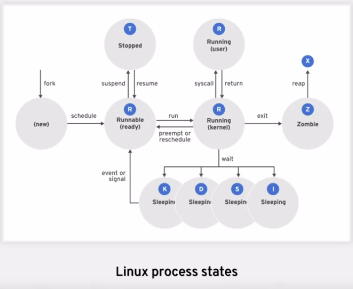

# Table of Contents

- [Table of Contents](#table-of-contents)
- [What is Linux?](#what-is-linux)
- [Linux Distributions or Linux Distros](#linux-distributions-or-linux-distros)
- [Using the Command Line Interface (CLI)](#using-the-command-line-interface-cli)
- [Shell Basics](#shell-basics)
  - [Command](#command)
  - [Options](#options)
- [Logging in to a Local Computer](#logging-in-to-a-local-computer)
  - [Headless Server](#headless-server)
- [Logging in over the Network using the Secure Shell (`ssh`)](#logging-in-over-the-network-using-the-secure-shell-ssh)
- [Basic Command Syntax](#basic-command-syntax)
- [Managing Files from the Command Line](#managing-files-from-the-command-line)
  - [The File-System Hierarchy](#the-file-system-hierarchy)
- [Matching File Names Using Path Name Expansion](#matching-file-names-using-path-name-expansion)
  - [Pattern Matching](#pattern-matching)
  - [Tilde Expansion](#tilde-expansion)
  - [Brace Expansion](#brace-expansion)
  - [Variable Expansion](#variable-expansion)
- [Managing Linux Users and Groups](#managing-linux-users-and-groups)
  - [What is an User?](#what-is-an-user)
  - [What is a Group ?](#what-is-a-group-)
  - [The Superuser](#the-superuser)
- [Controlling Access to Files with Linux File System Permissions](#controlling-access-to-files-with-linux-file-system-permissions)
  - [View Permissions](#view-permissions)
  - [File Ownership](#file-ownership)
  - [Effects of Permissions on Files and Directories](#effects-of-permissions-on-files-and-directories)
  - [Changing Permissions](#changing-permissions)
    - [Changing Permissions using the Symbolic Method](#changing-permissions-using-the-symbolic-method)
    - [Changing Permissions with the Numeric Method](#changing-permissions-with-the-numeric-method)
  - [Changing Ownership](#changing-ownership)
  - [Special Permissions](#special-permissions)
    - [Setting Special Permissions](#setting-special-permissions)
  - [Default File Permissions](#default-file-permissions)
    - [The `umask`](#the-umask)
- [Monitoring and Managing Linux Processes](#monitoring-and-managing-linux-processes)
  - [Definition of a Process](#definition-of-a-process)
  - [Describing Process States](#describing-process-states)
  - [Why Process States are Important](#why-process-states-are-important)
  - [Listing Processes](#listing-processes)
  - [Controlling Jobs](#controlling-jobs)
  - [Running Jobs in the Background](#running-jobs-in-the-background)
  - [Killing Processes](#killing-processes)
  - [Commands for Sending Signals by Explicit Request](#commands-for-sending-signals-by-explicit-request)
- [Logging Users Out Administratively](#logging-users-out-administratively)
  - [Describing Load Average](#describing-load-average)
  - [Real-Time Process Monitoring](#real-time-process-monitoring)

---

# What is Linux?

Linux first and foremost is a collection of Operating Systems.

Linux is a modular operating system, meaning that you can replace, or remove components that are not to your liking.

---

# Linux Distributions or Linux Distros

A Linux distribution is an installable operating system constructed from a Linux kernel and supporting user programs and libraries. A complete Linux operating system is not developed by a single organization, but by a collection of independent open source development communities working with individual software components. A distribution provides an easy way for users to install and manage a working Linux system.

The beginning of Linux distributions all started with the Kernel. The Kernel serves as the main brain of the operating system that any version of Linux would run.

In 1991, a young computer science student named Linus Torvalds developed a Unix-like kernel he named Linux, licensed as open source software under the GPL. The kernel is the core component of the operating system, which manages hardware, memory, and scheduling of running programs. This Linux kernel could then be supplemented with other open source software, such as the utilities and programs from the GNU Project, the graphical interface from MIT's X Window System, and many other open source components such as the Sendmail mail server or the Apache HTTPD web server, in order to build a complete open source Unix-like operating system.

However, one of the challenges for Linux users was to assemble all these pieces from many different sources. Very early in its history, Linux developers began working to provide a distribution of prebuilt and tested tools that users could download and use to quickly set up their Linux systems.

Many different Linux distributions exist, with differing goals and criteria for selecting and supporting the software provided by their distribution like running servers, desktop computers, mobile phones and so on. But distributions generally have a number of common characteristics:

- A distribution consists of a Linux kernel and supporting user space programs.
- A distribution may be small and single-purpose or include thousands of open source programs.
- Some means of installing and updating the distribution and its components should be provided.
- The vendor should support that software, and ideally be participating directly in the community developing that software.

_Red Hat Enterprise Linux_ is Red Hat's commercially-supported Linux distribution.

**Examples of Linux Distros are:**

- Ubuntu
- Debian
- Alpine
- Fedora
- CentOS

> Most of these distributions, support the same set of commands but some may have differences.

---

# Using the Command Line Interface (CLI)

In order to launch the command line interface, we'll utilize a program called terminal.

A command line interface is a text based interaction between you and the operating system. It allows you full control of the environment as long as you know how to wield it properly. When you launch terminal, what opened is what is known as a shell in Linux. In particular, in Red Hat, the default shell is known as bash or the Bourne again shell. Once the terminal is opened, your shell presents you with a prompt. The shell prompt shown here is one for a regular user. It will end with the dollar sign to denote where the prompt ends and your commands can begin being entered. When you're running as a superuser in Linux shells, the end dollar sign will be replaced with a pound or hash sign. This denotes that ascended privileges are in usage. The root user is known as our administrative or superuser within the Linux environments.

---

# Shell Basics

Commands entered at the shell prompt have three basic parts:

- **Command** to run
- **Options** to adjust the behavior of the command
- **Arguments**, which are typically targets of the command

## Command

The command is the name of the program to run. It may be followed by one or more options, which adjust the behavior of the command or what it will do. Options normally start with one or two dashes (-a or --all, for example) to distinguish them from arguments. Commands may also be followed by one or more arguments, which often indicate a target that the command should operate upon.

For example, the command `usermod -L user01` has a command (`usermod`), an option (`-L`), and an argument (`user01`). The effect of this command is to lock the password of the `user01` user account. Many commands have a `--help` option that displays a usage message and the list of available options.

## Options

Commands in Linux will often support at least one of the following _option_ formats:

- **UNIX (POSIX)** options, which may be grouped and must be preceded by a dash
- **BSD** options, which may be grouped and must not be used with a dash
- **GNU** long options, which are preceded by two dashes. E.g.

**For example:** **`ps -aux`** is not the same as **`ps aux`**.

`ps` is one of the commands that can take any of the three styles of options while `chmod` accepts UNIX (POSIX) and GNU versions of the options.

---

# Logging in to a Local Computer

The computer might have a hardware keyboard and display for input and output directly connected to it. This is the Linux machine's physical console. The physical console supports multiple virtual consoles, which can run separate terminals. Each virtual console supports an independent login session. You can switch between them by pressing **Ctrl + Alt** and a function key (**F1** through **F6**) at the same time. Most of these virtual consoles run a terminal providing a text login prompt, and if you enter your username and password correctly, you will log in and get a shell prompt.

The computer might provide a graphical login prompt on one of the virtual consoles. You can use
this to log in to a graphical environment. The graphical environment also runs on a virtual console.
To get a shell prompt you must start a terminal program in the graphical environment. The shell
prompt is provided in an application window of your graphical terminal program.

> **Note:** Many system administrators choose not to run a graphical environment on their servers. This allows resources which would be used by the graphical environment to be used by the server's services instead.

In Red Hat Enterprise Linux 8, if the graphical environment is available, the login screen will run
on the first virtual console, called **`tty1`**. Five additional text login prompts are available on virtual consoles two through six.

If you log in using the graphical login screen, your graphical environment will start on the first
virtual console that is not currently being used by a login session. Normally, your graphical session
will replace the login prompt on the second virtual console (**`tty2`**). However, if that console is in
use by an active text login session (not just a login prompt), the next free virtual console is used
instead.

The graphical login screen continues to run on the first virtual console (**`tty1`**). If you are already
logged in to a graphical session, and log in as another user on the graphical login screen or use the
**Switch User** menu item to switch users in the graphical environment without logging out, another
graphical environment will be started for that user on the next free virtual console.

When you log out of a graphical environment, it will exit and the physical console will automatically switch back to the graphical login screen on the first virtual console.

## Headless Server

A headless server does not have a keyboard and display permanently connected to it. A data center may be filled with many racks of headless servers, and not providing each with a keyboard and display saves space and expense. To allow administrators to log in, a headless server might have a login prompt provided by its serial console, running on a serial port which is connected to a networked console server for remote access to the serial console.

The serial console would normally be used to fix the server if its own network card became misconfigured and logging in over its own network connection became impossible. Most of the time, however, headless servers are accessed by other means over the network.

# Logging in over the Network using the Secure Shell (`ssh`)

Linux users and administrators often need to get shell access to a remote system by connecting to it over the network. In a modern computing environment, many headless servers are actually virtual machines or are running as public or private cloud instances. These systems are not physical and do not have real hardware consoles. They might not even provide access to their (simulated) physical console or serial console.

In Linux, the most common way to get a shell prompt on a remote system is to use Secure Shell (SSH). Most Linux systems (including Red Hat Enterprise Linux) and macOS provide the OpenSSH command-line program **`ssh`** for this purpose.

In this example, a user with a shell prompt on the machine host uses ssh to log in to the remote Linux system **`remotehost`** as the user **`remoteuser`**

```console
[user@host ~]$ ssh remoteuser@remotehost
remoteuser@remotehost's password: password
[remoteuser@remotehost ~]$
```

The **`ssh`** command encrypts the connection to secure the communication against eavesdropping or hijacking of the passwords and content.

Some systems (such as new cloud instances) do not allow users to use a password to log in with **`ssh`** for tighter security. An alternative way to authenticate to a remote machine without entering a password is through _public key authentication_.

With this authentication method, users have a special identity file containing a _private key_, which is equivalent to a password, and which they keep secret. Their account on the server is configured with a matching public key, which does not have to be secret. When logging in, users can configure **ssh** to provide the private key and if their matching public key is installed in that account on that remote server, it will log them in without asking for a password.

In the next example, a user with a shell prompt on the machine **host** logs in to **`remotehost`** as **`remoteuser`** using **ssh**, using public key authentication. The **`-i`** option is used to specify the user's private key file, which is **mylab.pem**. The matching public key is already set up as an authorized key in the **`remoteuser`** account.

```console
[user@host ~]$ ssh -i mylab.pem remoteuser@remotehost
[remoteuser@remotehost ~]$
```

For this to work, the private key file must be readable only by the user that owns the file. In the
preceding example, where the private key is in the **mylab.pem** file, the command **`chmod 600`**
**mylab.pem** could be used to ensure this. How to set file permissions is discussed in more detail in a later chapter.

Users might also have _private keys_ configured that are tried automatically, but that discussion is beyond the scope of this section. The References at the end of this section contain links to more information on this topic.

> **Note:**
>
> The first time you log in to a new machine, you will be prompted with a warning from **`ssh`** that it cannot establish the authenticity of the host:
>
> ```console
> [user@host ~]$ ssh -i mylab.pem remoteuser@remotehost
> The authenticity of host 'remotehost (192.0.2.42)' can't be established.
> ECDSA key fingerprint is 47:bf:82:cd:fa:68:06:ee:d8:83:03:1a:bb:29:14:a3.
> Are you sure you want to continue connecting (yes/no)? yes
> [remoteuser@remotehost ~]$
> ```
>
> Each time you connect to a remote host with **ssh**, the remote host sends **ssh** its _host_ key to authenticate itself and to help set up encrypted communication. The **ssh** command compares that against a list of saved host keys to make sure it has not changed. If the host key has changed, this might indicate that someone is trying to pretend to be that host to hijack the connection which is also known as man-in-the-middle attack. In SSH, host keys protect against man-in-the-middle attacks, these host keys are unique for each server, and they need to be changed periodically and whenever a compromise is suspected.
>
> You will get this warning if your local machine does not have a host key saved for the remote host. If you enter **yes**, the host key (_fingerprint_) that the remote host sent will be accepted and saved for future reference. Login will continue, and you should not see this message again when connecting to this host. If you enter **no**, the host key will be rejected and the connection closed.
>
> If the local machine does have a host key saved and it does not match the one actually sent by the remote host, the connection will automatically be closed with a warning.

---

# Basic Command Syntax

# Managing Files from the Command Line

Let's look at the Linux file system hierarchy and understand the purpose and function of the various directories that comprise the Linux operating system. Linux operating systems are just a collection of elaborately organized and purpose to files. As you start to explore Linux, it's critical to start learning the particular purposes of the various files and folders located throughout the operating system. This collection and structure of folders and files as known as the Linux file system hierarchy.

## The File-System Hierarchy

<!--prettier-ignore-->
| Location | Purpose |
| -------- | ------- |
| `/usr`   | Installed software, shared libraries, include files and read-only program data.<br>Important subdirectories include:<br><li>`/usr/bin`: User commands.</li><br><li>`/usr/sbin`: System administration commands.</li><br><li>- `/usr/local`: Locally customized software.</li> |
| `/etc`   | Configuration files specific to the system. |
| `/var`   | Variable data specific to this system that should persist between boots. Files that may dynamically change, such as databases, cache directories, log files, printer-spooled documents, and website content may be found under `/var` |
| `/run`   | Runtime data for processes started since the last boot. This includes process ID files and lock files that control the locking mechanisms for system resources for the applications that are currently running on the system, among other things. The contents of this directory are recreated on reboot. |
| `/home`  | _Home directories_ are where regular users store their personal data and configuration files. |
| `root`   | Home directory for the administrative superuser, **root** |
| `/tmp`   | A world-writable space for temporary files. Files which have not been accessed, changed or modified for 10 days are deleted from this directory automatically. Another temporary directory exists, `/var/tmp` in which files that have not been accessed, changed or modified in more than 30 days are deleted automatically. |
| `/boot`  | Files needed in order to start the boot process. |
| `/dev`   | Contains special device files that are used by the system to access hardware.<br>This can also include a set of virtual instances or devices that we've presented to the environment, examples of that could be virtualized storage devices. |

---

# Matching File Names Using Path Name Expansion

## Pattern Matching

Globbing is a shell command-parsing operation that expands a wildcard pattern into a list of matching path names. Command-line metacharacters are replaced by the match list prior to command execution Patterns that do not return matches display the original pattern request as literal text. The following are common metacharacters and pattern classes.

**Table of Metacharacters and Matches**

<!--prettier-ignore-->
| Pattern       | Matches                                                                |
| ------------- | ---------------------------------------------------------------------- |
| `*`           | Any string of zero or more characters.                                 |
| `?`           | Any single character.                                                  |
| `[abc...]`    | Any one character in the enclosed class (between the square brackets). |
| `[!abc...]`   | Any one character _not_ in the enclosed class.                         |
| `[^abc...]`   | Any one character _not_ in the enclosed class.                         |
| `[[:alpha:]]` | Any alphabetic character.                                              |
| `[[:lower:]]` | Any lowercase character.                                               |
| `[[:upper:]]` | Any uppercase character.                                               |
| `[[:alnum:]]` | Any alphabetic character or digit.                                     |
| `[[:punct:]]` | Any printable character not a space or alphanumeric.                   |
| `[[:digit:]]` | Any single digit from 0 to 9.                                          |
| `[[:space:]]` | Any single white space character. This may include tabs, newlines, carriage returns, form feeds, or spaces. |

---

## Tilde Expansion

--

## Brace Expansion

```bash
touch test{1..4}.txt

touch test{a..b}{1..2}.txt

touch test{u..w{1..2}, x, y, z}.txt
```

---

## Variable Expansion

---

# Managing Linux Users and Groups

## What is an User?

A user account is used to provide security boundaries between different people and programs that can run commands.

Users have user names to identify them to human users and make them easier to work with. Internally, the system distinguishes user accounts by the unique identification number assigned to them, the user ID or UID. If a user account is used by humans, it will generally be assigned a secret password that the user will use to prove that they are the actual authorized user when logging in. User accounts are fundamental to system security. Every process (running program) on the system runs as a particular user. Every file has a particular user as its owner. File ownership helps the system enforce access control for users of the files. The user associated with a running process determines the files and directories accessible to that process.

There are three main types of user account: the **superuser**, **system users**, and **regular** users.

- The **superuser** account is for administration of the system. The name of the superuser is **root** and the account has UID 0. The superuser has full access to the system.

- The system has **system user** accounts which are used by processes that provide supporting services. These processes, or _daemons_, usually do not need to run as the superuser. They are assiged non-privileged accounts that allow them to secure their files and other resources from each other and from regular users on the system. Users do not interactively log in using a system user account.

- Most users have **regular user** accounts which they use for their day-to-day work. Like system users, regular users have limited access to the system. You can use the id command to show information about the currently logged-in user.

## What is a Group ?

A group is a collection of users that need to share access to files and other system resources. Groups can be used to grant access to files to a set of users instead of just a single user.

Like users, groups have _group names_ to make them easier to work with. Internally, the system distinguishes groups by the unique identification number assigned to them, the _group ID_ or _GID_.

The mapping of group names to GIDs is defined in databases of group account information. By default, systems use the **`/etc/group`** file to store information about local groups.

Each line in the **`/etc/group`** file contains information about one group. Each group entry is
divided into four colon-separated fields.

Here is an example of a line from `/etc/group`:

```bash
group01: x: 10000: user01,user02,user03
```

Where,

- Group name for this group (**group01**)
- Obsolete group password field. This field should always be **x**.
- The GID number for this group (**10000**).
- A list of users who are members of this group as a supplementary group (**user01**, **user02**,
  **user03**). Primary (or default) and supplementary groups are discussed later in this section.

---

## The Superuser

Most operating systems

> **Note:**
>
> You may see `sudo su -` used instead of `sudo -i`. Both commands work, but there are some subtle differences between them.
>
> The `sudo su -` command sets up the root environment exactly like a normal login because the `su -` command ignores the settings made by sudo and sets up the environment from scratch.
>
> The default configuration of the `sudo -i` command actually sets up some details of the **root** user's environment differently than a normal login. For example, it sets the **PATH** environment variable slightly differently. This affects where the shell will
> look to find commands.
>
> You can make **`sudo -i`** behave more like **`su -`** by editing **`/etc/sudoers`** with
> **`visudo`**. Find the line
>
> ```bash
> Defaults secure_path = /sbin:/bin:/usr/sbin:/usr/bin
> ```
>
> and replace it with the following two lines:
>
> ```
> Defaults secure_path = /usr/local/bin:/usr/bin
> Defaults>root secure_path = /usr/local/sbin:/usr/local/bin:/usr/sbin:/usr/bin
> ```

---

# Controlling Access to Files with Linux File System Permissions

## View Permissions

| Command  | Function                                                                          |
| -------- | --------------------------------------------------------------------------------- |
| `ls -l`  | View permissions of all files in a directory. Default: Current working directory. |
| `ls -ld` | View permissions of a directory. Default: Current working directory.              |

**In the following long list of files:**

```bash
drwxrwxr-x 3 jayantasamaddar jayantasamaddar 4096 May  4 03:37 main
drwxrwxr-x 6 jayantasamaddar jayantasamaddar 4096 Apr 12 20:56 omni-test-app
-rw-rw-r-- 1 jayantasamaddar jayantasamaddar 1775 Jan 25  2022 README.md
```

> **Note:**
>
> - The First column that looks like `drwxrwxr-x` refers to the permissions to read, write, execute.
>
>   - The first character is either `d` for directory or `-` for file and `l` for soft link. Other characters represent hardware devices (`b` and `c`) or other special-purpose files (`p` and `s`).
>   - The next three characters are `read`, `write`, `execute` permissions for the current user.
>   - The next three characters are `read`, `write`, `execute` permissions for the primary group.
>   - The next three characters are `read`, `write`, `execute` permissions for others.
>
> - The Second column is the number of files in a directory or the number of links that a file has.
>
> - The Third column is the username.
>
> - The Fourth column is the primary group name.

---

## File Ownership

A File can be owned by the following:

- User: `u`
- Group: `g`
- Others: `o`

The most specific permissions take precedence.

---

## Effects of Permissions on Files and Directories

<!--prettier-ignore-->
| Permission    | Effect on files              | Effect on Directories                                 |
| ------------- | ---------------------------- | ----------------------------------------------------- |
| `r` (read)    | File contents can be read    | Contents of the directory can be listed.              |
| `w` (write)   | File contents can be changed | Any file in the directory can be created or modified. |
| `x` (execute) | File can be executed as commands. | The directory can become the current working directory. (You can **`cd`** into it, but also require read permissions to list files there).          |

- Read-Only files and directories can have both read and execute permissions.

---

## Changing Permissions

### Changing Permissions using the Symbolic Method

```bash
chmod [Who][What][Which] [file|directory]
```

Where,

- **_Who_** is either **`u`**(user) or **`g`**(group) or **`o`**(others) or `a`(all)
- **_What_** is either **`+`**(add) or **`-`**(remove) or **`=`**(set)
- **_What_** is either **`r`**(read) or **`w`**(write) or **`x`**(execute)

<!--prettier-ignore-->
| Command       | Function                                                        |
| ------------- | --------------------------------------------------------------- |
| `chmod g=rwx PATH` | Set all `read`,`write` and `execute` permissions for directory or file for the group. |

---

### Changing Permissions with the Numeric Method

```bash
chmod [3-digit-Octal] [file|directory]
```

Each of the three digits of the octal represents each of user, group and others respectively.

This is done by representing each permission for `user`, `group` and `others` to binary and then converting them to octal.

**Illustration:**

If the permissions are,

- **user**: `rwx` (read, write, execute)
- **group**: `rw` (read, write)
- **others**: `r` (read)

We can write each of the slots `read`, `write` and `execute` in Binary as either on or off for each of `user`, `group` and `others`:

- user: `111`
- write: `110`
- others: `100`

Now let's convert the binary to octal:

- user: `7`
- write: `6`
- others: `4`

So the final octal value to be used with `chmod` would be `764`.

An easy way to calculate this is by using the corresponding values and then adding them up:

- Start with 0.
- `r` = 4
- `w` = 2
- `x` = 1

So,

- A `read`, `write`, `execute` permission is **`4 + 2 + 1 = 7`**.
- A `read` only permission is **`4`**.
- A `read` and `write` permission is **`4 + 2 = 6`**, etc.

**Examples:**

| Command          | Function                                                                       |
| ---------------- | ------------------------------------------------------------------------------ |
| `chmod 600 PATH` | Set `read`, `write` permissions for user.                                      |
| `chmod 640 PATH` | Set `read`, `write` permissions for user.<br>Set `read` permissions for group. |
| `chmod 750 PATH` | Set `read`, `write`, `execute` for user.<br> Set `read`, `execute` for group.  |

---

## Changing Ownership

```bash
chown [flag] [user]:[optional group] [file-or-directory]
```

```bash
chgrp [flag] [group] [file-or-directory]
```

| Command                            | Function                                                         |
| ---------------------------------- | ---------------------------------------------------------------- |
| `chown <user> <file>`              | Set ownership of `file` to `user`                                |
| `chown -R <user> <directory>`      | Recursively change ownership of directory and all subdirectories |
| `chown :<group> <directory>`       | Changes the group ownership of `directory` to `group`            |
| `chown <user>:<group> <directory>` | Change the owner and group to `user` and `group` respectively    |
| `chgrp <group> <directory>`        | Changes the group ownership of `directory` to `group`            |

---

## Special Permissions

<!--prettier-ignore-->
| Permission     | Effect on Files | Effect on Directories |
| -------------- | --------------- | --------------------- |
| `u+s` (suid)   | File executes as the user that owns the file, not the user that ran the file. | No effect. |
| `g+s` (suid)   | File executes as the group that owns it. | Files newly created in the directory have their group owner set to match the group owner of the directory. |
| `o+t` (sticky) | No Effect. | Users with write access to the directory can only remove files that they own. They cannot remove or force saves to files owned by other users. |

The _setupid_ permission on an executable file means that the commands run as the user owning the file, not the user that ran the command. One example is the `passwd` command.

```bash
ls -l /usr/bin/passwd
```

returns,

```
-rwsr-xr-x 1 root root 68208 Mar 14 13:56 /usr/bin/passwd
```

The `s` replaces the `x`.

### Setting Special Permissions

- Symbolically: setuid = `u+s`; setgid = `g+s`; sticky = `o+t`
- Numerically (fourth preceding digit): setuid = `4`; setgid = `2`; sticky = `1`

Example using symbolic: `chmod g+s directory`

Example using Octal: `chmod 2770 directory`, where `2` is the `setgid` bit.

---

## Default File Permissions

When a file or directory is created the operating system assigns it initial permissions. There are two things that affect these initial permissions.

- Whether you are creating a file or a directory.
- The current **_umask_**.

When a new directory is created, the operating system starts by assigning it octal permissions 0777 (`drwxrwxrwx`), or full access to the directory.

When a new regular file is created, the operating systems assigns it the octal permissions 0666 (`-rw-rw-rw-`), or full read-write permissions but no execution.

### The `umask`

The shell session will also set a `umask` is used to further restrict the permissions that are initially set. This is an octal bitmask used to **clear the permissions** of new files and directories created by a process. If a bit is set in the umask, then the corresponding permission is cleared on new files. For example, the umask `0002` clears the write bit for other users. The leading zeros indicate the special, user, and group permissions are not cleared. A umask of `0077` clears all the group and other permissions of newly created files.

| Command      | File Permissions | Directory Permissions | Function                                   |
| ------------ | ---------------- | --------------------- | ------------------------------------------ |
| `umask 0002` | `-rw-rw-r--`     | `drwxrwxr-x`          | Clears the write permission from `other`   |
| `umask 0004` | `-rw-rw--w-`     | `drwxrwx-wx`          | Clears the read permission from `other`    |
| `umask 0001` | `-rw-rw-rw-`     | `drwxrwxrw-`          | Clears the execute permission from `other` |

The default umask for users is set by the shell startup scripts. By default, if your account's UID is 200 or more and your username and primary group name are the same, you will be assigned a umask of 002. Otherwise, your umask will be 022.

As root, you can change this by adding a shell startup script named **`/etc/profile.d/localumask.sh`** that looks something like the output in this example:

```bash
[root@host ~]# cat /etc/profile.d/local-umask.sh
# Overrides default umask configuration
if [ $UID -gt 199 ] && [ "`id -gn`" = "`id -un`" ]; then
 umask 007
else
 umask 022
fi
```

The preceding example will set the umask to 007 for users with a UID greater than 199 and with a username and primary group name that match, and to 022 for everyone else. If you just wanted to set the umask for everyone to 022, you could create that file with just the following content:

```bash
# Overrides default umask configuration
umask 022
```

To ensure that global umask changes take effect you must log out of the shell and log back in.
Until that time the umask configured in the current shell is still in effect.

---

# Monitoring and Managing Linux Processes

## Definition of a Process

Throughout the Linux environment, processes are nothing more than a running instance of a launched application.

A process is a running instance of a launched, executable program. A process consists of:

- **An address space of allocated memory** - This is something the Operating System's kernel will manage.
- Security properties including ownership credentials and privileges
- One or more execution threads of program code
- Process state

Each process runs in it's own unique environment.

The _environment_ of a process includes:

- Local and global variables
- A current scheduling context
- Allocated system resources, such as _file descriptors_ and _network ports_

An existing (_parent_) process duplicates its own address space (**fork**) to create a new (_child_) process structure. Every new process is assigned a unique _process_ ID (PID) for tracking and security. The PID and the _parent's process_ ID (PPID) are elements of the new process environment. Any process may create a child process. All processes are descendants of the first system process, **`systemd`** on a Red Hat Enterprise Linux 8 system.


Through the _fork_ routine, a child process inherits security identities, previous and current file descriptors, port and resource privileges, environment variables, and program code. A child process may then exec its own program code. Normally, a parent process _sleeps_ while the child process runs, setting a request (_wait_) to be signaled when the child completes. Upon exit, the child process has already closed or discarded its resources and environment. The only remaining resource, called a _zombie_, is an entry in the process table. The parent, signaled awake when the child exited, cleans the process table of the child's entry, thus freeing the last resource of the child process. The parent process then continues with its own program code execution.

---

## Describing Process States

In a multitasking operating system, each CPU (or CPU core) can be working on one process at a single point in time. As a process runs, its immediate requirements for CPU time and resource allocation change. Processes are assigned a _state_, which changes as circumstances dictate.



From the left, we're seeing a new process get forked or created. Once created, it will be scheduled by the system. If it's ready to be executed, it can be set into a runnable state. This means it is capable to be executed, but may or may not be executing at this current time. From that state we can either stop or resume the execution of that process, and a state of stopped would be applied. Many mitigating factors can determine whether or not we change a process state. But in the general flow of a process, we would go from runnable to running and then conclude. Several other states that happen within in order to manage the processes and resource allocations for the system or to stop or sleep this process. Sleeping allows a process to wait until a later point in time before resuming. It may be necessary to put the process into a sleeping state while other work concludes that are dependent on the execution of this process to resume. Once a process is completed, will reap those resources and return them back to the kernel for other process executions. At that point, the process will exit. If something is lost along the way, we can end up in the resulting state of a zombie process. This is not ideal, but it is something that we can manage in our operating system, or at least understand what happens when zombie processes occur. Should we have a zombie process, the operating system may have the inability to reap back the resources that were assigned to that process. Zombie processes stacking up in this order can render a system unable to process further requests because all allocated resources are locked into these unmanaged and now a zombie process. This is uncommon to occur, and typically occurs only in poorly authored code or poorly administrated systems.

<!--prettier-ignore-->
| Name     | Flag  | Kernel-defined State Name and Description                                          |
| -------- | ----- | ---------------------------------------------------------------------------------- |
| Running  | **R** | TASK_RUNNING: The process is either executing on a CPU or waiting to run. Process can be executing user routines or kernel routines (system calls), or be queued and ready when in the Running (or Runnable) state.                                                                            |
| Sleeping | **S** | TASK_INTERRUPTIBLE: The process is waiting for some condition: a hardware request, system resource access, or signal. When an event or signal satisfies the condition, the process returns to Running.                                                                                             |
| Sleeping | **D** | TASK_UNINTERRUPTIBLE: This process is also Sleeping, but unlike **S** state, does not respond to signals. Used only when process interruption may cause an unpredictable device state.    |
| Sleeping | **K** | TASK_KILLABLE: Identical to the uninterruptible **D** state, but modified to allow a waiting task to respond to the signal that it should be killed (exit completely). Utilities frequently display Killable processes as **D** state.                                                              |
| Sleeping | **I** | TASK_REPORT_IDLE: A subset of state **D**. The kernel does not count these processes when calculating load average. Used for kernel threads. Flags TASK_UNINTERRUPTABLE and TASK_NOLOAD are set. Similar to TASK_KILLABLE, also a subset of state **D**. It accepts fatal signals.  |
| Stopped  | **T** | TASK_STOPPED: The process has been Stopped (suspended), usually by being signaled by a user or another process. The process can be continued (resumed) by another signal to return to Running.                                                                                                |
| Stopped  | **T** | TASK_TRACED: A process that is being debugged is also temporarily Stopped and shares the same **T** state flag.                                                                       |
| Zombie   | **Z** | EXIT_ZOMBIE: A child process signals its parent as it exits. All resources except for the process identity (PID) are released.                                                            |
| Zombie   | **X** | EXIT_DEAD: When the parent cleans up (*reaps*) the remaining child process structure, the process is now released completely. This state will never be observed in process-listing utilities.                                                                                              |

---

## Why Process States are Important

When troubleshooting a system, it is important to understand how the kernel communicates with processes and how processes communicate with each other. At process creation, the system assigns the process a state. The **S** column of the **`top`** command or the **STAT** column of the **`ps`** show the state of each process. On a single CPU system, only one process can run at a time. It is possible to see several processes with a state of **R**. However, not all of them will be running consecutively, some of them will be in status waiting.

Process can be suspended, stopped, resumed, terminated, and interrupted using signals. Signals are discussed in more detail later in this chapter. Signals can be used by other processes, by the kernel itself, or by users logged into the system.

---

## Listing Processes

The **`ps`** command is used for listing current processes. It can provide detailed process information,
including:

- User identification (UID), which determines process privileges
- Unique process identification (PID)
- CPU and real time already expended
- How much memory the process has allocated in various locations
- The location of process **`stdout`**, known as the _controlling terminal_
- The current process state

By default, **`ps`** with no options selects all processes with the same effective user ID (EUID) as the current user, and which are associated with the same terminal where ps was invoked.

- Processes in brackets (usually at the top of the list) are scheduled kernel threads.
- Zombies are listed as **exiting** or **defunct**.
- The output of **`ps`** displays once. Use **`top`** for a process display that dynamically updates.
- **`ps`** can display in tree format so you can view relationships between parent and child processes.
- The default output is sorted by process ID number. At first glance, this may appear to be chronological order. However, the kernel reuses process IDs, so the order is less structured than it appears. To sort, use the **`-O`** or **`--sort`** options. Display order matches that of the system process table, which reuses table rows as processes die and new ones are created. Output may appear chronological, but is not guaranteed unless explicit **`-O`** or **`--sort`** options are used.

---

## Controlling Jobs

Job control is a feature of the shell which allows a single shell instance to run and manage multiple commands.

A **_job_** is associated with each pipeline entered at a shell prompt. All processes in that pipeline are part of the job and are members of the same _process_ group. If only one command is entered at a shell prompt, that can be considered to be a minimal “pipeline” of one command, creating a job with only one member.

Only one job can read input and keyboard generated signals from a particular terminal window at a time. Processes that are part of that job are _foreground_ processes of that _controlling terminal_.

A _background_ process of that controlling terminal is a member of any other job associated with that terminal. Background processes of a terminal cannot read input or receive keyboard generated interrupts from the terminal, but may be able to write to the terminal. A job in the background may be stopped (suspended) or it may be running. If a running background job tries to read from the terminal, it will be automatically suspended.

Each terminal is its own session, and can have a foreground process and any number of independent background processes. A job is part of exactly one special session and that information is tracked and the value known as the TTY: the one belonging to its controlling terminal.

The **`ps`** command shows the device name of the controlling terminal of a process in the **TTY** column. Some processes, such as _system daemons_, are started by the system and not from a shell prompt. These processes do not have a controlling terminal, are not members of a job, is something more universal to all users of the system, as opposed to log to a specific session for a given user interaction, and cannot be brought to the foreground. The **`ps`** command displays a question mark (**?**) in the **TTY** column for these processes.

---

## Running Jobs in the Background

---

## Killing Processes

A signal is a software interrupt delivered to a process. Signals report events to an executing program. Events that generate a signal can be an error, external event (an I/O request or an expired timer), or by explicit use of a signal-sending command or keyboard sequence. The following table lists the fundamental signals used by system administrators for routine process management. Refer to signals by either their short (HUP) or proper (SIGHUP) name.

<!--prettier-ignore-->
| Signal No. | Short Name | Definition         | Purpose |
| ---------- | ---------- | ------------------ | ------- |
| 1          | HUP        | Hangup             | Used to report termination of the controlling process of a terminal. Also used to request process reinitialization (configuration reload) without termination. |
| 2          | INT        | Keyboard Interrupt | Causes program termination. Can be blocked or handled. Sent by pressing INTR key sequence (**Ctrl+c**). |
| 3          | QUIT       | Keyboard Quit      | Similar to SIGINT; adds a process dump at termination. Sent by pressing QUIT key sequence (**Ctrl+\\**). |
| 9          | KILL       | Kill, unblockable  | Causes abrupt program termination. Cannot be blocked, ignored, or handled; always fatal. |
| 15 default | TERM       | Terminate          | Causes program termination. Unlike SIGKILL, can be blocked, ignored, or handled. The “polite” way to ask a program to terminate; allows self-cleanup. |
| 18         | CONT       | Continue           | Sent to a process to resume, if stopped. Cannot be blocked. Even if handled, always resumes the process. |
| 19         | STOP       | Stop, Unblockable  | Suspends the process. Cannot be blocked or handled. |
| 20         | TSTP       | Keyboard Stop      | Unlike SIGSTOP, can be blocked, ignored, or handled. Sent by pressing SUSP key sequence (**Ctrl+z**). |

> **Note:** Signal numbers vary on different Linux hardware platforms, but signal names and meanings are standardized. For command use, it is advised to use signal names instead of numbers. The numbers discussed in this section are for x86_64 systems.

Each signal has a default action, usually one of the following:

- **Term** - Cause a program to terminate (exit) at once.
- **Core** - Cause a program to save a memory image (core dump), then terminate.
- **Stop** - Cause a program to stop executing (suspend) and wait to continue (resume).

Programs can be prepared to react to expected event signals by implementing handler routines to
ignore, replace, or extend a signal's default action.

---

## Commands for Sending Signals by Explicit Request

Use **`pkill`** to send a signal to one or more processes which match selection criteria. Selection
criteria can be a command name, a process owned by a specific user, or all system-wide processes.

The **`pkill`** command includes advanced selection criteria:

- Command - Processes with a pattern-matched command name.
- UID - Processes owned by a Linux user account, effective or real.
- GID - Processes owned by a Linux group account, effective or real.
- Parent - Child processes of a specific parent process.
- Terminal - Processes running on a specific controlling terminal.

---

# Logging Users Out Administratively

## Describing Load Average

Load average is a measurement provided by the Linux kernel that is a simple way to represent the perceived system load over time. It can be used as a rough gauge of how many system resource requests are pending, and to determine whether system load is increasing or decreasing over time.

Every five seconds, the kernel collects the current load number, based on the number of processes in runnable and uninterruptible states. This number is accumulated and reported as an exponential moving average over the most recent 1, 5, and 15 minutes.

**Understanding the Linux Load Average Calculation**

The load average represents the perceived system load over a time period. Linux determines this by reporting how many processes are ready to run on a CPU, and how many processes are waiting for disk or network I/O to complete.

- The load number is a running average of the number of processes that are ready to run (in process state R) or are waiting for I/O to complete (in process state D).
- Some UNIX systems only consider CPU utilization or run queue length to indicate system load. Linux also includes disk or network utilization because that can have as significant an impact on system performance as CPU load. When experiencing high load averages with minimal CPU activity, examine disk and network activity.

Load average is a rough measurement of how many processes are currently waiting for a request to complete before they can do anything else. The request might be for CPU time to run the process. Alternatively, the request might be for a critical disk I/O operation to complete, and the process cannot be run on the CPU until the request completes, even if the CPU is idle. Either way, system load is impacted and the system appears to run more slowly because processes are waiting to run.

> **Note:** A Load Average value below 1 indicates satisfactory resource utilization and minimal wait times. A value above 1 indicates resource saturation and some amount of processing delay.

```bash
# From lscpu, the system has four logical CPUs, so divide by 4:
# If load average:                  2.92, 4.48, 5.20
# Divide by number of logical CPUs:   4     4     4
# ---- ---- ----
# Per-CPU load average:             0.73  1.12  1.30
#
# This system's load average appears to be decreasing.
# With a load average of 2.92 on four CPUs, all CPUs were in use ~73% of the time.
# During the last 5 minutes, the system was overloaded by ~12%.
# During the last 15 minutes, the system was overloaded by ~30%.
```

An idle CPU queue has a load number of 0. Each process waiting for a CPU adds a count of 1 to the load number. If one process is running on a CPU, the load number is one, the resource (the CPU) is in use, but there are no requests waiting. If that process is running for a full minute, its contribution to the one-minute load average will be 1. However, processes uninterruptibly sleeping for critical I/O due to a busy disk or network resource are also included in the count and increase the load average. While not an indication of CPU utilization, these processes are added to the queue count because they are waiting for resources and cannot run on a CPU until they get them. This is still system load due to resource limitations that is causing processes not to run. Until resource saturation, a load average remains below 1, since tasks are seldom found waiting in queue. Load average only increases when resource saturation causes requests to remain queued and are counted by the load calculation routine. When resource utilization approaches 100%, each additional request starts experiencing service wait time.

---

## Real-Time Process Monitoring

The top program is a dynamic view of the system's processes, displaying a summary header followed by a process or thread list similar to ps information. Unlike the static ps output, top continuously refreshes at a configurable interval, and provides capabilities for column reordering, sorting, and highlighting. User configurations can be saved and made persistent. Default output columns are recognizable from other resource tools:

- The process ID (PID).
- User name (USER) is the process owner.
- Virtual memory (VIRT) is all memory the process is using, including the resident set, shared libraries, and any mapped or swapped memory pages. (Labeled VSZ in the ps command.)
- Resident memory (RES) is the physical memory used by the process, including any resident shared objects. (Labeled RSS in the ps command.)
- Process state (S) displays as:
  - D = Uninterruptible Sleeping
  - R = Running or Runnable
  - S = Sleeping
  - T = Stopped or Traced
  - Z = Zombie
- CPU time (TIME) is the total processing time since the process started. May be toggled to include cumulative time of all previous children.
- The process command name (COMMAND).

While we have not discussed the concept of nice values, there is a preferential treatment to processes going on that the kernel determines. We have the ability to influence kernel decisions on which processes are more important by adjusting a value known as the nice value. The r key allows us to renice a process, or to adjust its value of importance within the list of processes that the kernel will be self-managing. This allows us a manual intervention to tell the kernel we prefer a certain process be processed sooner or deferred to later in the stack.
