# Table of Contents

- [Table of Contents](#table-of-contents)
- [Introduction to Networking](#introduction-to-networking)
  - [What is a Protocol in Computer Networking?](#what-is-a-protocol-in-computer-networking)
  - [Learning Objectives](#learning-objectives)
  - [The TCP/IP Five-Layer Network Model](#the-tcpip-five-layer-network-model)
  - [The Basics of Network Devices](#the-basics-of-network-devices)
    - [Cables](#cables)
    - [Hubs and Switches](#hubs-and-switches)
    - [Routers](#routers)
    - [Servers and Clients](#servers-and-clients)
  - [The Physical Layer](#the-physical-layer)
    - [Moving Bits Across the Wire](#moving-bits-across-the-wire)
    - [Twisted Pair Cabling and Duplexing](#twisted-pair-cabling-and-duplexing)
    - [Network Ports and Patch Panels](#network-ports-and-patch-panels)
  - [The Data Link Layer](#the-data-link-layer)
    - [Ethernet and MAC Addresses](#ethernet-and-mac-addresses)
    - [Unicast, Multicast and Broadcast](#unicast-multicast-and-broadcast)
    - [Dissecting an Ethernet Frame](#dissecting-an-ethernet-frame)
- [The Network Layer](#the-network-layer)
  - [Introduction to the Network Layer](#introduction-to-the-network-layer)
  - [IP Addresses](#ip-addresses)
  - [IP Datagrams and Encapsulation](#ip-datagrams-and-encapsulation)
    - [IP Datagram Header](#ip-datagram-header)
    - [Encapsulation](#encapsulation)
  - [IP Address Classes](#ip-address-classes)
  - [Address Resolution Protocol](#address-resolution-protocol)
  - [Looking up IP Addresses](#looking-up-ip-addresses)
  - [Subnetting](#subnetting)
    - [What is Subnetting?](#what-is-subnetting)
    - [Subnet Masks](#subnet-masks)
    - [Basic Binary Math](#basic-binary-math)
      - [Binary Addition](#binary-addition)
      - [`OR` and `AND`](#or-and-and)
      - [Subnet Masks and Operators](#subnet-masks-and-operators)
    - [CIDR](#cidr)
  - [Routing](#routing)
    - [Routing Concepts](#routing-concepts)
- [The Transport Layer](#the-transport-layer)
- [The Application Layer](#the-application-layer)
- [Networking Services](#networking-services)
  - [Name Resolution](#name-resolution)
  - [Name Resolution in Practice](#name-resolution-in-practice)
  - [Dynamic Host Configuration Protocol (DHCP)](#dynamic-host-configuration-protocol-dhcp)
  - [Network Address Translation](#network-address-translation)
  - [VPN and Proxies](#vpn-and-proxies)
- [Connecting to the Internet](#connecting-to-the-internet)
  - [POTS and Dial-Up](#pots-and-dial-up)
  - [Broadband Connections](#broadband-connections)
  - [WANs](#wans)
  - [Wireless Networking](#wireless-networking)
- [Troubleshooting and the Future of Networking](#troubleshooting-and-the-future-of-networking)
  - [Verifying Connectivity](#verifying-connectivity)
  - [Digging into DNS](#digging-into-dns)
  - [The Cloud](#the-cloud)
  - [IPv6](#ipv6)
- [References](#references)

---

# Introduction to Networking

## What is a Protocol in Computer Networking?

Computers communicate with each other a lot like how humans do. To communicate effectively we have developed a set of rules and standards or a protocol to speak.

**For example:** If there are loud noises or linguistic barriers or semantic jargons not understood by one of the persons or screaming involved when humans are communicating, communication may break down. There also maybe a greeting or a way to close the conversation, which if it doesn't happen, may send the wrong message. To avoid these, humans have developed our own communication standards.

Computers have to do the same.

A **Protocol** is a defined set of standards that computers must follow in order to communicate properly.

**Computer Networking** is the name given to the full scope of how computers communicate with each other.
Networking involves ensuring that computers can hear each other, that they speak protocols that other computers can understand and that they repeat messages, not fully delivered and a couple of other things, just like humans communicate.

There are lots of models used to describe the various layers at play with computer networking. It's super important to know these types of layered models (e.g. **TCP/IP Model**, **OSI Model**) to learn about computer networking because it is really a layered affair. The protocols at each layer carry the ones above them in order to get data from one place to the next.

Think of the protocol used to get data from one end of a networking cable to the other v/s the protocol used to get from one side of the planet to the other. But both of these protocols are required to work at the same time in order for things like the internet and business networks to work the way they do.

---

## Learning Objectives

- Describe how the TCP/IP five layer network model works.
- Identify basic networking devices.
- Label each of the five layers in the TCP/IP network model.
- Describe how the physical layer works.
- Describe how the data link layer works.

---

## The TCP/IP Five-Layer Network Model

To really understand networking, we need to understand all of the components involved. We're talking about everything from the cables that connect devices to each other to the protocols that these devices use to communicate. There are a bunch of models that help explain how network devices communicate, but here, we will focus on a five-layer model.

Let's start with the bottom of our stack, where we have the **Physical Layer**.

1. **Physical Layer** - The physical layer is a lot like what it sounds. It represents the physical devices that interconnect computers. This includes the specifications for the networking cables and the connectors that join devices together along with specifications describing how signals are sent over these connections.

2. **Data Link Layer** - The second layer in our model is known as the **Data Link Layer**. Some sources call this layer the **Network Interface Layer** or the **Network Access Layer**.
   At this layer, we introduce our first protocols. While the physical layer is all about cabling, connectors and sending signals, the data link layer is responsible for defining a common way of interpreting these signals, so network devices can communicate.

   Lots of protocols exist at the data link layer, but the most common is known as **Ethernet**, although wireless technologies are becoming more and more popular.

   Beyond specifying physical layer attributes, the Ethernet standards also define a protocol responsible for getting data to nodes on the same network or link.

3. **Network Layer** - The third layer, the network layer is also sometimes called the Internet Layer. It is this layer that allows different networks to communicate with each other through devices known as routers. A collection of networks connected together through routers is an **internetwork**, the most famous of these being the **Internet**. While the data link layer is responsible for getting data across a single link, the network layer is responsible for getting data delivered across a collection of networks. Think of when a device on your home network connects with a server on the Internet. It's the network layer that helps gets the data between these two locations. The most common protocol used at this layer is known as **IP** or **Internet Protocol**. IP is the heart of the Internet and most small networks around the world. Network software is usually divided into client and server categories, with the client application initiating a request for data and the server software answering the request across the network. A single node may be running multiple client or server applications. So, you might run an email program and a web browser, both client applications, on your PC at the same time, and your email and web server might both run on the same server.

4. **Transport Layer** - Emails end up in your email application and web pages end up in your web browser. That's because our next layer, the **Transport Layer**. While the network layer delivers data between two individual nodes, the transport layer sorts out which client and server programs are supposed to get that data. When you heard about our network layer protocol IP, you may have thought of **TCP/IP**, which is a pretty common phrase. That's because the protocol most commonly used in the fourth layer, the transport layer, is known as **TCP** or **Transmission Control Protocol**. While often said together as the phrase **TCP/IP**, to fully understand and troubleshoot networking issues, it's important to know that they're entirely different protocols serving different purposes. Other transfer protocols also use IP to get around, including a protocol known as **UDP** or **User Datagram Protocol**. The big difference between the two is that **TCP** provides mechanisms to ensure that data is reliably delivered while **UDP** does not.

5. **Application Layer** - There are lots of different protocols at this layer, and as you might have guessed from the name, they are application-specific. Protocols used to allow you to browse the web (HTTP/HTTPS) or send receive email (SMTP) are some common ones.

You can think of layers like different aspects of a package being delivered.

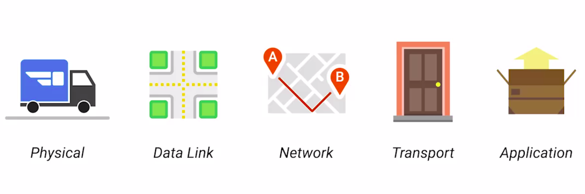

- **The physical layer** is the delivery truck and the roads.
- **The data link layer** is how the delivery trucks get from one intersection to the next over and over.
- **The network layer** identifies which roads need to be taken to get from address A to address B.
- **The transport layer** ensures that delivery driver knows how to knock on your door to tell you your package has arrived.
- **The application layer** is the contents of the package itself.

> **In addition to the five layer model we are working with, it’s important to note that other models exist. The traditional TCP/IP Model only has four layers, as it doesn’t differentiate between the physical layer and the data link layer, but is otherwise very similar to the one we’ll be working with. The most well known other model is the OSI model. It’s the model taught by many other networking certificate programs, like Net+ and Cisco’s many networking certifications. The primary difference between our five layer model and the seven layer OSI model is that the OSI model abstracts the application layer into three layers total.**
>
> **You can learn more about the OSI Networking Model by checking out these links:**
>
> - https://www.sans.org/reading-room/whitepapers/standards/osi-model-overview-543
> - https://en.wikipedia.org/wiki/OSI_model

---

## The Basics of Network Devices

Lots of different cables and network devices can be used to allow computers to properly communicate with each other. Let's start with the most basic component of a wired network.

### Cables

Cables connect different devices to each other, allowing data to be transmitted over them.

Most cables used today can be split into two categories: **Copper** and **Fiber**.

1. **Copper Cables** - Copper cables are the most common form of networking cable. They're made up of multiple pairs of copper wires inside plastic insulator. You may already know that computers communicate in binary, which people represent with ones and zeros. The sending device communicates binary data across these copper wires by changing the voltage between two ranges. The system at the receiving end is able to interpret these voltage changes as binary ones and zeros, which can then be translated into different forms of data. The most common forms of copper twisted pair cables used in networking, are `Cat 5`, `Cat 5e`, and `Cat 6` cables. These are all shorthand ways of saying category 5 or category 6 cables. These categories have different physical characteristics, like:

   - **_The number of twists in the pair of copper wires that results in different usable lengths and transfer rates_**.
   - **_How the twisted pairs are arranged inside these cables that drastically alter how quickly data can be sent across them and how resistant they are to external interference_**.

     Cat 5 is older and has been mostly replaced by Cat 5e and Cat 6 cables. Cat 5e cables have mostly replaced those older Cat 5 cables because their internals reduce crosstalk. **Crosstalk is when an electrical pulse on one wire is accidentally detected on another wire.** The receiving end isn't able to understand the data causing a network error. Higher level protocols have methods for detecting missing data and asking for the data a second time, but of course this takes up more time. The higher quality specifications of a Cat 5e cable make it less likely that data needs to be retransmitted. That means on average, you can expect more data to be transferred in the same amount of time. Cat 6 cables, following even more strict specification to avoid crosstalk, making those cables more expensive. Cat 6 cables can transfer data faster and more reliably than Cat 5e cables can, but because of their internal arrangement, they have a shorter maximum distance when used at higher speeds.

2. **Fiber Cables** - The second primary form of networking cable is known as fiber, short for fiber-optic cables. Fiber cables contain individual optical fibers, which are tiny tubes made out of glass about the width of a human hair. These tubes of glass can transport beams of light. Unlike copper, which uses electrical voltages, fiber cables use pulses of light to represent the ones and zeros of the underlying data. Fiber is even sometimes used specifically in environments where there's a lot of electromagnetic interference from outside sources because this can impact data being sent across copper wires. Fiber cables can generally transport data quicker than copper cables can, but they're much more expensive and fragile. Fiber can also transport data over much longer distances than copper can without suffering potential data loss. You'll be way more likely to run into fiber cables in computer data centers than you would in an office or at home.

---

### Hubs and Switches

Cables allow you to form point-to-point networking connections. These are networks where only a single device at each end of the link exists. Not to knock point to point networking connections, but they're not super useful in a world with billions of computers. Luckily, there are network devices that allow for many computers to communicate with each other. The most simple of these devices is a **hub**.

A **hub** is a physical layer device that allows for connections from many computers at once. All the devices connected to a hub will end up talking to all other devices at the same time. It's up to each system connected to the hub to determine if the incoming data was meant for them, or to ignore it if it isn't. This causes a lot of noise on the network and creates what's called a **collision domain**. **_A collision domain, is a network segment where only one device can communicate at a time_**. If multiple systems try sending data at the same time, the electrical pulses sent across the cable can interfere with each other. This causes these systems to have to wait for a quiet period before they try sending their data again. It really slows down network communications and is the primary reason hubs are fairly rare. They're mostly a historical artifact today.

In much more common way of connecting many computers is with a more sophisticated device known as a **network switch**, originally known as a **switching hub**.

A **switch** is very similar to a hub since you can connect many devices to it so they can communicate. **_The difference is that while a hub is a layer one or physical layer device, a switch is a layer two or data link device_**. This means that a switch can actually inspect the contents of the ethernet protocol data being sent around the network, determine which system the data is intended for and then only send that data to that one system. This reduces or even completely eliminates the size of collision domains on the network. If you guess that this will lead to fewer re-transmissions and higher overall throughput, you're right.

---

### Routers

Hubs and switches are the primary devices used to connect computers on a single network, usually referred to as a LAN, or Local Area Network. But we often want to send or receive data to computers on other networks, this is where routers come into play.

A **router** is a device that knows how to forward data between independent networks.
**_While a hub is a layer 1 device and a switch is a layer 2 device, a router operates at layer 3, a network layer. Just like a switch can inspect Ethernet data to determine where to send things, a router can inspect IP data to determine where to send things._** Routers store internal tables containing information about how to route traffic between lots of different networks all over the world. The most common type of router you'll see is one for a home network or a small office. These devices generally don't have very detailed routing tables. The purpose of these routers is mainly just to take traffic originating from inside the home or office LAN and to forward it along to the ISP, or **Internet Service Provider**.

Once traffic is at the ISP, a way more sophisticated type of router takes over. These core routers form the backbone of the Internet, and are directly responsible for how we send and receive data all over the Internet every single day. Core ISP routers don't just handle a lot more traffic than a home or small office router, they also have to deal with much more complexity in making decisions about where to send traffic.

A **Core Router** usually has many different connections to many other routers. Routers share data with each other via a protocol known as **BGP**, or **Border Gateway Protocol**, that let's them learn about the most optimal paths to forward traffic.

When you open a web browser and load a web page, the traffic between computers and the web servers could have traveled over dozens of different routers. The Internet is incredibly large and complicated, and routers are global guides for getting traffic to the right places.

---

### Servers and Clients

The simplest way to think of a **server**, is as something that provides data to something requesting that data. The thing receiving the data, is referred to as a **client**.

While we often talk about nodes being servers or clients, the reason our definition uses a word as vague as something, is because it's not just nodes that can be servers or clients. Individual computer programs running on the same node can be servers, an clients to each other too. It's also important to call out, that most devices aren't purely a server, or a client, almost all nodes are both at some point in time, quite the multitasking over achievers. That all being said, in most network topographies, each node is primarily either a server, or a client.

Sometimes we refer to an email server as an email server, even though it itself a client of a DNS server. Why? 'Cause its primary reason for existing, is to serve data to clients. Likewise, if a desktop machine occasionally acts as a server in the sense that it provides data to another computer, its primary reason for existing, is to fetch data from servers so that the user at the computer, can do their work. To sum up, a server is anything that can provide data to a client, but we also use the words to refer to the primary purpose of various nodes on our network.

---

## The Physical Layer

### Moving Bits Across the Wire

In some ways, the physical layer of our network stack model is the most complex of all. Its main focus is on moving ones and zeros from one end of the link to the next. But, very complicated mathematics, physics, and electrical engineering principles are at play to transmit huge volumes of data across tiny wires at incredible speeds. Luckily for us, most of that falls within a different realm.

The physical layer consists of devices and means of transmitting bits across computer networks. **A bit is the smallest representation of data that a computer can understand. It's a one or a zero.** These ones and zeros sends across networks at the lowest level are what make up the frames and packets of data that we'll learn about when we cover the other layers. The takeaway is that it doesn't matter whether you're streaming your favorite song, emailing your boss, or using an ATM, what you're really doing is sending ones and zeros across the physical layer of the many different networks between you and the server you're interacting with. A standard copper network cable, once connected to devices on both ends, will carry a constant electrical charge. Ones and zeros are sent across those network cables through a process called **modulation**.

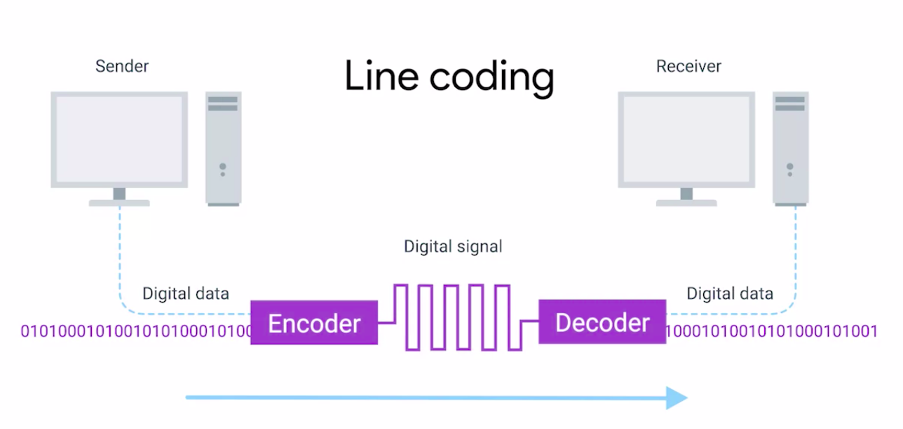

**Modulation is a way of varying the voltage of this charge moving across the cable**. When used for computer networks, this kind of modulation is more specifically known as **_line coding_**. It allows devices on either end of a link to understand that an electrical charge in a certain state is a zero, and in another state is a one. Through this seemingly simple technique, modern networks are capable of moving 10 billion ones and zeros across a single network cable every second.

---

### Twisted Pair Cabling and Duplexing

The most common type of cabling used for connecting computing devices is known as twisted pair. It's called a twisted pair cable because it features pairs of copper wires that are twisted together. These pairs act as a single conduit for information, and their twisted nature helps protect against electromagnetic interference and crosstalk from neighboring pairs. A standard cat six cable has eight wires consisting of four twisted pairs inside a single jacket. Exactly how many pairs are actually in use depends on the transmission technology being used. But in all modern forms of networking, it's important to know that these cables allow for **duplex communication**.

**Duplex communication is the concept that information can flow in both directions across the cable**. On the flip side, a process called simplex communication is unidirectional. Think about a baby monitor, where the transmission of data only goes in one direction making it a simplex communication. A phone call on the other hand is duplex since both parties can listen and speak.

The way networking cables ensure that duplex communication is possible is by reserving one or two pairs for communicating in one direction. They then use the other one or two pairs for communicating in the other direction. So, devices on either side of a networking link can both communicate with each other at the exact same time. This is known as **full duplex**.

If there's something wrong with the connection, you might see a network link degrade and report itself as operating as **half-duplex**. **_Half-duplex means that, while communication is possible in each direction, only one device can be communicating at a time_**.

Ethernet over twisted pair technologies are the communications protocols that determine how much data can be sent over a twisted pair cable, how quickly that data can be sent, and how long a network cable can be before the data quality begins to degrade.

There are many different variants of these in use. In order to learn more about these, you can read more about Ethernet over Twisted Pair technologies [here](https://en.wikipedia.org/wiki/Ethernet_over_twisted_pair).

---

### Network Ports and Patch Panels

The final steps of how the physical layer works take place at the endpoints of our network links. Twisted pair network cables are terminated with a plug that takes the individual internal wires and exposes them. The most common plug is known as an **RJ45**, or **Registered Jack 45**. It's one of many cable plugs specifications but by far, the most common in Computer Networking. **_A network cable with an RJ45 plug can connect to an RJ45 network port_**.

**Network ports are generally directly attached to the devices that make up a computer network**. Switches would have many network ports because their purpose is to connect many devices. But servers and desktops, usually only have one or two. Your laptop, tablet or phone probably don't have any. But we'll get to wireless networking in a later chapter.

Most network ports have two small LEDs. One is the **Link LED**, and the other is the **Activity LED**.

- The **Link LED** will be lit when a cable is properly connected to two devices that are both powered on.
- The **Activity LED** will flash when data is actively transmitted across the cable.

A long time ago, the flashing Activity LED corresponded directly to the ones and zeros being sent. Today, computer networks are so fast that the activity LED doesn't really communicate much other than if there's any traffic or not. On switches, sometimes the same LED is used for both link and activity status. It might even indicate other things like link speed. You'll have to read up on a particular piece of hardware you're working with. But there will almost always be some troubleshooting data available to you through port lights.

Sometimes a network port isn't connected directly to a device. Instead, there might be network ports mounted on a wall or underneath your desk. These ports are generally connected to the network via cables, run through the walls that eventually end at a **patch panel**. **A patch panel, is a device containing many network ports**. But it does no other work. It's just a container for the endpoints of many runs of cable. Additional cables are then generally ran from a patch panel, to switches, or routers to provide network access, to the computers at the other end of those links.

---

## The Data Link Layer

### Ethernet and MAC Addresses

Wireless and cellular internet access are quickly becoming some of the most common ways to connect computing devices to networks, and it's probably how you're connected right now. So you might be surprised to hear that traditional cable networks are still the most common option you find in the workplace and definitely in the data center. The protocol most widely used to send data across individual links is known as **Ethernet**.

**Ethernet and the Data Link Layer provide a means for software at higher levels of the stack to send and receive data. One of the primary purposes of this layer is to essentially abstract away the need for any other layers to care about the physical layer and what hardware is in use.**

By dumping this responsibility on the Data Link Layer, the Internet, Transport and Application layers can all operate the same no matter how the device they're running on is connected. So, for example, your web browser doesn't need to know if it's running on a device connected via a twisted pair or a wireless connection. It just needs the underlying layers to send and receive data for it.

By the end of this lesson, you'll be able to explain what MAC addresses are and how they're used to identify computers. You'll also know how to describe the various components that make up an Ethernet frame. And you'll be able to differentiate between unicast, multicast and broadcast addresses. Lastly, you'll be able to explain how cyclical redundancy checks help ensure the integrity of data sent via Ethernet. Understanding these concepts will help you troubleshoot a variety of problems as an IT support specialist.

**History**
Warning: a history lesson on old-school technology is headed your way. Here it goes. Ethernet is a fairly old technology. It first came into being in 1980 and saw its first fully polished standardization in 1983. Since then, a few changes have been introduced primarily in order to support ever-increasing bandwidth needs. For the most part though, the Ethernet in use today is comparable to the Ethernet standards as first published all those years ago. In 1983, computer networking was totally different than it is today. One of the notable differences in land topology was that the switch or switchable hub hadn't been invented yet. This meant that frequently, many or all devices on a network shared a single collision domain. You might remember from our discussion about hubs and switches that a collision domain is a network segment where only one device can speak at a time. This is because all data in a collision domain is sent to all the nodes connected to it. If two computers were to send data across the wire at the same time, this would result in literal collisions of the electrical current representing our ones and zeros, leaving the end result unintelligible. Ethernet, as a protocol, solved this problem by using a technique known as **Carrier Sense Multiple Access with Collision Detection**, we generally abbreviate this to **CSMA/CD**.

**_CSMA/CD is used to determine when the communications channels are clear and when the device is free to transmit data_**. The way CSMA/CD works is actually pretty simple. If there's no data currently being transmitted on the network segment, a node will feel free to send data. If it turns out that two or more computers end up trying to send data at the same time, the computers detect this collision and stop sending data. Each device involved with the collision then waits a random interval of time before trying to send data again. This random interval helps to prevent all the computers involved in the collision from colliding again the next time they try to transmit anything.

When a network segment is a collision domain, it means that all devices on that segment receive all communication across the entire segment. This means we need a way to identify which node the transmission was actually meant for. This is where something known as a **Media Access Control Address** or **MAC Address** comes into play.

**A MAC Address is a globally unique identifier attached to an individual network interface. It's a 48-bit number normally represented by six groupings of two hexadecimal numbers.** Just like how binary is a way to represent numbers with only two digits, hexadecimal is a way to represent numbers using 16 digits. Since we don't have numerals to represent any individual digit larger than nine, hexadecimal numbers employed the letters A, B, C, D, E, and F to represent the numbers 10, 11, 12, 13, 14, and 15.

Another way to reference each group of numbers in a MAC address is an **octet**. **_An octet, in computer networking, is any number that can be represented by 8 bits_**. In this case, two hexadecimal digits can represent the same numbers that 8 bits can.

Now, you may have noticed that we mentioned that MAC addresses are globally unique, which might have left you wondering how that could possibly be. The short answer is that a 48-bit number is much larger than you might expect. The total number of a possible MAC addresses that could exist is 2 to the power 48 or 281,474,976,710,656 unique possibilities. That's a whole lot of possibilities.

A MAC address is split into two sections.

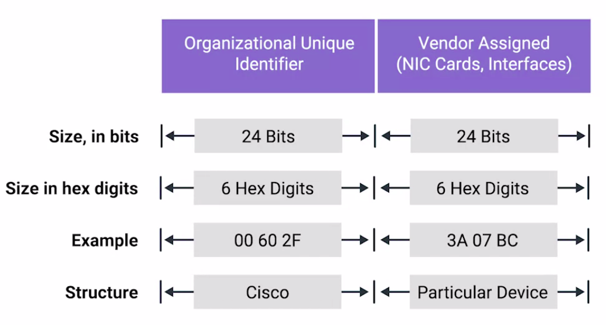

The first three octets of a MAC address are known as the **Organizationally Unique Identifier** or **OUI**. These are assigned to individual hardware manufacturers by the IEEE or the Institute of Electrical and Electronics Engineers. This is a useful bit of information to keeping your back pocket because it means that you can always identify the manufacturer of a network interface purely by its MAC address.

The last three octets of MAC address can be assigned in any way that the manufacturer would like with the condition that they only assign each possible address once to keep all MAC addresses globally unique.

**Ethernet** uses **MAC** addresses to ensure that the data it sends has both an address for the machine that sent the transmission, as well as the one that the transmission was intended for. In this way, even on a network segment, acting as a single collision domain, each node on that network knows when traffic is intended for it.

---

### Unicast, Multicast and Broadcast

So far, we've discussed ways for one device to transmit data to one other device. This is what's known as **unicast**.

**A unicast transmission is always meant for just one receiving address**. At the Ethernet level, this is done by looking at a special bit in the destination MAC address.

If the least significant bit in the first octet of a destination address is set to **zero**, it means that Ethernet frame is intended for only the **destination address**. This means it would be sent to all devices on the collision domain, but only actually received and processed by the intended destination. If the least significant bit in the first octet of a destination address is set to **one**, it means you're dealing with a **multicast frame**.

**A multicast frame is similarly set to all devices on the local network signal. What's different is that it will be accepted or discarded by each device depending on criteria aside from their own hardware MAC address. Network interfaces can be configured to accept lists of configured multicast addresses for these sort of communication**.

The third type of Ethernet transmission is known as broadcast. An Ethernet broadcast is sent to every single device on a LAN. This is accomplished by using a special destination known as a **Broadcast Address**. **The Ethernet broadcast address is all Fs (FF:FF:FF:FF:FF:FF)**. Ethernet broadcasts are used so that devices can learn more about each other. We'll be learning more about broadcast and a technology known as **Address Resolution Protocol** later. But for now, let's move on to dissecting the Ethernet frame.

---

### Dissecting an Ethernet Frame

**A data packet is an all-encompassing term that represents any single set of binary data being sent across a network link**. The term data packet isn't tied to any specific layer or technology. It just represents a concept. One set of data being sent from point A to Point B.

Data packets at the Ethernet level are known as **Ethernet frames**. **_An Ethernet frame is a highly structured collection of information presented in a specific order_**. This way network interfaces at the physical layer can convert a string of bits, travelling across a link into meaningful data or vice versa. Almost all sections of an Ethernet frame are mandatory and most of them have a fixed size.

1. The first part of an Ethernet frame is known as the **preamble**. **_A preamble is 8 bytes or 64 bits long and can itself be split into two sections_**. The first seven bytes are a series of alternating ones and zeros. These act partially as a buffer between frames and can also be used by the network interfaces to synchronize internal clocks they use, to regulate the speed at which they send data. This last byte in the preamble is known as the **SFD** or **Start Frame Delimiter**. **_This signals to a receiving device that the preamble is over and that the actual frame contents will now follow_**.

2. Immediately following the Start Frame Delimiter, comes the **Destination MAC Address** (6 bytes). This is the hardware address of the intended recipient. Which is then followed by the **Source MAC Address** (6 Bytes), or where the frame originated from. Don't forget that each MAC address is 48 bits or 6 bytes long.

3. The next part of an Ethernet frame is called the **EtherType Field**. **_It's 16 bits long and used to describe the protocol of the contents of the frame_**. We'll be doing a deep dive on what these protocols are a little later.

It's worth calling out that instead of the EtherType field, you could also find what's known as a **VLAN Header**. It indicates that the frame itself is what's called a VLAN frame. If a VLAN header is present, the EtherType field follows it.

**VLAN** stands for **Virtual LAN**. It's a technique that lets you have multiple logical LANs operating on the same physical equipment. **_Any frame with a VLAN tag will only be delivered out of a switch interface configured to relay that specific tag. This way you can have a single physical network that operates like it's multiple LANs_**. VLANs are usually used to segregate different forms of traffic. So you might see a company's IP phones operating on one VLAN, while all desktops operate on another.

4. After this, you'll find a data **payload** of an Ethernet frame. **_A Payload in networking terms is the actual data being transported, which is everything that isn't a header_**. The data payload of a traditional Ethernet frame can be anywhere from 46 to 1500 bytes long. This contains all of the data from higher layers such as the IP, Transport and Application layers that's actually being transmitted.

5. Following that data we have what's known as a **Frame Check Sequence**. **_This is a 4-byte or 32-bit number that represents a checksum value for the entire frame_**. This **checksum value** is calculated by performing what's known as a **Cyclical Redundancy Check (CRC)** against the frame. A Cyclical Redundancy Check or CRC, is an important concept for data integrity and is used all over computing, not just network transmissions. A CRC is basically a mathematical transformation that uses polynomial division to create a number that represents a larger set of data. Anytime you perform a CRC against a set of data, you should end up with the same checksum number. The reason it's included in the Ethernet frame is so that the receiving network interface can infer if it received uncorrupted data. When a device gets ready to send an Internet frame, it collects all the information we just covered, like the destination and originating MAC addresses, the data payload and so on. Then it performs a CRC against that data and attaches the resulting checksum number as the frame check sequence at the end of the frame.

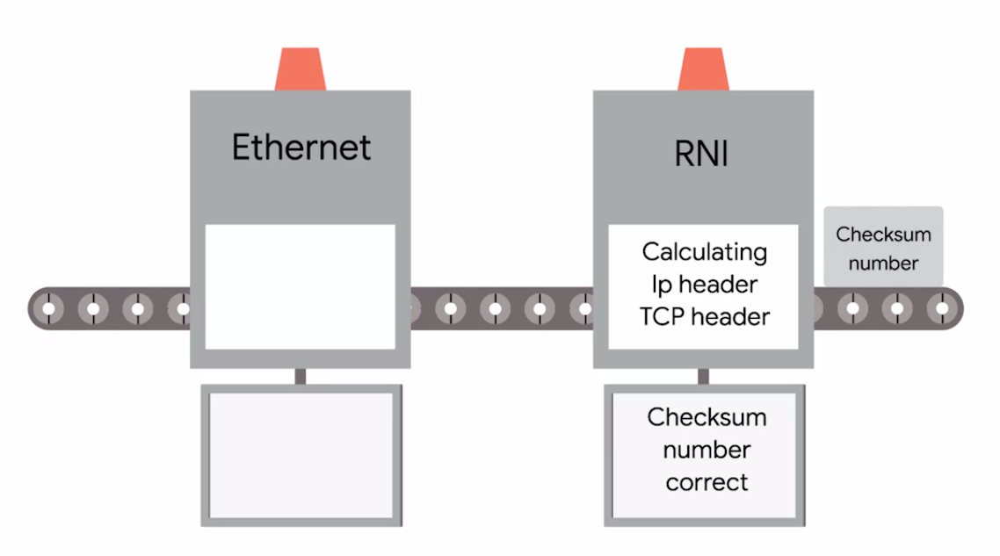

This data is then sent across a link and received at the other end.

Here, all the various fields of the Ethernet frame are collected and now the receiving side performs a CRC against that data.

If the checksum computed by the receiving end doesn't match the checksum in the frame check sequence field, the data is thrown out. This is because some amount of data must have been lost or corrupted during transmission. It's then up to a protocol at a higher layer to decide if that data should be retransmitted. Ethernet itself only reports on data integrity. It doesn't perform data recovery.

---

# The Network Layer

## Introduction to the Network Layer

On a local area network or LAN, nodes can communicate with each other through their physical MAC addresses. This works well on small scale because switches can quickly learn the MAC addresses connected to each other ports to forward transmissions appropriately. But MAC addressing isn't a scheme that scales well, every single network interface on the planet has a unique MAC address and they aren't ordered in any systematic way. There is no way of knowing where on the planet a certain MAC address might be at any one point in time, so it's not ideal for communicating across distances. In a later section, when we introduce **ARP** or **[Address Resolution Protocol](#address-resolution-protocol)**, you'll see that the way that nodes learn about each other's physical addressing isn't translatable to anything besides a single network segment anyway. Clearly we need another solution, and that is the **Network Layer**, and the **Internet Protocol** or **IP** in the **IP Addresses** that come along with it.

---

## IP Addresses

**IP Addresses are 32-bit numbers, made up of 4 octets and each octet is normally described in decimal numbers**. 8-bits of data, or a single octet can represent decimal numbers from 0-255.

For example: 12.34.56.78 is a valid IP Address but 123.456.789.100 is not a valid IP Address, because it has numbers larger than what could be represented in 8-bit octets.

This format is known as **Dotted Decimal Notation**. We will deep dive into how some of this works in an upcoming section about **subnetting**.The important thing to know for now is that IP addresses are distributed in large sections to various organizations and companies instead of being determined by hardware vendors. This means that IP addresses are more hierarchical and easier to store data about than physical addresses are. Think of IBM, which owns every single IP that has the number `9` as the first octet. At a very high level, this means that if an Internet router needs to figure out where to send a data packet intended for the IP address `9.0.0.1`, that router only has to know to get it to one of IBMs routers. That router can handle the rest of the delivery process from there. It's important to call out that IP addresses belong to the networks, not the devices attached to those networks. So your laptop will always have the same MAC address no matter where you use it, but it will have a different IP address assigned to it at an Internet cafe than it would when you're at home. The LAN at the Internet cafe, or the LAN at your house would each be individually responsible for handing out an IP address to your laptop if you power it on there.

For now, remember that on many modern networks you can connect a new device and an IP address will be assigned to it automatically through a technology known as **Dynamic Host Configuration Protocol (DHCP)**. An IP address assigned this way is known as a **Dynamic IP Address**.

The opposite of this is known as a **Static IP Address**, which must be configured on a node manually. In most cases static IP addresses are reserved for servers and network devices, while dynamic IP addresses are reserved for clients. But there are certainly situations where this might not be true.

---

## IP Datagrams and Encapsulation

Just like all the data packets at the Ethernet layer have a specific name, **_Ethernet frames_**, so do packets at the network layer. Under the IP Protocol, a packet is usually referred to as an **IP Datagram**. Just like any Ethernet frame, **_an IP datagram is a highly structured series of fields that are strictly defined_**.

The two primary sections of an IP datagram are

- The Header
- The Payload

### IP Datagram Header

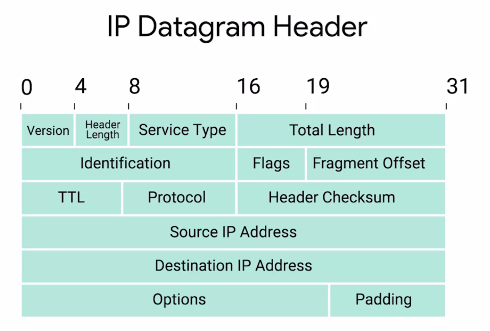

You'll notice that an IP datagram header contains a lot more data than an Ethernet frame header does.

1. The very first field is the **Version field**. This field is **`4`** bits long, and indicates what version of Internet protocol is being used. The most common version of IP is version four or **IPv4**. Version six or IPv6, is rapidly seeing more widespread adoption, but we'll cover that in a later module.
2. After the version field, we have the **Header Length field**. This is also a **`4`** bit field that declares how long the entire header is. This is almost always 20 bytes in length when dealing with IPv4. In fact, 20 bytes is the minimum length of an IP header. You couldn't fit all the data you need for a properly formatted IP header in any less space.

3. Next, we have the **Service Type field**. These **`8`** bits can be used to specify details about **Quality of Service** or **QoS** technologies. The important takeaway about QoS is that **_there are services that allow routers to make decisions about which IP datagram may be more important than others_**.

4. The next field is a **`16`** bit field, known as the **Total Length field**. It's used for exactly what it sounds like; to indicate the total length of the IP datagram it's attached to. The identification field, is a 16-bit number that's used to group messages together. IP datagrams have a maximum size and you might already be able to figure out what that is. Since the Total Length field is 16 bits, and this field indicates the size of an individual datagram, the maximum size of a single datagram is the largest number you can represent with 16 bits: 65,535.

5. If the total amount of data that needs to be sent is larger than what can fit in a single datagram, the IP layer needs to split this data up into many individual packets. When this happens, the **Identification field** is used so that the receiving end understands that every packet with the same value in that field is part of the same transmission.

6. Next up, we have two closely related fields. The flag field and the Fragmentation Offset field. The **Flag field** is used to indicate if a datagram is allowed to be fragmented, or to indicate that the datagram has already been fragmented.

7. **_Fragmentation is the process of taking a single IP datagram and splitting it up into several smaller datagrams_**. While most networks operate with similar settings in terms of what size an IP datagram is allowed to be, sometimes, this could be configured differently. If a datagram has to cross from a network allowing a larger datagram size to one with a smaller datagram size, the datagram would have to be fragmented into smaller ones. The **Fragmentation Offset field** contains values used by the receiving end to take all the parts of a fragmented packet and put them back together in the correct order.

8. Let's move along to The **Time to Live** or **TTL** field. This field is an **`8`**-bit field that indicates how many router hops a datagram can traverse before it's thrown away. Every time a datagram reaches a new router, that router decrements the TTL field by one. Once this value reaches zero, a router knows it doesn't have to forward the datagram any further.

   The main purpose of this field is to make sure that when there's a misconfiguration in routing that causes an endless loop, datagrams don't spend all eternity trying to reach their destination. An endless loop could be when router A thinks router B is the next hop, and router B thinks router A is the next hop, spoiler alert. In an upcoming section, you'll learn that the TTL field has valuable troubleshooting qualities.

9. After the TTL field, you'll find the **Protocol field**. This is another **`8`**-bit field that contains data about what transport layer protocol is being used. The most common transport layer protocols are TCP and UDP, and we'll cover both of those in detail in the next few sections.

10. So next, we find the **Header Checksum field**. This field is a checksum of the contents of the entire IP datagram header. It functions very much like the Ethernet checksum field we discussed in the last module. Since the TTL field has to be recomputed at every router that a datagram touches, the checksum field necessarily changes, too.

11. After all of that, we finally get to two very important fields, the Source and Destination IP Address fields. Remember that an IP address is a 32 bit number so, it should come as no surprise that these fields are each **32** bits long.

12. Up next, we have the IP options field. This is an optional field and is used to set special characteristics for datagrams primarily used for testing purposes.

13. The IP options field is usually followed by a padding field. Since the IP options field is both optional and variable in length, the padding field is just a series of zeros used to ensure the header is the correct total size.

### Encapsulation

Now that you know about all of the parts of an IP datagram, you might wonder how this relates to what we've learned so far. You might remember that in our breakdown of an Ethernet frame, we mentioned a section we described as the data payload section. This is exactly what the IP Datagram is, and this process is known as encapsulation.

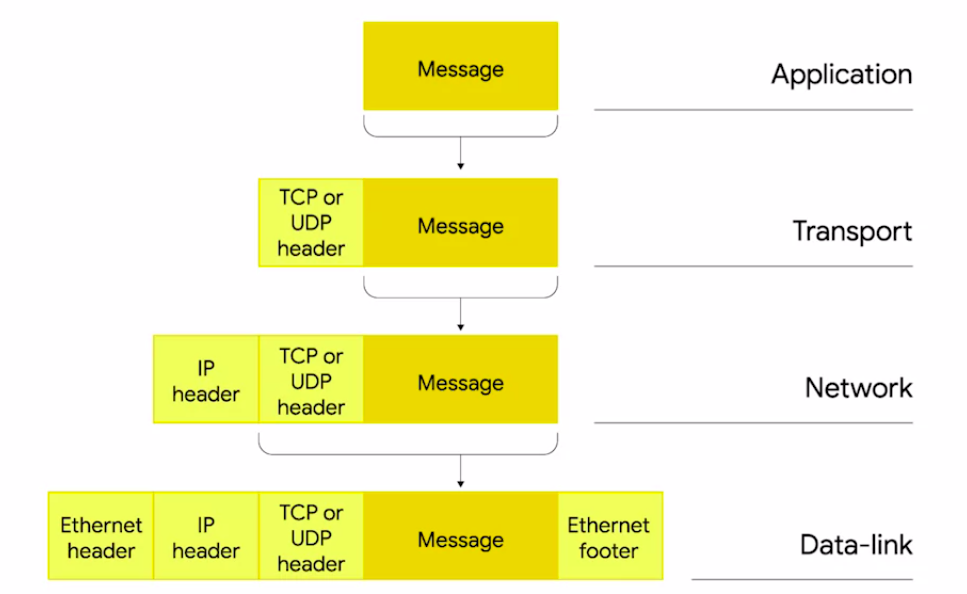

The entire contents of an IP Datagram are encapsulated as the payload of an Ethernet frame. You might have picked up on the fact that our IP Datagram also has a payload section. The contents of this payload are the entirety of a TCP or UDP packet which we'll in a future section. Hopefully, this helps you better understand why we talk about networking in terms of layers. Each layer is needed for the one above it.

---

## IP Address Classes

IP Addresses can be split into two sections:

- The **Network ID**
- The **Host ID**

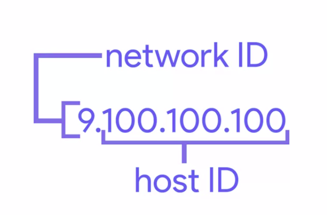

Earlier we mentioned that IBM owns all IP addresses that have a nine as the value of the first octet in an IP address. If we take an example IP address of 9.100.100.100, the network ID would be the first octet, and the host ID would be the second, third and fourth octets.

**_The Address Class System is a way of defining how the global IP address space is split up._** There are three primary types of address classes: **Class A**, **Class B** and **Class C**.

1. **Class A** addresses are those where the first octet is used for the network ID and the last three are used for the host ID.
2. Class B addresses are where the first two octets are used for the network ID, and the second two are used for the host ID.
3. Class C addresses, as you might have guessed, are those where the first three octets are used for the network ID, and only the final octet is used for the host ID.

Each address class represents a network of vastly different size.

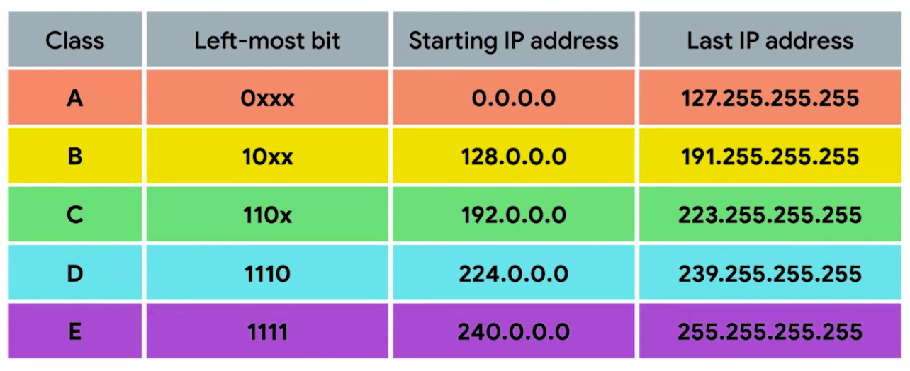

For example,

- Since a Class A network has a total of 24 bits of host ID space, this comes out to 2 to the 24th or 16,777,216 individual addresses.
- Compare this with a Class C network which only has eight bits of host ID space. For a Class C network, this comes out to 2 to the 8th or 256 addresses.

You can also tell exactly what Address Class in IP Address belongs to just by looking at it. If the very first bit of an IP Address is 0, it belongs to a Class A network. If the first bits are 10, it belongs to a Class B network. Finally, if the first bits are 110, it belongs to a Class C network. Since humans aren't great at thinking in binary, it's good to know that this also translates nicely to how these addresses are represented in dotted decimal notation. You might remember that each octet in an IP address is eight bits, which means each octet can take a value between 0 and 255. If the first bit has to be a 0, as it is with the Class A address, the possible values for the first octet are 0 through 127. This means that any IP address with a first octet with one of those values is a Class A address.

Similarly, Class B addresses are restricted to those that begin with the first octet value of 128 through 191.

And Class C addresses begin with the first octet value of 192 through 223. You might notice that this doesn't cover every possible IP address. That's because there are two other IP address classes, but they're not quite as important to understand.

Class D addresses always begin with the bits 1110, and are used for multicasting, which is how a single IP datagram can be sent to an entire network at once. These addresses begin with decimal values between 224 and 239. Lastly, Class E addresses make up all of the remaining IP addresses. But they are unassigned and only used for testing purposes.

In practical terms, this class system has mostly been replaced by a system known as **CIDR** or **Classless Inter-Domain Routing**. But the address class system is still in place in many ways and is important to understand for anyone looking for a well routed networking education.

---

## Address Resolution Protocol

We now understand how both **_Mac Addresses_** are used at the Data Link Layer, and how **_IP Addresses_** are used at the Network Layer. Now we need to discuss how these two separate address types relate to each other. This is where **Address Resolution Protocol** or **ARP** comes into play.

**_ARP is a protocol used to discover the hardware address of a node with a certain IP address_**.
Once it IP datagram has been fully formed, it needs to be encapsulated inside an Ethernet frame. This means that the transmitting device needs a destination MAC Address to complete the Ethernet frame header. Almost all network connected devices will retain a local **ARP Table**. **_An ARP table is just a list of IP addresses an the Mac addresses associated with them_**.

Let's say we want to send some data to the IP address 10.20.30.40. It might be the case that this destination doesn't have an entry in the ARP table. When this happens, the node that wants to send data send a broadcast ARP message to the Mac broadcast address, which is all F's.

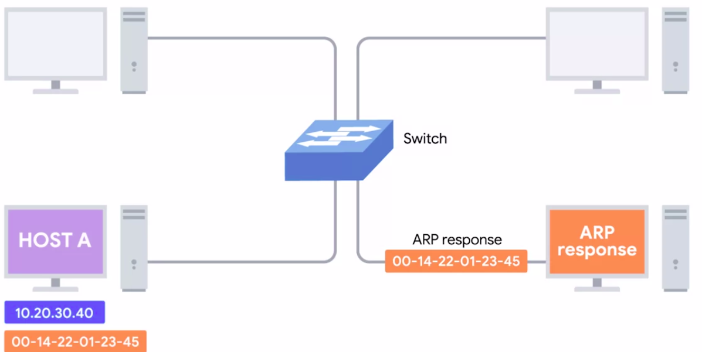

These kinds of broadcasts ARP messages are delivered to all computers on the local network. When the network interface that's been assigned an IP of 10.20.30.40 receives this ARP broadcast, it sends back what's known as an ARP response. This response message will contain the MAC address for the network interface in question. Now, the transmitting computer knows what MAC address to put in the destination hardware address field, and the Ethernet frame is ready for delivery. It'll also likely store this IP address in its local ARP table, so that it won't have to send an ARP broadcast the next time it needs to communicate with this IP, handy.

> **Note:** ARP table entries generally expire after a short amount of time to ensure changes in the network are accounted for.

---

## Looking up IP Addresses

Your IP address is no secret.
A lot of people worry that their IP address might reveal their name, home address, age, what they look at online and more. That's just not the case. Sure, they might find out some interesting information, but nothing revealing.

Let's explore what you can discover by running a real IP address through an IP Lookup website like this one.

There are a handful of practical reasons people use IP Lookup, even with its limitations:

- Law enforcement and fraud investigators use online tools to see what ISP is hosting a spammer.
- Blacklist databases use it to find spammers or other violators and block their access to email servers.
- Retailers often use IP Lookup to make sure someone charging thousands of dollars is at the mailing address linked to the card and not actually overseas with a stolen credit account.
- You can use it to verify that someone who tells you in an email that they're across town isn't really in an abandoned warehouse in another country.

---

## Subnetting

### What is Subnetting?

In the most basic of terms, **_Subnetting is the process of taking a large network and splitting it up into many individual smaller subnetworks or subnets_**. By the end of this section, you'll be able to:

- Explain why subnetting is necessary and describe how subnet masks extend what's possible with just network and host IDs.
- Discuss how a technique known as **CIDR** allows for even more flexibility than plain subnetting.
- Apply some basic binary math techniques to better understand how all of this works.

Incorrect subnetting setups are a common problem you might run into as an IT support specialist, so it's important to have a strong understanding of how this works.

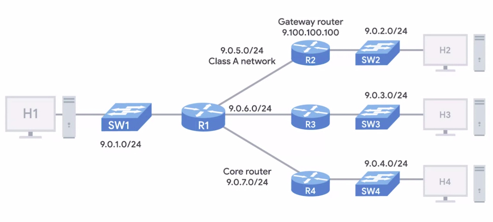

That's a lot, so let's dive in. As you might remember from the last lesson, Address Classes give us a way to break the total global IP space into discrete networks. If you want to communicate with the IP address 9.100.100.100, core routers on the Internet know that this IP belongs to the 9.0.0.0 Class A Network. They then route the message to the **gateway router** responsible for the network by looking at the network ID. **_A Gateway Router specifically serves as the entry and exit path to a certain network_**. You can contrast this with core internet routers, which might only speak to other core routers.

Once your packet gets to the gateway router for the 9.0.0.0 Class A network, that router is now responsible for getting that data to the proper system by looking at the host ID. This all makes sense until you remember that a single Class A network contains 16,777,216 individual IPs. That's just way too many devices to connect to the same router. This is where subnetting comes in.

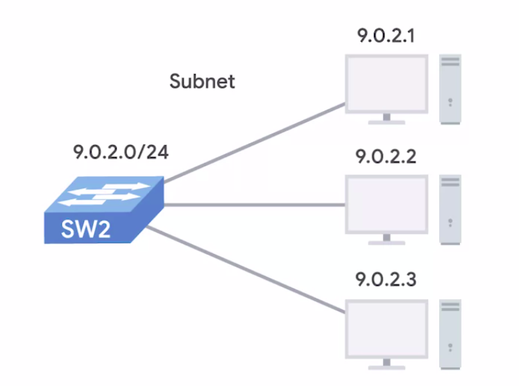

With subnets you can split your large network up into many smaller ones. These individual subnets will all have their own gateway routers serving as the ingress and egress point for each subnet.

---

### Subnet Masks

So far, we've learned about Network IDs, which are used to identify networks, and Host IDs, which are used to identify individual hosts. If we want to split things up even further, and we do, we'll need to introduce a third concept, the **Subnet ID**. You might remember that an IP Address is just a 32-bit number. In a world without Subnets, a certain number of these bits are used for the Network ID, and a certain number of the bits are used for the Host ID. In a world with subnetting, some bits that would normally comprise the host ID are actually used for the **Subnet ID**. With all three of these IDs representable by a single IP address, we now have a single 32-bit number that can be accurately delivered across many different networks.

At the internet level, core routers only care about the network ID and use this to send the datagram along to the appropriate gateway router to that network. That gateway router then has some additional information that it can use to send that datagram along to the destination machine or the next router in the path to get there. Finally, the host ID is used by that last router to deliver the datagram to the intended recipient machine.

Subnet IDs are calculated via what's known as a **Subnet Mask**. **_Just like an IP address, subnet masks are 32-bit numbers that are normally written now as four octets in decimal_**. The easiest way to understand how subnet masks work is to compare one to an IP address.

Let's work with the IP Address **`9.100.100.100`** again.
You might remember that each part of an IP Address is an octet, which means that it consists of four parts that are eight bits each. The number 9 in binary is just 1001. But since each octet needs eight bits, we need to pad it with some zeros in front.

| IP Address           | 9         | 100       | 100       | 100       |
| -------------------- | --------- | --------- | --------- | --------- |
| IP Address in Binary | 0000 1001 | 0110 0100 | 0110 0100 | 0110 0100 |

As far as an IP address is concerned, having a number 9 as the first octet is actually represented as 0000 1001. Similarly, the numeral 100 as an 8-bit number is 0110 0100. So, the entire binary representation of the IP address 9.100.100.100 is a lot of ones and zeros.

A subnet mask is a binary number that has two sections.

- The beginning part, which is the mask itself is a string of ones.
- Just zeros that come after this.

| IP Address            | 9         | 100       | 100       | 100       |
| --------------------- | --------- | --------- | --------- | --------- |
| IP Address in Binary  | 0000 1001 | 0110 0100 | 0110 0100 | 0110 0100 |
| Subnet Mask in Binary | 1111 1111 | 1111 1111 | 1111 1111 | 0000 0000 |

The subnet mask, which is the part of the number with all the ones, tells us what we can ignore when computing a host ID. The part with all the zeros tells us what to keep.

Let's use the common Subnet Mask of 255.255.255.0. This would translate to 24 ones followed by eight zeros. The purpose of the mask or the part that's all ones is to tell a router what part of an IP address is the subnet ID. You might remember that we already know how to get the network ID for an IP address. For 9.100.100.100, a Class A network, we know that this is just the first octet. This leaves us with the last three octets.

In, IP Address **`9.100.100.100`**,

- The first octet, represented by 9 is the Network ID.
- The remaining three octets contain the Subnet ID and Host ID.
- Let's take these remaining three octets and imagine them next to the subnet mask in binary form:
  - The numbers in the remaining octets that have a corresponding **`1`** in the Subnet Mask are the subnet ID.
  - The numbers in the remaining octets that have a corresponding **`0`** are the Host ID.

**_The size of a subnet is entirely defined by its subnet mask_**.
So for example, with the subnet mask of **`255.255.255.0`**, we know that only the last octet is available for host IDs, regardless of what size the Network and Subnet IDs are.

A single 8-bit number can represent 256 different numbers, or more specifically, the numbers 0-255. This is a good time to point out that, in general, a subnet can usually only contain two less than the total number of host IDs available. Again, using a subnet mask of 255.255.255.0, we know that the octet available for host IDs can contain the numbers 0-255, but zero is generally not used and 255 is normally reserved as a broadcast address for the subnet. This means that, really, only the numbers 1-254 are available for assignment to a host. While this total number less than two approach is almost always true, generally speaking, you'll refer to the number of host available in a subnet as the entire number. So, even if it's understood that two addresses aren't available for assignment, you'd still say that eight bits of host IDs space have 256 addresses available, not 254. This is because those other IPs are still IP addresses, even if they aren't assigned directly to a node on that subnet.

Now, let's look at a subnet mask that doesn't draw its boundaries at an entire octet or eight bits of address. The subnet mask **`255.255.255.224`** would translate to 27 ones followed by 5 zeros in Binary.

| IP Address            | 9         | 100       | 100       | 100       |
| --------------------- | --------- | --------- | --------- | --------- |
| IP Address in Binary  | 0000 1001 | 0110 0100 | 0110 0100 | 0110 0100 |
| Subnet Mask in Binary | 1111 1111 | 1111 1111 | 1111 1111 | 1110 0000 |

This means that we have 5 bits of Host ID space or a total of 32 addresses (2 to the power of 5). This brings up a shorthand way of writing subnet masks. Let's say we're dealing with the IP Address **`9.100.100.100`** with a Subnet Mask of **`255.255.255.224`**. Since that subnet mask represents 27 ones followed by 5 zeros, a quicker way of referencing this is with the notation **`/27`**. The entire IP Address and Subnet Mask can be written now as **`9.100.100.100/27`**.

Neither notation is necessarily more common than the other, so it's important to understand both.

---

### Basic Binary Math

Binary numbers can seem intimidating at first, since they look so different from decimal numbers. But, as far as the basics go the math behind counting, adding, or subtracting binary numbers is exactly the same as with decimal numbers. It's important to call out that there aren't different kinds of numbers. Numbers are universal. There are only different notations for how to reference them. Humans most likely because most of us have ten fingers and ten toes decided on using a system with 10 individual numerals used to represent all numbers. The numerals zero, one, two, three, four, five, six, seven, eight and nine can be combined in ways to represent any whole number in existence. Because there are 10 total numerals in use in a **`Decimal System`**, another way of referring to this is as **`Base 10`**.

But because of the constraints of how logic gates work inside of a processor, it's way easier for computers to think of things only in terms of **`0`** and **`1`**. This is also known as **`Binary`** or **`Base 2`**.

| Decimal | Binary |
| ------- | ------ |
| 0       | 0      |
| 1       | 1      |
| 2       | 10     |
| 3       | 11     |
| 4       | 100    |
| 5       | 101    |
| 6       | 110    |
| 7       | 111    |
| 8       | 1000   |
| 9       | 1001   |
| 10      | 1010   |
| 11      | 1011   |
| 12      | 1100   |
| 13      | 1101   |
| 14      | 1110   |
| 15      | 1111   |
| 16      | 10000  |

There's a pretty simple trick to figure out how many decimal numbers can be represented by a certain number of bits. If you have an eight bit number you can just perform the math 2 to the power of 8, this gives you 256 which lets you know that an eight bit number can represent 256 decimal numbers, or put another way the numbers 0-255.

| Bits | Decimal Number Range |
| ---- | -------------------- |
| 4    | 0-15                 |
| 8    | 0-255                |
| 16   | 0-65535              |

This trick doesn't only work for binary, it works for any number system, it's just the base changes.

| Octal Digits | Decimal Number Range | Hexadecimal Digits | Decimal Number Range |
| ------------ | -------------------- | ------------------ | -------------------- |
| 2            | 0-63                 | 2                  | 0-255                |
| 4            | 0-4095               | 4                  | 0-65536              |

#### Binary Addition

Binary Addition is simple:

0 + 0 = 0
0 + 1 = 1
1 + 0 = 1
1 + 1 = 10 (read: one zero)

We carry a digit to the next column once you reached 10 in doing Decimal addition.
Similarly, you carry a digit to the next column once you reach 2 when doing Binary addition.

Addition is what's known as an operator and there are many operators that computers use to make calculations.

#### `OR` and `AND`

Two of the most important operators are **`OR`** and **`AND`**.
In computer logic, a **`1`** represents **`true`** and a **`0`** represents **`false`**.

1. **OR**
   The way the **`OR`** operator works is you look at each digit, and if either of them is true, the result is true.

   X OR Y = Z

   If either X of Y is true, then Z is true; otherwise it's false.

   1 OR 0 = 1
   0 OR 1 = 1
   0 OR 0 = 0

2. **AND**
   The way the **`AND`** operator works is it returns true if both values are true.

   1 AND 1 = 1
   0 AND 1 = 0
   1 AND 0 = 0
   0 AND 0 = 0

#### Subnet Masks and Operators

A subnet mask is a way for a computer to use **`AND`** operators to determine if an IP address exists on the same network. This means that the host ID portion is also known, since it will be anything left out.

Let's use the binary representation of our favorite IP address **`9.100.100.100`** and our favorite subnet mask **`255.255.255.0`**.

| IP Address            | 9         | 100       | 100       | 100       |
| --------------------- | --------- | --------- | --------- | --------- |
| AND Operator          | AND       | AND       | AND       | AND       |
| Subnet Mask in Binary | 1111 1111 | 1111 1111 | 1111 1111 | 1110 0000 |

Once you put one on top of the other and perform a binary **`AND`** operator on each column, you'll notice that the result is the network ID and subnet ID portion of our IP address or **`9.100.100`**.

The computer that just performed this operation can now compare the results with its own Network ID to determine if the address is on the same network or a different one. I bet you never thought you'd have a favorite IP address or subnet but that's what happens in the wonderful world of basic binary math.

---

### CIDR

Address Classes were the first attempt at splitting up the global Internet IP space.
Subnetting was introduced when it became clear that address classes themselves weren't as efficient way of keeping everything organized.

But as the Internet continued to grow, traditional subnetting just couldn't keep up. With traditional subnetting and the address classes, the Network ID is always either,

- **`8-bit for Class A networks`**,
- **`16-bit for Class B networks`**, or
- **`24-bit for Class C networks`**.

This means that there might only be **`254`** Class A networks in existence, but it also means there are **`2,970,152`** potential class C networks. That's a lot of entries in a routing table. To top it all off, the sizing of these networks aren't always appropriate for the needs of most businesses. **`254`** hosts in a Class C network is too small for many use cases, but the **`65,534`** hosts available for use in a Class B network is often way too large. Many companies ended up with various adjoining Class C networks to meet their needs. That meant that routing tables ended up with a bunch of entries for a bunch of Class C networks that were all actually being routed to the same place.

This is where **CIDR** or **Classless Inter-Domain Routing** comes into play.

**CIDR** is an even more flexible approach to describing blocks of IP addresses. It expands on the concept of subnetting by using subnet masks to demarcate networks. To demarcate something means to set something off. When discussing computer networking, you'll often hear the term demarcation point to describe where one network or system ends and another one begins.

In our previous model, we relied on a Network ID, Subnet ID, and Host ID to deliver an IP Datagram to the correct location. With CIDR, the Network ID and Subnet ID are combined into one. CIDR is where we get this shorthand slash notation that we discussed in the earlier video on subnetting. This slash notation is also known as **CIDR notation**. **_CIDR basically just abandons the concept of Address Classes entirely, allowing an address to be defined by only two Individual IDs_**.

Let's take **`9.100.100.100`** with a net mask of **`255.255.255.0`**. Remember, this can also be written as **`9.100.100.100/24`**. In a world where we no longer care about the Address Class of this IP, all we need is what the network mask tells us to determine the Network ID. In this case, that would be **`9.100.100`**, the Host ID remains the same.

This practice not only simplifies how routers and other network devices need to think about parts of an IP Address, but it also allows for more arbitrary network sizes. Before, network sizes were static.
Think only Class A, Class B or, Class C, and only Subnets could be of different sizes. **CIDR** allows for networks themselves to be differing sizes.

Before this, if a company needed more addresses than a single Class C could provide, they need an entire second Class C. With CIDR, they could combine that Address Space into one contiguous chunk with a Subnet mask of **`/23`** or **`255.255.254.0`**. This means, that routers now only need to know one entry in their routing table to deliver traffic to these addresses instead of two.

It's also important to call out that you get additional available Host IDs out of this practice. Remember that you always lose two Host IDs per network. So, if a **`/24`** network has 2 to the power of 8 or **`256`** potential hosts, you really only have 256 minus two, or **`254`** available IPs to assign. If you need two networks of this size, you have a total of 254 plus 254 or 508 hosts. A single /23 network, on the other hand, is two to the nine or 512. 512 minus two, 510 hosts.

For **`9.100.100.100/23`**,

| IP Address            | 9         | 100       | 100       | 100       |
| --------------------- | --------- | --------- | --------- | --------- |
| IP Address in Binary  | 0000 1001 | 0110 0100 | 0110 0100 | 0110 0100 |
| Subnet Mask in Binary | 1111 1111 | 1111 1111 | 1111 1110 | 0000 0000 |

**Number of Hosts = 2^9 - 2 = 512 - 2 = `510`**

---

## Routing

The Internet is an incredibly impressive technological achievement. It meshes together millions of individual networks and allows communications to flow between them. From almost anywhere in the world, you can now access data from almost anywhere else. Often in just fractions of a second. The way communications happen across all these networks, allowing you to access data from the other side of the planet, is through **routing**.

By the end of this section, you'll be able to:

- Describe the basics of routing and how routing tables work.
- Define some of the major routing protocols and what they do.
- Identify non-routable address space and how it's used.
- You'll also gain an understanding of the RFC system and how it made the Internet what it is today.

### Routing Concepts

Routing is one of those things that is very simple and very complex. At a very high level, what routing is and how routers work is actually pretty simple. But underneath the hood, routing is a very complex and technologically advanced topic. Entire books have been written about the topic. Today most intensive routing issues are almost exclusively handled by ISPs and only the largest of companies.

1. **Router**
   From a very basic standpoint, a **_Router is a network device that forwards traffic depending on the destination address of that traffic_**. A router is a device that has at least two network interfaces, since it has to be connected to two networks to do its job.

   Basic routing has just a few steps:

   - One, a router **_receives a packet of data on one of its interfaces_**.
   - Two, the router **_examines the destination IP of this packet_**.
   - Three, the router then **_looks up the destination network of this IP in its routing table_**.
   - Four, the router **_forwards that out though the interface that's closest to the remote network as determined by additional info within the routing table_**.

   These steps are repeated as often as needed until the traffic reaches its destination.

---

# The Transport Layer

---

# The Application Layer

---

# Networking Services

---

## Name Resolution

---

## Name Resolution in Practice

---

## Dynamic Host Configuration Protocol (DHCP)

---

## Network Address Translation

---

## VPN and Proxies

---

# Connecting to the Internet

---

## POTS and Dial-Up

---

## Broadband Connections

---

## WANs

---

## Wireless Networking

---

# Troubleshooting and the Future of Networking

---

## Verifying Connectivity

---

## Digging into DNS

---

## The Cloud

---

## IPv6

---

# References
