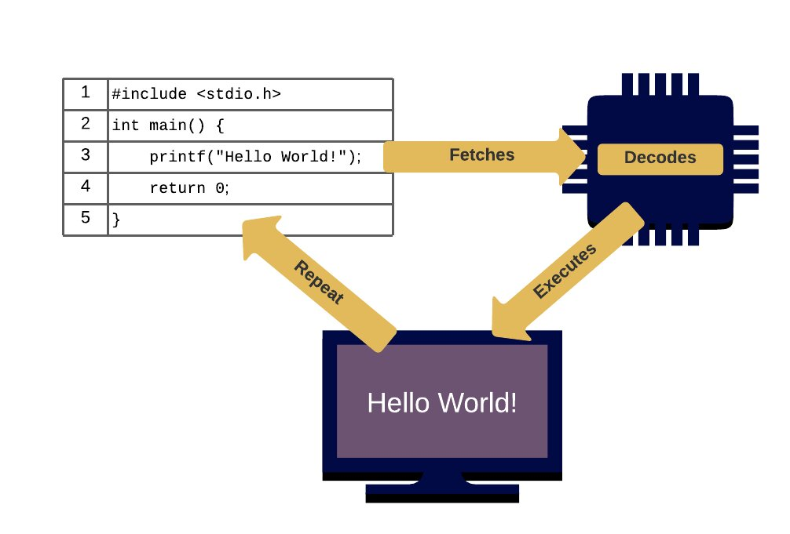
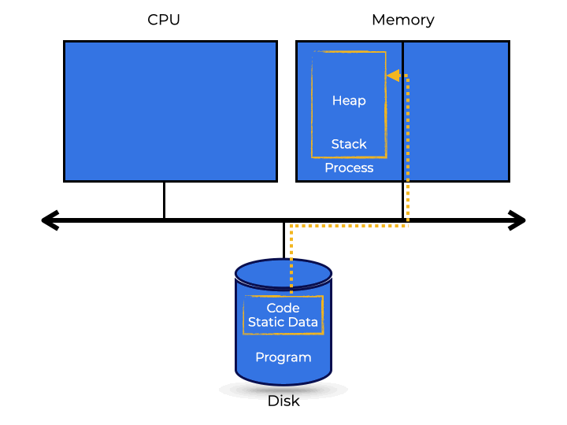

# Table of Contents

- [Table of Contents](#table-of-contents)
- [Introduction to Operating Systems](#introduction-to-operating-systems)
  - [What is an Operating System?](#what-is-an-operating-system)
  - [Theme 1 - Virtualization](#theme-1---virtualization)
  - [Theme 2 - Memory](#theme-2---memory)
    - [Memory Virtualization](#memory-virtualization)
  - [Theme 3 - Concurrency](#theme-3---concurrency)
    - [Multi-Threading](#multi-threading)
  - [Theme 4 - Persistence](#theme-4---persistence)
    - [Input/Output](#inputoutput)
- [C Primer](#c-primer)
  - [A Basic "Hello World" C Program](#a-basic-hello-world-c-program)
    - [Compilation Flags](#compilation-flags)
    - [Execution](#execution)
    - [Command Line Arguments](#command-line-arguments)
  - [C Manual](#c-manual)
  - [Linking Libraries](#linking-libraries)
  - [Multi-File Programs](#multi-file-programs)
  - [Make](#make)
    - [Clean](#clean)
    - [Generalizing makefiles](#generalizing-makefiles)
  - [Debugging](#debugging)
- [Processes and Execution](#processes-and-execution)
  - [Introduction](#introduction)
  - [What is a Process?](#what-is-a-process)
  - [Process Creation](#process-creation)
  - [Process States](#process-states)
  - [What are the different states of a process?](#what-are-the-different-states-of-a-process)
  - [Data Structures](#data-structures)
  - [Summary](#summary)
  - [Case Studies](#case-studies)
    - [Case 1: No Switch](#case-1-no-switch)
    - [Case 2: `SWITCH_ON_IO`](#case-2-switch_on_io)
    - [Case 3: `IO_RUN_LATER`](#case-3-io_run_later)
    - [Case 4 - `IO_RUN_IMMEDIATE`](#case-4---io_run_immediate)
- [Process API](#process-api)
  - [Intro to the Process API](#intro-to-the-process-api)
  - [`fork()`](#fork)
  - [`wait()`](#wait)
  - [`exec()`](#exec)
  - [Redirection and Pipes](#redirection-and-pipes)
    - [Redirection](#redirection)
    - [Pipes](#pipes)
  - [Process Control](#process-control)
    - [Stopping and Resuming a Process](#stopping-and-resuming-a-process)
  - [Users](#users)
  - [Summary](#summary-1)
  - [Case Studies](#case-studies-1)
    - [Case 1](#case-1)
- [Direct Execution](#direct-execution)
  - [Introduction to LDR (Limited Direct Execution)](#introduction-to-ldr-limited-direct-execution)
  - [Basic Technique: Limited Direct Execution](#basic-technique-limited-direct-execution)
  - [Problem 1 - Restricting of a Program while Allowing Kernel Access](#problem-1---restricting-of-a-program-while-allowing-kernel-access)
    - [Restricted Operations: User & Kernel Mode](#restricted-operations-user--kernel-mode)
    - [System Calls](#system-calls)
    - [Trap Tables](#trap-tables)
  - [Problem 2: Switching Between Processes](#problem-2-switching-between-processes)
    - [Waiting for System Calls: A Cooperative Approach](#waiting-for-system-calls-a-cooperative-approach)
    - [The OS takes over: A Non-Cooperative Approach](#the-os-takes-over-a-non-cooperative-approach)
    - [Saving and Restoring Context](#saving-and-restoring-context)
    - [Concurrency Concerns](#concurrency-concerns)
  - [Summary](#summary-2)
- [CPU Scheduling](#cpu-scheduling)

# Introduction to Operating Systems

## What is an Operating System?

The **operating system (OS)** is a piece of software that ensures the system runs smoothly and efficiently.

An operating system makes it easy to run programs (even allowing you to seemingly run many at the same time) by allowing programs to share memory and enabling programs to interact with hardware.

Up until now, you probably have run code in an IDE of some kind (or from the command line) without considering how it interacted with hardware.

Consider your program a set of instructions to be run by your computer:



Millions (even billions) of times each second, the processor or CPU:

- Fetches an instruction,
- Decodes it (i.e., figures out which instruction this is), and
- Executes it.
- This repeats for each instruction until the program is finished.

This is a pretty simplistic view of what is happening under-the-hood. While a program is running, many other things are happening, controlled by the OS, to make the system easier to use.

So, what does an Operating System do?

- Takes physical resources (CPU, memory, disk, etc) and virtualizes them.
- Manages the shared memory between programs.
- Handles tough issues related to concurrency.
- Stores files persistently, making it safe for the long-term.

---

## Theme 1 - Virtualization

One component of how the OS makes things easier to use is **virtualization** or the transformation of a physical resource (such a processor, memory, or disk) into a more general, powerful, and user-friendly virtual form.

Because virtualization allows many programs to run simultaneously (sharing the CPU), access their own instructions and data (sharing memory), and access devices (sharing storage, etc. ), the OS is commonly referred to as a **resource manager**.

**Even though we only have one CPU, multiple programs seem to be operating simultaneously! How does it work?**

With help from the hardware, the operating system creates the illusion of having a bunch of virtual CPUs.

Through virtualization, the operating system abstracts physical hardware into simplified representations. These representations are accessed through interfaces. The operating system handles these requests, acting as a resource manager.

This virtualizing of the CPU, allows several applications to run simultaneously on a single CPU (or a limited collection of them).

We’ll use the `pkill` command to terminate all `processes` (instances of the programs).

To execute applications, stop them (such as above), or otherwise instruct the OS which programs to run, certain interfaces (APIs) must be available. These are how most users interact with operating systems.

---

## Theme 2 - Memory

A program’s **memory** is accessed constantly. A program maintains all of its data structures in memory and accesses them via **loads** (reads), **stores** (writes) and other explicit memory-accessing instructions.

In addition to data structures, each program instruction lives in memory, so memory is accessed on each instruction fetch.

### Memory Virtualization

Let’s look at the program below that uses `malloc()` to allocate memory:

```C
int main(int argc, char *argv[]) {
    int *p;
    //allocates memory
    p = malloc(sizeof(int));
    //prints address of memory, inserting 0
    printf("(%d) addr pointed to by p: %p\n", (int) getpid(), p);
    // assign input to address stored in p
    *p = atoi(argv[1]);
    //loop every second and increment address value of p
    while (1) {
        wait(1);
        *p = *p + 1;
        printf("(%d) value of p: %d\n", getpid(), *p);
    }
    return 0;
}
```

- It first allocates memory.
- Displays the memory address, inserting a zero into memory.
- Inserts the inputted value into memory.
- Loops forever, incrementing and printing the value every second.

Every print statement also prints the **PID (Process Identifier)** for the program. **This PID is unique per running process**.

Each process has its own private **virtual address space** (also known as its address space), which the operating system maps into the machine’s **physical memory**.

A **memory reference** within one running program has no effect on the address space of other processes (or the operating system); the running program has its own virtual memory.

**Physical memory**, on the other hand, is a shared resource managed by the operating system.

Memory is accessed constantly to fetch instructions, as well as read and write data. The operating system virtualized memory so it can be easily used by running programs – but these programs are not directly accessing the physical memory – just the virtualized memory!

---

## Theme 3 - Concurrency

**Concurrency** refers to handling processes simultaneously.

Concurrency issues initially originated inside the operating system. As you saw in the virtualization example, the OS juggles many tasks at once, and not in a predictable order, often resulting in issues.

These same issues may be seen in **multi-threaded systems**.

### Multi-Threading

```C
int main(int argc, char *argv[]) {
    increments = atoi(argv[1]);
    pthread_t p1, p2;

    //create two threads
    pthread_create(&p1, NULL, worker, NULL);
    pthread_create(&p2, NULL, worker, NULL);

    pthread_join(p1, NULL);
    pthread_join(p2, NULL);
    printf("Final value   : %d\n", counter);
    return 0;
}
```

In the code to the left, two threads are created, incrementing their respective counters for the inputted number of times. Their counters are then combined and printed.

**Command:** `./concurrency 1000`

**Output:** Final value : 2000

Because each thread increased the counter 1000 times, the counter’s final value is 2000 when the two threads are done. Indeed, if the loops’ input value is set to N, we should anticipate the program’s ultimate output to be 2N. But, as it turns out, life is not so easy.

Let’s rerun the same program, but this time with larger loop values to see what happens. Run the following program 3 or 4 times and note the output:

**Command:** `./concurrency 100000`

**Output**: Final value : 128823

**The results seem to come unexpected. Why do you think this is happening?**

The results are related to the execution of the instructions one by one. A crucial part of the program takes three instructions to increment the shared counter:

1. one for loading the counter value from memory into a register
2. one for incrementing it
3. one for storing it back in memory

Funny things happen because these three instructions do not execute at the same time.
**This is a concurrency problem.**

Concurrency issues happen because instructions from different programs are run in random order. A single processor can only run **1** thing at a time, so the operating system chops up the tasks and feeds them to the processor, yielding unpredictable results.

---

## Theme 4 - Persistence

Data in system memory can be easily lost due to volatile storage technology. When power is off, or the system crashes, all data in memory is lost. As a result, **we require hardware and software to store data persistently**.

Hard drives and SSDs, which are **input/output (I/O) devices**, are popular for storing long-term data. The operating system handles these as part of the **file system**, which is responsible for storing user files reliably and efficiently.

Unlike the OS’s CPU and memory abstractions, the operating system does not create a private, virtualized drive for each program or file. Instead, **users are expected to share file-based information regularly**.

### Input/Output

```C
#include <stdio.h>
#include <unistd.h>
#include <fcntl.h>
#include <sys/stat.h>
#include <sys/types.h>
#include <string.h>

int main(int argc, char *argv[]) {
    // creates file
    int file = open("/tmp/file", O_WRONLY | O_CREAT | O_TRUNC, S_IRUSR | S_IWUSR);
    char buffer[40];
    sprintf(buffer, "I will persist!\n");
    //writes data to file
    write(file, buffer, strlen(buffer));
    fsync(file);
    // closes the file
    close(file);
    return 0;
}
```

**Compile Code:** `gcc -o io io.c -Wall`

**Run Code:** `./io`

This is done making three system calls to the OS.

1. **`open()`** - opens and creates the file
2. **`write()`** - writes data to the file
3. **`close()`** - closes the file and ends writing.

These system calls are routed to the file system which handles them and returns a response code to the user.

The file system has to do a lot of work to actually write to disk:

- Figuring out where on disk this new data will live, and
- Keeping track of it in various structures maintained by the file system.

This requires sending I/O requests to the underlying storage device to either read or update existing structures.

The OS provides us with a standard, simple way to access devices through **system calls**. To make many common tasks more efficient, file systems utilize a wide range of data structures and access methods, ranging from basic lists to sophisticated b-trees.

---

# C Primer

## A Basic "Hello World" C Program

Basic **"Hello World"** Program in **C**

```C
#include <stdio.h>

int main(int argc, char *argv[]) {
    printf("Hello World!\n");
    return(0);
}
```

Here is a key mapping of the syntax of the above **"Hello World"** program:

| Instruction                      | C        | Java                    | Python          |
| -------------------------------- | -------- | ----------------------- | --------------- |
| Importing libraries              | #include | import                  | import          |
| Single line comment              | //       | //                      | #               |
| Multi-line comment               | /\* \*/  | /\* \*/                 | /\* \*/         |
| Main method                      | int main | public static void main | def main        |
| Command line arguments           | argv     | args[]                  | sys.argv()      |
| Number of command line arguments | argc     | args.length             | len(sys.argv()) |

> **Note:**
>
> - The first line includes `stdio.h`, which has many common input/output methods, including `printf()`
> - You’ll notice that the main method returns an int in C (unlike Java and Python). This int is what the program returns to the shell that ran it where it is saved in the `status` variable. Convention is that a 0 exit status means the program executed error-free.

To Compile we run the following command in the terminal"

```bash
gcc hello.c
```

### Compilation Flags

```bash
gcc -o hello hello.c  # -o: to specify the executable name
gcc -Wall hello.c  # -Wall: gives better warnings
```

### Execution

The compilation above produced an executable named `a.out` (unless you used the `-o` flag).
To run the program, type (or copy-paste) the following in the terminal in the bottom left and press Enter/Return:

```bash
./a.out
```

### Command Line Arguments

Command line arguments follow the name of the executable:

```bash
./a.out A B C 1 2 3
```

- `argv[0]` will be the string `"./a.out"`, followed by each argument (e.g. `argv[2]` is `B`).
- `argc` in the above example will be 7.

> **Note:**
>
> - Sometimes you will need to link a library as part of your execution command.
> - Remember that every code change means you need to re-compile before you re-excute.

---

## C Manual

Your program may need to use a library, but the built-in manual is a handy way to find the proper `#include` or take a peek at related functions.

Strings are not built-in with C so let’s take a look at the String library.

```bash
man string
```

Under SYNOPOSIS, you’ll notice there are actually 2 different imports, `<strings.h>` and `<string.h>`, depending on the functionality you are looking for.

Once you are done reading, simply press `q` (as noted in the bottom left) to quit.

> **Note:** If you want to access the manual but aren’t at a Unix box, you can find them here: https://www.kernel.org/doc/man-pages/

## Linking Libraries

Some library routines, most notably the math library, aren’t in the C library. Take a look at the manual pages for `sqrt` or `pow` and you’ll notice it says:

```bash
#include <math.h>
...
Link with -lm.
```

The `Link with -lm` indiciates you need to **"link"** your software with the `math` library. Conveniently, it also provides the corresponding compiler flag:

```bash
gcc -o hello hello.c -lm
```

**For example:**

The scanf function is listed under `#include <stdio.h>` in the manual pages, so you only need that import statement.

Additionally, there is no note that linking is required to use this library so the `-lm` flag is not necessary during compilation to use scanf.

---

## Multi-File Programs

Similar to linking libraries, once your C programs become big enough that they span multiple files you will compile the files individually, and link them together. For example, you want to compile `hello.c` and `helper.c` separately, then link them together:

```bash
gcc -c hello.c
gcc -c helper.c
gcc -o hello hello.o helper.o -lm
```

The `-c` flag tells the compiler to produce object files, in this case, `hello.o` and `helper.o`. Build-only flags like `-Wall` are put on these compile lines.

To make an executable, you have to **"link"** the object files. We’ve done this on the last command above (`gcc -o hello hello.o helper.o`). This line is often referred to as the **"link line"** because it is where link-specific instructions like `-lm` are specified.

You could specify all the C source files in a single line (`gcc -o hello hello.c helper.c`), but this needs the system to recompile each file, which takes a lot of time. Compiling each one separately saves time and increases productivity by just re-compiling files that have changed during editing.

This process can get messy - so this process is best managed by `make`.

---

## Make

Make is a powerful tool that automates most of the build process. Let’s examine a simple `Makefile` example shown below.

```C
hello: hello.o helper.o
	gcc -o hello hello.o helper.o -lm

hello.o: hello.c
  gcc -c hello.c

helper.o: helper.c
	gcc -c helper.c

clean:
	rm -f hello.o helper.o hello
```

Makefiles use rules to decide what needs to be done. A rule’s general form:

```makefile
target: prerequisite1 prerequisite2 ...
    command1
    command2 ...
```

- **Target** - The name of a command-generated file, such as an executable or object file.
  A target can also be an action name, like **"clean"** in our example.

- **Prerequisite** - This file is used to create the target. A target often requires multiple files.
  To generate the executable `hello`, we need to build two object files first: `hello.o` and `helper.o`.

- **Command** - An action that make carries out. A rule may include several commands on separate lines.

Most of the commands should look familiar from the last page with the exception of line 11 which is discussed below.

> **Note:** Every command line must start with a tab character! If you merely put spaces, make will terminate with an unclear error message.

To build your program, type **`make`** on the terminal on the bottom-left and press Enter/Return. This will default to looking for `Makefile` or `makefile` as input.

---

### Clean

To use the `clean` target, you have to ask for it explicitly. In the terminal, type:

```bash
make clean
```

Because the clean target has no prerequisites, typing `make clean` will always execute the command(s). The `clean` target removes the object files and executable, which is useful if you want to recreate the program from scratch.

### Generalizing makefiles

`makefiles` may seem cumbersome but fortunately, there are many shortcuts that make it easier to use.

```makefile
SOURCES = hello.c helper.c
OBJS = $(SOURCES:.c=.o)
TARGET = hello

CC =gcc  # compiler
OPTS = -Wall # flags
LIBS = -lm # libraries

$(TARGET): $(OBJS)
	$(CC) -o $(TARGET) $(OBJS) $(LIBS)

%.o: %.c
	$(CC) $(OPTS) -c $< -o $@

clean:
	rm -f $(OBJS) $(TARGET)
```

This `makefile` can make your life a little easier.

- The `SOURCES` variable at the top of the `makefile` allows you to easily add additional source files to your build.
- Change the `TARGET` line to change the executable name.
- Another program called `makedepend` helps figure out a target’s prerequisites.

---

## Debugging

For the program below:

```C
#include <stdio.h>

struct Number {
  int num;
};

int main(int argc, char *argv[]) {
  struct Number *p = NULL;
  printf("%d\n", p->num);
}
```

You can use `gdb` your C programs by:

1. compiling with the -g flag

- `gcc -g -o buggy buggy.c`

2. Opening gdb with the executable file

- `gdb buggy`

This launches an interactive debugger session that looks like:

```
GNU gdb ...
Copyright 2008 Free Software Foundation, Inc.
(gdb)
```

The first step is to run the program. Simply type `run` at the gdb command prompt. You might see something similar to:

```bash
Starting program: /home/codio/workspace/buggy
Program received signal SIGSEGV, Segmentation fault.

0x0000555555554665 in main (argc=1, argv=0x7fffffffe538) at buggy.c:9

9         printf("%d\n", p->num);
```

A **"segmentation fault"** was generated at the line where we tried to dereference `p`, according to `gdb`. This just means we accessed memory we shouldn’t have.

If you weren’t sure what was going on, you may look into some variables. `gdb` lets you to do this interactively during the debug session. Type `print p` in the `gdb` command line.

To exit gdb, type `quit` and press Enter/Return. It may tell you a debugging session is active and ask if you want to quit anyway – type `y` and press Enter/Return.

---

# Processes and Execution

## Introduction

One of the most basic operating system abstractions is a **process**. A program can be thought of as a set of instructions waiting to be run. Once the OS runs the program, it becomes a **process**. Thus a process is a running instance of a program.

In running your computer, it may seem like it is running a process for each application at the same time. You do not have to worry about how many processes the computer can handle; everything just works as expected.

The operating system appears to be using **virtualization** to create several virtual CPUs. However, your computer only has one CPU which runs a single process at a time.

A modern CPU has **time-sharing**, which permits you to run your application concurrently, though you may see a decline in performance.

**Time and Space Sharing**
Time-sharing allows an operating system to share a resource. Different items use the resource for a bit, and then let another item use the resource etc.

Space sharing is similar to time-sharing. The space of a resource is divided up among those who wish to use it. The most common example is disk space. The OS assigns a block to a file, and it does not usually assign the same block until the original file is deleted.

CPU **virtualization** requires low-level hardware and high-level intelligence to be done properly.

- **Mechanisms** are low-level protocols or techniques that complete the required tasks.
- **Policies** are algorithms that decide how to handle the numerous requests and limited resources.
  - For example, the scheduling policy will often decide which program to run and how to run them.

---

## What is a Process?

A **process** is another name for a running application. Processes are described by listing the components it works with while being executed.

To understand a process, we must understand its machine state: what a software can read or update.

**Which parts of a machine are required for running a program?**

- **Memory** encompasses the data and instructions read and written by the executing program. The **address space** is the memory that the process can access.

- **Registers** are another part of a process’s machine state. They fetch, decode, and execute instructions.
  - Some registers of note are:
    - A **Program Counter** contains the memory address of the next instruction.
    - A **stack pointer** and a **frame pointer** are used to manage the stack in relation to parameters, variables, and return addresses.

**Persistent storage devices** are used to store information such as all of the open files for a process.

---

## Process Creation

Now that we have a general idea about what a process is, let’s talk about how the operating system starts a program and creates a process.



Computers store programs on a **disk** in a format that can be executed. Before the OS can run the program, it has to do a few things first.

1. Read the bytes of the program.
2. Load these bytes into memory, which is the process’s **address space**.
3. Set aside memory for the **run-time stack** of the program.
4. Get ready for any I/O requests.

**Stack and Heap**

Programs written in C store local variables, function arguments, and return addresses on the **stack**.

The OS will also initialize the stack with the `argc` and `argv` arrays from the main method.

The OS uses the **heap** to set aside memory for the program. C programs, dynamically store data. Programs can request more memory for the heap by using the `malloc()` API.

Once all of this is done, the OS can finally initiate the program at its entry point, the `main()` function. Control of the CPU is passed to the new process and execution begins!

---

## Process States


Once a process is created, it can be in one of three different states:

1. **Running:** A process is executing instructions on the CPU.
2. **Ready:** A process is ready to run, but it is not yet being executed on the CPU.
3. **Blocked:** A running process is stopped until another event happens.

Processes can be shifted from ready to running at will. When a process moves from ready to running, it is said to be **scheduled**. A **descheduled** process moves from running to ready.

I/O operations block a process until the reading or writing to disk is complete. The process then returns to the ready state or may be run if need be.

The tables below illustrate how two different processes move between the different stats as each one shares time on the CPU. The first example does not have any blocking.

| Time | Process0 | Process1 | Notes             |
| ---- | -------- | -------- | ----------------- |
| 1    | Ready    | Running  |
| 2    | Ready    | Running  |
| 3    | Ready    | Running  |
| 4    | Ready    | Running  | Process1 finishes |
| 5    | Running  | -        |
| 6    | Running  | -        |
| 7    | Running  | -        |
| 8    | Running  | -        | Process0 finishes |

This next example illustrates how I/O operations would block a process.

Process1 initiates an I/O and becomes blocked while waiting for it to complete. The OS see Process1 is idle and launches Process0. The I/O completes, returning Process1 to ready. Process0 finishes, and Process 1 runs and finishes.

| Time | Process0 | Process1 | Notes                            |
| ---- | -------- | -------- | -------------------------------- |
| 1    | Ready    | Running  |
| 2    | Ready    | Running  |
| 3    | Ready    | Running  | Process1 initiates I/O           |
| 4    | Running  | Blocked  | Process1 blocked. Process0 runs. |
| 5    | Running  | Blocked  |
| 6    | Running  | Blocked  |
| 7    | Running  | Ready    | Process1 I/O Done                |
| 8    | Running  | Ready    | Process0 Finishes                |
| 9    | -        | Ready    |                                  |
| 10   | -        | Ready    | Process1 Finishes                |

The OS is making several decisions:

- The system decided to execute Process0 while Process1 performed an I/O to improve resource usage.
- The system decided to keep running Process0 after Process1 finished its I/O.

**Was this the best choice?**

---

## What are the different states of a process?

Processes can have one of four states:

- **`RUNNING`** - the process is being executed on the CPU
- **`READY`** - the process is ready for the CPU but is not yet running
- **`WAITING`** - the process is waiting on I/O before running
- **`DONE`** - the process has completed all of its tasks

The first simulation runs a single process (PID: 0) that has 5 instructions and does not use I/O. You should see that each instruction has the process state RUNNING because the process is not competing with another process for the CPU.

**Summary:** A process is in `READY` state when it is ready to be run but the CPU is busy with another process. A process is `BLOCKED` when it needs something else to happen before it can continue. A process is `RUNNING` when it is using the CPU.

In the following example: Let’s have two processes with one of them having some I/O. Just as before, `PID: 0` runs first, but this time the first instruction uses I/0 so the state moves from `RUNNING` to `WAITING`. While the first process is waiting, `PID: 1` runs its three instructions. When the I/0 instruction is finished, `PID: 0` finishes its last two instructions.

```
Time    PID0            PID1            CPU     IO
----    ----            ----            ---     --
1       RUN:IO          READY           1
2       WAITING         RUN:CPU         1       1
3       WAITING         RUN:CPU         1       1
4       WAITING         RUN:CPU         1       1
5       WAITING         DONE                    1
6       WAITING         DONE                    1
7       RUN:IO DONE     DONE            1
8       RUN:CPU         DONE            1
9       RUN:CPU         DONE            1

Stats
-----
Total time: 9
CPU busy: 7 (77.78%)
IO busy: 5 (55.56%)
```

You want to keep **both** the CPU and I/O device running as much as possible to maximize your resources. So the best answer is when both devices are running at high percentages.

Hopefully this simulation shows you how processes change state as they share the CPU and wait on I/O instructions to finish.

---

## Data Structures

An operating system is similar to any other computer program. It uses **data structures** to keep track of important information. A **process list** is used to store the states of all of the processes.

Some the information the process list monitors includes:

- The processes that are ready
- The processes that are running
- The processes that are blocked
- When I/O events finish.

The code sample below represents the kind of information an OS must track about each process in the xv6 kernel. You will see similar process structures in other operating systems like Linux, Mac OS X, and Windows.

```C
// the registers xv6 will save and restore
// to stop and subsequently restart a process
struct context {
  int eip;
  int esp;
  int ebx;
  int ecx;
  int edx;
  int esi;
  int edi;
  int ebp;
};

// the different states a process can be in
enum proc_state { UNUSED, EMBRYO, SLEEPING,
                  RUNNABLE, RUNNING, ZOMBIE };

// the information xv6 tracks about each process
// including its register context and state
struct proc {
char *mem;                  // Start of process memory
uint sz;                    // Size of process memory
char *kstack;               // Bottom of kernel stack for this process
enum proc_state state;      // Process state
int pid;                    // Process ID
struct proc *parent;        // Parent process
void *chan;                 // If !zero, sleeping on chan
int killed;                 // If !zero, has been killed
struct file *ofile[NOFILE]; // Open files
struct inode *cwd;          // Current directory
struct context context;     // Switch here to run process
struct trapframe *tf;       // Trap frame for the current interrupt
};
```

When the OS stops a process, its registers are stored in the register context. If the OS wants to continue the process, it uses the register context to restore the information back into physical registers.

A process can have an **initial state** when it is built. The operating system can terminate a process, but not clean it up. The end state of a process allows other processes to verify the OS has properly terminated the process. UNIX-based systems usually use 0 to represent successful completion of a task and non-zero numbers to represent an unsuccessful completion.

A parent process will make a `wait()` to wait for the child process to complete. It then tells the OS to clear away any data structures related to the now-extinct process.

**Important Data Structures:**

The **process list** (sometimes referred to as the **task list**), as discussed above, is a data structure used to **_keep track of the status of all the processes running_**. It’s one of the simplest data structures, but it is not required. An OS can run applications without this list.

The **Process Control Block (PCB)** is another data structure used to **_hold information about each process_**. This data structure is also known as the **process descriptor**.

---

## Summary

A process is an OS abstraction for a running program. It can be described by:

1. The **state**

- Which includes **Running**, **Ready**, and **Blocked**

2. The contents of its address space

3. The contents of its CPU registers

- Which includes the program counter and the stack pointer

4. The I/O information

- Which includes files that are open and files that can be read or written

The **process list** includes all of the processes in the system. The **process control block (PCB)**, is a data structure that stores information about a particular process.

---

## Case Studies

It always makes sense to start CPU processes before I/O processes because I/O can be a bottleneck.

### Case 1: No Switch

```
Time    PID0            PID1            CPU     IO
----    ----            ----            ---     --
1       CPU:IO          READY           1
2       WAITING         READY                   1
3       WAITING         READY                   1
4       WAITING         READY                   1
5       WAITING         READY                   1
6       WAITING         READY                   1
7       CPU:IO DONE     READY           1
8       DONE            CPU:RUN         1
9       DONE            CPU:RUN         1
10      DONE            CPU:RUN         1
11      DONE            CPU:RUN         1
```

> **Note:**
>
> - The OS does not switch to Process 2 while Process 1 is doing I/O.
> - With this order of processes, the second process will not begin until the first process completes the I/O tasks.

---

### Case 2: `SWITCH_ON_IO`

```
Time    PID0            PID1            CPU     IO
----    ----            ----            ---     --
1       RUN:IO          READY           1
2       WAITING         RUN:CPU         1       1
3       WAITING         RUN:CPU         1       1
4       WAITING         RUN:CPU         1       1
5       WAITING         RUN:CPU         1       1
6       WAITING         DONE                    1
7       RUN:IO DONE     DONE            1
```

> **Note:**
>
> - The OS switches to Process 2 while Process 1 issues I/O.
> - The **`SWITCH_ON_IO`** flag means that other processes can begin if there is a process waiting on I/O) tasks.

---

### Case 3: `IO_RUN_LATER`

```
Time    PID0            PID1            PID2            PID3            CPU     IO
----    ----            ----            ----            ----            ---     --
1       RUN:IO          READY           READY           READY           1
2       WAITING         RUN:CPU         READY           READY           1       1
3       WAITING         RUN:CPU         READY           READY           1       1
4       WAITING         RUN:CPU         READY           READY           1       1
5       WAITING         RUN:CPU         READY           READY           1       1
6       WAITING         RUN:CPU         READY           READY           1       1
7       READY           DONE            RUN:CPU         READY           1
8       READY           DONE            RUN:CPU         READY           1
9       READY           DONE            RUN:CPU         READY           1
10      READY           DONE            RUN:CPU         READY           1
11      READY           DONE            RUN:CPU         READY           1
12      READY           DONE            DONE            RUN:CPU         1
13      READY           DONE            DONE            RUN:CPU         1
14      READY           DONE            DONE            RUN:CPU         1
15      READY           DONE            DONE            RUN:CPU         1
16      READY           DONE            DONE            RUN:CPU         1
17      RUN:IO DONE     DONE            DONE            DONE            1
18      RUN:IO          DONE            DONE            DONE            1
19      WAITING         DONE            DONE            DONE                    1
20      WAITING         DONE            DONE            DONE                    1
21      WAITING         DONE            DONE            DONE                    1
22      WAITING         DONE            DONE            DONE                    1
23      WAITING         DONE            DONE            DONE                    1
24      RUN:IO DONE     DONE            DONE            DONE            1
25      RUN:IO          DONE            DONE            DONE            1
26      WAITING         DONE            DONE            DONE                    1
27      WAITING         DONE            DONE            DONE                    1
28      WAITING         DONE            DONE            DONE                    1
29      WAITING         DONE            DONE            DONE                    1
30      WAITING         DONE            DONE            DONE                    1
31      RUN:IO DONE     DONE            DONE            DONE            1

Stats
-----
Total time: 31
CPU busy: 21 (67.74%)
IO busy: 15 (48.39%)
```

> **Note:**
>
> - The I/O process issues 1 request, then waits for all other processes to complete before issuing the remaining I/O requests.
>   The **`IO_RUN_LATER`** flag means that processes won’t be interrupted for I/O, they will complete first.

---

### Case 4 - `IO_RUN_IMMEDIATE`

```
Time    PID0            PID1            PID2            PID3            CPU     IO
----    ----            ----            ----            ----            ---     --
1       RUN:IO          READY           READY           READY           1
2       WAITING         RUN:CPU         READY           READY           1       1
3       WAITING         RUN:CPU         READY           READY           1       1
4       WAITING         RUN:CPU         READY           READY           1       1
5       WAITING         RUN:CPU         READY           READY           1       1
6       WAITING         RUN:CPU         READY           READY           1       1
7       RUN:IO DONE     DONE            READY           READY           1
8       RUN:IO          DONE            READY           READY           1
9       WAITING         DONE            RUN:CPU         READY           1       1
10      WAITING         DONE            RUN:CPU         READY           1       1
11      WAITING         DONE            RUN:CPU         READY           1       1
12      WAITING         DONE            RUN:CPU         READY           1       1
13      WAITING         DONE            RUN:CPU         READY           1       1
14      RUN:IO DONE     DONE            RUN:CPU         READY           1
15      RUN:IO          DONE            DONE            READY           1
16      WAITING         DONE            DONE            RUN:CPU         1       1
17      WAITING         DONE            DONE            RUN:CPU         1       1
18      WAITING         DONE            DONE            RUN:CPU         1       1
19      WAITING         DONE            DONE            RUN:CPU         1       1
20      WAITING         DONE            DONE            RUN:CPU         1       1
21      RUN:IO DONE     DONE            DONE            DONE            1

Stats
-----
Total time: 21
CPU busy: 21 (100%)
IO busy: 15 (71.43%)
```

> **Note:**
>
> - The I/O process allows other processes to run while waiting for the I/O requests to complete, increasing efficiency.
> - The **`IO_RUN_IMMEDIATE`** flag means that other processes can run while waiting for I/O tasks to complete, this is more efficient.

---

# Process API

## Intro to the Process API

The operating system controls processes using a set of system calls or the process API. Any modern OS should allow you to perform the following tasks:

- **Create:** This command starts a new process. This occurs when you double-click an icon or run a terminal command.
- **Destroy:** This command ends a process before it has finished. This is helpful when a program becomes non-responsive.
- **Wait:** This command cause a process to wait until another has finished.
- **Miscellaneous Control:** These commands allow operating systems to pause and resume a process.
- **Status:** This command provides information about a process like current state or how long it has been running.

The most common way to create a new process in a UNIX-based OS is to call `fork()` and `exec()`.

Use the `wait()` command if you want to wait for a process to complete. Let’s look at these interfaces in more detail.

---

## `fork()`

The `fork()` system call creates a new process. Every process has a **process identifier** (also called a **PID**). The PID is used to name the process. This program calls the `fork()` command and prints three lines of text. Each line has the PID of the process that printed the text.

Let's run the following code in a file called `p1` by running **`./p1`**.

```C
#include <stdio.h>
#include <stdlib.h>
#include <unistd.h>

int
main(int argc, char *argv[])
{
    printf("Starting the program... (pid:%d)\n", (int) getpid());
    int child = fork();  //parent process creates a child process
    if (child < 0) {
        // child process failed, exit the program
        fprintf(stderr, "Child process was not created\n");
        exit(1);
    } else if (child == 0) {
        // child process created successfully
        printf("Hello from the child process (pid:%d)\n", (int) getpid());
    } else {
        // parent process runs this branch
        printf("Hello from the parent process (pid:%d)\n", child, (int) getpid());
    }
    return 0;
}
```

**Output:**

```
Starting the program... (pid:2041)
Hello from the parent process (pid:2041)
Hello from the child process (pid:2042)
```

> **Note:**
>
> - When you call `fork()` the OS returns a number great than 0 for the parent.
> - The child process does not start with the `main` function. That’s why the hello message only appears once.
> - The operating systems returns 0 for the child process after calling `fork()`.

The first process (called the **parent process**) prints a hello message with its **PID**. The parent calls `fork()` which creates a new process called the **child process**. The child process is a near copy of the parent process. There are now two copies of the `p1` program running.

The tricky part is how the parent and child processes handle the conditional statement. In the parent process, the value of `child` is the **PID** of the child process (**2042**). That means the last `else` branch is called and prints the message about being the parent process. In the child process, the value of child is 0 because it was a successful command. That is why you see the message about the child message.

Assume that you are running this program on a computer with a single CPU. The computer could run either the parent process or the child process first. There is no predetermined order to the printed messages. That means the output is **non-deterministic**.

---

## `wait()`

You may find the need to have the parent wait for a child process to terminate. This can be done with the `wait()` command or with the `waitpid()` command.

```C
#include <stdio.h>
#include <stdlib.h>
#include <unistd.h>
#include <sys/wait.h>

int
main(int argc, char *argv[])
{
    printf("Starting the program... (pid:%d)\n", (int) getpid());
    int child = fork();
    if (child < 0) {
        // child process failed, exit the program
        fprintf(stderr, "Child process was not created\n");
        exit(1);
    } else if (child == 0) {
        // child process created successfully
        printf("Hello from the child process (pid:%d)\n", (int) getpid());
        sleep(1);
    } else {
        // parent process runs this branch
        int waiting = wait(NULL);
        printf("Hello from the parent process (waiting:%d) (pid:%d)\n",
               waiting, (int) getpid());
    }
    return 0;
}
```

In the `else if` branch there is a `sleep` command. That means the program will wait for a full second before continuing. In the `else` branch there is a `wait` command.

**Output:**

```
Starting the program... (pid:2773)
Hello from the child process (pid:2774)
Hello from the parent process (waiting:2774) (pid:2773)
```

The addition of the `wait()` call means this output is **deterministic**; that is, the output will always have the child message before the parent message. Why? If the parent process runs first, it will execute the `wait()` command and wait for the child process to finish first. If the child process runs first, it prints its output before the parent process. Either way, the output is the same.

---

## `exec()`

The `exec()` system call is another useful feature of the process creation API. If `fork()` creates a child process of the same program, then `exec()` runs a completely different program.
In this example, we use `execvp()` to run a different program, `wc`. This program will analyze the p3.c program and print out how many lines, words, and bytes are in the file.

**File: `p3.c`**

```C
#include <stdio.h>
#include <stdlib.h>
#include <unistd.h>
#include <string.h>
#include <sys/wait.h>

int main(int argc, char *argv[])
{
    printf("Starting the program... (pid:%d)\n", (int) getpid());
    int child = fork();
    if (child < 0) {
        // child process failed, exit the program
        fprintf(stderr, "Child process was not created\n");
        exit(1);
    } else if (child == 0) {
        // child process created successfully
        printf("Hello from the child process (pid:%d)\n", (int) getpid());
        char *exampleargs[3];
        exampleargs[0] = strdup("wc");   // calls the word count program
        exampleargs[1] = strdup("p3.c"); // file for the word count program
        exampleargs[2] = NULL;           // signifies the end of array
        execvp(exampleargs[0], exampleargs);  // exec call for word count
        printf("this shouldn't print out");
    } else {
        // parent process runs this branch
        int waiting = wait(NULL);
        printf("Hello from the parent process (waiting:%d) (pid:%d)\n",
               waiting, (int) getpid());
    }
    return 0;
}
```

**Run:**

```
./p3.c
```

**Output:**

```
Hello from the child process (pid:3263)
  31  134 1118 p3.c
Hello from the parent process (waiting:3263) (pid:3262)
```

**Here is what the `execvp()` call does specifically:**

- Take the name of the different program (`wc`) and arguments (`p3.c`) for the different program.
- Loads any code and static data from the `wc` program.
- It then overwrites its current code segment and current static data with it.
- Next, it reinitializes the heap, stack and other parts of the memory space of the program.
- Finally, it runs `wc`, passing in any arguments like `argv`.

`execvp()` does not create a new process. Instead, it transforms the current program (`p3`) into a new program (`wc`).

> **Note:** that line 23 never runs. When an `exec()` call is successful, it does not return.

---

## Redirection and Pipes

Why bother separating the `fork()` and `exec()` system calls? Why not have a single command that can do both tasks? By separating the two system calls, you can you can run code after calling `fork()` but before calling `exec()`.

### Redirection

If we run the following command based on the previous `p3.c` script,

```bash
wc p3.c
```

We should see the lines, words and bytes from the `p3.c` file.

Here is what the system is doing behind the scenes when you run that simple command.

1. Determines where the `wc` command resides.
2. Calls `fork()` to create a new process.
3. Calls a variant of `exec()` to run `wc`.
4. Calls `wait()` until `wc` has finished.
5. Returns from `wait()` and prints the prompt again.

Now let’s add the **redirection** operator (`>`) to the program so that the output is redirected to the file `output.txt`.

```bash
wc p3.c > output.txt
```

> We don’t see any output because the redirection happened after the `fork()` but before the `exec()`.

Run the following command to see the contents of `output.txt`.

```bash
cat output.txt
```

The output should be the same. Using redirection demonstrates the flexibility you gain by separating the `fork()` and `exec()` system calls.

---

### Pipes

The pipe operator (`|`) works similarly to redirection in that it takes advantage of the separation of `fork()` and `exec()`. Pipes allow for the output from one command to be used as input for another.

Let’s say we want to count all instances of the characters `an` in the file `words.txt`. This is a two-step process.

- Use `grep` to return all instances of `an`,
- Then use the `wc` program to count them.

The pipe operator allows you to chain these two commands together.

```bash
grep -o an words.txt | wc -l
```

---

## Process Control

The `fork()`, `exec()`, and `wait()` commands are not the only way to interact with processes. You may find your need to stop a process. The `kill()` system call can send pause, terminate, or other commands to a process. The `Ctrl + C` key combination is commonly used to send a `SIGINT` (interrupt) signal to a process. The `Ctrl + Z` key combination sends a `SIGTSTP` stop signal to a process. This pauses a process. You can resume the process later if need be.

### Stopping and Resuming a Process

Let's run an infinite loop

This time we can use Ctrl + Z to stop the process and push it to the background. We can enter `fg` at the prompt to bring the last stopped background process backed to the foreground. This would resume the infinite loop.

The signals subsystem also provides a way to receive and process signals within a process. You can also send signals to **process groups**. To do this, you need to use the `signal()` system call.

---

## Users

The fundamental job of the operating system is to allocate resources like the CPU, memory, and disk space to each user with the goal of maintaining a productive environment.

While systems can have many **users** using it simultaneously, operating systems need to keep users from killing the processes of other users to maintain usability and security.

There needs to be a hierarchy of users where certain users are granted more privileges than others. Having the ability to give trusted users more power will keep bad actors from abusing the system.

At the apex is the **superuser** (sometimes called **root**). This user does not have any restrictions, which gives them tremendous power. With this power comes the ability to do harm as well. Access to this user should be highly restricted to increase security.

---

## Summary

- Typically, each process has a **Process ID (PID)** which is used to identify each process.
- The **`fork()`** system command is used to spawn a nearly identical child process.
- The **`wait()`** system call may be used to delay execution until a child task completes.
- The **`exec()`** system call is used to spawn a new, unique process.
- The **`kill()`** system call sends signals such as pause and die.
- Signals can control a process by stopping, continuing, or terminating the process.
- An operating system can have multiple **users** and makes sure that each user controls only their own processes.
- A **superuser** (also called **root**) can control all processes running on the system, but you should use caution when doing so.

---

## Case Studies

### Case 1

**How many times will the program print hello if you run the following code?**

```C
#include <stdio.h>
#include <unistd.h>

int main()
{

  // add your code below this line
  fork();
  fork();
  fork();
  printf("hello\n");


  // add your code above this line

  return 0;
}
```

**Answer:**

The program would print the output 8 times. To help with discussion, the two fork() commands will be referred to as L1 (Line 1), L2 (Line 2), and L3 (Line 3).

```
fork(); //Line 1
fork(); //Line 2
fork(); //Line 3
```

The tree below shows all of the `printf()` calls from the `fork()` commands.

```
     L1
   /   \
  L2   L2
 / \   / \
L3 L3 L3 L3
```

So forking will print `hello` 7 times, plus the another print from the main process. That is a total of 8 lines of output.

> Thus,
> When there are 2 `fork()` commands, there are 4 lines of output. When there 3 `fork()` commands, there are 8 lines of output. 2^2 = 4 and 2^3 = 8 . So the relationship is: **`2n`**

---

# Direct Execution

## Introduction to LDR (Limited Direct Execution)

Virtualization occurs when the operating system shares the CPU’s time across many jobs running at the same time. The goal is to run processes one after the other. This can cause a few issues regarding performance and CPU control.

The OS must maintain control over the system while efficiently virtualizing the CPU. This module discusses how to answer these questions:

1. **How can you virtualize without slowing down the system?**

2. **How can you maintain control while running processes effectively?**

To effectively do this, you need support from hardware and the operating system.

---

## Basic Technique: Limited Direct Execution

OS developers created **limited direct execution** to help them run programs as fast as possible.

**Direct execution** means executing the program on the CPU. Upon starting the OS:

- Adds the program to the process list
- Set aside some memory for the program
- Load the program to disk
- Finds the program’s entry point (like the `main()` function)
- Begins running the program

The figure below demonstrates the basic direct execution protocol. Notice how the OS prepares itself for launching the program, executes the program, and then returns to the kernel.


A basic direct execution happens in the following order:

1. The OS creates an entry for a process list.
2. The OS allocates memory for a program.
3. The OS Loads a program into memory.
4. The OS sets up the stack with argc/argv.
5. The OS clears registers.
6. The OS calls main().
7. The Program runs main().
8. The Program returns from main().
9. The OS frees the memory of a process.
10. The OS removes the entry from the process list.

A program does not have permission to manage memory or underlying hardware itself.

**Direct execution can cause a few problems virtualizing the CPU.**

1. How do we verify the program isn’t doing something it shouldn’t while running effectively?
2. How does the OS change from one process to the next while making use of time-sharing?

Limiting execution makes a lot of sense. Without limits, the OS would be just a library calling the next program to run.

---

## Problem 1 - Restricting of a Program while Allowing Kernel Access

### Restricted Operations: User & Kernel Mode

Running a program directly on the CPU is fast. But what if the process needs to perform a restricted operation? Processes should be able to perform I/O and other restricted operations without having complete control of the system.

**How can the OS and hardware make this happen?**

Letting each process perform its own I/O and other tasks would reduce protection. You would not be able to validate permission before writing to disk. To address this, the processor has two modes: a restricted **user mode**, and a privileged **kernel mode**.

- **User mode** - This mode limits what the code can do. For example, no I/O requests. The OS would likely kill the process.
- **Kernel mode** - This mode is where the OS (also called the kernel) runs. Code in this mode can freely perform privileged operations.

---

### System Calls

But the two modes do not address when a user process wants to perform a privileged operation. Programs running in user mode use **system calls** to ask for privileged operations from the kernel.

System calls expose the important functionality of the kernel:

- Working with file systems
- Starting and terminating processes
- Talking with other processes
- Setting aside more memory

If a program wants to perform a privileged operation, it must execute a special instruction called a **trap**. The **trap instruction** jumps into the kernel and switches to kernel mode.

Now in the kernel, the system can perform the required and allowed activities for the process. Upon completion, the operating system issues a **return-from-trap** instruction. This instruction returns to the program and sets the mode back to user mode.

Executing trap instructions means the hardware has to keep track of the registers from the calling process so that the OS can return to where it left off after the return-from-trap instruction.

The OS has to carefully control what code is executed when a trap instruction is called. We do not want programs executing arbitrary code in the kernel. That leads us to our next topic, the **trap table**.

---

### Trap Tables

A **trap table** is created during the boot process. Machines start in kernel mode so they can perform sensitive tasks. The kernel lets the hardware know about the location of **trap handlers**. This way the hardware knows what to do when it gets requests from a program.

For every system call, they are assigned a **system-call number**. This number is saved by the user’s program in a register or on the stack. If this number is a valid system call, the user program is executed. The user program cannot request a specific system-call number. Trap tables are very powerful, they keep user programs from accessing certain parts of the kernel.

The animation below shows what this process looks like. Assume that the registers for each process are saved (and restored) by the hardware.


We assume each process has a kernel stack where registers are saved and restored (by hardware).

The Limited Direct Execution (LDE) protocol has two steps:

1. Kernel initializes trap tables at boot, and the CPU remembers their location for later use. The kernel does this by implementing privileged code (bold text in the animation).
2. Kernel creates space in the process list and in memory before starting a process after a return-from-trap instruction. Making a system call means a process traps back into the OS. The kernel handles the call and returns control with a return-from-trap.

After completion, the process returns to `main()`. Exiting the program is done with an `exit()` call which requires trapping back into the OS. Finally, the OS cleans up the process list and memory.

**Summary:**

A `trap table` tells the hardware what code to run when specific events occur.

A `trap instruction` jumps into the kernel and raises the `privilege level` to `kernel-mode`, and calls `return-from-trap` to go back into `user-mode`.

---

## Problem 2: Switching Between Processes

**Process switching** is the other area of concern with direct execution. This is seemingly an easy problem to solve. Just let the OS figure it out. However, the OS **is not running** when another process is running on the CPU.

How can the OS do its job if it isn’t running? In short, it can’t. Which leads us to the next question:

**How can the OS gain control of the CPU in order to change processes?**

---

### Waiting for System Calls: A Cooperative Approach

A **cooperative approach** means trusting system processes to occasionally give up control of the CPU in order to perform other tasks.

When applications try to perform unauthorized activities, **they give the OS control**.
The kernel generates a trap if a user program tries to access a restricted part of the operating system. This gives the OS control of the CPU, and the system often terminates the offending process.

Cooperative scheduling means the only way for the system to regain control of the CPU is:

1. For the user program to make a system call (traps into the OS), OR
2. When the user program attempts illegal activity (OS kills the process).

But what happens if there is an infinite loop? There are no system calls or unauthorized activities?

---

### The OS takes over: A Non-Cooperative Approach

The operating system relies on hardware to return control of the CPU when a process does not make a system call or a mistake. A **timer-interrupt** is a built-in timer that raises an interrupt after a specified number of milliseconds. This signal will stop the current process (The interval is long enough for tasks to complete except for things like an infinite loop) and calls an _interrupt handler_.

When executing a timer-interrupt, the kernel needs to tell the hardware what to do when it receives the interrupt signal. This happens at boot time, which is a privileged activity. In the event of a timer-interrupt, the OS once again regains control of the CPU.

The hardware must also save the program’s state so that the system can continue after the return-from-trap.

---

### Saving and Restoring Context

When an OS switches processes, it performs a **context switch**. A context switch makes use of the kernel stack to store register values. The OS saves the register values of the current process and restores the values of the next process. The register values are saved to the kernel stack. By saving the state of processes, the kernel can easily switch between them. The switching appears seamless to the user.

Saving the context of the current process requires the OS to:

- Save general purpose registers, PC, and the kernel stack pointer of the current process.
- Then restore all of those and switch to the kernel stack for the next process to execute.

Switching stacks means the kernel enters the call to the switch code as the interrupted process and returns as the soon-to-be-executing process. Then, when the OS executes a return-from-trap instruction, the soon-to-be-executing process becomes the currently-running process.

The animation below illustrates context switching:


- The timer interrupts Process A.
- Registers are saved to the kernel stack.
- The OS switches to Process B.

- The system then calls the `switch()` routine which does three things:

  - Saves incoming register values (into the process structure of Process A).
  - Restores the registers of Process B (from its process structure).
  - Switches context by switching between B and A stacks.

- The OS exits the trap and restores Process B’s registers and launching the process

During all of this, there are two types of register saving and restoration that happen:

- With a timer interrupt, the hardware saves the current process’s registers to the kernel stack.
- When the OS switches from A to B, the system saves the kernel registers into memory in the process structure.

This changes the system’s behavior from Process A to Process B in a way similar to trapping into the kernel from Process A.

---

### Concurrency Concerns

**How does the system handle a timer-interrupt when the program is currently running? What happens when a timer-interrupt happens when the kernel is already dealing with another timer-interrupt?**

Concurrency is the ability of the operating system to handle several things all at once. We will talk more about this topic in a later course. But for now, let’s look at how the OS can handle the questions above.

Disabling interrupts while trying to process another interrupt is a possible solution. However, the operating system can lose interrupts if they are disabled for too long.

Locking methods (thread locking) keep processes from trying to access the same resources at the same time. This way you can have several kernel activities running at the same time. However, locking processes can lead to bugs that are difficult to track down in your code.

> **Note:** > **_Concurrency_** deals with handling lots of tasks at the same time.
> **_Performing_** several tasks at the same time describes parrellelism.

---

## Summary

We’ve discussed ways in which to implement CPU virtualization, called **limited direct execution**. The general idea is to setup limits on what a process can do during execution.

These limits include:

- **Creating trap handlers at boot time.**

  - Programs cannot alter the trap table.
  - Use a system call to trap request services from the kernel.
  - Trap calls save register state as they switch processes.
  - A return-from-trap instruction is issued after the kernel service is complete.

- **Implementing an interrupt timer.**

  - Hardware timer that can interrupt a process after a specified time.
  - This is a non-cooperative way to share the CPU.
  - Context-switching is a result of an interrupt.

- **Running sensitive tasks in a restricted mode.**

  - User mode is restricted as to what a process can do.
  - Kernel mode gives the process limited access to sensitive tasks.
  - The modes are changed during trap handling with a return-from-trap instruction.

The above information insures that processes run efficiently, run safely, and do not monopolize the CPU.

---

# CPU Scheduling
