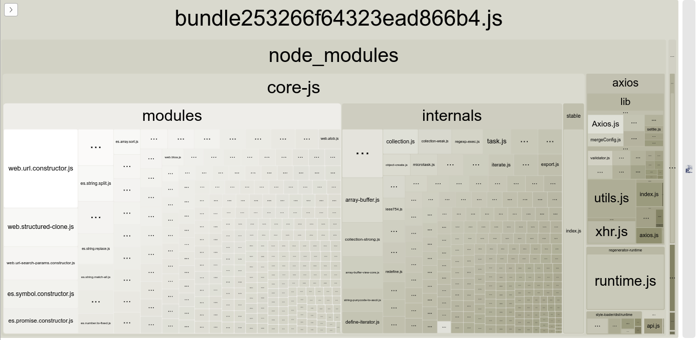

# What is [Webpack](https://webpack.js.org)?
Webpack is a free and open-source module bundler for JavaScript. It is made primarily for JavaScript, but it can transform front-end assets such as HTML, CSS, and images if the corresponding loaders are included. Webpack takes modules with dependencies and generates static assets representing those modules.

Since version 4.0.0, webpack does not require a configuration file (`webpack.config.js`) to bundle your project. Nevertheless, it is incredibly configurable to better fit your needs.

The current Webpack version during the time of this Reference Guide is v5.72.0

---

# Core Concepts
At its core, webpack is a static module bundler for modern JavaScript applications. When webpack processes your application, it internally builds a dependency graph from one or more entry points and then combines every module your project needs into one or more bundles, which are static assets to serve your content from.

To get started you only need to understand its Core Concepts:

- **[Entry](https://webpack.js.org/concepts/entry-points/)**
- **[Output](https://webpack.js.org/concepts/output/)**
- **[Loaders](https://webpack.js.org/concepts/loaders/)**
- **[Plugins](https://webpack.js.org/concepts/plugins/)**
- **[Mode](https://webpack.js.org/configuration/mode/)**
- **Browser Compatibility** - Webpack supports all browsers that are ES5-compliant (IE8 and below are not supported). Webpack needs Promise for import() and require.ensure(). If you want to support older browsers, you will need to load a polyfill before using these expressions.

---

# Basic Setup
- Install Webpack as a devDependency by using `npm i -D webpack webpack-cli`
- In `package.json` add the following to scripts: 
```
"scripts": {
    "build": "webpack --mode production" 
}
```
- Create a `webpack.config.js` file. The `--mode production` can be removed once `webpack.config.js` is added where `mode`, along with other configurations can be set. Add the following webpack configuration:

#### Syntax

In **`webpack.config.js`**
```
const path = require('path');
module.exports = {
    entry: './src/index.js',
    mode: 'development',
    output: {
        path: path.resolve(__dirname, 'dist'),
        filename: 'bundle.js'
    },
}
```

---

# Running Webpack
`npm run build` will build bundle the modules into a `main.js` by default in the `dist` folder. This `main.js` contains all the necessary scripts that we can ask the browser to run by adding a script tag to the `index.html`. The `build` is the same as `build` declared under `scripts` in `package.json`.

---

# [Loaders](https://webpack.js.org/concepts/loaders/)
Loaders are transformations that are applied to the source code of a module. They allow you to pre-process files as you import or “load” them. Thus, loaders are kind of like “tasks” in other build tools and provide a powerful way to handle front-end build steps. Loaders can transform files from a different language (like TypeScript) to JavaScript or load inline images as data URLs. Loaders even allow you to do things like import CSS files directly from your JavaScript modules!

### Case 1: Webpack to pre-process SASS to CSS for the browser

- **Install Dependencies**: `npm i -D sass style-loader css-loader sass-loader`
- **Add a `main.scss` file inside the styles folder.**
- **`import './styles/main.scss'` to `index.js`**
- **Add loaders to `webpack.config.js`**
  
The way we add loaders to the configuration file is through the following syntax:

#### Syntax

In **`webpack.config.js`**
```
const path = require('path');
module.exports = {
    // Add entry, mode and output
    
    module: {
        rules: [
            {
                test: /\.scss$/,
                use: [
                    'style-loader',
                    'css-loader',
                    'sass-loader'
                ]
            }
        ]
    }
}
```

**Where**,
- Loaders are declared using the `module` object.
- `rules` is an array containing loader configuration objects.
- Each loader configuration object contains a `test` property that is a regex that refers to the file extension.
- Each loader configuration object contains an `use` property that refers to the imported loader. Can be a string or an array. (*Note: Loaders are evaluated/executed from right to left (or from bottom to top). In the example below execution starts with sass-loader, continues with css-loader and finally ends with style-loader*)

---

# [Plugins](https://webpack.js.org/concepts/plugins/)
A webpack plugin is a JavaScript object that has an [apply](https://developer.mozilla.org/en-US/docs/Web/JavaScript/Reference/Global_Objects/Function/apply) method. This apply method is called by the webpack compiler, giving access to the entire compilation lifecycle.

Plugins are the backbone of webpack. Webpack itself is built on the same plugin system that you use in your webpack configuration!

They also serve the purpose of doing anything else that a loader cannot do. Webpack provides many **[such plugins](https://webpack.js.org/plugins/)** out of the box.

### Use Case 1: Using the [HTMLWebpackPlugin](https://webpack.js.org/plugins/html-webpack-plugin/) to build the HTML file with the scripts and CSS in the dist folder

- **Install Dependencies**: `npm i -D html-webpack-plugin`
- **Configure `webpack.config.js`**

#### Syntax

In **`webpack.config.js`**
```
const path = require('path');
const HTMLWebpackPlugin = require('html-webpack-plugin');

module.exports = {
    // Add entry, mode
    output: {
        path: path.resolve(__dirname, 'dist'),
        filename: 'bundle.js'
    }, 
    plugins: [
        new HTMLWebpackPlugin({
            title: 'Webpack App',
            template: './public/index.html',
            filename: 'index.html',
        })
    ]
}
```

**Where**,
- Plugins are declared using the `plugins` array.
- In case of the `html-webpack-plugin`, we initialize it with `new HTMLWebpackPlugin(options)` which takes in an `options` object. Check all the options **[HERE](https://github.com/jantimon/html-webpack-plugin#options)**
- `title` refers to the HTML title of the build file.
- `template` refers to a HTML template file that serves as reference for the build.
- `filename` refers to the created HTML file.
- The destination is the same as what is configured in the `path` property in the `output` object.
- The filename declared in output (here: `bundle.js` ) is to be added via a `script` tag at the end of the `head` tag.

---

# [Caching](https://webpack.js.org/guides/caching/)
So we're using webpack to bundle our modular application which yields a deployable /dist directory. Once the contents of /dist have been deployed to a server, clients (typically browsers) will hit that server to grab the site and its assets. The last step can be time consuming, which is why browsers use a technique called caching. This allows sites to load faster with less unnecessary network traffic. However, it can also cause headaches when you need new code to be picked up.

- Add the `[contenthash]` to the output filename. This generates a Hash which uniquely identifies the `bundle.js` file with a hash string, e.g. `bundle7880eebb0d7ed383141b.js` during build time. This is also auto-reflected in the script tag generated in the `index.html` in the `dist` folder.
- Delete the `dist` folder.
- `npm run build` to generate the `dist` folder from scratch, with the expected changes as mentioned above.
- If we run another build without making any changes, we'd expect that filename to stay the same.
- However, if we were to run it again, we may find that this is not the case. This is because webpack includes certain boilerplate, specifically the runtime and manifest, in the entry chunk.

#### Syntax

In **`webpack.config.js`**
```
const path = require('path');
module.exports = {
    entry: {
        bundle: './src/index.js'
    }
    mode: 'development',
    output: {
        path: path.resolve(__dirname, 'dist'),
        filename: '[name][contenthash].js'
    },
}
```

---

# [Webpack Dev Server](https://webpack.js.org/configuration/dev-server)
Let's create a Development server build with Webpack

- Add the `"dev": "webpack serve"` to `scripts` in `package.json` file.

```
"scripts": {
    "build": "webpack",
    "dev": "webpack serve"
}
```

- Run `npm run dev`. We will get a prompt from the `webpack-cli` that says:

> For using `serve` command you need to install: `webpack-dev-server` package.
> Would you like to install `webpack-dev-server` package? (That will run `npm install -D webpack-dev-server`) (Y/n)

- Press Y to install `webpack-dev-server` or install by running `npm install -D webpack-dev-server`.
- The default PORT is 8080.
- In the `webpack.config.json` add the following `devServer` options:

#### Syntax

In **`webpack.config.js`**
```
module.exports = {
    entry: {
        main: './src/index.js'
    },
    mode: 'development',
    output: {
        path: path.resolve(__dirname, 'dist'),
        filename: 'bundle[contenthash].js'
    },
    devServer: {
        static: {
            directory: path.resolve(__dirname, 'dist')
        },
        port: 3000,
        open: true,
        hot: true,
        compress: true,
        historyApiFallback: true
    },
}
```

**Where**,
- `devServer` contains the configuration for the `webpack-dev-server` that is launched by `npm run dev`.
- `static` is the new syntax for specifying the directory path. It's an object that contains the `directory` property which points to the directory.
- `port` is the localhost port on which to launch the server.
- `open: true` opens the browser on running `npm run dev`.
- `hot: true` sets Webpack's Hot Module Replacement feature to true.
- `liveReload: false` - By default, the dev-server will reload/refresh the page when file changes are detected. `devServer.hot` option must be disabled or `devServer.watchFiles` option must be enabled in order for liveReload to take effect. Disable `devServer.liveReload` by setting it to `false`.
- `compress: true` enables Gzip compression.
- [`historyApiFallback: true`](https://webpack.js.org/configuration/dev-server/#devserverhistoryapifallback) - When using the [HTML5 History API](https://developer.mozilla.org/en-US/docs/Web/API/History), the `index.html` page will likely have to be served in place of any `404` responses. Enable `devServer.historyApiFallback` by setting it to true:

**Note:** When you run the server, the dev server actually does not run the files from the `dist` folder but from memory.

---

# Cleaning Build files
If any changes are made to the `index.js` as mentioned above in the Caching section, the [contenthash] will change on the next `npm run build` command, and thus, a new `bundle.js` file with a new hash appended as `bundlexxxxxxxxxxxxx.js` will be created in the `dist` folder. 

To prevent this from happening, we can add the `clean: true` in the `output` options in `webpack.config.js`.

#### Syntax:

In **`webpack.config.js`**
```
module.exports = {
    entry: {
        main: './src/index.js'
    },
    mode: 'development',
    output: {
        path: path.resolve(__dirname, 'dist'),
        filename: 'bundle[contenthash].js',
        clean: true
    }
}
```

---

# Source Maps / Devtool
This option controls if and how source maps are generated.
Source Maps provide a map from a production code (`dist` folder) to your source code.
Source Maps are good for debugging as sometimes we get an error message with a line number that doesn't actually show where the actual problem is in your source code.

To enable source maps do the following:
- Set the property `devtool: 'source-map'` in the `module.exports` in `webpack.config.js`.
- Running `npm run build` will give us a `bundle-xxxxxxxx.js.map` source map which we can use in the browser and debug using `sources` in the console.

#### Syntax

In **`webpack.config.js`**
```
module.exports = {
    entry: {
        main: './src/index.js'
    },
    mode: 'development',
    output: {
        path: path.resolve(__dirname, 'dist'),
        filename: 'bundle[contenthash].js',
        clean: true
    },
    devtool: 'source-map'
}
```

---

# [Babel](https://babeljs.io/docs/en/) - Loader for Backward Compatibility in Browsers
Babel is a free and open-source JavaScript transcompiler that is mainly used to convert ECMAScript 2015+ code into a backwards compatible version of JavaScript that can be run by older JavaScript engines. Babel is a popular tool for using the newest features of the JavaScript programming language.

Here are the main things Babel can do for you:

- Transform syntax
- Polyfill features that are missing in your target environment (through a third-party polyfill such as core-js)
- Source code transformations (codemods)
- And more! (check out these videos for inspiration)


- Install the following dev dependencies: `npm i -D babel-loader @babel/core @babel/preset-env`
- Add rule for the loader under `modules` in the `webpack.config.js`. Be sure to `exclude: /node_modules/`

#### Syntax

In **`webpack.config.js`**
```
const path = require('path');
module.exports = {
    entry: {
        main: './src/index.js'
    },
    mode: 'development',
    output: {
        path: path.resolve(__dirname, 'dist'),
        filename: 'bundle[contenthash].js',
        clean: true,
    },
    module: {
        rules: [
            {
                test: /\.js$/,
                exclude: /node_modules/,
                use: {
                    loader: 'babel-loader',
                    options: {
                        presets: [`@babel/preset-env']
                    }
                }
            }
        ]
    }
}
```

# [Polyfill](https://babeljs.io/docs/en/babel-polyfill) to add async-await support
Without polyfilling, `async-await` may not work in the browser. We may have to use Promises `.then` syntax instead of the more verbose `async-await`.

#### Syntax

In **`generateJoke.js`** without polyfill

```
import axios from 'axios';

const generateJoke = () => {
    const jokeEl = document.getElementById('joke');
    axios.get('https://icanhazdadjoke.com/', {
        headers: {
            Accept: 'application/json'
        },
    })
    .then(({data: { joke }}) => joke ? jokeEl.innerHTML = joke : jokeEl.innerHTML = "Joke's on you!")
    .catch(error => error.message);
}
```


### What options do we have for polyfilling? 
As of Babel 7.4.0, `@babel/polyfill` package has been deprecated in favor of directly including `core-js/stable` (to polyfill ECMAScript features) and `regenerator-runtime/runtime` (needed to use transpiled generator functions):

- Install [`core-js`](https://www.npmjs.com/package/core-js) and [`regenerator-runtime`](https://www.npmjs.com/package/regenerator-runtime) as devDependencies: `npm i -D core-js regenerator-runtime`
- Import the `core-js/stable` and `regenerator-runtime/runtime` packages in the file.

#### Syntax

In **`generateJoke.js`** to polyfill **`async-await` using `core-js` and `regenerator-runtime`**

```
import axios from 'axios';
import "core-js/stable";
import "regenerator-runtime/runtime";

const generateJoke = async () => {
    const jokeEl = document.getElementById('joke');
    try {
        const { data: { joke} } = await axios.get('https://icanhazdadjoke.com/', {
            headers: {
                Accept: 'application/json'
            },
        })
        if(joke) jokeEl.innerHTML = joke;
        else jokeEl.innerHTML = 'No joke found';
    }
    catch(error) {
        console.log(error.message);
    }
}

export default generateJoke;
```

---

# Asset Resource Loader
Importing svgs and media assets may cause build errors. Webpack comes with an Asset Resource Loader to handle this.

- Add rule for the loader under `modules` in the `webpack.config.js`. Be sure to add the `type: 'asset/resource'` option.
- Add the `assetModuleFilename: '[name][ext]'` in the `output` options in `webpack.config.js`. Without this, the asset generated in the `dist` folder will have a random hash as the filename. E.g.: `imagexxxxxxxxxxxxx.svg`. `assetModuleFilename: '[name][ext]'` preserves the filename and extension.

#### Syntax

In **`webpack.config.js`**
```
const path = require('path');
module.exports = {
    entry: {
        main: './src/index.js'
    },
    mode: 'development',
    output: {
        path: path.resolve(__dirname, 'dist'),
        filename: 'bundle[contenthash].js',
        clean: true,
        assetModuleFilename: '[name][ext]'
    },   
    module: {
        rules: [
            {
                test: /\.(svg|png|jpg|jpeg|gif)$/i,
                type: 'asset/resource'
            }
        ]
    }
}
```

---

# Third Party Plugins - [Webpack Bundle Analyzer](https://www.npmjs.com/package/webpack-bundle-analyzer) (Optional)
Shows you all the packages used in the application and the space that they take.

- Install npm package as devDependency: `npm i -D webpack-bundle-analyzer`
- Import in `webpack.config.js`: `const BundleAnalyzerPlugin = require('webpack-bundle-analyzer').BundleAnalyzerPlugin`
- Initialize plugin as `newBundleAnalyzerPlugin()`
- Build project by running `npm run build`. Automatically opens a window to Port 8888 and shows a screen where all packages and the space taken by them are shown.



#### Syntax
```
const path = require('path');
const HTMLWebpackPlugin = require('html-webpack-plugin');
const BundleAnalyzerPlugin = require('webpack-bundle-analyzer').BundleAnalyzerPlugin;

const path = require('path');
const HTMLWebpackPlugin = require('html-webpack-plugin');

module.exports = {
    // Add entry, mode
    output: {
        path: path.resolve(__dirname, 'dist'),
        filename: 'bundle.js'
    }, 
    plugins: [
        new HTMLWebpackPlugin({
            title: 'Webpack App',
            template: './public/index.html',
            filename: 'index.html',
        }),
        newBundleAnalyzerPlugin()
    ]
}
```

---

# Glossary

- **Live Reload** - Triggers an app wide reload that listens to file changes.
- **Hot Module Replacement** - Is the same as Live Reload with the difference that it only replaces the modules that have been modified, hence the word Replacement. The advantage of this is that it doesn't lose your app state e.g. your inputs on your form fields, your currently selected tab etc. [Here's a full-blown explanation from another Stack Overflow answer](https://stackoverflow.com/questions/24581873/what-exactly-is-hot-module-replacement-in-webpack).
- **Hot Reloading** - Hot Reloading is just short for Hot Module Replacement. Here's a explanatory [video](https://youtu.be/2uQzVi-KFuc) which you can look at and differentiate LR from HMR.

---

# References
- **[Webpack Official Website](https://webpack.js.org)**
- **[Babel](https://babeljs.io)**
- **[Caching](https://en.wikipedia.org/wiki/Cache_(computing))**
- **[Hot Module Replacement](https://webpack.js.org/concepts/hot-module-replacement/)**